# 二、HTML 设计模式

本章只探讨与 CSS 相关的 HTML。它包含了用 CSS 设计文档样式的基本设计模式。它在高层次上探索 HTML，着眼于解释如何在结构和语义上使用元素。本书中的每个设计模式都是使用结合 CSS 的结构和语义元素创建的。设计模式中使用了四种主要类型的元素:结构块、终端块、多用途块和内联元素。理解这些类型的元素是理解本书中设计模式的关键，也是创建你自己的设计模式的基础。

### 章节大纲

*   HTML 结构显示了 HTML 元素如何一起工作来创建一个文档。
*   展示了如何用有效的 XHTML 标记文档。它还指出了为什么使用有效的 XHTML 会使 CSS 样式更加可靠。
*   DOCTYPE 展示了如何使用文档类型来验证文档的编码方式，并探索了什么样的文档类型最适合 CSS 和 HTML。
*   **Header Elements** 展示了如何创建关于文档的元数据，以及如何将文档链接到支持文档和相关文档。
*   **条件样式表**展示了如何加载一个样式表来修复 Internet Explorer 特有的问题。
*   **结构块元素**展示了如何在文档中创建结构意义。
*   **终端块元素**显示某些块如何具有语义，因为它们包含内容而不是其他块。
*   **多用途块元素**展示了某些元素如何用于块结构和语义。
*   **Inline Elements** 展示了样式如何展现语义标记的含义。
*   **Class 和 ID 属性**展示了 CSS 如何依靠`class`和`id`属性来选择元素。它还展示了`class`属性如何给元素增加意义。
*   HTML 空白显示了如何让空白为你所用，而不是对你不利。

### HTML 结构

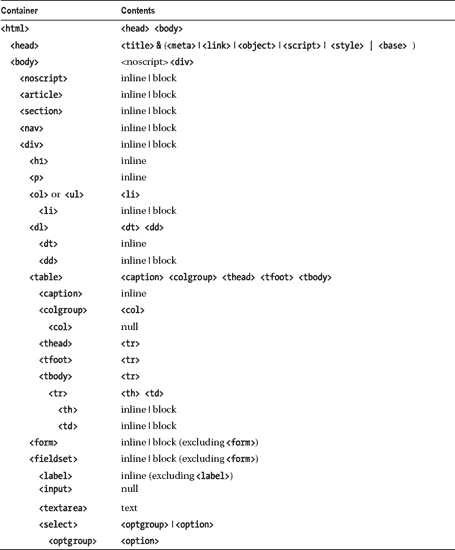

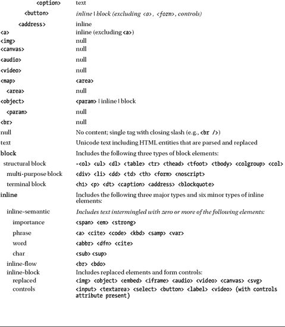

html 5 规范中包含了其他元素，但是我没有在前面的表格中列出它们，因为它们没有什么语义或结构意义，很少使用，或者有古怪的实现。以下元素样式文本:`<i>`、`<b>`、`<big>`、`<small>`。`<pre>`元素保留空白，但是它不能包含图像、对象、下标或上标。`<q>`元素根据不同的浏览器自动插入不同的引号。`<ins>`和`<del>`元素将元素标记为插入或删除。框架会给搜索引擎和用户带来问题:`<iframe>`、`<frameset>`、`<frame>`和`<noframe>`。Internet Explorer 7 不会删除`
`、`<fieldset>`和`<legend>`的内置样式，但以后的版本会。此外，从 SEO 的角度来看，传统的框架在显示时索引不好，因为内容通常是在位于单独框架中的控件之外进行索引的。同时，传统的框架集已经相当过时了。最后，`<base>`改变文档中所有链接的根——只有在你完全理解的情况下才使用它，否则它可能会断开你所有的链接。类似地，HTML5 草案规范中定义的许多其他元素要么还没有在浏览器中实现，要么仍在进行重大修订。

### HTML 结构

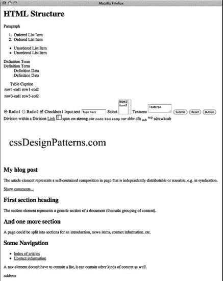

#### HTML

`<!DOCTYPE html>

<html lang="en">

<head><title>HTML Structure</title>
  <meta http-equiv="Content-type" content="text/html; charset=utf-8"/>
  <link rel="stylesheet" href="site.css" media="all" type="text/css"/>
  <link rel="stylesheet" href="page.css" media="all" type="text/css"/>
  <link rel="stylesheet" href="print.css" media="print" type="text/css"/>
  <!--[if lte IE 6]>
  <link rel="stylesheet" href="ie6.css" media="all" type="text/css"/>
  <![endif]-->
</head>
<body>
<noscript>Show this when script cannot run.</noscript>

  <h1>HTML Structure</h1>

  
Paragraph

  <ol>
    <li>Ordered List Item</li>
    <li>Ordered List Item</li>
  </ol>
  <ul>
    <li>Unordered List Item</li>
    <li>Unordered List Item</li>
  </ul>
  <dl>
    <dt>Definition Term</dt>
    <dt>Definition Term</dt>
    <dd>Definition Data</dd>
    <dd>Definition Data</dd>
  </dl>

  <table>
    <caption>Table Caption</caption>
    <colgroup>
      <col/>
      <col/>
    </colgroup>
    <thead>
    <tr>
      <td>row1-col1</td>
      <td>row1-col2</td>
    </tr>
    </thead>
    <tfoot>
    <tr>
      <td>row3-col1</td>
      <td>row3-col2</td>
    </tr>`
`    </tfoot>
    <tbody>
    </tbody>
  </table>

  <form id="form1" method="post" action="http://www.tipjar.com/cgi-bin/test">
    <input type="hidden" title="input hidden" name="hidden" value="Secret"/>

    <input id="radio1" name="radios" type="radio" value="radio1" checked="checked"/>
    <label for="radio1">Radio1</label>

    <input id="radio2" name="radios" type="radio" value="radio2-pushed"/>
    <label for="radio2">Radio2</label>

    <input id="xbox1" name="xbox1" type="checkbox" value="xbox1" checked="checked"/>
    <label for="xbox1">Checkbox1</label>

    <label for="inputtext">Input-text</label>
    <input id="inputtext" name="inputtext" type="text" value="Type here" size="14"/>

    <label for="select1">Select</label>
    <select id="select1" name="select" size="2">
      <option selected="selected" value="item1">Item1</option>
      <option value="item2">Item2</option>
    </select>

    <label for="textarea">Textarea</label>
    <textarea id="textarea" name="textarea" rows="2" cols="10">Textarea</textarea>

    <input type="submit" id="submit1" name="submit1" value="Submit"/>
    <input type="reset" id="reset1" name="reset1" value="Reset"/>
    <button type="submit" id="button1" name="button1" value="Button1">Button</button>
  </form>

  
Division within a Division <a id="link1" href="left.html">Link</a>
    
    <map id="map1" name="map1">
      <area href="left.html" alt="left" shape="rect" coords="0,0,10,20"/>
      <area href="right.html" alt="right" shape="rect" coords="10,0,20,20"/>
    </map>

    span
    <em>em</em>
    <strong>strong</strong>
    <cite>cite</cite>
    <code>code</code>
    <kbd>kbd</kbd>
    <samp>samp</samp>
    <var>var</var>
    <abbr>abbr</abbr>
    <dfn>dfn</dfn>
    sub
    sup
    <bdo dir="rtl">backwards</bdo>`

`    <object type="application/x-shockwave-flash">
      <param name="movie" value="http://myserver.com/movie.swf">
      <param name="allowfullscreen" value=true>
    </object>
  

  <article>
    <header>
      <h1>My blog post</h1>

      

        <time pubdate datetime="2011-10-07T10:00-08:00"></time>
      

    </header>
    
The article element represents a self-contained composition in page that is independently distributable or
      reusable, e.g., in syndication.

    <footer>
      <a href="?comments=1">Show comments...</a>
    </footer>
  </article>
  <section>
    <h1>First section heading</h1>

    

      The section element represents a generic section of a document (thematic grouping of
content).
    

  </section>
  <section>
    <h1>And one more section</h1>

    
A page could be split into sections for an introduction, news items, contact
information, etc.

  </section>
  <nav>
    <h1>Some Navigation</h1>
    <ul>
      <li><a href="articles.html">Index of articles</a></li>
      <li><a href="contact.html">Contact information</a></li>
    </ul>
    
A nav element doesn't have to contain a list; it can contain other kinds of content as
well.

  </nav>
  <address>address</address>

</body>
</html>`

#### CSS

`/* There are no CSS styles attached to this document. */`

#### HTML 结构

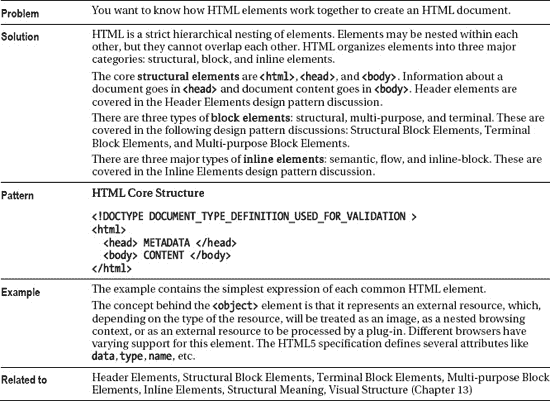

### XHTML

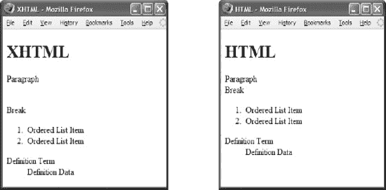

#### 有效的 XHTML

`**<!DOCTYPE html >**

**<html lang="en">**
 <head><title>XHTML</title>
  <meta http-equiv=**"Content-type"** content="text/html; charset=utf-8" />
  <link rel=**"stylesheet"** href=**"page.css"** media=**"all"** type="text/css" />
 **</head>**
 <body>
  <h1>XHTML</h1> 
Paragraph**
  **Break
  <ol> <li>Ordered List Item**</li>**   <li>Ordered List Item**</li>**   </ol>
  <dl> <dt>Definition Term**</dt>**     <dd>Definition Data**</dd>**     </dl>
 **</body>**
**</html>**`

#### 有效的 HTML

`**<!DOCTYPE html >**

<html lang=**”en”** >
 <head><title>HTML</title>
  <meta http-equiv=**Content-type** content="text/html; charset=utf-8" >
  <link rel=**stylesheet** href=**page.css** media=all type="text/css" >
 <body>
  <h1>HTML</h1> **
**Paragraph ** **Break
  <ol> **<li>**Ordered List Item   **<li>**Ordered List Item </ol>
  <dl> **<dt>**Definition Term     **<dd>**Definition Data   </dl>`

#### XHTML

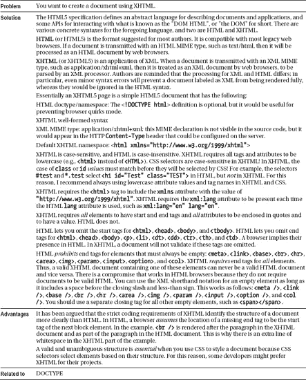

### 文档类型

#### HTML

`<!-- The following DOCTYPEs place the browser in almost-standards mode.
     The first one is for XHTML, the second one is for HTML 4, and the
        third one for HTML5 (browser support varies).
 -->

<!DOCTYPE html PUBLIC "-//W3C//DTD XHTML 1.0 Transitional//EN"
               "http://www.w3.org/TR/xhtml1/DTD/xhtml1-transitional.dtd">

<!DOCTYPE HTML PUBLIC "-//W3C//DTD HTML 4.01 Transitional//EN"
              "http://www.w3.org/TR/html4/loose.dtd">
<!DOCTYPE html >`

**内容类型与文档类型**

Web 服务器用一个 **MIME 内容类型**来标识它们提供的每个文档。MIME 代表多部分互联网邮件扩展。内容类型在文档的 HTTP 头中标识。浏览器根据文档的 MIME 内容类型决定如何处理文档。当它获得一个内容类型为`"text/html"`的文档时，它将该文档呈现为 HTML。

根据 W3C 题为“XHTML 媒体类型”(`[www.w3.org/TR/xhtml-media-types/](http://www.w3.org/TR/xhtml-media-types/)`)的说明，web 服务器可以提供以下三种内容类型之一的 XHTML。

*   只要您不希望浏览器将一个 XHTML 文档视为 XML，并且不包含来自其他 XML 名称空间(如 MathML)的内容，就可以将该文档用作`"text/html"`。接收具有这种内容类型的 XHTML 文档的浏览器将该文档视为 HTML。
*   XHTML 应该作为`"application/xhtml+xml"`。不幸的是，Internet Explorer 7 和早期版本拒绝显示以这种方式提供的页面。
*   XTHML 可以作为`"application/xml"`或者`"text/xml"`。不幸的是，Internet Explorer 7 和更早的版本将这样的文档识别为通用 XML，这意味着它们忽略了所有的 XHTML 语义。这意味着链接和表单不起作用，并且呈现文档需要更长的时间。

Gecko 浏览器在完全下载并且完全没有编码错误之后，只呈现一个使用 XML 内容类型*的文档*。它还以严格模式呈现文档，而不考虑其文档类型(见`[www.mozilla.org/docs/web-developer/faq.html#accept](http://www.mozilla.org/docs/web-developer/faq.html#accept)`)。

目前，为 XHTML 网页提供服务的最可靠的内容类型是`"text/html"`。这告诉浏览器将文档呈现为 HTML。W3C 支持这种方法，它在所有主流浏览器中都运行良好。它之所以有效，是因为浏览器不验证 HTML。它们解析网页的方式允许它们显示任何版本的 HTML 和 XHTML——包括包含错误的文档。与浏览器处理 XHTML 文档的方式形成对比，当出现错误时，XML 规则禁止浏览器呈现整个 XHTML 文档——即使是由意外输入造成的最小错误！这样的精度对于计算机对计算机的交易来说是必不可少的，但是对于人工生成的网页来说就不好了。

#### 文档类型

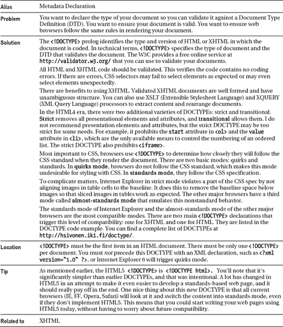

### 表头元素

#### HTML

`<!DOCTYPE html PUBLIC "-//W3C//DTD XHTML 1.0 Transitional//EN"
  "http://www.w3.org/TR/xhtml1/DTD/xhtml1-transitional.dtd">

<html xml:lang="en" lang="en" >

 <head>
  <title>Header Elements</title>

  **<meta http-equiv="Content-type" content="text/html; charset=utf-8" />**

  <!-- Include links to stylesheets -->
  **<link rel="stylesheet" href="site.css"   media="all"    type="text/css" />**
  **<link rel="stylesheet" href="page.css"   media="all"    type="text/css" />**
  **<link rel="stylesheet" href="print.css"  media="print"  type="text/css" />**
  **<!--[if lte IE 6]>**
  **<link rel="stylesheet" href="ie6.css"    media="all"    type="text/css" />**
  **<![endif]-->**

  <!-- Optionally include alternate style sheets that the user can apply. -->
  <link rel="alternate stylesheet" type="text/css" title="cool" href="cool.css" />
  <link rel="alternate stylesheet" type="text/css" title="hot"  href="hot.css"  />

  <!-- Optionally include style rules that apply only to this page. -->
  ****

  <!-- Optionally link to a JavaScript file. -->
  ****

  <!-- Optionally include JavaScript that applies only to this page. -->
  ****

 </head>

 <body>  <h1>Header Elements</h1>  </body>
</html>`

#### 表头元素

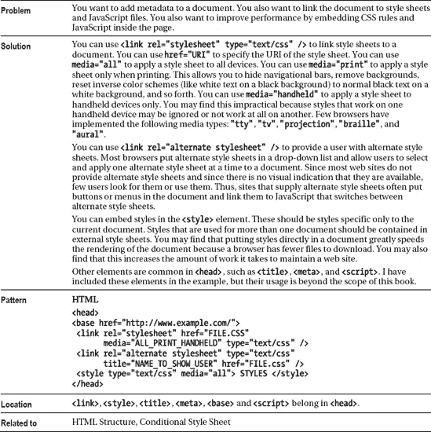

### 条件样式表

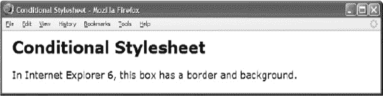

*在 Firefox 中呈现，没有条件样式表*

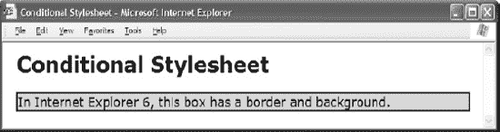

*使用条件样式表*在 Internet Explorer 中呈现

#### HTML

`<html xml:lang="en" lang="en" >

 <head><title>Conditional Stylesheet</title>
  <meta http-equiv="Content-type" content="text/html; charset=utf-8" />
  **<link rel="stylesheet"  href="page.css"   media="all"    type="text/css" />**
  **<!--Embed the following style sheet  only in IE 6 and higher-->**
  **<!--[if gt IE 5.5]>**
   **<link rel="stylesheet" href="ie6.css"    media="all"    type="text/css" />**
  **<![endif]-->**
 </head>

 <body>
  <h1>Conditional Stylesheet</h1>
  
In Internet Explorer 6, this box has a border and background.

 </body>
</html>`

#### CSS page.css

`***.test  { font-size:18px; }**`

#### CSS ie6.css

`***.test  { border:2px solid black; background-color:gold; }**`

#### 条件样式表

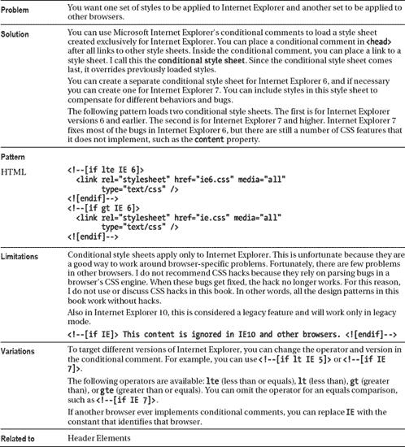

### 结构块元素

#### HTML 模式

`<!-- Ordered List -->
  **<ol>**
    **<li>**                            </li>
    <li>  One or more list items... </li>
  </ol>

<!-- Unordered List -->
  **<ul>**
    **<li>**                            </li>
    <li>  One or more list items... </li>
  </ul>

<!-- Definition List -->
  **<dl>**
    **<dt>**                                  </dt>
    <dt>  One or more definition terms... </dt>
    **<dd>**                                  </dd>
    <dd>  One or more definitions...      </dd>
  </dl>

<!-- Table -->
  **<table>**
   <caption> One optional caption per table. </caption>
   **<colgroup> <col />** <col /> </colgroup>
    **<thead>**
      **<tr>**
        **<th>** One or more header cells in a **row...**  </th>
        **<td>** One or more data cells  in a **row...**   </td>
      </tr>
    </thead>
    **<tfoot>**
      <tr>
        <th> One or more rows in a row group...    </th>
        <td>                                       </td>
      </tr>
    </tfoot>
    **<tbody>**
      <tr>
        <th> Zero or more row groups in a table... </th>
        <td>                                       </td>
      </tr>
    </tbody>
  </table>

<!-- Divisions -->
  
 
 
 ... 
 
 
`

#### 结构块元素

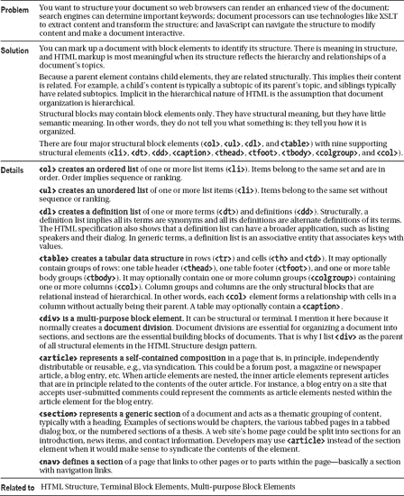

### 端子板元件

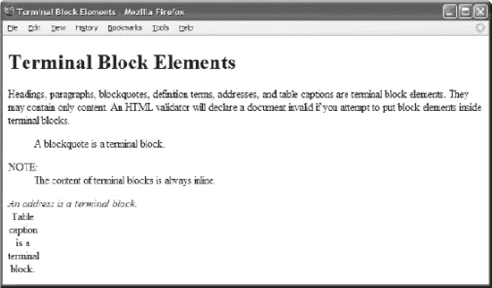

#### HTML

`**<h1>**Terminal Block Elements</h1>

**
**
  Headings, paragraphs, blockquotes, definition terms, addresses,
  and table captions are terminal block elements. They may contain only content.
  An HTML validator will declare a document invalid if you attempt
  to put block elements inside terminal blocks.

**<blockquote>**   A blockquote is a terminal block. </blockquote>

<dl>
  **<dt>NOTE:</dt>**
  <dd>The content of terminal blocks is always inline.</dd>
</dl>

**<address>**      An address is a terminal block.   </address>

<table>
** <caption>Table caption is a terminal block.</caption>**
 <tr><td></td></tr>
</table>`

#### 端子板元件

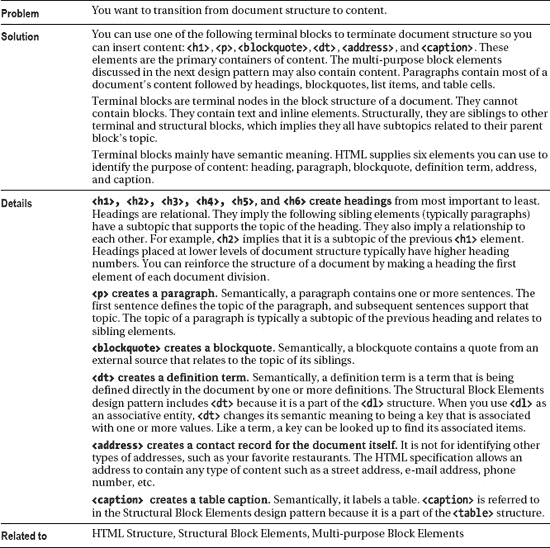

### 多用积木元件

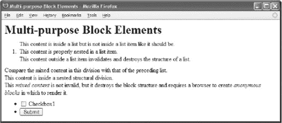

#### HTML

`<noscript>Show this text when script cannot run.</noscript>

 

  <h1>Multi-purpose Block Elements</h1>
 

<!-- The following code is invalid HTML and broken structure. -->
**<ol>**
  This content is inside a list but is not inside a list item like it should be.
  **<li> This content is properly nested in a list item. </li>**
  This content outside a list item invalidates and destroys the structure of a list.
**</ol>**

<!-- The following code is _valid_ HTML due to a loophole in HTML's DTD,
     but is still broken structure. -->
**
**
  Compare the mixed content in this division with that of the preceding list.
**  
 This content is inside a nested structural division. 
**
  This <em>mixed content</em> is not invalid, but it destroys the block structure
  and requires a browser to create <em>anonymous blocks</em> in which to render it.
**
**

<!-- The following form contains blocks, which in turn contain controls. -->
<form id="form1" method="post" action="http://www.apress.com/cgi-bin/test" >
 <ul>
  <li> <input type="checkbox" id="xbox1" name="xbox1" value="xbox1" />
       <label for="xbox1">Checkbox1</label></li>
  <li> <input type="submit" id="submit1" name="submit1" value="Submit" /> </li>
 </ul>
</form>`

#### 多用积木元件

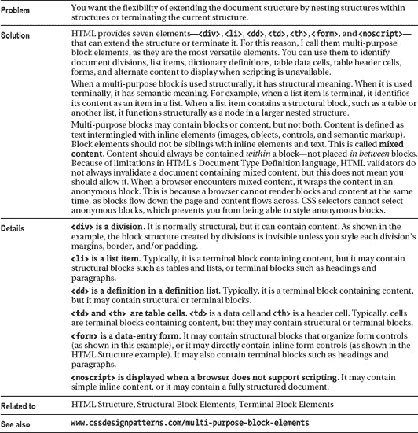

### 行内元素

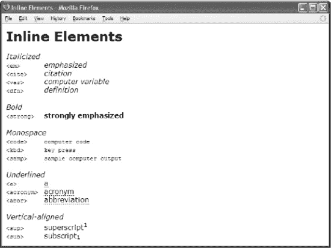

#### HTML

` <h1>Inline Elements</h1>
 <h2>Italicized</h2>
 <code>&lt;em&gt;      </code>  **<em>emphasized</em>**                    
 <code>&lt;cite&gt;    </code>  **<cite>citation</cite>**                  
 <code>&lt;var&gt;     </code>  **<var>computer variable</var>**           
 <code>&lt;dfn&gt;     </code>  **<dfn>definition</dfn>**                  

 <h2>Bold</h2>
 <code>&lt;strong&gt;  </code>  **<strong>strongly emphasized</strong>**   

 <h2>Monospace</h2>
 <code>&lt;code&gt;    </code>  **<code>computer code</code>**             
 <code>&lt;kbd&gt;     </code>  **<kbd>key press</kbd>**                   
 <code>&lt;samp&gt;    </code>  **<samp>sample computer output</samp>**    

 <h2>Underlined</h2>
 <code>&lt;a&gt;       </code>  **<a href="#">a</a>**                      
  <code>&lt;abbr&gt;    </code>  **<abbr title="a" >abbreviation</abbr>**   

 <h2>Vertical-aligned</h2>
 <code>&lt;sup&gt;     </code>  superscript**1**                
 <code>&lt;sub&gt;     </code>  subscript**1**                  `

#### 行内元素

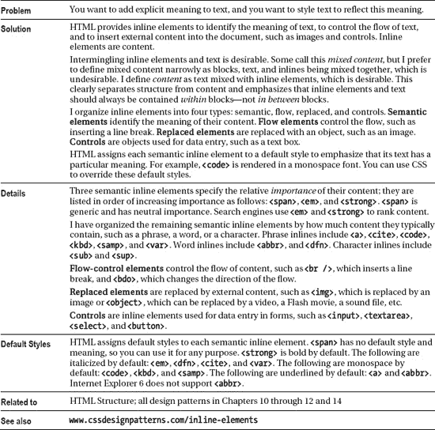

### 类和 ID 属性

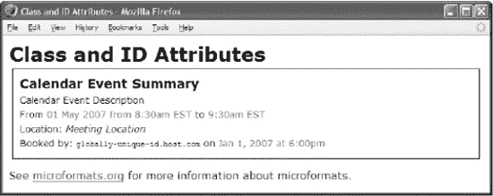

#### HTML

` <h1>Class and ID Attributes</h1>

 

  <h3 **class="summary"**>Calendar Event Summary</h3>

  
Calendar Event Description

  
From
   01 May 2007 from 8:30am EST to
   9:30am EST

  
Location:  Meeting Location

  
Booked by: globally-unique-id.host.com
     on Jan 1, 2007 at 6:00pm

 

 
See <a href="http://microformats.org/wiki/hcalendar">microformats.org</a>
  for more information about microformats.
`

#### CSS

`***.vevent p**          { margin:0 0 5px 0; font-size:0.9em; }
***.vevent h3**         { margin:0 0 5px 0; }
*.vevent ***.location** { font-style:italic; }
*.vevent ***.uid**      { font-family:monospace; }
*.vevent ***.dtstart,**
*.vevent ***.dtend,**
*.vevent ***.dtstamp**  { color:green; }

**#hcalendar1** { margin:5px; border:1px solid black; padding:10px; }`

#### 类和 ID 属性

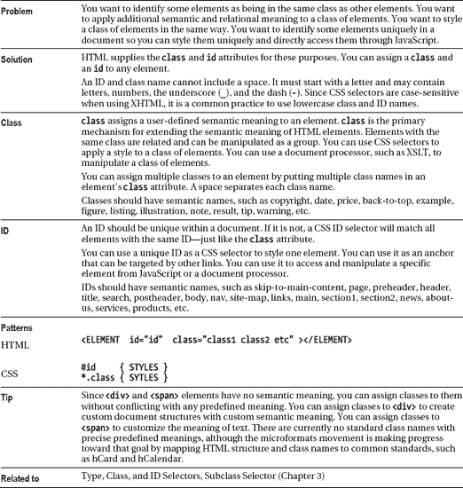

### HTML 空白

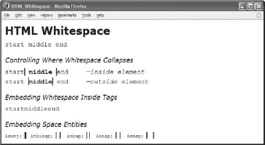

#### HTML

`<h1>HTML Whitespace</h1>

     start    middle  &#x0020; &#x0009;  **     **
                                      &#x000A; &#x000D;    end      

<h2>Controlling Where Whitespace Collapses</h2>

**start  middle  end**<em>—inside element</em>

**start  middle  end**<em>—outside element</em>

<h2>Embedding Whitespace Inside Tags</h2>
 
start**<span**
          **class**
           =
            **"spaced"**
             >middle**</span**
              >end

<h2>Embedding Space Entities</h2>
<code>&amp;zwnj;   </code>**&zwnj;**    &nbsp;
<code>&amp;thinsp; </code>**&thinsp;**  &nbsp;
<code>&amp;nbsp;   </code>**&nbsp;**    &nbsp;
<code>&amp;ensp;   </code>**&ensp;**    &nbsp;
<code>&amp;emsp;   </code>**&emsp;**    &nbsp;`

#### CSS

`em { padding-left:50px; }
p { font-family:monospace; font-size:18px; }

*.border { font-weight:bold;
  border-left:2px solid black; border-right:2px solid black; }`

#### HTML 空白

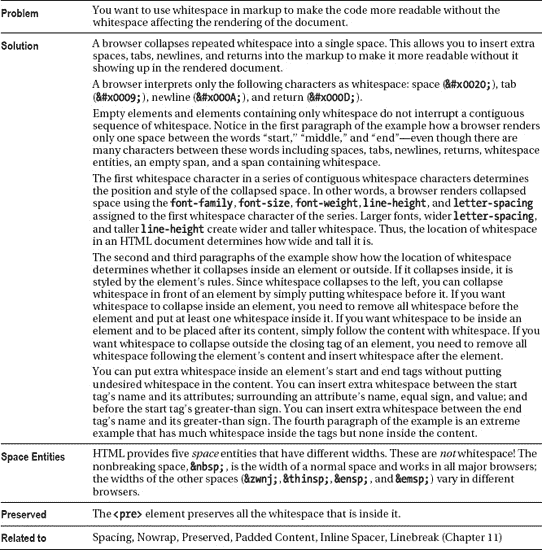