# 三、CSS 选择器和继承

本章介绍了选择样式元素的设计模式。

因为选择器设计模式很简单，所以我分组讨论选择器设计模式，而不是一次讨论一个。这使得比较和对比选择器的相关形式变得容易。因此，尽管这一章只有六个例子，但它包含了十三个不同的设计模式。

本章包含了继承，因为它只是一种选择后代元素的内置方式。继承与后代选择器密切相关。可视继承模式包含在本章中，因为它是一种本质上可视的继承形式。

### 章节大纲

*   **类型、类和 ID 选择器**展示了如何通过标签、类和 ID 选择元素。
*   **位置和组选择器**显示了如何通过元素在文档中的嵌套方式来选择元素。它还展示了如何将多个选择器应用于同一组规则。
*   **属性选择器**展示了如何根据属性选择元素。
*   **伪元件选择器**显示如何选择端子板元件的第一个字母或第一行。
*   **伪类选择器**展示了当一个超链接未被访问、被访问、被鼠标悬停、或者因为用户用鼠标点击它而获得焦点时，如何设计它的样式。
*   **子类选择器**展示了如何使用类和子类将多个样式应用到同一个元素。
*   **继承**展示了如何通过分配给祖先的规则来设计元素的样式。
*   **视觉继承**显示元素如何视觉继承其父元素的背景。

### 类型、类别和 ID 选择器

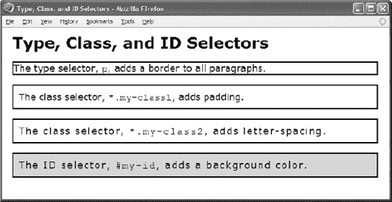

#### HTML

` <h1>Type, Class, and ID Selectors</h1>

 
The type selector, <code>p</code>, adds a border to all paragraphs.

 **
**
  The class selector, <code>*.my-class1</code>, adds padding.

 **
**
  The class selector, <code>*.my-class2</code>, adds letter-spacing.

 **
**
  The ID selector, <code>#my-id</code>, adds a background color. 
`

#### CSS

`**p** { border:2px solid black; }

***.my-class1** { padding:10px; }
***.my-class2** { letter-spacing:0.11em; }

**#my-id** { background-color:gold; }`

#### 类型、类别和 ID 选择器

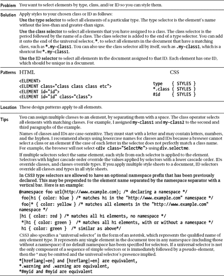

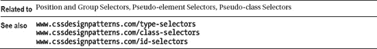

### 位置和组选择器

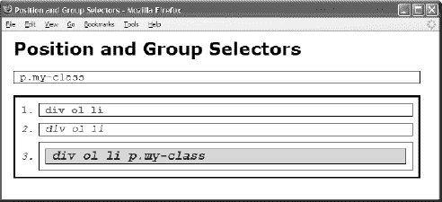

#### HTML

` <h1>Position and Group Selectors</h1>

 **
**p.my-class

 **
**
  **<ol>**
   **<li>**div ol li</li>
   **<li>**div ol li</li>
   **<li>**
    **
**div ol li p.my-class 

   </li>
  </ol>
 

CSS
/* Group Selectors */
**p,ol,li** { border:1px solid black; padding-left:10px; font-family:monospace;
  margin:10px; margin-left:0px; }
ol { margin-left:0px; padding-left:40px; margin-top:20px; }

/* Position Selectors */
**div *.my-class** { font-size:1.2em; font-weight:bold; }  /* Descendant  Selector */
**#my-id   p** { background-color:gold; }                  /* Descendant  Selector */
**#my-id >** * { border:3px solid black; }                 /* Child       Selector */

**:root** {background: white;} /* Root Selector */
**li:nth-child**(2n+1) /* Nth-child Selector */
**li:nth-last-child**(-n+2)    /* Nth-last-child Selector */
**li:nth-of-type**(2n+1) { float: right; } /* Nth-of-type Selector */

**li:nth-last-of-type**(2n+1) { float: right; } /* Nth-last-of-type Selector */
**li:first-child** { font-weight:bold; color:red; }        /* Fiwrst-child Selector */
**li:last-child** { font-weight:bold; color:red; }        /* Last-child Selector */
**ul li:first-of-type** {color: red} /*  First-of-type Selector */
**tr > td:last-of-type**  /*  Last-of-type Selector */
**li:only-child** /* Only-child Selector */
**div:only-of-type** /* Only-of-type Selector */
**p:empty** {display: hidden} /* Empty Selector */
**li + li** { font-style:italic; color:blue; }             /* Sibling     Selector */`

#### 位置和组选择器

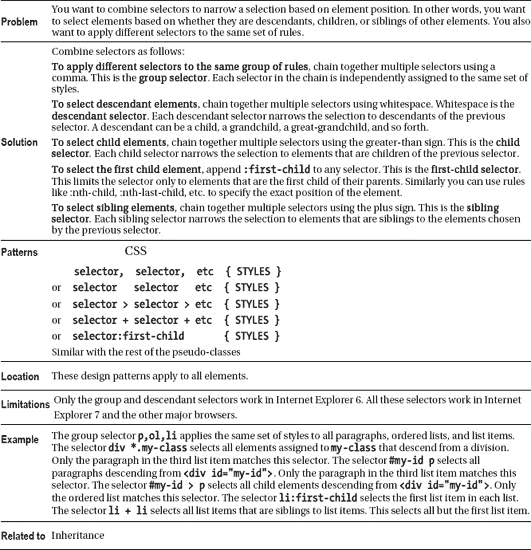

### 属性选择器

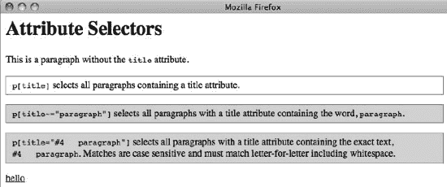

#### HTML

` <h1>Attribute Selectors</h1>

 
This is a paragraph without the <code>title</code> attribute.

 **
**
  <code>p[title]</code> selects all paragraphs containing a title attribute.

 **
**
  <code>p[title~="paragraph"]</code> selects all paragraphs with a
  title attribute containing the word, <code>paragraph</code>.

 **
**
  <code>p[title="#4   paragraph"]</code> selects all paragraphs with a
  title attribute containing the exact text, <code>#4   paragraph</code>. Matches
  are case-sensitive and must match letter-for-letter including whitespace.

<a href="http://www.example.com” target="_blank" hreflang="en-GB">hello</a>`

#### CSS

`code { white-space:pre; }

**p[title]** { padding:5px 10px; border:1px solid gray; }
**p[title~="paragraph"]** { background-color:gold; }
**p[title="#4   test paragraph"]** { font-weight:bold; }
**a[href="http://www.example.com"]**[target="_blank"] { font-weight:bold; }
**p[type^="#4"]** {color: grey }
**a[href$=".com"]** { font-weight:bold; }
**p[title*="test"]** { font-weight:bold; }`

#### 属性选择器

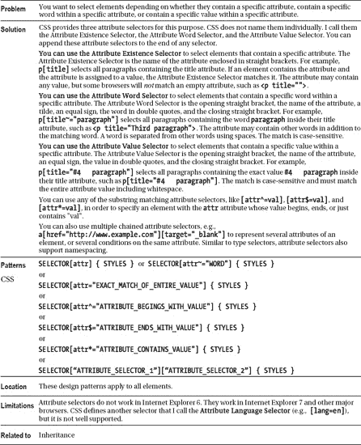

### 伪元素选择器

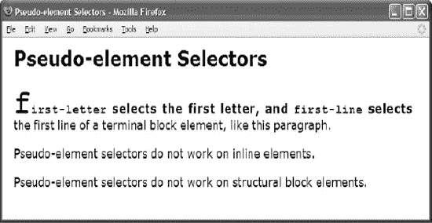

#### HTML

` <h1>Pseudo-element Selectors</h1>

 **
**<code>first-letter</code> selects the first letter, and
    <code>first-line</code> selects the first line of a terminal block element,
    like this paragraph.

 
****Pseudo-element selectors do not work on inline elements.

 **<dl>**
  <dt>Pseudo-element selectors do not work on structural block elements.</dt>
 </dl>`

#### CSS

`p:first-line { font-weight:bold; word-spacing:2px; letter-spacing:1px; }
p:first-letter { font-size:48px; }
span:first-line { font-weight:bold; word-spacing:2px; letter-spacing:1px; }
span:first-letter { font-size:48px; }

dl:first-line { font-weight:bold; word-spacing:2px; letter-spacing:1px; }
dl:first-letter { font-size:48px; }`

#### 伪元素选择器

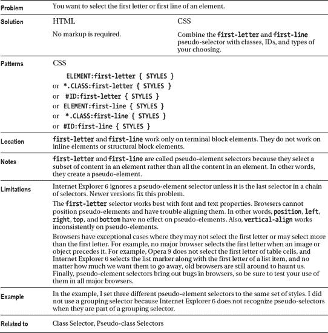

### 伪类选择器

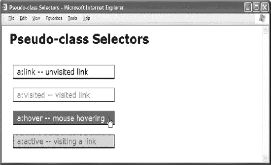

#### HTML

` <h1>Pseudo-class Selectors</h1>

 

  <a href="http://www.cssdesignpatterns.com">a:link -- unvisited link</a>
  <a href="http://www.htmldesignpatterns.com">a:visited -- visited link</a>
  <a href="http://www.cssdesignpatterns.com">a:hover -- mouse hovering</a>
  <a href="http://www.cssdesignpatterns.com">a:active -- visiting a link</a>
 
`

#### CSS

`a { padding:3px 10px; margin:20px 10px; text-decoration:none;
  display:block; width:260px;
  border-left:1px solid dimgray; border-right:2px solid black;
  border-top:1px solid dimgray;  border-bottom:2px solid black;  }

**a:link** { color:black; background-color:white; }
**a:visited** { color:gray;  background-color:white; }
**a:hover** { color:white; background-color:green; }
**a:active, a:focus** { color:green; background-color:gold; }`

#### 伪类选择器

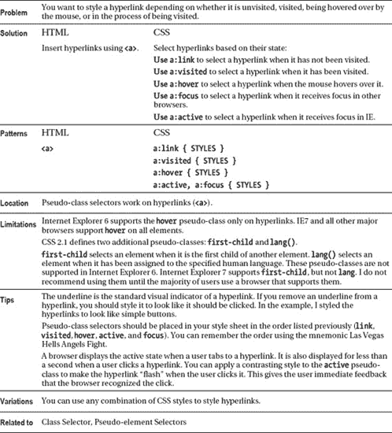

### 子类选择器

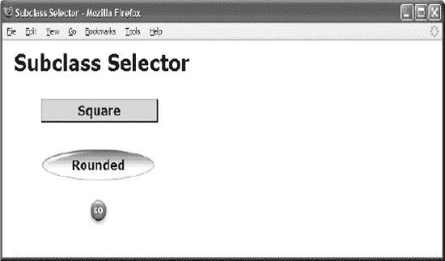

#### HTML

` <h1>Subclass Selector</h1>

 

  
Square

  
Rounded

  
Go

 
`

#### CSS

`***.button** { width:175px; padding:3px 10px; margin:20px 0; text-align:center;
  font-weight:bold; margin-left:50px; line-height:normal; }

***.button.square**  { color:darkblue; background-color:gold;
  border-left:1px solid dimgray; border-right:2px solid black;
  border-top:1px solid dimgray;  border-bottom:2px solid black; }

***.button.rounded** { color:darkblue; background-color:white;
  line-height:45px; margin-top:30px;
  background:url("oval.gif") no-repeat center center; }

***.button.go** { background-color:white; line-height:26px;
  text-indent:-9999px; font-size:10px;
  background: url("go.jpg") no-repeat center center; }`

#### 子类选择器

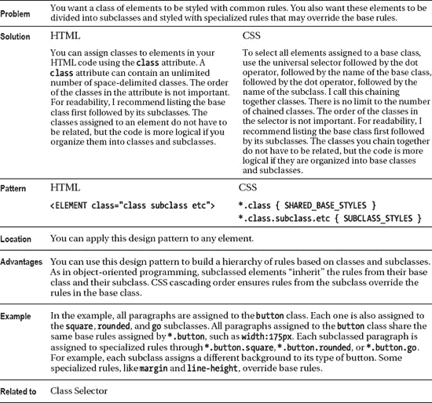

### 继承

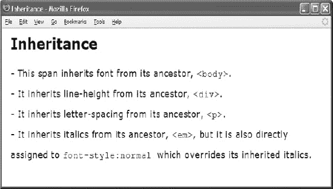

#### HTML

`**<body>**
 <h1>Inheritance</h1>

 **
**
  **
**
   **<em>**
    ****
     - This span inherits font from its ancestor, <code>&lt;body&gt;</code>.  
     - It inherits line-height from its ancestor, <code>&lt;div&gt;</code>.   
     - It inherits letter-spacing from its ancestor, <code>&lt;p&gt;</code>.  
     - It inherits italics from its ancestor, <code>&lt;em&gt;</code>,
       but it is also directly assigned to <code>font-style:normal </code>, which
       overrides its inherited italics.
    
   </em>
  

 

</body>`

#### CSS

`**body** { font-family:verdana,arial,sans-serif; font-size:18px; }
**div** { line-height:2em; }
**p** { letter-spacing:0.8px; }
**em** { font-style:italic; }
**span** { font-style:normal; }`

#### 继承

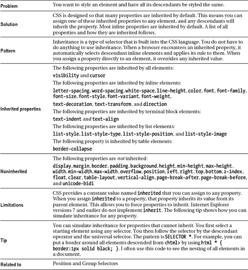

### 视觉继承

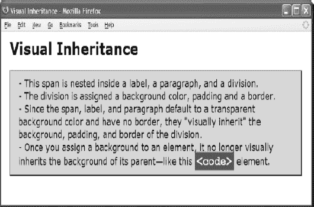

#### HTML

` <h1>Visual Inheritance</h1>
 **
**
  

   <label>
    
     - This span is nested inside a label, a paragraph, and a division.  
     - The division is assigned a background color, padding, and a border.  
     - Since the span, label, and paragraph default to a transparent background
       color and have no border, they "visually inherit" the
       background, padding, and border of the division.  
     - Once you assign a background to an element, it no longer visually inherits
       the background of its parent—like this <code>&lt;code&gt;</code> element.
    
   </label>
  

 
`

#### CSS

`**div { background-color:gold; color:black; padding:10px 20px;**
  **border-left:1px solid gray; border-right:2px solid black;**
  **border-top:1px solid gray; border-bottom:2px solid black; }**

p { background-color:transparent; background-image:none; }
label { background-color:transparent; background-image:none; }
span { background-color:transparent; background-image:none; }

**code { background-color:firebrick; color:white; }**`

#### 视觉继承

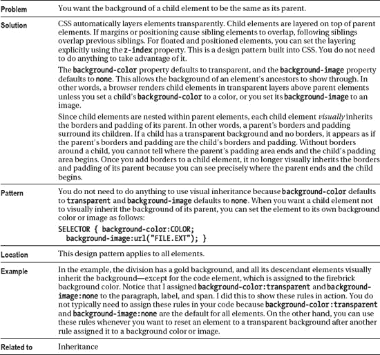