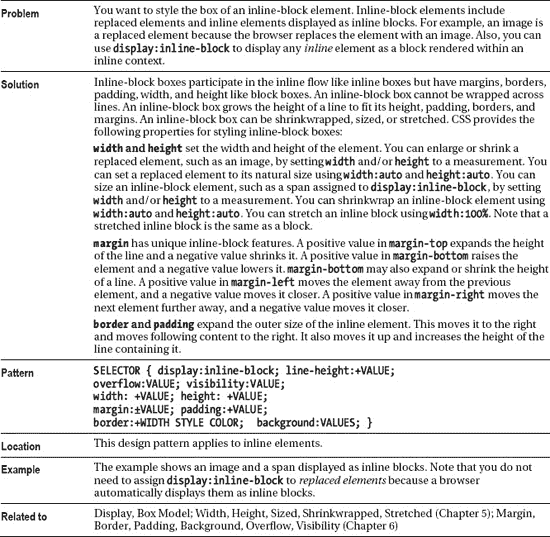

# 四、盒子模型

CSS 中的基本设计模式是**盒子模型**。盒子模型定义了元素如何呈现为盒子。有六种主要类型的盒子:内嵌、内嵌块、块、表、绝对和浮动。浏览器将每个元素呈现为这些框中的一个。有些元素呈现在这些框的变体中，如列表项或表格单元格。例如，`list-item`是浏览器自动创建的带有内嵌标记的块框，`table-cell`是不支持边距的块框。

您可以使用`display`属性将元素呈现为不同类型的框。您可以使用`position:absolute`或`position:fixed`将任何元素呈现为绝对框。您可以使用`float:left`或`float:right`规则将任何元素呈现为浮动框。

这是盒子模型三章中的第一章。本章解释了六种主要的盒子类型。第五章介绍范围，由`width`和`height`控制。范围控制长方体是收缩到其内容、调整大小还是拉伸到其容器的侧面。第六章介绍盒模型属性:`margin`、`border`、`padding`、`background`、`overflow`、`visibility`、`page-break-before`、`page-break-after`。背景、可见性和分页符在所有框中都是一样的。除了内嵌以外，边框、填充和溢出在所有框中都是一样的。宽度、高度和边距在每种类型的框中有不同的作用。

### 章节大纲

*   **Display** 展示了如何将一个元素呈现为一个内嵌框、一个块框、一个内嵌块框、一个列表项框、一个表格框，或者根本不呈现。
*   **盒子模型**介绍了所有类型盒子的通用盒子模型。
*   **内嵌框**展示了内嵌框是如何工作的。
*   **内嵌块框**展示了内嵌块和被替换的内嵌块是如何工作的。
*   **块盒**显示块盒如何工作。
*   **表格框**展示表格框如何工作。
*   **绝对框**展示了绝对框和固定框是如何工作的。
*   **浮动框**展示了浮动框的工作原理。

### 显示

#### HTML

` <h1>Display</h1>

 <code>display:inline</code>
 **
**p
 
p
 
p

 **<ol>**<li>li</li><li>li</li><li>li</li></ol>
 **<table>**<tr><td>td</td><td>td</td></tr><tr><td>td</td><td>td</td></tr></table>

 **<strong>**strong  <code>display:inline-block</code></strong>    

 **<em>**em <code>display:block</code></em> <em>em</em>  

 **
<dfn>**dfn <code>display:list-item</code></dfn><dfn>dfn</dfn>

 **  <code>display:none</code>`

#### CSS

`p,ol,li,table { display:inline; }
strong { display:inline-block; width:250px; }
em { display:block; }
dfn { display:list-item; list-style-type:square; }
img { display:none; }

*.ul { padding-left:15px; }`

#### 显示

### 箱子模型

#### HTML

` <h1>Box Model</h1>

 **

**

 <!-- The HTML code that creates the labels and extra borders is not shown. -->`

#### CSS

`***.box** { display:static;
  overflow:visible;
  visibility:visible;
  width:160px;
  height:150px;
  padding:30px;
  border-top: 30px solid gray; border-bottom:30px solid black;
  border-left:30px solid gray; border-right: 30px solid black;
  margin-left:230px; margin-top:80px;
  background-color:gold; }

/*  Nonessential rules are not shown. */`

#### 箱子模型

### 内嵌框

#### HTML

` <h1>Inline Box</h1>

 

   BEFORE

   ****&larr; Left &nbsp; &uarr; Top &nbsp;
         Bottom &darr; &nbsp; Right &rarr; 

   AFTER
 
`

#### CSS

`*.box { display:inline; visibility:visible;
   line-height:100px;
   margin:0 100px;
   padding:20px 120px;

   border-top:   5px solid gray;
   border-bottom:5px solid black;
   border-left:  5px solid gray;
   border-right: 5px solid black;

   background-color:gold; }

/*  Nonessential rules are not shown. */`

#### 内嵌框

### 内嵌块框

#### HTML

` <h1>Inline-block Box</h1>

 

   BEFORE
   ****
   AFTER

   BEFORE
   **Inline element displayed as an inline block.**
   AFTER
 
`

#### CSS

`***.replaced-box { display:inline-block;**
  overflow:visible; visibility:visible;
  width:51px; height:52px;
  margin:10px 100px; padding:10px 120px; }

***.inline-box { display:inline-block;**
  overflow:visible; visibility:visible;
  width:275px; height:52px;
  margin:10px 100px; padding:10px 10px; }

/* Nonessential rules are not shown.
  See Inline Box for border and background properties. */`

#### 内嵌块框

### 块框

#### HTML

` <h1>Block Box</h1>

 

   
BEFORE

   **
** &uarr;   Top   &larr; Left &nbsp; &nbsp; &nbsp;
        Right &rarr;   Bottom   &darr; 

   
AFTER

 
`

#### CSS

`*.box { display:block;
  overflow:auto; visibility:visible;
  width:220px; height:100px;
  margin:10px auto; padding:10px; }

/*  Nonessential rules are not shown.
   See Inline Box for border and background properties. */`

#### 块框

### 表格框

#### HTML

` <h1>Table Box Model</h1>
 

   <table class="default"><tr><td>BEFORE</td></tr></table>

   **<table class="table">**
     <tr><td class="cell">Table Cell </td><td class="cell">Table Cell </td></tr>
   </table>

   <table class="default"><tr><td>AFTER</td></tr></table>
 
`

#### CSS

`***.table {**
  **border-collapse:separate; table-layout:auto; visibility:visible;**
  width:auto; height:auto; margin:30px 50px; }

*.cell { width:auto; height:auto; padding:20px 50px; overflow:hidden; }

/*  Nonessential rules are not shown.
  See Inline Box for border and background properties. */`

#### 表格框

### 绝对框

#### HTML

` <h1>Absolute Box</h1>

 

   
BEFORE

   **
**ABSOLUTE BEFORE

   **
**&uarr;   Top   &larr; Left &nbsp; &nbsp;
      &nbsp; Right &rarr;   Bottom   &darr; 

   **
**ABSOLUTE AFTER

   
AFTER

 
`

#### CSS

`*.container { position:relative; }

***.box { position:absolute;** overflow:auto; visibility:visible;
  z-index:auto; left:0; right:auto; top:0; bottom:auto;
  width:220px; height:100px;
  **margin:10px;** padding:10px;}

*.before {width:100px; height:auto; **left:400px;** right:auto; **top:100px;** bottom:auto;}
*.after {width:100px; height:auto; left:auto;  **right:0px;**  top:auto; **bottom:0px;** }

/*  Nonessential rules are not shown.
  See Inline Box for border and background properties. */`

#### 绝对框

### 浮动框

#### HTML

` <h1>Floated Box</h1>

 

   
BEFORE

   **
**FLOAT BEFORE

   **
**&uarr;   Top   &larr; Left &nbsp; &nbsp;
      &nbsp; Right &rarr;   Bottom   &darr; 

   **
**FLOAT AFTER

   
AFTER

 
`

#### CSS

`***.box { float:left;**  overflow:auto; visibility:visible;
  width:220px; height:100px;
  margin:10px; padding:10px; }

***.small** { width:75px; height:auto; }

/*  Nonessential rules are not shown.
    See Inline Box for border and background properties. */`

#### 浮动框

