# 五、盒子模型的延申

这是关于盒子模型的三章中的第二章。它展示了如何调整盒子的大小、收缩和拉伸。前一章讨论了六种主要的盒子类型:内嵌、内嵌块、块、表、绝对和浮动。下一章讨论设置盒子样式的属性。

每种类型的盒子工作方式不同。本章中的设计模式展示了如何将宽度和高度应用于每种类型的盒子，以调整其大小、进行包膜或拉伸。水平和垂直尺寸是独立的。您可以自由组合不同的垂直和水平设计模式。例如，可以水平拉伸和垂直包膜。

### 章节大纲

*   **Width** 对比 Width 如何调整大小、收缩或拉伸每种类型的盒子。
*   **Height** 对比了高度如何调整、收缩或拉伸每种类型的盒子。
*   显示了如何设置一个元素的高度或宽度。当您手动为元素指定高度和/或宽度时，会调整元素的大小。例如，您可以使用`height:50%`将元素的高度调整为其容器高度的 50%。
*   **Shrinkwrapped** 展示了如何将一个元素的宽度或高度缩小到其内容的大小。例如，`height:auto`使静态块元素的高度自动扩展以适应其行的总高度，而`width:auto`使绝对元素的宽度收缩以适应其最宽行的宽度。
*   **Stretched** 展示了如何将一个元素的宽度或高度拉伸到其容器的两侧。例如，`width:auto`使静态块元素的宽度自动扩展以适合其容器的宽度。例如，`top:0`、`bottom:0`和`height:auto`会使一个绝对元素自动扩展以适应其容器的高度。拉伸元素的左侧与其容器的左侧对齐，其右侧与容器的右侧对齐。同样，它的顶部和底部与其容器的顶部和底部对齐。

### 宽度

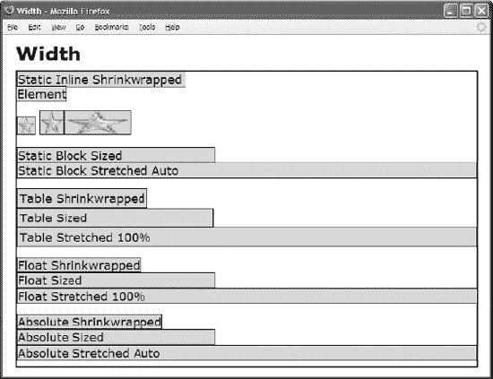

#### CSS

`*.static-inline-shrinkwrapped { width:auto; }
*.replaced-inline-shrinkwrapped { width:auto; }
*.replaced-inline-sized { width:35px; }
*.replaced-inline-stretched { width:100%; }

*.static-block-sized { width:300px; }
*.static-block-stretched { width:auto; }

*.table-shrinkwrapped { width:auto; }
*.table-sized { width:300px; }
*.table-stretched { width:100%; }

*.float-shrinkwrapped { width:auto; float:left; }
*.float-sized { width:300px; float:left; clear:both; }
*.float-stretched { width:100%; float:left; clear:both; }

*.absolute-shrinkwrapped { width:auto; left:0; right:auto; position:absolute; }
*.absolute-sized { width:300px; left:0; right:auto; position:absolute; }
*.absolute-stretched { width:auto; left:0; right:0; position:absolute; }`

#### 宽度

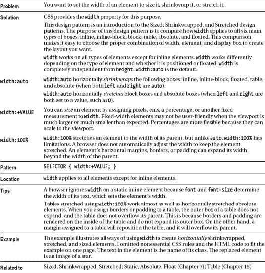

### 高度

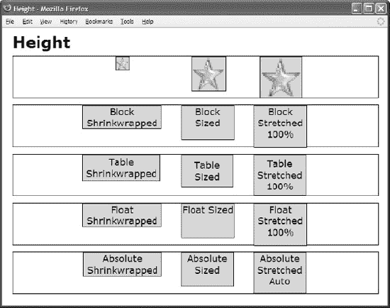

#### CSS

`*.replaced-inline-shrinkwrapped { height:auto; }
*.replaced-inline-sized { height:65px; }
*.replaced-inline-stretched { height:100%; }

*.block-shrinkwrapped { height:auto; }
*.block-sized { height:65px; }
*.block-stretched { height:100%; }

*.table-shrinkwrapped { height:auto; }
*.table-sized { height:65px; }
*.table-stretched { height:100%; }

*.float-shrinkwrapped { height:auto; float:left; }
*.float-sized { height:65px; float:left; }
*.float-stretched { height:100%; float:left; }

*.absolute-shrinkwrapped { height:auto; top:0; bottom:auto; position:absolute; }
*.absolute-sized { height:65px; top:0; bottom:auto; position:absolute; }
*.absolute-stretched { height:auto; top:0; bottom:0; position:absolute; }`

#### 高度

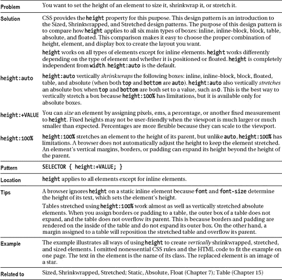

### 大小合适

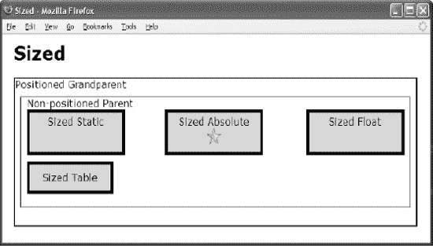

#### HTML

` <h1>Sized</h1>
 
Positioned Grandparent
   
Non-positioned Parent
     
Sized Float

     
Sized Static

     <table **id="table"** class="z"><tr><td>Sized Table</td></tr></table>
     Sized Absolute
       
   

 
`

#### CSS

`*.z { padding:5px; border:5px solid black; }

#float { width:150px; height:50px; }
#static { width:150px; height:50px; }
#table { width:150px; height:50px; }
#abs { width:150px; height:50px; }
#star { width:26px; height:26px; }

/*  Nonessential rules are not shown. */`

#### 大小合适

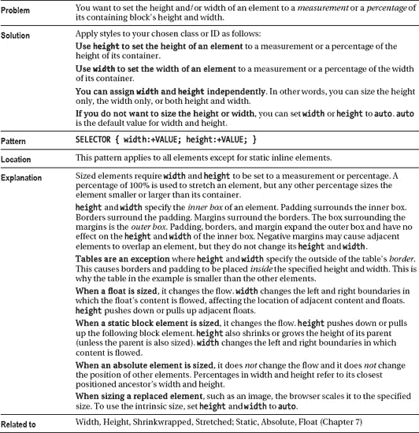

### 畏缩不前

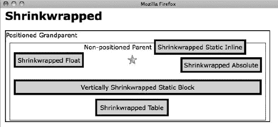

#### HTML

` <h1>Shrinkwrapped</h1>

Positioned Grandparent
  
Non-positioned Parent
    Shrinkwrapped Float
    Shrinkwrapped Static Inline 
    
    
Vertically Shrinkwrapped Static Block

    <table **id="table"** class="z"><tr><td>Shrinkwrapped Table</td></tr></table>
    Shrinkwrapped Absolute
  

 
`

#### CSS

`#float   { width:auto;  height:auto; float:left; }
#inline { width:auto;  height:auto; }
#star    { width:auto;  height:auto; }
#block { width:auto;  height:auto; }
#table  { width:auto;  height:auto; }
#abs    { width:auto;  height:auto; left:auto; bottom:auto; position:absolute; }

/*  Nonessential rules are not shown. */`

#### 畏缩不前

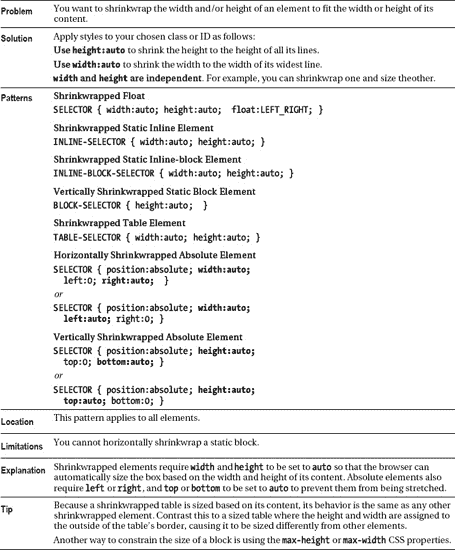

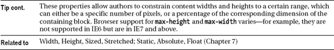

### 拉伸

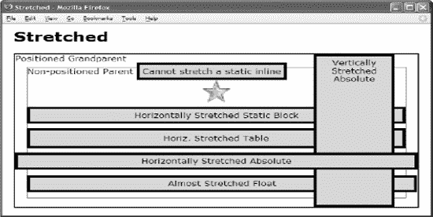

#### HTML

` <h1>Stretched</h1>
  
Positioned Grandparent
   
Non-positioned Parent
     <span  **id="inline"** class="s">Cannot stretch a static inline
     <div   **id="sized"**>

     <div   **id="block"** class="s">Horizontally Stretched Static Block

     <table **id="table"** class="s"><tr><td>Horiz. Stretched Table</td></tr></table>
     <div   **id="abs-v"** class="s">Vertically Stretched Absolute

     <span  **id="abs-h"** class="s">Horizontally Stretched Absolute
     <span  **id="float"** class="s">Almost Stretched Float
   

 
`

#### CSS

`#star { width:100%; height:100%; }
#block { width:auto; }
#table { width:100%; }
#abs-v { height:auto; top:0;  bottom:0; position:absolute; }
#abs-h { width:auto;  left:0; right:0; position:absolute; }
#float { width:100%; float:left; }

/*  Nonessential rules are not shown. */`

#### 拉长

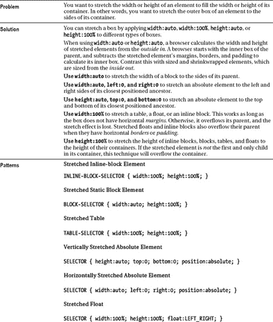

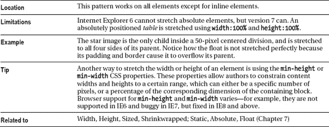