# 六、盒子模型属性

本章展示了盒子模型属性如何设计各种盒子的样式。这些是基本的设计模式。

边距、边框和填充设计模式包含了对比每种类型的框中每个属性如何工作的例子。他们的主要目的是在一个地方对比相同的属性在不同的上下文中意味着不同的东西。当使用这本书作为参考时，您可能还希望参考边距、边框和填充设计模式，以确定哪种类型的元素、框和属性将满足您的需要。

### 章节大纲

*   **边距**对比了不同类型的盒子边距的不同作用。它显示了边距如何改变元素相对于其容器和兄弟元素的位置。
*   **Border** 对比不同类型盒子的边框效果。它显示了边框如何以类似于边距的方式改变元素的位置，以及在某些方面不同于边距。
*   **填充**对比不同类型盒子的填充方式。它展示了填充对于边框和边距的作用方式。
*   **背景**展示了如何给一个元素的背景分配颜色。它还展示了如何使用平铺图像作为背景。您可以上下平铺图像、仅横向平铺或仅向下平铺，或者仅显示图像一次。您可以将图像放置在背景中的特定位置。您还可以指示图像是与内容一起滚动，还是保持在固定位置。
*   **溢出**展示了如何隐藏溢出的内容，显示它，或者显示滚动条。
*   **Visibility** 展示了如何隐藏一个元素，同时在流中为它留下一个占位符。
*   **分页符**展示了如何在一个元素之前或之后插入一个分页符。它还显示了如何打印空白页。

### 边距

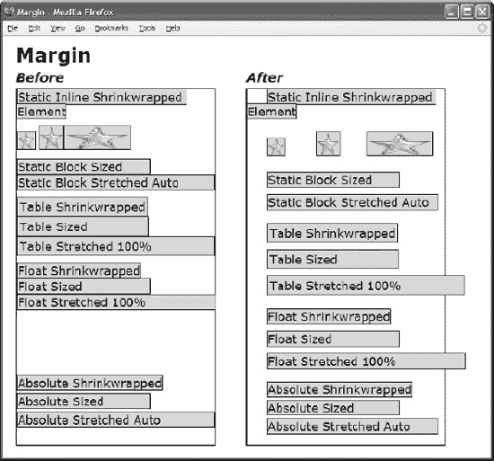

#### CSS

`*.before { margin:0; }

*.after { margin-top:10px; margin-bottom:0;
  margin-left:30px; margin-right:10px; }

/* Nonessential rules are not shown.
   HTML code is omitted to allow the example to fit on one page. */`

#### 边距

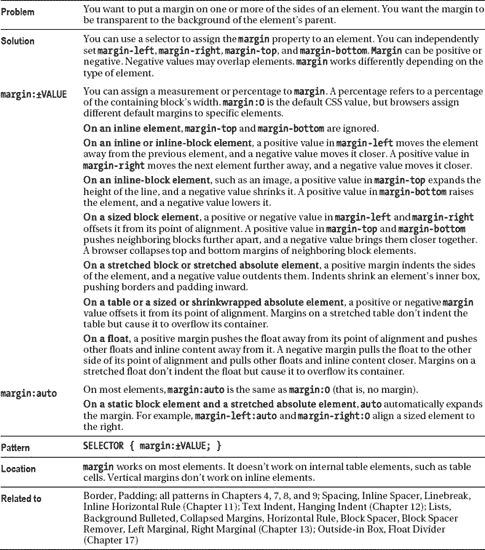

### 边框

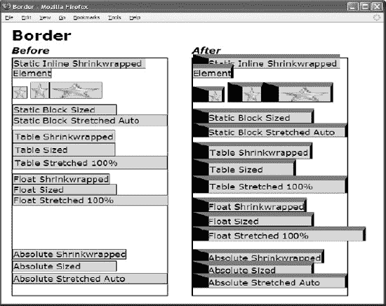

#### CSS

`*.before { border:1px solid black; }

*.after { border-top:10px solid dimgray;  border-bottom:1px solid black;
  border-left:30px solid black;   border-right:5px solid black; }

/* Nonessential rules are not shown.
    HTML code is omitted to allow the example to fit on one page. */`

#### 边框

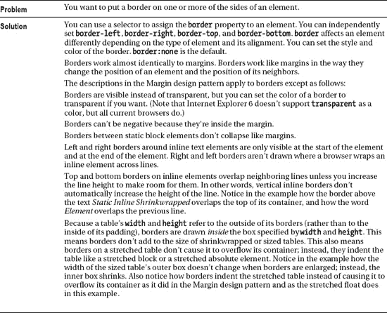

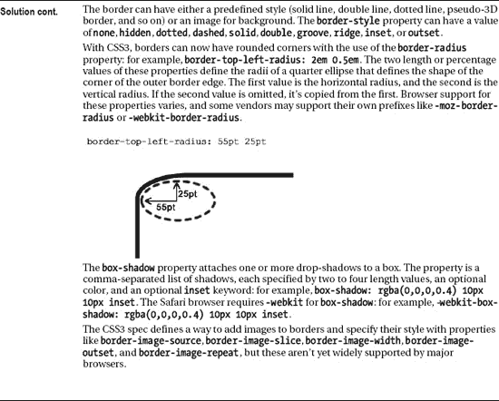

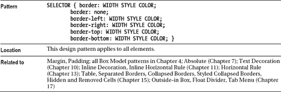

### 填充

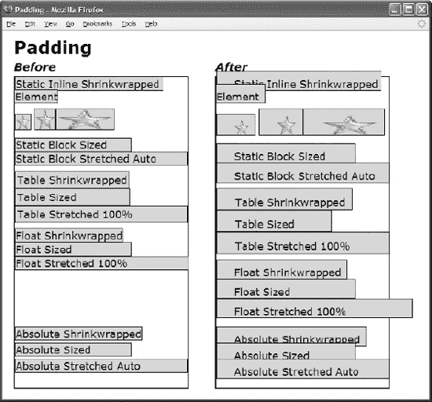

#### CSS

`*.before { padding:0; }

*.after { padding-top:10px;  padding-bottom:0;
  padding-left:30px; padding-right:10px; }

/* Nonessential rules are not shown.
   HTML code is omitted to allow the example to fit on one page. */`

#### 填充

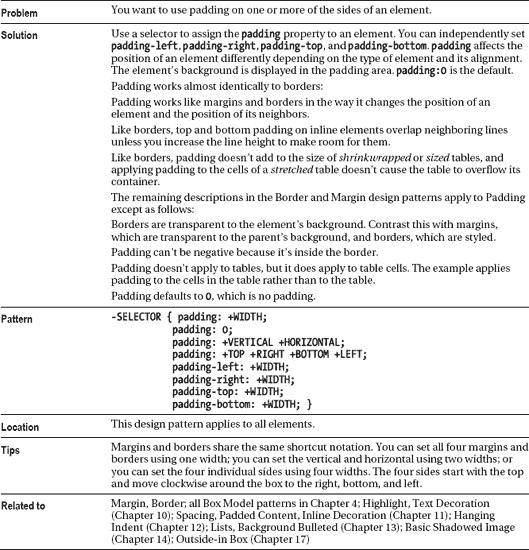

### 背景

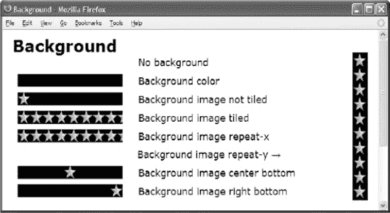

#### HTML

` <h1>Background</h1>
 
****&nbsp;No background

 
****&nbsp;Background color

 
****&nbsp;Background image not tiled

 
****&nbsp;Background image tiled

 
****&nbsp;Background image repeat-x

 
****&nbsp;Background image repeat-y &rarr;

 
****&nbsp;Background image center bottom

 
****&nbsp;Background image right bottom
`

#### CSS

`p { margin-left:240px; margin-top:0px; margin-bottom:10px; }
**span** { margin-left:-230px; margin-right:30px; padding-left:195px; font-size:19px;
  **background-position:left bottom; background-repeat:no-repeat;**
  **background-color:black; background-image:url("star.gif"); }**

*.no-bg { **background-image:none;  background-color:transparent;** }
*.bg-color { **background-image:none;  background-color:black;** }
*.bg-image { **background-repeat:no-repeat;** }
*.bg-repeat { **background-repeat:repeat;** }
*.bg-rx { **background-repeat:repeat-x;** }
*.bg-pos-lt { **background-position:center bottom;** }
*.bg-pos-rb { **background-position:right bottom;** }
*.bg-ry { **background-repeat:repeat-y; background-position:center top;**
  padding-left:22px; float:right; height:263px; margin:0px;
  position:relative; top:-170px; }`

#### 背景

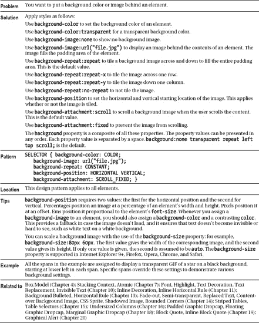

### 溢出

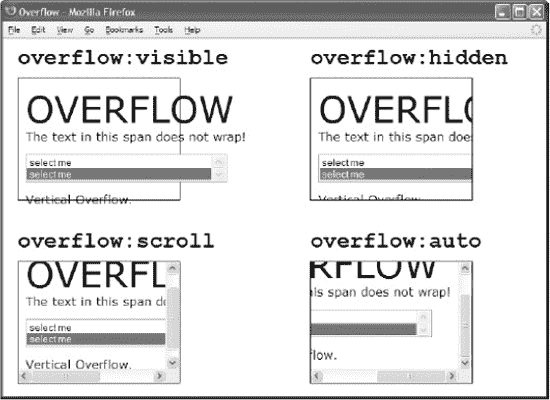

#### HTML

` 

  <h1><code>overflow:visible</code></h1>
  

    OVERFLOW  
    The text in this span does not wrap!
    <select size="2">
      <option>select me</option>
      <option selected="selected">select me</option>
    </select> 
    Vertical Overflow.
  

 
`

#### CSS

`***.ex1 { overflow:visible; }**
***.ex2 { overflow:hidden; }**
***.ex3 { overflow:scroll; }**
***.ex4 { overflow:auto; }**

/*  Nonessential rules are not shown.  */`

#### 溢出

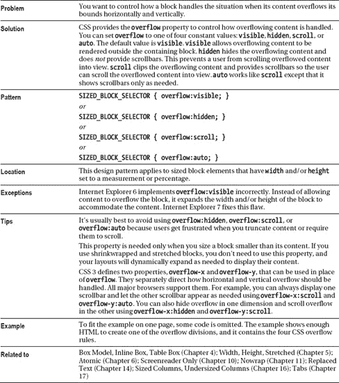

### 能见度

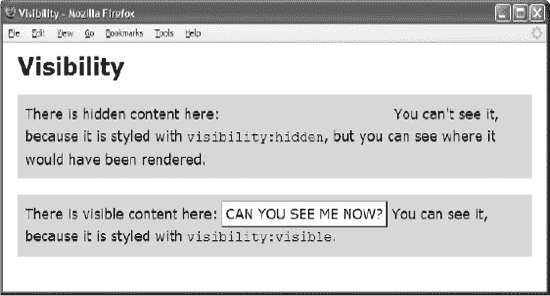

#### HTML

`<h1>Visibility</h1>

There is hidden content here: **CAN YOU SEE ME NOW?**
  You can't see it, because it's styled with <code>visibility:hidden</code>,
  but you can see where it would have been rendered. 

There is visible content here: **CAN YOU SEE ME NOW?** You can see
it, because it's styled with <code>visibility:visible</code>. 
`

#### CSS

`span { padding:4px; background-color:white;
  border-left:1px solid gray; border-right:2px solid black;
  border-top:1px solid gray; border-bottom:2px solid black; }
p  { background-color:gold; padding:10px; line-height:1.5em; }

***.hidden { visibility:hidden; }**
***.visible { visibility:visible; }**

**span:hover { visibility:hidden; }**`

#### 能见度

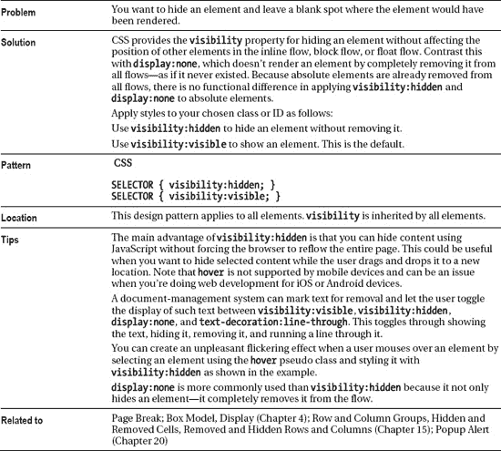

### 分页

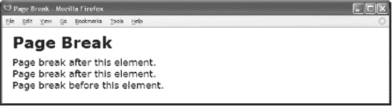

#### HTML

` 
Page break after this element. 

 **
Page break after this element. 
**
 **
Page break before this element.
**`

#### CSS

`*.page-break-before { page-break-before:always; }
*.page-break-after { page-break-after:always; }`

#### 打印预览

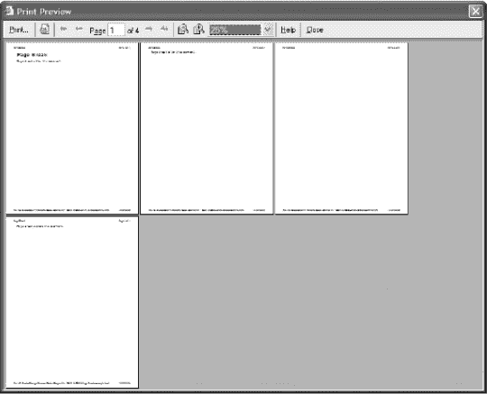

#### 分页

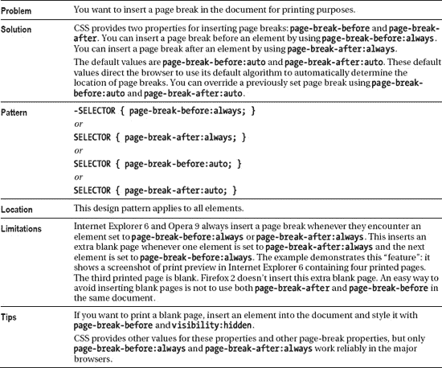