# 七、定位模型

这是关于定位的三章中的第一章。本章介绍 CSS 定位模型。第八章展示了如何缩进、偏移和对齐元素。第九章结合这些技术创建高级定位设计模式。

### 章节大纲

*   **定位模型**介绍并演示六种定位模型。
*   **定位**解释、演示和对比`position`属性的四个值:`static`、`absolute`、`fixed`和`relative`。
*   **最近定位的祖先**展示了如何相对于任何祖先元素定位绝对框，而不仅仅是元素的父元素。
*   **堆叠环境**展示了如何将定位好的盒子堆叠在静态元素的前面或后面以及彼此之间。
*   **Atomic** 解释了如何在块中呈现内联内容*，而不是在*块中呈现*。*
*   **静态**解释正常流程的基础。
*   **Absolute** 显示了如何从正常流中移除任何元素，并相对于其*最近定位的祖先*的边界内的*对其进行绝对定位。*
*   **固定**显示如何从正常流程中移除任何元素，并相对于*视口*绝对定位。
*   **Relative** 展示了如何使用相对定位来控制堆叠顺序，或者偏移一个元素而不影响其形状或其他元素的位置。
*   **Float and Clear** 展示了如何从正常流中移除一个元素，并将其浮动到其父元素的左侧或右侧。它还展示了如何清除元素，使它们位于浮动的左侧、右侧或两侧。
*   **相对浮动**展示了如何相对定位一个浮动。

### 定位车型

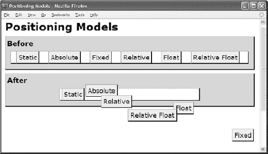

#### HTML

`<h1>Positioning **Models</h1>**

**<h2>Before</h2>**
  
StaticAbsolute
    FixedRelative
    FloatRelative Float

**<h2>After</h2>**
  

    Static
    **Absolute
    fixed<**/span>
    relative<**/span>
    float<**/span>
    **Relative Float

`

#### CSS

`*.centered { width:380px; margin-left:auto; margin-right:auto; }
*.static { **position:static;** }
*.absolute { **position:absolute;** top:20px; left:215px; }
*.fixed { **position:fixed;** bottom:20px; right:5px; }
*.relative { **position:relative;** top:20px; left:30px; }
*.float { **float:right;** }`

#### 定位车型

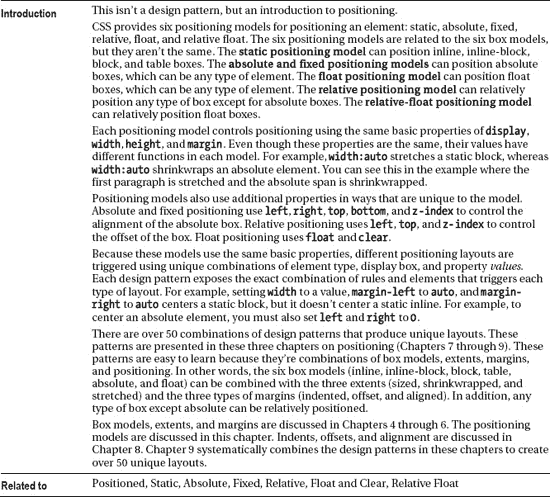

### 摆好位置

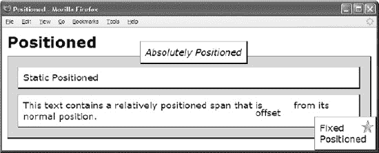

#### HTML

` <h1>Positioned</h1>
 

  
**Static Positioned

  
**This text contains a relatively positioned span that is
    **offset from its normal position.

  <em  **class="absolute"**>Absolutely Positioned</em>
  
  <p   **class="fixed2"**>Fixed Positioned

`

#### CSS

`div,p,em { margin:10px; padding:10px; background-color:white;
  border-left:1px solid gray; border-right:2px solid black;
  border-top:1px solid gray; border-bottom:2px solid black; }

*.static { **position:static;** }
*.relative { **position:relative; left:auto; top:auto; bottom:auto; right:auto;** }
*.absolute { **position:absolute; left:35%; top:-40px;** }
*.fixed1 { **position:fixed; z-index:20; right:5px; bottom:35px;** }
*.fixed2 { **position:fixed; z-index:10; right:0px; bottom:0;**
  width:100px; margin:0;}

*.offset  { **bottom:-15px; left:-20px;** }

#canvas { background-color:gold; }

/*  Nonessential rules are not shown. */`

#### 摆好位置

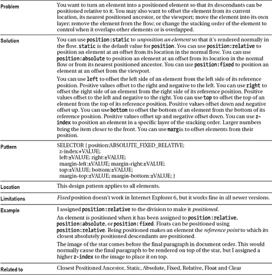

### 定位最近的祖先

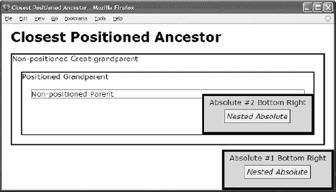

#### HTML

`**<body>**
<h1>Closest Positioned Ancestor</h1>

Non-positioned Great-grandparent
**  
Absolute #1 Bottom Right
**    <em class="absolute offset box2">**Nested Absolute</em>

  
Positioned Grandparent
    
Non-positioned Parent
      ****Absolute #2 Bottom Right
         **<em class="absolute offset box2">**Nested Absolute</em>
    

</body>`

#### CSS

`*.static { position:static; }
*.relative { position:relative; }
*.absolute { position:absolute; }

*.sized { width:230px; height:70px; }
*.bottom-right { bottom:0; right:0; }
*.offset { left:45px; top:30px; }

/*  Nonessential rules are not shown. */` 

#### 定位最近的祖先

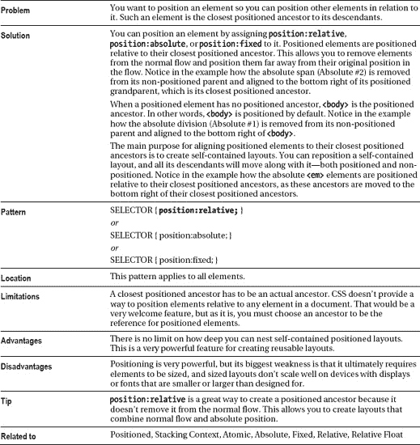

### 堆叠上下文

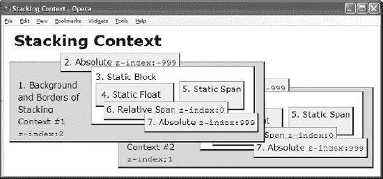

#### HTML

`<h1>Stacking Context</h1>

  
1\. Background and Borders of Stacking Context #1
     <code>z-index:2</code>

  2\. Absolute <code>z-index:-999</code>
  
3\. Static Block 
    4\. Static Float
    5\. Static Span  

    6\. Relative Span <code>z-index:0</code>
    7\. Absolute <code>z-index:999</code>
  

<!-- ...Same exact code as previous... -->
`

#### CSS

`*.stacking-context1 { **z-index:2;** position:absolute; left:10px;  top:70px;  }
*.stacking-context2 { **z-index:1;** position:absolute; left:223px; top:120px; }

*.level2 { **z-index:-999;** position:absolute; }
*.level3 { position:static; }
*.level4 { float:left; }
*.level5 { position:static; }
*.level6 { **z-index:0;** position:relative; }
*.level7 { **z-index:999;** position:absolute; }

/*  Nonessential rules are not shown. */` 

#### 堆叠上下文

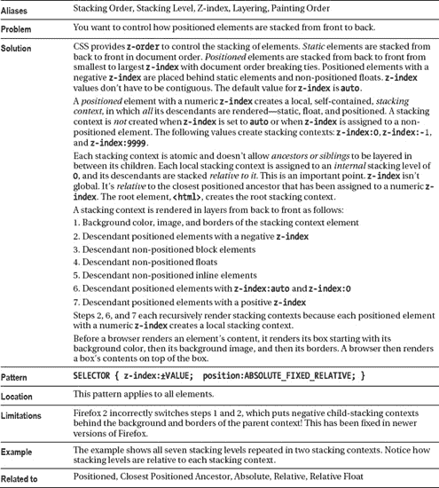

### 原子

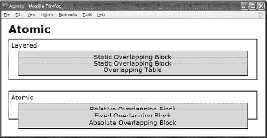

#### HTML

`<h1>Atomic</h1>

Layered
  **
Static Overlapping Block

  **
Static Overlapping Block

  **<table class="static overlap"**><tr><td>Overlapping Table</td></tr></table>

Atomic
  
Relative Overlapping Block

  
Fixed Overlapping Block

  
Absolute Overlapping Block

`

#### CSS

`*.static { position:static; }
*.overlap { margin-top:-22px; }

*.relative { **position:relative;** }
*.fixed { **position:fixed;** margin-top:-16px; }
*.absolute { **position:absolute;** top:65px; }

/*  Nonessential rules are not shown. */` 

#### 原子

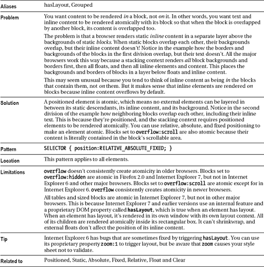

### 静态

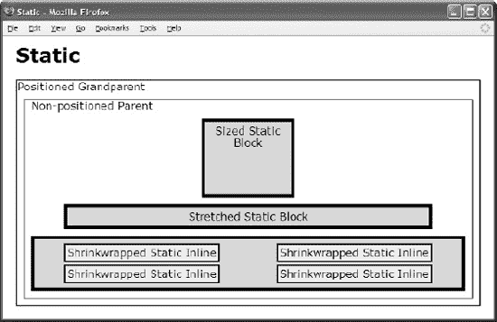

#### HTML

`<h1>Static</h1>

Positioned Grandparent
   
Non-positioned Parent
     
Sized Static Block 

     
Stretched Static Block

     
 Shrinkwrapped Static Inline
                                Shrinkwrapped Static Inline
                                Shrinkwrapped Static Inline
                                Shrinkwrapped Static Inline
     

`

#### CSS

`span { **position:static;** margin:40px; line-height:32px;
  padding:3px; border:2px solid black; background-color:yellow; }

#zs { **position:static;**  width:120px; height:100px; margin:10px auto; }

#ss { **position:static;**  width:auto;  height:auto; margin:10px 50px; }`

#### 静态

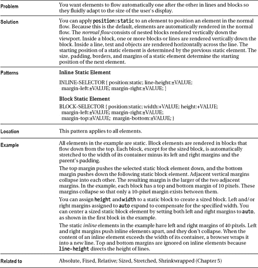

### 绝对

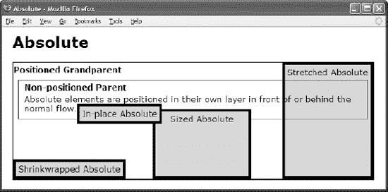

#### HTML

`<h1>Absolute</h1>

<h2>Positioned Grandparent</h2>
  
<h2>Non-positioned Parent</h2>
    Absolute elements are positioned in their own layer in front of or behind the
    normal flow.
    In-place Absolute
    Sized Absolute
    
Stretched Absolute

    
Shrinkwrapped Absolute

`

#### CSS

`#in-place  { **position:absolute;** z-index:1; }

#shrinkwrapped { **position:absolute;** z-index:0;
  width:auto; left:0; bottom:0; margin:0; }

#sized { **position:absolute;** z-index:auto;
  width:170px; height:115px; bottom:0; left:270px; margin:0; }

#stretched { **position:absolute;** z-index:-1;
  height:auto; right:0; top:0; bottom:0; margin:0; }

/*  Nonessential rules are not shown. */`

#### 绝对

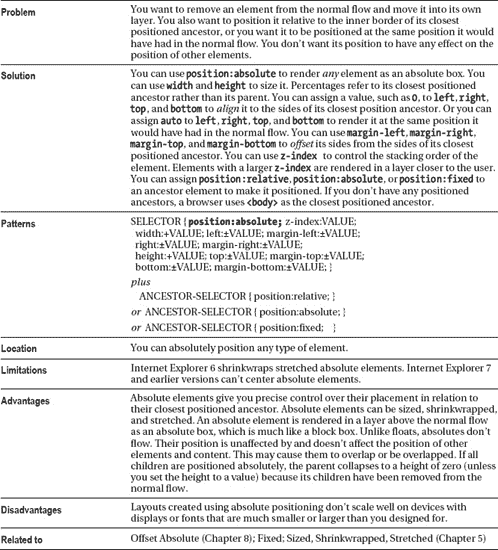

### 固定

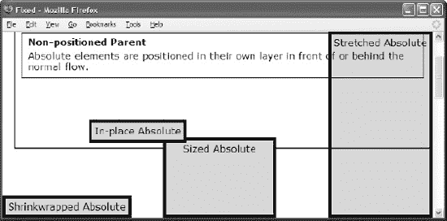

#### HTML

`<h1>Fixed</h1>

<h2>Positioned Grandparent</h2>
  
<h2>Non-positioned Parent</h2>
    Absolute elements are positioned in their own layer in front of or behind the
    normal flow.
    In-place Absolute
    Sized Absolute
    
Stretched Absolute

    
Shrinkwrapped Absolute

`

#### CSS

`*.gp { position:relative; z-index:1; }

#in-place { **position:fixed;** z-index:1; }

#shrinkwrapped { **position:fixed;** z-index:0;
  width:auto; left:0; bottom:0; margin:0; }

#sized { **position:fixed;** z-index:auto;
  width:170px; height:115px; bottom:0; left:270px; margin:0; }

#stretched { **position:fixed;** z-index:-1;
  height:auto; right:0; top:0; bottom:0; margin:0; }

/*  Nonessential rules are not shown. */`

#### 固定

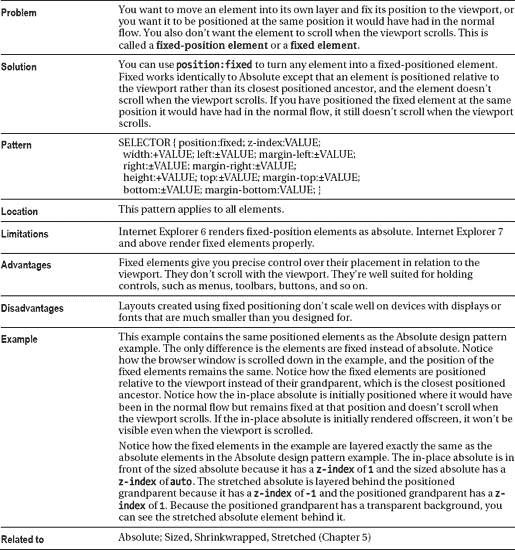

### 相对

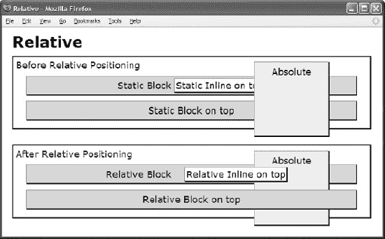

#### HTML

`<h1>Relative</h1>

Before Relative Positioning
  
Static Block
   Static Inline on top

  
Static Block on top

  
Absolute

After Relative Positioning
  
Relative Block
  Relative Inline on top

  
Relative Block on top

  
Absolute

`

#### CSS

`*.ontop { z-index:1; }
*.static { position:static; }
*.relative { position:relative; }
*.absolute { position:absolute; z-index:auto; }
*.offset  { left:20px; top:auto; }

/*  Nonessential rules are not shown. */`

#### 相对

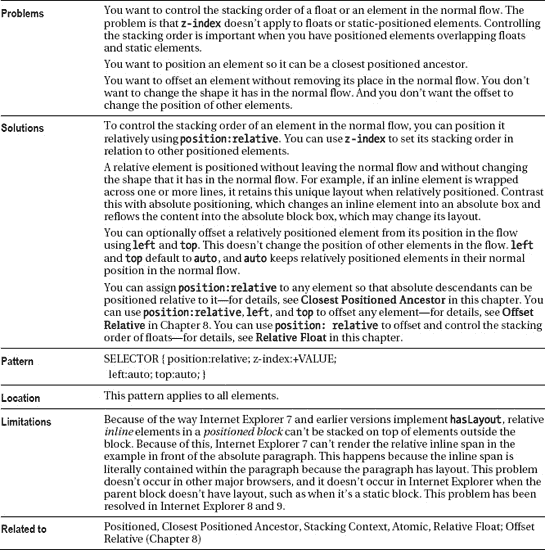

### 漂浮而清晰

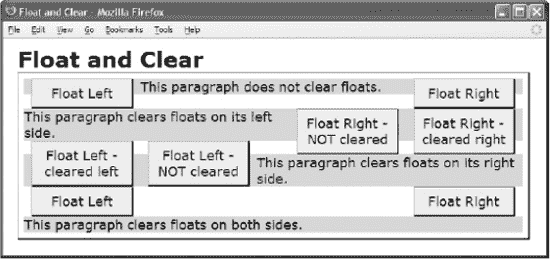

#### HTML

`<h1>Float</h1>

  
Float Left 

  
Float Right

  **
This paragraph does not clear floats.
    Float Right - cleared right
    Float Right - NOT cleared

  **
This paragraph clears floats on its left side.

  
Float Left - cleared left

  
Float Left - NOT cleared

  **
This paragraph clears floats on its right side.
    Float Left 
    Float Right

  
This paragraph clears floats on both sides.
 
`

#### CSS

`*.float { margin:0px 10px;  width:120px; background-color:yellow; color:black; }
*.left { **float:left;** }
*.right { **float:right;** }
*.clear-left { **clear:left;** }
*.clear-right { **clear:right;** }
*.clear-both { **clear:both;** }
*.clear-none { **clear:none;**  }

/*  Nonessential rules are not shown. */`

#### 漂浮而清晰

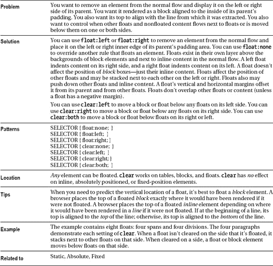

### 相对浮动

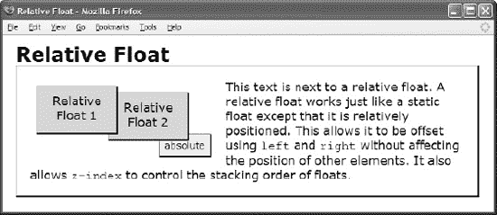

#### HTML

`<h1>Relative Float</h1>

  
Relative Float 1

  
Relative Float 2

  
This text is next to a relative float. A relative float works just like a
   static float except that it is relatively positioned. This allows it to be
   offset using <code>left</code> and <code>right</code> without affecting
   the position of other elements. It also allows <code>z-index</code> to
   control the stacking order of floats.

  absolute

`

#### CSS

`*.parent { **position:relative;** padding:20px; }

*.relative1 { **position:relative; z-index:3;** top:10px; left:10px; }
*.relative2 { **position:relative; z-index:2;** top:20px; left:-30px; }

*.float { **float:left;** width:100px; height:50px;
  margin-right:25px; margin-bottom:40px; }

*.absolute { **position:absolute; z-index:1;** top:102px; left:215px; }

/*  Nonessential rules are not shown. */`

#### 相对浮动

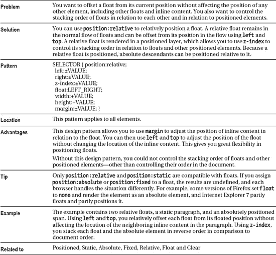