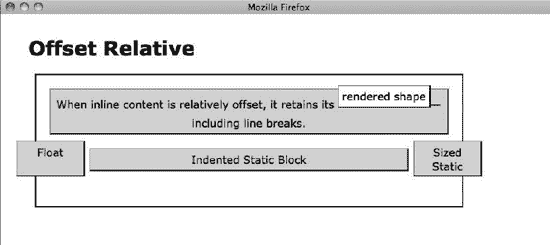

# 八、定位：缩进、偏移和对齐

本章展示了边距如何偏移和对齐元素。

当一个被拉伸的元素的一个或多个边被移入或移出其容器时，该元素会被*缩进*或*突出*，从而改变元素的宽度或高度。

当整个元素从其正常位置移动而不改变元素的高度或宽度时，调整大小或收缩的元素被*偏移*。

当调整大小或收缩的元素被重新定位到其容器的一侧而不改变其大小和可选地从该侧偏移时，该元素被对齐。

### 章节大纲

*   显示了如何从容器的两侧缩进一个元素。
*   **偏移静态**显示了如何从周围的元素偏移一个元素。
*   **偏移或缩进静态表格**展示了如何从容器中偏移一个表格。
*   **偏移浮动**展示了如何从周围的浮动和内容中偏移一个浮动。
*   **绝对偏移和固定偏移**显示了如何从正常流程中的位置偏移绝对元素。
*   **相对偏移**显示了如何偏移*任何*元素而不影响其他元素。
*   **对齐静态内联**展示了如何水平和垂直对齐内联元素。
*   **对齐和偏移静态块**显示了如何对齐和偏移静态块元素。
*   **对齐和偏移静态表格**显示如何对齐和偏移表格。
*   **绝对对齐和偏移**显示了如何对齐和偏移绝对元素。
*   **绝对居中对齐**显示了如何将绝对元素居中对齐。
*   **外部对齐**展示了如何将元素对齐到其容器的外部。

### 缩进

#### HTML

`<h1>Indented</h1>

Positioned Grandparent
  
Non-positioned Parent
    
Horizontally Stretched Static

    
Vertically Stretched Absolute

    Horizontally Stretched Absolute
  

`

#### CSS

`.gp { position:relative; z-index:10; }

#hss { position:static;
   width:auto; **margin-left:30px; margin-right:30px;**
   height:auto; margin-top:auto; margin-bottom:20px; }

#vsa { position:absolute;
   width:120px; left:auto; margin-left:auto; right:0; margin-right:70px;
   height:auto; top:0; **margin-top:-30px;** bottom:0; **margin-bottom:-30px;** }

#hsa { position:absolute;
   width:auto; left:0; **margin-left:-30px;** right:0; **margin-right:-30px;**
   height:auto; top:auto; margin-top:30px; bottom:auto; margin-bottom:auto; }

/* Nonessential rules are not shown. */`

#### 缩进

### 偏移静态

#### HTML

`<h1>Offset Static</h1>

  &larr; Moved-left 
  &rarr; Moved-right 
  Push-right &rarr; 
  Pull-left &larr; &nbsp; 
  <em>None</em>

&darr; Moved-down Static Block 

&uarr; Moved-up Static Block

Push-down Static Block &darr;

Pull-up Static Block &uarr;

None
`

#### CSS

`.moved-left { margin-left:-26px; } .push-right { margin-right:50px; } .moved-right { margin-left:50px; } .pull-left { margin-right:-20px; } .moved-down { margin-top:20px; } .push-down { margin-bottom:20px; } .moved-up { margin-top:-13px; } .pull-up { margin-bottom:-16px; }

/* Nonessential rules are not shown. */`

#### 偏移静态

### 偏移或缩进静态表格

#### HTML

`<h1>Offset or Indented Static Table</h1>

  **<table class="l-wrap">**<tr><td>Left-offset Shrinkwrapped Table</td></tr></table>
  **<table class="r-wrap">**<tr><td>Right-offset Shrinkwrapped Table</td></tr></table>
  **<table class="stretched">**<tr><td>Indented Stretched Table</td></tr></table>
  **<table class="r-sized">**<tr><td>Right-offset Sized Table</td></tr></table>
  **<table class="l-sized">**<tr><td>Left-offset Sized Table</td></tr></table>

`

#### CSS

`**.l-wrap** { width:auto; **margin-left:60px;** margin-right:auto; } **.r-wrap** { width:auto; margin-left:auto; **margin-right:60px;**}

**.stretched { width:80%; margin-left:auto; margin-right:auto; }**

**.r-sized** { width:300px; margin-left:auto; **margin-right:60px;** text-align:right; } **.l-sized** { width:300px; **margin-left:60px;** margin-right:auto; text-align:left; }

/* Nonessential rules are not shown. */`

#### 偏移或缩进静态表格

### 偏移浮动

#### HTML

`<h1>Offset Float</h1>

  
Sized Float

  
Right-retracted Float

  
Float

  
Sized Float

  
Left-retracted Float

  
Float

  

    Right-extended &amp; Top-extended Float

  
Float

  
Float

`

#### CSS

`**.sized { width:70px; height:60px; margin:10px; }**
.widened { width:175px; } .shrunk { margin:3px; padding:1px; background-color:white; }

**.right-extended { margin-right:120px; } .right-retracted { margin-right:-55px; } .left-retracted { margin-left:-185px; } .top-extended { margin-top:20px; }**

**.float-left { float:left; } .float-right { float:right; }**
**.clear-left { clear:left; } .clear-right { clear:right; }**

/* Nonessential rules are not shown. */`

#### 偏移浮动

### 绝对偏移和固定偏移

#### HTML

`<h1>Offset Absolute and Offset Fixed</h1>

<h2>Positioned Grandparent</h2>
  
<h2>Non-positioned Parent</h2>
    The default position of an offset absolute element is where it would have
    been rendered if it were not absolutely positioned:
    **Absolute**

    
You can use left and top margins to offset it from its
    default position: **Fixed
**
  

`

#### CSS

`**#absolute { position:absolute; width:140px; height:auto; }**

**#fixed { position:fixed;**
  height:50px; **margin-top:10px;**
  width:auto; **margin-left:10px; }**

/* Nonessential rules are not shown. */`

#### 绝对偏移和固定偏移

### 相对偏移

#### HTML

`<h1>Offset Relative</h1>

  

    When inline content is relatively offset, it retains its
     rendered shape–including
line breaks.

      
Float 

      
Sized Static 

      
Indented Static Block 

`

#### CSS

`.float { float:left; width:90px; height:40px; } .sized { width:90px; height:40px; margin-left:auto; margin-right:0; } .indented { margin-left:60px; margin-right:60px; }

**.relative { position:relative; }**

**.offset1 { left:0px; top:-12px; } .offset2 { left:-50px; top:10px; } .offset3 { left:50px; top:10px; } .offset4 { left:0px; top:-32px; }**

/* Nonessential rules are not shown. */`

#### 相对偏移

### 对齐静态内嵌

#### HTML

`<h1>Aligned Static Inline</h1>

  
Left-aligned content

  
Horizontally and Vertically Center-aligned Content

  
Right-aligned content

  
Justify-aligned works on all but the last line. This line is
    justified but the last line is not.

    
Aligned to baseline.
      Lowered relative to the baseline.
      Raised relative to... 

`

#### CSS

`.baseline { vertical-align:baseline; } .raised { **vertical-align:10px;** } .lowered { vertical-align:-10px; }

#l { position:static; **text-align:left;** } #c { position:static; **text-align:center; line-height:48px;** } #r { position:static; **text-align:right;** } #j { position:static; **text-align:justify;** }

/* Nonessential rules are not shown. */`

#### 对齐静态内嵌

### 对齐和偏移静态块

#### HTML

`<h1>Aligned and Offset Static Block</h1>

  
Left Aligned

  
Left Aligned &amp; Offset

  
Center Aligned

  
Right Aligned &amp; Offset

  
Right Aligned

`

#### CSS

`#left { position:static; width:120px; **margin-left:0; margin-right:auto;** }
#left-off { position:static; width:200px; **margin-left:50px; margin-right:auto;** }
#center { position:static; width:120px; **margin-left:auto; margin-right:auto;** }
#right { position:static; width:120px; **margin-left:auto; margin-right:0;** }
#right-off { position:static; width:200px; **margin-left:auto; margin-right:50px;** }

/* Nonessential rules are not shown. */`

#### 对齐和偏移静态块

### 对齐和偏移静态表

#### HTML

`<h1>Aligned Static Table</h1>

  **<table class="l-wrap">**<tr><td>Left-aligned Shrinkwrapped Table</td></tr></table>
  **<table class="c-wrap">**<tr><td>Centered Shrinkwrapped Table</td></tr></table>
  **<table class="r-wrap">**<tr><td>Right-offset Shrinkwrapped Table</td></tr></table>
  **<table class="stretched">**<tr><td>Stretched Table</td></tr></table>
  **<table class="r-sized">**<tr><td>Right-aligned Sized Table</td></tr></table>
  **<table class="c-sized">**<tr><td>Centered Sized Table</td></tr></table>
  **<table class="l-sized">**<tr><td>Left-offset Sized Table</td></tr></table>

`

#### CSS

`.l-wrap { width:auto; margin-left:0; margin-right:auto; } **.c-wrap { width:auto;** margin-left:auto; margin-right:**auto;**} **.r-wrap** { **width:auto;** margin-left:auto; **margin-right:20px;** }

**.stretched { width:100%; margin-left:0; margin-right:0; }**

**.r-sized { width:350px;** margin-left:auto; **margin-right:0;** text-align:right; } **.c-sized {**
**width:350px;** margin-left:**auto;** margin-right:**auto;** text-align:center; } **.l-sized { width:350px;**
**margin-left:20px;** margin-right:auto; text-align:left; }

/* Nonessential rules are not shown. */`

#### 对齐和偏移静态表

### 对齐和绝对偏移

#### HTML

`<h1>Aligned and Offset Absolute</h1>

  
Left-top Aligned &amp; Offset

  
Left-bottom Aligned &amp; Offset

  
Center-middle Aligned

  
Right-top Aligned &amp; Offset

  
Right-bottom Aligned &amp; Offset

`

#### CSS

`div { position:relative; }

#lt { position:absolute;
  width:auto; **left:0; margin-left:8px;** right:auto; margin-right:auto;
  height:auto; **top:0; margin-top:8px;** bottom:auto; margin-bottom:auto; }
#lb { position:absolute;
  width:240px; **left:0; margin-left:8px;** right:auto; margin-right:auto;
  height:18px; top:auto; margin-top:auto; **bottom:0; margin-bottom:8px;** }
#cm { position:absolute;
  width:200px; **left:0; margin-left:auto; right:0; margin-right:auto;**
  height:18px; **top:0; margin-top:auto; bottom:0; margin-bottom:auto;** }
#rt { position:absolute;
  width:220px; left:auto; margin-left:auto; **right:0; margin-right:8px;**
  height:18px; **top:0; margin-top:8px;** bottom:auto; margin-bottom:auto; }
#rb { position:absolute;
  width:auto; left:auto; margin-left:auto; **right:0; margin-right:8px;**
  height:auto; top:auto; margin-top:auto; **bottom:0; margin-bottom:8px;** }

/* Nonessential rules are not shown. */`

#### 对齐和绝对偏移

### 绝对居中对齐

#### HTML

`<h1>Aligned-center Absolute</h1>

  
Horizontally &amp; Vertically Centered

`

#### CSS

`div { position:relative; }
#cm { position:absolute; }

.hc { width:200px; left:0; margin-left:auto; right:0; margin-right:auto; } .vc { height:40px; top:0; margin-top:auto; bottom:0; margin-bottom:auto; }

/* Nonessential rules are not shown. */`

#### 绝对居中对齐

### 外对齐

#### HTML

`<h1>Aligned Outside</h1>

Parent
  
Sized Block Outside Left

  
Sized Block Outside Right

  
Sized Float Outside Left

  
Sized Float Outside Right

  
Absolute Outside Top Left

  
Absolute Outside Top Right

  
Absolute Outside Bottom Left

  
Absolute Outside Bottom Right

`

#### CSS

`.parent { position:relative; height:140px; width:200px; }

.sized-block-outside-left { width:220px; margin-left:-234px; } .sized-block-outside-right { width:220px; margin-left:100%; } .sized-float-outside-left { width:220px; margin-left:-234px; float:left; } .sized-float-outside-right { width:220px; margin-left:100%; float:left; }

.left { position:absolute; right:100%; margin-right:5px; } .right { position:absolute; left:100%; margin-left:5px; } .top { position:absolute; bottom:100%; margin-bottom:5px; } .bottom { position:absolute; top:100%; margin-top:5px; }

/* Nonessential rules are not shown. */`

#### 外对齐

