# 九、定位：高级

这是关于定位的三章中的第三章。它将前两章的定位技术结合到 12 个设计模式中，在拉伸、调整或收缩静态和定位元素时，将它们对齐和偏移到容器的左侧、中间、右侧、顶部、中间或底部。本章主要关注静态和绝对定位的元素。

本章结合了第八章中的设计模式来对齐和偏移容器中的元素。它还引入了新的模式来从容器的顶部、中部和底部对齐和偏移元素。如果你还不熟悉第五章—第八章中的设计模式，你可能想回顾一下。因为从左侧和右侧对齐和偏移是相似的，所以您可能想跳过右对齐和右偏移。

### 章节大纲

*   **左对齐**展示了如何将一个元素与其容器的左侧对齐。
*   **左偏移**显示了如何偏移一个左对齐的元素。
*   **右对齐**展示了如何将一个元素与其容器的右侧对齐。
*   **右偏移**显示了如何偏移一个右对齐的元素。
*   **居中对齐**展示了如何将一个元素与其容器的中心对齐。
*   **中心偏移**显示如何偏移一个中心对齐的元素。
*   **顶部对齐**展示了如何将一个元素对齐到其容器的顶部。
*   **顶部偏移**显示了如何偏移顶部对齐的元素。
*   **底部对齐**展示了如何将一个元素对齐到其容器的底部。
*   **底部偏移**显示了如何偏移一个底部对齐的元素。
*   **居中对齐**展示了如何将一个元素对齐到其容器的中间。
*   **中间偏移**显示如何偏移中间对齐的元素。

### 左对齐

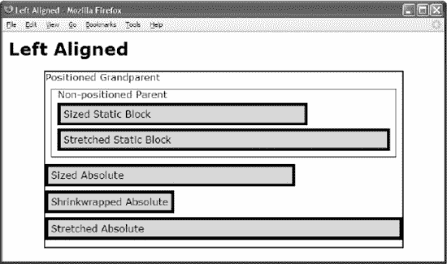

#### HTML

`<h1>Left Aligned</h1>
 
Positioned Grandparent
    
Non-positioned Parent
    <div **id="zs"** class="example">Sized Static Block 

    <div **id="ss"** class="example">Stretched Static Block

    Sized Absolute
    Shrinkwrapped Absolute
    Stretched Absolute

`

#### CSS

`.gp { position:relative; height:295px; width:600px; border:2px solid black; }
.parent <{ margin:10px; padding:10px; padding-top:0; border:1px solid black; }
.example { padding:5px; <border:5px solid black; <background-color:gold;   <<}

#zs { position:static;          **text-align:left;**                      margin-top:5px;
**width:400px;**                    **margin-left:0;**              margin-right:auto; }
#ss { position:static;          text-align:left;                      margin-top:5px;
**width:auto;**                     **margin-left:0;**              **margin-right:0;**    }
#za { position:absolute;        text-align:left;                   top:0; margin-top:155px;
**width:400px;**  **left:0;**           **margin-left:0;**  right:auto; margin-right:auto; }
#wa { position:absolute;        text-align:left;             top:0; margin-top:200px;
**width:auto;**   **left:0;**           **margin-left:0;**  right:auto; margin-right:auto; }
#sa { position:absolute;        text-align:left;              top:0; margin-top:245px;
width:auto;left:0;              margin-left:0;  right:0;    margin-right:0;    }`

#### 左对齐

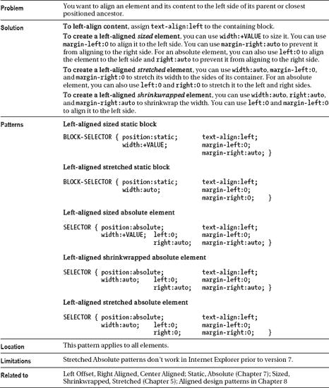

### 向左偏移

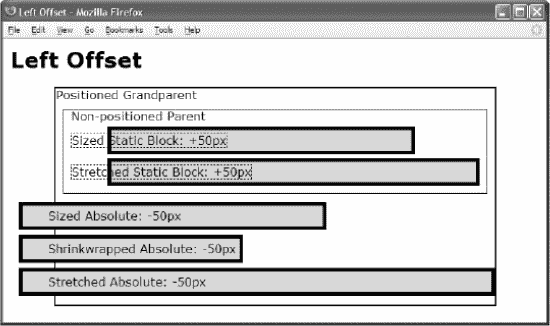

#### HTML

`<h1>Left Offset</h1>

Positioned Grandparent
 
Non-positioned Parent
  <div  **id="zs"** class="ex">Sized Static Block: +50px

  <div  **id="ss"** class="ex">Stretched Static Block: +50px

  Sized Absolute: -50px
  Shrinkwrapped Absolute: -50px
  Stretched Absolute:-50px

`

#### CSS

`.gp { position:relative; height:295px; width:600px; border:2px solid black;  }
.parent  { margin:10px; padding:10px; padding-top:0; border:1px solid black; }
.ex      { padding:5px;  border:5px solid black;  background-color:gold;     }
div.ex  span { **margin-left:-60px;** border:1px dotted black; }
span.ex span { **margin-left:30px;**  border:none;             }

#zs { position:static;          text-align:left;                   margin-top:5px;
        width:400px;            **margin-left:50px;**                margin-right:auto; }
#ss { position:static;          text-align:left;                   margin-top:5px;
        width:auto;             **margin-left:50px;**                margin-right:0;    }
#za { position:absolute;        text-align:left;          top:0; margin-top:155px;
        width:400px;  left:0;   **margin-left:-50px;**   right:auto;  margin-right:auto;}
#wa { position:absolute;        text-align:left;          top:0; margin-top:200px;
        width:auto;   left:0;   **margin-left:-50px;**   right:auto; margin-right:auto;}
#sa { position:absolute;        text-align:left;          top:0; margin-top:245px;            
        width:auto;   left:0;   **margin-left:-50px;**   right:0;    margin-right:0;   }`

##### 向左偏移

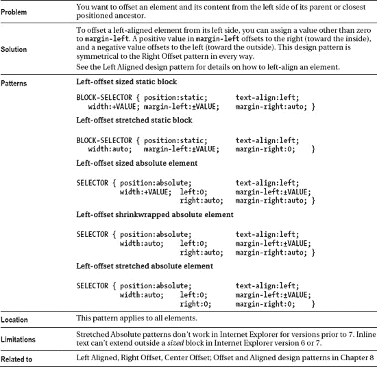

### 右对齐

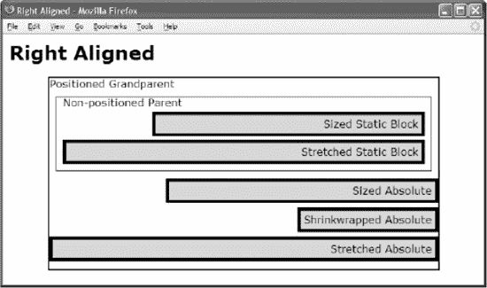

#### HTML

` <h1>Right Aligned</h1>
 
Positioned Grandparent
   
Non-positioned Parent
     <div  **id="zs"** class="example">Sized Static Block 

     <div  **id="ss"** class="example">Stretched Static Block

     Sized Absolute
     Shrinkwrapped Absolute
     Stretched Absolute

`

#### CSS

`.gp { position:relative; height:295px; width:600px; border:2px solid black;  }
.parent  { margin:10px; padding:10px; padding-top:0; border:1px solid black; }
.example { padding:5px;  border:5px solid black;  background-color:gold;     }

#zs { position:static;          **text-align:right;**                    margin-top:5px;
        **width:400px;**            margin-left:auto;           **margin-right:0;**       }
#ss { position:static;          text-align:right;                    margin-top:5px;
        **width:auto;**             **margin-left:0;**              **margin-right:0;**       }
#za { position:absolute;        text-align:right;           top:0; margin-top:155px;
       **width:400px;**   left:auto; margin-left:auto; **right:0;** **margin-right:0;**       }
#wa { position:absolute;        text-align:right;           top:0; margin-top:200px;
        **width:auto;**   left:auto; margin-left:auto; **right:0;** **margin-right:0;**       }
#sa { position:absolute;        text-align:right;                  top:0; margin-top:245px;
        width:auto;   left:0;   margin-left:0;     right:0; margin-right:0;       }`

#### 右对齐

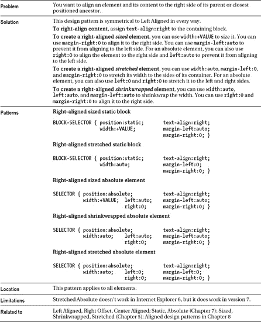

### 向右偏移

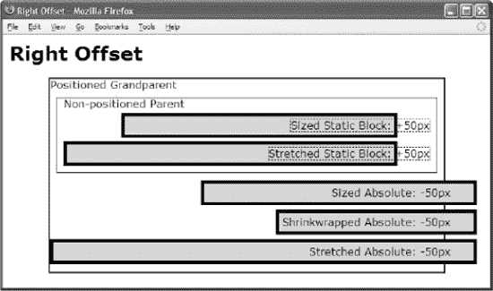

#### HTML

`<h1>Right Offset</h1>

Positioned Grandparent

Non-positioned Parent
  <div  **id="zs"** class="ex">Sized Static Block: +50px

  <div  **id="ss"** class="ex">Stretched Static Block: +50px

  Sized Absolute: -50px
  Shrinkwrapped Absolute: -50px
  Stretched Absolute:-50px

`

#### CSS

`.gp { position:relative; height:295px; width:600px; border:2px solid black;  }
.parent  { margin:10px; padding:10px; padding-top:0; border:1px solid black; }
.ex      { padding:5px;  border:5px solid black;  background-color:gold;     }
div.ex  span { **margin-right:-60px;** border:1px dotted black; }
span.ex span { **margin-right:30px;**  border:none;             }

#zs { position:static;        **text-align:right;**                 margin-top:5px;
        width:400px;          margin-left:auto;          margin-right:50px;    }
#ss { position:static;        text-align:right;                 margin-top:5px; 
        width:auto;           margin-left:0;             margin-right:50px;    }
#za { position:absolute;      text-align:right;         top:0; margin-top:155px;
        width:400px; left:auto; margin-left:auto; right:0;  margin-right:-50px;  }
#wa { position:absolute;      text-align:right;         top:0; margin-top:200px;
        width:auto;  left:auto; margin-left:auto; right:0;      margin-right:-50px;  }
#sa { position:absolute;      text-align:right;         top:0; margin-top:245px;
        width:auto;  left:0; margin-left:0;    right:0;         margin-right:-50px;  }`

#### 向右偏移

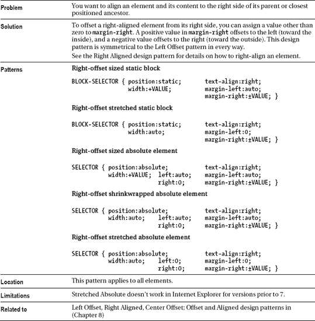

### 居中对齐

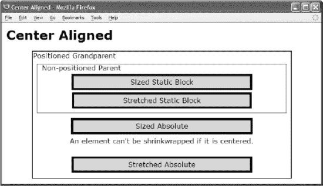

#### HTML

` <h1>Center Aligned</h1>
 
Positioned Grandparent
   
Non-positioned Parent
     <div  **id="zs"** class="example">Sized Static Block 

     <div  **id="ss"** class="example">Stretched Static Block

     Sized Absolute
     An element can't be shrinkwrapped if it is centered.
     Stretched Absolute

`

#### CSS

`.gp { position:relative; height:295px; width:600px; border:2px solid black;  }
.parent  { margin:10px; padding:10px; padding-top:0; border:1px solid black; }
.example { padding:5px;  border:5px solid black;  background-color:gold;     }

#zs { position:static;         **text-align:center;**                    margin-top:5px;
      width:400px;             margin-left:auto;                **margin-right:auto;**  }
#ss { position:static;         text-align:center;                    margin-top:5px;
      width:auto;              margin-left:70px;                **margin-right:70px;**     }
#za { position:absolute;       text-align:center;           top:0; margin-top:155px;               
width:67%;  left:0;            margin-left:auto; right:0;     margin-right:auto;  }
#wa { position:absolute;       text-align:center;             top:0; margin-top:200px;
      width:auto;   left:0;    margin-left:0;    right:0;       margin-right:0;     }
#sa { position:absolute;       text-align:center;             top:0; margin-top:245px;
      width:auto;   left:0;    margin-left:15%;  right:0;       margin-right:15%;     }`

#### 居中对齐

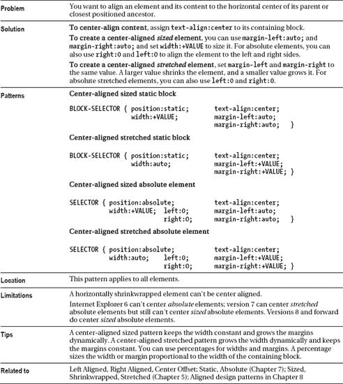

### 中心偏移

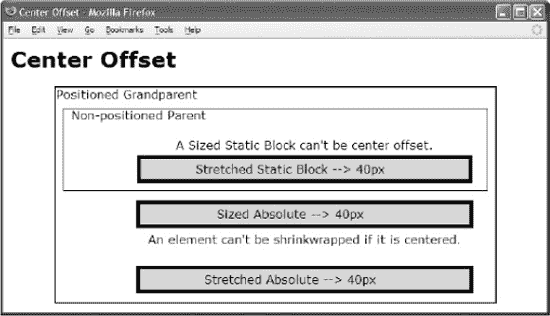

#### HTML

`<h1>Center Offset</h1>

Positioned Grandparent
  
Non-positioned Parent
    <div  **id="zs"** > A sized static block can't be center offset.

    <div  **id="ss"** class="ex">Stretched Static Block &rarr; 40px

    Sized Absolute &rarr; 40px
    An element can't be shrinkwrapped if it is centered.
    Stretched Absolute &rarr; 40px

`

#### CSS

`.gp { position:relative; height:295px; width:600px; border:2px solid black;      }
.parent { margin:10px; padding:10px; padding-top:0; border:1px solid black;      }
.ex     { padding:5px;  border:5px solid black;  background-color:gold;          }
.ex span { margin-left:-40px; }

#zs { position:static;          text-align:center;                  margin-top:5px;
      width:auto;               margin-left:90px;            margin-right:10px;    }
#ss { position:static;          text-align:center;                  margin-top:5px;
      width:auto;               margin-left:90px;          margin-right:10px;    }
#za { position:absolute;        text-align:center;         top:0; margin-top:155px;
      width:440px; left:80px;   margin-left:auto; right:0; margin-right:auto;    }
#wa { position:absolute;        text-align:center;         top:0; margin-top:200px;
      width:auto;  left:0;      margin-left:110px; right:0;  margin-right:30px;    }
#sa { position:absolute;        text-align:center;         top:0; margin-top:245px;
      width:auto;  left:0;      margin-left:110px; right:0;  margin-right:30px;    }`

#### 中心偏移

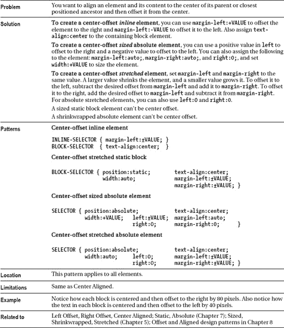

### 顶端对齐

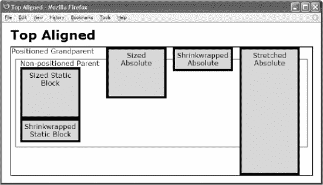

#### HTML

`<h1>Top Aligned</h1>

Positioned Grandparent
  
Non-positioned Parent
    <div  **id="zs"** class="ex">Sized Static Block

    <div  **id="ws"** class="ex">Shrinkwrapped Static Block

    Sized Absolute
    <div  **id="wa"** class="ex">Shrinkwrapped Absolute

    Stretched Absolute

`

#### CSS

`.gp { position:relative; height:300px; width:700px; border:2px solid black;  }
.parent  { margin:10px; padding:10px; padding-top:0; border:1px solid black; }
.ex      { padding:5px;  border:5px solid black;  background-color:gold;
           width:120px; text-align:center; position:relative;      }
.ex span { left:0; width:130px; height:auto; }

**#zs { height:100px;**             **margin-top:0;**                **margin-bottom:auto;**
      position:static;                                                          }
**#ws { height:auto;**              **margin-top:0;**                **margin-bottom:auto;**
      position:static;                                                          }
**#za { height:100px;**      **top:0; margin-top:0;  bottom:auto;**  **margin-bottom:auto;**
      position:absolute;                                     margin-left:200px; }
**#wa { height:auto;**       **top:0; margin-top:0;**  **bottom:auto;**  **margin-bottom:auto;**
      position:absolute;                                     margin-left:355px; }
**#sa { height:auto;**       **top:0; margin-top:0;  bottom:0;**     **margin-bottom:0;**
      position:absolute;                                     margin-left:510px; }`

#### 顶端对齐

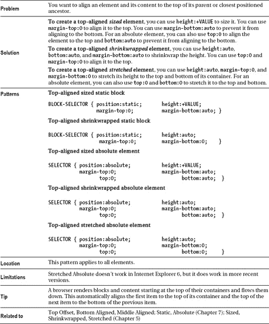

### 顶部偏移

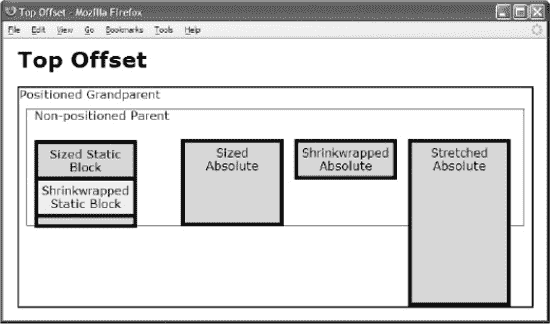

#### HTML

`<h1>Top Offset</h1>

Positioned Grandparent
  
Non-positioned Parent
    <div  **id="zs"** class="ex">Sized Static Block

    <div  **id="ws"** class="ex">Shrinkwrapped Static Block

    Sized Absolute
    <div  **id="wa"** class="ex">Shrinkwrapped Absolute

    Stretched Absolute

`

#### CSS

`.gp { position:relative; height:300px; width:700px; border:2px solid black;  }
.parent  { margin:10px; padding:10px; padding-top:0; border:1px solid black; }
.ex      { padding:5px;  border:5px solid black;  background-color:gold;
           width:120px; text-align:center; position:relative;      }
.ex span { left:0; width:130px; height:auto; }

**#zs { height:100px;**             **margin-top:25px;**                      **margin-bottom:0;**
position:static;                                                                   }
**#ws { height:auto;**              **margin-top:-70px;**                     **margin-bottom:0;**
position:static;                                                background-color:yellow; }
**#za { height:100px;   top:0;    margin-top:70px;  bottom:auto;        margin-bottom:auto;**
position:absolute;                                                    margin-left:200px; }
**#wa { height:auto;    top:0;    margin-top:70px;  bottom:auto;        margin-bottom:0;**
position:absolute;                                                    margin-left:355px; }
**#sa { height:auto;    top:0;    margin-top:70px;  bottom:0;           margin-bottom:0;**
position:absolute;                                                    margin-left:510px; }`

#### 顶部偏移

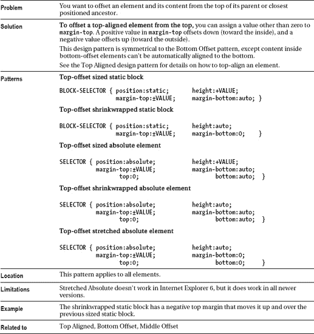

### 底端对齐

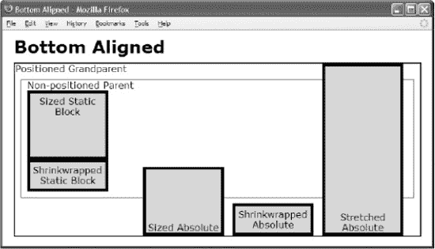

#### HTML

`<h1>Bottom Aligned</h1>

Positioned Grandparent
 
Non-positioned Parent
  <div  **id="zs"** class="ex">Sized Static Block

  <div  **id="ws"** class="ex">Shrinkwrapped Static Block

  Sized Absolute
  <div  **id="wa"** class="ex">Shrinkwrapped Absolute

  Stretched Absolute

`

#### CSS

`.gp { position:relative; height:300px; width:700px; border:2px solid black;  }
.parent  { margin:10px; padding:10px; padding-top:0; border:1px solid black; }
.ex      { padding:5px;  border:5px solid black;  background-color:gold;
           width:120px; text-align:center; position:relative;  }
.ex span { height:auto; left:0; width:130px; }

**span.ex span {position:absolute;top:auto;margin-top:auto;bottom:0;margin-bottom:0; }**
**#zs { height:100px;           margin-top:auto;           margin-bottom:0;**
      position:static;                                          margin-left:0px;   }
**#ws { height:auto;            margin-top:auto;           margin-bottom:0;**
position:static;                                                                   }
**#za { height:100px; top:auto; margin-top:auto; bottom:0; margin-bottom:0;**
position:absolute;                                              margin-left:200px; }
**#wa { height:auto;  top:auto; margin-top:auto; bottom:0; margin-bottom:0;**
      position:absolute;                                              margin-left:355px; }
**#sa { height:auto;  top:0;    margin-top:0;    bottom:0; margin-bottom:0;**
      position:absolute;                                              margin-left:510px; }`

#### 底端对齐

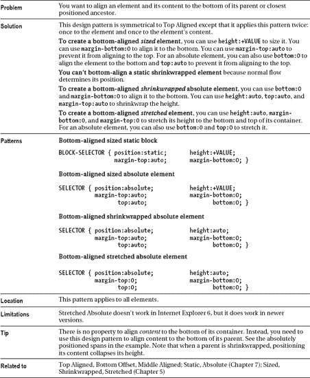

### 底部偏移

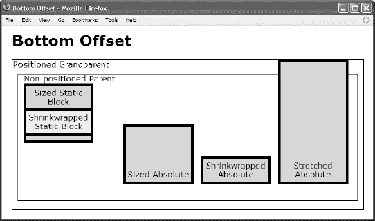

#### HTML

`<h1>Bottom Offset</h1>

Positioned Grandparent
 
Non-positioned Parent
  <div  **id="zs"** class="ex">Sized Static Block

  <div  **id="ws"** class="ex">Shrinkwrapped Static Block

  ****Sized Absolute
  <div  **id="wa"** class="ex">Shrinkwrapped Absolute

  ****Stretched Absolute

`

#### CSS

`.gp { position:relative; height:300px; width:700px; border:2px solid black;  }
.parent  { margin:10px; padding:10px; padding-top:0; border:1px solid black; }
.ex      { padding:5px;  border:5px solid black;  background-color:gold;
           width:120px; text-align:center; position:relative;  }
.ex span { height:auto; left:0; width:130px; }
**span.ex span{position:absolute;top:auto;margin-top:auto;bottom:5px;margin-bottom:0;}**

**#zs { height:100px;           margin-top:auto;          margin-bottom:-70px;**
      position:static;                                                             }
**#ws { height:auto;            margin-top:auto;          margin-bottom:120px;**
      position:static;                                  background-color:yellow;   }
**#za { height:100px; top:auto; margin-top:auto; bottom:0; margin-bottom:50px;**
      position:absolute;                                        margin-left:200px; }
**#wa { height:auto;  top:auto; margin-top:auto; bottom:0; margin-bottom:50px;**
      position:absolute;                                        margin-left:355px; }
**#sa { height:auto;  top:0;    margin-top:auto; bottom:0; margin-bottom:50px;**
      position:absolute;                                        margin-left:510px; }`

#### 底部偏移

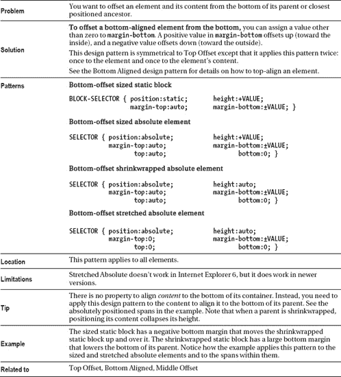

### 居中对齐

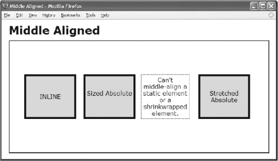

#### HTML

`<h1>Middle Aligned</h1>

  
INLINE

  
Sized Absolute

  
Can't middle-align a static element
                               or a shrinkwrapped element.

  
Stretched Absolute

`

#### CSS

`.gp { position:relative; height:300px; width:700px; border:2px solid black;       }
.ex1 { width:120px; padding:5px; text-align:center; border:1px dotted black;      }
.ex2 { position:relative; border:5px solid black;  background-color:gold; left:0; }
.ex1 span  { **height:36px;** left:0; width:130px;
       **position:absolute; top:0; margin-top:auto; bottom:0; margin-bottom:auto;   }**

**#ia   { height:100px;  top:0; margin-top:auto; bottom:0; margin-bottom:auto;**
        position:absolute;    line-height:100px;                margin-left:40px; }
**#za   { height:100px;  top:0; margin-top:auto; bottom:0; margin-bottom:auto;**
        position:absolute;                                      margin-left:200px; }
**#wa   { height:auto;   top:0; margin-top:90px; bottom:0; margin-bottom:90px;**
        position:absolute;                                      margin-left:355px; }
**#sa   { height:auto;   top:0; margin-top:90px; bottom:0; margin-bottom:90px;**
        position:absolute;                                      margin-left:510px; }`

#### 居中对齐

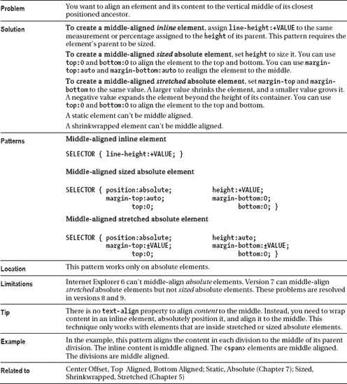

### 中间偏移

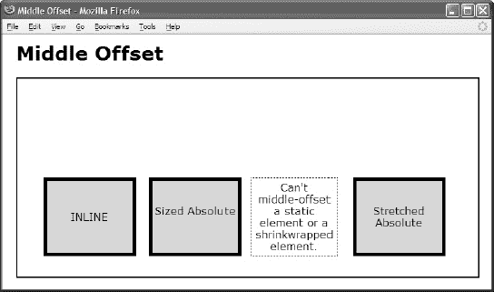

#### HTML

` <h1>Middle Offset</h1>
 

  
INLINE

  
Sized Absolute

  
Can't middle-offset a static element
                               or a shrinkwrapped element.

  
Stretched Absolute

`

#### CSS

`.gp { position:relative; height:300px; width:700px; border:2px solid black;               }
.ex1 { width:120px; padding:5px; text-align:center; border:1px dotted black;      }
.ex2 { position:relative; border:5px solid black;  background-color:gold; left:0; }
.ex1 span { height:36px; left:0; width:130px;
        position:absolute; top:0; margin-top:auto; bottom:0; margin-bottom:auto;   }

#ia   { height:100px; **top:60px;** margin-top:auto;  **bottom:-60px;** margin-bottom:auto;
        position:absolute;      line-height:100px;             margin-left:40px; }
#za   { height:100px; **top:60px;** margin-top:auto;  **bottom:-60px;** margin-bottom:auto;
        position:absolute;                        margin-left:200px; }
#wa   { height:auto;  top:0;    **margin-top:150px;** bottom:0;     **margin-bottom:30px;**
        position:absolute;                                      margin-left:355px; }
#sa   { height:auto;  top:0;    **margin-top:150px;** bottom:0;     **margin-bottom:30px;**
        position:absolute;                                      margin-left:510px; }`

#### 中间偏移

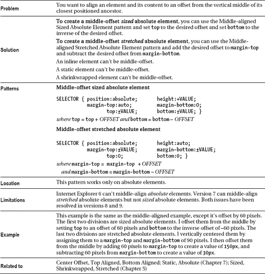