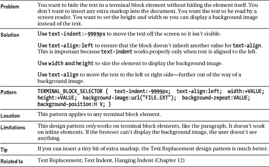

# 十、样式文本

这是包含设计文本样式的设计模式的三章中的第一章。下一章讨论如何在文本周围放置空间。第十二章讨论如何对齐文本。严格地说，这是唯一一章真正为*正文*设计了样式。接下来的两章使用了*风格的内联元素*，它们可以包含文本或者被图片、对象、控件、电影等等所替代。

### 章节大纲

*   **字体**展示了如何使用字体来设计文本样式。
*   **高亮显示**展示了如何使用彩色和平铺背景图像来高亮显示文本。
*   显示了如何为下划线、上划线和线条创建自定义样式。
*   **文本阴影**展示了如何在 Internet Explorer 6 和 Safari 中自动生成文本背后的阴影。
*   **用图像替换文本**展示了如何用图像替换文本。屏幕阅读器可以阅读文本，当图像不可用时，文本质量会下降。这是一个使网站美观和易访问的重要工具。
*   **用画布和 VML 替换文本**(矢量标记语言)由两个独立的部分组成:一个字体生成器，它使用 VML 将字体转换为专有格式，以及一个渲染引擎。这种技术的一个优点是用户可以选择和复制文本，而这在图像替换方法中是不可能的。
*   **字体嵌入**是 CSS3 对文本替换技术的替代，它使用`@font-face`属性直接从服务器下载字体文件，然后将其应用于元素。
*   **不可见文本**展示了如何在不添加标记的情况下隐藏文本。它不如文本替换有用，但不需要额外的标记。
*   **Screenreader-only** 展示了如何使文本对屏幕阅读器可读，同时对视力正常的用户完全隐藏。这是一个重要的工具，可以让非视力用户访问网站，同时让视力正常的用户保持网站整洁。

### 字体

#### HTML

`<h1>Font</h1>

<code>**font-family**:</code>sans serif
 serif monospace

<code>**font-size**:</code>small
 mediumlarge

<code>**color**:</code>black
 gold

<code>**font-style**:</code>normal
 italic

<code>**font-weight**:</code>normal
 bold

<code>**font-variant**:</code>normal
 smallcaps

<code>**text-transform**:</code>none
 lowercaseuppercase
 capitalize
`

#### CSS

`.family1 { **font-family**:sans-serif; }      .family2 { font-family:serif; }
.family3 { font-family:monospace; }
.size1 { **font-size**:small; }               .size2 { font-size:medium; }
.size3 { font-size:large; }
.style1 { **font-style**:normal; }            .style2 { font-style:italic; }
.weight1 { **font-weight**:normal; }          .weight2 { font-weight:bold; }
.variant1 { **font-variant**:normal; }        .variant2 { font-variant:small-caps; }
.color1 { **color**:black; }                  .color2 { **color**:gold; }
.trans1 { **text-transform**:none; }          .trans2 { text-transform:lowercase; }
.trans3 { text-transform:uppercase; }     .trans4 { text-transform:capitalize; }`

#### 字体

### 高亮显示

#### HTML

`
You can insert a
**  highlight**
  in any inline context.
**  Highlights can span multiple**
  lines. A highlight is a
**  foreground color and a**
**  background color**
  applied to an inline element.
**  Padding**
  around a highlight can improve its visual appeal. You can increase the
**  line height**
  to make room for extra padding.

`

#### CSS

`p { margin-top:20px; letter-spacing:0.5px; line-height:1.9em; }

**.highlight { color:white; background-color:black;**
**  padding-left:0.25em; padding-right:0.25em;**
**  padding-top:0.05em;  padding-bottom:0.13em;**
**  background-image:none; }**

.black-on-gold { color:black; background-color:gold; }
.white-on-firebrick { color:white; background-color:firebrick; }
.cyan-on-royalblue { color:lightcyan; background-color:royalblue; }
.palegreen-on-darkgreen { color:palegreen; background-color:darkgreen; }
.textured { color:black; background-color:white;
  background-image:url("paper.jpg"); }`

#### 高亮显示

### 文字装饰

#### HTML

`**<h1>Text Decoration</h1>**

**
**
**  <code>text-decoration:**
**  underline &nbsp;overline &nbsp;**
**  line-through</code>**

**    <code>border</code>:**
**  Under 4 &nbsp; Under 5 &nbsp;**
**  Under 6 &nbsp; Over 7 &nbsp;**
**  Over 8 &nbsp; Over 9 &nbsp;**

**    <code>background</code>:**
**  Under 10 &nbsp; Under 11 &nbsp;**
**  Under 12 &nbsp; Over 13 &nbsp;**
**  Over 14 &nbsp; Thru 15 &nbsp;**
**
**`

#### CSS

`**.t1 { text-decoration:underline; }       *.t2 { text-decoration:overline; }**
**.t3 { text-decoration:line-through; }**

**.t4 { border-bottom:1px solid black; }   *.t5 { border-bottom:1px dotted black; }**
**.t6 { border-bottom:2px dashed gray; }   *.t7 { border-top:3px double red; }**
**.t8 { border-top:4px groove blue; }      *.t9 { border-top:6px ridge green; }**

**.t10 { background:repeat-x left bottom url("tight-dot.gif"); padding-bottom:0px; }**
**.t11 { background:repeat-x left bottom url("dotted.gif"); padding-bottom:0px; }**
**.t12 { background:repeat-x left bottom url("wavy-green.gif"); padding-bottom:2px; }**
**.t13 { background:repeat-x left top url("diamond-blue.gif"); padding-top:3px; }**
**.t14 { background:repeat-x left top url("gradient3.gif"); padding-top:2px; }**
**.t15 { background:repeat-x left center url("wavy-red3.gif"); padding:5px; }**`

#### 文字装饰

### 文字阴影

#### HTML

`<h1 class="shadow">Text Shadow</h1>

Text Shadow applies to all text in a block.
  This design pattern does not apply to inline elements in Internet Explorer 6.
  This design pattern does not work in Opera 9, Firefox 2,
  and other Mozilla Browsers
`

#### CSS 所有浏览器

`.shadow { text-shadow:#999999 5px 5px 5px; }`

#### CSS Internet Explorer 6

`.shadow { filter:shadow(color=#999999, direction=135, strength=4); zoom:1; }`

#### 文字阴影

### 用图像替换文字

*用图像替换文本的示例*

*浏览器无法显示图像时显示的示例*

#### HTML

`<h1>Text Replacement with Image</h1>

**<h2 id="h2">Heading 2</h2>**`

#### CSS

`#h2 { **position:relative;** width:250px; height:76px; padding:0; overflow:hidden; }

#h2 span { **position:absolute;** width:250px; height:76px; left:0; top:0; margin:0;
  background-image:url("heading2.jpg"); background-repeat:no-repeat; }`

#### 用图像替换文字

### 用画布和 Vml 替换文本

*显示替换了文本的示例*

#### HTML

`<!doctype html>
<html>
  <head>
    <meta http-equiv="Content-Type" content="text/html; charset=utf-8">
    
    
    
  </head>
  <body>
    <h1>Test Replacement with VML and canvas</h1>
    <h2>Heading 2</h2>
  </body>
</html>`

#### 用画布和 VML 替换文本

### 字体嵌入

*字体渲染示例*

#### HTML

`<h1>Embedding Font</h1>

<h2 id="h2">Heading 2</h2>`

#### CSS

`@font-face {
font-family: Chunkfive;
src: url('chunkfive.otf') format ("opentype");
}

#h2 {
        font-family: Chunkfive, Arial, sans-serif;
}`

#### 字体嵌入

### 不可见文字

#### HTML

`<h1>Invisible Text</h1>

Invisible Text
`

#### CSS

`.invisible-text {
  text-indent:-9999px;
  text-align:left;
  width:75px;
  height:35px;
  background-image:url("go.jpg");
  background-repeat:no-repeat;
  background-position:center center; }`

#### 不可见文字

### 屏幕阅读器专用

#### HTML

`<h1>Screenreader-only</h1>

Text before screenreader-only text.

**
**
**  This text is hidden to sighted users, but is read by screen readers.
**

****
**  You can make any type of element a screenreader-only element.**

Text after screenreader-only text.
`

#### CSS

`.screenreader-only {
  position:absolute;
  left:-9999px;
  top:-9999px;
  width:1px;
  height:1px;
  overflow:hidden; }`

#### 屏幕阅读器专用

