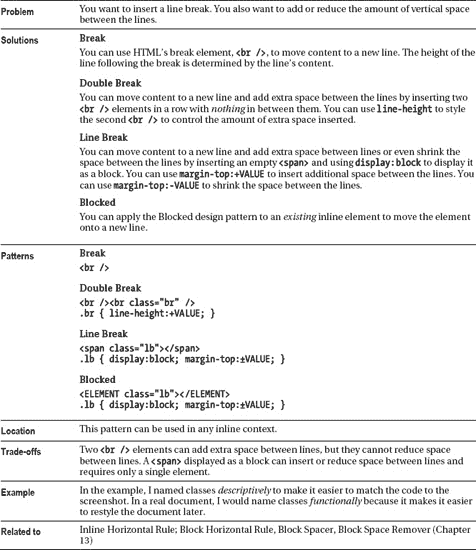

# 十一、间隔内容

本章讨论在内联元素周围放置水平和垂直空间的设计模式，内联元素可能包含文本、图像、对象、控件等等。本章包含以下设计模式:

*   **间距**显示了如何分隔文本和内容。它只是将内置于 CSS 中的许多属性组合在一起，在块、文本和内容周围和之间放置空间。
*   **Blocked** 展示了如何将一个内联元素呈现为一个块元素。这是一个非常重要的设计模式，通常与其他模式结合使用。
*   Nowrap 展示了如何防止浏览器换行。
*   展示了如何呈现文档中的空白，而不是折叠它。
*   代码展示了如何标记计算机代码、内联呈现代码、以块的形式显示代码、保留空白以及防止代码换行。
*   **填充内容**展示了如何在内联内容周围留出空间来强调内容。
*   **Inline Spacer** 展示了如何在一行中插入一个水平分隔符，以精确地放置内容之间的距离。
*   **内嵌装饰**展示了如何在一行中插入一个装饰。装饰是风格，而不是内容。它允许您将彩色背景、纹理背景或背景图像插入到流程中。你可以给它加上边框。您可以使用它来分开内容，重叠前面的内容，以及重叠后面的内容。
*   **换行符**展示了如何将*四种不同类型的换行符*插入到你的文档中，这些换行符可以增加行间的额外空间或者缩短行间的距离。
*   **行内水平标尺**展示了如何使用行内元素插入水平标尺。您可以使用图像、边框、边距等来设置水平标尺的样式。这使您可以在行与行之间留出额外的空间，重叠前面的行，并重叠后面的行。一条*内联*水平线特别有用，因为你可以在任何地方使用内联元素。HTML 的水平标尺是一个*块*元素，样式选项有限。

### 间距

#### HTML

`<h1>Spacing</h1>

This paragraph is normal. It has no indentation, margins, padding,
 letter spacing, word spacing, text justification, or line spacing.

**
**This paragraph has many forms of spacing. The first line of text
 is indented. Margins indent the paragraph on all sides. Padding puts space
 between the paragraph and its borders. Letters have 1 extra pixel of space between
 them. Words have 2 extra pixels of space between them. Text is justified, which
 adds extra space between words to align text to the left and right edges. And
 lines have extra spacing between them.
`

#### CSS

`.elegant { margin-left:40px; margin-right:80px;
  margin-top:30px; margin-bottom:30px;
  padding-top:25px; padding-bottom:25px;
  letter-spacing:1px;
  word-spacing:2px;
  line-height:1.7em;
  text-indent:40px;
  text-align:justify;
  border-top:1px solid black; border-bottom:1px solid black; }`

#### 间距

### 受阻

#### HTML

`<h1>Blocked</h1>

The Blocked design pattern displays an inline element as a block element
  that can be styled in every way as a block element.
**  **This is an inline element displayed as a block.
  Its first line is indented and it has collapsing vertical margins.

  Name
  

    Street
    City,
    State,
    Zip Code
    Country
  

  <a class=”email” href=”mailto:email@email.com”>email@email.com</a> 
`

#### CSS

`.blocked { display:block; text-indent:2em; margin-top:5px; }

.vcard { border:4px solid green; padding:10px;  font-style:italic;}
**.vcard .org { display:block; }**
**.vcard .street-address { display:block; }**
**.vcard .adr { display:block; }**
**.vcard .email { display:block; }**`

#### 受阻

### 【nowrap】。

#### HTML

`<h1>Nowrap</h1>

  
You can keep a phrase together using <code>nowrap</code>, such as
   **DO NOT BREAK THIS ACROSS TWO LINES!

  
You can use nowrap to keep some browsers from breaking a hyphenated word
    across two lines, such as the following word:
    **super-cali-fragilistic-expi-ali-docious!

  
You can keep together a small code snippet containing a space, such as
    <code class="nowrap">&lt;br /&gt;</code>.

  
Notice how it breaks across two lines when <code>nowrap</code>
    is <em>not</em> applied to it: <code>&lt;br /&gt;</code>.

  **
**Be aware that nowrapped text can overflow its container. This
    does not affect the width of other elements, but it may cause a browser to
    display a horizontal scrollbar requiring users to scroll to see the text.

`

#### CSS

`.nowrap { white-space:nowrap; background-color:gold; }`

#### 【nowrap】。

### 保存下来

#### HTML

`<h1>Preserved</h1>

<pre>You   can   preserve   whitespace   using   <code>&lt;pre&gt;</code>.</pre>

You can use <code>white-space:pre</code> to insert line breaks and spaces.
**  **
**    **Preserved moves this sentence to a new line and indents it five spaces.
   &nbsp;&nbsp;&nbsp;&nbsp;&nbsp;A better approach is to insert
  <code>&lt;br /&gt;</code> and <code>&amp;nbsp;</code>

**
**You can preserve
                 whitespace in blocks.

You can preserve ****
                 whitespace in inline elements.

**
**You can turn <code>white-space:pre</code>
                               on and off
                                                            at any time.
`

#### CSS

`**.preserved { white-space:pre; }**
.not-preserved { white-space:normal; }`

#### 保存下来

### 代码

#### HTML

`<h1>Code</h1>

The following code is blocked and preserved:

**<code class="blocked preserved">**
  .blocked     { display:block; }
  .preserved   { white-space:pre; }
  .code        { font-family:monospace; }
</code>

The following inline code uses the Nowrap design pattern:
**<code class="nowrap preserved">**a = x(y2 + z3) + 1</code>.
 This prevents it from being wrapped across lines.
`

#### CSS

`**.blocked { display:block; }**
**.preserved { white-space:pre; }**
**.nowrap { white-space:nowrap; }**`

#### 代码

### 填充内容

#### HTML

`<h1>Padded Content</h1>

Padding sets apart text to emphasize it.
  Left and right padding inserts horizontal space before and after content.
  Padded content can be
   ****a letter...&rarr;
   ****a word...&rarr;
   ****a phrase...&rarr;
   ****a paragraph...&rarr; etc.
  **This multi-line text is padded as an
    entire block rather than padded on each line.
  

`

#### CSS

`.padded-mild { padding-left:1em; padding-right:1em; line-height:1em; }
.padded-emphasized { padding-left:2em; padding-right:2em; line-height:2em; }
.padded-strong { padding-left:3em; padding-right:3em; line-height:3em; }
.padded-extreme { padding-left:4em; padding-right:4em; line-height:4em; }

.padded-strong-BA { display:block; padding:2em 5em; }`

#### 填充内容

### 内嵌间隔符

#### HTML

`<h1>Inline Spacer</h1>

Just like you can use <code>&lt;br /&gt;</code> to insert vertical space
  into content,   you can use an inline spacer to insert and control
  horizontal space.
**   **The inline spacer is a marker element
  that emphasizes the space in between content.
**   **You use it when you do <em>not</em> want to
  mark up <em>content</em>, but you still want to control the amount of space
  in between content.

For example, if your page design requires extra space before sentences,
  it is not a good idea to mark up sentences, because that would prevent you from
  cutting across sentence boundaries with additional markup.
**   **Marking up the first word of a sentence would not
  be semantically accurate because the extra space separates sentences not words.
**   **The inline spacer solves this problem
  because it does not interfere with other markup.
**   **It is also semantically correct
  because its purpose is to mark up and emphasize space.
`

#### CSS

`.space { margin-left:0.5em; }`

#### 内嵌间隔符

### 内嵌装饰

#### HTML

`<h1>Inline Decoration</h1>

You can use Inline Decoration to do the following:
  <ul>
    <li>Insert colored**&nbsp;** decoration.</li>
    <li>Insert patterned**&nbsp;** decoration.</li>
    <li>Insert imaged**&nbsp;** decoration.</li>
  </ul>

`

#### CSS

`div { font-size:18px; }

.deco-solid { padding-left:40px;
  font-size:0.4em; vertical-align:middle; line-height:24px;
  margin-left:3px; margin-right:-15px;
  background-color:gold; }

.deco-groove { padding-left:10px;
  font-size:0.4em; vertical-align:middle; line-height:24px;
  border-left:20px groove black; border-right:20px ridge black;
  margin-left:3px; margin-right:3px;
  background-color:lightgray; }

.deco-spear { padding-left:100px;
  font-size:1em; vertical-align:-3px; line-height:24px;
  margin-left:3px; margin-right:3px;
  background-image:url("spear.jpg"); background-position:top right; }`

#### 内嵌装饰

### 换行

#### HTML

`<h1>Line Break</h1>

You can insert a line break anywhere.
**  &uarr; One-half line break.**
**  &uarr; Normal line break.**
**     &uarr; Line break plus 10 pixels.**
**  &uarr; One-and-a-half line break.**
**  &uarr; Double line break.**
**     &uarr; Triple line break.**
**  &uarr; Quadruple line break.**
**
**`

#### CSS

`.lb-half { display:block; margin-top:-0.5em; }
.lb-single { display:block; margin-top:0; }
.lb-one-and-a-half { display:block; margin-top:1.5em; }
.lb-double { display:block; margin-top:2em; }
.lb-quad { display:block; margin-top:4em; }

.br10px { line-height:10px; }
.br3 { line-height:3em; }`

#### 换行

### 内嵌横线

#### HTML

`<h1>Inline Horizontal Rule</h1>

You can insert an inline horizontal rule anywhere.
  **&uarr; Invisible inline horizontal rule — a line-break.
  **&uarr; Double-border inline horizontal rule.
  **&uarr; Background inline horizontal rule.
  **&uarr; Combination Inline horizontal rule.

`

#### CSS

`.hr { display:block; margin:0; }

.border { padding-top:1px; margin-top:25px; margin-bottom:0;
  width:auto; margin-left:0; margin-right:0;
  border-top:4px ridge blue; border-bottom:4px groove blue;
  background:none; background-color:yellow; }

.background { padding-top:5px; margin-top:25px; margin-bottom:0;
  width:auto; margin-left:76px; margin-right:76px; border:none;
  background:repeat-x left center url("diamond-blue.gif");
  background-color:transparent; }

.combo { padding-top:5px; margin-top:25px; margin-bottom:0;
  width:400px; margin-left:auto; margin-right:auto;
  border-top:4px ridge blue; border-bottom:4px groove blue;
  background:repeat-x left center url("diamond-blue.gif");
  background-color:white; }`

#### 内嵌横线

