# 十二、对齐内容

本章讨论了将文本和内容与其包含的块水平和垂直对齐的设计模式。这些对齐模式在正常流程中工作，不使用绝对或相对定位。

前三种设计模式水平对齐内容。接下来的三个设计模式垂直对齐内容。最后一个设计模式和本章末尾的例子相当深奥，几乎没有实际应用。我将它们包含在内，以展示内置于内联格式上下文中的强大功能。

*   **文本缩进**显示如何缩进第一行文本。
*   **悬挂缩进**展示了如何创建悬挂缩进。
*   **水平对齐内容**显示了如何将文本和内联内容向左、向右或居中对齐。它还展示了如何对齐文本和内联内容。
*   **垂直对齐的内容**展示了如何将一个行内元素垂直对齐到其父元素的字体行。这些字体线定义了对齐上下文。
*   **垂直偏移内容**展示了如何从父元素的基线垂直偏移一个行内元素。
*   **下标和上标**展示了如何创建下标和上标文本，以及如何在所有浏览器中保持一致。
*   **嵌套对齐**展示了如何嵌套对齐上下文。
*   **高级对齐示例**不是一个设计模式，而是一个展示对齐和相对定位如何创建复杂的内联布局的有趣示例。

### 文本缩进

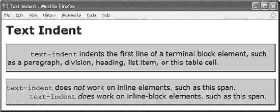

#### HTML

`<h1>Text Indent</h1>

<table><tr>**<td class="text-indent">**<code>text-indent</code>
  indents the first line of a terminal block element, such as a paragraph,
  division, heading, list item, or this table cell.
**</td>**</tr></table>

****<code>text-indent</code> does
  <em>not</em> work on inline elements, such as this span.****
  <code>text-indent</code>
    <em>does</em> work on inline-block elements, such as this span.
`

#### CSS

`**.text-indent { text-indent:60px; }**
**.inline-block { display:inline-block; }**

/*  Nonessential rules are not shown. */`

#### 文本缩进

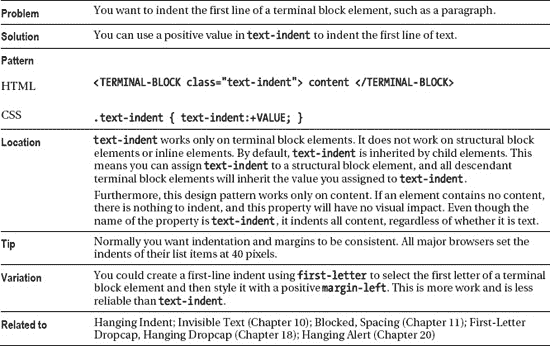

### 悬挂缩进

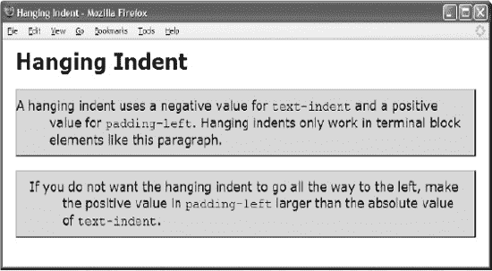

#### HTML

`<h1>Hanging Indent</h1>

**
**A hanging indent uses a negative value for
  <code>text-indent</code> and a positive value for <code>padding-left</code>.
  Hanging indents work only in terminal block elements like this paragraph.

**
**If you do not want the hanging indent to
  go all the way to the left, make the positive value in <code>padding-left</code>
  larger than the absolute value of <code>text-indent</code>.
`

#### CSS

`**.hanging-indent { text-indent:-50px; padding-left:50px; }**
**.hanging-indent2 { text-indent:-50px; padding-left:70px; }**

/*  Nonessential rules are not shown. */`

#### 悬挂缩进

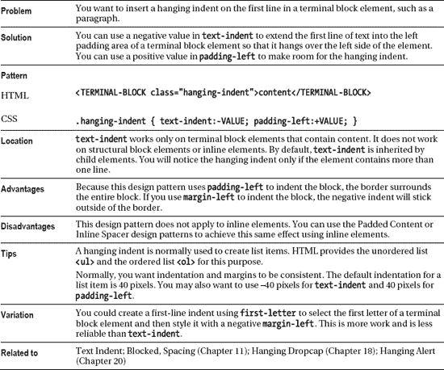

### 水平对齐内容

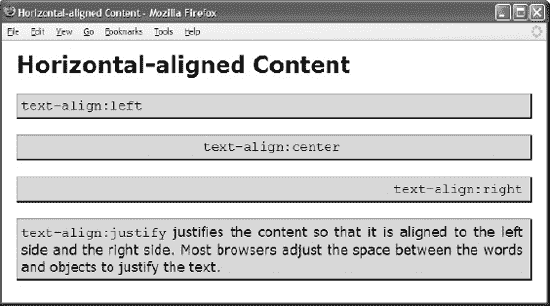

#### HTML

`<h1>Horizontal-Aligned Content</h1>

**<code>text-align:left</code>

**<code>text-align:center</code>

**<code>text-align:right</code>

**<code>text-align:justify</code> justifies the content so
  that it is aligned to the left side and the right side. Most browsers adjust
  the space between the words and objects to justify the text.
`

#### CSS

`**.align-left { text-align:left; }**
**.align-center { text-align:center; }**
**.align-right { text-align:right; }**
**.align-justify { text-align:justify; }**

/*  Nonessential rules are not shown. */`

#### 水平对齐内容

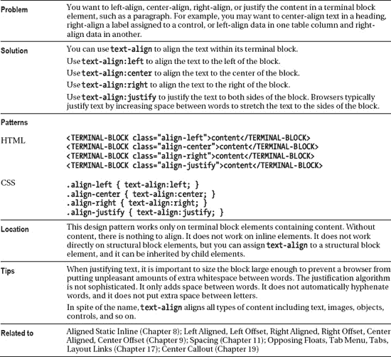

### 垂直对齐内容

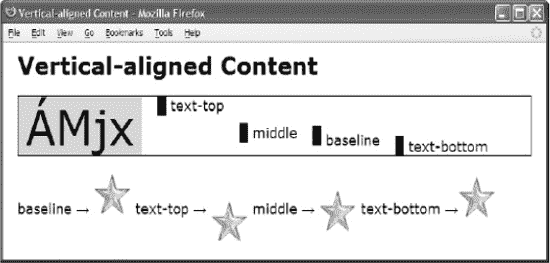

#### HTML

`<h1>Vertical-Aligned Content</h1>

 
**ÁMjx
      ** text-top
      ** middle
      ** baseline
      ** text-bottom

 
**
  baseline &rarr; 
  text-top &rarr; 
  middle &rarr; 
  text-bottom &rarr; 
`

#### CSS

`**div { font-size:60px;** line-height:normal; border:1px solid black; }
.main { background-color:gold; padding:0 10px; }

.text { **font-size:18px;** }

.text-top { vertical-align:**text-top; }**
.middle { vertical-align:**middle; }**
.baseline { vertical-align**:baseline; }**
.text-bottom { vertical-align**:text-bottom; }**`

#### 垂直对齐内容

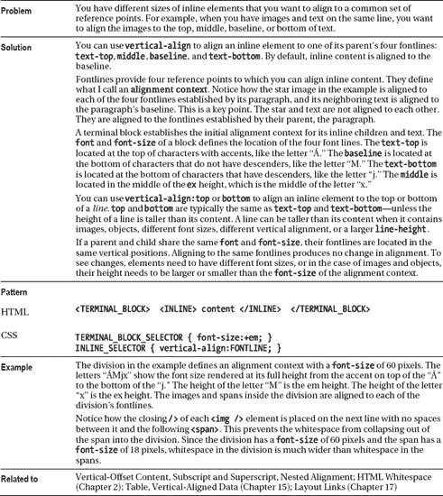

### 垂直偏移内容

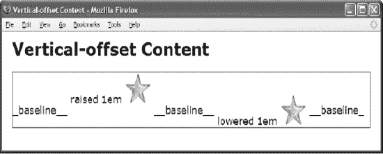

#### HTML

`<h1>Vertical-Offset Content</h1>

  _baseline__

  **raised 1em 
  

  __baseline__

  **lowered 1em 
  

  __baseline_

`

#### CSS

`div { border:1px solid black; }

.baseline { vertical-align:baseline; }
.raised { vertical-align:**1em;** }
.lowered { vertical-align:**-1em;** }`

#### 垂直偏移内容

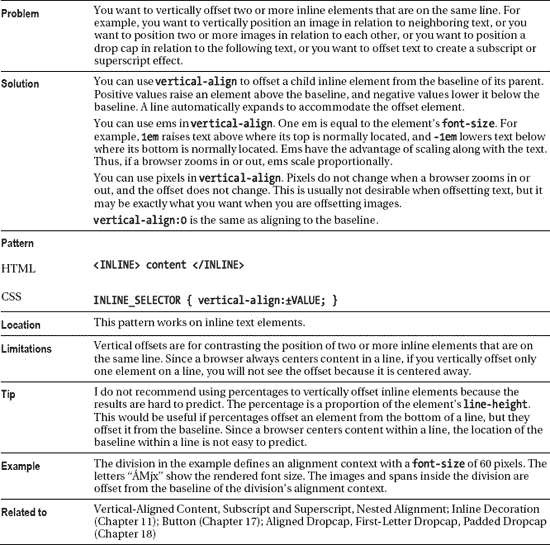

### 下标和上标

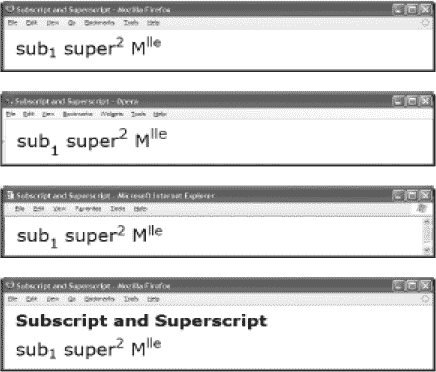

#### HTML

`<h1>Subscript and Superscript</h1>

sub**1** super**2 Mlle**
`

#### CSS

`**sub { vertical-align:-0.5em; font-size:0.75em; }**
**sup { vertical-align:0.5em;  font-size:0.75em; }**

.large { font-size:32px; }`

#### CSS Internet Explorer

`**sub { font-size:0.9em; }**
**sup { font-size:0.9em; }**`

#### 下标和上标

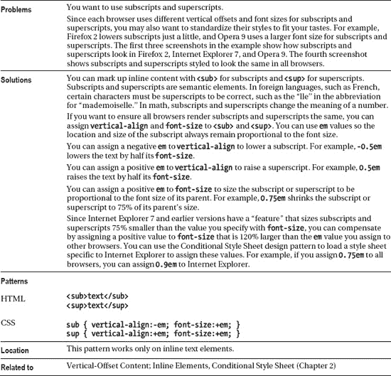

### 嵌套对齐

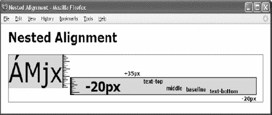

#### HTML

`<h1>Nested Alignment</h1>

**
**
  ÁMjx 
**  &nbsp; &nbsp; -20px
**    +35px
**    text-top
**    middle
**    baseline
**    text-bottom
**    -20px
  
 
`

#### CSS

`**.ac1 { font-size:50px; }**
**.ac2 { font-size:30px; }**
**.ac3 { font-size:12px; }**

.raise35px { vertical-align:35px; }
.lower20px { vertical-align:-20px; }
.text-top { vertical-align:text-top; }
.middle { vertical-align:middle; }
.baseline { vertical-align:baseline; }
.text-bottom { vertical-align:text-bottom; }

/*  Nonessential rules are not shown. */`

#### 嵌套对齐

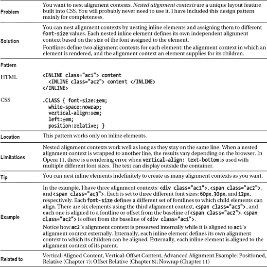

### 高级对齐示例

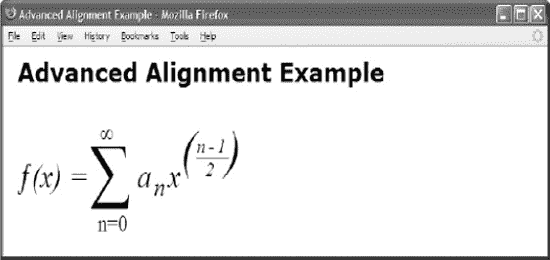

#### HTML

`<h1>Advanced Alignment Example</h1>

**
**  **
    **&fnof;(x) = 
    **&sum;
    **n=0
    **&infin;
    **anx
**    **
      (n-12
       )

`

#### CSS

`sub { vertical-align:-0.3em; font-size:0.75em; }

**.ac1 {font-size:4em;** font-family:"Times New Roman" serif; white-space:nowrap; }
**.ac1-func{vertical-align:0.6em;** font-size:0.3em; font-style:italic; }
.ac1-sum {vertical-align:0.2em; font-size:0.6em; **position:relative; left:-0.1em; }**
.ac1-max {vertical-align:3em;   font-size:0.2em; position:relative; left:-6em; }
.ac1-min {vertical-align:-1em;  font-size:0.2em; position:relative; left:-3.3em; }
.ac1-formula { vertical-align:0.6em; font-size:0.3em; font-style:italic;
  position:relative; left:-4em; letter-spacing:0.1em; }

**.ac2 {vertical-align:0.4em; font-size:1.5em;** position:relative; left:-0.3em; }
.ac2-num {vertical-align:0.7em;  font-size:0.4em; border-bottom:1px solid black; }
.ac2-dnm {vertical-align:-0.4em; font-size:0.4em; position:relative; left:-1.4em; }
.ac2-close { position:relative; left:-0.65em; }`

#### 高级对齐示例

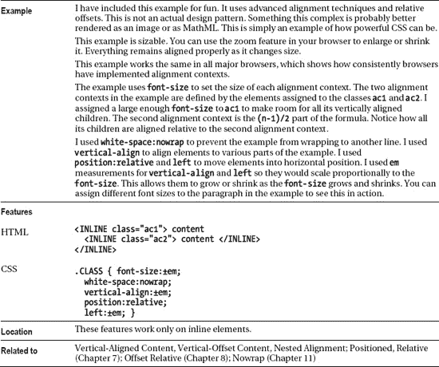