# 十三、块

这一章的主要目的是展示通过样式化块来强调文档结构的各种方法。其他章节中的许多设计模式都适用于块，但是本章包含了特定于样式块元素以显示文档结构的模式。

### 章节大纲

*   **结构意义**展示了块如何创建层次和顺序结构。
*   **视觉结构**展示了如何设计块的样式以显示文档结构。
*   **Section** 展示了如何将你的文档组织成几个部分，以便于搜索引擎和文档处理程序进行样式化和更好的结构化。
*   **列表**展示了许多创建列表和列表标记的方法。
*   显示了如何使用背景图片给列表添加项目符号。
*   **inline**展示了如何渲染一个块元素，就像它是一个内联元素一样。这允许块从左到右呈现，并换行。
*   **折叠边距**显示了如何折叠和取消折叠块元素之间的垂直边距。
*   **Run-In** 展示了如何将一个块运行到下一个兄弟块中，就好像它是下一个块中的内联元素一样。插入式标题节省空间，非常吸引人。
*   **水平标尺**展示了如何使用水平标尺并设置其样式，尽管 Internet Explorer 7 会导致一些问题，它拒绝从`
`中删除其内置样式。
*   **块间隔符**展示了如何在选择的块之间插入精确的垂直间隔，而不必单独调整边距。
*   **块空间移除器**展示了如何移除选定块之间的精确垂直空间，而无需单独调整边距。
*   **Left Marginal** 展示了如何从正常流程中提取标题、注释、警告和图像，并将它们移动到一个较宽的左边距中。
*   **右边距**的工作方式类似左边距，除了项目被移动到右边。

### 结构意义

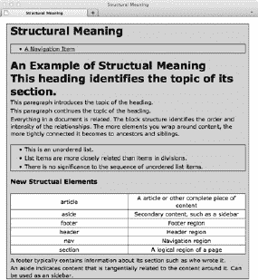

#### HTML

`**<body>**
**<div** id="wrapper">
**  <header><h1>**Structural Meaning</h1></header>

**  <nav><ul><li>**<a href="#">A Navigation Item</a></li></ul></nav>

**  <article>**
**    <header><h1>**An Example of Structural Meaning</h1></header>
**    <section>**
**      <header><hgroup>**
**        <h1>**This heading identifies the topic of its section.</h1>
**        
**This paragraph introduces the topic of the heading.

**        
**This paragraph continues the topic of the heading.
 </hgroup></header>

**      
**Everything in a document is related. The block structure identifies the
  order and intensity of the relationships. The more elements you wrap around
  content, the more tightly connected it becomes to ancestors and siblings.

**      <ul>**
**        <li>**This is an unordered list.</li>
**        <li>**List items are more closely related than items in divisions.</li>
**        <li>**There is no significance to the sequence of unordered list items.</li> </ul>

**      <h3>**New Structural Elements</h3>
**<table><tbody>** **        <tr><td>**article</td><td>An article or other complete piece of content</td></tr>
**        <tr><td>**aside</td><td>Secondary content, such as a sidebar</td></tr>
**        <tr><td>**footer</td><td>Footer region</td></tr>
**        <tr><td>**header</td><td>Header region</td></tr>
**        <tr><td>**nav</td><td>Navigation region</td></tr>
**        <tr><td>**section</td><td>A logical region of a page</td></tr> </tbody></table>` `    </section>

**    <footer>**
**      
**A footer typically contains information about its section such as who wrote it.

</footer>
  </article>

**  <aside** id="sidebar">
**    
**An aside indicates content that is tangentially related to the content around it. Can
be used as a sidebar.
 </aside>

</body>`

#### 结构意义

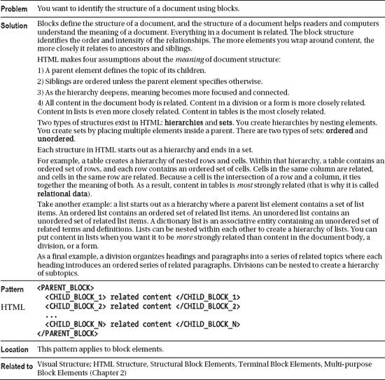

### 视觉结构

参见结构化含义设计模式中的例子。

#### CSS(用于结构意义设计模式)

`h1 { margin:0; font-size:1.9em; }
h2 { margin:0; margin-top:3px; font-size:1.2em; }

header,nav,section,aside,footer,article{ display:block; }
ul,div,td,th { border:1px solid black; background-color:gold; margin-top:20px; }
div { padding:0 10px; }
table { border-collapse:collapse; margin:5px 0; }
td,th { background-color:white; width:20%; text-align:center; padding:2px; }
ul { margin-left:0; padding:0 40px; }
p,li { margin:0; padding:2px 0; }`

**造型异常**

当您设计项目类别时，样式表很好用，但是当您设计例外时，它很快就变得很麻烦。要设置一个元素的样式，通常需要向它添加一个 ID，并在样式表中设置 ID 的样式。这对于单个文档来说是一个小问题，但是随着时间的推移，随着文档的变化、样式的改变以及数百个文档共享相同的样式表，这个问题会变成一个维护问题。例如，由于用于特殊样式的 ID 是元素的一部分，因此当元素移动时，特殊样式也会随之移动。当您修改文档时，这可能会导致意想不到的结果，并且会让您徒劳地寻找问题的原因。

水平标尺、块间隔符或块空间移除器设计模式是设计异常情况的好解决方案，因为它们将元素插入到文档中。该元素具有结构化的含义，是自文档化的，并且易于重新定位。您可以使用标准类来设计这些间隔元素的样式，这样您就不再是设计异常了。间隔元件仅用于特殊情况。

**位置造型**

有时，您可能希望对某个元素进行样式化，因为它位于特定的位置。例如，您可能希望更改块的第一个子元素之前和最后一个子元素之后的边距量，因为折叠的边距对第一个和最后一个子元素的作用不同。如果将异常边距直接应用于第一个子元素，然后移动第一个子元素使其成为中间的子元素，其异常边距也会随之移动。这不是您想要的结果，因为您想要*样式化位置*——而不是元素。

设置位置样式的一种方法是使用水平标尺、块间隔符或块空间移除符设计模式。这是因为很容易将一个间隔元素保持在正确的位置——特别是如果你直观地命名它的类，比如`"first-child"`和`"last-child"`。CSS 3 位置选择器对于位置样式来说足够强大，并且几乎完全被现代浏览器支持。

#### 视觉结构

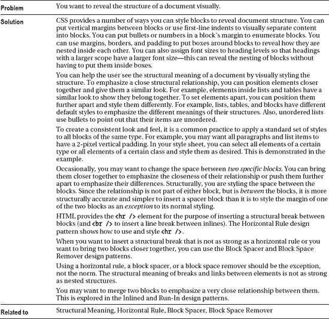

### 节

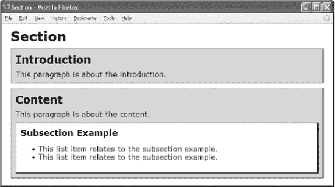

#### HTML

`<h1>Section</h1>

**<section class="introduction”>**
   <h2>Introduction</h2>
   
This paragraph is about the introduction.

</section>

**<section class="content">**
  <h2>Content</h2>
  
This paragraph is about the content.

**  <section class="section example">**
    <h3>Subsection Example</h3>
      <ul><li>This list item relates to the subsection example.</li>
        <li>This list item relates to the subsection example.</li></ul>
  </section>
</section>`

#### CSS

`section { padding:10px; margin:10px 0; background-color:gold;
  border-left:1px solid gray; border-right:2px solid black;
  border-top:1px solid gray; border-bottom:2px solid black; display:block; }
section p { margin:0; margin-top:5px; }
section h2 { margin:0; margin-bottom:10px; }
section h3 { margin:0; margin-bottom:10px; }
section.example { background-color:white; }
section section { margin-bottom:0; }`

#### 节

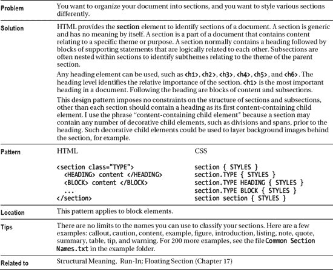

### 列表

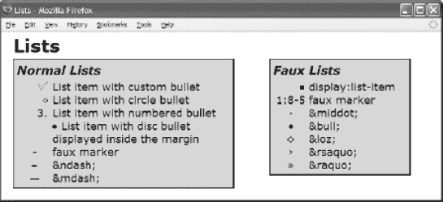

#### HTML

`<h1>Lists</h1>
<section id="section1"><h2>Normal Lists</h2>
  <ul><li **class="custom">**List item with custom bullet</li>
    <li **class="circle">**List item with circle bullet</li>
    <li **class="decimal">**List item with numbered bullet</li>
    <li **class="inside">**List item with disc bullet displayed inside the margin</li>
    <li **class="none">****-faux marker</li>
    <li **class="none">****&ndash;&amp;ndash;</li>
    <li **class="none">****&mdash;&amp;mdash;</li></ul></section>
<section id="section2"><h2>Faux Lists</h2>
  **display:list-item
    
****1:8-5faux marker

    
****&middot;&amp;middot;

    
****&bull;&amp;bull;

    
****&loz;&amp;loz;

    
****&rsaquo;&amp;rsaquo;

    
****&raquo;&amp;raquo;
</section>`

#### CSS

`ul { margin-left:0; padding-left:0; } /* Normalized list */
ul li { margin-left:60px; }

**.listed { margin-left:60px; display:list-item; list-style:square; }**

**.list { margin-left:60px; }**
**.marker { float:left; margin-left:-60px; width:60px; text-align:center; }**

.custom  { list-style-image:url("check.gif"); }
.circle  { list-style-type:circle; }
.decimal { list-style-type:decimal; }
.inside  { list-style-position:inside; }
.none    { list-style-type:none; }

/* Nonessential rules are not shown. */`

#### 列表

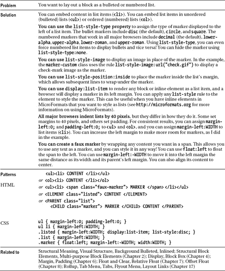

### 背景项目符号

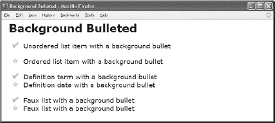

#### HTML

`<h1>Background Bulleted</h1>

<ul **class="bb-list">**
  <li **class="bb1">**Unordered list item with a background bullet</li></ul>

<ol **class="bb-list">**
  <li **class="bb2">**Ordered list item with a background bullet</li></ol>

<dl **class="bb-list">**
  <dt **class="bb1">**Definition term with a background bullet</dt>
  <dd **class="bb2">**Definition data with a background bullet</dd></dl>

**
  
**Faux list with a background bullet

  
**Faux list with a background bullet

`

#### CSS

`.bb-list { padding-left:40px; margin-left:0; margin-top:20px; }
**.bb-list li,**
**.bb-list dt,**
**.bb-list dd,**
**.bb-list p { padding-left:40px; margin-left:-40px; list-style-type:none;**
  margin-top:0; margin-bottom:0; }

**.bb1** { background:**url("check.gif")** no-repeat **10px 1px; }**
**.bb2** { background:**url("star.gif")** no-repeat **10px 1px; }**`

#### 背景项目符号

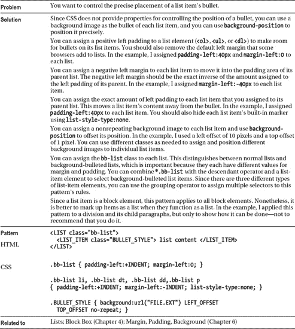

### 内联

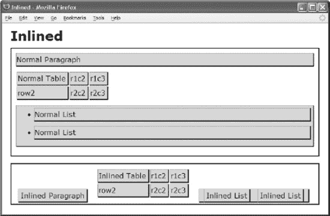

#### HTML

`<h1>Inlined</h1>

  
Normal Paragraph

  <table><tr><td>Normal Table</td><td>r1c2</td><td>r1c3</td></tr>
    <tr><td>row2</td><td>r2c2</td><td>r2c3</td></tr></table>
  <ul><li>Normal List</li><li>Normal List</li></ul>

**  
**Inlined Paragraph

**  <table class="inlined">**
    <tr><td>Inlined Table</td><td>r1c2</td><td>r1c3</td></tr>
    <tr><td>row2</td><td>r2c2</td><td>r2c3</td></tr></table>
**  <ul class="inlined"><li class="inlined">**Inlined List</li>
**  <li class="inlined">**Inlined List</li></ul>
`

#### CSS

`div { padding:10px; margin-bottom:15px; border:2px solid black; }
table, p, td, ul, li { margin-top:0px; margin-bottom:10px; padding-right:5px; }
p, td, ul, li { background-color:gold; padding-top:5px; padding-bottom:5px;
  border-left:1px solid gray; border-right:2px solid black;
  border-top:1px solid gray; border-bottom:2px solid black; }

**.inlined { display:inline; line-height:normal; padding:5px; margin:5px; vertical-align:bottom;**
**}**
**table.inlined{ display:inline-table; }**`

#### 内联

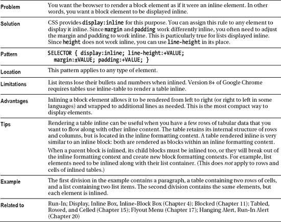

### 折叠页边距

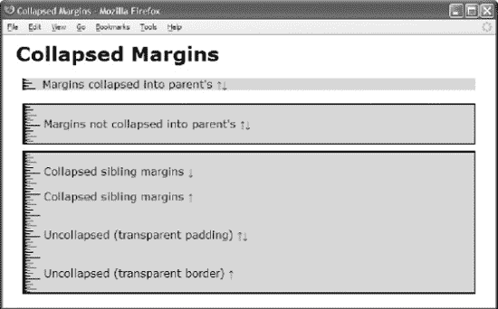

#### HTML

`<h1>Collapsed Margins</h1>

**
**Margins collapsed into parent's &uarr;&darr;

**
**
  
Margins not collapsed into parent's &uarr;&darr;

  **
**Collapsed sibling margins &darr;

  **
**Collapsed sibling margins &uarr;

  **
**Uncollapsed (transparent padding) &uarr;&darr;

  **
**Uncollapsed (transparent border) &uarr;

`

#### CSS

`div { margin:10px; padding-left:30px; background-color:gold;
  background-image: url("ruler.gif"); background-repeat:repeat-y; }
.border { border:2px solid black; }

**.collapsed { margin-top:20px; margin-bottom:20px; }**

**.uncollapsed1** { margin-top:0; margin-bottom:0;
**  padding-top:20px; padding-bottom:20px;**
**  background-color:transparent; }**

**.uncollapsed2** { margin-top:0; margin-bottom:0;
**  border-top:20px solid transparent;**
**  border-bottom:20px solid transparent; }**`

#### 折叠页边距

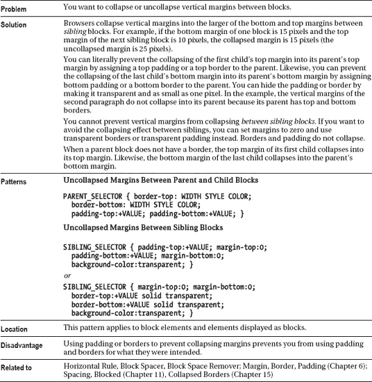

### 磨合

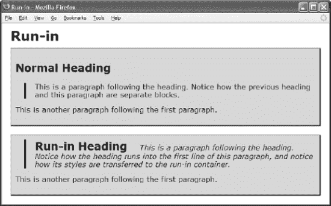

#### HTML

`<h1>Run-In</h1>
<section>
  <h2>Normal Heading</h2>
**  
**This is a paragraph following the heading. Notice
    how the previous heading and this paragraph are separate blocks.

  
This is another paragraph following the first paragraph.
</section>

<section>
**  <div  class="run-in-container indent">**
**    <h2 class="run-in">Run-In Heading</h2>**
**    <p  class="run-in">This is a paragraph following the heading. Notice how**
**      the heading runs into the first line of this paragraph, and notice how**
**      its styles are transferred to the run-in container.
**
**  
**
  
This is another paragraph following the first paragraph.
</section>`

#### CSS

`section { padding:10px; margin-bottom:20px; background-color:gold;
  border-left:1px solid gray; border-right:2px solid black;
  border-top:1px solid gray; border-bottom:2px solid black; display: block; }
.indent { margin-left:20px; border-left:4px solid black; padding-left:20px; }

**.run-in { display:inline; }**
.run-in-container h2 { padding-right:20px; }
.run-in-container p { font-style:italic; }`

#### 磨合

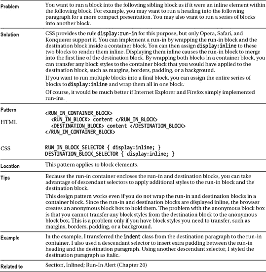

### 横尺

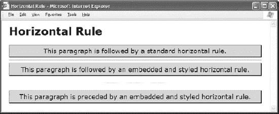

#### HTML

`<h1>Horizontal Rule</h1>

This paragraph is followed by a standard horizontal rule.

**
**

This paragraph is followed by an embedded and styled horizontal rule.

**

**

This paragraph is preceded by an embedded and styled horizontal rule.
`

#### CSS

`.hr { height:40px; width:200px;
  margin:0 auto 0 auto;
  border:0;
  background:url("hr.gif") repeat-x left center;
  line-height:1px; font-size:1px; }

.hr hr { display:none; }

/* Nonessential rules are not shown. */`

#### 横尺

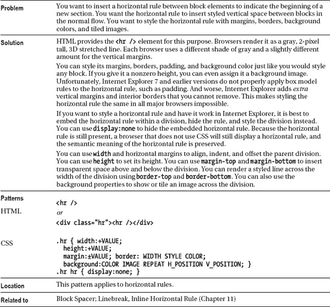

### 垫块垫片

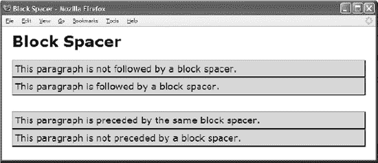

#### HTML

`<h1>Block Spacer</h1>

This paragraph is not followed by a block spacer.

This paragraph is followed by a block spacer.

**

**

This paragraph is preceded by the same block spacer.

This paragraph is not preceded by a block spacer.
`

#### CSS

`**p { margin:0;** padding:5px; background-color:gold;
  border-left:1px solid gray; border-right:2px solid black;
  border-top:1px solid gray; border-bottom:2px solid black; }

**.spacer-large { padding-bottom:32px; }**`

#### 垫块垫片

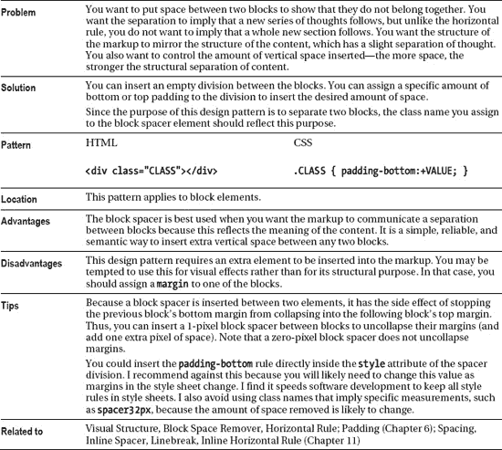

### 块空间去除器

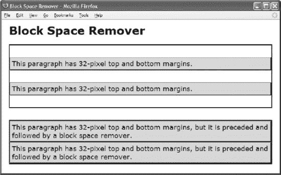

#### HTML

`<h1>Block Space Remover</h1>

  
This paragraph has 32-pixel top and bottom margins.

  
This paragraph has 32-pixel top and bottom margins.

<section>
**  

**
  
This paragraph has 32-pixel top and bottom margins,
    but it is preceded and followed by a block space remover.

**  

**
  
This paragraph has 32-pixel top and bottom margins,
    but it is preceded and followed by a block space remover.

**  

**
 </section>`

#### CSS

`section { border:2px solid black; margin-bottom:32px; display:block; }
**p { margin-top:32px; margin-bottom:32px;** padding:5px; background-color:gold;
  border-left:1px solid gray; border-right:2px solid black;
  border-top:1px solid gray; border-bottom:2px solid black; }

**.space-remover-large { margin-top:-32px; }**`

#### 块空间去除器

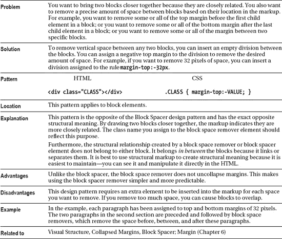

### 左旁注

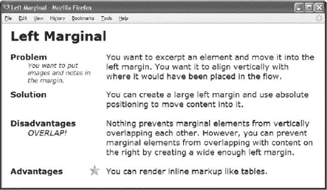

#### HTML

`<h1>Left Marginal</h1>
**
****ProblemYou want to
  excerpt an element and move it into the left margin.**
  You want to put images and notes in the margin. You want it to align
  vertically with where it would have been placed in the flow.

****SolutionYou can
  create a large left margin and use absolute positioning to move content
  into it.   **Disadvantages
  Nothing prevents marginal elements from vertically overlapping each other.
  **OVERLAP!
  However, you can prevent marginal elements from overlapping with content on
  the right by creating a wide enough left margin.   
  **AdvantagesYou can render inline markup like tables.
`

#### CSS

`**.left-marginal { position:relative; width:480px;**
**  margin-left:230px; margin-right:auto; }**
.marginal-header { position:absolute; left:-220px; width:160px; font-weight:bold; }
.marginal-note { position:absolute; left:-180px; width:150px;
  font-style:italic; font-size:14px; font-weight:normal; }
.marginal-alert { position:absolute; left:-180px; font-style:italic; }
.marginal-flag { position:absolute; left:-40px; margin-top:-5px; }`

#### 左旁注

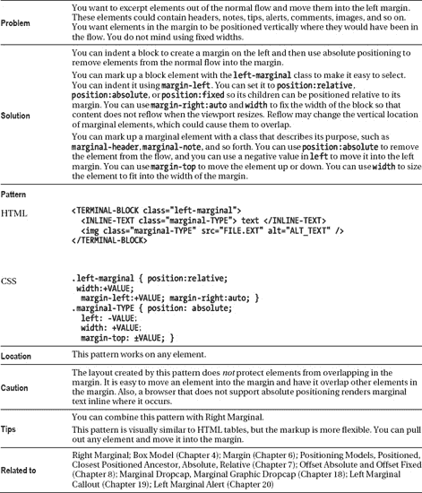

### 右旁注

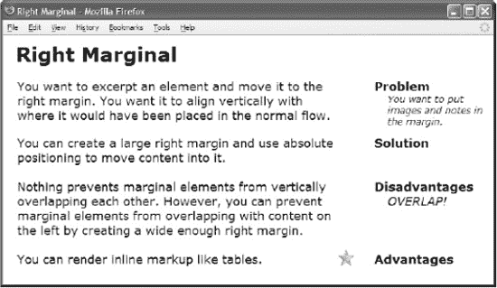

#### HTML

`<h1>Right Marginal</h1>

****ProblemYou want to
  excerpt an element and move it to the right margin. **
  You want to put images and notes in the margin. You want it to align
  vertically with where it would have been placed in the normal flow.

****SolutionYou can
  create a large right margin and use absolute positioning to move content
  into it.   **Disadvantages
  Nothing prevents marginal elements from vertically overlapping each other.
  **OVERLAP!
  However, you can prevent marginal elements from overlapping with content on
  the left by creating a wide enough right margin.   
  **AdvantagesYou can render inline markup like tables.
`

#### CSS

`**body { width:702px; }**
**.right-marginal { position:relative; width:480px;**
**  margin-right:210px; margin-left:auto; }**

.marginal-header {position:absolute; right:-230px; width:170px; font-weight:bold; }
.marginal-note { position:absolute; right:-230px; width:150px;
  font-style:italic; font-size:14px; font-weight:normal; }
.marginal-alert {position:absolute; right:-230px; width:150px; font-style:italic; }
.marginal-flag { position:absolute; right:-30px;  margin-top:-5px; }`

#### 右旁注

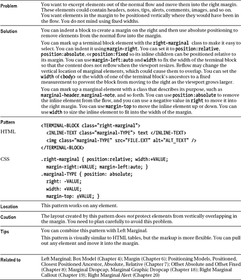