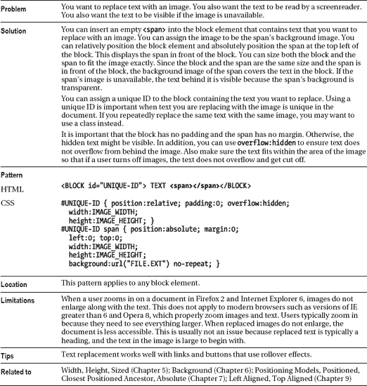

# 十四、图象

本章展示了如何使用图像来创建美观实用的文档，以便快速访问和下载。

### 章节大纲

*   **图片**展示了如何使用``元素。它还对比了 GIF、JPG 和 PNG 图像格式的优缺点。
*   **Image Map** 展示了如何用链接到其他页面的可点击区域覆盖图像。
*   **淡出**展示了如何使用渐变图像在内容后面添加微妙的阴影。它还展示了如何创建适应当前背景的变色龙渐变。
*   **半透明**展示了如何将一个部分透明的背景放在一个元素的后面，这样它就从它下面的背景中突出来，而不会模糊它。
*   **替换文本**展示了如何用图像替换文本，同时保持对非视觉用户的可访问性。当图像不可用时，这种技术也显示文本。
*   **图像上的内容**展示了如何在图像上叠加文本和其他图像。
*   **背景图片上的内容**展示了如何在背景图片上覆盖文本和其他图片。
*   **CSS Sprite** 展示了如何将多个图像嵌入到一个文件中，并将它们独立显示为文档中不同元素的背景。
*   **基本阴影图像**展示了如何在不修改图像本身的情况下，创建并应用一个简单的阴影到图像上。
*   **阴影图像**展示了一种将阴影应用于任何尺寸图像的通用方法。
*   **圆角**展示了如何将一个元素的边框圆角化，以及如何创建可以想象的任何风格的自定义边框。
*   **图片示例**在一个文档中展示了这些模式。

### 图像

#### HTML

`**

**<!-- Nonessential markup is not shown. -->**`

#### CSS

`**img { display:block; width:auto; height:auto; }**

/* Nonessential rules are not shown. */`

#### 举例

这个例子包含了我在 2003 年 8 月 4 日拍摄的火山口湖照片的八个不同版本。源图像为 742×556 像素，文件大小为 1，238，822 字节。我对图像进行了处理，创建了八个独立的文件——每个文件都有不同的图像类型和质量。

第一个图像是最高质量的 JPG 图像，它将文件大小减少到 275，798 字节。这减少了五倍。在 JPG 的最高质量，很难看到任何质量的损失。第二个图像是 90%质量的 JPG，这将文件大小减少到 81，248 字节。这减少了 15 倍。在 90%的质量下，用放大镜几乎看不出区别。您可以在第三个和第四个图像中看到差异，这两个图像是 75%和 50%质量的 jpg，分别为 41，290 和 14，841 字节。这分别减少了 30 倍和 84 倍。

第五张和第六张图是 gif。这些图像比 JPG 图像质量差，尺寸大。这不是对 gif 的公平测试，因为它们不是为包含成千上万种颜色的真实图像而设计的。gif 生成的文件较小，用于包含 256 色或更少颜色的计算机生成的图像时质量较好。

第七个和第八个图像是 png。这些图像的质量最好，文件大小略小于质量最好的 JPG，但无法通过增加压缩率来缩小文件大小。

#### 图像

### 影像地图

#### HTML

`<h1>Image Map</h1>

<h2><a id="home" href="example.html">Northwest USA</a></h2>

**<map id="nw-map" name="nw-map">**

**  <area** href="washington.html" alt="Washington"
**    shape="poly"** coords="176,8, 164,89, 75,89, 40,72, 45,8" />

**  <area** href="oregon.html" alt="Oregon"
**    shape="rect"** coords="9,90, 155,180" />

**  <area** href="idaho.html" alt="Idaho"
**    shape="circle"** coords="212, 134,55" />
 </map>`

#### CSS

`/* There are no CSS properties for styling image maps. */`

#### 影像地图

### 淡出

#### HTML

`<h1>Fade-Out</h1>

<h2 **class="g1">**g1 Horizontal Fade-Out of GIF image to gold background color.</h2>
<h2 **class="g2">**g2 Horizontal Fade-Out of any background color to PNG image.</h2>

<h2 **class="g3">**g3 Vertical Fade-Out of GIF image to white background color.</h2>
<h2 **class="g4">**g4 Vertical Fade-Out of JPG image to white background color.</h2>
<h2 **class="g5">**g5 Vertical Fade-Out of any background color to PNG image.</h2>
<h2 **class="g6">**g6 Vertical Fade-Out of PNG image to any background color.</h2>

**g7 Vertical Fade-Out of PNG image to any background color from top and
bottom.
`

#### CSS

`.g1 { background:url("h-white2gold.gif") repeat-y left top gold; }
.g2 { background:url("h-trans2white**.png") repeat-y right** top **royalblue; }**

.g3 { background:url("v-gold2white**.gif") repeat-x** left **top white; }**
.g4 { background:url("v-lightning**.jpg") repeat-x** left **top white; }**
.g5 { background:url("v-trans2white**.png") repeat-x** left **bottom red; }**
.g6 { background:url("v-white2trans**.png") repeat-x** left **top green; }**
.g7 {background:url("v-white2trans**.png")** repeat-x left top, url("v-trans2white.png") repeat-x
left bottom green; }

/* Nonessential rules are not shown. */`

#### 淡出

### 半透明

#### HTML

`<h1>Semi-transparent</h1>

  

  **Washington
  **Oregon
  **Idaho

  
**
    Semi-transparent backgrounds are gray in Internet Explorer 6, but they are
    semi-transparent in Internet Explorer 7 and all other major browsers.

`

#### CSS

`**.overlay { background:url("semi-transparent.png") repeat; }**

**#note1 { background:url("trans2white.png") bottom left repeat-x; }**

/* Nonessential rules are not shown. */`

#### 半透明

### 替换文字

#### HTML

`<h1>Replaced Text</h1>

<h2 **id="h2">**Heading **2**</h2>`

#### CSS

`#h2 { position:relative; **width:250px; height:76px;**
  padding:0; overflow:hidden; }

#h2 span { position:absolute; **width:250px; height:76px;**
  left:0; top:0; margin:0;
  background:url("heading2.jpg") no-repeat; }`

#### 替换文字

### 内容超过图像

#### HTML

`<h1>Content over Image</h1>

**
  <h3 **class="caption">**Crater Lake North Rim</h3>
  
** August 4, 2003
    

**  
`

#### CSS

`.figure { **float:left; position:relative;**
  color:white; background-color:black; }

.figure .caption { **position:absolute;** margin:15px; left:0; top:0;
  font-size:1.05em; }

.framed { **display:block;**
  border-left:1px solid gray; border-right:2px solid black;
  border-top:1px solid gray; border-bottom:2px solid black; }

#crater-date { **position:absolute;** left:0; bottom:10px; width:518px;
  text-align:center; color:white; font-size:0.8em; }`

#### 内容超过图像

### 背景图片上的内容

#### HTML

`<h1>Content over Background Image</h1>

  <h3 **class="caption">**Crater Lake North Rim</h3>
  
** August 4, 2003
  

`

#### CSS

`**#crater-lake { position:relative; padding:0; width:700px; height:500px;**
**  background:black url("crater-lake.jpg") no-repeat center center; }**

#crater-lake .caption { **position:absolute;** margin:15px; left:0; top:0;
  font-size:1.05em; color:white; }

#crater-date { **position:absolute;** left:0; bottom:10px; width:700px;
  text-align:center; color:white; font-size:0.8em; }

/* Nonessential rules are not shown. */`

#### 背景图片上的内容

### CSS 雪碧

#### HTML

`<h1>CSS Sprite</h1>

  

  <a id="olympia" **class="bang-bg"** href="olympia.html" title="Olympia">
    **Olympia</a>

  <a id="salem" **class="flag-bg"** href="salem.html" title="Salem">
    **Salem</a>

  <a id="boise" **class="star-bg"** href="boise.html" title="Boise">
    **Boise</a>

`

#### CSS

`**.bang-bg** { background:url("bt.gif") -48px -16px; width:16px; height:16px; }
**.flag-bg** { background:url("bt.gif") -64px -16px; width:16px; height:16px; }
**.star-bg** { background:url("bt.gif") -64px -32px; width:16px; height:16px; }

.star-bg**:hover** { background-image:url("wt.gif"); background-color:black; }
.flag-bg**:hover** { background-image:url("wt.gif"); background-color:black; }
.bang-bg**:hover** { background-image:url("wt.gif"); background-color:black; }

.screenreader-only { position:absolute; left:-9999px; top:-9999px;
  width:1px; height:1px; overflow:hidden; }

/* Nonessential rules are not shown. */`

#### CSS 雪碧

### CSS 雪碧账户。

*在`bt.gif`* 中使用的 16×16 子画面的偏移

#### 举例

我在例子中使用了两个 CSS sprite 文件:`bt.gif`(见图 14-1)和`wt.gif`。这些文件名代表透明背景上的黑色图像和透明背景上的白色图像。当用户将鼠标悬停在图像上时，悬停选择器会切换出`bt.gif`，并替换为`wt.gif`，将颜色从黑色转换为白色。背景也变为黑色，透过图像的透明部分显示出来。

我在示例目录中包含了示例中没有使用的另外两个 sprite 文件。它们被命名为`tb.gif`和`tw.gif`。这些文件名代表黑盒中的透明图像和白盒中的透明图像。这些嵌入的图像是黑色和白色的小盒子，中间是透明的图像，可以改变颜色以匹配背景。

我从一个名为 bitcons 的图标集中创建了这四个 CSS 精灵。我把所有嵌入的图像都做成了 16×16 像素，就像原始图像一样。这些图标是免费授权的，可在`[`somerandomdude.net/srd-projects/bitcons`](http://somerandomdude.net/srd-projects/bitcons)`获得。同样，您可以在项目中自由使用这四个 CSS sprite 文件。

当制作你自己的 CSS 精灵图片时，你可以在精灵中嵌入任何大小的图片。嵌入的图像不需要大小相同。你只需要知道每个嵌入图像的偏移量和大小。

#### CSS 雪碧账户。

### 基本阴影图像

#### HTML

`<h1>Basic Shadowed Image</h1>

`

#### CSS

`img.shadowed { padding-right:20px;
  padding-bottom:20px;
  background-image:url("shadow.jpg");
  background-position:right bottom;
  background-repeat:no-repeat; }`

#### 基本阴影图像

### 阴影图像

*T2`shadow.jpg`*

*`shadow-rt.jpg``shadow-lb.jpg`是从`shadow.jpg`中提取出来的。*

*`shadow-rt.jpg`缩进并关闭阴影的右上边缘。*

*`shadow-lb.jpg`缩进并关闭阴影的左下边缘。*

#### 阴影图像

### 阴影图像 cont。

*阴影图像的合成视图*

#### 阴影图像 cont。

### 阴影图像 cont。

#### HTML

`<h1>Shadowed Image</h1>

  

    

      

        

`

#### CSS

`.shrinkwrapped { float:left; }

.shadowed { background-image:url("shadow.jpg");
  background-position:right bottom; background-repeat:no-repeat; }

.shadowed-rt { background-image:url("shadow-rt.jpg");
  background-position:**right -80px;** background-repeat:no-repeat; }

.shadowed-lb { **padding-right:20px; padding-bottom:20px;**
  background-image:url("shadow-lb.jpg");
  background-position:**-80px bottom;** background-repeat:no-repeat; }`

#### 阴影图像 cont。

### 圆角

#### HTML

`
**
**
**
  You can nest two divisions to create two opposite rounded corners.

**
**
**
  You can nest two divisions to create two opposite rounded corners.

**
  
**
**
**
**
  You can nest four divisions to create four rounded corners.

You can have a single division with multiple backgrounds
`

#### CSS

`**.bg** { background:url("bg.gif") bottom left repeat-x white; **margin-top:20px; }**

**.tl** { background:url("rc.gif") **top left** no-repeat; }
**.br** { background:url("rc.gif") **bottom right** no-repeat; }
**.tr** { background:url("rc.gif") **top right** no-repeat; }
**.bl** { background:url("rc.gif") **bottom left** no-repeat; }

**.trc** { background:url("rc-trc.gif") **top right** no-repeat; }
**.blc** { background:url("rc-blc.gif") **bottom left** no-repeat; }

**.pad** { padding:10px; }
.mbg{ background: url("rc-trc.gif") top right no-repeat, url("rc-blc.gif") bottom left no-repeat, url("rc.gif") top left no-repeat, url("rc.gif") bottom right no-repeat, url("bg.gif")
bottom left repeat-x white; margin-top:20px; }`

#### 圆角

### 圆角连续。

*从圆角矩形图像创建圆角*

#### 创建三个圆角矩形图像

在示例中，我从一个 1600×1600 的透明画布开始。我添加了一个环绕画布边缘的圆角矩形。圆角矩形有一个透明的内部。我用外部背景色填充了每个圆角的*外部*像素，在我的例子中是白色。这使得它们不透明，所以每个角的外部用背景色覆盖内部背景。注意在图 14-7 中，如果第一个圆角矩形的左上角和第二个圆角矩形的右下角不是不透明的，它们将如何显示内部背景。最后，我将图像保存为`rc.gif`。

为了创建剪切图像，我剪切掉圆角矩形图像的左下角和右上角，并将它们保存为单独的 GIF 图像，命名为`tr.gif`和`bl.gif`。我确保角落的外部保持不透明，内部保持透明。否则，他们不会在外面隐藏外部方形边框，让背景在里面显示出来。我把每一个切口的尺寸都设计得足够大，可以用一个圆角盖住方形的角。

创建三个圆角矩形图像很简单:创建一个透明的圆角矩形；填充其圆角的外部；并将左下角和右上角保存为单独的图像。

#### 圆角连续。

### 图像示例

#### HTML 的代表性摘录

`<h1>Northwest USA</h1>

  

  <a id="washington" href="washington.html" class="overlay">Washington</a>
  <a id="oregon" href="oregon.html" class="overlay">Oregon</a>
  <a id="idaho" href="idaho.html" class="overlay">Idaho</a>

  <a id="olympia" class="bang-bg" href="olympia.html" title="Olympia">
    Olympia</a>
  <a id="salem" class="flag-bg" href="salem.html" title="Salem">
    Salem</a>

  

    

      
Click a state to load information about that state.

      
Click a symbol to load information about that location.

      

`

#### 图像示例

#### CSS 代表性摘录

`.shadowed { padding-right:12px; padding-bottom:12px;
  background:url("shadow.jpg") right bottom no-repeat; }

.screenreader-only { position:absolute; left:-9999px; top:-9999px;
  width:1px; height:1px; overflow:hidden; }

a { text-decoration:none; color:black; }
a:hover { border-left:1px solid silver; border-right:1px solid gray; color:white;
  border-top:1px solid silver; border-bottom:1px solid gray;
  background-image:url("semi-transparent.png"); background-repeat:repeat-x; }
.overlay { padding:2px 4px; }

.bg { background:url("white2trans.png") top left repeat-x yellow;
  margin-top:20px; }
.tl { background:url("rc.gif") top left no-repeat; }
.br { background:url("rc.gif") bottom right no-repeat; }
.trc { background:url("rc-trc.gif") top right no-repeat; }
.blc { background:url("rc-blc.gif") bottom left no-repeat; }
.pad { padding:10px; }

.bang-bg { background:url("bt.gif") -48px -16px; width:16px; height:16px; }
.flag-bg { background:url("bt.gif") -64px -16px; width:16px; height:16px;
 }
.star-bg { background:url("bt.gif") -64px -32px; width:16px; height:16px; }

.bang-bg:hover { background-image:url("wt.gif"); background-color:black; }
.star-bg:hover { background-image:url("wt.gif"); background-color:black; }
.flag-bg:hover { background-image:url("wt.gif"); background-color:black; }

#states { position:relative; float:left; }
  #washington { position:absolute; top:35px; left:80px; }
  #oregon { position:absolute; top:135px; left:85px; }
  #idaho { position:absolute; top:150px; left:210px; }`