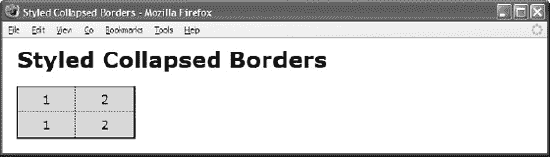

# 十九、表格

表格是 HTML 中最有用和最复杂的结构之一。这是关于表格的两章中的第一章。本章探讨了表格的 HTML 结构以及如何设计它们的样式。下一章将探讨在表格中自动布置列的许多方法。表格的目的是识别表格数据并设置其样式。

### 章节大纲

*   **Table** 展示了如何创建和样式化一个表格的基本结构。
*   **行和列组**展示了如何创建和样式化行标题、行页脚、行组、列组和列。
*   **表格选择器**展示了如何从列、行和行组中选择单元格。
*   **分隔边框**展示了如何分隔表格边框和单元格边框。
*   **折叠边框**展示了如何组合表格和单元格边框。
*   **设计折叠边框**展示了如何设计折叠边框。
*   **隐藏和删除的单元格**显示如何隐藏或删除单元格。
*   **移除和隐藏行和列**展示了如何移除或隐藏单元格的行、行组和列。
*   **垂直对齐数据**展示了如何将数据垂直对齐到单元格的顶部、中部、底部或基线。
*   **条纹表**展示了如何给行分配交替的背景。
*   **可访问的表格**展示了如何创建一个对盲人用户友好的表格。
*   展示了如何将任何元素变成表格、行或单元格。
*   **表格布局**展示了如何创建四种类型的表格:**收缩**、**大小**、**拉伸**和**固定**。

### 表

#### HTML

`<h1>Table</h1>

<h2>Simple Table</h2>
**<table>**
  **<tr> <th>1</th>** <th>2</th> <th>3</th> <th>4 </th> <th>5 </th> <th>6 </th> </tr>
  **<tr> <th>7</th> <td>8</td>** <td>9</td> <td>10</td> <td>11</td> <td>12</td> </tr>
</table>

<h2>Table with Spanned Rows and Cells</h2>
<**table>**
  <tr> **<td rowspan="2">1</td> <td colspan="5">2-6</td>**               </tr>
  <tr> <td>8</td> <td>9</td>  <td> </td> <td>&nbsp;</td> <td>12</td> </tr>
</table>`

#### CSS

`table { width:auto; height:1px; table-layout:auto; border-collapse:collapse;
  margin-left:20px; border:1px solid black; }

td, th { width:50px; height:1px; overflow:hidden; visibility:visible;
  border:1px solid black; padding:5px; background:gold;
  text-align:center; vertical-align:middle; text-indent:5px; }`

#### 表

### 行列分组

#### HTML

`<h1>Row and Column Groups</h1>

<h2>Row Groups</h2>
**<table class="example1">**
  **<thead>** <tr> **<th>**thead</th> **<th>**2 </th> **<th>**3 </th> **<th>**4 </th> </tr> </thead>
  **<tfoot>** <tr> **<th>**tfoot</th> **<td>**10</td> **<td>**11</td> **<td>**12</td> </tr> </tfoot>
  **<tbody>** <tr> **<th>**tbody</th> **<td>**6 </td> **<td>**7 </td> **<td>**8 </td> </tr> </tbody>
</table>

<h2>Columns</h2>
**<table class="example2">**
**  <colgroup><col class="col1" />**<col class=**"col2"** /><col class=**"col3"** />
            <col class=**"col4"** /><col class=**"col5"** /><col class=**"col6"** /></colgroup>

  <tr> <td rowspan="2">1</td> <td colspan="5">2-6</td>               </tr>
  <tr> <td>8</td> <td>9</td>  <td> </td> <td>&nbsp;</td> **<td>12</td>** </tr>
</table>`

#### CSS

`table.example1 **thead** { background:orange; color:black; }
table.example1 **tbody** { background:gold; color:black; }
table.example1 **tfoot** { background:firebrick; color:white; }
.col1 { background:wheat; }
.col2 { background:gold; }
.col3 { background:orange; }
.col4 { background:tomato; }
.col5 { background:firebrick; }
**.col6 { background:black; color:white; }**

/* Nonessential styles are not shown */`

#### 行和列组

### 表格选择器

#### HTML

`<h1>Table Selectors</h1>
**<table id="t1">**
  **<thead>**
    <tr **class="r1">** <td **class="c1"**>r1 c1</td> <td **class="c2"**>c2</td>
                    <td **class="c3"**>c3</td>    <td **class="c4"**>c4</td>
                    <td **class="c5"**>c5</td>    <td **class="c6"**>c6</td> </tr></thead>
 ** <tfoot>**
    <tr **class="r3">** <td class="c1">r3 c1</td> <td class="c2">c2</td>
                    <td class="c3">c3</td>    <td class="c4">c4</td>
                    <td class="c5">c5</td>    <td class="c6">c6</td> </tr></tfoot>
  **<tbody class="b1">**
    <tr **class="r2">** <td class="c1">r2 c1</td> <td class="c2">c2</td>
                    <td class="c3">c3</td>    <td class="c4">c4</td>
                    <td class="c5">c5</td>    <td class="c6">c6</td> </tr></tbody>
</table>`

#### CSS

`table,td,th { border:1px solid black; }        /* Selecting all tables and cells */
td,th { background-color:white; }              /* Selecting all cells */

#t1 { border-collapse:collapse; }              /* Selecting table */
#t1 thead td { font-weight:bold; }             /* Selecting cells in head */
#t1 tfoot td { font-style:italic; }            /* Selecting cells in foot */
#t1 tbody td { font-variant:small-caps; }      /* Selecting cells in body */
#t1 .b1  td { font-size:1.2em; }               /* Selecting cells in body */
#t1 .c3 { display:none; }                      /* Selecting cells in column */
#t1 .c4 { background-color:firebrick; color:white; }
#t1 .r1 { background-color:gold; color:black; }     /* Selecting row-no effect*/
#t1 .r2 td { background-color:gold; color:black; }  /* Selecting cells in row */
#t1 .r2 .c6 { font-size:1.8em; font-weight:bold; } /* Selecting cell */

/* Nonessential styles are not shown */`

### 表格选择器

### 分隔边框

#### HTML

`<h1>Separated Borders</h1>

<h2>Boxed Table</h2>
**<table class="boxed-table" cellspacing="5">**
<tr><td rowspan="2">1</td><td colspan="5">2-6</td></tr>
<tr><td>7</td><td>8</td><td> </td><td>**&nbsp;**</td><td **class="x"**>11</td></tr></table>

<h2>Boxed Cells</h2>
**<table class="boxed-cells" cellspacing="5">**
<tr><td rowspan="2">1</td><td colspan="5">2-6</td></tr>
<tr><td>7</td><td>8</td><td> </td><td>**&nbsp;**</td><td **class="x"**>11</td></tr></table>

<h2>Boxed Table and Cells</h2>
**<table class="boxed-table boxed-cells" cellspacing="5">**
<tr><td rowspan="2">1</td><td colspan="5">2-6</td></tr>
<tr><td>7</td><td>8</td><td> </td><td>**&nbsp;**</td><td **class="x"**>11</td></tr></table>`

#### CSS

`table { **border-collapse:separate;** }
.boxed-table { border:1px solid black; }
.boxed-cells td { border:1px solid black; }
.boxed-cells td.x { border:none; }

/* Nonessential styles are not shown */`

### 分隔边框

### 折叠边框

#### HTML

`<h1>Collapsed Borders</h1>

<h2>Boxed Table</h2>
**<table class="boxed-table" cellspacing="0">**
<tr><td rowspan="2">1</td><td colspan="5">2-6</td> </tr>
<tr><td>7</td><td>8</td><td> </td><td>&nbsp;</td><td class="x">11</td></tr></table>

<h2>Boxed Cells</h2>
**<table class="boxed-cells" cellspacing="0">**
<tr><td rowspan="2">1</td><td colspan="5">2-6</td> </tr>
<tr><td>7</td><td>8</td><td> </td><td>&nbsp;</td><td class="x">11</td></tr></table>

<h2>Boxed Table and Cells</h2>
**<table class="boxed-table boxed-cells" cellspacing="0">**
<tr><td rowspan="2">1</td><td colspan="5">2-6</td> </tr>
<tr><td>7</td><td>8</td><td> </td><td>&nbsp;</td><td class="x">11</td></tr></table>`

#### CSS

`table { **border-collapse:collapse;** }
.boxed-table { border:1px solid black; }
.boxed-cells td { border:1px solid black; }
.boxed-cells td.x { border:none; }

/* Nonessential styles are not shown */`

#### 折叠边框

### 样式折叠的边框

#### HTML

`<h1>Styled Collapsed Borders</h1>

**<table id="t1">**
  **<tr class="r1">** <td **class="c1"**>1</td> <td **class="c2"**>2</td> </tr>
  **<tr class="r2">** <td **class="c1"**>1</td> <td **class="c2"**>2</td> </tr> </table>`

#### CSS

`table { border-collapse:collapse; }             /* Table and cells borders */
table,td,th { border:5px solid red; }

#t1 { border-left:1px solid black; }            /* Left table border */
#t1 .c1 { border-left:1px solid black; }

#t1 { border-right:2px solid black; }           /* Right table border */
#t1 .c2 { border-right:2px solid black; }

#t1 .c1 { border-right:1px dotted black; }      /* Interior column border */
#t1 .c2 { border-left:1px dotted black; }

#t1 { border-top:1px solid black; }             /* Top table border */
#t1 .r1 td { border-top:1px solid black; }

#t1 { border-bottom:2px solid black; }          /* Bottom table border */
#t1 .r2 td { border-bottom:2px solid black; }

#t1 .r1 td { border-bottom:1px dotted black; }  /* Interior row border */
#t1 .r2 td { border-top:1px dotted black; }

/* Nonessential styles are not shown */`

#### 样式折叠的边框

### 隐藏和删除单元格

#### HTML

`<h1>Hidden and Removed Cells</h1>

<h3>Cell 1 is hidden and Cell 3 is removed.   This moves cell 4
  into cell 3's place and creates a missing cell at the end.</h3>

 
Collapsed Borders

**<table class="collapsed" cellspacing="0">**
<tr><td>1</td><td>2</td><td>3</td><td>4</td></tr>
<tr><td **class="h"**>1</td><td>2</td><td **class="x"**>3</td><td>4</td></tr></table>

 
Separated Borders

**<table class="separated" cellspacing="5">**
<tr><td>1</td><td>2</td><td>3</td><td>4</td></tr>
<tr><td **class="h"**>1</td><td>2</td><td **class="x"**>3</td><td>4</td></tr></table>

<!-- Many additional examples are not shown -->`

#### CSS

`table, td, th { border:1px solid black; }

.separated { border-collapse:separate; }
.collapsed { border-collapse:collapse; }

**.x { display:none; }**
**.h { visibility:hidden; }**

/* Nonessential styles are not shown */`

### 隐藏和删除单元格

### 删除和隐藏行和列

#### HTML

`<h1>Removed &amp; Hidden Rows &amp; Columns</h1>

**<table id="t1">**
  **<tbody class="b1">**
    <tr  **class="r1"**> <td **class="c1"**>r1 c1</td>  <td **class="c2"**>2</td>
                     <td **class="c3"**>r1 c3</td>  <td **class="c4"**>4</td> </tr>

    <tr  **class="r2"**> <td class="c1">r2 c1</td>  <td class="c2">2</td>
                     <td class="c3">r2 c3</td>  <td class="c4">4</td> </tr></tbody>

  **<tbody class="b2">**
    <tr  **class="r3"**> <td class="c1">r3 c1</td>  <td class="c2">2</td>
                     <td class="c3">r3 c3</td>  <td class="c4">4</td> </tr>

    <tr  **class="r4"**> <td class="c1">r4 c1</td>  <td class="c2">2</td>
                     <td class="c3">r4 c3</td>  <td class="c4">4</td> </tr></tbody>

  **<tbody class="b3"**>
    <tr  **class="r5"**> <td class="c1">r5 c1</td>  <td class="c2">2</td>
                     <td class="c3">r5 c3</td>  <td class="c4">4</td> </tr></tbody>
</table>

<!-- Second identical table with separated borders is not shown -->`

#### CSS

`#t1 .c2 { **display:none; }**       /* Removing column */
#t1 .c3 { **visibility:hidden; }**  /* Hiding column */
#t1 .r2 { **visibility:hidden; }**  /* Hiding row */
#t1 .b2 { **display:none; }**       /* Removing row group */

/* Nonessential styles are not shown */`

#### 删除和隐藏行和列

### 垂直对齐的数据

#### HTML

`<h1>Vertical-Aligned Data</h1>

<table>
  <tr>
    <td **class="align-top"** >These lines of text are vertically aligned
      to the top of the cell.</td>

    <td **class="align-middle"**>These lines of text are vertically aligned
      to the middle of the cell.</td>

    <td **class="align-bottom"**>These lines of text are vertically aligned
      to the bottom of the cell.</td></tr></table>`

#### CSS

`**.align-top    { height:200px; vertical-align:top; }**
**.align-middle { height:200px; vertical-align:middle; }**
**.align-bottom { height:200px; vertical-align:bottom; }**

/* Nonessential styles are not shown */`

#### 垂直对齐的数据

### 条纹表

#### HTML

`<h1>Striped Tables</h1>

<table id="t1">

  <tr **class="r1 odd"**> <td class="c1">r1 c1</td> <td class="c2">c2</td>
                      <td class="c3">   c3</td> <td class="c4">c4</td> </tr>

  <tr class="r2">     <td class="c1">r2 c1</td> <td class="c2">c2</td>
                      <td class="c3">   c3</td> <td class="c4">c4</td> </tr>

  <tr **class="r3 odd"**> <td class="c1">r3 c1</td> <td class="c2">c2</td>
                      <td class="c3">   c3</td> <td class="c4">c4</td> </tr>

  <tr class="r4">     <td class="c1">r4 c1</td> <td class="c2">c2</td>
                      <td class="c3">   c3</td> <td class="c4">c4</td> </tr>

  <tr **class="r5 odd"**> <td class="c1">r5 c1</td> <td class="c2">c2</td>
                      <td class="c3">   c3</td> <td class="c4">c4</td> </tr>

</table>`

#### CSS

`#ts td { background:white; }                     /* Background of all cells */
#t1 .odd td { background:palegreen; }            /* Alternating Row Background */
#t1 td.c3 { background:darkgreen; color:white; } /* Column Background */

/* Nonessential styles are not shown */`

### 条纹表

#### HTML

`<h1>Tabled, Rowed, and Celled</h1>

<h2>Before</h2>

  

    
division

    
division

  
    span
    span

<h2>After being rendered as a table with rows and cells</h2>

  

    
division

    
division

      
      span
        span
`

#### CSS

`div,span { border:1px solid black; background-color:gold; padding:5px; }

.tabled { **display:table;** border-collapse:collapse; }
.rowed { **display:table-row;** }
.celled { display:table-cell; }`

### 表格布局

#### HTML

`<h1>Table Layout</h1>

<h2>Shrinkwrapped Table</h2>
<table **class="auto-layout shrinkwrapped"**>
<tr><td>auto</td><td>auto</td></tr></table>

<h2>Sized Table</h2>
<table **class="auto-layout sized"**> <tr><td>auto</td><td>auto</td></tr></table>

<h2>Stretched Table</h2>
<table **class="auto-layout stretched"**> <tr><td>auto</td><td>auto</td></tr></table>

<h2>Fixed Table</h2>
<table **class="fixed-layout sized"**> <tr><td>auto</td><td>auto</td></tr></table>`

#### CSS

`.auto-layout { table-layout:auto; }
.fixed-layout { table-layout:fixed; }
.shrinkwrapped { width:auto; }
.sized { width:350px; }
.stretched { width:100%; }

/* Nonessential styles are not shown */`

#### 表格布局

