# 十六、表格列布局

浏览器有许多内置的功能来自动调整表格中列的大小。本章介绍了如何利用这些自动功能来包覆提取列、将它们调整到特定的宽度、按比例调整它们的大小、按内容比例调整它们的大小、均匀调整它们的大小、灵活调整它们的大小以及减小或增大它们的大小。

### 表格布局模型

有四种类型的表格:收缩表、大小表、拉伸表和固定表。每种类型的表格都有唯一的列布局，只有它可以创建。

包膜表格的主要用途是收缩列以适合其内容。调整大小或拉伸表格的主要目的是按比例划分各列的宽度。固定表格的主要用途是将其列设置为固定宽度，并加速表格的呈现。

收缩表格收缩以适应其内容。这为他们提供了收缩列以适应内容宽度的独特能力。收缩包装的表格可以比其容器更窄，并且不会扩展超过其容器的宽度。当您需要灵活的布局以适应不同的设备、屏幕分辨率和视口尺寸时，包膜表格是最佳选择。以下独特的布局适用于包膜表格:包膜列、大小列、内容大小相等的列和比例相反的列。

**调整大小和拉伸的表格**在它们的列之间按比例划分它们的宽度，同时确保没有列比它的内容窄。对列进行布局时，调整大小和拉伸的表格的工作方式完全相同。唯一的区别是，调整大小的表格可以比它的容器更窄或更宽，而拉伸的表格可以拉伸到它的容器的宽度。以下布局适用于拉伸表格:按内容比例的列、按大小比例的列、按百分比比例的列、等大小的列和弹性列。

**固定桌子**是尺寸或拉伸桌子的变体。它们可以调整大小或拉伸，但不能收缩。它们不同于调整大小和拉伸的表格，因为它们在对列进行布局时会忽略内容的宽度。这可以防止单元格内容对列宽产生任何影响。因为固定表格会忽略内容，所以它们的呈现速度比其他类型的表格快得多。对于收缩、调整大小和拉伸的表格，浏览器必须等待整个表格下载完毕，这样才能在开始呈现表格之前计算出每个单元格中*内容的最小和最大宽度。一旦下载了第一行，就可以渐进地呈现固定表。固定表可以调整列的大小，使其比内容小，比表宽大。固定表对大列和小列有独特的支持。固定表格支持除按内容比例排列的列之外的所有按大小排列和拉伸的表格布局。这些布局包括大小成比例的列、百分比成比例的列、大小相等的列和伸缩列。*

浏览器选择的布局算法类型取决于表格的类型和分配给其单元格的宽度的*类型。换句话说，给一个单元格赋值`auto`、`100px`或`20%`会有很大的不同。不仅宽度不同，而且宽度的*类型*也不同:自动、固定或百分比。这些不同类型的宽度与表格类型相结合，导致浏览器使用不同的算法来调整列的大小。*

分配给`width`的值`auto`创建一个**自动宽度**。分配给`width`的度量单位，如像素或 ems，创建一个**固定宽度**。分配给`width`的百分比，如 50%，创建一个**百分比宽度**。

最后，浏览器检查分配给所有行中同一列的所有单元格的`width`,以确定列宽和列宽的类型。在列宽设计模式中解释了浏览器如何协调同一列中不同的单元格宽度。此外，为不同的列分配不同类型的宽度会导致浏览器在同一个表格中使用多种布局算法。混合列布局设计模式中解释了浏览器如何组合列布局。

尽管浏览器会检查非固定表格中所有单元格的宽度来确定列宽，但您只需为第一行中的单元格指定一个宽度。

以下设计模式是通过将四种类型的表格与三种类型的宽度结合起来而创建的。

### 使用列布局

多年来，设计人员和开发人员一直使用许多自动的强大的列布局功能来布局非表格内容。事实上，这种广泛的使用促使浏览器厂商比任何其他功能都更注重增强这些功能。这也促使主要的浏览器供应商确保栏布局工作一致并且没有错误。

尽管您可以使用列布局来展示*非表格*数据，但我不推荐这样做，因为这会导致内容不易访问。

本章的目的是向您展示如何编排*表格*数据。表格数据需要样式和布局。本章中的每个例子都展示了如何使用浏览器内置的许多强大的自动算法来自动布局列。

### 章节大纲

*   **列宽**展示了当不同行的同一列中的单元格具有不同的宽度、不同类型的宽度、不同的最小内容宽度和不同的最大内容宽度时，浏览器如何计算列宽。这种模式适用于经过包膜、调整大小和拉伸的表格。
*   **收缩列**展示了如何收缩列以适合其内容的宽度。此模式适用于包膜表格。
*   **调整列的大小**展示了如何给列分配固定的宽度，同时保持表格的宽度在最小或最大值范围内。此模式适用于包络处理表或固定表。
*   **内容成比例的列**展示了如何自动地将表格的宽度按比例分配到它的列*中。与内容较窄的列相比，内容较宽的列被分配较宽的宽度。这种模式适用于调整大小和拉伸的表格。当内容将其拉伸到容器的宽度时，它也适用于包膜表格。*
*   **大小成比例的列**展示了如何自动将表格的宽度按比例分配给每一列的宽度*到它的列中。在这种设计模式中，浏览器不一定要以指定的宽度呈现列。相反，它根据分配给其他列的宽度成比例地呈现一列。这种模式适用于按大小排列、拉伸和固定的表格。当指定的单元宽度将表格拉伸到其容器的宽度时，它也适用于收缩包装表格。*
*   **按百分比分配的列**展示了如何将表格的宽度按比例*分配给每列宽度的百分比。在这种设计模式中，浏览器不一定要按照表格宽度的指定百分比来呈现列。相反，它根据分配给其他列的百分比按比例呈现一列。这种模式适用于按大小排列、拉伸和固定的表格。*
**   **反比列**展示了如何根据内容的比例来调整列的大小。例如，单元格的大小可以是其内容宽度的两倍。此模式适用于包膜表格。*   **相等内容大小的列**展示了如何在相等地调整所有列的同时，自动将一个表格缩小到其最小宽度。换句话说，它将所有列设置为相同的宽度，同时使用最小的宽度来显示每个单元格的内容。它创建具有统一列的紧凑表。它最适用于包含数字和短文本的表格。此模式适用于包膜表格。*   **大小相等的列**展示了如何为每个单元格自动将表格的宽度分成相等的比例。这种模式适用于按大小排列、拉伸和固定的表格。*   **尺寸过小的列**展示了如何创建比其内容更窄的列。这种模式适用于固定表。*   **Flex Columns** 展示了如何在固定宽度或百分比宽度的列旁边创建动态大小的列。这些列填充大小或百分比单元格未占据的空间。随着表格容器的增大或缩小，flex 列也会增大或缩小。这种模式在应用于拉伸的和固定的表时最有用，但也适用于调整大小的表。*   **混合列布局**展示了如何组合固定宽度、百分比宽度和自动宽度的列来创建额外的布局。它显示了浏览器如何根据表格是收缩、调整大小、拉伸还是固定来为固定宽度、百分比宽度和自动宽度列分配不同的优先级。*

 *### 列宽

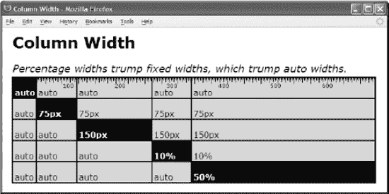

#### HTML

`<h1>Column Width</h1>
<h2>Percentage widths trump fixed widths, which trump auto widths.</h2>

<table **class="auto-layout sized"**>
<tr> <**td class="a i">auto</td>**<td class="a">auto</td>   <td class="a">auto</td>
      <td class="a">auto</td>  <td class="a">auto</td></tr>
<tr> <td class="a">auto</td>  <**td class="b i">75px</td>** <td class="b">75px</td>
      <td class="b">75px</td>  <td class="b">75px</td></tr>
<tr> <td class="a">auto</td>  <td class="a">auto</td>   **<td class="c i">150px</td>**
      <td class="c">150px</td> <td class="c">150px</td></tr>
<tr> <td class="a">auto</td>  <td class="a">auto</td>   <td class="a">auto</td>
      **<td class="d i">10%</td>** <td class="d">10%</td></tr>
<tr> <td class="a">auto</td>  <td class="a">auto</td>   <td class="a">auto</td>
      <td class="a">auto</td>  **<td class="e i">50%</td>**</tr>
</table>`

#### CSS

`.i { background-color:black; color:white; font-weight:bold; }
.auto-layout { table-layout:auto; }
.sized { width:**700px;** }

.a { width:**auto;** }
.b { width:**75px;** }
.c { width:**150px;** }
.d { width:**10%;** }
.e { width:**50%;** }

/* Nonessential styles are not shown */`

#### 列宽

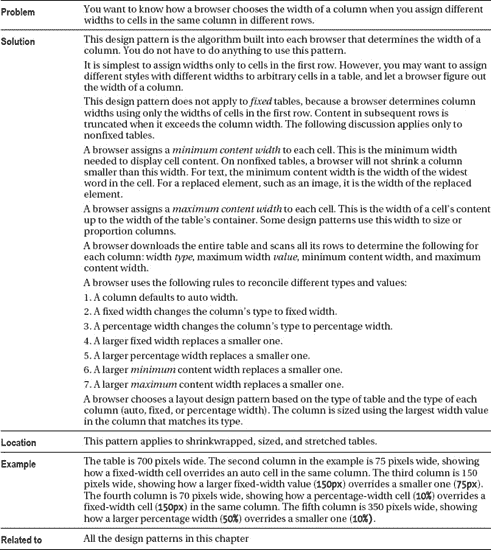

### 收缩圆柱

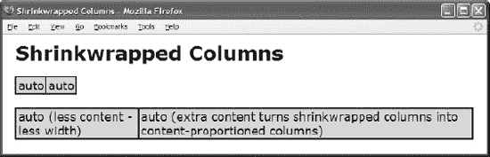

#### HTML

`<h1>Shrinkwrapped Columns</h1>

<table **class="auto-layout shrinkwrap"**>
  <tr>
    <td **class="shrinkwrap"**>auto</td>
    <td **class="shrinkwrap"**>auto</td>
  </tr>
</table>

 

<table **class="auto-layout shrinkwrap"**>
  <tr> <td **class="shrinkwrap"**>auto (less content - less width)</td>
       <td **class="shrinkwrap"**>auto (extra content turns shrinkwrapped columns
        into content-proportioned columns)</td></tr></table>`

#### CSS

`table { border-collapse:collapse; }
td { overflow:hidden; }

**.auto-layout** { table-layout:auto; }
**.shrinkwrap** { width:auto; }

/* Nonessential styles are not shown */`

#### 收缩圆柱

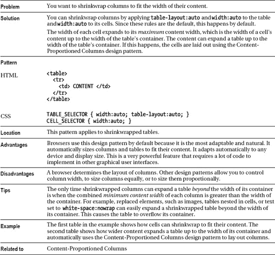

### 调整大小的列

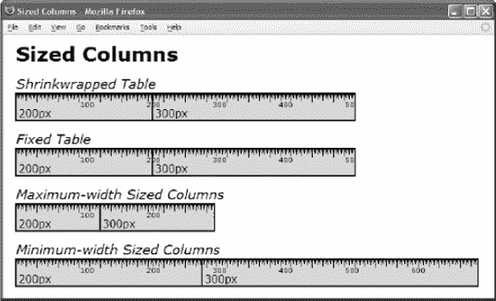

#### HTML

`<h1>Sized Columns</h1>
<h2>Shrinkwrapped Table</h2>
<table **class="auto-layout shrinkwrapped"**>
  <tr> <td **class="sized1"**>200px</td> <td **class="sized2"**>300px</td></tr></table>

<h2>Fixed Table</h2>
<table **class="fixed-layout min-width1"**>
  <tr> <td **class="sized1"**>200px</td> <td **class="sized2"**>300px</td></tr></table>

<h2>Maximum-width Sized Columns</h2>
**
**
<table class=**"auto-layout shrinkwrapped"**>
  <tr> <td **class="sized1"**>200px</td><td **class="sized2"**>300px</td></tr></table>

<h2>Minimum-width Sized Columns</h2>
<table **class="fixed-layout min-width2"**>
  <tr> <td **class="sized1"**>200px</td> <td **class="sized2"**>300px</td></tr></table>`

#### CSS

`.auto-layout { table-layout:auto; }
.fixed-layout { table-layout:fixed; }
.shrinkwrapped { width:auto; }
.min-width1 { width:1px; } .min-width2 { width:700px; }
.sized1 { width:200px; } .sized2 { width:300px; }

/* Nonessential styles are not shown */`

#### 调整大小的列

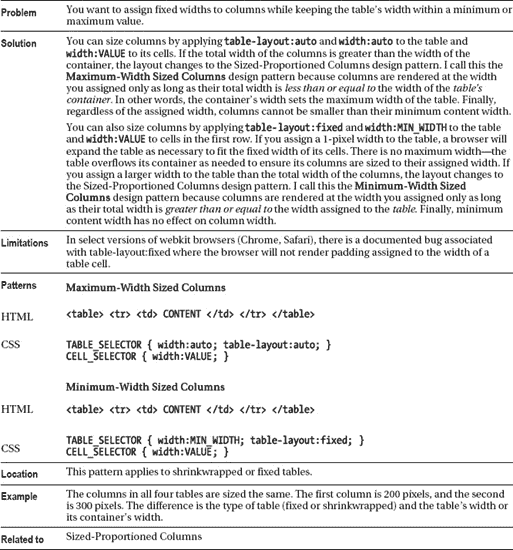

### 内容比例栏

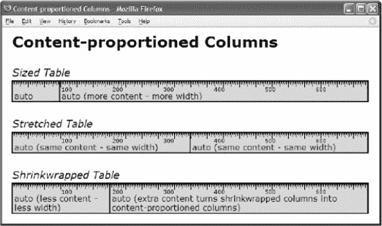

#### HTML

`<h1>Content-Proportioned Columns</h1>

<h2>Sized Table</h2>
<table **class="auto-layout sized"**>
  <tr> <td **class="auto-width"**>auto</td>
       <td **class="auto-width"**>auto (more content - more width)</td></tr></table>

<h2>Stretched Table</h2>
<table **class="auto-layout stretched"**>
  <tr> <td **class="auto-width"**>auto (same content - same width)</td>
       <td **class="auto-width"**>auto (same content - same width)</td></tr></table>

<h2>Shrinkwrapped Table</h2>
<table **class="auto-layout shrinkwrapped"**>
  <tr> <td **class="auto-width"**>auto (less content - less width)</td>
       <td **class="auto-width"**>auto (extra content turns shrinkwrapped columns
        into content-proportioned columns)</td></tr></table>`

#### CSS

`.auto-layout { table-layout:auto; }
.fixed-layout { table-layout:fixed; }
.sized { width:700px; }
.stretched { width:100%; }
.shrinkwrapped { width:auto; }
.auto-width { width:auto; }

/* Nonessential styles are not shown */`

#### 内容比例栏

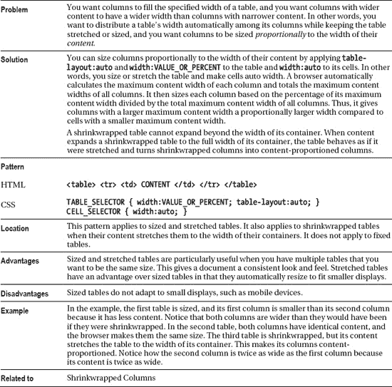

### 大小匀称的柱子

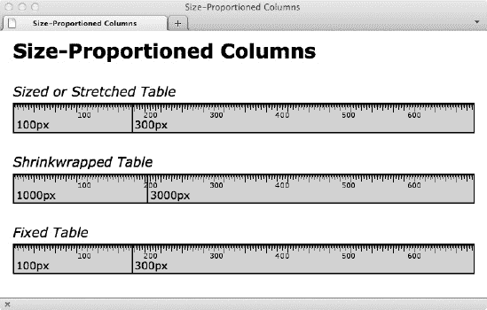

#### HTML

`<h1>Size-Proportioned Columns</h1>
<h2>Sized or Stretched Table</h2>
<table **class="auto-layout stretched"**>
  <tr> <td **class="size3"**>100px</td>
       <td **class="size4"**>300px</td></tr></table>

<h2>Shrinkwrapped Table</h2>
<table **class="auto-layout shrinkwrapped"**>
  <tr> <td **class="size1"**>1000px</td>
       <td **class="size2"**>3000px</td></tr></table>

<h2>Fixed Table</h2>
<table **class="fixed-layout sized"**>
  <tr> <td **class="size3"**>100px</td>
       <td **class="size4"**>300px</td></tr></table>`

#### CSS

`.auto-layout { table-layout:auto; }
.fixed-layout { table-layout:fixed; }
.sized { width:700px; }
.stretched { width:100%; }
.shrinkwrapped { width:auto; }
.size1 { width:1000px; } .size2 { width:3000px; }
.size3 { width:100px; } .size4 { width:300px; }

/* Nonessential styles are not shown */`

#### 大小匀称的柱子

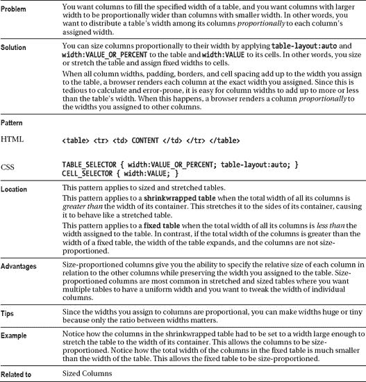

### 比例百分比列

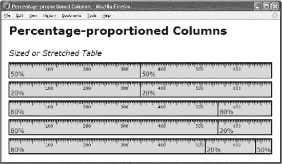

#### HTML

`<h1>Percentage-Proportioned Columns</h1>
<h2>Sized or Stretched Table</h2>
<table **class="auto-layout sized"**>
  <tr> <td **class="p3"**>50%</td> <td **class="p3"**>50%</td></tr></table>

<table **class="auto-layout sized"**>
  <tr> <td **class="p1"**>20%</td> <td **class="p1"**>20%</td></tr></table>

<table **class="auto-layout sized"**>
  <tr> <td **class="p2"**>80%</td> <td **class="p2"**>80%</td></tr></table>

<table **class="auto-layout sized"**>
  <tr> <td **class="p2"**>80%</td> <td **class="p1"**>20%</td></tr></table>

<table **class="auto-layout sized"**>
  <tr> <td **class="p2"**>80%</td> <td **class="p1"**>20%</td>
       <td **class="p3"**>50%</td></tr></table>`

#### CSS

`.auto-layout { table-layout:auto; }
.fixed-layout { table-layout:fixed; }
.sized { width:700px; }
.stretched { width:100%; }
.p1 { width:20%; } .p2 { width:80%; } .p3 { width:50%; }

/* Nonessential styles are not shown */`

#### 比例百分比列

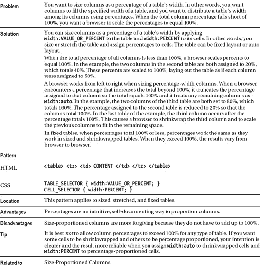

### 反比列

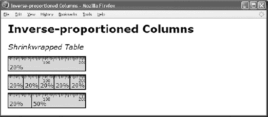

#### HTML

`<h1>Inverse-proportioned Columns</h1> <h2>Shrinkwrapped Table</h2>
<table **class="auto-layout shrinkwrapped"**>
  <tr> <td **class="p1"**>20%</td></tr></table>

<table **class="auto-layout shrinkwrapped"**>
  <tr> <td **class="p1"**>20%</td>
       <td class="p1">20%</td>
       <td class="p1">20%</td>
       <td class="p1">20%</td>
       <td class="p1">20%</td></tr></table>

<table class="auto-layout shrinkwrapped">
  <tr> <td **class="p1"**>20%</td>
       <td **class="p2"**>50%</td></tr></table>`

#### CSS

`.auto-layout { table-layout:auto; }
.shrinkwrapped { width:auto; }

.p1 { width:20%; }
.p2 { width:50%; }

/* Nonessential styles are not shown */`

#### 反比列

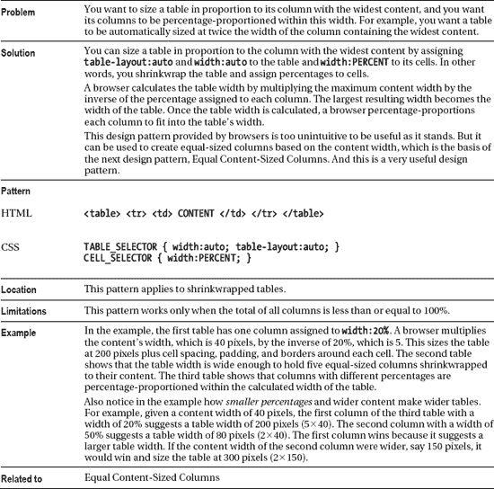

### 相等内容大小的列

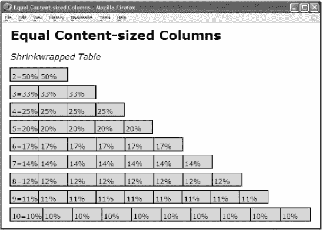

#### HTML

`<h1>Equal Content-Sized Columns</h1>

<h2>Shrinkwrapped Table</h2>
<table **class="auto-layout shrinkwrapped"**>
<tr> <td **class="p2"**>2=50%</td> <td **class="p2"**>50%</td></tr></table>

<!-- Additional tables are not shown -->`

#### CSS

`.auto-layout { table-layout:auto; }
.shrinkwrapped { width:auto; }

.p2 { width:50%; }   /* 2 columns */
.p3 { width:33.5%; } /* 3 columns */
.p4 { width:25%; }   /* 4 columns */
.p5 { width:20%; }   /* 5 columns */
.p6 { width:16.5%; } /* 6 columns */
.p7 { width:14.1%; } /* 7 columns */
.p8 { width:12.3%; } /* 8 columns */
.p9 { width:11%; }   /* 9 columns */
.p10 { width:10%; }  /* 10 columns */

/* Nonessential styles are not shown */`

#### 相等内容大小的列

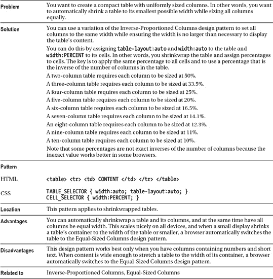

### 大小相等的列

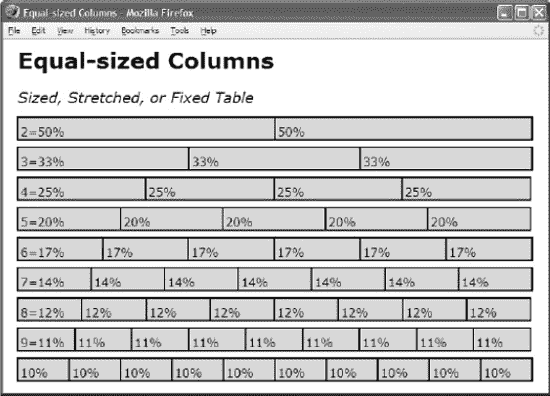

#### HTML

`<h2>Sized, Stretched, or Fixed Table</h2>
**<table class="auto-layout sized"**>
<tr> <td **class="p2"**>2=50%</td> <td **class="p2"**>50%</td></tr></table>

<!-- Additional tables are not shown -->`

#### CSS

`.auto-layout { table-layout:auto; } .fixed-layout { table-layout:fixed; }
.sized { width:700px; } .stretched { width:100%; }

.p2 { width:50%; }   /* 2 columns */
.p3 { width:33.5%; } /* 3 columns */
.p4 { width:25%; }   /* 4 columns */
.p5 { width:20%; }   /* 5 columns */
.p6 { width:16.5%; } /* 6 columns */
.p7 { width:14.1%; } /* 7 columns */
.p8 { width:12.3%; } /* 8 columns */
.p9 { width:11%; }   /* 9 columns */
.p10 { width:10%; }  /* 10 columns */

/* Nonessential styles are not shown */`

#### 大小相等的列

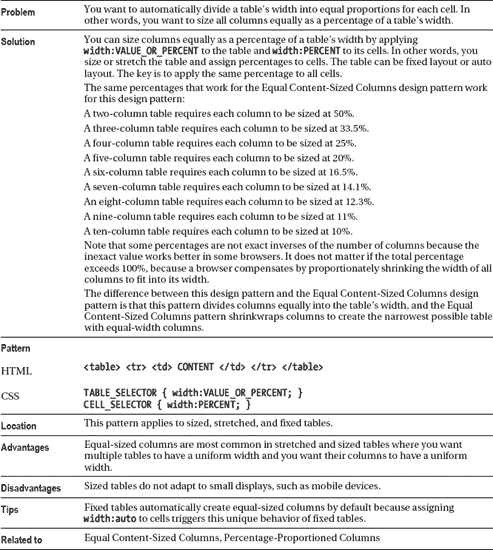

### 过小的列

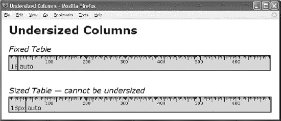

#### HTML

`<h1>Undersized Columns</h1>

<h2>Fixed Table</h2>
<table **class="fixed-layout sized"**>
<tr> <td **class="undersized"**>18px</td> <td **class="flex"**>auto</td></tr></table>

<h2>Sized Table — cannot be undersized</h2>
<table **class="auto-layout sized"**>
<tr> <td **class="undersized"**>18px</td> <td **class="flex"**>auto</td></tr></table>`

#### CSS

`**td { overflow:hidden; }**

**.fixed-layout { table-layout:fixed; }**
.auto-layout { table-layout:auto; }

.sized { width:700px; }
.stretched { width:100%; }

.undersized { width:18px; }
.flex { width:auto; }

/* Nonessential styles are not shown */`

#### 过小的列

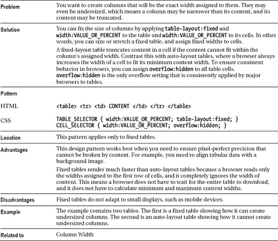

### 伸缩列

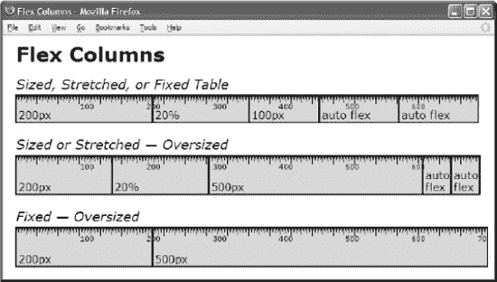

#### HTML

`<h1>Flex Columns</h1>
<h2>Sized, Stretched, or Fixed Table</h2>
<table **class="fixed-layout sized"**><tr><td class="sized1">200px</td>
  <td class="p1">20%</td> <td class="sized2">100px</td>
  <td **class="flex"**>auto flex</td> <td **class="flex"**>auto flex</td></tr></table>

<h2>Sized or Stretched — Oversized</h2>
<table **class="auto-layout sized"**><tr><td class="sized1">200px</td>
  <td class="p1">20%</td> <td **class="sized3"**>500px</td>
  <td **class="flex"**>auto flex</td> <td **class="flex"**>auto flex</td></tr></table>

<h2>Fixed — Oversized</h2>
<table **class="fixed-layout sized"**><tr><td class="sized1">200px</td>
  <td class="p1">20%</td> <td **class="sized3"**>500px</td>
  <td **class="flex"**>auto flex</td> <td **class="flex"**>auto flex</td></tr></table>`

#### CSS

`.fixed-layout { table-layout:fixed; }
.auto-layout { table-layout:auto; }
.sized { width:700px; }
.stretched { width:100%; }
**.flex { width:auto; }**
.sized1 { width:200px; }
.sized2 { width:100px; }
.sized3 { width:500px; }
.p1 { width:20%; } .fixed-layout .p1{ padding:0; }

/* Nonessential styles are not shown */`

#### 伸缩列

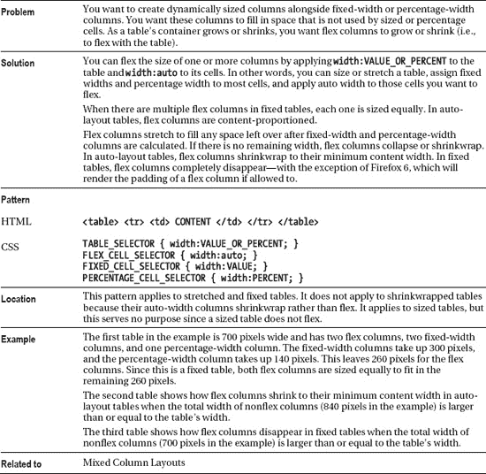

### 混合列布局

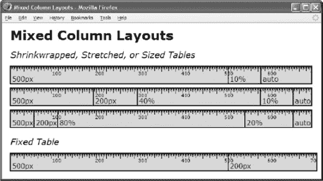

#### HTML

`<h1>Mixed Column Layouts</h1>

<h2>Shrinkwrapped, Stretched, or Sized Tables</h2>
<table **class="auto-layout stretched"**> <tr> <td class="sized1">500px</td>
  <td class="p1">10%</td> <td class="flex">auto</td></tr></table>

<table **class="auto-layout stretched"**> <tr> <td class="sized1">500px</td>
  <td class="sized2">200px</td> <td class="p3">40%</td>
  <td class="p1">10%</td> <td class="flex">auto</td></tr></table>

<table **class="auto-layout stretched"**> <tr> <td class="sized1">500px</td>
  <td class="sized2">200px</td> <td class="p4">80%</td>
  <td class="p2">20%</td> <td class="flex">auto</td></tr></table>

<h2>Fixed Table</h2>
<table **class="fixed-layout stretched"**> <tr> <td class="sized1">500px</td>
  <td class="sized2">200px</td> <td class="p4">80%</td>
  <td class="p2">20%</td> <td class="flex">auto</td></tr></table>`

#### CSS

`.fixed-layout { table-layout:fixed; } .auto-layout { table-layout:auto; }
.shrinkwrapped { width:auto; }
.stretched { width:100%; }
.flex { width:auto; }
.sized1 { width:500px; } .sized2 { width:200px; }
.p1 { width:10%; } .p2 { width:20%; }
.p3 { width:40%; } .p4 { width:80%; }
.fixed-layout .p2 { padding:0; }

/* Nonessential styles are not shown */`

#### 混合列布局

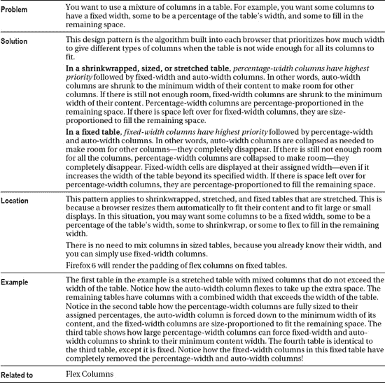*