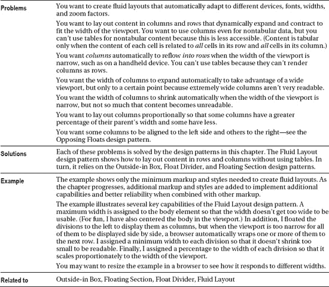
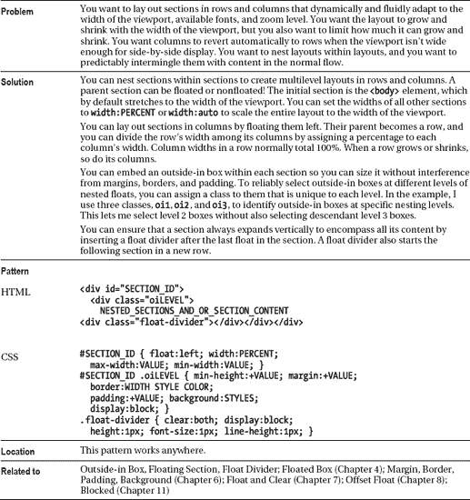

# 十七、布局

本章展示了如何创建流畅的布局，它可以自动适应不同的设备、字体、宽度和缩放因子。这些设计模式是可访问的、模块化的、易于定制的。动态模式使用开源 JavaScript 库将事件处理程序附加到元素上。这允许您创建动态效果，而无需在文档中添加一行 JavaScript 代码！这些库使用 *CSS 选择器*来决定处理哪些元素来响应事件，它们可以修改元素的 class 属性，这样样式表就可以完全控制事件如何动态地样式化元素。

### 章节大纲

*   **流体布局概述**探讨创建流体布局时的问题和解决方案。
*   **Outside-in Box** 展示了如何调整一个盒子的*外宽*而不是*内宽*的大小。
*   **浮动部分**展示了如何使用流体布局来渲染列中的部分。
*   **浮动分割器**展示了如何可预测地分离和整合浮动和内容。
*   **流体布局**展示了如何创建自动适应任何显示的布局。
*   **反向浮动**展示了如何将内容移动到容器的两侧。
*   **事件样式**展示了如何将事件分配给元素，而无需在文档中添加代码。它展示了事件如何修改类来改变元素的样式。
*   **Rollup** 展示了如何通过鼠标点击来折叠和打开部分。
*   **标签菜单**展示了如何创建一个标签界面，当点击时加载新页面。
*   **Tabs** 展示了如何创建一个选项卡式的界面，当用户点击一个选项卡时，该界面可以动态地将内容切换进和切换出显示屏，而无需加载新的页面。
*   **弹出菜单**展示了如何创建一个点击或悬停时打开的菜单。
*   **Button** 展示了如何使用 JavaScript 创建按钮并处理它们的事件。
*   **布局链接**展示了如何使用链接作为布局的一部分，比如面包屑。
*   **多栏**展示了如何在多栏中分发内容。
*   **模板**展示了如何使用字母字符和位置属性定义位置。
*   **布局示例**展示了如何组合和扩展这些设计模式。

### 流体布局概述

#### HTML

`<body>

  <h1>Fluid Layout Overview</h1>

  

    <h2>Navigation</h2>
    
20% of container's width.

  

    <h2>Main</h2>
    
40% of container's width.

  

    <h2>News</h2>
    
20% of container's width.

</body>`

#### CSS

`body { **max-width:1000px;** margin-left:auto; margin-right:auto; }

div { background-color:gold; margin-right:10px; padding:5px;
  border-left:1px solid gray; border-right:2px solid black;
  border-top:1px solid gray; border-bottom:2px solid black; }

**#nav  { float:left; width:20%; min-width:170px; }**
**#main { float:left; width:40%; min-width:170px; }**
**#news { float:left; width:20%; min-width:170px; }**

/*  Nonessential rules are not shown. */`

#### 流体布局概述

### 由外向内框

#### HTML

`<h1>Outside-in Box</h1>

<h2>Before</h2>

 Float 

 Absolute 

 Static 

<h2>After</h2>

  

 Float 

   Absolute 

  

 Static 

`

#### CSS

**。{宽度:100%之前；保证金:5px 填充:5px 边框:5px 纯黑；}**

`**.after { width:100%; }**
**.after .oi { margin:5px; padding:5px; border:5px solid black; display:block; }**

.float { float:left; }
.absolute { position:absolute; }
.static { position:static; }

/*  Nonessential rules are not shown. */`

#### 由外向内框

#### HTML

`<h1>Outside-in vs. Inside-out Design</h1>

<h2>Two floats with 50% width and no margins, borders, or padding</h2>

 Float1 
 
 Float2 

<h2>Two floats with 50% width and 1px border</h2>

 Float1 
 
 Float2 

<h2>Two floats with 45% width and 5% left margin</h2>

 Float1 
 
 Float2 

<h2>Two floats with 49.5% width and 5px left margin</h2>

 Float1 
 
 Float2 
`

#### CSS

`body { max-width:1200px; }
div { min-width:100px; }

.ex1 { float:left; width:50%; }
.ex2 { float:left; width:50%; border:1px solid; }
.ex3 { float:left; width:45%; margin-left:5%; }
.ex4 { float:left; width:49.5%; margin-left:5px; }

/*  Nonessential rules are not shown. */`

**由外向内与由内向外设计**

流体布局从*外向*内设计。这是因为您从视口的宽度开始，并使用百分比、最小宽度和最大宽度在元素之间划分其宽度。

问题是`width`属性设置了元素的*内部宽度*。填充、边框和边距围绕元素的内部宽度，从而增加其外部宽度*。因为 CSS 没有 outer-width 属性，所以 CSS 要求你从里面的*到外面的*进行设计。结果是边距、边框和填充会破坏流畅的布局设计。*

 *例如，您可能想要将两个元素浮动到左侧，并将每个元素分配给`width:50%`，以便它们并排放置，并平均分配视口的宽度。示例中的前两个部分展示了这是如何工作的。无论您如何调整视口的大小，这些元素都会并排放置(直到它们的最小宽度不再允许它们适合视口的宽度)。

如果您给这两个并排的浮动分配*任何*边距、边框和填充，浮动将不再适合视窗的宽度。例如，如果在每个元素周围指定一个 1 像素的边框，则它们的总外部宽度会超出视口宽度 4 个像素(每个元素的左侧和右侧各 1 个像素)。当浮动不能并排放入它们的容器时，它们会换行到下一行。这不是你想要的！示例中的第二组划分显示了一个微小的 1 像素边框如何打破流体布局。无论你如何调整视窗大小，浮动将*而不是*并排。

要将两个元素的边距、边框和填充放入它们的容器中，必须减少每个元素的百分比宽度，但是减少多少呢？如果为边距和填充指定百分比，只需从指定给宽度的百分比中减去它们各自的百分比。例如，如果为两个元素各指定 5%的左边距，则可以为每个元素指定 45%的宽度。示例中的第三组划分证明了这一点。无论您如何调整视口的大小，这些元素都将并排放置(直到它们的最小宽度使它们无法适应视口)。

根据 CSS 规范，浏览器会忽略分配给边框的百分比，这意味着您必须使用固定的度量来创建边框。为边距和填充指定百分比也不常见，因为边距和填充不随视口调整大小时通常看起来更好。您可以调整示例的大小，以对比百分比边距和固定边距的行为。

在*流体布局*中，给元素分配*固定的*边距、边框和填充与分配给其`width`的*百分比*不兼容。随着视口缩小，百分比会缩小元素的宽度，但其固定的边距、边框和填充不会缩小。例如，假设视窗宽度为 1000 像素，包含两个并排的子元素，每个子元素的左边距为 5 像素，则可用宽度为 990 像素，即 99%，即(1000 px–5px–5px)/1000 px。如果你要在两个元素之间平均分配，你可以给每个元素分配`width:49.5%`。给定 100 像素的视口宽度，可用宽度为 90 像素，即 90%，即(100 像素–5px–5px)/100 像素。为了在两个元素之间平均分配，你可以给每个元素分配`width:45%`。因此，将固定的边距、边框和填充与百分比宽度混合在一起在流体布局中不起作用。在本例中，第四组分割设置为 49.5%，左边距设置为 5 个像素。这张截图是以 750 像素的宽度拍摄的，宽度不足以让它们并排放置；但是如果你把浏览器窗口放大到 1000 像素或者更多，它们就合适了。

请注意，Internet Explorer 7 和早期版本并不完全遵守规则。当浮动两个设置为`width:50%`的元素时，Internet Explorer 猜测您希望它们并排，所以它打破规则，将它们并排放置。所有其他主流浏览器都运行正常。此外，Internet Explorer 6 有错误，有时会导致浮动*而不是*被并排放置。例如，在第三组划分中，Internet Explorer 6 将第二个浮动移动到第一个之下。Internet Explorer 7 修复了这些错误。

由外向内的设计模式解决了所有这些问题(包括 Internet Explorer 的问题)。因此，这是创建流畅布局的基本设计模式。另一种方法是在百分比上努力，直到你找到在大多数浏览器上都能工作的东西，并且在大多数时候看起来接近你想要的。

### 浮动节

#### HTML

`<h1>Floating Section</h1>

**
**
**  
**
      <h2>Navigation Section</h2>
      
25% of container's width.

  

**
**
**  
**
      <h2>Main Section</h2>
      
75% of container's width minus 80-pixel left margin, 1-pixel left border,
         2-pixel left border, and 80-pixel left padding.

  

`

#### CSS

`.oi { background-color:gold;
  border-left:1px solid gray; border-right:2px solid black;
  border-top:1px solid gray; border-bottom:2px solid black; }

#nav { float:left; width:25%; min-width:170px; }
#nav .oi { min-height:150px; margin:0; padding:5px; }

#main { float:left; width:75%; min-width:170px; }
#main .oi { min-height:150px; margin-left:80px; padding:5px; padding-left:80px; }

/*  Nonessential rules are not shown. */`

##### 浮动节

### 浮动分频器

#### HTML

`<h1>Float Divider</h1>
<h2>First Row of Floats</h2>

<h3>Float 1</h3>

<h3>Float 2</h3>

<h3>Float 3</h3>

**

**

<h2>Second Row of Floats</h2>

<h3>Float 4</h3>

<h3>Float 5</h3>

<h3>Float 6</h3>
`

#### CSS

`.float { float:left; }

**.float-divider { clear:both;**
  height:20px;
  margin-bottom:20px;
  border-bottom:5px solid black;
  font-size:1px; line-height:1px; }

/* Nonessential rules are not shown. */`

#### 浮动分频器

### 流体布局

#### HTML

`<h1>Fluid Layout</h1>

 <h2>main - 100%</h2>
  

 <h3>nav - 20%</h3> 

  

 <h3>content - 60%</h3>
     <em>head - 35%</em> 
     <em>detail - 65%</em> 
    

  

 <h3>news - 20%</h3> 

  

`

#### CSS

`.float-divider { clear:both; display:block;
  height:1px; font-size:1px; line-height:1px; }
.oi1 { background-color:white; margin:0; padding:5px; }
.oi2 { background-color:gold; margin:5px; padding:5px; }
.oi3 { background-color:yellow; margin:5px; padding:5px; }

#main { max-width:700px; }
#nav { float:left; **width:20%;** min-width:75px; }
#content { float:left; **width:60%;** min-width:150px; }
#news { float:left; **width:20%;** min-width:115px; }
#nav .oi2 { min-height:43px; }
#content .oi3 { display:block; }
#head { float:left; **width:35%;** min-width:75px; }
#detail { float:left; **width:65%;** min-width:75px; }

/* Nonessential rules are not shown. */`

##### 流体布局

### 对立浮动

#### HTML

`

  <h1  **id="title"**>Opposing Floats</h1>
  
 <h3>Search:</h3>
    <form method="post" action="http://www.tipjar.com/cgi-bin/test">
      <input type="text" value="" name="searchtext" id="searchtext" size="32" />
      <input type="submit" value="Search" name="find" id="find" /></form>
    
This right float shrinks no smaller than its minimum width
      and grows no larger than its maximum width.

  

  **

**

  **
**<a href="#">Home</a> » Floating Layout

  **
**Postheader message 1

 **

**

  **
<a href="#">Home</a> » Floating Layout

  **
Postheader message 2

  **

**

`

#### CSS

`.float-divider { clear:both; display:block;
  height:1px; font-size:1px; line-height:1px; }

.breadcrumbs { **float:left;**  max-width:350px; margin-left:10px; }
.post-msg { **float:right;** max-width:350px; margin-right:10px; }

#title  { **float:left;**  min-width:280px; max-width:350px; margin-left:0; }
#search { **float:right;** min-width:280px; max-width:350px; margin-right:0; }

/* Nonessential rules are not shown. */`

#### 对立浮动

### 事件造型

#### HTML

`<head>
  <!-- only script elements are shown -->

  
</head>`

#### 页. js

`$(document).ready(function(e){
    $('.rollup-trigger').click(function(e){
        $(this).closest('.rollup').children().not('.rollup-trigger').toggleClass('hidden');
        $(this).parent().removeClass('hidden');
    });
});`

##### 活动风格

#### HTML

`<h1>Rollup</h1>

  <h2 **class="rollup-trigger"**>Main</h2>

  

    <h3 **class="rollup-trigger"**>FAQ</h3> Don't roll me up.
    <dl **class="rollup"**>
      <dt class=**"rollup-trigger"**>QUESTION: How do rollups work?</dt>
      <dd **class="hidden"**>ANSWER: When the user clicks on a heading or button,
                           the content rolls up or down. </dd></dl>

  

    <h3 **class="rollup-trigger"**>Info</h3>
    

      
&nbsp;List

      <ul> <li>list item 1</li> <li>list item 2</li></ul>

    <em>&nbsp;Roll me up</em>

    

`

#### CSS

`.rollup-trigger { cursor:pointer; }
.rollup-trigger:hover { color:firebrick; }

span.rollup-trigger { font-size:0.65em; padding-left:8px;
  background:url("hide.gif") no-repeat left top; }

span.rolledup { background:url("show.gif") no-repeat left top; }

.hidden { position:absolute; top:-99999px; left:-99999px;
  width:1px; height:1px; overflow:hidden; }

/* Nonessential rules are not shown. */`

#### HTML 标题

`<head>
  <!-- only script elements are shown -->

  
</head>`

#### 页. js

`$(document).ready(function(e){
    $('.rollup-trigger').click(function(e){
        $(this).closest('.rollup').children().not('.rollup-trigger').toggleClass('hidden');
        $(this).parent().removeClass('hidden');
    });
});`

### Tab 菜单

#### HTML

`<h1>Tab Menu</h1>

  **<ul class="tabs">**
    **<li class="selected">**
      <h3 **class="tab-label**"><a href="example.html">Tab 1</a></h3></li>
    <li><h3 **class="tab-label"**><a href="example2.html">Tab 2</a></h3></li>
    <li><h3 **class="tab-label"**><a href="example3.html">Tab 3</a></h3></li>
    <li><h3 **class="tab-label"**><a href="example4.html">Tab 4</a></h3></li>
  </ul>
  
Tab 1 content: A click on one of these tabs loads a new page.

`

#### CSS

`ul.tabs a:link, ul.tabs a:visited, ul.tabs a:active
     { text-decoration:none; color:maroon; }
    ul.tabs a:hover { text-decoration:underline; color:black; }
    ul.tabs a { display:block; }

    **ul.tabs** { float:left; width:100%; padding:0; margin:0;
      border-bottom:1px solid gold; margin-bottom:10px; }

    **ul.tabs li** { float:left; width:25%; list-style-type:none; }

    **ul.tabs .tab-label** { border:1px solid gold; margin:0; cursor:pointer;
      padding-bottom:2px; padding-top:2px;
      background:white url("g1.jpg") repeat-x left bottom;
      font-weight:normal; text-align:center; font-size:1.1em; }

    **ul.tabs li.selected .tab-label** { position:relative; border-bottom:none;
      top:1px; padding-bottom:4px;
      padding-top:5px; border-top:2px solid gold; margin-top:-5px;
      background:white url("g2.jpg") repeat-x left top; font-weight:bold; }

#main { border:1px solid gold; border-top:none; }`

##### Tab 菜单

#### HTML(为方便起见，再次显示相同的代码)

`<h1>Tab Menu</h1>

  **<ul class="tabs">**
    **<li class="selected">**
      <h3 **class="tab-label"**>Tab 1</h3></li>
    <li><h3 **class="tab-label"**><a href="example2.html">Tab 2</a></h3></li>
    <li><h3 **class="tab-label"**><a href="example3.html">Tab 3</a></h3></li>
    <li><h3 **class="tab-label"**><a href="example4.html">Tab 4</a></h3></li>
  </ul>
  
Tab 1 content: A click on one of these tabs loads a new page.

`

#### CSS(为方便起见，再次显示相同的代码)

`ul.tabs a:link, ul.tabs a:visited, ul.tabs a:active
      { text-decoration:none; color:maroon; }
    ul.tabs a:hover, ul.tabs a:focus
      { text-decoration:underline; color:black; }
    ul.tabs a { display:block; }

    **ul.tabs** { float:left; width:100%; padding:0; margin:0;
      border-bottom:1px solid gold; margin-bottom:10px; }

    **ul.tabs li** { float:left; width:25%; list-style-type:none; }

    **ul.tabs .tab-label** { border: 1px solid gold; margin:0; cursor:pointer;
      padding-bottom:2px; padding-top:2px;
      background:white url("g1.jpg") repeat-x left bottom;
      font-weight:normal; text-align:center; font-size:1.1em; }

    **ul.tabs li.selected .tab-label** { position:relative; border-bottom:none;
      top:1px; padding-bottom:4px; cursor:auto;
      padding-top:5px; border-top:2px solid gold; margin-top:-5px;
      background:white url("g2.jpg") repeat-x left top; font-weight:bold; }

#main { border:1px solid gold; border-top:none; }`

### 选项卡

#### HTML

` <h1>Tabs</h1>

  **<ul class="tabs">**
   **<li class="selected"><h3 class="tab-label"><a href="example.html">Tab 1</a></h3>**
    

     <h4>Tab 1 Content</h4>
This is the message of tab 1\. More message...
     

</li>

   **<li><h3 class="tab-label"><a href="example2.html">Tab 2</a></h3>**
    

**
     <h4>Tab 2 Content</h4>
This is the message of tab 2.
     

</li></ul>`

#### CSS

`/* All rules from the Tab Menu design pattern apply to Tabs.
   Only additional rules that apply to this design pattern are shown here. */

**ul.tabs** { position:relative; }

ul.tabs **.tab-content** { position:absolute; width:100%; height:6em;
  border:1px solid gold; border-top:none;
  left:-99999px; overflow:auto; }

ul.tabs li**.selected** .tab-content { left:0; }

ul.tabs li **.oi2** { margin:10px; padding:10px; }

ul.tabs .tab-label a { display:block; text-decoration:none; color:black; }

ul.tabs **.hover,**
ul.tabs **.tab-label:hover** { text-decoration:underline; }

/*  Nonessential rules are not shown. */`

##### 选项卡

#### HTML 标题

`<head>
 <!-- only script elements are shown -->

 
</head>`

#### 页. js

`$(document).ready(function(e){
        $('ul.tabs li').click(function(e){
                $('ul.tabs li.selected').removeClass('selected');
                $(this).addClass('selected');
        });
        $('ul.tabs li .tab-label').mouseover(function(e){
                $(this).addClass('hover');
        });
        $('ul.tabs li .tab-label').mouseout(function(e){
                $(this).removeClass('hover');
        });
        $('ul.tabs .tab-label a').click(function(e){
                e.preventDefault();
                $(this).blur();
        });
});`

### 弹出菜单

#### HTML

`**
<h3>Dropdown</h3>**
  **<ul class="dropdown hidden">**
    **<li><a href="#">menu item</a></li>**
      <li **class="separator"**><a href="#">menu item</a></li>
    <li **class="flyout-trigger"><h4>submenu</h4>**
      **<ul class="submenu hidden">**
        <li><a href="#">menu item</a></li>
        <li><a href="#">menu item</a></li></ul></li></ul>
`

#### CSS

`.menu { **float:left; position:relative;** z-index:1; cursor:pointer;
      font-size:0.8em; white-space:nowrap; }
    .menu a { text-decoration:none; color:black; }

    .menu h3 { **float:left; margin:0;** padding:1px 5px;
      background:url("g1.jpg") repeat-x left bottom white; }
    .menu h4 { **display:inline; margin:0;** }
    .menu ul { **position:absolute; margin:0; padding:0;** padding-bottom:5px;
      background:url("g3.jpg") repeat-x left bottom white; }

    .menu li { **margin:0; padding:2px 25px; list-style-type:none;** color:black; }
    .menu li img { **margin-left:-22px;** padding-right:5px; }
    .menu li.separator { margin-top:5px; border-top:1px solid gray; padding-top:5px; }
    .menu li.flyout-trigger { background:url("flyout1.gif") no-repeat right center; }
    .menu li.flyout-trigger.hover
      { background:url("flyout2.gif") no-repeat right center firebrick; }
    .menu h3.hover { background:url("g2.jpg") repeat-x left top white; }
    .menu li.hover { background-color:firebrick; color:white; }
    .menu li.hover > a  { color:white; }
**.menu ul.dropdown { top:100%;  clear:left; }**
**.menu ul.submenu { left:100%; margin-top:-1.5em; margin-left:-0.3em; }**
**.menu .hidden { left:-99999px; top:-99999px; }**
    .menu h3,.menu ul { border-left:1px solid yellow; border-right:1px solid orange;
      border-top:1px solid yellow; border-bottom:1px solid orange; }

/*  Nonessential rules are not shown. */`

##### 弹出菜单

#### HTML 标题

`<head>
  <!-- only script elements are shown -->

  
</head>`

#### 页. js

`$(document).ready(function(e){
    $('.menu').click(function(e){
        $('.dropdown', $(this)).toggleClass('hidden');
    });
    $('.menu').mouseover(function(e){
        $('.dropdown', $(this)).removeClass('hidden');
    });
    $('.menu').mouseout(function(e){
        $('.dropdown', $(this)).addClass('hidden');
    });
    $('.menu li, .menu h3').mouseover(function(e){
        $(this).addClass('hover');
    });
    $('.menu li, .menu h3').mouseout(function(e){
        $(this).removeClass('hover');
    });
    $('.menu li.flyout-trigger').mouseover(function(e){
        $('> .submenu', $(this)).removeClass('hidden');
    });
    $('.menu li.flyout-trigger').mouseout(function(e){
        $('> .submenu', $(this)).addClass('hidden');
    });
});`

### 按钮

#### HTML

`<h1>Button</h1>

<form id="form1" method="post" action="http://www.tipjar.com/cgi-bin/test">
  <input type="text" id="search" name="search"  class="search" value="Search" />
  <input type="submit" id="submit1" name="submit1" value="Submit" />
  <input type="submit" id="submit2" name="submit3" value="" />
  <input type="submit" id="submit3" name="submit2" class="button" value="Submit" />
  <input type="reset"  id="reset1"  name="reset1"  class="button" value="Reset" />
</form>
<input type="button" id="message" name="message" class="button" value="Message" />
<input type="button" id="submit4" name="submit4" class="button" value="J-Submit"/>
<input type="button" id="reset2"  name="reset2"  class="button" value="J-Reset" />

<button id="change" name="change" class="button">Change Me!</button>
<a id="link" class="button" href="http://cssdesignpatterns.com">Link</a>`

#### CSS

`form { margin:20px 0; }
    .button { margin:0; padding:3px 10px; font-size:1em; color:black;
      cursor:pointer; background:url("g1.jpg") repeat-x left bottom;
      border-left:1px solid yellow; border-right:1px solid orange;
      border-top:1px solid yellow; border-bottom:1px solid orange; }

    .button:hover, .button.hover
      { background:url("g2.jpg") repeat-x left top;
        border-left:1px solid orange; border-right:1px solid yellow;
        border-top:1px solid orange; border-bottom:1px solid yellow; }

    a.button { padding:5px 10px; line-height:2em; text-decoration:none; }

    #submit2 { width:32px; height:32px; border:none; cursor:pointer;
      background:url("go.jpg") no-repeat left top; }
#submit2:hover, #submit2.hover { background-position:1px 1px; }`

##### 按钮

#### HTML 标题

`<head>
  <!-- only script elements are shown -->

  
</head>`

#### 页. js

`$(document).ready(function(e){
    $('#form1').submit(function(e){
        if(!confirm('Are you sure?')){e.preventDefault();}
    });
    $('#message').click(function(e){
        alert('Hi There');
    });
    $('#button').click(function(e){
        alert('Hi There');
    });
    $('#link').click(function(e){
        if(!confirm('Jump here?')){e.preventDefault();}
    });
    $('#change').click(function(e){
        try{
            var result = prompt('Enter content:',  $(this).text() );
            if ( result ) $(this).text( result );
        }catch(ex){ e.preventDefault(); }
    });
    $('#submit4').click(function(e){
        $('#form1').submit();
    });
    $('#reset2').click(function(e){
        $('#form1').reset();
    });
});
});
Button (Continued)`

### 布局链接

#### HTML

`<h1>Layout Links</h1>

    
<a class="skiplink"** href="#main">Skip to main content</a>

    
<h2>header</h2>

<a href="#">Home</a> » <a href="#">Layout Links</a>
  » Breadcrumbs <**span class="sequential"**>
  <a href="#">« Previous</a> | <a href="#">Next »</a>

<h2>body</h2>
  
Main content goes here. <**a class="outlink"** href="#">External Link</a>

  
<a href="#">»** More Info </a>

<h2>footer **<a class="toplink"** href="#">Topˆ</a></h2>
  <ul><li>Last Updated on... </li> <li><a href="#">Copyright &copy; 2007</a></li>
    <li><a href="#">License</a> </li> <li><a href="#">Privacy Policy</a></li>
    <li><a href="#">About Us</a></li> <li><a href="#">Disclaimers</a></li></ul>

`

#### CSS

`a:link, a:visited, a:active { text-decoration:none; color:maroon; }
a:hover { color:black; text-decoration:underline; }

**.morelink** { font-size:0.8em; font-weight:bold; text-align:right; }
**.toplink** { font-size:0.7em; font-weight:normal; vertical-align:top; }
**.outlink { padding-right:15px;** font-style:italic;
  **background:url("external.gif")** no-repeat top right; }

/* Nonessential rules are not shown. */`

#### 布局链接

### 多栏布局

#### HTML

`<h1>Multi-column Layout</h1>

Lorem ipsum dolor sit amet, consectetur adipiscing elit.
  Morbi sollicitudin posuere mauris sed in ...
<!-- Additional code can be found in sample -->

`

#### CSS

`.multi { column-count:3; -moz-column-count:3;
  -webkit-column-count:3; -ms-column-count:3; }

/* Nonessential rules are not shown. */`

#### 多栏布局

### 模板布局

#### HTML

`<h1>Template Layout</h1>

    
Apple

    
Bear

    
Castle

    
Deer

`

#### CSS

`#template { display: “ab” “cd” 20% * 20%; }
    #d { position: a; }
    #c { position: b; }
    #b {  position: c; }
#a { position: d; }

/* Nonessential rules are not shown. */`

#### 模板布局

### 布局示例

#### HTML 结构元素

`

    

      
<h1>Layout Example</h1>

      
<h3>Search:</h3>

    

    

      

    
<h3>Site Map</h3>

    
<h3>Links</h3>

  

  

    
<h3>News</h3>

    
<h3>About us</h3>

`

#### CSS 结构样式

`#preheader .part1 { float:left;  margin-left:10px; }
#preheader .part2 { float:right; margin-right:10px; }
#header { float:left; width:100%; }
#title { float:left; width:50%; margin-top:7px; }
#search { float:right; margin-top:2px; }
#postheader .breadcrumbs { float:left; margin-left:10px; }
#postheader .sequential { float:right; margin-right:10px; }
#body { float:left; width:100%; }
#nav { float:left; width:25%; min-width:160px; }
#main { float:left; width:50%; min-width:300px; }
#extras { float:left; width:25%; min-width:160px; }
#footer { clear:both; padding-top:40px; }`

##### 布局示例

*在狭窄视窗中显示的布局示例，显示时没有样式表*

*