# 十八、首字下沉

本章讨论创建首字下沉的设计模式。首字下沉极大地改变了文档第一个字母的样式，以表示它是文档的开始。有时它用在较长文件的主要部分的开头。有时它会设计一个单词的样式，而不仅仅是第一个字母。

通常，首字下沉会放大并降低第一个字母，以便字母的顶部与后面文本的顶部对齐，但是首字下沉的样式没有限制。

本章中的设计模式是按照从最简单到最复杂的顺序组织的。

### 章节大纲

*   **对齐首字下沉**展示了如何通过放大和垂直对齐来创建一个简单的首字下沉。
*   **首字母首字下沉**展示了如何在不插入额外标记的情况下创建首字下沉。
*   **悬挂首字下沉**展示了如何使用悬挂缩进来创建首字下沉。
*   **填充的图形首字下沉**展示了如何给首字下沉添加左填充，以便为显示横幅、抓图或装饰的背景图像腾出空间。
*   **浮动首字下沉**展示了如何将首字下沉浮动到左侧，这样首字下沉下方的文本会在首字下沉下方换行。
*   **浮动图形首字下沉**展示了如何在首字下沉文本上显示图形。它非常适合屏幕阅读器，当图像不可用时，它显示首字下沉的样式文本版本。这是允许首字下沉下方的文本在首字下沉下方换行的最佳图形首字下沉设计模式。
*   **首字下沉**展示了如何使用绝对定位将首字下沉移动到块的左边界。块的所有行都缩进。
*   显示了如何在首字下沉文本上显示一个图形。它非常适合屏幕阅读器，当图像不可用时，它显示首字下沉的样式文本版本。这是防止首字下沉下方的文本在首字下沉下方换行的最佳图形首字下沉设计模式。

### 对齐首字下沉

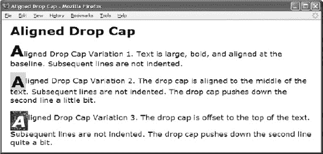

#### HTML

`**
A**ligned Drop Cap Variation 1\. Text is
  large, bold, and aligned at the baseline. Subsequent lines are not indented.

**
A**ligned Drop Cap Variation 2\. The
  drop cap is aligned to the middle of the text. Subsequent lines are not indented.
  The drop cap pushes down the second line a little bit.

**
A**ligned Drop Cap Variation 3\. The
  drop cap is offset to the top of the text. Subsequent lines are not indented.
  The drop cap pushes down the second line quite a bit.
`

#### CSS

`.aligned-dropcap1 { **font-size:40px;** line-height:normal; font-weight:bold;
**  vertical-align:baseline;** }

.aligned-dropcap2 { font-size:40px; line-height:0.8em; font-weight:bold;
  **vertical-align:middle; background-color:gold; padding:0 2px;** }

.aligned-dropcap3 { font-size:40px; line-height:normal; font-weight:bold;
  **font-style:italic; vertical-align:-0.45em; color:white;**
  **background-color:black; background-image:url("marble.jpg");**
  padding:0 4px; border:1px solid black; }`

#### 对齐首字下沉

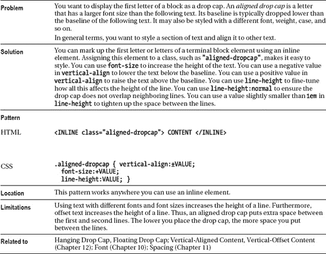

### 首字母首字下沉

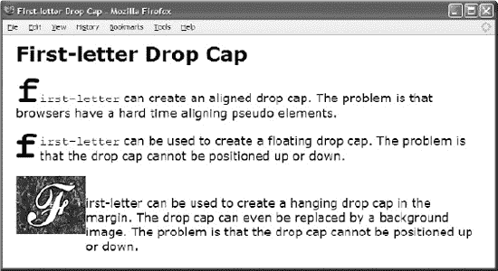

#### HTML

`**
**<code>first-letter</code> can create an aligned drop cap.
  The problem is that browsers have a hard time aligning pseudo elements.

**
**<code>first-letter</code> can be used to create a floating
  drop cap. The problem is that the drop cap cannot be positioned up or down.

**
**first-letter can be used to create a hanging drop cap in the
  margin. The drop cap can even be replaced by a background image.
  The problem is that the drop cap cannot be positioned up or down.
`

#### CSS

`.dropcap1:first-letter { font-size:60px; vertical-align:0px; font-weight:bold; }

.dropcap2:first-letter { float:left; margin-left:-3px; margin-right:3px;
  **position:relative; top:-2000px; /* DOES NOT WORK */**
  font-size:60px; line-height:normal; font-weight:bold; }

.dropcap3  { padding-left:105px; text-indent:-104px; margin-top:50px; }

.dropcap3:first-letter { padding:40px 50px; font-size:1px; line-height:1px;
  color:white; background-image:url("f.jpg");
  background-position:center center; }`

#### 首字母首字下沉

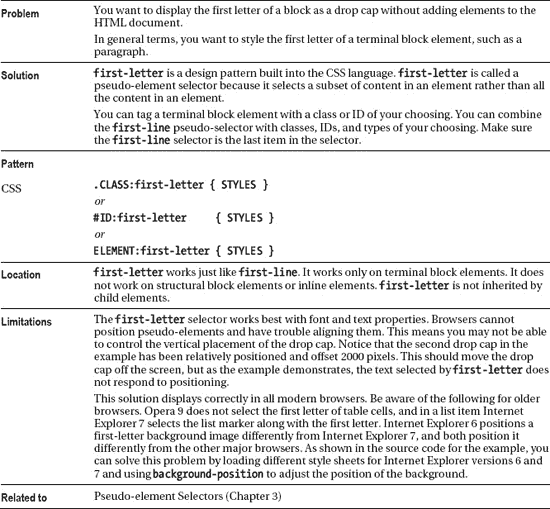

### 挂落帽

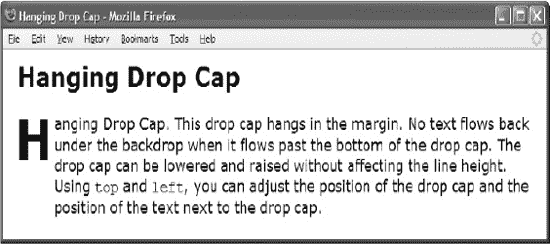

#### HTML

`**
Hanging**
  Drop Cap. This drop cap hangs in the margin. No text flows back under
  the backdrop when it flows past the bottom of the drop cap.
  The drop cap can be lowered and raised without affecting the line height.
  Using <code>top</code> and <code>left</code>,
  you can adjust the position of the drop cap and the position of the text
  next to the drop cap.
`

#### CSS

`.hanging-indent { padding-left:50px;
  text-indent:-50px;
  margin-top:-25px; }

.hanging-dropcap { position:relative;
  top:0.55em;
  left:-3px;
  font-size:60px;
  line-height:60px;
  font-weight:bold; }`

#### 挂落帽

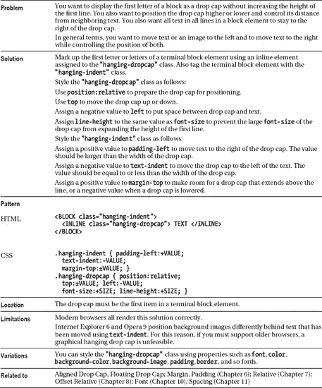

### 带衬垫的图形首字下沉

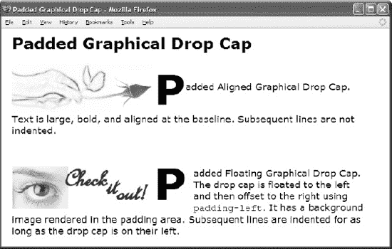

#### HTML

`<h1>Padded Drop Cap</h1>

Padded Aligned Drop Cap. Text is
  large, bold, and aligned at the baseline. Subsequent lines are not indented.

Padded Floating Drop Cap. The
  drop cap is floated to the left and then offset to the right using
  <code>padding-left</code>. It has a background image rendered in the
  padding area. Subsequent lines are indented for as long as the drop cap is on
  their left.
`

#### CSS

`.padded-dropcap1 { **padding-left:39%;** font-size:80px; line-height:normal;
  font-weight:bold; vertical-align:middle;
  background:url("rose.jpg") no-repeat -65px 0 white; }

.padded-dropcap2 { **padding-left:275px; padding-right:10px; float:left;**
  position:relative; top:-0.25em; margin-bottom:-0.2em;
  margin-left:-3px; margin-right:3px; color:black;
  background:url("grabber.jpg") no-repeat 5px 20px white;
  font-size:84px; line-height:normal; font-weight:bold; }`

#### 带衬垫的图形首字下沉

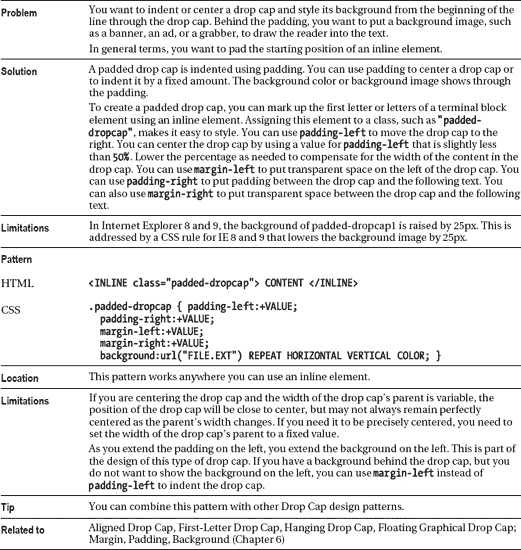

### 浮动落帽

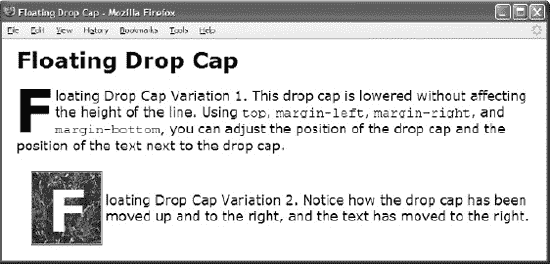

#### HTML

`<h1>Floating Drop Cap</h1>

**F**loated Drop Cap Variation 1\. This
  drop cap is lowered without affecting the height of the line.
  Using <code>top</code>, <code>margin-left</code>, <code>margin-right</code>,
  and <code>margin-bottom</code>, you can adjust the position of the drop cap
  and the position of the text next to the drop cap.

 

**F**loated Drop Cap Variation 2.
  Notice how the drop cap has been moved up and to the right, and the text
  has moved to the right.
`

#### CSS

`**.floating-dropcap1 { float:left; position:relative; top:-0.25em;**
  **margin-left:-3px; margin-right:3px; margin-bottom:-0.6em;**
  font-size:80px; line-height:normal; font-weight:bold; }

**.floating-dropcap2 { float:left; position:relative; top:-0.35em;**
  **margin-left:20px; margin-right:5px; margin-bottom:-0.7em;**
  font-size:80px; line-height:normal; font-weight:bold;
  color:white; background-color:black; padding:0 20px;
  background-image:url("marble.jpg");
  border-left:2px groove black; border-right:2px ridge black;
  border-top:2px groove black; border-bottom:2px ridge black; }`

#### 浮动落帽

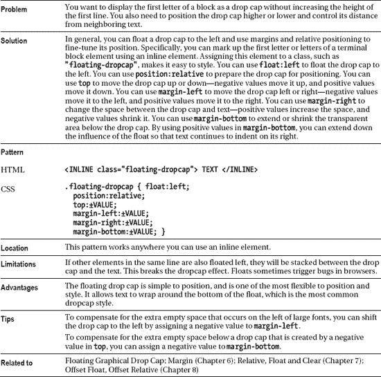

### 浮动图形首字下沉

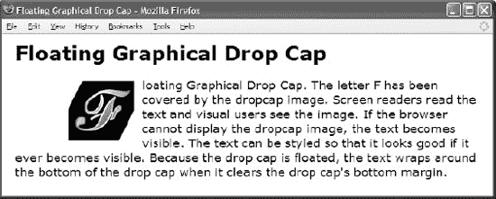

#### HTML

`<h1>Floating Graphical Drop Cap</h1>

**
F**loating
  Graphical Drop Cap. The letter F has been covered by the dropcap image.
  Screen readers read the text and visual users see the image.
  If the browser cannot display the dropcap image, the text becomes visible.
  The text can be styled so that it looks good if it ever becomes visible.
  Because the drop cap is floated, the text wraps around the bottom of the drop cap
  when it clears the drop cap's bottom margin.
`

#### CSS

`.floating-dropcap { float:left; position:relative; top:5px;
  margin-left:80px; margin-right:12px; margin-bottom:0px;
  **width:100px; height:90px;**
  line-height:80px; text-align:right;
  font-size:100px; font-weight:bold;
  color:black; background-color:white; }

**.floating-dropcap span { position:absolute;**
**  width:100px; height:90px; left:0; top:0; margin:0;**
**  background-image:url("f.jpg");**
**  background-repeat:no-repeat; }**`

#### 浮动图形首字下沉

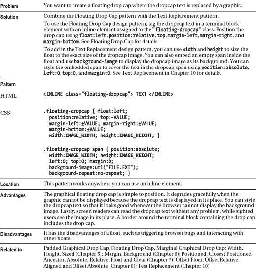

### 边际落差

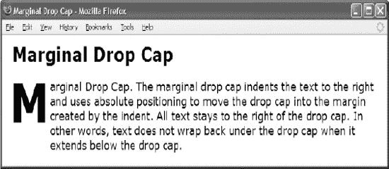

#### HTML

`<h1>Marginal Drop Cap</h1>

**
M**arginal Drop Cap.
  The marginal drop cap indents the text to the right and uses absolute
  positioning to move the drop cap into the margin created by the indent. All
  text stays to the right of the drop cap. In other words, text does not wrap
  back under the drop cap when it extends below the drop cap.
`

#### CSS

`**.indent { position:relative; margin-left:72px; margin-top:20px; }**

**.marginal-dropcap { position:absolute; left:-77px; top:-16px;**
  font-size:80px; font-weight:bold;
  color:black; background-color:white; }`

#### 边际落差

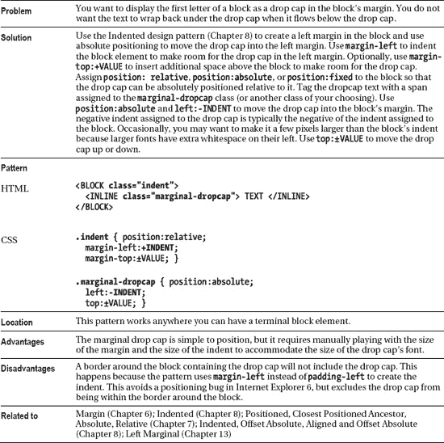

### 边缘图形首字下沉

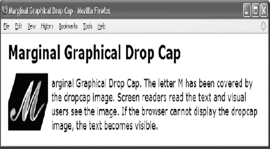

#### HTML

`<h1>Marginal Graphical Drop Cap</h1>
**
Marginal**
  Graphical Drop Cap. The letter M has been covered by the dropcap image.
  Screen readers read the text and visual users see the image.
  If the browser cannot display the dropcap image,
  the text becomes visible.
`

#### CSS

`.indent { position:relative; margin-left:120px; margin-top:20px; }

**.graphic-dropcap { position:absolute; left:-120px; top:6px;**
**  width:100px; height:90px;**
**  line-height:70px; padding-left:16px; text-align:right;**
  font-size:80px; font-weight:bold;
  color:black; background-color:white; }

**.graphic-dropcap span { position:absolute;**
**  width:100px; height:90px; left:0; top:0; margin:0;**
**  background-image:url("g.jpg");**
**  background-repeat:no-repeat; }**`

#### 边缘图形首字下沉

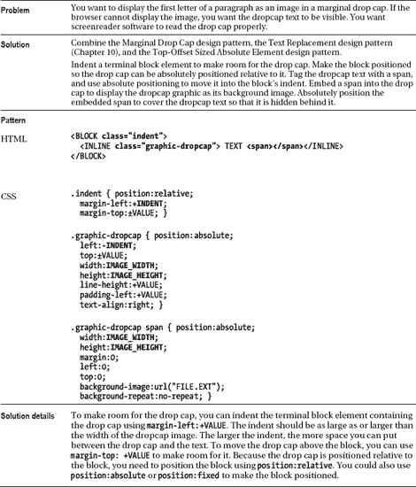

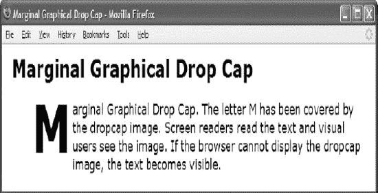

*当浏览器无法加载或显示图像时，边缘图形首字下沉示例是什么样子的*

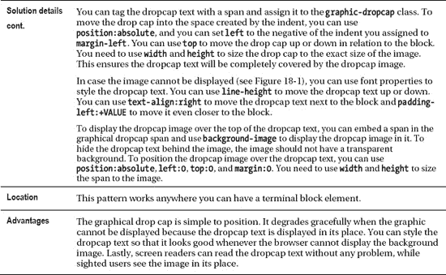

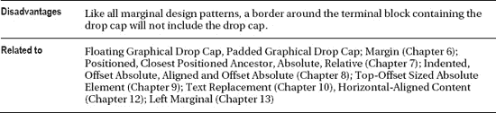