# 十九、标注和引用

本章讨论创建**标注**和**引用**的设计模式。

标注是从文档中抽出的关键点，用来吸引读者的注意力，以便他或她阅读文档并在阅读后记住该点。标注在文档中重复两次:一次作为文档正文的一部分，另一次作为标注显示。标注会突出显示，这样读者就不会错过。因为标注是从文档的文本中提取的，所以它通常是一个行内元素，尽管它也可能是一个块元素。

我将标注和引用组合在一起，因为它们密切相关。标注也称为**引用引用**，因为它们是从文档中提取的引用。拉报价和报价是有区别的。引用(或标注)要求同一文本在一个文档中重复两次，而引用只出现一次。此外，一个报价通常包括引用，而拉报价没有。最后，引用在视觉上和语义上属于内容的一部分，而标注在视觉上和语义上与内容分开，并且通常被移动到文档的左侧或右侧或边缘。在本章的其余部分，我将把引用称为标注，以避免与常规引用混淆。

### 章节大纲

*   **左侧浮动标注**展示了如何创建一个标注并将其浮动到左侧。
*   **右浮动标注**展示了如何创建一个标注并将其向右浮动。
*   **居中标注**展示了如何创建标注并将其居中。
*   **左边距标注**展示了如何使用左边距设计模式在左边距创建标注。
*   **右边距标注**展示了如何使用右边距设计模式在右边距创建标注。
*   **Block Quote** 展示了如何创建一个引用自动居中并带有图形背景引用样式的 Block Quote。
*   **内联块报价**展示了如何将内联报价呈现为块报价。
*   **内嵌引用**展示了如何创建带有引用的内嵌引用。

### 左浮动标注

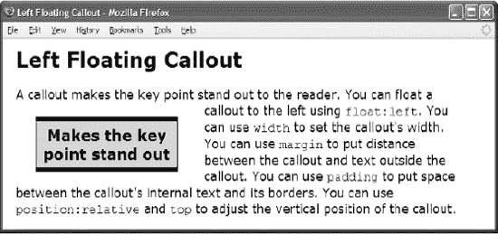

#### HTML

`<h1>Left Floating Callout</h1>

A callout makes the key point stand out to the reader.

**  Makes the key point stand out**

  You can float a callout to the left using <code>float:left</code>.
  You can use <code>width</code> to set the callout's width.
  You can use <code>margin</code> to put distance between the callout and
  text outside the callout. You can use <code>padding</code> to put space
  between the callout's internal text and its borders. You can use
  <code>position:relative</code> and <code>top</code> to adjust the vertical
  position of the callout.
`

#### CSS

`**.callout-left { float:left; width:200px; padding:6px;**
**  margin:10px 40px 10px 30px;**
**  position:relative; top:10px;**
  font-size:22px; line-height:normal; font-weight:bold;
  text-align:center; color:black; background-color:gold;
  border-left:1px solid black; border-right:1px solid black;
  border-top:6px solid black; border-bottom:6px solid black; }`

#### 左浮动标注

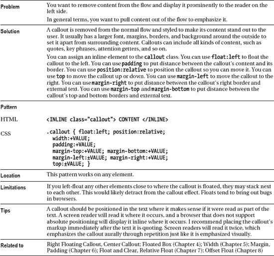

### 右浮动标注

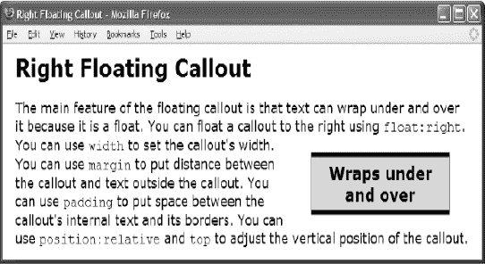

#### HTML

`<h1>Right Floating Callout</h1>

The main feature of the floating callout is that text can wrap
  under and over it because it is a float.

**  Wraps under and over**

  You can float a callout to the right using <code>float:right</code>.
  You can use <code>width</code> to set the callout's width.
  You can use <code>margin</code> to put distance between the callout and
  text outside the callout. You can use <code>padding</code> to put space
  between the callout's internal text and its borders. You can use
  <code>position:relative</code> and <code>top</code> to adjust the vertical
  position of the callout.
`

#### CSS

`**.callout { float:right; width:200px; padding:6px;**
**  margin:10px 30px 10px 40px;**
**  position:relative; top:10px;**
  font-size:22px; line-height:normal; font-weight:bold;
  text-align:center; color:black; background-color:gold;
  border-left:1px solid black; border-right:1px solid black;
  border-top:6px solid black; border-bottom:6px solid black; }`

#### 右浮动标注

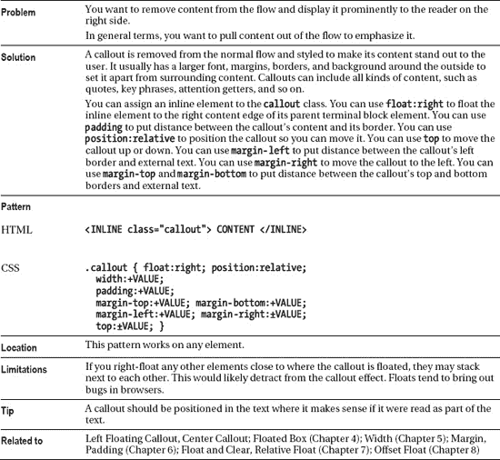

### 居中标注

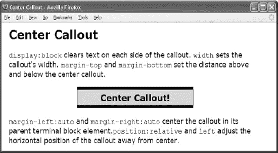

#### HTML

`<h1>Center Callout</h1>

<code>display:block</code> clears text on each side of the callout. <code>
  width</code> sets the callout's width. <code>margin-top</code> and <code>
  margin-bottom</code> set the distance above and below the center callout.

**  Centered Callout!**

  <code>margin-left:auto</code> and <code>margin-right:auto</code> center the
  callout in its parent terminal block element.<code>position:relative</code>
  and <code>left</code> adjust the horizontal position of the callout
  away from center.
`

#### CSS

`**.callout { display:block; width:300px; margin:20px auto; padding:6px;**
**  position:relative; left:0%;**
  font-size:22px; line-height:normal; font-weight:bold;
  text-align:center; color:black; background-color:gold;
  border-left:1px solid black; border-right:1px solid black;
  border-top:6px solid black; border-bottom:6px solid black; }`

#### 居中标注

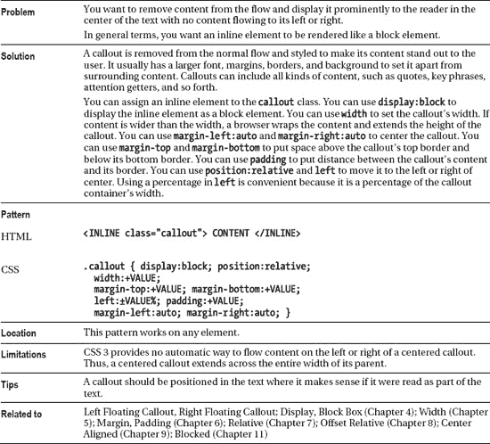

### 左边距标注

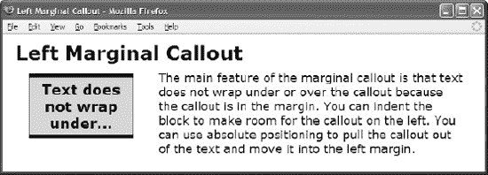

#### HTML

`<h1>Left Marginal Callout</h1>

**
**
**  Text does not wrap under...**
  The main feature of the marginal callout is that text does not wrap
  under or over the callout because the callout is in the margin.
  You can indent the block to make room for the callout on the left.
  You can use absolute positioning to pull the callout out of the text
  and move it into the left margin.
`

#### CSS

`**.left-marginal { position:relative; width:470px; margin-left:230px; }**

**.callout { position:absolute; left:-220px; width:160px; margin-top:5px;**
  line-height:normal; text-align:center; padding:5px 0;
  font-size:22px; font-weight:bold;
  color:black; background-color:gold;
  border-left:1px solid black; border-right:1px solid black;
  border-top:6px solid black; border-bottom:6px solid black; }`

#### 左边距标注

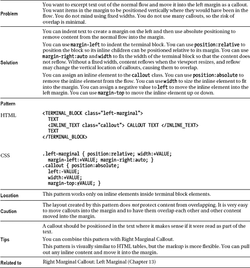

### 右边界标注

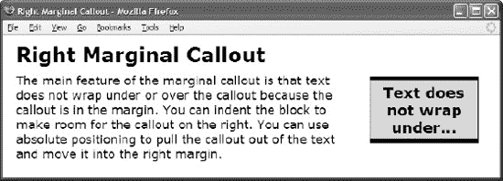

#### HTML

`<h1>Right Marginal Callout</h1>

**
**
**   Text does not wrap under...**

  The main feature of the marginal callout is that text does not wrap
  under or over the callout because the callout is in the margin.
  You can indent the block to make room for the callout on the right.
  You can use absolute positioning to pull the callout out of the text
  and move it into the right margin.
`

#### CSS

`**.right-marginal { position:relative; width:490px; margin-right:230px;  }**

**.callout { position:absolute; right:-200px; width:160px; margin-top:5px;**
  line-height:normal; text-align:center; padding:5px 0;
  font-size:22px; font-weight:bold;
  color:black; background-color:gold;
  border-left:1px solid black; border-right:1px solid black;
  border-top:6px solid black; border-bottom:6px solid black; }`

#### 右边界标注

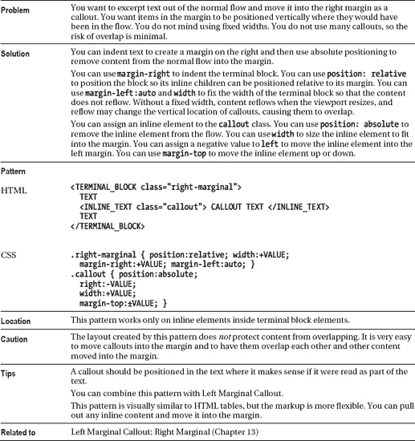

### 块报价

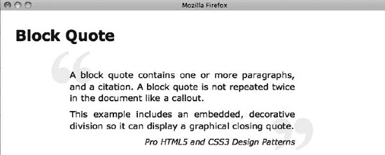

#### HTML

`<h1>Block Quote</h1>

**<blockquote>
**
**  
**A block quote contains one or more paragraphs, and a citation.
    A block quote is not repeated twice in the document like a callout.

**  
**This example includes an embedded, decorative division so it can display
    a graphical closing quote.

  **<cite>**Pro HTML5 and CSS3 Design Patterns<cite>
  
</blockquote>`

#### CSS

`**blockquote { width:500px; margin:10px auto;**
  position:relative; left:0%; text-align:justify;
  line-height:1.3em; color:black;
  padding-top:40px; padding-left:40px;
  background:url("dq1.jpg") no-repeat **top left;** }

**blockquote div** { padding-bottom:10px; padding-right:40px;
  background:url("dq2.jpg") no-repeat **bottom right;** }

**blockquote p** { margin:0; margin-bottom:10px; }

**blockquote cite** { display:block; text-align:right; font-size:0.9em; }`

#### 块报价

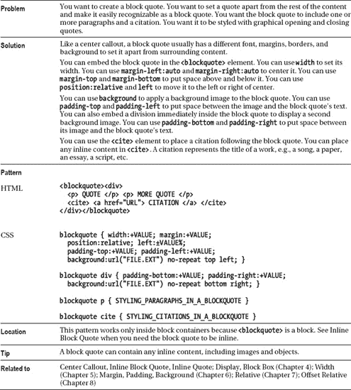

### 行内块引用

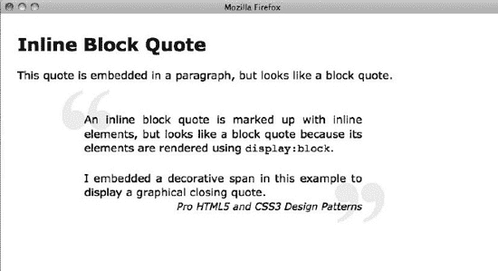

#### HTML

`<h1>Inline Block Quote</h1>

This quote is embedded in a paragraph, but looks like a block quote.

****
  An inline block quote is marked up with inline elements, but looks like a
  block quote because its elements are rendered using <code>display:block</code>.
  **   **I embedded a decorative span in this example to display
  a graphical closing quote.

**  <cite>**Pro HTML5 and CSS3 Design Patterns</cite> 
`

#### CSS

`.blockquote { **display:block;** width:500px; margin:10px auto;
  position:relative; left:0%; text-align:justify;
  line-height:1.3em; color:black;
  padding-top:40px; padding-left:40px;
  background:url("dq1.jpg") no-repeat top left white; }

.blockquote span { **display:block;**
  padding-bottom:20px; padding-right:40px;
  background:url("dq2.jpg") no-repeat bottom right; }

.blockquote cite { **display:block;** text-align:right; font-size:0.9em; }`

#### 行内块引用

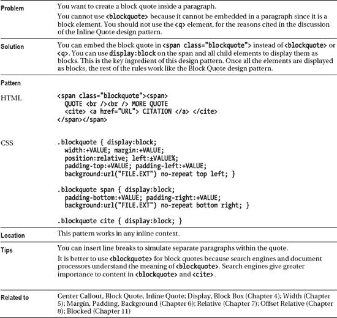

### 行内报价

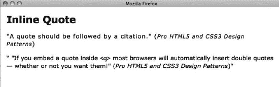

#### HTML

`<h1>Inline Quote</h1>

****
  "A quote should be followed by a citation."
  **(<cite>**Pro HTML5 and CSS3 Design Patterns**</cite>)**

**<q>  <!-- Do not use <q>. -->**
  "If you embed a quote inside <code>&lt;q&gt;</code> most browsers
  will automatically insert double quotes — whether or not you want them!"
  **(<cite>** Pro HTML5 and CSS3 Design Patterns**</cite>)</q>**
`

#### CSS

`.quote { letter-spacing:0.07em; }
.quote cite { font-size:0.9em; }`

#### 行内报价

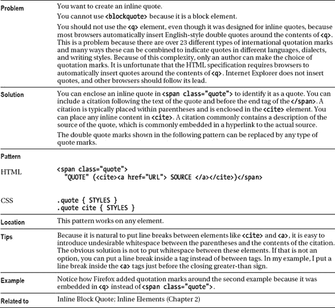