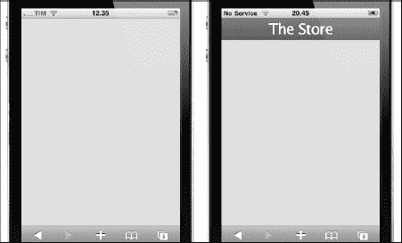
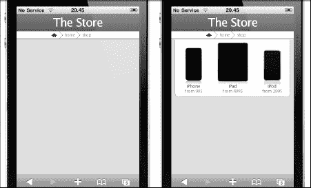

# 九、原生 iOS 设计实现

> “如果一切都在掌控之中……那你走得还不够快！”
> 
> -马里奥安德雷蒂

在前一章中，我们阐述了如何设置 iOS 环境的要点，在本章中，我们将看到如何在“商店”用例中实现这些相同的方面。

首先，我们看看如何使用 metatags 实现 iPhone 页面模型和 WebApp 模式。在第二部分，我们一步一步地看如何实现我们用例的类本机接口。每个新元素都使用自顶向下的方法呈现，总是显示用于实现该元素的代码。

### iPhone 页面模型实现

在本书关于设计的第一部分中，我们看到由于 iPhone 的显示尺寸，iPhone 网页是基于页面模型范例构建的。除此之外，我们需要在 WebApp 中设置的第一件事是页面结构。

### 实现类似原生的页面结构

本章中的代码是在 iWebKit 5.04 框架之上编写的，实现了我们的“商店”用例的页面结构。对于我们的用例，我们还编写了一些定制的 HTML 和 CSS 代码。我们使用标题来标记定制的 CSS 和框架代码，使用粗体文本样式来标记相关的 HTML 代码。

`<!DOCTYPE html>
<html lang="en">` `<head>
<meta charset="utf-8">
<title>The Store (U.S.)</title>
<link href="css/style.css" rel="stylesheet" media="screen" type="text/css" />
<link href="css/iphone.css" rel="stylesheet" media="screen" type="text/css" />
<link href="startup-image.png" rel="apple-touch-startup-image" />
<link href="apple-touch-icon.png" rel="apple-touch-icon" />

</head>
<body>

/* page content will be here */

</body>
</html>` 

一些 SEO 元标签故意从我们网页的`<head>`中消失，因为我们想继续关注本章的主题。我们将在第十章中看到如何使用 SEO 技术优化我们的代码。

单页结构是我们未来所有网页的基础。现在，我们需要继续实现我们的“商店”用例，开始添加设计元素，模拟 iPhone 的 iOS 原生外观。

### iPhone 原生界面模拟

本机界面模拟从支持 apple-mobile-web-app 的元标签开始。如果没有这个标签，我们未来的所有努力都将化为乌有，因为网页将与 iPhone 的显示尺寸不匹配，并且不会处于 WebApp 模式。

`<!DOCTYPE html>
<html lang="en">
<head>
<meta charset="utf-8" />
<title>The Store (U.S.)</title>
**<meta name="apple-mobile-web-app-capable" content="yes" />**
**<meta content="minimum-scale=1.0, width=device-width, maximum-scale=0.6667,É**
 **user-scalable=no" name="viewport" />**
<link href="css/style.css" rel="stylesheet" media="screen" type="text/css" />
<link href="css/iphone.css" rel="stylesheet" media="screen" type="text/css" />
<link href="startup-image.png" rel="apple-touch-startup-image" />
<link href="apple-touch-icon.png" rel="apple-touch-icon" />

</head>
<body>
**
**
        **
The Store
**
**
**

/* page content will be here */

</body>
</html>` 

#### 顶栏部分

在`<body>`部分，我们使用一个`
`插入了类似本机的**顶栏**。

`… … …

<body>
**
**
        **
The Store
**
**
**

/* page content will be here */

</body>

… … …`

然后在清单 9–1 和 9–2 中，我们覆盖了它的一些 iWebKit CSS 框架默认规则。

**清单 9–1。** *iWebKit 框架顶栏部分*

`/* from framework style.css stylesheet */

#topbar {

        position: relative;
        left: 0;
        top: 0;
        width: auto;
        background: -webkit-gradient(linear, 0% 0%, 0% 100%, from(#cdd5df),É
 color-stop(3%, #b0bccd), color-stop(50%, #889bb3), color-stop(51%, #8195af),É
 color-stop(97%, #6d84a2), to(#2d3642));
        margin-bottom: 13px;
}

/* for max-width: 320px */
#topbar {
        height: 44px;
}

/* for min-width: 321px */
#topbar {
        height: 32px;
}`

**清单 9–2。** *自定义顶栏部分*

`/* from custom iphone.css stylesheet */

#topbar {
        height: 44px;
        background: -webkit-gradient(linear, 0% 0%, 0% 100%, from(#566E93),É
 to(#314F7B));
}`

根据这些规则，我们覆盖了默认的背景渐变值，并在纵向和横向方向将顶栏高度固定为 44 像素，如图 Figure 9–1 所示。

**图 9–1。** *“商店”用例:空白页面(左)和顶栏内的页面标题(右)*

#### 页面标题元素

在顶栏中，我们使用一个`
`添加了类似于本机的**页面标题**，并对其进行了定制。清单 9–3 到 9–6 覆盖了默认框架值中的一些其他 CSS 规则:

`… … …

<body>

     **
The Store
**

/* page content will be here */

</body>

… … …`

**清单 9–3。** *iWebKit 框架页面样式元素*

`/* from framework style.css stylesheet */

#title {
        position: absolute;
        font-weight: bold;
        top: 0;
        left: 0;
        right: 0;
        padding: 0 10px;
        text-align: center;
        text-overflow: ellipsis;
        white-space: nowrap;` `        overflow: hidden;
        color: #FFF;
        text-shadow: rgba(0,0,0,0.6) 0 -1px 0;
        }`

**清单 9–4。** *自定义页面标题元素*

`/* from custom iphone.css stylesheet */

#title {
        color: #FFF;
        font-family: "Lucida Grande", Helvetica;
        font-size: 30px;
        text-shadow: #3B4C66 0 1px 0;
}`

**清单 9–5。** *iWebKit 框架页面样式元素*

`/* from framework style.css stylesheet */

/* for max-width: 320px */
#title {
        line-height: 44px;
        height: 44px;
        font-size: 16pt;
}

/* for min-width: 321px */
#title {
        line-height: 32px;
        height: 32px;
        font-size: 13pt;
}`

**清单 9–6。** *自定义页面标题元素*

`/* from custom iphone.css stylesheet */

#title {
        color: #FFF;
        font-family: "Lucida Grande", Helvetica;
        font-size: 30px;
        text-shadow: #3B4C66 0 1px 0;
}`

注意我们在设计阶段是如何使用 Helvetica 字体而不是 Myriad Pro 的。Myriad Pro 是一种商业字体，不能免费使用。

**注意:**与 Helvetica 字体不同，Myriad Pro 不在 iOS 字体堆栈中。如果要使用这个字体，除了购买，还需要使用`@font` -face CSS3 属性，如第七章所示。

标题标签练习

iWebKit 5.04 框架不使用 HTML 标题标签(例如 h1、h2、…、h6)来构成标题部分。< h1 >标题标签定义了页面最重要的标题，而< h6 >标题标签定义了最不重要的标题。在本章的最后，尝试实现这些标签。

*   使用

    # 标签，而不是 iWebKit 5.0.4 框架使用的标准。

*   根据文本语义，必要时添加其他标题标签。

对“商店”用例的另一页重复相同的方法。您可以从 Apress 网站下载用例源代码。

#### 面包屑栏

添加到页面结构的第二个设计元素是**面包屑栏**，使用`
`添加，如下所示:

`<head>
<meta charset="utf-8" />
<title>The Store (U.S.)</title>
<meta name="apple-mobile-web-app-capable" content="yes" /> <meta content="minimum-scale=1.0, width=device-width, maximum-scale=0.6667,É
 user-scalable=no" name="viewport" />
<link href="css/style.css" rel="stylesheet" media="screen" type="text/css" />
<link href="css/iphone.css" rel="stylesheet" media="screen" type="text/css" />
<link href="startup-image.png" rel="apple-touch-startup-image" />
<link href="apple-touch-icon.png" rel="apple-touch-icon" />

</head>
<body>

        
 The Store

**
**
        ****
        ****
        ****
        ****
        ****
**
**

/* other page content will be here */

</body>
</html>`

面包屑包含三种图像:房屋图标、分隔符箭头和页面名称，如图 Figure 9–2 所示。在最后一个链接中，`href`属性没有任何值(" # ")，因为它引用了实际加载的页面。

**图 9–2。** *【商店】用例:面包屑栏(左)和英雄内容区(右)*

breadcrumb 不是 iWebKit 框架提供的设计结构。因此，我们没有覆盖 CSS 样式表中的任何默认值；相反，我们从清单 9–7 中所示的草图发展而来。

**清单 9–7。** *自定义面包屑栏*

`/* from custom iphone.css stylesheet */

/* from custom iphone.css stylesheet */
#breadcrumb {
        background: #FFF;
        border-bottom: 1px solid #676767;
        font-family: "Lucida Grande", Helvetica;
        font-size: 11px;
        height: 16px;
        margin: -13px 0px 13px;
        text-align: center;
}`

#### 英雄内容区

在面包屑下面，我们有另一个由 sketch 发展而来的设计元素，即**英雄内容**区域。使用一个`
`元素添加英雄内容，它包含三个图像链接，如下所示:

`<head>
<meta charset="utf-8" />
<title> The Store (U.S.)</title>
<meta name="apple-mobile-web-app-capable" content="yes" />
<meta content="minimum-scale=1.0, width=device-width, maximum-scale=0.6667,É
 user-scalable=no" name="viewport" />

<link href="css/style.css" rel="stylesheet" media="screen" type="text/css" />
<link href="css/iphone.css" rel="stylesheet" media="screen" type="text/css" />
<link href="startup-image.png" rel="apple-touch-startup-image" />` `<link href="apple-touch-icon.png" rel="apple-touch-icon" />

</head>
<body>

        
 The Store

**
**
        ****
        ****
        ****
        ****
        ****
**
**
**
**
        ****
        ****
        ****
**
**

/* other page content will be here */

</body>
</html>`

“商店”用例通常有三个带有三个不同关联链接的图像，以提高用户体验水平，让他或她在站点地图中从一个点跳到另一个点有更多的选择。此外，这取决于开发人员以不同的方式处理这个机会。在清单 9–8 中，我们可以看到用于设计这个元素的 CSS 样式表。

**清单 9–8。** *自定义内容英雄区*

`/* from custom iphone.css stylesheet */

/* from custom iphone.css stylesheet */
#hero {
        border: 1px solid #676767;
        border-top: none;
        background: #FFF;
        font-family: "Lucida Grande", Helvetica;
        font-size: 12px;
        height: 150px;
        margin: -13px 10px 13px 10px;
        padding-top: 4px;
        text-align: center;
        -webkit-border-bottom-left-radius: 10px;
        -webkit-border-bottom-right-radius: 10px;
}`

现在，我们进入网页的下半部分，专门讨论内容。在此特定页面上，内容仅由菜单表示，但在其他商店页面上，使用此部分可以添加任何种类的内容。

`<head>
<meta charset="utf-8" />
<title>The Store (U.S.)</title>
<meta name="apple-mobile-web-app-capable" content="yes" />
<meta content="minimum-scale=1.0, width=device-width, maximum-scale=0.6667,
 user-scalable=no" name="viewport" />
<link href="css/style.css" rel="stylesheet" media="screen" type="text/css" />
<link href="css/iphone.css" rel="stylesheet" media="screen" type="text/css" />
<link href="startup-image.png" rel="apple-touch-startup-image" />
<link href="apple-touch-icon.png" rel="apple-touch-icon" />

</head>
<body>

        
 The Store

**
**
        ****
        ****
        ****
        ****
        ****
**
**

        
        
        

**
**
        **Browse Store**
        **<ul class="pageitem">**
                **<li class="menu">**
                        **<a href="shop-mac.html">**
                                ****
                                **Shop Mac**
                                ****
                        **</a>**
                **</li>**
                **<li class="menu">**
                        **<a href="shop-ipod.html">**
                                ****
                                **Shop iPod**
                                ****
                        **</a>**
                **</li>**
                **<li class="menu">**
                        **<a href="shop-iphone.html">**
                                ****
                                **Shop iPhone**` `                                ****
                        **</a>**
                **</li>**
                **<li class="menu">**
                        **<a href="shop-ipad.html">**
                                ****
                                **Shop iPad**
                                ****
                        **</a>**
                **</li>**
        **</ul>**
**
**

/* other page content will be here */

</body>
</html>`

#### 菜单区

**菜单**区域被包裹在`
`中，包含两个主要设计元素:标题和菜单，如图图 9–3 所示。

**图 9–3。** *“商店”用例:菜单标题(左)和边到边导航(右)*

我们使用`
`插入**菜单标题**。该元素由 iWebKit 框架提供，并由清单 9–9 中的 CSS 规则定义样式。

**清单 9–9。** *菜单标题元素*

`/* from framework style.css stylesheet */

.graytitle {
        position: relative;
        font-weight: bold;` `        font-size: 17px;
        right: 20px;
        left: 9px;
        color: #4C4C4C;
        text-shadow: #FFF 0 1px 0;
        padding: 1px 0 3px 8px;
}`

在标题下面，我们有典型的 iPhone **边缘到边缘导航**包裹在`<ul id="pageitem">`里面。该元素也由 iWebKit 框架提供，并由清单 9–10 中的 CSS 规则定义样式:

**清单 9–10。** *边到边导航区*

`/* from framework style.css stylesheet */

.pageitem {
        -webkit-border-radius: 8px;
        background-color: #FFF;
        border: #878787 solid 1px;
        font-size: 12pt;
        overflow: hidden;
        padding: 0;
        position: relative;
        display: block;
        height: auto;
        width: auto;
        margin: 3px 9px 17px;
        list-style: none;
}
.pageitem li:first-child, .pageitem li.form:first-child {
        border-top: 0;
}
.pageitem li:first-child:hover, .pageitem li:first-child a {
        -webkit-border-top-left-radius: 8px;
        -webkit-border-top-right-radius: 8px;
}
.pageitem li:last-child:hover, .pageitem li:last-child a {
        -webkit-border-bottom-left-radius: 8px;
        -webkit-border-bottom-right-radius: 8px;
}`

这个无序列表的列表项是单个菜单项。每个条目都是使用一个`<li class="menu">`添加的，并且由一个链接元素中的三个元素组成，如图 9–4 中的所示。

**图 9–4。** *【商店】用例:边到边菜单结构(左)和页脚(右)*

每个链接`<a>`元素包含一个图像``，一个文本``，以及另一个作为`<span="arrow">`元素背景图像插入的图像。在下文中，我们将单个菜单项代码分离出来，以便更好地理解它的结构。为了与菜单布局保持一致，每个菜单链接必须有三个相同图像宽度的图像。

`… … …

<li class="menu">
        <a href="shop-iphone.html">
                                        /* icon  */
                Shop iPhone            /* text */
                                      /* arrow */
        </a>
</li>

… … …`

#### 页脚部分

页面中的最后一个设计元素是**页脚**。在我们的“商店”用例中，**页脚**是最小的，只包含苹果标志。使用`
`添加**页脚**，并根据清单 9–11 中的 CSS 规则设置样式。

**清单 9–11。** *页脚部分*

`/* from framework style.css stylesheet */

#footer {
        text-align: center;
        position: relative;
        margin: 20px 10px 0;
        height: auto;
        width: auto;`
`        bottom: 10px;
}`

下面的代码展示了包括页脚在内的整个“商店”用例页面结构。

`<!DOCTYPE html>
<html manifest="cache-iphone.manifest">

<head>
        <meta charset="utf-8" />
        <title>The Store (U.S.)</title>
        <meta name="apple-mobile-web-app-capable" content="yes" />
        <meta content="minimum-scale=1.0, width=device-width, maximum-scale=0.6667,É
         user-scalable=no" name="viewport" />
        <link href="css/style.css" rel="stylesheet" media="screen" type="text/css" />
        <link href="css/iphone.css" rel="stylesheet" media="screen" type="text/css" />
        <link href="startup-image.png" rel="apple-touch-startup-image" />
        <link href="apple-touch-icon.png" rel="apple-touch-icon" />
        
</head>
<body>

        
 The Store

        
        
        
        
        

        
        
        

        Browse Store
        <ul class="pageitem">
                <li class="menu">
                        <a href="shop-mac.html">
                                
                                Shop Mac
                                
                        </a>
                </li>
                <li class="menu">
                        <a href="shop-ipod.html">
                                
                                Shop iPod
                                
                        </a>
                </li>
                <li class="menu">`
`                        <a href="shop-iphone.html">
                                
                                Shop iPhone
                                
                        </a>
                </li>
                <li class="menu">
                        <a href="shop-ipad.html">
                                
                                Shop iPad
                                
                        </a>
                </li>
        </ul>

        

</body>
</html>`

### 总结

在本章的第一部分，我们看到了如何使用“商店”用例实现 iPhone 页面模型范例。

在本章的第二部分，我们在实践中看到了如何在 WebApp 中模拟本地应用接口。我们一步一步地看到了为 WebApps 的基本设计元素添加代码的整个过程。

我们的“商店”用例的完整代码可以在 Apress 网站上获得。