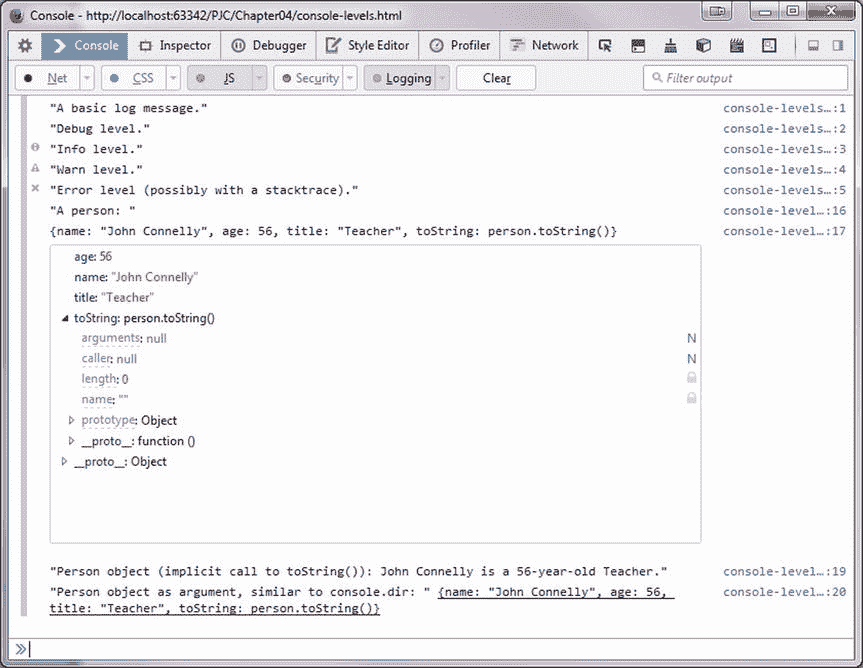
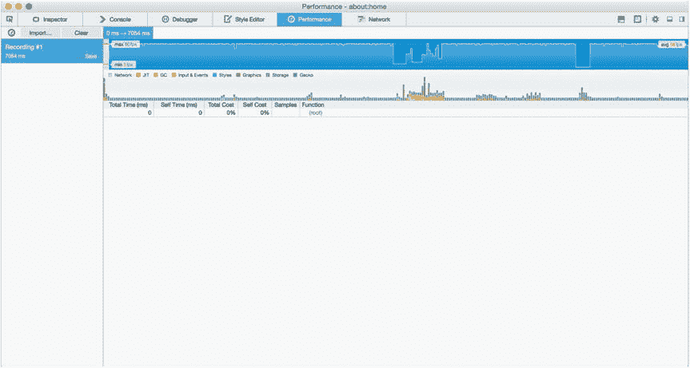

# 四、调试 JavaScript 代码

有时候，并不是代码的编写，而是对代码的管理，让我们陷入困境，回到我们最喜欢的视频游戏。为什么它能在这台机器上工作，而不是在那台机器上？什么叫两倍等于(==)不好，三倍等于(===)好？为什么运行测试如此麻烦？我应该如何打包这些代码以供分发？我们被问题困扰，被与我们正在编写的代码没有直接关系的问题分心。

当然，我们不应该忽视这些问题。我们希望编写最高质量的代码，当我们做不到时，我们希望获得易于使用的调试工具。我们需要良好的测试覆盖率，无论是现在还是未来的重构。我们应该考虑我们的代码将如何分布。这就是本章的全部内容。

我们将从如何解决代码问题开始。我们希望成为完美的程序员，第一次就把所有东西都写对。但是我们都知道这在现实世界中是不会发生的。所以先从调试工具说起。

调试工具

所有现代浏览器都有某种形式的开发者工具包。即使是落后的 Internet Explorer 8 也有一个基本的调试器，尽管你需要管理员权限来安装它。我们现在所拥有的与使用各种`alert()`语句或者偶尔将 DOM 元素作为我们唯一依靠的开发时代相去甚远。

一般来说，开发人员的工具包会有以下实用程序:

*   控制台:我们的应用的 JavaScript 便笺簿和日志位置的组合。
*   调试器:长久以来困扰 JavaScript 开发人员的工具。
*   一个 DOM 检查器:我们的大部分工作都集中在操作 DOM 上，右键选择 View Source 不会削减它。检查器应该反映 DOM 的当前状态(而不是原始源)。大多数 DOM 检查器都有一个基于树的视图，可以通过在检查器或页面中单击来选择 DOM 元素。
*   一个网络分析器:告诉我请求了什么文件，实际上找到了哪些文件，以及下载它们花了多长时间。
*   分析器:这些通常有些粗糙，但是它们比将一个调用包装在对`new Date().getTime()`的两个调用中要好。

还有一些扩展可以添加到浏览器中，为您提供超出浏览器内置功能的额外调试功能。例如，Postman ( `http://getpostman.com`)是 Chrome 的一个扩展，它可以让你创建任何 HTTP 请求并查看响应。另一个流行的扩展是 Firebug ( `http://getfirebug.com`)，这是一个开源项目，它为 Firefox 添加了所有的开发工具，并且也可以拥有自己的一组扩展。

在本章中，我们将把通用工具集称为开发人员工具或开发人员工具包，除非讨论特定的浏览器工具集。

控制台

作为开发人员，控制台是我们花费大量时间的地方。控制台界面模仿了大多数应用上熟悉的日志级别:`debug`、`info`、`warn`、`error`和`log`。通常，我们第一次遇到它是作为代码中`alert()`语句的替代，尤其是在调试的时候。在一些老版本的 IE 上，只支持`log`，但从 IE 11 开始，五个功能都支持。此外，控制台有一个`dir()`函数 ，它将为您提供一个递归的、基于树的对象接口。万一控制台不在您选择的平台上，尝试将清单 4-1 作为多项填充。

***清单 4-1*** 。控制台聚合填充

```js
if (!window.console) {
  window.console = {
    log : alert
  }
}
```

(显然，这只是`log`函数的多填充 。如果您要使用其他人，您必须单独添加他们。)

各个级别的输出变化很小。在 Chrome 或 Firefox 上，`console.error`包含了一个自动堆栈跟踪。其他浏览器(和原生 Firefox)只是添加一个图标并改变文本颜色来区分不同的级别。也许使用不同功能级别的主要原因是它们可以在所有三种主要浏览器上被过滤掉。清单 4-2 提供了一些测试代码 ，随后是来自各大浏览器的屏幕截图:Chrome、Firefox 和 Internet Explorer ( 图 4-1 到 4-3 )。

***清单 4-2*** 。控制台级别

```js
console.log( 'A basic log message.' );
console.debug( 'Debug level.' );
console.info( 'Info level.' );
console.warn( 'Warn level.' );
console.error( 'Error level (possibly with a stacktrace).' );

var person = {
  name : 'John Connelly',
  age : 56,
  title : 'Teacher',
  toString: function() {
    return this.name + ' is a ' + this.age + '-year-old ' + this.title + '.';
  }
};

console.log( 'A person: ' );
console.dir( person );

console.log( 'Person object (implicit call to toString()): ' + person );
console.log( 'Person object as argument, similar to console.dir: ', person );
```


图 4-1 。在 Chrome 40.0 中查看的测试代码



 。在 Firefox 35.0.1 中查看的测试代码


图 4-3 。在 Internet Explorer 11.0 中查看测试代码

利用控制台功能

那么，使用这些控制台功能的最佳方式是什么呢？与 JavaScript 的许多特性一样，关键是一致性。您和您的团队应该在使用模式上达成一致，记住几件事:首先也是最重要的是，在您部署代码让全世界看到之前，应该删除所有的控制台语句。生产代码不需要包含控制台语句，并且移除控制台函数的调用非常容易(正如您将在本章后面看到的)。还要记住，调试，我们很快就会看到，可以取代一次性需求的日志记录。一般来说，使用控制台日志记录来获取关于应用状态的信息:它启动了吗？它能找到数据吗？各种复杂的物体是什么样子的？等等。您的日志记录将为您提供应用生命周期的编年史，以及应用变化状态的视图。如果您的应用是一条高速公路，良好的日志记录就相当于一种里程标——进度的指示，以及当问题不可避免地出现时从哪里开始搜索的通用指示器。

控制台也不仅仅是一个日志记录工具。这是一个 JavaScript 便笺本。控制台以单行模式启动，您可以逐行输入 JavaScript。如果你想输入多行代码，你可以切换到多行模式(通过 Firefox 和 IE 中的图标启用；在 Chrome 中，只需用 Shift+Enter 结束你的行。在单行模式下，您可以输入各种 JavaScript 语句，通过点击 Tab 或右箭头键享受自动完成。控制台还包括一个简单的历史记录，通过它，您可以使用上下箭头键向前和向后移动。控制台维护状态，因此在前面一行(或多行模式的运行)中定义的变量会一直存在，直到您重新加载页面。

这最后一个特征值得进一步研究。控制台拥有 JavaScript 解释器的全部当前状态。这是难以置信的强大。你加载 jQuery 了吗？然后你可以根据它的 API 输入命令。想在页面末尾检查变量的状态？或者也许你需要看看一个特定的动画是怎么回事？控制台是你的朋友。您可以调用函数、检查变量、操作 DOM 等等。想象一下，您输入的任何命令都被添加到刚刚完成的脚本中，并且可以访问它的所有状态。

控制台还有一个扩展的命令行 API。最初是由 Firebug 的优秀人员创建的，它的一些元素也已经移植到了其他浏览器上。现在 Chrome 和原生 Firefox 支持，但 Internet Explorer 不支持。这个 API 有许多有用的应用，我们全心全意地推荐在`https://getfirebug.com/wiki/index.php/Command_Line_API`查看细节。以下是一些亮点:

*   `debug(` *functionName* `):`当 *functionName* 被调用时，调试器会在函数中的第一行代码前自动启动。
*   `undebug(` *函数名* `)`:停止调试已命名的函数。
*   `include(` *url* `)`:将远程脚本拉入页面。如果你想引入另一个调试库，或者不同地操作 DOM 的东西，或者诸如此类的东西，这非常方便。
*   `monitor(` *functionName* `)`:打开对命名函数的所有调用的日志记录；不影响`console.*`调用，而是为函数的每次调用插入一个对`console.log`的自定义调用。这将记录函数名、它的参数以及它们的值。
*   `unmonitor(` *函数名* `)`:关闭通过`monitor()`启用的所有函数调用的日志记录。
*   `profile([` *标题* `])`:打开 JavaScript profiler 您可以为这个概要文件传入一个可选的标题。
*   `profileEnd()`:结束当前运行的配置文件并打印一份报告，可能带有调用配置文件中指定的标题。
*   `getEventListeners(element)`:获取所提供元素的事件监听器。

多亏了控制台，我们开发人员有了一个全功能的工具来与我们的代码进行交互。我们可以记录应用状态的快照，并且一旦它完成加载，我们就可以与之交互。控制台也将在我们的下一个工具调试器中占据显著位置。

调试器

多年来，对 JavaScript 的一个打击是它不可能是一种“真正的”语言，因为它缺乏像调试器这样的工具。快进到现在，调试器是所有开发人员工具包的标准装备。所有当前的浏览器都有一个开发工具，可以让你检查你的应用和调试你的工作。让我们看看这些工具是如何工作的，从调试器开始。

调试器背后的想法很简单:作为开发人员，您需要暂停应用的执行并检查其当前状态。尽管我们可以通过明智地应用`console.log`语句来完成后一部分，但是如果没有调试器，我们就无法处理前一部分。暂停应用后，我们需要使用一些工具。我们需要一种方法来告诉调试器激活。在代码本身中，我们可以添加简单的语句`debugger;`来激活该行的调试器。如前所述，我们还可以从控制台调用`debug`命令，向它传递一个函数的名称，该函数在被调用时将启动调试器。但是选择调试器何时启动的最简单的方法是设置一个断点。

断点允许我们将 JavaScript 代码运行到某一点，然后将应用冻结在那里。当我们到达断点时，我们可以开始了解应用的当前状态。从这里我们可以看到变量的内容，这些变量的范围等等。此外，我们有一个导航菜单，其中至少包括四个选项:单步执行当前函数(深入堆栈一层)，单步退出当前函数(运行当前堆栈框架直到完成，并在框架返回的点继续调试)，单步执行当前函数(无需首先深入函数)和继续执行(运行直到完成或下一个断点)。

DOM 检查器

许多 JavaScript 应用对 DOM 的状态做了大量的更改——事实上，这些更改如此之多，以至于在加载页面后立即引用实际的 HTML 源代码通常是没有用的。DOM inspector 反映了 DOM 的当前状态(而不是页面加载时 DOM 的状态)。每当 DOM 发生变化时，它应该动态地即时更新。开发人员工具已经将 DOM 检查器作为一个标准特性。

网络分析仪

自从这本书的前一版以来，Ajax 已经从 JavaScript 的一个奇异特性变成了专业 JavaScript 程序员锦囊妙计中的一个标准工具。调试工具花了一段时间才跟上。现在，开发人员工具提供了几种跟踪 Ajax 请求的方法。一般来说，您应该能够在控制台或网络分析器上获得关于 Ajax 请求的信息。后者有更详细的接口。您应该能够对特定类型的请求进行排序(XHR/Ajax、脚本、图像、HTML 等等)。每个请求都应该有自己的条目，这些条目通常会提供关于请求状态(响应代码和响应消息)、请求去往何处(完整的 URL)、交换了多少数据以及请求花费了多长时间的信息。深入到单个请求，您可以看到请求和响应头、已处理数据的预览以及数据的原始视图(取决于数据类型)。例如，如果您的应用请求 JSON 格式的数据，网络分析器将告诉您原始数据(一个普通的字符串),并且可能通过 JSON 格式化程序传递该字符串，因此它可以向您显示请求的最终结果。图 4-4 显示的是 Chrome 40.0 中的网络分析仪，图 4-5 显示的是 Firefox 35.0.1 中的。


图 4-4 。Chrome 40.0 中的网络分析仪


图 4-5 。火狐 35.0.1 中的网络分析器

使用堆分析器和时间线，您可以检测桌面和移动设备上的内存泄漏。首先让我们看看时间线。

时间线

当您第一次注意到页面变慢时，时间线可以快速帮助您了解随着时间的推移您使用了多少内存。时间表中的功能在所有现代浏览器中都非常相似，所以为了简短起见，我们将重点放在 Chrome 上。

转到时间线面板并选中内存复选框。在那里，你可以点击左侧的录制按钮。这将开始记录应用的内存消耗。在记录时，以暴露内存泄漏的方式使用应用。停止记录，图表将会显示你在一段时间内使用了多少内存。

如果您发现随着时间的推移，您的应用正在使用内存，并且垃圾收集的水平从未下降，那么您有一个内存泄漏。

配置文件 ??

如果您发现确实存在内存泄漏，下一步就是查看分析器，并尝试了解发生了什么。

理解内存在浏览器中是如何工作的，以及它是如何被清理或垃圾收集的是很有帮助的。垃圾收集是在浏览器中自动处理的。这是浏览器查看所有已创建对象的过程。不再被引用的对象被删除，内存被回收。

现在所有的浏览器都内置了分析工具。这将让您看到随着时间的推移哪些对象使用了更多的内存。

图 4-6 显示了 Chrome 40.0 中的 Profiles 面板。


图 4-6 。Chrome 40.0 中的配置文件面板

图 4-7 显示了 Firefox 35.0.1 中的等效面板，性能选项卡。



图 4-7 。Firefox 35.0.1 中的个人资料面板

使用 profiler 是类似的，因为您需要浏览器来记录运行中的应用。在这种情况下，您拍摄了所谓的快照。Gmail 团队建议按以下顺序参加三次考试:

1.  拍一张快照。
2.  在您认为泄漏来自的地方执行操作。
3.  拍摄第二张快照。
4.  执行相同的操作。
5.  拍第三张快照。
6.  在快照 3 的摘要视图中筛选快照 1 和 2 中的对象。

此时，您可以开始看到所有仍在周围并可能占用内存的对象。现在，您应该能够看到哪些引用是剩余的，并处理掉它们。

那么什么是参考呢？通常，当一个对象有一个值是另一个对象的属性时，就会发生引用。清单 4-3 显示了一个例子。

***清单 4-3*** 。创建对象引用

```js
var myObject = {};
myObject.property = document.createElement('div');
mainDiv.appendChild(myObject.property);
```

这里的`myObject.property` 现在引用了新创建的`div`对象。`appendChild`方法可以毫无问题地使用它。如果在某个时候从 DOM 中删除了那个`div`，`myObject`仍然会有一个对`div`的引用，并且不会被垃圾收集。当对象不再持有引用时，它们会被自动垃圾回收。

移除引用的一种方法是使用`delete`关键字，如清单 4-4 所示。

***清单 4-4*** 。删除对象引用

```js
delete myObject.property;
```

摘要

正如你所看到的，现代浏览器有工具给你一个环境，帮助你完全理解你的应用。如果您确实看到了可以改进的地方，时间线可以显示一段时间内使用了多少内存。调试器可以帮助您在任何给定时间看到变量的值。使用 profiler 可以帮助您看到哪里正在泄漏内存，以及如何修复它。