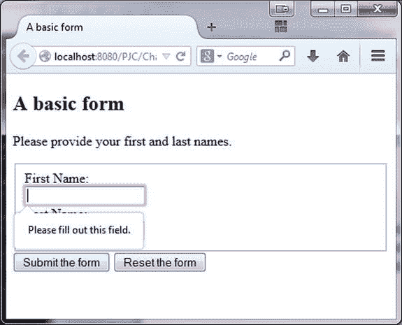

# 七、JavaScript 和表单验证

不可避免的是，当遇到一个表单时，人们会考虑该表单数据的命运。JavaScript 的第一个实际应用之一是提供一种在客户端验证数据的方法，而不是必须忍受与服务器之间的往返。表单验证在当时有点特别，没有实用的 API，也没有与浏览器的真正集成。相反，程序员将事件和基本的文本操作绑定在一起，以提供方便的用户界面增强。

快进到今天，表单验证的情况已经好得多了。对于现代浏览器，我们有一个集成的验证 API，它与 HTML 和 CSS 一起工作，以提供一组广泛的表单验证功能。我们也有正则表达式，尽管它们很复杂，但对于数据验证来说，它比一个字符一个字符地迭代要好得多。

本章我们关注的是 JavaScript 和表单。虽然我们将重点关注表单验证，但我们也将关注 JavaScript 与表单交互方式的总体改进，以及一些新的与表单相关的 API。

HTML 和 CSS 表单验证

如前所述，自 JavaScript 早期以来，表单验证已经走过了漫长的道路。要真正深入表单验证的状态，我们不仅需要了解 JavaScript，还需要了解 HTML5 和 CSS。让我们从事物的 HTML 方面开始。在过去的几年里，由于 Web 超文本应用技术工作组(WHATWG) 的辛勤工作，HTML 已经发展并增加了许多新特性。这个组织推动了 HTML 的发展和更新，使之成为众所周知的 HTML5。虽然 HTML5 规范的范围意味着我们不能在这里讨论细节，但你可以在 Jonathan Reid 的 *HTML5 程序员参考*中找到更多信息(Apress，2015)。

HTML5 中特别值得注意的是对表单控件集的改进。这些变化大致分为两类:添加新的控件或控件样式(URL 字段、日期选择器等)，以及表单验证。最初，我们的重点是后者。简单的表单验证已经转移到 HTML 中，不需要任何 JavaScript。这种验证是通过向表单控件添加某些属性来实现的。一个简单的例子是`required`属性，它与`input`元素配对，并在表单提交之前强制字段具有值。清单 7-1 是一个基本的例子。

[***清单 7-1***](#_list1) 。简单的形式

```js
<!DOCTYPE html>
<html>
<head>
  <title>A basic form</title>
</head>
<body>
<h2>A basic form</h2>

<p>Please provide your first and last names.</p>

<form>
  <fieldset>
    <label for="firstName">First Name:</label><br/>
    <input id="firstName" name="firstName" type="text" required/><br/>
    <label for="lastName">Last Name:</label><br/>
    <input type="text" name="lastName" id="lastName"/><br/>
  </fieldset>
  <input type="submit" value="Submit the form"/> <input type="reset" value="Reset the form"/>
</form>

</body>
</html>
```

注意，在表单中，我们有一个 ID 为`firstName`的输入字段，它添加了前面提到的`required`属性。如果我们试图在没有填写这个字段的情况下提交表单，我们将会看到类似于图 7-1 的结果。



[图 7-1](#_Fig1) 。此基本表单中缺少名字

Chrome 和 IE 11 上的显示看起来大致相同(Chrome 没有用红色边框包围字段，但 IE 有一个更块状、更自信的红色边框)。如果您要使`firstName`和`lastName`字段都成为必填字段，边框将出现在每个字段上，但是弹出工具提示将只与第一个有问题的字段相关联。自定义弹出窗口怎么样？我们将很快处理这个问题，但是它需要 JavaScript。

有几种其他类型的验证可以通过 HTML 属性激活。他们是

*   `pattern`:该属性采用正则表达式作为参数。正则表达式不需要用斜杠括起来。正则表达式语言引擎与 JavaScript 的相同(也有相同的问题)。这是附加到输入元素上的。请注意，`email`和`url`的输入类型分别意味着适用于有效电子邮件地址和 URL 的模式值。模式验证不适用于 Safari 8、iOS Safari 8.1 或 Opera Mini。
*   `step`:强制值匹配指定步长值的倍数。限制为输入类型`number`、`range`或日期时间之一。步骤验证在 Chrome 6.0、Firefox 16.0、IE 10、Opera 10.62 和 Safari 5.0 中有效。
*   `min` / `max`:最小值或最大值，不仅适用于数字，也适用于日期时间。这种方法在 Chrome 41、Opera 27 和 Chrome for Android 41 中都有效。
*   `maxlength`:字段中数据的最大长度，以字符为单位。仅对`text`、`email`、`search`、`password`、`tel`或`url`输入类型有效。这种方法通常不会进行太多的验证，以防止用户在它所附加的字段中输入过多的数据。它可以在所有现代浏览器上运行。

在表单级别，您可以通过以下两种方法之一整体关闭验证。您可以将`formnovalidate`属性添加到表单的提交按钮，或者将`novalidate`属性添加到表单元素本身。

半铸钢ˌ钢性铸铁(Cast Semi-Steel)

不满足于让 HTML5 做所有的工作，CSS 规范已经被更新来处理表单验证。处于无效状态的表单元素可以通过`:invalid`伪类来访问。不幸的是，这个伪类的实现还有待改进。首先，在页面加载时检查表单元素的有效性。因此，如果您有如下样式:

```js
:invalid { background-color: yellow }
```

当页面加载时，许多字段会有黄色背景。第二，Chrome 和 IE 只对表单元素应用`:invalid`。如果表单中的任何元素无效，Firefox 会将其应用到整个表单。考虑清单 7-2 中的。

[***清单 7-2***](#_list2) 。使用`:invalid`伪类

```js
<!DOCTYPE html>
<html>
<head>
  <title>A basic form</title>
  <style>
    :invalid {
      background-color: yellow
    }
  </style>
</head>
<body>
<h2>A basic form</h2>

<p>Please provide your first and last names.</p>

<form>
  <fieldset>
    <label for="firstName">First Name:</label><br/>
    <input id="firstName" name="firstName" type="text" required/><br/>
    <label for="lastName">Last Name:</label><br/>
    <input type="text" name="lastName" id="lastName"/><br/>
  </fieldset>
  <input type="submit" value="Submit the form"/> <input type="reset" value="Reset the form"/>
</form>

</body>
</html>:
```

在这个清单中，Firefox 用黄色背景显示整个表单，因为表单的一个元素处于无效状态。通过将`:invalid`的样式更改为`input:invalid`来解决这个问题，这将为您提供跨浏览器的一致行为。

CSS 还提供了一些其他的伪类:

*   `:valid`包含处于有效状态的元素。
*   `:required`获取其`required`属性设置为 true 的元素。
*   `:optional`获取没有设置`required`属性的元素。
*   `:in-range`用于最小/最大边界内的元素；IE 不支持。
*   `:out-of-range`用于那些在那些界限之外的；IE 不支持。

最后说一下红光和弹出消息。在 Firefox 中提交后，无效元素周围会出现红色光晕效果。(在 Internet Explorer 中，它是一个简单的红色边框，没有发光效果。)Firefox 将效果公开为`:-moz-ui-invalid`伪类。您可以按如下方式覆盖它:

```js
:-moz-ui-invalid { box-shadow: none }
```

唉，Internet Explorer 并没有将它的效果公开为一个伪类。这意味着我们已经达到了单独使用 HTML 和 CSS 的极限。有些功能我们想改变，有些功能我们想实现。这就是 JavaScript 重新发挥作用的地方。>:

JavaScript 表单验证

很大程度上得益于 HTML5 living standard，JavaScript 现在有了一个用于表单验证的连贯 API。这依赖于一个相对简单的验证检查生命周期:这个表单元素有验证例程吗？如果有，是否通过？如果失败了，为什么会失败？与这个过程交织在一起的是 JavaScript 的逻辑访问点，要么通过方法调用，要么通过捕获事件。这是一个好系统，虽然这并不是说它不能忍受一点改进。但是我们不要想太多。

检查表单元素有效性的最简单方法是对其调用 `checkValidity`。支持每个表单元素的 JavaScript 对象现在可以使用这个`checkValidity`方法。此方法访问 HTML 中为元素设置的验证约束。每个约束都根据元素的当前值进行测试。如果任何约束失败，`checkValidity`将返回 false。如果全部通过，`checkValidity`返回 true。对`checkValidity`的调用不限于单个元素。它们也可以根据表单标签来制作。如果是这种情况，`checkValidity`调用将被委托给表单中的每个表单元素。如果所有的子调用都返回 true(即所有的表单元素都有效)，那么表单作为一个整体是有效的。相反，如果任何子调用返回 false，则表单无效。

除了获得关于元素有效性的简单布尔答案之外，我们还可以找出元素有效性失败的原因。任何元素的`validity`属性都是一个对象，它包含所有可能导致验证失败的原因，称为`ValidityState`对象。我们可以迭代它的属性，如果有一个是真的，我们知道这是元素有效性检查失败的原因之一。其性能见[表 7-1](#Tab1) 。

[表 7-1](#_Tab1) 。`Validity State`属性

| 

财产

 | 

说明

 |
| --- | --- |
| `valid` | 元素的值是否有效。先从这个属性开始。 |
| `valueMissing` | 没有值的必需元素。 |
| `patternMismatch` | 对模式指定的正则表达式的检查失败。 |
| `rangeUnderflow` | 值低于最小值。 |
| `rangeOverflow` | 值高于最大值。 |
| `stepMismatch` | 值不是有效的步长值。 |
| `tooLong` | 值大于`maxlength`允许的值(以字符为单位)。 |
| `typeMismatch` | 值未通过对`email`或`url`输入类型的检查。 |
| `customError` | 如果引发了自定义错误，则为 True。 |
| `badInput` | 当浏览器认为值是无效的，但不是因为已经列出的原因之一时，这是一种总括；未在 Internet Explorer 中实现。 |

检查元素的`validity`属性的动作运行有效性检查。没有必要调用*元素。* `checkValidity`第一。

让我们来看看有效性检查的运行情况。首先，[清单 7-3](#list3) 显示了我们的 HTML 的相关部分。

[***清单 7-3***](#_list3) 。我们的 HTML 表单

```js
<body>
<h2>A basic form</h2>

<p>Please fill in the requested information.</p>

<form id="nameForm">
  <div id="fields">
    <label for="firstName">First Name:</label><br/>
    <input id="firstName" name="firstName" type="text" class="foo" required/><br/>
    <label for="lastName">Last Name:</label><br/>
    <input type="text" name="lastName" id="lastName" required/><br/>
    <label for="phone">Phone</label><br/>
    <input type="tel" id="phone"/><br/>

    <label for="age">Age (must be over 13):</label><br/>
    <input type="number" name="age" id="age" step="2" min="14" max="100"/><br/>
    <label for="email">Email</label><br/>
    <input type="email" id="email"/><br/>
    <label for="url">Website</label><br/>
    <input type="url" id="url"/><br/>
  </div>

  <div id="buttons">
    <input id="overallBtn" value="Check overall validity" type="button"/>
    <input id="validBtn" type="button" value="Display validity"/>
    <input id="submitBtn" type="submit" value="Submit the form"/>
    <input type="reset" id="resetBtn" value="Reset the form"/>
  </div>
</form>

<div>
  <h2>Validation results</h2>
  <div id="vResults"></div>
  <div id="vDetails"></div>
</div>

</body>
```

注意`submit`、`reset`和`validity`检查按钮在各自的`div`中。这使得使用`document.querySelectorAll`只检索相关的表单字段变得更加容易，这些字段在单独的`div`中。现在，继续我们的 JavaScript ( [清单 7-4](#list4) )。

[***清单 7-4***](#_list4) 。表单验证和有效性

```js
window.addEventListener( 'DOMContentLoaded', function () {
  var validBtn = document.getElementById( 'validBtn' );
  var overAllBtn = document.getElementById( 'overallBtn' );
  var form = document.getElementById( 'nameForm' ); // Or document.forms[0]
  var vDetails = document.getElementById( 'vDetails' );
  var vResults = document.getElementById( 'vResults' );

  overallBtn.addEventListener( 'click', function () {
    var formValid = form.checkValidity();
    vResults.innerHTML = 'Is the form valid? ' + formValid;
  } );

  validBtn.addEventListener( 'click', function () {
    var output = '';

    var inputs = form.querySelectorAll( '#fields > input' );

    for ( var x = 0; x < inputs.length; x++ ) {
      var el = inputs[x];
      output += el.id + ' : ' + el.validity.valid;
      if (! el.validity.valid) {
        output += ' [';
        for (var reason in el.validity) {
          if (el.validity[reason]) {
            output += reason
          }
        }
        output += ']';
      }
      output += '<br/>'
    }

    vDetails.innerHTML = output;
  } );
} );
```

整个代码块是一个绑定到 DOM 加载时间的事件。回想一下，我们不想尝试向可能还没有创建的元素添加事件处理程序。首先，我们将检索页面中的相关元素:两个有效性检查按钮、输出 div 和表单。接下来，我们将为整体有效性检查设置事件处理。注意，在这种情况下，为了简单起见，我们检查整个表单的有效性。我们在`vResults` div 中显示这个检查的结果。

第二个事件处理程序包括检查每个表单元素的有效性状态。我们通过使用`querySelectorAll`获取 ID 为`fields`的`div`下的所有输入字段来获取适当的元素。(这比编写一个扩展的 CSS 选择器来查找不包括提交、重置和按钮的输入类型更简单。)获得我们想要的元素后，很简单，迭代元素并检查它们的`validity`属性的`valid`子属性。如果它们无效(`valid`为假)，那么我们打印出该字段无效的原因。我们鼓励您使用各种不同的输入值进行尝试。

这个演示揭示了一些有趣的事情。首先，如果您加载页面并单击“显示有效性”按钮，`firstName`和`lastName`字段无效(正如您所料，因为它们是空的)，但是`phone`、`age`、`email`和`url`字段(也是空的)有效！如果该字段不是必需的，则空值有效。另外，注意 email 字段有两个验证，email 的隐含验证，以及一个模式需求。尝试输入一个不包含“@foo.com”之类的电子邮件，您会发现有可能一次多次验证失败。Firefox 还会告诉你，如果你输入了不完整的电子邮件地址(比如说，只是一个用户名)，那么`typeMismatchbadInput`的值就会失效。您可能倾向于只依赖于`valid`属性，但是知道字段验证失败的原因对于传达给用户来说是非常重要的信息，毕竟，如果不通过各种验证约束，用户将无法成功提交表单。

验证和用户

到目前为止，我们已经把大部分时间花在了表单验证的技术方面。我们还应该讨论什么时候应该执行表单验证。我们有许多选择。简单地使用表单验证 API 意味着我们可以在提交时自动进行表单验证。多亏了`checkValidity`方法，我们能够在需要时调用任何给定元素的验证。作为最佳实践，我们应该尽早执行表单验证。这在实践中意味着什么取决于被验证的字段。首先，我们应该验证表单字段中的更改。将 change 事件处理程序附加到您的表单控件，并让它在该控件上调用`checkValidity`。在表单验证 API 中工作，对于何时进行验证的问题，这是一个相当简单的答案。

但是如果我们不在表单验证 API 中工作呢？在表单验证 API 中工作的一个更重要的限制是它没有定制验证的功能。你不能添加一大块自定义代码，绑定在一个函数中，比如说，作为一个验证例程运行。但是毫无疑问，在某个时候你会想要这么做。当您发现自己处于这种情况时，将验证与变更事件处理程序联系起来仍然具有一般和实际的意义。可能会有例外。考虑一个需要 Ajax 调用来验证其值的字段，可能是基于字段中输入的前几个字符。在这种情况下，您可以将验证与按键事件联系起来，可能还会集成自动建议功能。在下一章讨论 Ajax 时，我们将看一个这样的例子。

无论您选择在哪个阶段进行验证，都要记住您的用户。填写完一张表格，然后发现很多数据由于各种原因无效，这是非常令人沮丧的。用户倾向于更容易接受内嵌的修正，而不是在提交时给出一个错误列表。

验证事件

表单验证 API 的另一个增加是无效表单元素现在抛出一个`invalid`事件。该事件仅在响应对`checkValidity`的调用时抛出。可以在元素本身或包含元素的表单上进行`checkValidity`调用。`invalid`事件不冒泡。表单本身没有`invalid`事件，尽管表单可能是无效的。

您可以通过调用发射控件上的`addEventListener`来捕获事件。一旦进入事件处理程序，事件对象本身不提供任何与验证相关的信息。您必须通过`event.target`属性检索元素，然后查询它的`validity`属性，找出元素无效的确切原因。但是你可以用事件的`preventDefault`方法做一些相当有趣的事情。当您调用`preventDefault`时，浏览器对无效元素的样式行为将不会被应用。请记住，只有在提交表单时，样式更改才会被一致地应用。(如果您更改了表单控件的值并远离它进行模糊处理，Firefox 将应用样式更改。)这对于不同的浏览器意味着不同的事情:

*   Chrome 不会设置无效元素的样式，但会给出一个弹出消息，它会抑制该元素的弹出窗口。
*   Firefox 既有弹出窗口又有样式，它会抑制弹出窗口，但不会抑制或阻止元素周围的红光效果。
*   Internet Explorer 在元素周围既有弹出窗口又有红色边框，它将取消元素周围的弹出窗口和边框。

让我们看一个展示这种行为的例子。从清单 7-5 中一个相对熟悉的 HTML 表单开始。

[***清单 7-5***](#_list5) 。有效性事件表单

```js
<!DOCTYPE html>
<html>
<head>
  <title>A basic form</title>
  <style>
    input:invalid {
      background-color: yellow
    }
  </style>
</head>
<body>
<h2>A basic form</h2>

<p>Please provide your first and last names.</p>

<form id="nameForm">
  <fieldset>
    <label for="firstName">First Name:</label><br/>
    <input id="firstName" name="firstName" type="text" required/><br/>
    <label for="lastName">Last Name:</label><br/>
    <input type="text" name="lastName" id="lastName" required/><br/>
  </fieldset>
  <div>
    <input type="submit" value="Submit the form"/> <input type="reset" value="Reset the form"/>
  </div>
  <div>
    <input id="firstNameBtn" type="button" value="Check first name validity."/>
    <input id="formBtn" type="button" value="Check form validity"/>
    <input id="preventBtn" type="button" value="Prevent default behavior"/>
    <input id="restoreBtn" type="button" value="Restore default behavior"/>
  </div>
</form>

<div id="vResults"></div>

<script src="listing_7_5.js"></script>
</body>
</html> .
```

请注意，我们已经为无效的输入元素添加了样式。这种样式与无效事件的默认行为无关。让我们看看支持代码([清单 7-6](#list6) )。

[***清单 7-6***](#_list6) 。JavaScript 中的有效性事件

```js
window.addEventListener( 'DOMContentLoaded', function () {
  var outputDiv = document.getElementById( 'vResults' );
  var firstName = document.getElementById( 'firstName' );

   firstName.addEventListener("focus", function(){
    outputDiv.innerHTML = '';
   });

  function preventDefaultHandler( evt ) {
    evt.preventDefault();
  }

  firstName.addEventListener( 'invalid', function ( event ) {
    outputDiv.innerHTML = 'firstName is invalid';
  } );

  document.getElementById( 'firstNameBtn' ).addEventListener( 'click', function () {
    firstName.checkValidity();
  } );

  document.getElementById( 'formBtn' ).addEventListener( 'click', function () {
    document.getElementById( 'nameForm' ).checkValidity();
  } );

  document.getElementById( 'preventBtn' ).addEventListener( 'click', function () {
    firstName.addEventListener( 'invalid', preventDefaultHandler );
  } );

  document.getElementById( 'restoreBtn' ).addEventListener( 'click', function () {
    firstName.removeEventListener( 'invalid', preventDefaultHandler );
  } );

} ); .
```

像往常一样，我们所有的代码都在`DOMContentLoaded`事件触发后被激活。对于`firstName`字段上的无效事件，我们有一个基本的事件处理程序，它输出到`vResults` div。然后，我们为专用按钮添加事件处理程序。首先我们创建两个方便的按钮:一个用于检查`firstName`字段的有效性，另一个用于检查整个表单的有效性。然后我们添加行为来覆盖或恢复与无效事件相关的默认行为。试试吧！

自定义验证

我们现在拥有几乎所有的工具来全面控制表单验证。我们可以选择激活哪些验证。我们可以控制何时执行验证。我们可以捕获无效事件，并防止默认行为(特别是关于样式)触发。如前所述，我们不能定制实际的验证例程(唉)。那么我们还能做些什么呢？我们可能希望控制用户在提交表单时看到的验证弹出窗口中的消息。(弹出窗口的外观也是不可定制的。还记得我们提到过 API 及其实现有一些缺点吗？)

要更改表单域无效时出现的验证消息，请使用与表单控件相关联的`setCustomValidity`函数。将一个字符串作为参数传递给`setCustomValidity` ，该字符串将作为弹出窗口的文本出现。不过，这确实有一些其他的副作用。在 Firefox 中，该字段在页面加载时会显示为无效，带有红色光晕效果。在浏览器或 Chrome 上使用`setCustomValidity`对页面加载没有影响。如前所述，可以通过覆盖`:-moz-ui-invalid`伪类来关闭 Firefox 样式。但更成问题的是，当使用`setCustomValidity`时，问题中的表单控件的 `validityState`的`customError`属性被设置为 true。这意味着`validityState`的`valid`属性为假，这意味着它读取为无效。只需更改与有效性检查相关的消息！这是不幸的，并使`setCustomValidity`几乎无用。

另一种方法是使用多填充物。有一个很长的多填充列表，不仅用于表单验证，还用于其他 HTML5 项目，这些项目可能不支持您需要使用的每个浏览器。您可以在这里找到它们:

```js
https://github.com/Modernizr/Modernizr/wiki/HTML5-Cross-Browser-Polyfills
```

阻止表单验证

表单验证还有一个方面我们没有探讨:关闭它。本章的大部分内容都集中在使用新的表单验证 API，并探索它的局限性。但是如果有一个 API 的交易破坏者，一些阻止我们大规模使用 API 的特性(或者 bug，或者不一致性)会怎么样呢？如果是这种情况，我们需要做两件事:停止自动表单验证，用我们自己的表单来代替。我们感兴趣的是前者，因为后者只是根据我们的想法重新实现一个 API。要关闭表单验证行为，请将`novalidate`属性添加到表单元素中。您可以通过向 submit 按钮添加`formnovalidate`属性来防止每次点击 submit 按钮时的行为，但是这并不能从整体上关闭表单的表单验证。由于我们可能希望用自己定制的 API 来替代表单验证，所以我们希望使用`novalidate`属性来完全禁用表单验证(针对父元素)。

摘要

在这一章中，我们花了大部分时间来看新的 JavaScript 表单验证 API。在其约束下，它是自动验证用户数据的强大工具。表单提交时会自动进行验证，我们也可以在自己选择的任何时间进行验证。如果需要，可以关闭验证。我们可以定制有效和无效元素的外观，甚至可以定制元素无效时显示的消息。

API 并不是没有问题。它缺乏一些关键的定制能力，比如允许错误消息的样式，或者定制验证例程。在主要的浏览器之间有一些小的实现差异，清理起来可能会有点痛苦。API 的一些官方部分(想想`willValidate`属性)目前还没有实现，其他部分(`setCustomValidity`)有严重的问题。

总的来说，API 是 JavaScript、HTML、CSS 和浏览器的一大进步。我们期待着看到它在未来将如何完善。