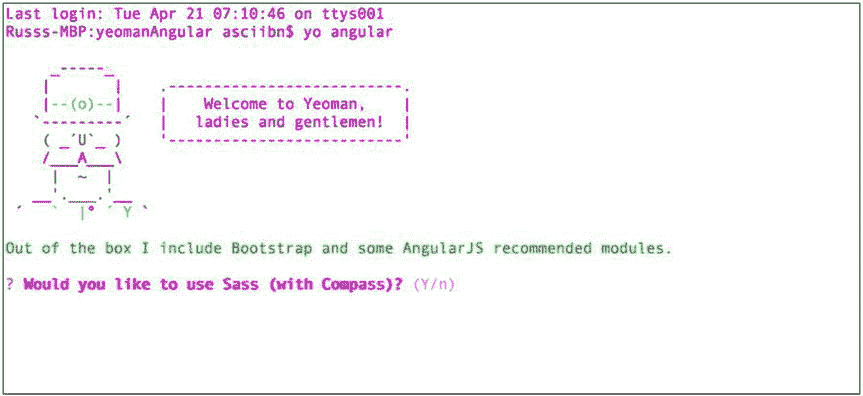
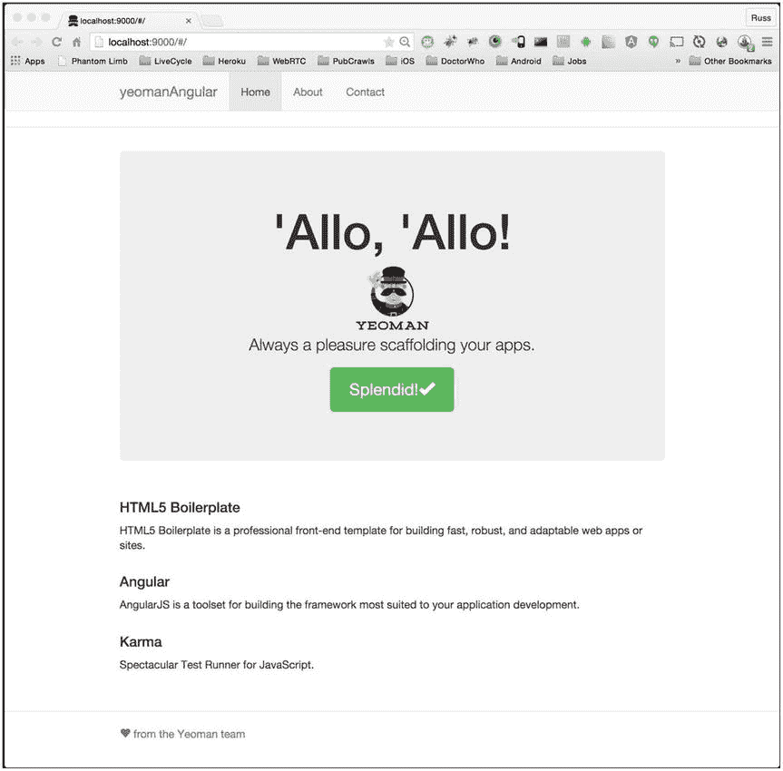
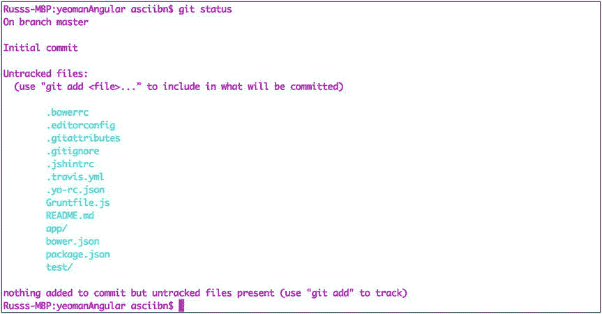
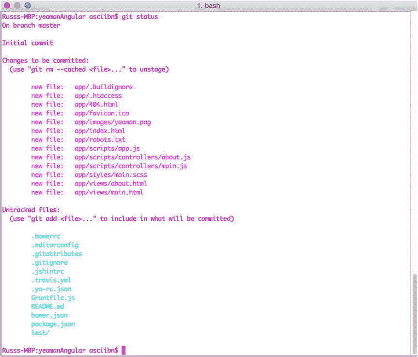
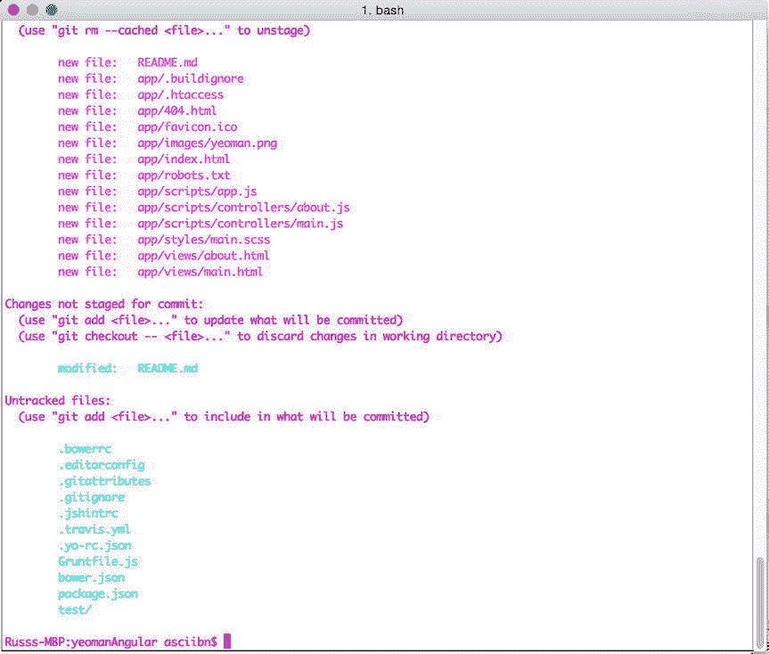
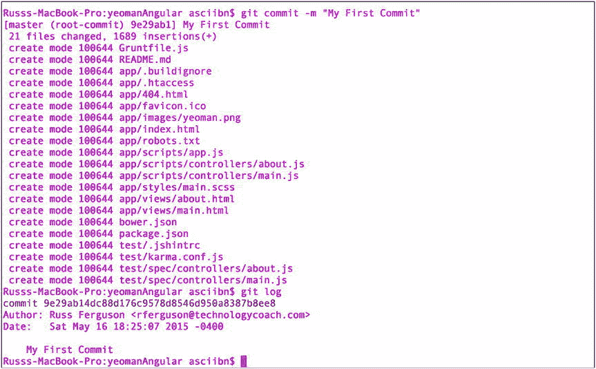

# 九、网站开发工具

多年来，开发网站的工具已经成熟。我们从使用记事本这样的简单编辑器发展到了 WebStorm 这样的全面开发环境。我们也有像 JQuery 这样的库。我们可以使用 Handlebars 作为模板引擎，AngularJS 作为完整的 MVC 框架。还有单元测试框架和版本控制系统来帮助我们更好更快地完成工作。那么现在我们有了所有这些可用的东西，我们如何把它们组织起来呢？

为了回答这个问题，我们将把它分成两部分。首先，我们将看看创建网站的工具，然后看看跟踪网站变化的工具。为了创建一个站点，我们将探索 Yeoman、Grunt 、Bower 和节点包管理器(NPM) 。为了跟踪变化，我们将使用 Git 。

所有这些工具都可以协同工作，所以让我们来分析一下每个工具的作用:

*   Bower 是一个包管理系统。它的目的是确保您的项目所依赖的所有客户端代码都已经下载并安装。地点:`http://bower.io/`
*   Grunt 就是所谓的构建工具。它允许您自动化许多类型的任务，包括单元测试、林挺(检查 JavaScript 错误)，以及将您的代码添加到版本控制中。它还可以用于将您的代码部署到服务器。地点:`http://gruntjs.com/`
*   约曼就是所谓的脚手架工具。它创建了创建项目的基本版本所需的文件和文件夹。然后，它使用 Bower 收集项目所依赖的所有代码。最后，它使用一个构建工具(比如 Grunt)来自动化任务。这是通过使用发电机来实现的。地点:`http://yeoman.io/`
*   节点包管理器(NPM) ，顾名思义，管理包。这些包运行在 Node.js 之上。随着 Node 变得越来越流行，其中一些包是为客户端开发而开发的，而不仅仅是服务器端，在服务器端使用 Node.js。地点:`https://nodejs.org/`
*   `Git`是一个版本控制系统。如果你听说过 Subversion 或 Perforce 这样的工具，Git 也是类似的。它会跟踪你处理的所有文件，并告诉你文件之间的区别。地点:`http://git-scm.com/`

搭建你的项目

计算机非常擅长做人们不想做的任务，它们可以一遍又一遍地做，而不会感到厌烦。没有人希望每次创建项目时都为图像、CSS 和 JavaScript 文件创建文件夹。有很多我们认为理所当然的小任务现在可以自动化。启动一个项目，只需一个命令就可以完成所有的文件夹，这不是很好吗？

这就是脚手架背后的理念。因为大多数网站都是以同样的方式组织的，所以没有必要手工设计结构。Yeoman 可以让你搭建任何你想要的网络项目。利用来自社区的最佳实践，Yeoman 使用发电机来快速方便地建立我们的项目。

生成器实际上是任何人都可以制作的模板。有一些团队赞助项目来创建“官方”发电机，但是如果那个不做你想要的事情，其他人可能已经做了一个。发电机也是开源的，所以你可以看看一个人的引擎盖下，看看它是如何制造的。为了使用 Yeoman，我们首先需要安装 Node.js。

NPM 是一切的基础

节点包管理器(NPM )让您能够管理应用中的依赖关系。这意味着，如果你的项目需要代码(比如说 JQuery)，NPM 可以很容易地添加到你的项目中。这也是我们将要安装的大多数工具在幕后运行的内容。NPM 是 Node.js 的一部分，node . js 是一个开源的跨平台环境，用于使用 JavaScript 制作服务器端应用。尽管我们不打算在这里创建 Node.js 项目，但我们确实需要安装`node`。有几种方法可以做到这一点；对于我们的例子，我们将尽量使它简单。

当你去`nodejs.org`的时候，网站会算出你用的是什么操作系统。单击安装按钮下载并运行安装程序。

安装完成后，您可以进入终端模式(Mac、Linux)或命令提示符(Windows)并输入`node –version`。您应该会看到当前版本的`node`显示在窗口中。

安装好之后，现在我们可以得到我们需要的一切。安装约曼时，键入`npm install –g yo`，对于咕噜型`npm install –g grunt-cli`，对于鲍尔型`npm install –g bower`。使用`-g`意味着安装将在全球范围内进行；创建新项目时，可以在任何文件夹中运行这些实用程序。`cli`代表命令行界面。在我们的练习中，我们将花时间在命令行上。习惯了是好事，值得努力。现在我们可以安装一个发电机，并开始寻找其他工具。

发电机

正如我们之前谈到的，生成器实际上是描述站点结构的模板。您可以通过向 Yeoman 传递不同的参数来调整这些模板。在`Yeoman.io`你可以找到一个生成器列表和 GitHub 库的链接。存储库有关于如何使用生成器的所有说明。例如，如果您想使用 AngularJS 创建一个站点，您可以输入

```js
npm install –g generator-angular
```

这将安装 AngularJS 发生器。如果您想要一个 AngularJS 站点，并且还想添加 Karma(一个 JavaScript 测试运行器)来帮助运行您的单元测试，安装应该是这样的:

```js
npm install –g generator-angular generator-karma
```

现在您已经安装了一个生成器，通过在命令行键入`yo`，您可以查看已安装的生成器列表并更新它们。从这里你也可以安装新的发电机。

此时，您应该为您的项目创建一个文件夹，当您在该文件夹中时，下一个命令应该是

```js
yo angular
```

约曼会开始问你关于你的应用的问题。比如它会问你是否愿意使用 Sass，如图[图 9-1](#Fig1) 所示。



[图 9-1](#_Fig1) 。约曼建立了一个 AngularJS 网站

您将被问及其他一些关于您希望如何设置项目的问题。一旦完成，Bower 将从 GitHub 获取您需要的所有库的最新版本，并为您一起搭建您的项目。安装好所有东西后，输入以下命令来查看站点的运行情况:

```js
grunt serve
```

这一次我们使用 Grunt 在你当前的文件夹中创建一个本地 web 服务器，并提供主页服务([图 9-2](#Fig2) )。



[图 9-2](#_Fig2) 。约曼在本地服务器上运行 AngularJS

这就是你需要做的。你现在已经有了一个可以运行的站点。这是将我们的代码置于版本控制中的好时机。

版本控制

变化是不断的。我们的文件被一遍又一遍地更新。当我们工作时，东西有时会坏掉。在某些情况下，简单的撤销就可以了。在其他时候，我们可能需要恢复到以前的状态，特别是在与团队合作并且有许多变化的时候。一个改变可能会破坏整个网站，并且很难找到问题所在。这就是版本控制非常有用的地方。

Git 是我们将要使用的版本控制系统。它很受欢迎，也有 GUI 客户端。正如我们对 Node.js 示例所做的那样，我们将采用最快的方式来安装它。为此，请转到`git-scm.com`下载并安装 Git。

安装完成后，您可以使用命令行对其进行配置。要添加您的身份，请键入`git config –global user.name "your name" and git config –global user.email` `your@email.com`。

现在您已经安装并配置了 Git，我们将快速添加文件，然后在本地提交它们。确保您位于项目文件夹中。在该文件夹中键入`git init`。这样就创建了一个. Git 文件夹，其中包含了项目的所有信息。此文件夹通常是不可见的，因此如果您想看到它，可能需要更改操作系统中的一些设置。接下来，让我们检查提交的状态。键入`git status`，您可以看到在这一点上，没有文件被添加到版本控制中([图 9-3](#Fig3) )。



[图 9-3](#_Fig3) 。文件尚未添加到 Git

添加文件、更新和首次提交

接下来我们添加文件，这样 Git 就可以跟踪它们。向存储库添加文件就像输入`git add file name/folder`一样简单。Git 将开始跟踪文件。在[图 9-4](#Fig4) 中，我们通过输入`git add app/`来添加应用文件夹。您可以再次检查状态并查看结果。



[图 9-4](#_Fig4) 。应用文件夹已经被添加到 Git

继续添加文件，尤其是`bower.json`和`package.json`。这些文件跟踪您的依赖模块以及这些模块的版本。`Gruntfile.js`会有你能运行的所有任务。我们之前通过输入`grunt serve`运行了一个任务。那个任务为我们运行一个本地服务器。

作为一个最佳实践，`node_modules`和`bower_components`文件夹不会被添加到版本控制中。您可以稍后使用`npm install`和`bower install`命令重新安装它们。

您不想添加到 Git 的文件在`.gitignore`文件中定义。您可以修改该文件，以包含文件类型或任何您希望 Git 忽略的内容。

我们讨论了文件如何随时间变化，所以你可能会问 Git 是如何知道文件何时发生变化的。首先，需要将文件添加到存储库中。我们用`git add`命令做到了。然后，当发生变化时，您可以再次请求状态。这将列出自上次添加以来已更改的所有文件。请记住，在进行更改之前，您需要 Git 了解该文件，这样就可以随时跟踪更改。在图 9-5 的[中，我们可以改变`README.md`文件来说明我们的观点。](#Fig5)



[图 9-5](#_Fig5) 。Git 可以看到文件何时被修改

文件更改后，您可以像以前一样再次添加它。下次您检查状态时，它将回到跟踪项目列表中。

现在 Git 已经跟踪了所有文件，可以提交所有文件了。将提交视为项目当前状态的快照(图 9-6 )。如果项目发生了任何事情，您总是可以恢复到上一个状态。



[图 9-6](#_Fig6) 。提交并显示在日志中的文件

要提交，请键入`git commit –m "notes about the commit"`。`–m`标志代表消息。或者，您可以使用文本编辑器来制作您的消息。如果你想查看信息的历史，你可以输入`git log`。

我们现在有一种方法来跟踪本地机器上的变化。如果你是一个孤独的开发者，这将会很好。

但是，如果您想要共享代码或与团队合作，您将需要添加一个服务器端组件。最流行的两个选项是 GitHub ( `https://github.com/`)和 bit bucket(`https://bitbucket.org/`)T2。使用这两个选项中的任何一个，除了本地机器上的文件之外，您还可以拥有一个远程存储库。

摘要

我们希望在读完这一章后，你会看到大量的资源可供你使用。使用 Yeoman generators 快速组合一个网站的能力，将为你在组合新项目时节省时间和精力。Yeoman 也可以作为一个学习工具来理解不同框架是如何工作的。

我们只是给出了 Git 的一个基本概述。这个主题本身就可以成为一本书。幸运的是，有斯科特·沙孔和本·施特劳布的 *Pro Git* 。在 Git 主页上也可以找到它的链接(`http://git-scm.com/` `)`)。它是在线的或者是一个数字文件。现在我们可以很快地把一个网站放在一起，让我们看看[第 10 章](10.html)中一个非常流行的框架 AngularJS。