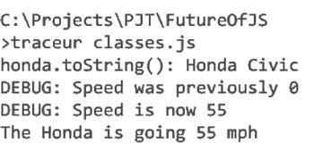
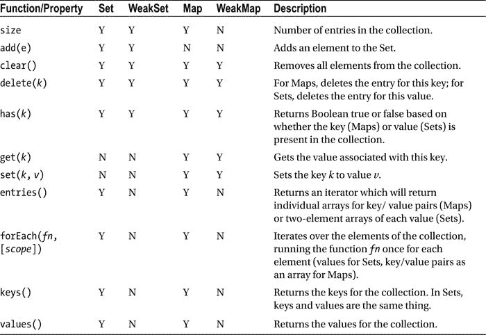

# 十一、JavaScript 的未来

在本书中，我们已经对 JavaScript 进行了相当深入的研究。很明显，JavaScript 是一种转型中的语言。JavaScript 最初只是一种玩具语言，现在已经上升到企业关键语言的水平。在这个过程中，接缝已经开始出现，坦率地说，变得有些松散。考虑到 JavaScript 的局限性，当来自更成熟语言的开发人员开始使用 JavaScript 时，他们通常会惊叹于我们所取得的成就。他们习惯于想知道这门语言是如何发展到今天的，以及它在未来是否会有所改进。

JavaScript 1995 年的“毕业班”拥有一些最耀眼的编程之光:Java、Ruby、PHP 甚至 ColdFusion 直到今天都是欣欣向荣的语言。很多开发者会说 JavaScript 的同学远远领先于 JavaScript。然而，他们中的许多人正在从 JavaScript 中寻找线索，看它对原型的使用，它作为一等公民的功能实现，它灵活的风格，以及更多作为他们自己新功能的灵感。

JavaScript 的未来会怎样？它从这里去哪里？值得庆幸的是，与我们自己模糊不清的未来不同，JavaScript 的未来有一个路线图，甚至还有一些不断发展的规范。到本书出版时，ECMAScript 6 很可能会成为一个完全被采用(如果不是完全实现)的标准。ECMAScript 7 已经在开发中，正在讨论中。套用一句老话，JavaScript 的未来看起来确实很光明。

让我们来看看 JavaScript 的未来。我们将讨论一下我们是如何走到这一步的，以及我们将向何处去，看看标准流程。然后，我们将看看在当前的工具集上使用 JavaScript 需要做些什么。但是这一章的大部分内容都是关于 ECMAScript 6 的细节:在接下来的几年里，你可能会用到的语言特性。我们甚至会暗示一些遥远的未来，可能会发生，也可能不会发生...

当然，我们没有足够的空间来讨论 ECMAScript 6 规范的全部内容。我们努力挑选更有用的、定义更好的和最有趣的特性来研究。

曾经和未来的 ECMAScript

我们应该从我们知道的开始。欧洲计算机制造商协会，现在被称为 Ecma 国际，是监督 JavaScript 所遵循的标准的机构。人们可以写本书来说明这是如何发生的，但这对我们 JavaScript 程序员的工作来说并不重要。重要的是 Ecma 内部的一个组织，技术委员会 39 (TC39 )，已经举起了 JavaScript 标准的大旗，并正在发布更新。也许更重要的事实是，各种计算机制造商、软件公司和其他利益相关者都受益于这一标准的成功。作为 JavaScript 社区，我们有一个可行的系统来指引语言的未来。这应该有助于消除我们过去忍受的一些敌意分歧，以及简化将 JavaScript 定位为有效的企业级语言的过程。

将 JavaScript 变成一个有效的和有效治理的标准的过程是漫长的。我们认为“标准”JavaScript 的大多数特性来自 ECMAScript 版本 3。这个版本来自 Ecma 还在追赶浏览器厂商的时代。尽管有人试图创建 ECMAScript 标准的第四个版本，但最终都被放弃了。第 3 版十年后，该标准的第 5 版于 2009 年发布。这旨在建立一个新的现状，赶上中间的变化，并澄清版本 3 中的许多模糊之处。该标准被广泛接受，并为 Ecma 恢复管理 JavaScript 标准的职责扫清了道路。

即使是现在，ECMAScript 版本 5 的广泛接受也不是必然的。Internet Explorer 9 是第一个实现该标准的 IE 版本。世界上很大一部分人仍然在使用 IE 8 和更早的版本。Ecma International 和 TC39 面临的挑战与其说是设定标准，不如说是一旦提供了标准，就让观众升级到这些标准。

对于版本 5 之后的下一步会是什么还有些困惑。最终采取了两条轨道:有一个 5.1 标准，它使 ECMAScript 符合国际标准化组织对 ECMAScript 的规范(这本身就是一个漫长而无聊的故事)。ECMAScript 标准将会有一个新的版本，版本 6，通常被称为 ECMAScript Harmony (这个名称来自于随着时间的推移而出现的各种提案，以协调 JavaScript、ECMAScript、JScript 等各种标准，以及 ECMAScript 版本 4 的原始代码名称)。

作为程序员，我们最感兴趣的是新标准以及它能让我们做什么。ES6/Harmony 提案应于 2015 年年中最终确定。所以，让我们把标准的世界抛在脑后，谈谈今天我们如何和谐地工作。

使用 ECMAScript 和声

ECMAScript 5 在成为法律上的标准之前，曾作为事实上的标准存在了很长时间，与 ECMAScript 5 不同，Harmony 是领先的，而不是跟随的。这意味着当前(在撰写本章时)对 Harmony 的实现参差不齐。我们需要一些工具来管理 Harmony 的各种实现状态。首先，我们需要资源来告诉我们哪些浏览器实现了和谐的哪些方面。第二，我们将看看如何在这些浏览器中实现和谐，第三，我们将研究一些软件工具，它们可以将我们的 ES6 代码转换成符合 ES5 的代码。之后，我们应该能够深入了解该标准的一些特性，这些特性要么被广泛使用，要么被广泛期待成为最终标准。

和声资源

TC39 维护一个 wiki，允许公众在`http://wiki.ecmascript.org/`跟踪和谐提案的状态。有两个页面特别有趣:需求/目标/方法页面和提议页面。需求页面列出了指导 ES6 开发的方法。虽然对我们理解语言并不重要，但它确实告诉我们为什么要做出某些决定，根据为 Harmony 项目定义的目标和方法。例如，Harmony 提出了适当的块范围，但是通过添加一个关键字(`let`)来实现它，而不是简单地重新定义 JavaScript 解释器的工作方式。提案本身遵循第一个目标的前两个要点:成为编写复杂应用和库的更好的语言。但是实现遵循第四个目标(保持版本控制尽可能简单和线性)以及第一个方法(最小化超出 ES5 所需的额外语义状态)。您可以在`http://wiki.ecmascript.org/doku.php?id=harmony:harmony`找到和谐项目的要求、目标和方法。

协调流程的另一个重要页面是提案页面。它跟踪为 ES6 提出的各种建议以及每个建议的状态。提案征集已于 2011 年截止，因此该页面不会有任何新增内容。在大多数情况下，您应该会看到现有的提议，偶尔还会看到从规范中删除的提议。您可以在`http://wiki.ecmascript.org/doku.php?id=harmony:proposals`找到提案页面。

规范作为参考文档是很棒的，但是它们有时缺乏实现细节。我们希望有一个参考，告诉我们跨浏览器和其他 JavaScript 引擎的 ES6 实现的状态。幸运的是，我们有两个这样的页面。最好的页面是由自称 kangax(jury Zaytsev)的著名 JavaScript 开发人员编写的，被称为 ECMAScript 6 兼容表 。可以在这里找到:`http://kangax.github.io/compat-table/es6/`。兼容性表按功能对 ES6 实施进行了细分，并对照大多数现代浏览器(桌面和移动)以及 Node.js 等其他 JavaScript 实施进行了检查。测试有些简单化，通常侧重于提案的存在，而不是其功能，也不是实施与提案的一致性。尽管如此，这是一个很好的起点。kangax 还维护了 ES5、即将到来的 ECMAScript 7 规范的兼容性表，以及非标准特性，如函数上的`__defineGetter__`或`caller`属性。

Thomas Lahn 还维护 ECMAScript 矩阵，该矩阵跟踪当前版本 JavaScript 引擎中 ECMAScript 标准的实现。你可以在`http://pointedears.de/es-matrix/`找到他的努力。Lahn 的方法和 kangax 的有些不同。Lahn 对当前的 JavaScript 引擎感兴趣，所以他只跟踪 JavaScript、V8 (Google Chrome 的引擎)、Opera 和其他一些引擎。相比之下，kangax 更加面向浏览器和软件。此外，Lahn 的 matrix 跟踪所有 ECMAScript，至少到第 6 版，所以你可以看到与数组和`for`循环一起评估的`let`关键字。他的方法更彻底，但也导致了更大的表(和加载页面更慢)。尽管如此，这和 kangax 的兼容性表一样，是专业 JavaScript 开发人员不可或缺的资源。

和谐地工作

浏览器可以在四种状态下使用 Harmony 特性。

*   浏览器，尤其是 evergreen Chrome 和 Firefox，可能已经有了一个现成的和谐特性的实现，不需要程序员的特别努力。不过，截至发稿时，很少有特性是这样工作的。
*   大多数浏览器会要求你“选择加入”使用 Harmony 特性。我们稍后会详细讨论这一点。
*   如果您的浏览器没有启用或实现某个功能(或者它没有正确实现！)，你可以考虑使用 transpiler，它可以让你编写 ES6 级别的代码，然后输出可以在你选择的引擎上运行的 ES5。
*   或者，您可以为 ECMAScript 6 中您想要使用的特定功能使用聚合填充。

显然，第一种状态几乎不需要解释，所以我们来谈谈第二种状态。Chrome 和 Firefox 在使用 ECMAScript 6 时都有自己的怪癖。

在 Chrome 中，你必须访问`chrome://flags` URL，这允许你启用实验性功能。具体来说，您需要启用`chrome://flags/#enable-javascript-harmony`。现在，请记住，这样做可能会改变 Chrome 在许多情况下的行为，并且可能会在 Chrome 呈现某些页面的方式上产生奇怪的结果。并且对`enable-javascript-harmony`状态的改变是持久的。相反，如果您希望只在特定会话启动时进行更改，可以使用`--javascript-harmony`开关从命令行运行 Chrome。此外，一些示例需要在严格模式下运行 JavaScript，这可以在代码级别进行管理。

对于 Firefox 来说，启动时不需要更改任何设置，但可能需要更改代码。一般来说，Firefox 会要求你给你的代码贴上不同于标准 JavaScript 的标签。将类型属性添加到脚本标签中，并将类型设置为`application/javascript;version=1.7`，这将启用大多数和声特性。如果运行 Harmony code 需要任何额外的更改，我们会用它们所支持的特定特性记录下来。

有趣的是，Internet Explorer 需要最少的配置来运行 ECMAScript 6 代码——“最少”是指“无”。另一方面，IE 10 只实现了规范中的四项。Internet Explorer 11 总共实现了规范中的 12 项，但远远落后于 Firefox 和 Chrome。可以说，IE 11 虽然实现的不多，但是实现的东西，做的很简单。

蒸发器〔??〕〔??〕

使用 ECMAScript 6 的第三个选项是一个 *transpiler* 。transpiler 将为 ECMAScript 6 编写的代码交叉编译成 ECMAScript 5 兼容的代码。有许多不同的传输工具。Addy Osmani 在 GitHub 上维护着一份 transpilers 和 polyfills 的清单。您可以在`https://github.com/addyosmani/es6-tools`查看列表。您可以从该链接中看到有许多 transpilers 和 polyfills。我们将演示使用 Traceur transpiler 获取一些 ECMAScript 6 代码，并在使用 ECMAScript 5 的浏览器中运行它。Traceur 是最受欢迎的 transpilers 之一，也是更新最频繁的。

使用 Traceur 最简单的方法是通过 Node.js 加载它。类似于我们在 JavaScript 工具一章中使用 Node 作为自己的 JavaScript VM 的方式，我们将在这里使用 Node 通过 NPM 加载额外的代码。从加载 Traceur 开始

```js
npm install traceur
```

这将安装当前版本为 0.0.72 的 Traceur transpiler。回想一下，如果希望 Traceur 在全球范围内可用，可以使用-g 选项。不管怎样，您可能需要更新您的`PATH`变量来包含 Traceur。在 Windows 上，在你的`node_modules`文件夹中你会发现下面的文件:`.bin\traceur.cmd`，这是一个用 Node.js 包装运行 Traceur 的 Windows 批处理文件，如果你把`node_modules\.bin`目录添加到你的`PATH`中，你应该可以直接运行 Traceur。通过运行`traceur--version`检查 Traceur 是否在您的路径上，如果找不到 Traceur，应该会返回版本号或错误消息。

您可以针对现有的 ES6 代码运行 Traceur。从命令行调用`traceur`，并作为参数传递一个包含 ES6 代码的 JavaScript 文件。(当然，你可以传递给它一个只有 ES5 代码的文件，但是这有什么意思呢？)Traceur 将运行您的代码，并将其输出到控制台。

考虑一个 JavaScript 中新的类语法的例子。很快，ES6 将允许您创建类，尽管代码只是围绕类型的函数风格的语法包装。该语法易于阅读和理解，所以让我们将它用于我们的 Traceur 示例，如清单 11-1 所示。

***清单 11-1*** 。带 Traceur 的 ECMAScript 6 类

```js
class Car {
  constructor( make, model ) {
    this.make = make;
    this.model = model;
    this.speed = 0;
  }

  drive( newSpeed ) {
    console.log( 'DEBUG: Speed was previously %d', this.speed );
    this.speed = newSpeed;
    console.log( 'DEBUG: Speed is now %d', this.speed );
  }

  brake() {
    this.speed = 0;
    console.log( 'DEBUG: Setting speed to 0' );
  }

  getSpeed() {
    return this.speed;
  }

  toString() {
    return this.make + ' ' + this.model;
  }
}

var honda = new Car( 'Honda', 'Civic' );
console.log( 'honda.toString(): %s', honda.toString() );
honda.drive( 55 );
console.log( 'The Honda is going %d mph', honda.getSpeed() );
```

如您所见，我们创建了一个类型，`Car`，并定义了三个属性(`make`、`model`和`speed`)以及一些方法，这些方法是属性的包装(`brake`、`drive`、`getSpeed`)或便利性(`toString`)。不要太疯狂。

这段代码不能在任何现代浏览器中运行。我们知道，因为我们测试过。此外，如果您查看 kangax 的兼容性表(截止到发布时)，您会发现这些类没有被任何主流浏览器实现。所以这段代码是试验 Traceur 的一个很好的选择。

如果您要将代码保存在一个文件中(实际上，在本章的文件夹中)，您可以使用 Traceur 运行它:

```js
traceur classes.js
```

您的输出将如下所示:



如您所见，Traceur 很好地处理了代码。在幕后，Traceur 将代码编译成 ES5，然后简单地使用 Node.js 本身运行代码。没什么大不了的。

但是浏览器呢？我们有两种不同的选择。我们可以使用 Traceur 生成在支持 ES5 的浏览器中运行的输出文件。或者，我们可以直接在浏览器中使用 ES6 代码，并让 Traceur 实时传输它。从传输输出开始。使用`--out`选项告诉 Traceur 将输出生成到您选择的文件中。输出文件不是独立文件。显然，你可以用 Traceur 运行它，但是你不能简单地把它包含到一个 HTML 页面中。您需要首先加载 Traceur 运行时，然后加载您想要运行的脚本。清单 11-2 是一个 Traceur HTML 外壳的例子。

***清单 11-2*** 。Traceur 的 HTML 外壳

```js
<!DOCTYPE html>
<html>
<head>
  <title>Traceur and classes</title>
</head>
<body>
<h2>Running Traceur output in the browser</h2>

<script src="../node_modules/traceur/bin/traceur-runtime.js"></script>
<script src="classes-es5.js"></script>
</body>
</html>
```

注意，我们正在从 Traceur 的 bin 文件中加载`traceur-runtime.js`文件。这个文件是运行 Traceur-trans filed 文件所需代码的精华。(目录中另一个大得多的文件是 Traceur 本身的代码。)加载清单 11-2 (在章节文件夹中作为`classes-es5.html`提供)在控制台上产生预期的结果。或许更重要的是，它对当前版本的 Firefox、Chrome 和 Internet Explorer 都非常适用。

如果您想直接使用 ECMAScript Harmony 代码，您总是可以让 Traceur 实时传输您的代码。我们可以使用来自清单 11-1 的原始和谐代码，并修改来自清单 11-2 的 HTML 外壳，如下所示:

```js
<script src="https://google.github.io/traceur-compiler/bin/traceur.js"></script>
<script src="https://google.github.io/traceur-compiler/src/bootstrap.js"></script>
<script src="classes.js" type="module"></script>
```

我们已经改用 Google 的 GitHub repository for Traceur，因为这是访问第二个文件最简单的方法:`bootstrap.js`。该文件不包括在 NPM 安装的 Traceur 中。它也不包括在 Traceur 的 Bower 安装中。所以我们就直接参考了。Bootstrap 允许您在 JavaScript 上下文中运行 Traceur。此外，我们现在将文件`classes.js`称为类型`module`。这是`bootstrap.js`的约定，它通过 Ajax 加载`classes.js`，作为一个明确的 ES6 文件。此外，`type`属性还有一个副作用，就是不会将引发错误的代码加载到浏览器中。或者，您可以简单地将 JavaScript ES6 代码包含在内联脚本块中，尽管您仍然需要将`type`属性设置为`module`。

虽然内联传输是一个有趣的实验，但我们不建议将其作为常规的开发或部署方式。这是每次加载页面时都要做的额外工作，这些工作可以通过传输到输出文件来完成。更不用说`traceur.js`加`bootstrap.js`加你的代码比`traceur-runtime.js`加你的代码下载量大得多。

多孔填料

最后，对于 ECMAScript 6 的某些方面，您可以将 polyfill 加载到页面中。这个解决方案的用例有点窄，但是应用要广泛得多。与使用 Traceur 等工具获得的整套 ECMAScript 6 不同，您可以通过使用 polyfills 专注于您想要的特性。但这是有代价的。对于 polyfill 来说，在字符串、数字和数组的原型上提供新的方法，或者实现 WeakMap 和 Set，这是很容易和合乎逻辑的。另一方面，polyfills 本质上不能替代语言特性，如`let`、`const`或箭头函数。因此，您可以使用聚合填充访问的和声功能集是有限的。

综上所述，对于可实现的 polyfills，有相当多的高质量实现。Addy Osmani 的 ES6 工具目录包含一个关于 ES6 polyfills 的部分。值得注意的是保罗·米勒的 ES6-Shim ( `https://github.com/paulmillr/es6-shim/`)，它有多种填充，可以用于和声的大多数方面。当我们在本章后面查看 ECMAScript 6 的特性列表时，我们会注意到 ES6-Shim 提供的那些特性。

ECMAScript 和谐语言功能

ECMAScript 6 引入了大量新的语言特性。这些特性填补了 JavaScript 中明显的盲点(块范围)，精简了语法以关注核心功能(箭头函数)，并扩展了 JavaScript 处理更复杂代码模式(类、模块和承诺)的能力。

以 block scope 为开头的例子。JavaScript 奇怪的作用域和提升方法(将变量和函数定义提升到局部作用域顶部的做法)多年来一直是新 JavaScript 程序员的绊脚石。这也是一种文化障碍:来自“真正”语言的程序员(不管这意味着什么)嘲笑 JavaScript，因为它缺乏块范围(或者类，或者这个，或者那个)。不管这种批评的实质是什么，它阻止了一些人来体验 JavaScript 的优点。所以，让我们解决这个问题，继续前进。

`let`关键字允许你将变量作用于任意块。范围为`let`的变量不会被提升。这是`let`和`var`的两个关键区别。可以说，以`let`为作用域的变量的行为方式与大多数局部变量的行为方式相同(而以`var`为作用域的变量有一些有趣的特性/功能)。如果您试图访问其块之外的`let`范围的变量，您会得到一个 ReferenceError，就像您试图访问一个不可访问的`var`范围的变量一样。没有比这更复杂的了。当你想要块作用域时，用`let`代替`var`。

作为`let`的伴侣，还有`const`，它允许你声明一个常量值变量。对于用`const`声明的变量，你应该在声明时初始化，否则有什么意义呢？以后您将无法更改该变量的值！像`let`，`const`变量没有被提升，它们的作用域是声明它们的块。尝试访问`const`变量的语义因浏览器而异。如果您试图修改一个声明为`const`的变量，您的浏览器要么会无声地失败，要么会抛出某种类型的错误。常量使某些代码能够被编译成更快的代码，因为 JavaScript 引擎知道它们永远不会改变。此外，当与我们将在本章后面看到的一些集合配对时，你可以使用常量来存储一个类的私有数据。详见`http://fitzgeraldnick.com/weblog/53/`。

箭头功能

ECMAScript 6 中的另一类改进是引入了简化某些声明的语法变化。这些变化之一是箭头功能。箭头函数为定义函数提供了一个更短的语法，尤其是内嵌函数。考虑以下代码:

```js
var numbers = [1, 2, 3, 4, 5, 6, 7, 8, 9];
numbers.forEach(function(num) {
  // Do something with the number here
});
```

它并不笨拙，但是有点冗长。JavaScript 有一个独特的挑战:在不编译代码的同时，尽量减少文字代码的长度。使用关键字`function`来定义函数对带宽来说并不轻松。而且我们用的功能越多，就要用到`function`这个词的次数越多。如果有更短的函数语法就好了。

受 CoffeeScript 的启发，TC39 引入了一个关于箭头函数的提议，或者更明确地说，是箭头定义的函数。前面的例子可以这样写:

```js
var numbers = [1, 2, 3, 4, 5, 6, 7, 8, 9];
numbers.forEach(num => {
  // Do something with the number here
});
```

更优雅，不是吗？以下是语法的关键部分:

```js
arguments => { code }
()        => { code } // No arguments
i         => { code } // One argument
(i, j)    => { code } // multiple arguments
```

为了指定函数体，你可以用一组花括号把多行代码括起来，或者，如果你只有一行代码，你可以把它留空。因此

```js
x => x * 2
```

相当于

```js
function(x) {
  return x * 2;
}
```

箭头功能和常规或标准功能有一些不同。首先，箭头函数总是绑定到定义它们的上下文中。这听起来很复杂。你可能遇到过这样的问题:

```js
var courseAssignments = {
  teacher : 'Stephen Duffy',
  canTeach: function(courses) {
    courses.forEach( function ( course ) {
      console.log( 'Ask %s if he can teach %s', this.teacher, course );
    });
  }
};

courseAssignments.canTeach(['Greek', 'Latin', 'Theology', 'History']);
```

当您运行这段代码时，您将看到如下输出:

```js
Ask undefined if he can teach Greek
```

显然不是我们想要的。`forEach`函数中`this`的上下文和值指回`canTeach()`函数，而非`courseAssignments`对象。通常问题是这样修复的:

```js
var courseAssignments = {
  teacher : 'Stephen Duffy',
  canTeach: function(courses) {
    var that = this; // Store the context of canTeach
    courses.forEach( function ( course ) {
      console.log( 'Ask %s if he can teach %s', that.teacher, course );
    });
  }
};

courseAssignments.canTeach(['Greek', 'Latin', 'Theology', 'History']);
```

注意粗体的代码，它强调了在`canTeach`级别存储`this`上下文的策略，而不是在 f `orEach`中。

箭头函数极大地简化了这种情况。它们会自动绑定到适当的上下文。您可以将前面的代码重写为

```js
var courseAssignments = {
  teacher : 'Stephen Duffy',
  canTeach: function(courses) {
    courses.forEach( course => console.log( 'Ask %s if he can teach %s', this.teacher, course ) );
  }
};

courseAssignments.canTeach(['Greek', 'Latin', 'Theology', 'History']);
```

有了箭头函数，`this.teacher`自动绑定到`canTeach`中`this`的上下文中，这正是我们一直想要的。太棒了！

箭头函数还有两个不同之处。箭头函数不能用作构造函数。他们缺乏这样做的内部代码。箭头功能也不支持`arguments`对象。这很好，因为 ECMAScript 6 还定义并允许参数默认值和 rest 参数，所以我们不再需要依赖函数中的`arguments`对象。

类别

ECMAScript 6 中最大的语法变化之一是引入了类。关键字`class`从一开始就被 JavaScript 所保留。但背后并没有执行。随着面向对象 JavaScript 的兴起，TC39 承认 JavaScript 需要一种更加语法清晰的方式来实现类和继承。与此同时，没有人希望添加另一种方法来实现类型、类或类似类的东西。这个想法是为了简化和减轻混乱，而不是制造更多的混乱。

ECMAScript 6:ECMAScript Harmony 规范决定使用`class`关键字作为语法糖来实现基于函数的类型。如果这听起来有点奇怪，实际情况是这样的:

*   您基于新的 ES6 语法编写了一个 JavaScript 类。
*   JavaScript 引擎将其编译成定义类型的函数。
*   你与类的交互方式和你与类型的交互方式是一样的。

所以与类/类型及其实例交互的语义没有改变。定义类/类型的许多语义也是一样的。让我们回到前面的例子来了解更多细节。回想一下我们如何在 JavaScript 中定义一个类:

```js
class [*classname*] {
  constructor(*arg1*, *arg2*) { ... }
  [*other methods*]
}
```

用`class`关键字定义类。包括一个名为`constructor`的函数。这是稍后调用`new [classname]`时将被调用的函数。根据需要提供其他方法。其他方法将被复制到被定义为构造函数的函数原型上。相当漂亮！

类还将拥有 JavaScript 面向对象方面渴望已久的两个关键特性:简单继承和超级访问器。继承可以通过`extends`关键字获得:

```js
class Car extends Vehicle
```

在子类中，您可以使用`super`作为超类的方法和属性的访问器。与某些语言(例如 Java)不同，ECMAScript 6 不允许将`super`作为方法本身调用。相反，它保存对超类的引用，类似于`this`保存对当前实例的引用。

不幸的是，在当前任何主流浏览器中，类都没有被实现。类规范将是 2015 年发布的 ECMAScript 6 最终规范的一部分，似乎浏览器制造商正在等待最终规范，以确保他们的实现不会出错。同时，Traceur transpiler 对类的处理相当不错，包括`extends`和`super`。

承诺

当我们讨论 Ajax 时，我们讨论了基于 Ajax 的系统的一个问题:代码流。当涉及异步返回结果的函数时，很难编写相关代码。很长一段时间，没有具体、直接的解决方案。大多数程序员要么编写了很长的回调函数(反过来，这可能调用了他们自己的异步函数，使事情变得复杂！)或使用命名函数，但在调用堆栈中反复使用。(且不说这种方法引入了另一个并发症；有许多命名函数。你用一个模块来管理它们吗？只是一个命名空间？)异步运行代码是 JavaScript 特性列表的核心，因此我们需要一种更好的方式来管理异步交互。输入承诺。

一个*承诺*就是，一种帮助管理异步返回代码的模式。它封装了代码，并添加了一个管理层，有点事件处理的味道。我们可以用 promise 注册代码，不管它成功返回还是不成功返回，都应该运行。当承诺完成时，运行适当的代码。我们可以注册任意数量的函数在成功或失败时运行(非常像事件处理)，我们可以在任何时候注册一个处理程序(无论承诺是否完成；非常不像事件处理)。

让我们进行一次承诺的技术演练，以阐明特性的操作，如清单 11-3 所示。概括地说，承诺有两种状态:待定或已确定。该承诺是挂起的，直到它所包装的异步调用返回、超时或以其他方式结束。在这一点上，承诺是解决。被解决的状态有两种味道(如果你愿意的话):解决和拒绝。已解决的承诺成功解决，被拒绝的承诺未成功解决。因为承诺是任意的(从技术上讲，它们甚至不需要异步代码！)，拒绝或者解决的定义真的由你自己决定。

***清单 11-3*** 。承诺

```js
var p = new Promise( function(resolve, reject) {
  // Do some things here, maybe some Ajax work?

  setTimeout(function() {
    var result = 10 * 5;

    if (result === 50) {
      resolve(50);
    } else {
      reject( new Error( 'Bad math, mate' ) );
    }
  }, 1000);

});

p.then(function(result) {
  console.log( 'Resolved with a value of %d', result );

});

p.catch(function(err) {
  console.error( 'Something went horribly wrong.' );
});
```

诚然，这有点做作，但它仍然是一些异步代码的一个很好的简单示例。问题的核心是对`setTimeout`的调用。当然，我们计划稍后执行的函数除了运行一个数学方程之外什么也不做。关键部分是对`resolve`和`reject`的调用。`resolve`函数告诉承诺消费者承诺已经解决(成功完成)。并且`reject`函数对未成功结算的承诺做同样的事情。请注意，在这两种情况下，我们也在传递一个值。该值将是消费者在处理解决方案或拒绝的函数中收到的内容。

我们这里也有一些消耗承诺的代码。注意`then`和`catch`的使用。可以把它们想象成“onSuccess”和“onFailure”事件处理器。严格来说，`then`的签名是`Promise.then(onSuccess, onFailure)`。所以你可以直接给`then`打电话。不过，就风格而言，单独调用`catch`来处理出现的任何错误要清楚得多。

真正聪明的一点是，我们已经把承诺的处理和承诺的状态分开了。也就是说，我们可以调用`p.then`(或`p.catch`)任意多次，不管承诺的状态如何。如果我们仍然在 1000 毫秒内完成承诺，那么用`p.then`注册的代码将被添加到堆栈中，以便在承诺完成时调用。如果我们超过了 1000 毫秒的时间周期(很可能是这样)，代码将立即执行。您可以想象 promise 实现中的一些伪代码是这样工作的:

```js
function then(onSuccess, onFailure) {
  if (this.state === "pending") {
    addSuccessStack(onSuccess);
    addFailureStack(onFailure);
  } else if (this.state === "settled") {
    if (this.settledState === "success") {
      onSuccess();
    } else {
      onFailure();
    }
  }
}
```

实际的实现有更多的细节，我们不会在这里深入讨论。尽管如此，这是一个有用的近似，它描述了当您注册代码以便在承诺实现时运行时，承诺内部会发生什么。

承诺是管理异步代码的标准 ECMAScript 6 方式。事实上，许多 JavaScript 库已经在使用 promises 来管理 Ajax、动画和其他典型的异步交互。正如我们将在下一节中看到的，我们将需要拥有并理解使用模块的和谐实现的承诺。

如果你想同时履行承诺，有多种选择。Traceur 理解承诺，并在内部使用它们来实现模块(和一些其他功能)。像 jQuery、Angular 和其他一些库都有自己的 promises 实现，尽管与官方规范有一些不同。jQuery 尤其如此，所以要小心。ES6-Shim 包含一个 promise 实现，Kris Kowal 的优秀 Q 库有一个实现 ES6 API 的 Q.Promise 类型。

我们在这里的轻量级讨论只触及了承诺的许诺)。除了 API 和类型之外，还有更多。网上有很多关于承诺的精彩文章，但是如果你打算从某个地方开始，考虑一下 Jake Archibald 的这篇 HTML5Rocks 文章。

模块

等等，我们以前没见过模块吗？嗯，是的，说到，比如说，RequireJS，你可以说 AMD(异步模块定义)模块。如果你在 Node.js 的世界里，你可能会想到 CommonJS 模块。ECMAScript 6 标准试图将这两种不同风格的模块解析成一种语法。这多少是成功的。不可避免地，双方都会有抱怨。但是通过使用两种标准的某些方面，TC39 为程序员提供了一条清晰的道路。如果你想坚持使用 AMD 风格的模块，或者更喜欢 CommonJS 风格的模块，有人最终会写一个 transpiler...可能是你。

话虽如此，让我们看看 ES6 模块的实现。我们不会花时间将 ES6 模块与 AMD 或 CommonJS 模块进行比较和对比。这是另一本书的另一个章节的练习(或者亚历克斯·劳施迈尔的一篇出色的博客文章:`http://www.2ality.com/2014/09/es6-modules-final.html`)。相反，我们将与模块一起工作，看看它们为我们提供了什么。

模块背后的想法很简单:我们想要一个安全的、封装的名称空间，在其中我们可以定义数据和功能。然后，根据我们的判断，我们可以提供部分或全部数据和功能。可重用性是模块的主要用途，它允许我们定义一次功能，然后在任何需要的地方使用它。清单 11-4 显示了模块是如何实现这些需求的。

***清单 11-4*** 。一个模块定义

```js
export const schoolName = 'Mickey Kullen Memorial High School';
export const firstSport = 'Basketball';

export function getPrincipal() {
  // Probably a call to a server in the real world
  return 'Jason Franzke';
}

export function fgPct(shots, baskets) {
  return baskets / shots;
}
```

正如你所看到的，我们通过关键字为模块导出了公共 API。当在逐个成员的基础上使用`export`时，我们可以导出常量、常规变量和函数。如果我们愿意，我们可以将所有导出列为文件的最后一行(甚至在此过程中更改它们的名称！):

```js
export {schoolName, firstSport, getPrincipal, fgPct};
export {schoolName as name, firstSport as sport ... };
```

您还可以将模块的单个成员设置为默认导出。不出所料，这个成员标有`default`关键字，如下所示:

```js
export default function () { ... };
export default 'foo';
```

您可以混合使用默认成员和命名成员，尽管这在您以后导入这些成员时会使事情变得复杂。

有这么多选择，我们应该选择哪一个？选一个管用的！但是如果你在寻找专家指导，ES6 设计过程中不可或缺的一部分 Dave Herman 建议使用默认的单一导出模块。在这一点上有很多讨论，许多人反对，或者至少表达了不同的偏好。这是 JavaScript:选择适合您需求的风格。

当使用一个模块时，我们有两种方式与它交互:声明式和编程式。清单 11-5 中的所示的声明性语法简单明了。

***清单 11-5*** 。以声明方式使用模块

```js
import * as school from 'test-module';
console.log('The principal of %s is %s.', school.schoolName, school.getPrincipal());
```

关键字`import`允许你定义模块的哪个部分被导入到哪个名称空间。模块名与文件名相同，只是去掉了扩展名`.js`。路径是允许的，所以`foo/bar`会在相对于当前文件位置的`foo`目录下找到`bar.js`。

`import`命令非常灵活，因为您可以导入任意多或任意少的模块:

```js
// Imports 'schoolName' only
import schoolName from 'test-module';

// Imports both of these named members
import {schoolName, getPrincipal} from 'test-module;

// Imports the default exports
import someDefault from 'test-module';

// Imports the default, plus a named member; DOES NOT WORK IN TRACEUR
import someDef {schoolName} from 'test-module';

// Imports the entire module, the default function/variable/whatever is
// available as default
import * as school from 'test-module';
console.log(s.default()); // Executes the function exported as a default
```

模块是异步加载的。在执行任何代码之前，您的浏览器将等待所有模块都已加载。如果你想更好地控制这个过程(或者喜欢不同的语法)，你可以使用模块导入的编程风格。

***清单 11-6*** 。程序化导入

```js
System.import( 'test-module' )
  .then( school => {
    console.log('The principal of %s is %s.', school.schoolName, school.getPrincipal());
  } )
  .catch( error => {
    console.error( 'Something has gone horribly wrong.' );
  } );
```

基础模块的语法不会改变。相反，如果您想将特定代码绑定到特定模块的加载或执行，我们有一个基于承诺的语法来加载模块。(我们使用新的 arrow 函数语法只是为了好玩！)使用该语法还可以做什么的细节比这里的篇幅所允许的要复杂得多。简单地说，如果你想要或者需要的话，你将对你的模块的加载和运行有广泛的控制权。

有几种用于模块的多孔填料可供选择。除了一两个例外，Traceur 在模块方面做得还不错。ES6-Tools 页面保持对其他几个包的更新，包括一个名为 ES6 Module Loader Polyfill ( `https://github.com/ModuleLoader/es6-module-loader`)的包。请注意，ES6-Shim 没有模块聚合填充。

类型扩展

ECMAScript 的最后一类变化是对现有类型的改进。其中一些变化使 JavaScript 中长期可用的特性形式化，比如字符串类型上的 HTML 函数等等。其中一些是不言自明的，但其他人可以使用一些澄清，这就是我们在这里提供的！

字符串

这组字符串函数应该从`String`的实例中调用。换句话说，它们在`String.prototype`可用。首先是 HTML 函数:`anchor`、`big`、`bold`、`fixed`、`fontcolor`、`fontsize`、`italics`、`link`、`small`、`strike`、`sub`和`sup`。每一个都接受`String`实例，并返回一个包装在适当标签中的副本。各种浏览器可能会增加或减少这个组(例如，Chrome 有一个`blink`功能)。

还有一些字符串实用函数:

| `String.prototype.startsWith(`*str* | 字符串是否以提供的子字符串开头？ |
| `String.prototype.endsWith(`*str* | 字符串是否以提供的子字符串结尾？ |
| `String.prototype.contains(`*str*`, [`*startPos*`])` | 字符串是否包含提供的子字符串？ |
| `String.prototype.repeat(` *计数* `)` | 生成一个新字符串，它是对`String`的重复`count`次。 |

数字

Number 类型获得了几个静态方法，其中大多数用于确定传递的参数的特征。

| `Number.isNaN(num)` | *num* 是一个数字吗？取代了有一些问题的全局`isNaN function`。 |
| `Number.isFinite(num)` | `num`有限吗？正负无穷大、NaN、非数都不是有限的。 |
| `Number.isInteger(num)` | 数字是整数吗？NaN 不是整数，也不是任何非数字的东西。 |
| `Number.isSafeInteger(num)` | 这个数是否可以安全地表示为 IEEE-754 双精度数，并且没有其他 IEEE-754 双精度数舍入到这个数？ |
| `Number.parseInt(` *弦* `, [` *根* `])` | 替换全局`parseInt()`；最好提供基数，因为这可以改善实现差异。 |
| `Number.parseFloat(` *弦* `)` | 替换全局`parseFloat()`。 |

数学

数学工具库 扩展了一些有用的函数。其中大部分比我们在这里讨论的时间更深奥，但这里有一个简短的列表:

| `Math.imul(`*x*??*y* | 返回两个参数的类 C 32 位乘法的结果。 |
| `Math.clz32(` *在* `)`中 | 返回数字的 32 位二进制表示形式中前导零的位数。 |
| `Math.fround(` *在* `)`中 | 返回数字的最接近的单精度浮点表示形式。 |
| `Math.log10(` *在* `)`中 | 返回一个数以 10 为底的对数。 |
| `Math.log2(` *在* `)`中 | 返回一个数的以 2 为底的对数。 |
| `Math.log1p(` *在* `)`中 | 返回 1 +一个数字的自然对数(以 e 为底)。 |
| `Math.expm1(`*x* | 返回 e *x* - 1，其中 *x* 是自变量，e 是自然对数的底数。 |
| `Math.cosh(` *在* `)`中 | 返回一个数字的双曲余弦值。 |
| `Math.sinh(` *在* `)`中 | 返回一个数字的双曲正弦值。 |
| `Math.tanh(` *在* `)`中 | 返回一个数字的双曲正切值。 |
| `Math.acosh(` *在* `)`中 | 返回一个数字的双曲反余弦值。 |
| `Math.asinh(` *在* `)`中 | 返回一个数字的双曲反正弦值。 |
| `Math.atanh(` *在* `)`中 | 返回一个数字的双曲反正切值。 |
| `Math.hypot([`*`,`*`,`*`, ...])``, ...])`*** | 返回其参数平方和的平方根。 |
| `Math.trunc(` *在* `)`中 | 通过删除任何小数来返回一个数的整数部分。它不舍入任何数字。 |
| `Math.sign(` *在* `)`中 | 返回数字的符号，可以是正数、负数或零。 |
| `Math.cbrt(` *在* `)`中 | 返回一个数的立方根。 |

数组

在数组的世界里发生了许多新的事情。我们先来看函数。第一个是简单的效用函数:`Array.from()`，在数组类型上静态可用。它接受类似数组的对象，或者可迭代对象，并将它们转换成数组(为您提供数组的所有功能和特性)。想想函数内部的`arguments`，或者`document.querySelectorAll`的返回值，它们都像数组，但是缺少数组的许多特性。现在，您可以动态地将 iterables 转换为数组。

数组还获得了三个新的工具来迭代它们的内容:`keys`、`values`和`entries`。您可能会推断出，`keys`给出了数组的索引，`values`给出了值的索引，`entries`给出了由每个数组条目的键和值组成的数组。有一点不同的是，这是通过迭代器完成的。也就是说，不是获取所有的值，而是在经过它们时看到单个的元素。这对于动态数组、更好的内存管理、数组搜索等非常有用。

为了搜索数组，我们已经有了`Array.prototype.indexOf`函数。但是如果你想测试简单等式之外的东西，你可以使用`Array.prototype.find`和`Array.prototype.findIndex`。两者都接受一个谓词函数的参数和一个可选的运行上下文。谓词函数很像`forEach`、`map`等的谓词函数，它接受元素、索引和对原始代码的引用的参数。清单 11-7 显示了一个例子。

***清单 11-7*** 。使用`Array.prototype.find()`

```js
var names = ['John', 'Jon', 'José', 'Joseph', 'Mike',
  'Andre', 'Melanie', 'Jaymi', 'Kathy', 'Jennifer'];

names.find( function ( element, index ) {
  if ( element.startsWith( 'J' ) ) {
    console.log( 'The name %s at position %d starts with "J"!', element, index );
  }
} );
```

最后，还有`Array.prototype.fill` ，它允许你用值填充一个数组，可选地传入开始和结束位置。

数组还有一个更重要的改进:操作符`spread`。长期以来，JavaScript 程序员一直希望能够将数组作为函数的参数“展开”。在 ECMAScript 5 中，没有办法做到这一点，尽管您可以使用`Function.prototype.apply`，它接受一个数组并将其作为参数传播给被调用的函数。至少可以说，这是笨拙和不清楚的。现在，您可以使用 spread 运算符:

```js
[1, 2, 3].push(...[4, 5, 6]) 
[1, 2, 3, 4, 5, 6]
```

不错吧。在许多方面，这使得`push`、`pop`、`shift`和`unshift`更加强大，并且使得`splice`和`concat`更加专业化。

多孔填料

Traceur transpiler 不支持这些标准类型的扩展。一般来说，Traceur 关注的是新的语法变化，而不是现有类型的扩展。

另一方面，ES6-shim 支持所有这些特性。在 Addy Osmani 的 ES6 工具页面上，您可以找到大多数这些函数的 polyfills，通常按函数或类型分类。

新集合类型

JavaScript 因缺乏集合实现而遭受损失。在 ECMAScript Harmony 之前，您对原生数据结构的唯一选择是数组和对象。这并不理想。ECMAScript 6 引入了 Set、WeakSet、Map 和 WeakMap 作为新的数据结构。从最基本的方面来说，这些都是 JavaScript 的一个新的集合 API。将来，您应该能够将 JavaScript 集合想象成 Map、WeakMap、Set、WeakSet 和 Array，让对象只作为对象工作，而不是同时作为 Map/关联数组。

先说这些对象的非弱版本。映射是一组键和值。键可以是任何原语或对象值，值也可以是。这些显然是为了取代作为数据结构的对象。有一些关键的区别:

*   对象的键总是字符串，而地图的键可以是任何数据类型。
*   地图有大小的属性，而物体没有；换句话说，你必须手动追踪物体的大小，而地图会自动追踪。
*   对象有原型。严格地说，地图也有原型，但是地图实例不像对象实例那样有原型。这很重要，因为对象有默认的键，而贴图没有。

集合是保证唯一性的数组。根据`===`(三重等于)，集合项目必须是唯一的。可以按插入顺序从集合中检索数据。通过将数组作为参数传递给 Set 构造函数，可以从数组创建集合。在跨浏览器 ECMAScript 中将集合转换成数组并不容易，但是如果需要的话，您可以使用`for...of`或`Set.prototype.forEach`遍历集合中的元素，并将单个元素推送到数组中。

最新版本的 Firefox 和 Chrome 都支持这些新集合。Internet Explorer 具有对地图、WeakMap 和 Set 的“基本”支持(虽然不是 WeakSet！).这意味着 IE 知道这个类型，并且实现了它的一部分，但是不允许你使用`new Map(iterable)`来创建 Map 的一个实例。但是您可以创建空地图、集合和 WeakMaps，然后通过适当的 API 调用向它们添加元素。据`status.modern.ie`报道，IE 的下一个版本有望提供全面支持。

那太弱了

那么 WeakSet 和 WeakMap 是怎么回事？要理解这些，您必须对 JavaScript 垃圾收集有一点了解。通常，当对象的引用计数为零时，该对象可用于垃圾收集。这意味着没有对正在讨论的对象的现存引用:没有变量、没有键、没有值、没有条目等等。地图和集合中的条目算作参考。

假设您创建了一个对复杂对象的引用，并将其存储在一个变量中。稍后，您还将该引用隐藏在一个集合中。在函数或代码段返回之前，您释放了变量，将其设置为 null。很好，对吧？全部清理干净！没那么快。集合中的条目保持不变，并且您的对象不适合垃圾收集，直到您将它从集合中移除(或者释放整个集合！).

输入武器集和武器地图。在弱集合的情况下，对象引用被弱地持有。这意味着集合中保存的实例不计入总引用数。这种提法站不住脚。如果对该对象的所有其他引用都已被释放，则该对象可用于垃圾回收。这对于内存管理来说非常有用，但是如果你指望这个引用一直存在的话，就有点棘手了。

弱映射的相似之处在于它们的键被弱控制，就像集合中的条目被弱控制一样。此外，WeakMap 中的键只能是对象，而不是原型。与常规地图不同，WeakMaps 的键不能被迭代，因为由于潜在的垃圾收集，它们的状态是不确定的。您必须自己维护一个键的列表，如果您想访问它，可能是一个数组。

收款 API

各种集合实现共享一个公共 API。不是所有的函数都可以在所有的集合中找到，但是大多数函数是由两个或更多的集合类共享的。



多填充物

与 JavaScript 类型的扩展一样，Traceur 没有实现这些特性的 ES5 编译。这是多填充物的领域。如前所述，ES6-Shim polyfill 具有符合 ES5 的 Map、Set、WeakMap 和 WeakSet 实现。还有 harmony-collections poly fill(`https://github.com/Benvie/harmony-collections`)，它只实现 Map、Set、WeakMap 和 WeakSet。

但是请记住，虽然 polyfill 可以模仿 API，但是它不能复制 WeakMaps 和 WeakSets 的一个关键特性:弱保存引用，这样它们就不会计入垃圾收集的总引用计数中。这只能通过修改 JavaScript 引擎来实现。它只能模拟 WeakMap 的行为，而与垃圾收集器没有实际关系，因此可以释放弱持有的引用。

摘要

在这一章中，我们试图给你一个关于 ECMAScript 6 中 JavaScript 的一些新特性的概述。在这样做的时候，我们必然忽略了大量的规范。在 2015 年的某个时候，该规范将进入最终形式，并且 APress 将提供几本涵盖该材料的书籍。

与此同时，我们已经把重点放在了改善 JavaScript 的一些更令人讨厌的怪癖的工具上(想想这里的箭头函数)。我们还介绍了如何使用许多程序员现在正在使用的一些特性(承诺、类、模块)。我们对 JavaScript 的未来感到非常兴奋。随着 ECMAScript 6 在本书出版时得到很好的定义，我们期待着 ECMAScript 7，TC39 已经开始着手开发了！