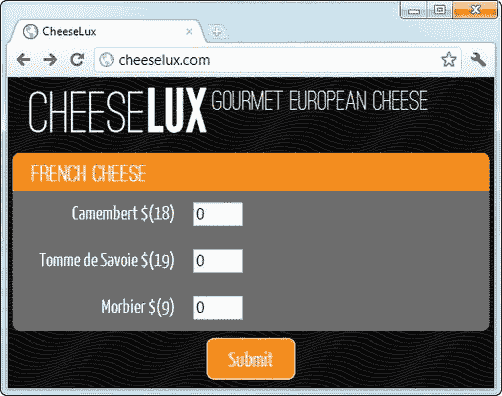
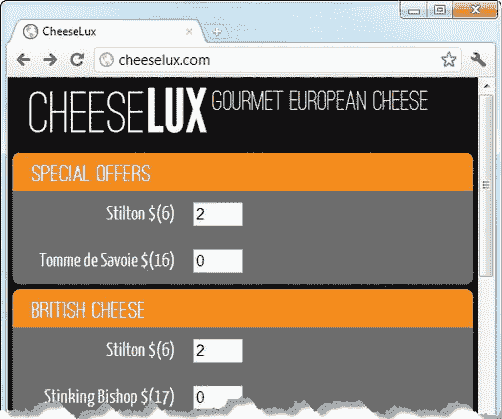
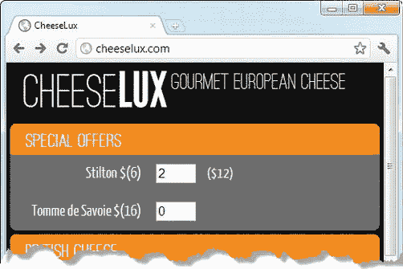
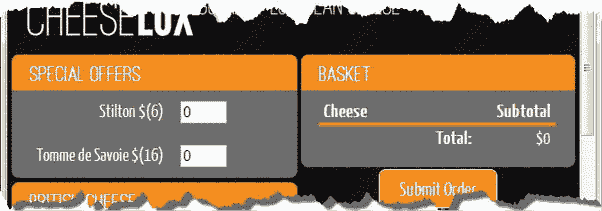
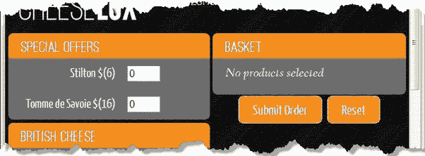

# 三、添加视图模型

如果你做过任何严肃的桌面或服务器端开发，你会遇到*模型-视图-控制器* (MVC)设计模式或者它的衍生*模型-视图-视图-模型* (MVVM)。我不打算详细描述这两种模式，只想说这两种模式的核心概念都是将应用的数据、操作和表示分离成独立的组件。

将相同的基本原则应用于 web 应用有很多好处。我不会陷入设计模式和术语中。相反，我将重点演示构建 web 应用的过程，并解释这样做的好处。

### 重置示例

理解如何应用视图模型以及这样做所带来的好处的最好方法就是简单地去做。要做的第一件事是把应用中除了基础的东西都删掉，这样我就有了一个全新的开始。正如你在清单 3-1 中看到的，除了文档的基本结构，我已经删除了所有内容。

*清单 3-1。擦石板*

`<!DOCTYPE html>
<html>
<head>
    <title>CheeseLux</title>
    <link rel="stylesheet" type="text/css" href="styles.css"/>
    
    
    <link rel="stylesheet" type="text/css" href="jquery-ui-1.8.16.custom.css"/>
    <noscript>
        <meta http-equiv="refresh" content="0; noscript.html"/>
    </noscript>
    
</head>
<body>` `    

        
            Gourmet European Cheese
    

    <form action="/shipping" method="post">

        

            <input type="submit" />
        

    </form>
</body>
</html>`

### 创建视图模型

下一步是定义一些数据，这将是视图模型的基础。首先，我添加了一个描述奶酪店产品的对象，如清单 3-2 所示。

*清单 3-2。向文档添加数据*

``

我创建了一个包含奶酪产品详细信息的对象，并将其分配给一个名为`cheeseModel`的变量。该对象描述了我在第二章中使用的相同产品，并且是我的视图模型的基础，我将在这一章中构建它；现在它是一个简单的数据对象，但是我很快会用它做更多的事情。

提示如果你发现自己盯着闪烁的光标，不知道如何定义你的应用数据，那么我的建议很简单:开始输入。采用视图模型的最大好处之一是它使更改变得更容易，这包括对底层数据结构的更改。如果你做得不对也不要担心，因为你以后总是可以改正的。

#### 采用视图模型库

遵循不编写好的 JavaScript 库中可用内容的原则，我将使用视图模型库将视图模型引入 web 应用。我要用的这个叫做击倒。我喜欢应用结构的 KO 方法，KO 的主要程序员是 Steve Sanderson，他是我的合著者，也是来自 Apress 的*Pro ASP.NET MVC*一书的作者，是一个全面的好人。要获得 KO，请转到`[`knockoutjs.com`](http://knockoutjs.com)`并点击下载链接。从文件列表中选择最新的版本(在我撰写本文时是 2.0.0 ),并将其复制到 Node.js `content`目录。

 **提示**如果你和 KO 处不好也不用担心。其他结构库是可用的。主要竞争来自于骨干(`[`documentcloud.github.com/backbone`](http://documentcloud.github.com/backbone)`)和 AngularJS ( `[`angularjs.org`](http://angularjs.org)`)。这些备选库中的实现细节可能有所不同，但基本原理是相同的。

在接下来的小节中，我将把我的视图模型和视图模型库放在一起，以分离示例应用的各个部分。

#### 从视图模型生成内容

首先，我将使用数据在文档中生成元素，以便向用户显示产品。这是对视图模型的简单使用，但它再现了第二章中实现的基本功能，并为本章的其余部分打下了良好的基础。清单 3-3 显示了将 KO 库添加到文档中，并从数据中生成元素。

*清单 3-3。从视图模型生成元素*

`<!DOCTYPE html>
<html>
<head>
    <title>CheeseLux</title>
    <link rel="stylesheet" type="text/css" href="styles.css"/>
    
    
    ****
    <link rel="stylesheet" type="text/css" href="jquery-ui-1.8.16.custom.css"/>
    <noscript>
        <meta http-equiv="refresh" content="0; noscript.html"/>
    </noscript>
    
</head>
<body>
    

        
            Gourmet European Cheese
    

    <form action="/shipping" method="post">
        

**            

**

**            
**
**                
**
**                    <label data-bind="attr: {for: id}" class="cheesename">**
**                        **
**                         $()</label>**
**                    <input data-bind="attr: {name: id}" value="0"/>**
**                
**
**            
**
        

        

            <input type="submit" />
        

    </form>
</body>
</html>`

这个清单中有三组附加内容。第一个是用一个`script`元素将 KO JavaScript 库导入到文档中。第二个附加项告诉 KO 使用我的视图模型对象:

`ko.applyBindings(cheeseModel);`

`ko`对象是 KO 库功能的网关，`applyBindings`方法将视图模型对象作为参数，顾名思义，使用它来完成文档中定义的*绑定*；这是第三组新增内容。你可以在图 3-1 中看到这些绑定的结果，我将在接下来的章节中解释它们是如何工作的。

*图 3-1。从视图模型创建内容*

##### 了解值绑定

绑定的*值是视图模型中的属性和 HTML 元素之间的关系。这是现有的最简单的绑定方式。下面是一个具有值绑定的 HTML 元素的示例:*

`

`

所有 KO 绑定都是使用`data-bind`属性定义的。这是一个`text`绑定的例子，它将 HTML 元素的文本内容设置为指定的视图模型属性的值，在本例中是`category`属性。

当调用`applyBindings`方法时，KO 搜索绑定并将适当的数据值插入到文档中，像这样转换元素:

`
**French Cheese**
`

 **提示**我喜欢在将要应用 KO 数据绑定的元素中定义它们，但是有些人不喜欢这种方法。有一个简单的库支持*不显眼的* KO 数据绑定，这意味着绑定是在`script`元素中使用 jQuery 建立的。您可以在`[`gist.github.com/1006808`](https://gist.github.com/1006808)`获取代码并查看示例。

我在这个例子中使用的另一个绑定是`attr`，它将元素属性的值设置为模型中的一个属性。下面是清单中的一个`attr`绑定示例:

`<input **data-bind="attr: {name: id}"** value="0"/>`

该绑定指定 KO 应该为`name`属性插入`id`属性的值，这在应用绑定时会产生以下结果:

`<input data-bind="attr: {name: id}" value="0" **name="camembert"**>`

KO 值绑定不支持任何格式或值的组合。事实上，值绑定*只是将单个值插入到文档中，这意味着通常需要额外的元素作为值绑定的目标。您可以在清单中的`label`元素中看到这一点，这里我添加了几个`span`元素:*

`<label data-bind="attr: {for: id}" class="cheesename">
**    ** $(****)
</label>`

我想插入两个数据值作为`label`元素的内容，并用一些环绕的字符来表示货币。获得想要的效果的方法很简单，尽管它给 HTML 结构增加了一些复杂性。另一种方法是创建*自定义绑定*，我会在第四章的中解释。

 **提示**`text`和`attr`绑定是最有用的，但是 KO 也支持其他类型的值绑定:`visible`、`html`、`css`和`style`。我在本章后面使用了`visible`绑定，在第四章的中使用了`css`绑定，但是你应该在`knockoutjs.com`查阅 KO 文档以了解其他的细节。

##### 了解流控制绑定

*流控制绑定*提供了使用视图模型来控制文档中包含哪些元素的方法。在清单中，我使用了`foreach`绑定来枚举`items`视图模型属性。`foreach`绑定用于视图模型属性，这些属性是数组，并为数组中的每一项复制子元素集:

`

    ...

`

子元素上的值绑定可以引用单个数组项的属性，这就是我能够为`input`元素上的`attr`绑定指定`id`属性的原因:KO 知道正在处理哪个数组项，并从该项插入适当的值。

 **提示**除了`foreach`绑定之外，KO 还支持`if`、`ifnot`和`with`绑定，这些绑定允许有选择地在文档中包含或排除内容。我将在本章的后面描述`if`和`ifnot`绑定，但是你应该在`knockoutjs.com`查阅 KO 文档以获得完整的细节。

### 利用视图模型

现在我已经有了应用的基本结构，我可以使用视图模型和 KO 做更多的事情。我将从一些基本特性开始，然后逐步向您展示一些更高级的技术。

#### 向视图模型添加更多产品

视图模型带来的第一个好处是能够更快地进行更改，并且错误更少。这方面最简单的演示就是向奶酪店目录中添加更多的产品。清单 3-4 显示了添加来自其他国家的奶酪所需的更改。

*清单 3-4。添加到视图模型*

`<!DOCTYPE html>
<html>
<head>
    <title>CheeseLux</title>
    <link rel="stylesheet" type="text/css" href="styles.css"/>
    
    
    
    <link rel="stylesheet" type="text/css" href="jquery-ui-1.8.16.custom.css"/>
    <noscript>
        <meta http-equiv="refresh" content="0; noscript.html"/>
    </noscript>
    
</head>
<body>
    

        
            Gourmet European Cheese
    

    <form action="/shipping" method="post">

**        
**
            

                

                

                    

                        <label data-bind="attr: {for: id}" class="cheesename">
                            
                             $()</label>
                        <input data-bind="attr: {name: id}" value="0"/>
                    

                

            

**        
**

        

            <input type="submit" />
        

    </form>
</body>
</html>`

最大的变化是视图模型本身。我改变了数据对象的结构，使得每个产品类别都是分配给`products`属性的数组中的一个元素(当然，我添加了两个新类别)。就 HTML 内容而言，我只需添加一个`foreach`流控制绑定，这样每个类别中包含的元素都是重复的。

 **提示**这些添加的结果是一个又长又细的 HTML 文档。这不是显示数据的理想方式，但正如我在《??》第一章中所说，这是一本关于高级编程的书，而不是一本关于设计的书。有很多方法可以更有效地呈现这些数据，我建议从查看 UI 工具包(如 jQuery UI 或 jQuery Tools)提供的选项卡小部件开始。

#### 创建可观察的数据项

在前面的例子中，我像使用简单的模板引擎一样使用 KO；我从视图模型中获取值，并使用它们来生成一组元素。我喜欢使用模板引擎，因为它们简化了标记，减少了错误。但是当你创建*可观察的数据项*时，视图模型带来了更大的好处。简而言之，可观察的数据项是视图模型中的一个属性，当它被更新时，会导致所有绑定到该属性的值的 HTML 元素也被更新。清单 3-5 展示了如何创建和使用一个可观察的数据项。

*清单 3-5。创建可观察的数据项*

`<!DOCTYPE html>
<html>
<head>
    <title>CheeseLux</title>
    <link rel="stylesheet" type="text/css" href="styles.css"/>
    
    
    
    <link rel="stylesheet" type="text/css" href="jquery-ui-1.8.16.custom.css"/>
    <noscript>
        <meta http-equiv="refresh" content="0; noscript.html"/>
    </noscript>
    
</head>
<body>
    

        
            Gourmet European Cheese
    

    <form action="/shipping" method="post">
**        
**
**            <input id="discount" type="button" value="Apply Discount" />**
**        
**

        

            

                

                

                    

                        <label data-bind="attr: {for: id}" class="cheesename">
                            
                             $()</label>
                        <input data-bind="attr: {name: id}" value="0"/>
                    

                

            

        
` `        

            <input type="submit" />
        

    </form>
</body>
</html>`

`mapProducts`函数是一个简单的工具，它允许我对每个单独的奶酪产品应用一个函数。这个函数使用 jQuery `each`方法，该方法为数组中的每一项执行一个函数。通过使用两次`each`函数，我可以到达每个类别中奶酪产品的内部数组。

在这个例子中，我已经将每个奶酪产品的`price`属性转换成一个可观察的数据项，如下所示:

`mapProducts(function(item) {
    item.price = **ko.observable(item.price);**
});`

`ko.observable`方法将数据项的初始值作为其参数，并设置将更新传播到文档中的绑定所需的管道。我不必对绑定本身做任何更改；KO 为我处理所有的细节。

剩下的就是创造一个环境，让改变发生。我在文档中添加了一个新按钮，并为`click`事件定义了一个处理程序，如下所示:

`$('#discount').click(function() {
    mapProducts(function(item) {
**        item.price(item.price() - 2);**
    });
});`

当单击按钮时，我使用`mapProducts`函数来更改视图模型中每个 cheese 对象的 price 属性值。由于这是一个可观察的数据项，新的值将被推送到值绑定，并导致文档被更新。

注意我在修改值时使用的稍微奇怪的语法。最初的 price 属性是一个 JavaScript `Number`，这意味着我可以像这样更改值:

`item.price -= 2;`

但是`ko.observable`方法将属性转换成 JavaScript 函数，以便与一些旧版本的 Internet Explorer 一起工作。这意味着通过调用函数(换句话说，通过调用`item.price()`)读取可观察数据项的值，并通过向函数传递一个参数(换句话说，通过调用`item.price(newValue)`)更新该值。这可能需要一点时间来适应，我仍然会忘记这样做。

图 3-2 显示了可观测数据项的效果。当点击应用折扣按钮时，显示给用户的所有价格都被更新，如图图 3-2 所示。

*图 3-2。使用可观测的数据项*

可观察数据项的能力和灵活性非常重要；它创建了一个应用，在该应用中，视图模式的更改(无论它们是如何发生的)都会导致文档中的数据绑定立即更新。正如你将在本章的其余部分看到的，当我向示例 web 应用添加更复杂的特性时，我使用了大量可观察的数据项。

#### 创建双向绑定

一个*双向绑定*是一个`form`元素和一个可观察数据项之间的双向关系。当视图模型更新时，元素中显示的值也会更新，就像常规的可观察对象一样。此外，改变元素值会导致向*其他*方向的更新:视图模型中的属性被更新。因此，例如，如果我对一个`input`元素使用双向绑定，KO 确保当用户输入一个新值时模型被更新。通过使用多个元素和同一个模型属性之间的双向关系，您可以轻松地使复杂的 web 应用保持同步和一致。

为了演示双向绑定，我将向 cheese shop 添加一个特价商品部分。这让我可以从完整的部分中挑选一些产品，应用折扣，理想情况下，将客户的注意力吸引到他们可能不会考虑的产品上。

清单 3-6 包含了对 web 应用的更改，以支持特殊优惠。为了建立双向绑定，我将做另外两件有趣的事情:扩展视图模型和使用 KO *模板*生成元素。我将在清单后面的小节中解释这三个变化。

*清单 3-6。使用动态绑定创建特别优惠*

`<!DOCTYPE html>
<html>
<head>
    <title>CheeseLux</title>
    <link rel="stylesheet" type="text/css" href="styles.css"/>
    
    
    
    <link rel="stylesheet" type="text/css" href="jquery-ui-1.8.16.custom.css"/>
    <noscript>
        <meta http-equiv="refresh" content="0; noscript.html"/>
    </noscript>
    
**    **
</head>
<body>
    

        
            Gourmet European Cheese
    

**    

**
    <form action="/shipping" method="post">
**        

**
        

            <input type="submit" />
        

    </form>
</body>
</html>`

##### 扩展视图模型

JavaScript 的松散类型和动态特性使其非常适合创建灵活且适应性强的视图模型。我喜欢能够获取初始数据并重塑它，以创建更符合 web 应用需求的东西，在这种情况下，添加对特殊优惠的支持。首先，我向视图模型添加了一个名为`specials`的`property`，将其定义为一个对象，该对象与模型的其余部分一样具有`category`和`items`属性，但添加了一些有用的内容:

`cheeseModel.specials = {
    category: "Special Offers",
    **discount: 3,**
    **ids: ["stilton", "tomme"],**
    items: []
};`

属性`discount`指定了我希望应用于特价商品的美元折扣，属性`ids`包含了将成为特价商品的产品 id 数组。

当我第一次定义数组时，它是空的。为了填充数组，我枚举了`products`数组来查找那些在`specials.ids`数组中的产品，如下所示:

`mapProducts(function(item) {
**    if ($.inArray(item.id, cheeseModel.specials.ids) > -1) {**
**        item.price -= cheeseModel.specials.discount;**
**        cheeseModel.specials.items.push(item);**
**    }**
    item.quantity = ko.observable(0);
});`

我使用`inArray`方法来确定迭代中的当前项目是否是将作为特价商品包含的项目之一。`inArray`方法是另一个 jQuery 工具，如果某项包含在数组中，它将返回该项的索引，如果不包含在数组中，则返回`-1`。对于我来说，这是一种快速简单的方法，可以查看当前商品是否是我感兴趣的特价商品。

如果某个商品*在特价商品列表上是*，那么我将`price`属性的值减少`discount`的数量，并使用`push`方法将该商品插入到`specials.items`数组中。

`item.price -= cheeseModel.specials.discount;
cheeseModel.specials.items.push(item);`

在我遍历了视图模型中的商品之后，`specials.item`数组包含了一组完整的要打折的商品，在此过程中，我降低了它们的价格。

在这个例子中，我将`quantity`属性变成了一个可观察的数据项:

`item.quantity = ko.observable(0);`

这很重要，因为我将为特价商品显示多个`input`元素:一个元素在原始奶酪类别中，另一个在新的`Special Offers`类别中，我将在下一节中解释。通过在`input`元素上使用一个可观察的数据项和双向绑定，我可以很容易地确保输入的奶酪数量得到一致的显示，而不管使用的是哪个`input`元素。

##### 生成内容

现在剩下的工作就是从视图模型中生成内容。我想为特价商品和普通商品生成相同的元素集，所以我使用了 KO *模板*特性，它允许我在文档中的多个点生成相同的元素集。下面是清单中的模板:

``

模板包含在一个`script`元素中。`type`属性被设置为`text/html`，这阻止浏览器将内容作为 JavaScript 执行。模板中的大多数绑定与我在前面的例子中使用的`text`和`attr`绑定相同。对`input`元素的重要添加如下:

`<input data-bind=**"attr: {name: id}, value: quantity"**/>`

这个元素的`data-bind`属性定义了两个绑定，用逗号分隔。第一个是常规的`attr`绑定，但是第二个是`value`绑定，这是 KO 定义的双向绑定之一。我不必采取任何行动来使`value`绑定双向；KO 会自动处理。在这个清单中，我创建了一个到`quantity`可观察数据项的双向绑定。

我使用`template`绑定从模板生成内容。当使用模板时，KO 复制它所包含的元素，并将它们作为具有`template`绑定的元素的子元素插入。文档中有两点我使用了模板，它们略有不同:

`**

**
<form action="/shipping" method="post">
**    

**

    

        <input type="submit" />
    

</form>`

当使用`template`绑定时，`name`属性指定模板元素的`id`属性值。如果您只想生成一组元素，那么您可以使用`data`属性来指定将使用哪个视图模型属性。我使用`data`来指定清单中的`specials`属性，这为我的特价产品创建了一个内容部分。

 **提示**您必须记住用引号将模板元素的`id`括起来。如果不这样做，KO 将会悄悄地失败，而不会从模板生成元素。

如果想为数组中的每一项生成一组元素，可以使用`foreach`属性。我已经通过指定`products`数组为常规产品类别完成了这项工作。这样，我可以将模板应用于数组中的每个元素，以一致地生成内容。

 **提示**注意，特价元素被插入到了`form`元素的外部。特价产品的`input`元素将具有与常规产品类别中相应的`input`元素相同的`name`属性值。通过在`form`之外插入特价元素，我可以防止在提交表单时向服务器发送重复的条目。

##### 查看结果

既然我已经解释了我为设置双向绑定所做的每一个改变，是时候看看结果了，你可以在图 3-3 中看到。

*图 3-3。扩展视图模型、创建动态绑定和使用模板的结果*

这很好地展示了使用视图模型可以节省时间和减少错误。我对特价产品应用了 3 美元的折扣，这是通过修改视图模型中的属性`price`的值来实现的。尽管`price`属性是不可见的，视图模型和模板的结合确保了在最初生成元素时整个文档中显示正确的价格。(您可以看到两个`Stilton`列表的价格都是 6 美元，而不是视图模型最初指定的 9 美元。)

双向绑定是这个例子中最有趣和最有用的特性。所有的`input`元素都与它们对应的`quantity`属性有双向绑定，并且由于在文档中有两个`input`元素用于每种特价奶酪，在其中一个元素中输入一个值将会使立即在另一个元素中显示该值；您可以在图中看到`Stilton`产品发生了这种情况(但这种效果最好通过在浏览器中加载示例来体验)。

因此，只需很少的努力，我就可以增强视图模型，并使用这些增强来保持表单的一致性和响应性，同时为应用添加新的特性。在下一节中，我将在这些增强的基础上创建一个动态篮子，向您展示视图模型带来的其他一些好处。

 **提示**如果您将此表单提交给服务器，订单摘要将显示原始的未打折价格。当然，这是因为我只在浏览器中应用了折扣。在一个实际的应用中，服务器也需要知道特别的优惠，但是我将跳过这一点，因为这本书关注的是客户端开发。

### 添加动态购物篮

既然我已经解释并演示了如何使用值和双向绑定来检测和传播更改，我可以完成这个示例，这样用户就可以使用第二章中的所有功能。这意味着我需要实现一个动态购物篮，我将在接下来的小节中实现它。

#### 添加小计

使用视图模型，可以快速添加新功能。虽然我需要使用一些额外的 KO 特性，但是添加每一项小计的更改非常简单。首先，我需要增强视图模型。清单 3-7 突出显示了对`mapProduct`函数的调用中`script`元素的变化。

*清单 3-7。扩展视图模型以支持小计*

`...
mapProducts(function(item) {
    if ($.inArray(item.id, cheeseModel.specials.ids) > -1) {
        item.price -= cheeseModel.specials.discount;
        cheeseModel.specials.items.push(item);
    }
    item.quantity = ko.observable(0);
    **item.subtotal = ko.computed(function() {**
        **return this.quantity() * this.price;**
    **}, item);**

});
...`

我已经为`subtotal`属性创建了所谓的*计算可观测数据项*。这就像一个常规的可观察项，只是值是由一个函数产生的，该函数作为第一个参数传递给`ko.computed`方法。第二种方法在函数执行时用作`this`变量的值；我已经将它设置为`item`循环变量。

这个特性的好处是 KO 管理所有的依赖项，这样当我的计算出的可观察函数依赖于一个常规的可观察数据项时，对常规项的改变会自动触发计算值的更新。在本章的后面，我将使用这个行为来管理总的总数。

接下来，我需要添加一些绑定到模板的元素，如清单 3-8 所示。

*清单 3-8。向模板添加元素以支持小计*

``

内部的`span`元素使用一个`text`数据绑定来显示我刚才创建的`subtotal`属性的值。更有趣的是，外层的`span`元素使用了另一个 KO 绑定；这一个是`visible`。对于这个绑定，当指定的属性为 *false-like* ( `zero`、`null`、`undefined`或`false`)时，子元素被隐藏。对于*真值*值(`1`、`true`或非`null`对象或数组)，显示子元素。我已经为`visible`绑定指定了`subtotal`值，这个小技巧意味着只有当用户在`input`元素中输入非零值时，我才会显示小计。你可以在图 3-4 中看到结果。

*图 3-4。选择性显示小计*

您可以看到，一旦将基本结构添加到应用中，创建新功能是多么简单快捷。一些新的标记和一点点脚本大有帮助。此外，小计功能可以与特别优惠无缝协作；因为两者都在视图模型上操作，所以应用于特价的折扣无缝地(并且毫不费力地)合并到小计中。

#### 添加购物篮行项目和合计

我不想使用我在第二章中采用的内嵌购物篮方法，因为有些产品会显示两次，而且文档太长，用户无法向下滚动以查看其选择的总成本。相反，我将创建一个单独的购物篮元素集，它将与产品一起显示。你可以在图 3-5 中看到我所做的。

*图 3-5。添加单独的购物篮*

清单 3-9 显示了支持购物篮所需的变更。

*清单 3-9。添加购物篮元素和行项目*

`<!DOCTYPE html>
<html>
<head>
    <title>CheeseLux</title>
    <link rel="stylesheet" type="text/css" href="styles.css"/>
    
    ` `
    <link rel="stylesheet" type="text/css" href="jquery-ui-1.8.16.custom.css"/>
    <noscript>
        <meta http-equiv="refresh" content="0; noscript.html"/>
    </noscript>
    
    
**    **
</head>
<body>
    

        ` `        Gourmet European Cheese
    

**    
**
**        
Basket
**
**        
**
**            <table id="basketTable">**
**                <thead><tr><th>Cheese</th><th>Subtotal</th><th></th></tr></thead>**
**                <tbody data-bind="foreach: products">**
**                    <!-- ko template: {name: 'basketRowTmpl', foreach: items} -->**
**                    <!-- /ko -->**
**                </tbody>**
**                <tfoot>**
**                    <tr><td class="sumline" colspan=2></td></tr>**
**                    <tr>**
**                        <th>Total:</th><td>$</td>**
**                    </tr>**
**                </tfoot>**
**            </table>**
**        
**
**        

**

**        
**
**            <input type="submit" value="Submit Order"/>**
**        
**
**    
**

    

    <form action="/shipping" method="post">
        

    </form>
</body>
</html>`

我将逐一介绍我所做的每一类改变，并解释其效果。当我这样做的时候，请思考一下添加这个特性只需要做很少的改变。同样，视图模型和一些基本的应用结构创建了一个基础，可以快速方便地添加新特性。

##### 扩展视图模型

清单中对视图模型的更改是添加了`total`属性，这是一个计算出来的可观察值，它将各个`subtotal`值相加:

`cheeseModel.total = ko.computed(function() {
    var total = 0;
    mapProducts(function(elem) {
        total += elem.subtotal();
    });
    return total;
});`

正如我之前提到的，KO 自动跟踪可观察数据项之间的依赖关系。对`subtotal`值的任何更改都将导致 total 被重新计算，新值将显示在与其绑定的元素中。

##### 添加购物篮结构和模板

我添加到文档中的 HTML 元素的外部结构只是一个奶酪类别的副本，以保持视觉一致性。篮子的核心是`table`元素，它包含几个数据绑定:

`<table id="basketTable">
    <thead><tr><th>Cheese</th><th>Subtotal</th><th></th></tr></thead>
**    <tbody data-bind="foreach: products">**
**        <!-- ko template: {name: 'basketRowTmpl', foreach: items} -->**
**        <!-- /ko -->**
**    </tbody>**
    <tfoot>
        <tr><td class="sumline" colspan=2></td></tr>
        <tr>
            <th>Total:</th><td>$</td>
        </tr>
    </tfoot>
</table>`

这里最重要的补充是格式奇怪的 HTML 注释。这就是所谓的*无容器绑定*，它允许我应用`template`绑定，而不需要为将要复制的内容提供容器元素。从嵌套数组向表中添加行是这种技术的理想情况，因为添加一个元素以便应用绑定会导致布局问题。无容器绑定包含在常规的`foreach`绑定中，但是您可以像嵌套常规元素一样嵌套绑定注释。

另一个绑定是一个简单的`text`值绑定，它使用我刚才创建的计算出的`total`可观察值显示篮子的总数。我不必采取任何措施来确保总数是最新的；KO 管理视图模型中的`total`、`subtotal`和`quantity`属性之间的依赖链。

我添加来生成`table`行的模板有四个数据绑定:

``

您以前见过这些类型的绑定。在`tr`元素上的`visible`绑定确保表行只对那些`quantity`不为零的奶酪可见；这可以防止购物篮中塞满用户不感兴趣的产品。

注意`tr`元素上的`attr`绑定。我已经使用 HTML5 `data`属性特性定义了一个定制属性，该特性将行所代表的产品的`id`值嵌入到`tr`元素中。我将很快解释我为什么这样做。

我还移动了`submit`按钮，使其位于购物篮下方，方便用户提交订单。我分配给篮子元素的样式使用 CSS `position`属性的`fixed`值，这意味着篮子总是可见的，即使用户向下滚动页面。为了适应这个篮子，我使用 jQuery 将 CSS `width`属性的一个新值直接应用到 cheese category 元素(而不是篮子本身):

`$('div.cheesegroup').not("#basket").css("width", "50%");`

##### 从购物篮中移除项目

最后一组更改基于添加到`basketRowTmpl`模板中每个表格行的`a`元素:

`$('#basketTable a')
    .button({icons: {primary: "ui-icon-closethick"}, text: false})
    .click(function() {
        var targetId = $(this).closest('tr').attr("data-prodId");
        mapProducts(function(item) {
            if (item.id == targetId) {
                item.quantity(0);
            }
        });
    })`

我使用 jQuery 选择所有的`a`元素，并使用 jQuery UI 从它们创建按钮。jQuery UI 主题包括一组图标，我传递给 jQuery UI `button`方法的对象创建了一个按钮，该按钮使用这些图像中的一个，并且不显示任何文本。这给了我一个漂亮的小十字按钮。

在`click`函数中，我使用 jQuery 从触发`click`事件的`a`元素导航到使用`closest`方法的第一个祖先`tr`元素。这将选择包含自定义`data`属性的`tr`元素，该属性是我之前插入到模板中并使用`attr`方法读取的:

`var targetId = $(this).closest('tr').attr("data-prodId");`

这个语句让我确定用户想要从购物篮中移除的产品的`id`。然后我使用`mapProducts`函数找到匹配的奶酪对象，并将`quantity`设置为零。由于`quantity`是一个可观察的数据项，KO 传播新的值，这使得`subtotal`值被重新计算，并且相应的`tr`元素上的`visible`绑定被重新评估。由于`quantity`为零，表格行将自动隐藏。并且，因为`subtotal`是可观察的，所以`total`也将被重新计算，并且新的值被显示给用户。如您所见，拥有一个无缝管理数据值之间依赖关系的视图模型是非常有用的。最终结果是一个动态的篮子，它总是与视图模型中的值一致，因此总是向用户提供正确的信息。

#### 完成示例

在我结束这个话题之前，我想调整一些事情。首先，当用户没有选择任何项目时，购物篮看起来很差，如图图 3-6 所示。为了解决这个问题，我将在购物篮为空时显示一些占位符文本。

*图 3-6。空篮子*

第二，用户没有办法通过一个单一的动作清空购物篮，所以我将添加一个按钮，将所有产品的数量重置为零。最后，通过将`submit`按钮移到`form`元素之外，我已经失去了依赖默认动作的能力。我必须添加一个事件处理程序，以便用户可以提交表单。清单 3-10 显示了我为支持这些特性而添加的 HTML 元素。

*清单 3-10。添加元素以完成示例*

`...
<body>
    

        
        Gourmet European Cheese
    

    

        
Basket

        

**            
**
**                No products selected**
**            
**

            <table id="basketTable" **data-bind="visible: total"**>
                <thead>
                    <tr><th>Cheese</th><th>Subtotal</th><th></th></tr>
                </thead>
                <tbody data-bind="template: {name:'basketRowTmpl', foreach: items}">

                </tbody>
                <tfoot>` `                    <tr><td class="sumline" colspan=2></td></tr>
                    <tr>
                        <th>Total:</th><td>$</td>
                    </tr>
                </tfoot>
            </table>
        

        

**        
**
**            <input type="submit" value="Submit Order"/>**
**            <input type="reset" value="Reset"/>**
**        
**
    

    

    <form action="/shipping" method="post">
        

    </form>
</body>
...`

我在包含占位符文本的`div`元素上使用了`ifnot`绑定。KO 定义了一对绑定，`if`和`ifnot`，它们类似于`visible`绑定，但是向 DOM 添加和移除元素，而不是简单地隐藏它们。当指定的视图模型属性为 true-like 时，`if`绑定显示其元素，如果为 false-like，则隐藏它们。`ifnot`绑定反转；当属性为 true-like 时，它显示其元素。

通过指定与`total`属性绑定的`ifnot`，我确保我的占位符元素仅在`total`为零时显示，这发生在所有`subtotal`值为零时，这发生在所有`quantity`值为零时。我再次依赖 KO 的能力来管理可观察数据项之间的依赖关系，以获得我需要的效果。

我希望占位符显示时`table`元素不可见，所以我使用了`visible`绑定。

我本可以使用`if`绑定，但是这样做会导致一个问题。绑定到 total `property`意味着最初不会显示`table`,通过绑定`if`,元素将从 DOM 中移除。这意味着当我试图选择`a`元素来设置移除按钮时，它们也不会出现。`visible`绑定将元素留在文档中供 jQuery 查找，但对用户隐藏它们。

您可能想知道为什么我不移动 jQuery 选择，让它在调用`ko.applyBindings`之前执行。原因是我想用 jQuery 选择的`a`元素包含在 KO 模板中，该模板在调用`applyBindings`方法之前不会用来创建元素。没有好的方法可以解决这个问题，因此需要`visible`绑定。

对 HTML 元素的另一个改变是添加了一个类型为`reset`的`input`元素。这个元素在`form`元素之外，所以我必须处理`click`事件来从篮子中移除项目。清单 3-11 显示了`script`元素的相应变化。

*清单 3-11。增强脚本以完成示例*

`...
`

我在清单中只展示了部分脚本，因为改动很小。请注意我是如何使用 jQuery 和普通 JavaScript 来操作视图模型的。我不需要为购物篮占位符添加任何代码，因为它将由 KO 管理。事实上，我需要做的就是扩大 jQuery 的选择范围，这样我就可以为`submit`和`reset input`元素创建 jQuery UI 按钮小部件，并添加一个`click`处理函数。在函数中，我提交表单或将`quantity`值改为 0，这取决于用户点击的按钮。您可以在图 3-7 中看到篮子的占位符。

*图 3-7。当购物篮为空时使用占位符*

如果你想知道按钮是如何工作的，你必须在浏览器中加载这些例子。最简单的方法是使用本书附带的源代码下载，在 Apress.com 可以免费获得。

### 总结

在这一章中，我向你展示了如何拥抱你以前在桌面或服务器端开发中使用过的那种设计哲学，或者至少是对你的项目有意义的那种哲学。

通过向我的 web 应用添加一个视图模型，我能够创建一个更加动态的示例应用版本；它更具可伸缩性，更易于测试和维护，并且使更改和增强变得轻而易举。

您可能已经注意到，结构化 web 应用的形状发生了变化，因此相对于 HTML 标记的数量来说，代码要多得多。这是一件好事，因为它将应用的复杂性放到了您可以更好地理解、测试和修改它的地方。HTML 成为数据的一系列视图或模板，由视图模型通过结构库驱动。我再怎么强调采用这种方法的好处也不为过；它确实为专业级 web 应用奠定了基础，并将使创建、增强和维护您的项目变得更简单、更容易、更愉快。