# 一、JSF 简介

本章将解释什么是 JavaServer Faces (JSF) 框架，该框架如何随着时间的推移而发展，其架构的关键方面，以及关于其签名请求处理生命周期的细节。除了解释之外，我们将亲自动手，指导您使用 JSF 2.1 和 Maven 3 从头开始开发您的第一个 JSF 应用；您将学习如何在两个不同的 web 容器(GlassFish 和 Tomcat)上部署 JSF 2.1 应用。如果您已经在基本的组件级别上熟悉了 JSF，那么在处理更复杂的应用时，对请求生命周期的深入理解将会对您大有裨益。

什么是 JSF？

JSF 是一个服务器端的面向组件的 Java web 框架，它简化了开发富 Java 企业 web 应用的过程。JSF 擅长提供高度可定制的标准化方法来构建应用用户界面。用户界面层通常是任何应用中最具挑战性和最易变的部分。这也是被广泛采用并不断发展的成功应用与勉强采用并频繁更改以满足用户需求的应用之间的区别。

JSF 为解决 Java 企业 web 应用开发中经常出现的常见问题提供了一个强大的平台，例如验证、转换、导航、模板和页面流。JSF 为解决 web 应用开发的常见问题提供了一种标准的方法，这使得它成为一个优秀的框架，可以减少 web 应用的开发和维护时间。

当您的开发团队很大并且是分布式的时，尤其如此，这是企业中常见的情况。围绕一组标准化的 JSF 组件构建用户体验允许一定程度的定制和表达，但同时也为应用在不同实现间的外观、行为和响应建立了“共享 DNA”。

JSF 为以下应用提供 API 和标记库

*   为应用的快速开发提供 UI 组件。
*   将组件事件连接到 Java 服务器端代码中。
*   用 POJOs(普通旧 Java 对象)绑定 UI 组件。
*   提供了一组有用的内置验证器和转换器，并提供了一种创建自定义验证器和转换器的机制，以满足特定的需求。
*   处理异常。
*   处理应用页面之间的导航。
*   创建页面模板和应用模板。
*   以反映应用需求的方式定义页面流。
*   处理用户界面的本地化和国际化。
*   创建用来自后端和 API 的数据自动更新的“实时”页面。
*   通过扩展框架类并提供自定义组件视图、事件和状态的实现来创建自定义组件。

JSF 是一个大框架，允许开发者在不同的层次上使用它。根据应用的复杂程度和规模，可以将每个级别划分为不同的角色，由一个或多个开发人员来执行。图 1-1 显示了根据 JSF 规范的不同 JSF 角色。JSF 角色包括以下内容:

*   页面作者。
*   组件编写器。
*   应用开发人员。
*   工具提供商。
*   JSF 实施者。

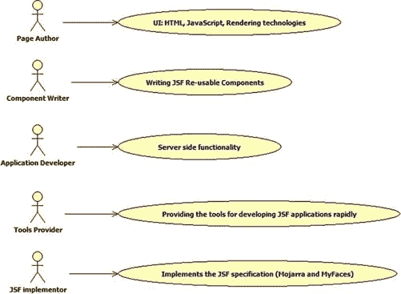

图 1-1 。JSF 角色

如图 1-1 所示，页面作者负责创建页面的用户界面。页面作者应该了解标记、样式和脚本语言，如 HTML5、CSS3 和 JavaScript。页面作者还应该了解 JavaServer Pages (JSP)等呈现技术。

与应用开发人员不同，页面作者专注于为应用开发令人愉快且有效的用户体验。JSF 的组件架构抽象出了大量的复杂性，使得页面作者即使不熟悉 Java 和 C#等编程语言也能高效工作。

组件编写者负责开发页面作者可以使用的可重用 JSF 组件。可重用的 JSF 组件可以收集到“组件库”中可以把它想象成一个组件面板，很容易发现、定制和集成到您的应用中。组件库是大型开发团队生产力倍增的一个重要因素。两个流行且全面的 JSF 组件库是 PrimeFaces 和 RichFaces。

可重复使用的 JSF 组件应支持以下功能:

*   *编码:*将内部组件的属性和特性转换成使用该组件的页面中合适的标记(比如 HTML)。
*   *解码*:将带有相关头和参数的传入请求转换成组件的相关属性和特性。
*   除此之外，组件应该支持请求时事件、验证、转换和状态。转换是将传入的请求转换为适合组件的形式的过程。有状态性意味着组件必须为新请求保留其原始状态。这可以通过跨不同请求保存和恢复组件状态来完成。

应用开发人员负责开发 JSF 应用的服务器端功能。应用开发人员专注于开发 Java、EJB 或任何其他能够在 JVM (Java 虚拟机)上运行的语言。除此之外，应用开发人员可以定义 JSF 应用的持久性存储机制(包括数据和内容模型),并从 JSF 页面公开要使用的数据和业务逻辑对象。

工具提供商负责开发工具，帮助 JSF 开发人员构建 JSF 应用。这些工具包括 IDE(集成开发环境)插件和扩展以及页面生成器。JSF 实现者负责为所有前面的角色提供符合标准的运行时或 JSF 规范的实现。Oracle Mojarra([`javaserverfaces.java.net/`](http://javaserverfaces.java.net/))和 Apache MyFaces([`myfaces.apache.org/`](http://myfaces.apache.org/))是 JSF 规范的可用实现的例子。

JSF 进化:1.0–2.2

JSF 1.0 于 2004 年 3 月发布；它代表了 web 层实现方式的重大发展。但是伴随着这些优势而来的还有一些限制，为了让 JSF 在社区中得到广泛的接受，这些限制需要被规避。这些限制中的一些与部件性能有关，另一些与开放式缺陷有关。

专家组努力制定规范，并于 2004 年 5 月发布了 1.1 版，该版本消除了 JSF 1.0 的一些最大的性能问题，并修复了许多缺陷，使 JSF 框架可用于下一代 web 应用。有了 JSF 1.1，专家组已经实现了他们在 Java 规范请求(JSR) 127 中设定的大部分早期目标。这些目标与开发工具支持的标准 GUI 组件框架的创建有关，开发工具允许 JSF 开发人员通过扩展基础框架组件、定义用于输入验证和转换的 API 以及指定 GUI 本地化和国际化的模型来创建自定义组件。

 **注**在[`jcp.org/en/jsr/detail?id=127`](http://jcp.org/en/jsr/detail?id=127)可以读到 JSR 127。

2006 年 5 月，JSF 1.2 和 Java 企业版 5.0 一起发布。JSF 1.2 对 JSF 1.1 进行了重大改进，解决了用户群体的一些现实问题。JSF 1.2 有许多特性，其中一些是

*   JSF 和 JSP 之间的统一表达式语言。
*   解决 JSF 与 JSP 和 JSTL 的集成问题。
*   允许单个组件覆盖转换和验证消息。
*   增强客户端状态保存的安全性。

 **注** JSR 252 是 JSF 1.2 规格；你可以在 http://jcp.org/en/jsr/detail?id=252 的[看到。](http://jcp.org/en/jsr/detail?id=252)

2009 年 7 月，JSF 2.0 与 Java 企业版 6.0 一同发布。JSF 2.0 引入了大量的特性和增强功能。一些特性和增强功能包括

*   复合部件。
*   完全模板支持。
*   完整的 Ajax 支持。
*   增强 JSF 导航。
*   支持视图参数。
*   在应用中支持更多的作用域。
*   提供异常处理机制。
*   通过 JSR 303 集成改进验证。
*   标准化资源加载机制。
*   通过支持大多数配置的注释来最小化 XML 的使用。

2010 年 7 月，JSF 2.1 主要是 JSF 2.0 的维护版本。它包括错误修复和增强。其中一些是

*   允许 JSP 文档语法(。jspx 文件)被视为 Facelets 文件。
*   可插拔的 Facelet 缓存机制。

 **注** JSR 314 规范在其最终版本中集合了 JSF 2.0，在其维护版本中集合了 JSF 2.1；你可以在 http://jcp.org/en/jsr/detail?id=314 阅读说明书。

截至本章撰写时，JSF 2.2 规范和实现仍在进行中，尚未发布。JSF 2.2 预计将与 Java 企业版 7.0 一起发布。JSF 2.2 的主要特点是

*   通过引入 FacesFlow 来标准化流 API。
*   多模板。
*   添加新的 JSF 元素和属性，这些元素和属性是特定于 HTML5 的。

 **注** JSR 344 是 JSF 2.2 规格；你可以在 http://jcp.org/en/jsr/detail?id=344 的[看到它的初稿评论。](http://jcp.org/en/jsr/detail?id=344)

在本书的所有章节中，我们将使用实际的、易于理解的例子来更详细地讨论这些特性。

JSF 建筑

JSF 架构基于 MVC(模型视图控制器)2 模式。与 MVC1 模式不同，MVC2 模式将视图从控制器和模型中分离出来。图 1-2 显示了 JSF 的 MVC2 架构。

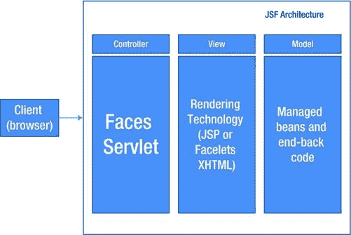

图 1-2 。JSF MVC2 架构

在 JSF，MVC2 模式实现如下:

*   控制器，由 JSF Faces Servlet 表示。Faces Servlet 负责处理请求分发和页面导航。Faces Servlet 通过调用负责处理 JSF 请求处理生命周期的 JSF 生命周期对象来编排 JSF 生命周期。
*   模型，由 JSF 管理的 beans 和后端代码表示。JSF 托管 bean 只是一个符合 JavaBeans 命名约定的 POJO，可以从 JSF 应用(页面和其他托管 bean)访问。JSF 管理的 bean 必须有一个控制其生命周期的范围；它可以在请求、视图、流、会话、应用或无范围内。每个 JSF 托管 bean 都应该在 faces-config . XML(JSF 配置文件)中注册或使用注释注册(托管 bean 将在第二章中详细介绍)。
*   视图，这是 JSF 的渲染技术。呈现技术定义了页面布局和内容。从 2.0 版本开始，JSF 的默认呈现技术是 Facelets XHTML(但是，您仍然可以选择使用 JSP 作为 JSF 呈现技术，尽管不建议这样做)。

您可能想知道 JSF 运行时如何简化 JSF 开发人员的应用开发，以及控制器如何协调 JSF 的模型和视图。这些问题将在“JSF 生命周期”部分得到解答。

开发您的第一个 JSF 应用

现在，是时候暂时停止这个理论，开始用 JSF 框架工作了。让我们看看如何开发和运行您的第一个 JSF 2.1 应用。

所需软件

在详细介绍您的第一个 JSF 2.1 应用示例之前，我想提一下，本书的所有示例都基于 Apache Maven 3 软件，版本 3.0.4，用于执行编译，并将编译后的源代码组装到可部署的 Java EE WAR 文件中。Maven 3 可以从[`maven.apache.org/download.html`](http://maven.apache.org/download.html)下载。

Apache Maven 是一个强大的构建管理工具。每个 Maven 项目都有一个名为(pom.xml)的“项目对象模型”文件。(pom.xml)文件包括项目依赖项，用于将项目编译和构建到目标工件中。为了构建一个项目，Maven 从(pom.xml)文件中获取依赖项，然后如果在本地磁盘上没有找到这些依赖项，就将它们下载到本地磁盘上；之后，Maven 执行编译，并将编译后的源代码组装成目标工件。本书中所有示例的目标工件是 Java EE web 应用 WAR 文件。Maven 的强大特性之一是其应用的严格结构，如图图 1-3 所示。

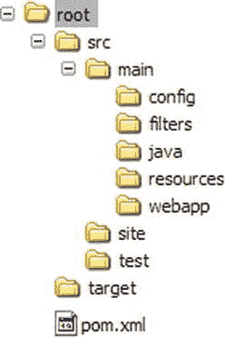

图 1-3 。Maven 项目结构

如图所示，项目根包含两个主子文件夹(src 和 target)和(pom.xml)文件。src 目录包含应用的源代码，目标目录包含生成的工件。src 目录有许多子目录；这些目录中的每一个都有特定的用途:

*   **src/main/java:** 包含应用的 java 源代码。
*   **src/main/resources:** 包含应用需要的资源，比如资源包。
*   **src/main/filters:** 它包括资源过滤器。
*   **src/main/config:** 包含配置文件。
*   **src/main/webapp:** 包含 JEE web 应用项目的文件。
*   **src/test:** 包括应用的单元测试。
*   **src/site:** 它包括用于生成 Maven 项目网站的文件。

除了 Apache Maven 3 软件，本书的所有示例都使用 Oracle jdk1.6.0_27(可以从[www.oracle.com/technetwork/java/javase/downloads/index.html](http://www.oracle.com/technetwork/java/javase/downloads/index.html)下载)，这些示例可以运行在任何支持 JSF 2.1(JSF 2.2 示例使用 JSF 2.2)的运行时环境上。

 **注意** Oracle GlassFish v3.1(或更高版本)和 Apache Tomcat 7 能够运行 JSF 2.1 应用。我将向您展示如何在两个 Java web 容器上运行基于 JSF 2.1 的第一个应用。

开发第一个应用

第一个应用包含两个页面。在第一页中，您可以输入您的姓名和密码，如图 1-4 所示。

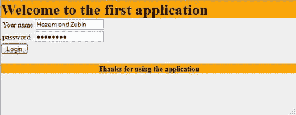

图 1-4 。登录页面

点击“登录”按钮后，将被重定向到欢迎页面，如图图 1-5 所示。

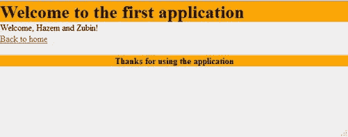

图 1-5 。欢迎页面

第一个应用具有以下 Maven 结构:

*   first application/src/main/WEB app/we b-INF/faces-config . XML
*   first application/src/main/WEB app/we b-INF/WEB . XML
*   first application/src/main/WEB app/we b-INF/templates/simple . XHTML
*   first application/src/main/web app/CSS/simple . CSS
*   first application/src/main/web app/index . XHTML
*   first application/src/main/web app/welcome . XHTML
*   first application/src/main/Java/com/jsfprotml 5/first application/model/user . Java
*   first application/src/main/resources/com/jsfprohtml 5/first application/messages . properties

图 1-6 显示了第一个应用的完整布局。

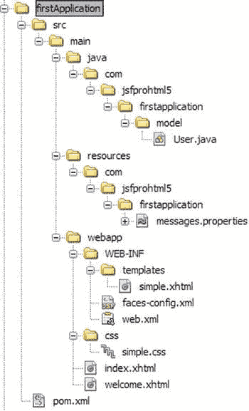

图 1-6 。第一个应用 Maven 结构

配置文件

第一个应用有两个配置文件，分别是 web.xml 和 Faces-config . XML。web . XML 文件是标准的 web 模块部署描述符，其中定义了 Faces Servlet。Faces Servlet 的主要目的是拦截对 JSF 页面的请求，以便在访问所请求的 JSF 页面之前准备好 JSF 上下文。清单 1-1 显示了第一个应用的 web.xml 文件。

***清单 1-1。*** 第一个应用的 web.xml

```html
<?xml version="1.0" encoding="UTF-8"?>

<web-app FontName">http://java.sun.com/xml/ns/javaee"
               xmlns:xsi="http://www.w3.org/2001/XMLSchema-instance"
               xsi:schemaLocation="http://java.sun.com/xml/ns/javaee
http://java.sun.com/xml/ns/javaee/web-app_3_0.xsd"
               version="3.0">
    <context-param>
        <param-name>javax.faces.PROJECT_STAGE</param-name>
        <param-value>Development</param-value>
    </context-param>
    <servlet>
        <servlet-name>Faces Servlet</servlet-name>
        <servlet-class>javax.faces.webapp.FacesServlet</servlet-class>
        <load-on-startup>1</load-on-startup>
    </servlet>
    <servlet-mapping>
        <servlet-name>Faces Servlet</servlet-name>
        <url-pattern>/faces/*</url-pattern>
    </servlet-mapping>
    <session-config>
        <session-timeout>
            30
        </session-timeout>
    </session-config>
    <welcome-file-list>
        <welcome-file>faces/index.xhtml</welcome-file>
    </welcome-file-list>
</web-app>
```

在清单 1-1 中，您需要知道两件主要的事情:第一件是 Faces Servlet 的定义及其使用< url-pattern >元素到(/faces/*) URL 的映射。第二个是 javax.faces.PROJECT_STAGE 上下文参数，它被设置为 Development(其他可能的值是 Production、SystemTest 和 UnitTest)。在开发模式中设置项目阶段使得 JSF 框架在发现常见的开发错误时在页面中生成额外的消息。这个特性可以帮助 JSF 开发人员在开发过程中提高工作效率。

最后，<welcome-file>元素指定应用的欢迎页面，就是 index.xhtml 文件；这将把对[`localhost:8080/first application/`](http://localhost:8080/firstApplication/)的任何请求重定向到[`localhost:8080/first application/Faces/index.xhtml`](http://localhost:8080/firstApplication/faces/index.xhtml)，这将触发 Faces Servlet 在转到 index . XHTML 页面之前准备 JSF 上下文。</welcome-file>

 **注意**在任何 Servlet 3.0 容器比如 GlassFish v3 中，web.xml 文件都是可选的。如果省略 web.xml，Faces Servlet 将自动映射到*。jsf，*。faces 和/faces/* URL 模式。

现在，让我们转到 faces-config 文件，它包括相关的 JSF 配置。实际上，从 JSF 2.0 开始，faces-config 文件变成了可选的，因为大多数 JSF 配置都可以使用 Java 注释来定义。清单 1-2 显示了第一个 Application Faces 配置文件。

***清单 1-2。*** 第一个应用面孔配置文件

```html
<faces-config version="2.1"
    FontName">http://java.sun.com/xml/ns/javaee"
    xmlns:xsi="http://www.w3.org/2001/XMLSchema-instance"
    xsi:schemaLocation="http://java.sun.com/xml/ns/javaee
http://java.sun.com/xml/ns/javaee/web-facesconfig_2_1.xsd">

     <application>
                <resource-bundle>
                            <base-name>com.jsfprohtml5.firstapplication.messages</base-name>
                            <var>bundle</var>
                 </resource-bundle>
     </application>
</faces-config>
```

清单 1-2 全局定义了应用资源包，以便从 JSF 表达式语言(#{...})使用捆绑变量(JSF 表达式语言将在第三章中详细说明)。

Facelets Pages

firstApplication 包含两个主页面:第一个页面(index.xhtml)表示主页，另一个页面是(welcome.xhtml)页面，表示欢迎页面。两个页面都引用了(first application/src/main/WEB app/we b-INF/templates/)下定义的模板(simple.xhtml)页面，如清单 1-3 所示。

***清单 1-3。*** 简单. xhtml 模板文件

```html
<?xml version='1.0' encoding='UTF-8' ?>
<!DOCTYPE html>
<html FontName">http://www.w3.org/1999/xhtml"
      xmlns:ui="http://java.sun.com/jsf/facelets"
      xmlns:f="http://java.sun.com/jsf/core"
      xmlns:h="http://java.sun.com/jsf/html">

<h:head>
  <title><ui:insert name="title">#{bundle['application.defaultpage.title']}</ui:insert></title>
  <link href="#{request.contextPath}/css/simple.css" rel="stylesheet" type="text/css"/>
</h:head>

<h:body>
    <div id="container">
        <div id="header">
            <ui:insert name="header">
                <h1>#{bundle['application.defaultpage.header.content']}</h1>
            </ui:insert>
        </div>

        <div id="content">
            <ui:insert name="content">
                #{bundle['application.defaultpage.body.content']}
            </ui:insert>
        </div>

        <div id="footer">
            <ui:insert name="footer">
                #{bundle['application.defaultpage.footer.content']}
            </ui:insert>
        </div>
    </div>
</h:body>
</html>
```

声明了模板 doctype:在 firstApplication 页面中，所有页面都使用这个 doctype，它代表 HTML5 doctype。为了包含 JSF HTML、core 和 Facelets UI 标签，使用了下面的声明 :

```html
<html FontName">http://www.w3.org/1999/xhtml"
      xmlns:ui="http://java.sun.com/jsf/facelets"
      xmlns:f="http://java.sun.com/jsf/core"
      xmlns:h="http://java.sun.com/jsf/html">
```

第一行是标准的 XHTML 实践，第二行声明 Facelets UI 标记，第三行声明 JSF 核心标记，最后一行声明模板页面中使用的 JSF HTML 标记。

和元素是 HTML 和元素的替代品。该模板包含一个容器元素，其 ID 为“container”。“容器”元素包含三个子元素:

*   **header 元素:**页面的页眉定义在“header”div 元素里面。
*   **内容元素:**页面的内容在“content”div 元素中定义。
*   **页脚元素:**页面的页脚是在“footer”div 元素中定义的。

在 header、content 和 footer 元素中，有一个 Facelets <insert>标记。Facelets <insert>标签用于声明初始默认内容，该内容可以被使用该模板的页面覆盖。<insert>标签中的内容代表内容的初始值。#{...}表示 JSF 表达式语言。JSF 表达式语言可以用来绑定 JSF 模型和 JSF 页面；在模板页面中，它通过#{bundle['key name']}将资源包内容与页面绑定。bundle 变量在 faces-config.xml 中定义，如“配置文件”一节所示。清单 1-4 显示了 messages.properties 资源包文件。</insert></insert></insert>

***清单 1-4。***message . properties 文件

```html
user.name = Your name
user.password = password
user.name.validation = You need to enter a username
user.password.validation = You need to enter a password

application.login = Login
application.loginpage.title = Login page

application.welcome = Welcome
application.welcomepage.title = Welcome page
application.welcomepage.return = Back to home

application.defaultpage.title = Default Title
application.defaultpage.header.content = Welcome to the first application
application.defaultpage.body.content = Your content here ...
application.defaultpage.footer.content = Thanks for using the application
```

资源包是一组键和值对。使用 JSF 表达式语言，在运行时解析包键的值。例如，在运行时，将# { bundle[' application . default page . header . content ']}表达式计算为“欢迎使用第一个应用”。

模板文件还包括一个 CSS(层叠样式表)文件，就是 simple.css 文件。simple.css 负责模板页面布局。清单 1-5 显示了 simple.css 文件。

***清单 1-5。***simple . CSS 文件

```html
h1, p, body, html {
    margin:0;
    padding:0;
}

body {
    background-color:#EEEEEE;
}

#container {
    width:100%;
}

#header {
    background-color:#FFA500;
}

#header h1 {
    margin-bottom: 0px;
}

#content {
    float:left;
    width:100%;
}

#footer {
    clear:both;              /*No floating elements are allowed on left or right*/
    background-color:#FFA500;
    text-align:center;
    font-weight: bold;
}

.errorMessage {
    color: red;
}
```

为了在不改变 web 应用的 HTML 代码的情况下随时改变页面布局，建议使用 CSS。

 **注意**从 JSF 2.0 开始，支持页面模板。在 JSF 2.0 之前，JSF 的开发者必须在 JSF 应用中下载并配置一个模板库(比如 Facelets 库)来定义页面的布局。

清单 1-6 显示了 index.xhtml 页面代码，它代表了应用的介绍性页面。

***清单 1-6。***index . XHTML 页面

```html
<?xml version='1.0' encoding='UTF-8' ?>
<!DOCTYPE html>
<html FontName">http://www.w3.org/1999/xhtml"
      xmlns:ui="http://java.sun.com/jsf/facelets"
      xmlns:h="http://java.sun.com/jsf/html">

<ui:composition template="/WEB-INF/templates/simple.xhtml">
    <ui:define name="title">
        #{bundle['application.loginpage.title']}
    </ui:define>
    <ui:define name="content">
        <h:form>
            <h:panelGrid columns="3">
                <h:outputText value="#{bundle['user.name']}"></h:outputText>
                <h:inputText id="userName"
                             value="#{user.name}"
                             required="true"
                             requiredMessage="#{bundle['user.name.validation']}">
                </h:inputText>
                <h:message for="userName" styleClass="errorMessage"/>

                <h:outputText value="#{bundle['user.password']}"></h:outputText>
                <h:inputSecret id="password"
                               value="#{user.password}"
                               required="true"
                               requiredMessage="#{bundle['user.password.validation']}">
                </h:inputSecret>
                <h:message for="password" styleClass="errorMessage"/>
            </h:panelGrid>
            <h:commandButton value="#{bundle['application.login']}" action="welcome">
            </h:commandButton> <br/><br/>
        </h:form>
    </ui:define>
</ui:composition>
</html>
```

为了在 index.xhtml 页面(或任何其他 xhtml 页面)中包含 simple.xhtml 模板页面，使用了<composition>标记，用模板页面的相对路径指定其模板属性。<composition>标签包括<define>标签。如果标签使用 name 属性匹配，<define>标签用于覆盖由<insert>标签定义的模板内容。</insert></define></define></composition></composition>

在 index.xhtml 页面中，模板的“标题”和“内容”被页面标题和页面内容覆盖。页面内容包括一个

<form>标签，所有参与表单提交的 JSF 输入组件都需要这个标签。</form>

为了制作表单的内部布局，使用了< h:panelGrid >标签。标签是一个布局容器，它在由行和列组成的网格中呈现 JSF 组件。< h:panelGrid >标签有一个 columns 属性，指定网格的列数(在本例中是“3”)。在 index.xhtml 页面中，< h:panelGrid >中的每一行都代表一个带有标签和消息的输入字段。第一行如下:

```html
<h:outputText value="#{bundle['user.name']}"></h:outputText>
<h:inputText id="userName"
                   value="#{user.name}"
                   required="true"
                   requiredMessage="#{bundle['user.name.validation']}">
</h:inputText>
<h:message for="userName" styleClass="errorMessage"/>
```

<outputtext>定义用户名标签，<inputtext>定义“用户名”输入文本，最后<message>定义“用户名”输入文本的消息，以便显示验证错误消息。使用指定输入文本 ID 的 for 属性将<message>与输入文本链接起来(在本例中是“userName”)。</message></message></inputtext></outputtext>

将<inputtext>标签的 required 属性设置为 true 会在输入文本上创建一个验证，以避免空值。如果在输入文本中输入一个空值，那么 requiredMessage 属性中的消息将显示在<message>中。<inputtext>标记的 value 属性包含以下 JSF 值表达式，#{user.name}，该表达式将用户管理的 bean 的 name 属性与用户输入的输入文本值相链接。用户管理的 bean 的代码在“管理的 bean”一节中列出。</inputtext></message></inputtext>

<panelgrid>的第二行代表“密码”秘密字段及其标签和消息。这与第一行的想法相同，不同之处在于它使用了<inputsecret>标记来定义密码输入字段，并且<inputsecret>标记的值通过#{user.password}值表达式与用户管理的 bean 的密码属性相链接。<commandbutton>呈现一个 HTML 提交按钮。在页面中，登录命令按钮定义如下:</commandbutton></inputsecret></inputsecret></panelgrid>

```html
<h:commandButton value="#{bundle['application.login']}" action="welcome"></h:commandButton>
```

<commandbutton>的 action 属性可以接受一个 JSF 方法绑定表达式,以便在单击命令按钮时调用受管 bean 操作方法。受管 bean 操作方法必须是公共方法，并且必须返回字符串值或 null。返回的字符串表示操作的逻辑结果，JSF 运行时通过查看配置文件中是否定义了匹配的导航规则来确定要显示的下一页。但是从 JSF 2.0 开始，支持隐式导航。这允许动作属性接受直接指向目标页面的字符串值，而不需要在配置文件中定义导航规则(例如:如果目标页面名称是“foo.xhtml ”,则动作字符串结果必须是“foo ”,并且 JSF 运行时将追加“.xhtml”扩展名和动作字符串值，以便正确导航到目标页面)。在 index.xhtml 页面中，action 属性设置为“welcome”，这意味着当单击 login 命令按钮时，应用将导航到 welcome.xhtml 页面。</commandbutton>

 **注**JSF 导航是一个有很多细节的话题，在本书的下一章会有更详细的说明。JSF 验证和转换将在第三章的中详细说明。

清单 1-7 显示了 welcome.xhtml 页面代码，它表示应用的欢迎页面。

***清单 1-7。***welcome . XHTML 页面代码

```html
<?xml version='1.0' encoding='UTF-8' ?>
<!DOCTYPE html>
<html FontName">http://www.w3.org/1999/xhtml"
      xmlns:ui="http://java.sun.com/jsf/facelets"
      xmlns:h="http://java.sun.com/jsf/html"
      xmlns:f="http://java.sun.com/jsf/core">

<ui:composition template="/WEB-INF/templates/simple.xhtml">
    <ui:define name="title">
        #{bundle['application.welcomepage.title']}
    </ui:define>
    <ui:define name="content">
        #{bundle['application.welcome']}, #{user.name}! <br/>
        <h:link value="#{bundle['application.welcomepage.return']}"
                outcome="index"></h:link> <br/><br/>
    </ui:define>
</ui:composition>
</html>
```

welcome.xhtml 页面包含使用<composition>标签的 simple.xhtml 模板页面。与 index.xhtml 页面一样，在 welcome.xhtml 页面中，模板的“标题”和“内容”被页面标题和页面内容覆盖。页面内容显示一条欢迎消息，其中包含使用#{user.name}值表达式的用户管理的 bean 的 name 属性。页面内容包括一个使用<link>标签的介绍性页面的链接。<link>标签是从 JSF 2.0 开始引入的新标签；它呈现一个 HTML 锚元素。<link>的值属性呈现为锚文本，其结果属性用于确定目标导航页面。在欢迎页面中，outcome 属性值被设置为“index ”,这使得隐式导航成为应用的“index.xhtml”页面。</composition>

被管理的 bean

如 Facelets 页面部分所示，有一个用户管理的 bean，它与索引和欢迎页面的输入和输出组件绑定在一起。清单 1-8 显示了用户管理的 bean。

***清单 1-8。*** 用户托管 Bean

```html
package com.jsfprohtml5.firstapplication.model;

import java.io.Serializable;
import javax.faces.bean.ManagedBean;
import javax.faces.bean.SessionScoped;

@ManagedBean
@SessionScoped
public class User implements Serializable {
    private String name;
    private String password;

    public String getName() {
        return name;
    }

    public void setName(String name) {
        this.name = name;
    }
    public String getPassword() {
        return password;
    }
    public void setPassword(String password) {
        this.password = password;
    }
}
```

用户管理的 bean 是一个简单的 Java bean，有两个用于 name 和 password 属性的 setters 和 getters。@ManagedBean 注释用于将用户类注册为 JSF 管理的 Bean。

 **注意**@ managed Bean 注释有一个可选的 name 属性，它描述了要在 JSF 表达式中使用的受管 bean 的名称。在用户管理的 bean 中，name 属性被省略；这意味着受管 bean 名称将与第一个字符为小写的类名相同，也就是说，它将在像#{user}这样的 JSF 表达式中使用。

@SessionScoped 注释用于在会话范围内设置受管 bean。其他可能的值可以是(@RequestScoped、@ViewScoped、@ApplicationScoped、@ none scoped[或@FlowScoped，这在 JSF 2.2 中受支持])。

依赖性

现在，让我们转到第一个应用的(pom.xml)依赖项。清单 1-9 显示了 GlassFish 3.1.2 上第一个应用所需的依赖关系。

***清单 1-9。*** 在 pom.xml 文件中配置 GlassFish 3.1.2

```html
<dependencies>
              <dependency>
                            <groupId>javax</groupId>
                            <artifactId>javaee-web-api</artifactId>
                            <version>6.0</version>
                            <scope>provided</scope>
              </dependency>
              <dependency>
                            <groupId>javax.faces</groupId>
                            <artifactId>javax.faces-api</artifactId>
                            <version>2.1</version>
                            <scope>provided</scope>
              </dependency>

              <dependency>
                            <groupId>javax.servlet</groupId>
                            <artifactId>servlet-api</artifactId>
                            <version>2.5</version>
                            <scope>provided</scope>
              </dependency>

              <dependency>
                             <groupId>javax.servlet</groupId>
                             <artifactId>jsp-api</artifactId>
                             <version>2.0</version>
                             <scope>provided</scope>
              </dependency>
</dependencies>
```

如清单所示，以下依赖项仅用于编译，不会包含在 web 应用的 lib 文件夹中，因为 GlassFish 3.1.2 应用服务器已经附带了这些依赖项:

*   Servlet API 版本 2.5。
*   JSP API 版本 2.0。
*   JavaEE Web API 版本 6。
*   JSF API 版本 2.1。

清单 1-10 显示了 Tomcat 7 上第一个应用所需的依赖关系。

***清单 1-10。*** 雄猫 7 配置

```html
<dependencies>
              <dependency>
                            <groupId>javax</groupId>
                            <artifactId>javaee-web-api</artifactId>
                            <version>6.0</version>
                            <scope>provided</scope>
              </dependency>

              <dependency>
                            <groupId>org.glassfish</groupId>
                            <artifactId>javax.faces</artifactId>
                            <version>2.1.6</version>
              </dependency>

              <dependency>
                            <groupId>javax.servlet</groupId>
                            <artifactId>servlet-api</artifactId>
                            <version>2.5</version>
                            <scope>provided</scope>
              </dependency>

              <dependency>
                             <groupId>javax.servlet</groupId>
                             <artifactId>jsp-api</artifactId>
                             <version>2.0</version>
                             <scope>provided</scope>
              </dependency>
</dependencies>
```

如清单所示，这是几乎相同的依赖项集，只有一个区别，即替换了 JSF API v2.1 依赖项，该依赖项在提供的范围内:

```html
<dependency>
              <groupId>javax.faces</groupId>
              <artifactId>javax.faces-api</artifactId>
              <version>2.1</version>
              <scope>provided</scope>
</dependency>
```

在编译范围内具有以下依赖关系:

```html
<dependency>
              <groupId>org.glassfish</groupId>
              <artifactId>javax.faces</artifactId>
              <version>2.1.6</version>
</dependency>
```

这个替换告诉 Maven 使用 JSF 2.1.6 jar 来编译第一个应用，并将这个 jar 包含在 web 应用 lib 文件夹中。我特别选择 2.1.6 版本，因为它在 Tomcat 7 上运行良好。

构建和部署第一个应用

第一个 Application Maven 项目可以从本书的网站下载:[www.apress.com/9781430250104](http://www.apress.com/9781430250104)。为了构建和部署第一个应用，您需要在您的系统中安装 Maven 3。

 **注**配置 Maven 3 的详细步骤在 Maven 网站有描述:[`maven.apache.org/download.html#Installation`](http://maven.apache.org/download.html#Installation)。这些说明向您展示了如何在您的系统中安装 Maven，无论它是 Windows、Linux、Solaris 还是 Mac OS X。

在您的系统中安装了 Maven 3 之后，您可以通过从命令行执行以下 Maven 命令来构建第一个应用。这个命令应该从包含 pom.xml 文件的应用目录中执行:

```html
mvn clean install
```

执行这个命令后，可以在目标文件夹中找到生成的 firstApplication-1.0.war 文件。让我们看看如何在 Apache Tomcat 7 和 Oracle GlassFish 3.1.2 上部署生成的 war 文件。

 **注意**不要忘记使用“依赖项”一节中提到的适当的 pom.xml 依赖项来正确生成两个 war 文件(一个用于 Apache Tomcat 7，另一个用于 Oracle GlassFish 3.1.2)。

在 Tomcat 7 上部署应用

为了在 Apache Tomcat 7 上部署 firstApplication-1.0.war 文件，您需要执行以下操作:

*   将 firstApplication-1.0.war 文件复制到$ { Tomcat _ Installation _ Directory } \ web apps 目录。
*   从$ { Tomcat _ Installation _ Directory } \ bin 目录中执行以下命令，启动 Tomcat 7 服务器:
*   startup.bat(适用于 Windows)
*   startup.sh(适用于 Linux)
*   从以下 URL 访问第一个应用:[`localhost:8080/first application-1.0/`](http://localhost:8080/firstApplication-1.0/)

在 GlassFish 3.1.2 上部署应用

为了在 Oracle GlassFish 3.1.2 上部署 firstApplication-1.0.war 文件，您需要执行以下操作:

*   将 firstApplication-1.0.war 文件复制到$ { GlassFish _ Installation _ Directory } \ domains \**domain 1**\ auto deploy 目录中( **domain1** 可以改为任意域名)。
*   通过从＄{ GlassFish _ Installation _ Directory } \ bin 目录执行以下命令来启动 GlassFish 3.1.2 服务器:asadmin start-domain 域 1
*   从以下 URL 访问第一个应用:[`localhost:8080/first application/`](http://localhost:8080/firstApplication/)

尽管第一个应用是一个简单的 JSF 应用，但它涵盖了 JSF 的许多基础知识。您现在知道了以下内容:

*   如何从头开始创建一个 JSF 应用？
*   JSF 表达式的基础。
*   JSF 管理的是如何创建和使用 JSF 应用。
*   如何创建一个 JSF 页面模板，并在应用页面中使用该模板。
*   如何从 JSF 应用中配置和使用资源包。
*   如何使用基本的 JSF HTML 组件标签？
*   如何使用 JSF 必填字段验证器来验证输入字段。
*   如何使用 Maven 来管理在不同的 JSF 2.1 web 容器上轻松部署 JSF 应用。

JSF 生命周期

现在，是时候了解 JSF 是如何在幕后工作的了。虽然开发 JSF 应用并不需要了解 JSF 生命周期的细节，但建议阅读本节，以便了解您开发的代码如何在 JSF 运行时容器中执行，并为高级 JSF 开发做好准备。JSF 请求处理生命周期有六个阶段，如图 1-7 所示。

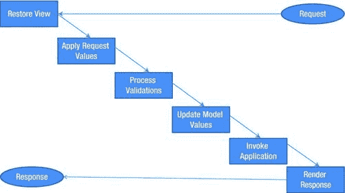

图 1-7 。JSF 请求处理阶段

六个阶段如下:

*   恢复视图。
*   应用请求值。
*   流程验证。
*   更新模型值。
*   调用应用。
*   渲染响应。

恢复视图

每个 JSF 页面在服务器上都表示为一个 UI 组件树，它与客户机(浏览器)中的用户界面有一对一的映射。为了正确理解这一点，我们来看一个例子。清单 1-11 显示了一个 JSF XHTML 页面，允许用户输入他/她喜欢的食物、饮料和运动。

***清单 1-11。*** 收藏夹. xhtml 页面

```html
<html FontName">http://www.w3.org/1999/xhtml"
      xmlns:h="http://java.sun.com/jsf/html">
<h:head>
  <title>Your Favorites</title>
</h:head>
<h:body>
    <h:form id="favForm">
        <h:panelGrid columns="3">
            <h:outputText value="Favorite Food"></h:outputText>
            <h:inputText id="favoriteFood" value="#{favorite.food}" required="true">
            </h:inputText>
            <h:message for="favoriteFood"/>

            <h:outputText value="Favorite Beverage"></h:outputText>
            <h:inputText id="favoriteBeverge" value="#{favorite.beverage}" required="true">
            </h:inputText>
            <h:message for="favoriteBeverge"/>

            <h:outputText value="Favorite Sport"></h:outputText>
            <h:inputText id="favoriteSport" value="#{favorite.sport}" required="true">
            </h:inputText>
            <h:message for="favoriteSport"/>
        </h:panelGrid>
        <h:commandButton value="Save my favorites" action="#{favorite.save}"/><br/><br/>
    </h:form>
</h:body>
</html>
```

favorites.xhtml 页面中的代码表现为 UI 组件的树，如图图 1-8 所示。

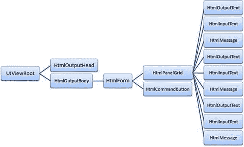

图 1-8 。收藏夹页面的 UI 组件树

在“恢复视图”阶段，有两种情况:

*   “非回发”请求:“非回发”请求是指对页面的新请求。如果是这种情况，还原视图阶段会创建一个空的 UI 组件树，并将其存储在当前的 FacesContext 实例中。对于“非回发”请求，JSF 生命周期直接进入最后一个阶段，即“呈现响应”阶段。在“呈现响应”阶段，空的 UI 组件树由页面中的 JSF 组件填充。此外，UI 组件树状态保存在 JSF 视图状态中，以供下一个请求使用。
*   “回发”请求:当使用 HTTP POST 方法将表单内容提交到同一页面时，会发生“回发”请求。在这种情况下，还原视图阶段从 JSF 视图状态还原 UI 组件树，该视图状态是由前一个页面请求生成的。

应用请求值

在 UI 组件树恢复后，调用“应用请求值”阶段。在这个阶段，UI 组件树中的每个节点都被分配了从表单提交的值。图 1-9 显示了如果表单提交了值，UI 组件树是如何填充请求值的，例如,“favoriteFood”的“鱼”,“favoriteBeverge”的“橙汁”,“favoriteSport”的“足球”。

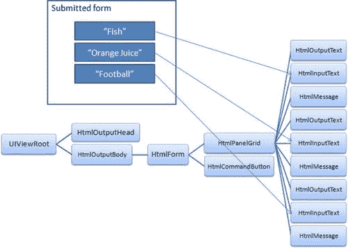

图 1-9 。用请求值填充 UI 组件树

 **注意**“应用请求值”应用于所有具有值属性的组件。在 JSF 中，具有 value 属性的组件必须实现 ValueHolder 接口。为了将请求值应用到 UI 组件树中的所有值容器节点，JSF 运行时调用 UIViewRoot 的 processDecodes()方法，这导致子组件的 processDecodes()方法也被调用，以便为所有组件应用请求值。

流程验证

“流程验证”阶段在“应用请求值”阶段之后调用。在此阶段，转换和验证按顺序执行。在 favorites.xhtml 中，通过将“required”属性设置为 true，对所有输入字段执行验证，以保证它们总是具有非空值。

转换是将 HTTP 请求参数转换成相应的 Java 类型，以消除开发人员为每个 web 应用实现这一功能所需的开销。JSF 有许多内置的转换器，它提供了一个接口，以便开发定制的转换器。清单 1-12 显示了一个 JSF 内置日期转换器的例子。

***清单 1-12。*** 内置日期转换器的例子

```html
<h:inputText id="birthDate" value="#{user.birthDate}">
              <f:convertDateTime pattern="dd/MM/yyyy"/>
</h:inputText>
```

在本例中,“birthDate”输入字段确保具有以下格式的日期“dd/MM/yyyy ”,并被转换为用户管理的 bean 中的 birthDate(日期对象)属性(验证和转换的更多细节将在第三章的中说明)。

当组件验证(或转换)失败时，组件错误消息(FacesMessage)将在 FacesContext 实例中排队。如果出现验证(或转换)错误，JSF 生命周期将直接进入“呈现响应”阶段，排队的 Faces 消息将显示在<message>或 <messages>UI 组件中。</messages></message>

 **注意**为了在 UI 组件树中应用过程验证，JSF 运行时调用 UIViewRoot 的 processValidators()方法，这导致子组件的 processValidators()方法也被调用，以便将转换和验证应用于所有子组件。

更新模型值

在完成转换和验证 UI 组件树中的值之后，调用“更新模型值”阶段。在这个阶段，在 UI 组件树中的值和 JSF 模型(受管 beans)之间进行绑定。

图 1-10 显示了 JSF 管理的 bean 属性是如何用 UI 组件树的值更新的。

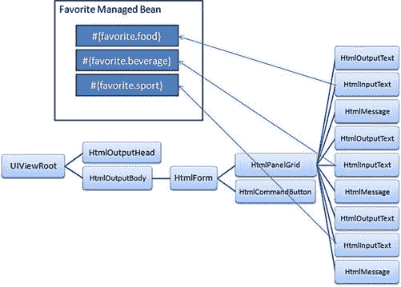

图 1-10 。JSF 管理的 bean 属性随 UI 组件树的值更新

 **注意**为了执行模型值更新，JSF 运行时调用 UIViewRoot 的 processUpdates()方法，这导致子组件的 processUpdates()方法也被调用，以便将模型更新应用于所有子组件。但是，UIInput 组件覆盖 processUpdates()方法，以便调用 updateModel()将用户输入与受管 bean 属性绑定起来。

调用应用

在完成模型值更新之后，调用“调用应用”阶段。在这个阶段，执行动作代码。JSF 中的动作代码可以在动作方法和动作监听器中。

 **注意**在 favorites.xhtml 中，动作代码在#{favorite.save}动作方法中表示。

在此阶段，导航是在执行自定义操作代码后由 JSF NavigationHandler 执行的。action 属性可以设置为文字值。在第一个应用中，您已经看到了将 action 属性设置为文字值的情况:

```html
<h:commandButton value="#{bundle['application.login']}" action="welcome">
</h:commandButton>
```

在文本值的情况下，JSF 运行时直接将“welcome”文本值传递给 JSF NavigationHandler，以便导航到新页面。导航处理结果显示在“渲染响应”阶段。

如果操作结果没有隐式(结果匹配现有页面名称)或显式(通过匹配 faces-config 中定义的导航规则)匹配导航案例，NavigationHandler 将停留在同一页面上。

 **注意**为了执行“调用应用”阶段，JSF 运行时调用 UIViewRoot 的 processApplication()方法，该方法通过调用 UIComponent 的 broadcast(FacesEvent event)方法，将排队的事件广播给 UICommand 组件(或任何其他实现 ActionSource 接口或 ActionSource2 接口[在 JSF 1.2 中引入]的 UIComponent)。broadcast 方法将操作事件广播给注册到该事件类型的所有操作侦听器进行处理。

渲染响应

最后，JSF 运行时调用“呈现响应”阶段，以便向用户呈现最终结果。通过在每个组件上调用 encodeXXX()方法，UI 组件树被呈现给客户端(encode 方法负责为每个组件生成合适的标记)。

除了呈现之外，“呈现响应”阶段还将 UI 组件树的状态存储在视图状态中，以便在下一个请求中恢复。

立即属性

有时，在您的 JSF 应用中，您可能希望跳过转换和验证，以便导航到另一个页面。例如，假设在 favorites.xhtml 页面中，您希望有一个导航到索引页面“index.xhtml”的“主页”按钮，如下所示:

```html
<h:form id="favForm">
              ...
              <h:inputText id="favoriteFood"
                                 value="#{favorite.food}"
                                 required="true">
              </h:inputText>
              ... <!-- other required fields -->
              <h:commandButton value="Save my favorites" action="#{favorite.save}"/>
              <h:commandButton value="Go home" action="index"/>
</h:form>
```

如果您点击“回家”按钮，并将必填的输入字段留空，您将会看到如图图 1-11 所示的验证错误信息:

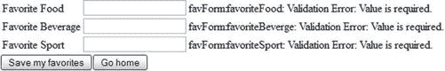

图 1-11 。由于没有“立即”为真而导致的验证错误

这是因为“回家”命令按钮会提交触发 JSF 生命周期的帖子，并且由于输入字段上的验证，“回家”操作无法完成。

JSF 框架提供了“立即”属性，允许跳过 JSF 生命周期的转换和验证。“immediate”属性实际上允许在“应用请求值”阶段执行动作事件。将 immediate 属性设置为 true 可以解决这个问题，如下所示:

```html
<h:form id="favForm">
              ...
              <h:inputText id="favoriteFood"
                                 value="#{favorite.food}"
                                 required="true">
              </h:inputText>
              ... <!-- other required fields -->
              <h:commandButton value="Save my favorites" action="#{favorite.save}"/>
              <h:commandButton value="Go home" action="index" immediate="true"/>
</h:form>
```

 **注**<h:链接>和< h:按钮>是从 JSF 2.0 开始引入的新部件；它们可以用于使用 outcome 属性实现到目标页面的 GET 导航(您已经在第一个应用中看到了一个< h:link >的例子)。因此，可以直接使用这些新组件来代替命令按钮和命令链接**，并将 immediate 属性设置为 true** 来进行导航，而无需执行转换和验证。

添加到 UICommand 组件中，immediate 属性可以应用于 EditableValueHolder 组件(如输入文本)。如果 EditableValueHolder 组件的 immediate 属性设置为 true，则 EditableValueHolder 组件的转换和验证将在“应用请求值”阶段(在“流程验证”阶段之前)执行。

 **注意** ValueHolder 组件是那些具有 value 属性如(标签和输出文本)的组件，它们实现 ValueHolder 接口。EditableValueHolder 组件是 ValueHolder 组件的一个子类型，可以由用户编辑其值，如(输入文本)。ActionSource 组件是那些可以进行诸如(命令按钮和命令链接)之类的操作的组件，它们实现 ActionSource 接口(或 JSF 1.2 以后的 ActionSource2)。

摘要

读完这一章，你就知道什么是 JSF，你也看到了 JSF 框架是如何随着时间的推移而演变的。您了解 JSF 架构，并学习了如何开发 JSF 应用，该应用涵盖了 JSF 世界中许多有趣的主题(基本 UI 组件、托管 beans、表达式语言、模板、资源包和验证)。最后，您知道了 JSF 请求处理生命周期在幕后是如何工作的。在接下来的章节中，本章中提到的所有 JSF 主题和其他高级主题都将有更详细的说明。