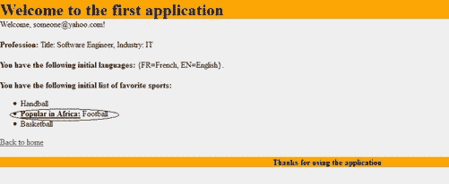

# 二、引擎盖下的 JSF——第一部分

本章阐述了 JSF 框架中的重要主题。在本章中，您将详细了解 JSF 管理的 beans 和表达式语言(EL)。您还将了解一些 JSF 导航。最后，您将了解如何在您的 JSF web 应用中利用 JSF 异常处理机制来增强应用的错误处理能力。

被管理的 bean

JSF 托管 bean 只是一个 POJO(普通旧 Java 对象),它符合 JavaBeans 命名约定，可以从 JSF 应用(页面和其他托管 bean)中访问。它被称为 **managed** ,因为它是由 JSF 框架管理的，当 JSF 应用需要使用它时，它会以一种懒惰的方式为您实例化 bean 类。下一节将详细介绍如何声明受管 bean，如何初始化受管 bean，如何管理不同受管 bean 之间的依赖关系，如何访问受管 bean，以及最后如何利用@Named 和@inject 注释来处理 JSF POJO 模型。

声明受管 Beans

在第一章中，我们在第一个应用中有一个托管 beans 用法的例子。清单 2-1 展示了用户管理的 bean。

***清单 2-1。*** 用户托管 Bean

```html
package com.jsfprohtml5.firstapplication.model;

import java.io.Serializable;
import javax.faces.bean.ManagedBean;
import javax.faces.bean.SessionScoped;

@ManagedBean
@SessionScoped
public class User implements Serializable {
    private String name;
    private String password;

    public String getName() {
        return name;
    }

    public void setName(String name) {
        this.name = name;
    }

    public String getPassword() {
        return password;
    }
    public void setPassword(String password) {
        this.password = password;
    }
}
```

用户管理的 bean 是一个 Java bean 类，有两个用于 name 和 password 属性的 setters 和 getters。@ManagedBean 注释用于将用户类注册为 JSF 管理的 Bean。@ManagedBean 注释有一个可选的 name 属性，它描述了将在 JSF 表达式中使用的受管 Bean 的名称。在用户管理的 bean 中，name 属性被省略；这意味着受管 bean 名称将与第一个字符为小写的类名相同，也就是说，它将在像#{user}这样的 JSF 表达式中使用。

一个 JSF 管理的 bean 必须有一个与之相关联的作用域,以控制它的生命周期。范围可以是:

*   请求范围(@RequestScoped)，这意味着 bean 将被实例化，并且只要 HTTP 请求是活动的，它就将是活动的。
*   视图范围(@ViewScoped)，这意味着只要用户停留在同一个视图中，bean 就会被实例化，并且是活动的。
*   会话范围(@SessionScoped)，这意味着 bean 将被实例化，并且只要用户的 HTTP 会话是活动的，它就将是活动的。
*   应用范围(@ApplicationScoped)，这意味着 bean 将被实例化，并将在应用的整个生命周期中保持活动状态。
*   None scope (@NoneScoped)，这意味着 bean 不会被实例化，也不会作为独立的实体存储在任何作用域中。无作用域的受管 bean 可以由另一个受管 bean 使用和实例化；在这种情况下，无作用域 bean 将具有实例化它的调用方受管 bean 的作用域(即，只要它们的调用方受管 bean 是活动的，无作用域受管 bean 就将是活动的)。在“管理受管 beans 的依赖性”一节中，您将看到这种情况的一个例子。

 **注**在 JSF 2.2 中，有一个新的作用域叫做“流作用域”(@FlowScoped)。这个流程将在下一章详细说明。

除了注释之外，每个 JSF 管理的 bean 也可以在 faces-config . XML(JSF 配置文件)中注册。清单 2-2 展示了如何在 faces-config.xml 文件中定义用户管理的 bean，而不是使用注释。

***清单 2-2。***faces-config . XML 文件中的用户托管 Bean 定义

```html
<managed-bean>
 <managed-bean-name>user</managed-bean-name>
 <managed-bean-class>com.jsfprohtml5.firstapplication.model.User</managed-bean-class>
 <managed-bean-scope>session</managed-bean-scope>
</managed-bean>
```

正在初始化受管 Beans

JSF 管理的 beans 可以从 faces 配置文件或使用注释进行初始化。清单 2-3 显示了如何从 faces 配置文件中用值“anonymous”初始化用户管理的 bean 的 name 属性。

***清单 2-3。*** 初始化 faces-config.xml 中的 Name 属性

```html
<managed-bean>
 <managed-bean-name>user</managed-bean-name>
 <managed-bean-class>com.jsfprohtml5.firstapplication.model.User</managed-bean-class>
 <managed-bean-scope>session</managed-bean-scope>
 <managed-property>
         <property-name>name</property-name>
              <value>anonymous</value>
 </managed-property>
</managed-bean>
```

元素可以用来初始化被管理的 bean 属性。它主要有两个子元素:

*   <property-name>元素，它包括受管 bean 属性的名称。</property-name>
*   <value>元素，它包括受管 bean 属性的初始值。</value>

初始化受管 bean 属性的另一种方法是使用注释。清单 2-4 展示了如何使用@ManagedProperty 注释用值“anonymous”初始化用户管理的 bean 的 name 属性。

***清单 2-4。*** 使用@ManagedProperty 注释初始化 Name 属性

```html
@ManagedBean
@SessionScoped
public class User implements Serializable {

    @ManagedProperty(value="anonymous")
    private String name;
    private String password;

    // The setters and the getters ...
}
```

使用注释,@ManagedProperty 注释用于使用 value 属性初始化用户管理的 bean 的 name 属性，其值为“anonymous”。

值得注意的是，JSF 管理的 beans 可以很好地与不同的 Java EE 注释一起工作。有两个与 JSF 受管 bean 生命周期相关的 Java EE 注释，可用于初始化和反初始化受管 bean:

*   @PostConstruct
*   @PreDestroy

清单 2-5 显示了用户管理 bean 中@PostConstruct 和@PostDestroy 注释的例子。

***清单 2-5。***@ post construct 和@ PostDestroy 注释

```html
import java.io.Serializable;
import javax.annotation.PostConstruct;
import javax.annotation.PreDestroy;
import javax.faces.bean.ManagedBean;
import javax.faces.bean.ManagedProperty;
import javax.faces.bean.SessionScoped;

@ManagedBean
@SessionScoped
public class User implements Serializable {

    @ManagedProperty(value="anonymous")
    private String name;
    private String password;

    // The setters and the getters ...

    @PostConstruct
    private void initialize() {
        System.out.println("Bean is initialized with the following user name: " + name);
    }
    @PreDestroy
    private void cleanUp() {
        System.out.println("You can do the cleanup here");
    }
}
```

当用户管理的 bean 被实例化和初始化时，调用@PostConstruct 方法。这意味着当初始化方法被调用时，输出控制台将显示以下消息:

```html
"Bean is initialized with the following user name: anonymous"
```

 **注意**正如你注意到的，@PostConstruct 和@PreDestroy 方法的返回类型是无效的，并且不带任何参数。这些方法也可以是私有的、公共的、受保护的或打包的。

在销毁用户管理的 bean 之前，调用@PreDestroy 方法。在这个方法中，您可以将受管 bean 所需的清理和反初始化代码。

还有许多其他与数据访问相关的 Java EE 注释，可以很好地与 JSF 管理的 beans 一起使用，例如@Resource、@PersistenceUnit、@PersistenceContext、@EJB 和@WebServiceRef。我们将在接下来的章节中讨论大部分注释。

除了初始化简单属性的能力之外，您还可以初始化受管 bean 的复杂类型，比如列表和映射。清单 2-6 为用户管理的 bean 引入了两个新属性:收藏夹体育列表和发言人语言映射。

***清单 2-6。*** 用户用两个新属性管理 Bean

```html
import java.util.List;
import java.util.Map;
//...
public class User implements Serializable {
    private String name;
    private String password;

    private List<String> favoriteSports;
    private Map<String, String> spokenLanguages;

        // setters and getters ...
}
```

为了用一些初始值初始化 favoriteSports 列表，可以在<managed-property>元素中使用<list-entries>元素，如清单 2-7 所示。</list-entries></managed-property>

***清单 2-7。Faces 配置文件中 List 属性的*** 初始化

```html
<managed-property>
        <property-name>favoriteSports</property-name>
        <list-entries>
                <value>Handball</value>
                <value>Football</value>
                <value>Basketball</value>
        </list-entries>
</managed-property>
```

在 XHTML 页面中，可以使用< ui:repeat >迭代 favoriteSportlist，如清单 2-8 所示。

***清单 2-8。*** 在 XHTML 页面中显示喜爱的运动项目

```html
<b>You have the following initial list of favorite sports:</b>
<ul>
        <ui:repeat value="#{user.favoriteSport}" var="sport">
                <li>#{sport}</li>
        </ui:repeat>
</ul>
```

如果要在收藏夹体育列表中显示特定项目，可以使用[]运算符。例如，下面的#{user.favoriteSport[0]}将显示 favoriteSport 数组中的第一项，即“手球”。为了用一些初始值初始化 spokenLanguages 映射，可以在<managed-property>元素中使用<map-entries>元素，如清单 2-9 所示。</map-entries></managed-property>

***清单 2-9。*** 初始化 Faces 配置文件中的地图属性

```html
<managed-property>
        <property-name>spokenLanguages</property-name>
        <map-entries>
                <map-entry>
                        <key>EN</key>
                        <value>English</value>
                </map-entry>
                <map-entry>
                        <key>FR</key>
                        <value>French</value>
                </map-entry>
        </map-entries>
</managed-property>
```

在 XHTML 页面中，您可以使用#{user.spokenLanguages}来显示 spokenLanguages。如果想要显示特定的映射条目值，也可以使用[]操作符从它的键中获得它。例如，使用#{user.spokenLanguages['EN']}将显示“英语”。

 **注意**对于<列表条目>和<地图条目>元素没有等价的 JSF 注释，所以初始化地图和列表的唯一方法是使用 faces 配置文件。

管理受管 Beans 依赖性

JSF 支持受管 bean 的 IoC(控制反转),这意味着受管 bean 可以在运行时耦合，而不需要从应用代码处理这种耦合。让我们看看如何在我们的 JSF 应用中利用 IoC。清单 2-10 为用户管理的 bean 引入了一个新的属性——职业属性。

***清单 2-10。*** 用户管理 Bean 中的新职业属性

```html
public class User implements Serializable {
    ...
    private Profession profession;
        ...
    public Profession getProfession() {
        return profession;
    }

    public void setProfession(Profession profession) {
        this.profession = profession;
    }    
}
```

清单 2-11 显示了职业管理 bean 类的属性。

***清单 2-11。*** 职业管理豆

```html
public class Profession implements Serializable {
    private String title;
    private String industry;

    public String getTitle() {
        return title;
    }

    public void setTitle(String title) {
        this.title = title;
    }

    public String getIndustry() {
        return industry;
    }

    public void setIndustry(String industry) {
        this.industry = industry;
    }
}
```

可以使用 JSF 配置文件或 JSF 注释将专业管理的 bean 实例与用户管理的 bean 实例关联起来。清单 2-12 显示了 JSF 配置文件的一部分，它配置了在实例化时被注入到用户管理 bean 中的专业管理 bean。

***清单 2-12。*** 配置要注入到用户实例中的职业实例

```html
<managed-bean>
        <managed-bean-name>user</managed-bean-name>
        <managed-bean-class>com.jsfprohtml5.firstapplication.model.User</managed-bean-class>
        <managed-bean-scope>session</managed-bean-scope>
        < managed-property>
                <property-name>profession</property-name>
                <value>#{profession}</value>
        </managed-property>
        ...
</managed-bean>
<managed-bean>
        <managed-bean-name>profession</managed-bean-name>
        <managed-bean-class>com.jsfprohtml5.firstapplication.model.Profession</managed-bean-class>
        <managed-bean-scope>none</managed-bean-scope>
        <managed-property>
                <property-name>title</property-name>
                <value>Software Engineer</value>
        </managed-property>
        <managed-property>
                <property-name>industry</property-name>
                <value>IT</value>
        </managed-property>
</managed-bean>  
```

Profession 受管 bean 在 none 作用域中声明，以便拥有实例化它的调用者受管 bean 的作用域(在本例中是用户受管 bean)。在用户管理的 bean 中，为 profession 属性定义了属性初始化，并且通过使用<managed-property>元素将#{profession}表达式用作 profession 属性的值。</managed-property>

完成此配置后，当用户管理的 bean 被 JSF 框架实例化时，专业管理的 bean 将被实例化并设置在会话范围中。这意味着# { user . professional . title }表达式将返回职业头衔的初始值，即“软件工程师”。

从 Java 代码访问受管 Beans

了解如何从 Java 代码中访问受管 beans 是很重要的。如果您想要从另一个不直接引用 bean1 的受管 bean(例如 bean2)获取特定受管 bean(例如 bean1)的信息，这将非常有用。为了从 Java 代码中访问受管 beans，您需要使用 ValueExpression 类。清单 2-13 展示了如何从 Java 代码中获取用户管理的 bean 的信息。

***清单 2-13。*** 从 Java 代码中获取用户管理的 Bean 信息

```html
FacesContext context = FacesContext.getCurrentInstance();
Application application = context.getApplication();
ELContext elContext = context.getELContext();

ExpressionFactory expressionFactory = application.getExpressionFactory();

ValueExpression valueExpression = expressionFactory.createValueExpression
                                  (elContext, "#{user}", User.class);

User user = (User) valueExpression.getValue(elContext);
```

为了检索用户管理的 bean 信息，使用 ExpressionFactory 类的 createValueExpression API 创建一个 ValueExpression 对象。createValueExpression API 采用以下参数:

*   ELContext，指用于解析表达式的 EL 上下文。
*   要分析的表达式字符串。
*   在表达式求值之后，表达式的结果将被强制转换为的类型。

使用 ValueExpression 对象，可以使用 getValue(ELContext) API 获取表达式的值，还可以使用 ValueExpression 对象在运行时使用 setValue(ELContext，value) API 为表达式设置值。

@Named 和@inject 批注

在未来的 JSF 规范中，@ManagedBean 将被弃用，因此建议使用@Named CDI(上下文和依赖注入)批注，而不是@ManagedBean。您应该知道,@ManagedBean 是由 JSF 框架管理的，而@Named 批注不是由 JSF 框架管理的。@Named 注释由支持 CDI 的 JEE 应用服务器管理。CDI 优于 JSF 依赖注入的一个优点是，为了使用 CDI @inject 注释注入实例，该实例不需要用任何特定的注释进行注释，而在 JSF 中，@ManagedProperty 要求要注入的 bean 用@ManagedBean 注释进行注释。

让我们看看如何为用户管理的 bean 使用@Named 注释，而不是@ManagedBean。清单 2-14 显示了使用@Named 注释的用户管理 bean 的修改版本。

***清单 2-14。***@命名用户托管 Bean

```html
import java.io.Serializable;
import javax.enterprise.context.SessionScoped;
import javax.inject.Inject;
import javax.inject.Named;

@Named
@SessionScoped
public class User implements Serializable {
    private String name;
    private String password;
    @Inject
    private Profession profession;
     // ...

    public Profession getProfession() {
        return profession;
    }

    public void setProfession(Profession profession) {
        this.profession = profession;
    }
    //...
}
```

为了将 CDI 用于我们的用户管理 bean，我们需要注意一些应该进行的更改:

*   @Named 批注替换了@ManagedBean 批注。
*   我们使用了 javax . enterprise . context . session scope，而不是 javax . faces . bean . session scope(在 CDI 中，不能使用 javax.faces.bean.xxx 包来指定 bean 作用域；而是要用 javax.enterprise.context.xxx 包)。
*   我们使用@inject 注释在用户管理的 bean 实例中注入专业管理的 bean 实例，而不是使用@ManagedProperty 注释。

 **注意**使用 CDI 时，需要在 WEB 应用的 WEB-INF 文件夹下创建一个空的 beans.xml。

表达语言

有两套**不同的**El:

*   JSP EL。
*   JSF 埃尔。

这两种语言有许多不同之处。JSP EL 表达式 以美元符号($)开始，然后是左花括号({)，然后是 JSP 表达式，最后以右花括号(})结束。当呈现页面时，JSP EL 立即执行(在页面编译时)。另一方面，JSF EL 表达式以散列(#)开始，然后是左花括号({)，然后是 JSF 表达式，最后以右花括号(})结束。JSF EL 表达式的执行被延迟，这意味着表达式的计算基于 JSF 生命周期上下文。

更具体地说，JSF 延迟表达式在页面回发和页面初始呈现期间可用，这意味着 JSF 延迟表达式可以在 JSF 框架的请求处理和响应呈现阶段进行计算，而 JSP 即时表达式仅在页面呈现期间(而不是页面回发)可用，因为它们是在第一次呈现页面时计算的。这意味着 JSP EL 总是只读的值表达式，而 JSF EL 可以在读写模式下工作。

统一表达语言

多亏了 JSP 2.1，它是 Java EE 5 的一部分，这个不匹配的问题通过一个统一的 EL 解决了，这个 EL 本质上代表了 JSP 和 JSF EL 的联合。统一 EL 具有以下特征 :

*   表达式的延迟求值。
*   表达式可以在读写模式下工作。
*   JSTL 标签可以处理延迟表达式。

清单 2-15 展示了一个例子，展示了< c:forEach > JSTL 标签如何与 JSF 延迟表达式#一起工作..}.

***清单 2-15。*** 带有< c:forEach >标签的 JSF 延迟表达式

```html
<b>You have the following initial list of favorite sports:</b>
<ul>
        <c:forEach items="#{user.favoriteSport}" var="sport">
                <li>#{sport}</li>
        </c:forEach>
</ul>
```

如清单所示，这段代码可以替代清单 2-16 中的代码，它是第一个应用中 welcome.xhtml 页面的一部分。

***清单 2-16。*** 原 JSF 延期表达式用< ui:重复>标签

```html
<b>You have the following initial list of favorite sports:</b>
<ul>
        <ui:repeat value="#{user.favoriteSport}" var="sport">
                <li>#{sport}</li>
        </ui:repeat>
</ul>
```

除此之外，您还可以选择将其他 JSTL 标签与 JSF 延迟表达式组合，如清单 2-17 中的所示。

***清单 2-17。***

```html
<b>You have the following initial list of favorite sports:</b>
<ul>
        <c:forEach items="#{user.favoriteSport}" var="sport">
                <c:choose>
                  <c:when test="#{sport == 'Football'}">
                          <li><b><u>Popular in Africa:</u></b> #{sport}</li>
                  </c:when>
                  <c:otherwise>
                        <li>#{sport}</li>
                  </c:otherwise>
                </c:choose>
        </c:forEach>
</ul>
```

在示例中，以下 JSTL 标记与 JSF 延迟表达式一起使用:

*   <foreach>用于执行迭代。</foreach>
*   <choose>用于定义一组互斥的选择。它类似于 Java switch 语句。</choose>
*   <when>，类似于 Java 的 case 语句。</when>
*   <other>，类似 Java 默认语句。</other>

在这个例子中，<foreach>在#{user.favoriteSport}列表上迭代，当前运动项目由#{sport}表达式表示。< c:当>标签检查当前的 sport #{sport}值是否为‘Football’时，下面的句子“Popular in Africa:”被突出显示并加下划线，并附加到列表项的开头。如果当前运动不等于“足球”,则使用< c:否则> JSTL 元素正常显示#{sport}。图 2-1 显示了列表项的显示方式。</foreach>



图 2-1 。高亮下划线的列表项

请注意，为了与 JSTL 合作，您需要将 JSTL·URI 包含在声明中，如下面的粗体文本所示:

```html
<html FontName">http://www.w3.org/1999/xhtml"
      xmlns:ui="http://java.sun.com/jsf/facelets"
      xmlns:h="http://java.sun.com/jsf/html"
      xmlns:f="http://java.sun.com/jsf/core"
      xmlns:c="[`java.sun.com/jsp/jstl/core`](http://java.sun.com/jsp/jstl/core)">
```

在《JSF 埃尔》中，有两种表达方式:

*   价值表达。
*   方法表达式。

在接下来的部分中，我们将深入研究值和方法表达式的细节。

值表达式

值表达式可用于设置受管 bean 属性的值，或显示受管 bean 属性或任何动态评估对象的值。到目前为止，我们已经看到了几个值表达式的例子。例如，firstApplication 的 welcome.xhtml 页面中的以下#{user.name}表达式表示显示用户管理的 bean 的名称的值表达式:

```html
Welcome, #{user.name}!
```

而 firstApplication 的登录页面(index.xhtml)中的同一个#{user.name}表达式表示设置用户管理的 bean 的名称的值表达式:

```html
<h:inputText id="userName" value="#{user.name}" required="true"/>
```

 **注**从第一章我们知道，EditableValueHolder(比如 inputText 和 selectOneMenu)的值和 JSF EL 表达式(模型)之间的绑定是在 JSF 请求处理生命周期的更新模型值阶段执行的。

值表达式也可以访问隐式对象。表 2-1 显示了根据 JSF 规范可用于 JSF EL 的 JSF 隐式对象。

表 2-1 。JSF EL 可用隐式对象

| 

隐含对象

 | 

表示

 |
| --- | --- |
| `Application` | `ServletContext`如果您正在处理 Servlet 容器，或者`PortletContext`如果您正在处理 Portlet 容器。 |
| `applicationScope` | 应用范围的映射(应用属性映射)。 |
| `Cookie` | HTTP cookie 映射。 |
| `facesContext` | 当前`FacesContext`实例。 |
| `Component` | `UIComponent`实例(将在第六章 - 第八章的“创建自定义 JSF 组件”中详细说明)。 |
| `Cc` | 父复合组件(将在第六章 - 和第八章中的“创建定制 JSF 组件”中详述)。 |
| `Flash` | flash 范围图(将在 flash 范围部分详细说明)。 |
| `Header` | 请求 HTTP 头映射。 |
| `headerValues` | 请求 HTTP 头映射。然而，map 的每个值都是一个代表头键值的`String[]`。 |
| `initParam` | 初始化应用的参数映射。 |
| `Param` | 请求查询参数映射。 |
| `paramValues` | 请求查询参数映射。但是，map 的每个值都是一个代表参数键值的`String[]`。 |
| `Request` | `ServletRequest`如果您正在处理 Servlet 容器，或者`PortletRequest`如果您正在处理 Portlet 容器。 |
| `requestScope` | 请求范围映射(请求属性映射)。 |
| `Resource` | 资源参考。 |
| `Session` | `HttpSession`如果您正在处理 Servlet 容器，或者`PortletSession`如果您正在处理 Portlet 容器。 |
| `sessionScope` | 会话范围映射(会话属性映射)。 |
| `View` | `UIViewRoot`为当前视图。 |
| `viewScope` | 视图范围映射(视图属性映射)。 |

清单 2-18 中的示例显示了如何使用#{header}值表达式显示请求头信息。

***清单 2-18。*** 使用表头隐式对象显示请求表头信息

```html
<table border="1">
        <th>Key</th>
        <th>Value</th>
        <c:forEach items="#{header}" var="header">
                <tr>
                        <td>#{header.key}</td>
                        <td>#{header.value}</td>
                </tr>
        </c:forEach>
</table>
```

#{header}表达式返回一个表示 HTTP 标头的映射，并使用 <foreach>JSTL 标签显示标头键和值。图 2-2 显示了清单 2-18 的输出。</foreach>


图 2-2 。HTTP 头信息

 **注意**也可以用方括号([ ])代替(。)放在值表达式中。除了访问受管 bean 属性之外，方括号还可以用于访问映射和数组，正如我们在“受管 bean”一节的示例中看到的那样。

方法表达式

方法表达式可用于执行受管 beans 的公共非静态方法。方法表达式可以从

*   ActionSource(或 ActionSource2)组件的 action 和 actionListener 属性，如(commandButton 和 commandLink)。
*   EditableValueHolder 组件的 valueChangeListener 属性，如(inputText 和 selectOneMenu)。
*   标签的 beforePhase 和 afterPhase 属性。

在第一个应用中，我们可以修改 login commandButton 的 action 属性，用一个方法表达式代替登录页面 (index.xhtml)中的“welcome”字符串，如清单 2-19 中的粗体行所示。

***清单 2-19。*** 修改登录页面

```html
<?xml version='1.0' encoding='UTF-8' ?>
<!DOCTYPE html>
<html FontName">http://www.w3.org/1999/xhtml"
      xmlns:ui="http://java.sun.com/jsf/facelets"
      xmlns:h="http://java.sun.com/jsf/html">

<ui:composition template="/WEB-INF/templates/simple.xhtml">
    <ui:define name="title">
        #{bundle['application.loginpage.title']}
    </ui:define>
    <ui:define name="content">
                        ...

            <h:commandButton value="#{bundle['application.login']}" action="#{user.login}"/>
            <br/><br/>
        </h:form>
    </ui:define>
</ui:composition>
</html>
```

用户管理 bean 中的 login()方法很简单，如清单 2-20 所示。

***清单 2-20。*** 用户管理 Bean 中的登录动作方法

```html
public class User implements Serializable {
    ...
    public String login() {
        return "welcome";
    }
    ...
}
```

如清单 2-20 所示，action 属性的方法有如下签名:

*   返回用于确定导航的字符串(结果)。
*   不需要争论。

此外，如果使用 EditableValueHolders，可以从 valueChangeListener 属性调用方法表达式。让我们看一个例子来解释这一点。清单 2-21 显示了饮料页面，该页面包含一个 selectOneMenu 组件，该组件包含一个饮料列表和一个显示所选饮料价格的输出文本。

***清单 2-21。*** 饮料页面

```html
<?xml version='1.0' encoding='UTF-8' ?>
<!DOCTYPE html>
<html FontName">http://www.w3.org/1999/xhtml"
    xmlns:h="http://java.sun.com/jsf/html"
    xmlns:f="http://java.sun.com/jsf/core">

<h:head>
  <title>Beverages</title>
</h:head>

<h:body>
    <h:form>
        <h:outputText value="Select a beverage: " />
        <h:selectOneMenu value="#{beverage.name}"
                        valueChangeListener="#{beverage.beverageSelected}"
                        onchange="submit()">

            <f:selectItem itemLabel="---" itemValue="---"/>
            <f:selectItem itemLabel="Tea" itemValue="tea" />
            <f:selectItem itemLabel="Coffee" itemValue="coffee" />
            <f:selectItem itemLabel="Coca-Cola" itemValue="cocacola" />
        </h:selectOneMenu> <br/><br/>

        <h:outputText value="You will have to pay: #{beverage.price} USD"

                      rendered="#{beverage.price ne null}"/>
    </h:form>
</h:body>
</html>
```

selectOneMenu 组件呈现一个带有饮料项目列表(茶、咖啡、可口可乐)的组合框；当用户选择一种可用的饮料时，提交表单并执行 valueChangeListener 方法(饮料管理 bean 的 beverageSelected 方法)来计算所选饮料的价格。您可能会注意到，使用 rendered 属性时，如果没有饮料价格，则不会呈现 outputText。

 **注** ne 代表(不等于)，它也相当于！=由 EL 支持。EL 还支持以下关系运算符:

1.  eq 代表(等于)，它相当于==。
2.  lt 代表(小于),它相当于
3.  le 代表(小于或等于)，它相当于< =。
4.  gt 代表(大于)，它相当于>。
5.  ge 代表(大于或等于)，它相当于> =。

清单 2-22 显示了饮料管理豆。

***清单 2-22。*** 饮料管理豆

```html
import javax.faces.bean.ManagedBean;
import javax.faces.bean.RequestScoped;
import javax.faces.event.ValueChangeEvent;

@ManagedBean
@RequestScoped
public class Beverage {
    private String name;
    private Double price;

    public String getName() {
        return name;
    }

    public void setName(String name) {
        this.name = name;
    }

    public Double getPrice() {
        return price;
    }

    public void setPrice(Double price) {
        this.price = price;
    }
    public void beverageSelected(ValueChangeEvent event) {
        String selectedBeverage = event.getNewValue().toString();
        if ("tea".equals(selectedBeverage)) {
            price = 2.0;
        } else if ("coffee".equals(selectedBeverage)) {
            price = 2.5;
        } else if ("cocacola".equals(selectedBeverage)) {
            price = 3.0;
        }
    }
}
```

如清单 2-22 所示，valueChangeListener 属性的方法具有以下签名:

*   返回 void。
*   接受作为 ValueChangeEvent 对象的单个参数。

ValueChangeEvent 对象保存旧值和新选择的值。可以使用 getNewValue()检索新选择的值。在 beverageSelected 方法中，检索新的选定值，并根据选定的饮料项目设置价格。图 2-3 显示了饮料示例输出。


图 2-3 。饮料示例输出

到目前为止，我们已经看到了 JSF 方法表达式的两个例子；在接下来的章节中，我们会看到许多其他的例子。

 **注意**您不必提交整个页面来执行 EditableValueHolder 的 valueChangeListener 方法；否则，您可以使用< f:ajax >标签以 ajax 化的方式调用 valueChangeListener 方法(第五章将详细讨论< f:ajax >标签)。

需要注意的是，如果您正在使用包含 Unified EL 2.1 的 Java EE 6 容器(或更高版本)，那么您可以使用参数调用任意方法。让我们看一个例子来解释这一点。清单 2-23 显示了一个定制的数学管理 bean 的 calculateAverage 方法。

***清单 2-23。*** 自定义数学管理豆的计算平均法

```html
@ManagedBean
@RequestScoped
public class Maths {

    public Double calculateAverage (Double number1, Double number2) {
        return (number1 + number2) / 2;
    }
}
```

在 XHTML 页面中，可以使用#{maths.calculateAverage(10.5，12.3)}调用 calculateAverage 方法，输出 11.4。

闪光灯范围

闪光灯范围是自 JSF 2.0 以来引入的新范围。flash scope 概念的灵感来自 RoR (Ruby on Rails)。flash 作用域意味着“任何放置在 flash 作用域中的内容都将暴露给同一用户会话遇到的下一个视图，然后被清除。”换句话说，flash 范围内的对象对于同一浏览器**窗口**的下一个请求来说**只**可用。

如果只想为下一个请求保留短时间的信息，无论下一个请求是由 HTTP 重定向、JSF 窗体回发还是新页面的 HTTP GET 产生的，flash 范围都很有用。让我们看一个例子来理解 flash 的作用域。

调查应用是一个简单的应用，由三个页面组成:

*   input.xhtml，它要求用户提供一些对调查有用的信息。
*   confirm.xhtml，显示用户输入的信息，并要求用户确认或修改。
*   final.xhtml，这是一个“感谢”页面。

清单 2-24 显示了 input.xhtml 页面。

***清单 2-24。***input . XHTML 页面

```html
<?xml version='1.0' encoding='UTF-8' ?>
<!DOCTYPE html>
<html FontName">http://www.w3.org/1999/xhtml"
      xmlns:ui="http://java.sun.com/jsf/facelets"
      xmlns:h="http://java.sun.com/jsf/html"
      xmlns:f="http://java.sun.com/jsf/core">

<ui:composition template="/WEB-INF/templates/simple.xhtml">
    <ui:define name="title">
        #{bundle['survey.input.page']}
    </ui:define>
    <ui:define name="content">
        <h:form>
            <h:panelGrid columns="3">
                <h:outputText value="#{bundle['survey.user.name']} "></h:outputText>
                <h:inputText id="userName"
                             value="#{flash.userName}"
                             required="true">
                </h:inputText>
                <h:message for="userName" styleClass="errorMessage"/>
                <h:outputText value="#{bundle['survey.user.age']}"></h:outputText>
                <h:inputText id="age"
                             value="#{flash.age}"
                             required="true">
                    <f:convertNumber />
                </h:inputText>
                <h:message for="age" styleClass="errorMessage"/>
                <h:outputText value="#{bundle['survey.user.sex']}"></h:outputText>
                <h:selectOneMenu id="sex"
                                 value="#{flash.sex}">
                    <f:selectItem itemLabel="Male" itemValue="male"/>
                    <f:selectItem itemLabel="Female" itemValue="female"/>
                </h:selectOneMenu>
                <h:message for="sex" styleClass="errorMessage"/>

                <h:outputText value="#{bundle['survey.user.monthyIncome']}"></h:outputText>
                <h:inputText id="monthlyIncome"
                             value="#{flash.monthlyIncome}"
                             required="true">
                    <f:convertNumber />
                </h:inputText>
                <h:message for="monthlyIncome" styleClass="errorMessage"/>

                <h:outputText value="#{bundle['survey.user.yearlyTravelAbroad']}"></h:outputText>
                <h:inputText id="yearlyTravelsAbroad"
                             value="#{flash.travelsAbroad}"
                             required="true">
                    <f:convertNumber />
                </h:inputText>
                <h:message for="yearlyTravelsAbroad" styleClass="errorMessage"/>

                <h:outputText value="#{bundle['survey.user.oftenTravelBy']}"></h:outputText>
                <h:selectOneMenu id="travelBy"
                                 value="#{flash.travelBy}">
                    <f:selectItem itemLabel="#{bundle['survey.travelby.plane']}" itemValue="plane"/>
                    <f:selectItem itemLabel="#{bundle['survey.travelby.car']}" itemValue="car"/>
                </h:selectOneMenu>
                <h:message for="travelBy" styleClass="errorMessage"/>

            </h:panelGrid>
            <h:commandButton value="#{bundle['survey.actions.next']}"
                             action="confirm?faces-redirect=true"/>
            <br/><br/>
        </h:form>
    </ui:define>
</ui:composition>
</html>
```

在 input.xhtml 页面中，要求用户输入姓名、年龄、性别、月收入、每年出国的次数以及用户旅行的频率。本页中最值得注意的是粗体行，其中#{flash} EL 用于在 EditableValueHolders 和 flash 范围之间进行值绑定。当表单数据有效，用户点击“下一步”命令按钮时，EditableValueHolder 值和 flash 属性之间的绑定完成，页面重定向到 confirm.xhtml 页面。清单 2-25 显示了 confirm.xhtml 页面的初始代码。

***清单 2-25。***??【confirm . XHTML 页面的初始代码

```html
<?xml version='1.0' encoding='UTF-8' ?>
<!DOCTYPE html>
<html FontName">http://www.w3.org/1999/xhtml"
      xmlns:ui="http://java.sun.com/jsf/facelets"
      xmlns:h="http://java.sun.com/jsf/html">

<ui:composition template="/WEB-INF/templates/simple.xhtml">
    <ui:define name="title">
        #{bundle['survey.confirm.page']}
    </ui:define>
    <ui:define name="content">
        <h:form>
            <h:outputText value="#{bundle['survey.information.confirm']}"/>
            <h:panelGrid columns="2">
                <h:outputText value="#{bundle['survey.user.name']}"/>
                <h:outputText value="#{flash.userName}"/>

                <h:outputText value="#{bundle['survey.user.age']}"/>
                <h:outputText value="#{flash.age}"/>

                <h:outputText value="#{bundle['survey.user.sex']}"/>
                <h:outputText value="#{flash.sex}"/>

                <h:outputText value="#{bundle['survey.user.monthyIncome']}"/>
                <h:outputText value="#{flash.monthlyIncome}"/>

                <h:outputText value="#{bundle['survey.user.yearlyTravelAbroad']}"/>
                <h:outputText value="#{flash.travelsAbroad}"/>

                <h:outputText value="#{bundle['survey.user.oftenTravelBy']}"></h:outputText>
                <h:outputText value="#{flash.travelBy}"/>
            </h:panelGrid>

            <h:commandButton value="#{bundle['survey.actions.save']}"
                             action="#{survey.save}"/>
            <h:commandButton value="#{bundle['survey.actions.modify']}"
                             action="input?faces-redirect=true"/>
            <br/><br/>
        </h:form>
    </ui:define>
</ui:composition>

</html>
```

确认页面使用#{flash.attributeName}显示所有输入的调查信息。在这个页面中，用户可以保存输入的信息并导航到 final.xhtml 页面，也可以修改 input.xhtml 页面中的信息。

但是，如果您单击“修改”命令按钮来修改输入的信息，您会发现 input.xhtml 字段为空(换句话说，flash 信息丢失)，这是合乎逻辑的，因为一旦呈现 confirm.xhtml 页面，flash 作用域的生命就结束了。为了解决这个问题，您只需使用 keep 关键字来为下一个请求保留 flash 信息，如下所示:#{flash.keep.attributeName}。清单 2-26 显示了修改后的 confirm.xhtml 页面。

***清单 2-26。*** 修改确认. xhtml 页面

```html
<?xml version='1.0' encoding='UTF-8' ?>
<!DOCTYPE html>
<html FontName">http://www.w3.org/1999/xhtml"
      xmlns:ui="http://java.sun.com/jsf/facelets"
      xmlns:h="http://java.sun.com/jsf/html">

<ui:composition template="/WEB-INF/templates/simple.xhtml">
    <ui:define name="title">
        #{bundle['survey.confirm.page']}
    </ui:define>
    <ui:define name="content">
        <h:form>
            <h:outputText value="#{bundle['survey.information.confirm']}"/>
            <h:panelGrid columns="2">
                <h:outputText value="#{bundle['survey.user.name']}"/>
               <h:outputText value="#{flash.keep.userName}"/>

                <h:outputText value="#{bundle['survey.user.age']}"/>
                <h:outputText value="#{flash.keep.age}"/>

                <h:outputText value="#{bundle['survey.user.sex']}"/>
                <h:outputText value="#{flash.keep.sex}"/>

                <h:outputText value="#{bundle['survey.user.monthyIncome']}"/>
                <h:outputText value="#{flash.keep.monthlyIncome}"/>

                <h:outputText value="#{bundle['survey.user.yearlyTravelAbroad']}"/>
                <h:outputText value="#{flash.keep.travelsAbroad}"/>

                <h:outputText value="#{bundle['survey.user.oftenTravelBy']}"></h:outputText>
                <h:outputText value="#{flash.keep.travelBy}"/>
            </h:panelGrid>

            <h:commandButton value="#{bundle['survey.actions.save']}"
                             action="#{survey.save}"/>
            <h:commandButton value="#{bundle['survey.actions.modify']}"
                             action="input?faces-redirect=true"/>
            <br/><br/>
        </h:form>
    </ui:define>
</ui:composition>

</html>
```

使用#{flash.keep.attributeName}将确保为下一个请求保留闪存属性。

 **注意**你不能为了保留 HTTP 重定向后的信息而使用请求作用域，因为 HTTP 重定向创建了一个新的请求，这意味着当前的请求信息将会丢失。

清单 2-27 显示了调查管理 bean 的代码，它包括一个单独的方法 save()，该方法检索 flash 属性，然后在控制台中打印它们。

***清单 2-27。*** 调查托管豆

```html
package com.jsfprohtml5.survey.model;

import java.io.Serializable;
import javax.faces.bean.ManagedBean;
import javax.faces.context.FacesContext;
import javax.faces.context.Flash;

@ManagedBean
public class Survey implements Serializable {
    public String save() {

        Flash flash = FacesContext.getCurrentInstance().getExternalContext().getFlash();

        // Read the information from the flash
        String userName = (String) flash.get("userName");
        Number age = (Number) flash.get("age");
        String sex = (String) flash.get("sex");
        Number monthlyIncome = (Number) flash.get("monthlyIncome");
        Number travelsAbroad = (Number) flash.get("travelsAbroad");
        String travelBy = (String) flash.get("travelBy");

        System.out.println("Flash information are: \n{\n" +
                "Name: " + userName + ", \n" +
                "Age: " + age + ", \n" +
                "Sex: " + sex + ", \n" +
                "monthlyIncome: " + monthlyIncome + ", \n" +
                "travelsAbroad: " + travelsAbroad + ", \n" +
                "travelBy: " + travelBy + "\n" +
                "}");

        // Save the information in the survey database ...
        // ...

        return "final?faces-redirect=true";
    }
}
```

可以使用 ExternalContext 的 getFlash() API 获取 Flash 对象。之后，您可以使用 flash 对象的 get()方法检索 Flash 属性。最后，您可以对检索到的 flash 属性做任何您想做的事情(例如将它们保存在结构化数据库中，或者使用它们来启动工作流...).

 **注意**调查应用的完整源代码可在本书网站[www.apress.com/9781430250104](http://www.apress.com/9781430250104)获得(附在第二章源代码 zip 文件中)。

航行

在 JSF 框架中，有两种类型的导航:

*   隐式导航。
*   基于规则的导航。

接下来的部分举例说明了这两种导航类型，以及何时使用它们。

隐式导航

在第一个应用中，我们已经有了两个页面导航的例子。第一个是关于<commandbutton>，它从 index.xhtml 页面导航到 welcome.xhtml 页面:</commandbutton>

```html
<h:commandButton value="#{bundle['application.login']}" action="welcome"/>
```

第二个例子是关于<link>，它从 welcome.xhtml 页面导航到 index.xhtml 页面:

```html
<h:link value="#{bundle['application.welcomepage.return']}" outcome="index"/>
```

上面提到的两个例子代表了第一种类型的 JSF 导航，称为“*隐式导航*隐式导航是在 JSF 框架的 2.0 版本中引入的。之所以称之为隐式，是因为使用它，您不必在 JSF 配置文件(faces-config.xml)中定义导航规则；您所需要做的就是在动作或结果属性中指定目标页面的相对路径(您不需要提到。xhtml 扩展，因为 JSF 导航系统会为您添加它并导航到目标页面)。

使用隐式导航，您还可以将 HTTP 重定向到目标页面，而不是将 HTTP 请求转发到目标页面(这是默认行为)。这可以通过使用 faces-redirect 参数来执行，如下所示:

```html
<h:commandButton value="#{bundle['application.login']}" action="welcome?faces-redirect=true"/>
```

将 faces-redirect 参数设置为 true 会告诉 JSF 导航系统进行 HTTP 重定向，而不是 HTTP 请求转发。

JSF 隐式导航最重要的优点是它的简单性；然而，它的缺点之一是不灵活，当您在 JSF 应用中有一个复杂的导航时，您需要重命名其中一个目标导航页面。在这种情况下，您必须重新访问包含目标导航页面的所有页面，以便将旧页面名称更改为新页面名称。因此，建议将 JSF 隐式导航用于小型应用、原型开发或概念验证。

基于规则的导航

在基于规则的导航 中，导航规则在 Faces 配置文件(faces-config.xml)中定义。基于规则的导航由一组导航规则组成。每个导航规则可以有一个或多个导航案例。清单 2-28 显示了一个基于规则的导航示例。

***清单 2-28。*** 基于规则的导航示例 1

```html
<faces-config ...>

    <navigation-rule>
        <from-view-id>/index.xhtml</from-view-id>
        <navigation-case>
            <from-action>#{exampleBean.doAction}</from-action>
            <from-outcome>success</from-outcome>
            <to-view-id>/welcome.xhtml</to-view-id>
        </navigation-case>
        <navigation-case>
            <from-action>#{exampleBean.doAction}</from-action>
            <from-outcome>fail</from-outcome>
            <to-view-id>/invalid.xhtml</to-view-id>
        </navigation-case>
    </navigation-rule>
</faces-config>
```

如示例所示，导航规则可以包含以下元素:

*   <from-view-id>(可选)，表示导航开始的视图。</from-view-id>
*   <navigation-case>，可以是导航规则内的 1 到 N。</navigation-case>

导航案例可以包含以下元素:

*   <from-action>(可选)，保存 EL 表达式，引用返回字符串(outcome)的动作方法。</from-action>
*   <from-outcome>，表示字符串文字结果。在存在<from-action>元素的情况下，<from-outcome>值与<from-action>返回的结果进行比较，如果两个值匹配，则导航进行到<to-view-id>。如果<from-action>元素不存在，则将<from-outcome>与动作源组件的动作属性进行比较，如果两个值匹配，则导航进行到<to-view-id>(将在下一个导航示例中说明)。</to-view-id></from-outcome></from-action></to-view-id></from-action></from-outcome></from-action></from-outcome>
*   <to-view-id>，代表目标视图。</to-view-id>

回头看示例，从 index.xhtml 页面开始，当执行#{exampleBean.doAction}操作方法并返回“success”结果时，第一个导航案例触发；在这种情况下，页面将被转发到 welcome.xhtml 页面。另一个导航案例在执行#{exampleBean.doAction}操作方法并返回“失败”结果时触发；在这种情况下，页面将被转发到 invalid.xhtml 页面。清单 2-29 显示了 ExampleBean 管理的 Bean 的重要部分。

***清单 2-29。*** 比恩比恩

```html
@ManagedBean
@RequestScoped
public class ExampleBean implements Serializable {
    public String doAction() {
        if (validateInformation()) {
            return "success";
        } else {
            return "fail";
        }
    }

    private boolean validateInformation() {
        /* Some calls can be performed to the business services here ...  */
    }
}
```

如前所述，<from-action>元素是可选的，这意味着 JSF 导航可以只通过指定<from-outcome>元素来工作。清单 2-30 显示了两个没有<从动作>元素的导航案例。</from-outcome></from-action>

***清单 2-30。*** 基于规则的导航示例 2

```html
<faces-config ...>

    <navigation-rule>
        <from-view-id>/index.xhtml</from-view-id>
        <navigation-case>
            <from-outcome>success</from-outcome>
            <to-view-id>/welcome.xhtml</to-view-id>
        </navigation-case>
        <navigation-case>
            <from-outcome>fail</from-outcome>
            <to-view-id>/invalid.xhtml</to-view-id>
        </navigation-case>
    </navigation-rule>
</faces-config>
```

当省略<from-action>元素时，<from-outcome>字符串文字与动作源组件(commandButton 或 commandLink)的动作属性进行比较。这意味着，如果我们有任何 commandButton 或 commandLink 的 action 值(或计算表达式值)为“success ”,那么第一个导航案例将被触发，当它为“fail”时，第二个导航案例将被触发。</from-outcome></from-action>

除了动作源组件之外，<from-outcome>字符串还与<link>和<button>组件的结果属性进行比较。</button></from-outcome>

 **注意**JSF(隐式和基于规则的)导航可以使用

1.  通过动作属性的<commandbutton>和<commandlink>。</commandlink></commandbutton>
2.  <button>和<link>通过结果属性。</button>

action 和 outcome 属性都可以接受字符串文字或 EL 表达式，后者是指返回字符串(在 action 属性的情况下)或计算结果为字符串(在 outcome 属性的情况下)的 EL 表达式的方法。

元素也可以省略，如清单 2-31 中的所示。

***清单 2-31。*** 基于规则的导航示例 3

```html
<navigation-rule>
        <navigation-case>
                <from-outcome>success</from-outcome>
                <to-view-id>/welcome.xhtml</to-view-id>
        </navigation-case>
        <navigation-case>
                <from-outcome>fail</from-outcome>
                <to-view-id>/invalid.xhtml</to-view-id>
        </navigation-case>
</navigation-rule>
```

当<from-view-id>元素被省略时，这意味着导航用例将可用于应用的所有页面，这意味着对于清单 2-31 ，当任何页面中组件的动作或结果属性的返回结果与< from-outcome >值匹配时，相应的导航用例将被触发。</from-view-id>

 **注意**重要的是要知道导航案例在<导航规则>中的执行顺序。

JSF 导航的一个很好的特性是支持<from-view-id>元素中的通配符。如果您想在 JSF 应用的一组页面上应用导航规则，这可能会很有用。清单 2-32 显示了一个例子。</from-view-id>

***清单 2-32。*** 基于规则的导航示例 4

```html
<navigation-rule>
        <from-view-id>/common/*</from-view-id>
        <navigation-case>
                <from-outcome>success</from-outcome>
                <to-view-id>/welcome.xhtml</to-view-id>
        </navigation-case>
        <navigation-case>
                <from-outcome>fail</from-outcome>
        <to-view-id>/invalid.xhtml</to-view-id>
        </navigation-case>
</navigation-rule>
```

前面的例子意味着，通过使用/common/*模式，导航案例将只应用于 common 文件夹下的所有页面。

基于规则的导航的默认行为是将请求转发到目标页面；但是，也可以通过使用 HTTP 重定向来改变这种行为。清单 2-33 展示了如何使用 HTTP 重定向进行导航。

***清单 2-33。*** 基于规则的导航示例 5

```html
<navigation-rule>
        <navigation-case>
                <from-outcome>success</from-outcome>
                <to-view-id>/welcome.xhtml</to-view-id>
                <redirect/>
        </navigation-case>
        <navigation-case>
                <from-outcome>fail</from-outcome>
                <to-view-id>/invalid.xhtml</to-view-id>
                <redirect/>
        </navigation-case>
</navigation-rule>
```

如前面的清单所示，将导航案例行为从 HTTP 请求转发更改为 HTTP 重定向非常简单。使用<navigation-case>中的<redirect>元素，当匹配时，HTTP 重定向将应用于这个导航案例。</redirect></navigation-case>

高级导航

我们想在 JSF 导航中介绍的最后一个特性是条件导航特性，它在处理复杂的导航情况时非常有用。为了理解这个特性，我们来看一个详细的例子。在这个例子中，用户输入(他/她的)每天的平均睡眠时间，以便知道(他/她的)睡眠时间是否是:

*   低于平均值(< 7 小时)。
*   正常(7 至 9 小时)。
*   高于平均值(> 9 小时)。

图 2-4 显示了示例流程。该流程由四页组成:

*   xhtml 表示开始输入页面。在该页面中，用户输入(他/她)的睡眠时间，然后点击“检查我的睡眠时间”按钮进入下一页面。
*   normal.xhtml 表示当用户输入 7 到 9 之间的数字时将显示的页面。
*   xhtml 表示当用户输入大于 9 的数字时将显示的页面。
*   xhtml 表示当用户输入小于 7 的数字时将显示的页面。


图 2-4 。该示例流程

清单 2-34 显示了开始输入页面的代码(input.xhtml)。

***清单 2-34。*** 输入. xhtml 页面

```html
<?xml version='1.0' encoding='UTF-8' ?>
<!DOCTYPE html>
<html FontName">http://www.w3.org/1999/xhtml"
      xmlns:h="http://java.sun.com/jsf/html"
      xmlns:f="http://java.sun.com/jsf/core">

<h:head>
  <title>Sleeping hours checker</title>
</h:head>

<h:body>
    <h:form>
        <h1>Sleeping hours checker</h1>
        <h:outputText value="Enter your sleeping hours: "/>
        <h:inputText id="sleepingHours"
                     value="#{sleeping.hours}"
                     required="true">
            <f:convertNumber integerOnly="true" maxIntegerDigits="2" />
        </h:inputText>
        <br/>
        <h:commandButton action="proceed" value="Check my sleeping hours"/>
    </h:form>
</h:body>
</html>
```

该表单包含一个输入文本 sleepingHours，这是必需的，通过使用<convertnumber integeronly="true" maxintegerdigits="2">转换器只接受两位数的整数。</convertnumber>

 **注意**从第一章可知，JSF 转换是关于将 HTTP 请求参数转换成相应的 Java 类型，以便消除开发人员为每个 web 应用实现该功能所需的开销。在本例中，< f:convertNumber/ >转换器向其父输入文本组件(sleepingHours)注册了一个数字转换器，通过将 integerOnly 属性设置为 true，只对输入文本值的整数部分进行格式化和解析。将 maxIntegerDigits 设置为 2 意味着要解析和格式化的整数的最大位数将为 2(转换和验证将在第三章的中详细介绍)。

当点击“检查我的睡眠时间”命令按钮时，它产生“继续”结果，根据用户输入，我们希望显示正确的结果页面。多亏了 JSF 条件导航，这可以从 Faces 配置文件中完成，如清单 2-35 所示。

***清单 2-35。***faces-config . XML 文件中的条件导航

```html
<faces-config ...>

    <navigation-rule>
        <from-view-id>/input.xhtml</from-view-id>
        <navigation-case>
            <if>#{sleeping.hours le 9 and sleeping.hours ge 7}</if>
            <from-outcome>proceed</from-outcome>
            <to-view-id>/normal.xhtml</to-view-id>
        </navigation-case>
        <navigation-case>
            <if>#{sleeping.hours lt 7}</if>
            <from-outcome>proceed</from-outcome>
            <to-view-id>/below.xhtml</to-view-id>
        </navigation-case>
        <navigation-case>
            <if>#{sleeping.hours gt 9}</if>
            <from-outcome>proceed</from-outcome>
            <to-view-id>/above.xhtml</to-view-id>
        </navigation-case>
    </navigation-rule>

</faces-config>
```

<if>元素是自 JSF 2.0 以来引入的新元素(条件导航特性最初来自 JBoss Seam，是 JSF 2.0 的一部分)。为了匹配包含一个<if>元素的特定导航案例，需要将<if>元素的内容评估为真。正如您在前面的清单中看到的，<if>元素内容可以是一个完整的 JSF EL 表达式；在第一个导航案例中，<if>元素检查#{sleeping.hours}值是否小于 9 且大于 7。如果第一个导航案例匹配，那么目标导航页面将是 normal.xhtml。第二个导航案例中的第二个<if>元素检查#{sleeping.hours}值是否小于 7。如果第二个导航案例匹配，那么目标导航页面将是 below.xhtml。最后，第三个导航案例中的第三个<if>元素检查#{sleeping.hours}值是否大于 9。如果第三个导航案例匹配，那么导航目标页面将是 above.xhtml。</if></if></if></if></if></if></if>

 **提示**重要的是要知道< to-view-id >可以接受 JSF EL 表达式，JSF 导航处理程序将对该表达式进行求值，以便获得视图标识符。

在后台，JSF 导航由 NavigationHandler 类处理。如果 NavigationHandler 类匹配一个导航事例，它将通过用新视图调用 facescontext . setviewroot(UIViewRoot)API 来更改当前视图。了解如何使用 NavigationHandler 类是很有用的，因为您可能需要在 JSF 应用的许多地方直接使用它(例如阶段侦听器和异常处理程序[在“异常处理”一节中有一个这样的示例])。清单 2-36 显示了一个使用 NavigationHandler 的例子。

***清单 2-36。*** 使用 NavigationHandler 类的例子

```html
FacesContext context = FacesContext.getCurrentInstance();

NavigationHandler navigationHandler = context.getApplication().getNavigationHandler();
navigationHandler.handleNavigation(context, "#{myBean.handleFlow1}", "flow1");
```

NavigationHandler 类有一个 handleNavigation 方法，该方法带有以下参数:

1.  表示当前的 JSF FacesContext。
2.  fromAction:一个字符串，表示产生指定结果的操作方法表达式(" #{myBean.handleFlow1} ")。它可以为空。
3.  outcome:表示结果的字符串(“flow1”)。它可以为空。

 **注意**当一个特定动作的结果为 null 时，NavigationHandler 不做任何事情，这意味着当前视图将被重新显示。

异常处理

异常处理 是 Java EE web 应用中必须注意的最重要的问题之一。异常处理有许多好处:当出现应用错误时，它可以为应用最终用户显示友好的消息，从最终用户的角度来看，这增加了使用应用的信任；除此之外，异常处理允许应用开发人员轻松地排除和调试应用缺陷。从 JSF 2.0 开始，框架支持异常处理机制，以便在 JSF 应用中有一个集中的位置来处理异常。

让我们为第一个应用创建一个定制的 JSF 异常处理程序，以便理解如何在 JSF 应用中处理异常。为了给 JSF 应用创建一个定制的异常处理程序，我们需要做三件事:

*   创建处理应用异常的自定义异常处理程序类。这个处理程序类应该扩展一个异常处理包装类(比如 ExceptionHandlerWrapper 类)。
*   创建自定义异常处理程序工厂类，该类负责创建异常处理程序类的实例。自定义异常处理程序类应扩展 JSF ExceptionHandlerFactory 类。

最后，在 faces-config.xml 文件中注册自定义异常处理程序工厂类，该文件被添加到第一个应用示例中。清单 2-37 显示了自定义异常处理程序类，它扩展了添加到第一个应用例子中的 ExceptionHandlerWrapper 类。

***清单 2-37。***??【CustomExceptionHandler】类

```html
package com.jsfprohtml5.firstapplication.exceptions;

import java.util.Iterator;
import javax.faces.FacesException;
import javax.faces.application.NavigationHandler;
import javax.faces.context.ExceptionHandler;
import javax.faces.context.ExceptionHandlerWrapper;
import javax.faces.context.FacesContext;
import javax.faces.event.ExceptionQueuedEvent;
import javax.faces.event.ExceptionQueuedEventContext;

public class CustomExceptionHandler extends ExceptionHandlerWrapper {
  private ExceptionHandler wrapped;

  public CustomExceptionHandler(ExceptionHandler wrapped) {
    this.wrapped = wrapped;
  }

  @Override
  public ExceptionHandler getWrapped() {
    return wrapped;
  }

  @Override
  public void handle() throws FacesException {
    Iterator i = getUnhandledExceptionQueuedEvents().iterator();

    while (i.hasNext()) {
      ExceptionQueuedEvent event = (ExceptionQueuedEvent) i.next();
      ExceptionQueuedEventContext context = (ExceptionQueuedEventContext) event.getSource();

      Throwable t = context.getException();

      FacesContext fc = FacesContext.getCurrentInstance();

      try {
      /* Here you can use the Throwable object in order to verify the exceptions you want to handle in the application */
          NavigationHandler navigationHandler = fc.getApplication().getNavigationHandler();

          navigationHandler.handleNavigation(fc, null, "error?faces-redirect=true");
          fc.renderResponse();
      } finally {
        i.remove();
      }
    }

    // Call the parent exception handler’s handle() method
    getWrapped().handle();
  }
}
```

CustomExceptionHandler 类的核心方法是 handle()方法，它负责处理 JSF 应用中的异常。值得注意的是，getUnhandledExceptionQueuedEvents()方法可用于获取 JSF 应用中所有未处理的异常。返回的 Iterable 对象中的每一项都代表一个 ExceptionQueuedEvent 对象。从 ExceptionQueuedEvent 对象中，可以获得 ExceptionQueuedEventContext 对象，从中可以检索 Throwable 对象。使用 Throwable 对象，您可以验证您想要在应用中处理的异常。最后，使用 NavigationHandler 导航到应用错误页面(error.xhtml)，并从 Iterable 对象中删除 ExceptionQueuedEvent。清单 2-38 显示了 error.xhtml 页面。

***清单 2-38。*** 申请错误页面

```html
<?xml version='1.0' encoding='UTF-8' ?>
<!DOCTYPE html>
<html FontName">http://www.w3.org/1999/xhtml"
      xmlns:h="http://java.sun.com/jsf/html">

<h:head>
  <title>Error</title>
  <link href="#{request.contextPath}/css/simple.css" rel="stylesheet" type="text/css"/>
</h:head>

<h:body>
    <h2 class="errorMessage">
         An error occurs. return to <a href="index.xhtml">login</a> page.
    </h2>
</h:body>
</html>
```

其次，我们需要创建自定义异常处理程序工厂类，该类负责创建 custom exception handler 类的实例。清单 2-39 显示了 CustomExceptionHandlerFactory 类。

***清单 2-39。***CustomExceptionHandlerFactory 类

```html
package com.jsfprohtml5.firstapplication.exceptions;

import javax.faces.context.ExceptionHandler;
import javax.faces.context.ExceptionHandlerFactory;

public class CustomExceptionHandlerFactory extends ExceptionHandlerFactory {

  private ExceptionHandlerFactory parent;

  public CustomExceptionHandlerFactory(ExceptionHandlerFactory parent) {
    this.parent = parent;
  }

  @Override
  public ExceptionHandler getExceptionHandler() {
    ExceptionHandler result = new CustomExceptionHandler(parent.getExceptionHandler());
    return result;
  }
}
```

最后，我们需要在 faces-config.xml 中注册自定义异常处理程序工厂类，如清单 2-40 所示。

***清单 2-40。*** 在 JSF 配置文件中注册自定义异常处理程序工厂类

```html
<?xml version='1.0' encoding='UTF-8'?>

<faces-config version="2.1"
    FontName">http://java.sun.com/xml/ns/javaee"
    xmlns:xsi="http://www.w3.org/2001/XMLSchema-instance"
    xsi:schemaLocation="http://java.sun.com/xml/ns/javaee http://java.sun.com/xml/ns/javaee/web-facesconfig_2_1.xsd">

    <factory>
      <exception-handler-factory>
        com.jsfprohtml5.firstapplication.exceptions.MyExceptionHandlerFactory
      </exception-handler-factory>
    </factory>

        <!-- ... -->

</faces-config>
```

在 firstApplication 中设置了这个异常处理机制后，如果 firstApplication 因为某种原因抛出异常，那么 error.xhtml 页面就会显示为图 2-5 。


图 2-5 。错误处理页面(error.xhtml)

 **注**更新后的 firstApplication 示例的完整源代码可在 www.apress.com/9781430250104 的图书网站上获得(附在第二章源代码 zip 文件中)。

摘要

在本章中，您详细了解了声明、初始化和管理 JSF 管理的 beans 的依赖项的不同方法。您还详细了解了如何在您的 JSF 应用中使用 EL。现在，您还详细了解了如何有效地使用 JSF 导航系统，以及如何利用 JSF 异常处理机制来增强您的 JSF 应用的错误处理能力。