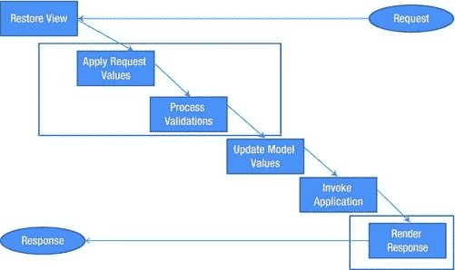
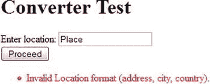
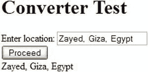
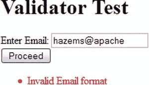
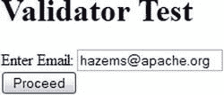
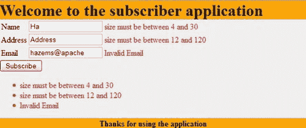

# 三、引擎盖下的 JSF——第二部分

JSF 转换和验证是 JSF 框架中最重要的主题之一，本章将详细介绍。本章说明了转换和验证在 JSF 请求处理生命周期中的工作原理。您将学习如何在您的 JSF 应用中使用和定制标准的 JSF 转换器和验证器，以及当标准的转换器和验证器不能完全满足应用的需求时，如何创建您自己的定制转换器和验证器。最后，您将了解如何利用 Java Bean Validation(JSR 303)API 来支持和标准化您的 JSF 应用验证。

JSF 生命周期中的转换和验证

正如我们从第一章中了解到的，转换是将 HTTP 请求参数转换为相应的 Java 类型，以消除开发人员为每个 web 应用实现该功能所需的开销，而验证是针对特定条件验证用户输入。JSF 生命周期中的转换和验证过程可以分三个阶段进行，如图图 3-1 所示。



图 3-1 。可能发生转换和验证的 JSF 阶段

下图说明了 JSF 转换和验证是如何在

1.  *流程验证阶段*，针对所有未将 immediate 属性设置为 true 的组件。
2.  *为 immediate=“真”的组件应用请求值阶段*。
3.  *渲染响应阶段*。

在流程验证阶段和应用请求值阶段，都会发生从 HTTP 请求字符串到 Java 类型的转换(使用 JSF 转换器接口中的 getAsObject API)，然后执行 JSF 验证。在呈现响应阶段，会发生从 Java 类型到字符串的转换(使用 JSF 转换器接口中的 getAsString API ),以便为呈现做好准备。

 **注意**注意，immediate 属性既可以应用于 UICommand 组件(如 CommandButton 和 CommandLink)，也可以应用于 EditableValueHolder 组件(如 inputText)。

转换可以应用于所有 ValueHolder 组件(这包括 UIOutput 和 UIInput—它扩展了 ui output—组件)，而验证只能应用于 EditableValueHolder 组件(这包括 ui input 组件)。在接下来的部分中，将详细说明 JSF 转换和验证。

转换

为了理解 JSF 转换，我们需要知道三个主题:转换器接口 API，标准 JSF 转换器，以及最后如何在 JSF 构建一个定制的转换器。接下来的小节将详细阐述这些主题。

转换器接口

所有 JSF 转换器都必须实现 javax.faces.convert.Converter 接口。Converter 接口描述了一个 Java 类，该类可以在模型数据对象和适合于呈现的这些模型对象的字符串表示之间执行对象到字符串和字符串到对象的转换。清单 3-1 显示了 JSF 转换器接口。

***清单 3-1。*** JSF 转换器界面

```html
package javax.faces.convert;

import javax.faces.component.UIComponent;
import javax.faces.context.FacesContext;

public interface Converter {

    public Object getAsObject(FacesContext context, UIComponent component, String value);

    public String getAsString(FacesContext context, UIComponent component, Object value);
}
```

如转换器接口所示，它包含两个 API:

第一个 API 是 getAsObject，，它执行字符串到对象的转换；可以在流程验证阶段(或应用请求值阶段)调用此 API。它有三个参数:

1.  上下文，表示此请求的 JSF FacesContext 实例。
2.  component，它表示其值将被转换的组件。如果转换器需要使用组件属性，可以使用这个组件实例来检索组件属性。
3.  值，它表示要转换为对象的字符串值。

第二个 API 是 getAsString，，它执行对象到字符串的转换；这个 API 在渲染响应阶段被调用。它需要三个参数:

1.  上下文，表示此请求的 JSF FacesContext 实例。
2.  component，它表示其值将被转换的组件。如果转换器需要使用组件属性，可以使用这个组件实例来检索组件属性。
3.  值，它表示要转换为字符串的对象值。

每个组件可以有一个或多个转换器。如果由于错误导致转换无法执行，转换器必须抛出 converter exception；在这种情况下，拥有转换器的组件将被标记为无效，ConverterException 消息将被接收并添加到 FacesContext 消息中，以便由< h:message >和< h:messages >组件显示。清单 3-2 展示了一个例子，说明了 JSF 转换是如何为带有附加转换器的多个值持有者组件工作的。

***清单 3-2。*** 多个 ValueHolder 组件的转换示例

```html
<h:form>
             <h1>Test form</h1>
             <h:outputText value="Enter First Number: "/>
             <h:inputText id="firstNumber"
                               value="#{testBean.firstNumber}">
                          <f:convertNumber/>
             </h:inputText>
             <h:message for="firstNumber"/>
             <br/>
             <h:outputText value="Enter Second Number: "/>
             <h:inputText id="secondNumber"
                               value="#{testBean.secondNumber}">
                          <f:convertNumber/>
             </h:inputText>
             <h:message for="secondNumber"/>
             <br/>
             <h:commandButton value="submit"/>
</h:form>
```

在这个例子中，我们有一个包含两个 inputText 组件的表单。每个 inputText 组件都有一个附属的<convertnumber>转换器。<f:convert Number/>converter 将用户在输入文本中输入的值转换为 Java Number 对象，然后与 TestBean 托管 Bean 的属性(firstNumber 和 secondNumber)绑定。如果用户在两个 inputText 组件中输入非数字值，然后单击“提交”按钮，用户将在附加到每个输入文本的两个< h:message/ >组件中看到两个转换错误消息。这是因为 JSF 转换(以及 JSF 验证)必须应用于每个具有转换器(和/或验证器)的组件，这意味着 JSF 验证过程(包括转换和验证)不能中途中止，因为框架必须一次性收集所有的错误消息。</convertnumber>

标准 JSF 转换器

现在，让我们深入了解 JSF 标准转换器的细节。表 3-1 显示了 JSF 标准转换器。

表 3-1 。JSF 标准转换器

| 

转换器 ID

 | 

描述

 |
| --- | --- |
| `javax.faces.Boolean` | 可以应用于`Boolean`和`boolean` Java 类型的隐式转换器。 |
| `javax.faces.Byte` | 可以应用于`Byte`和`byte` Java 类型的隐式转换器。 |
| `javax.faces.Character` | 可以应用于`Character`和`char` Java 类型的隐式转换器。 |
| `javax.faces.Short` | 可以应用于`Short`和`short` Java 类型的隐式转换器。 |
| `javax.faces.Integer` | 可以应用于`Integer`和`int` Java 类型的隐式转换器。 |
| `javax.faces.Long` | 可以应用于`Long`和`long` Java 类型的隐式转换器。 |
| `javax.faces.Float` | 可以应用于`Float`和`float` Java 类型的隐式转换器。 |
| `javax.faces.Double` | 可以应用于`Double`和`double` Java 类型的隐式转换器。 |
| `javax.faces.BigDecimal` | 可以应用于`BigDecimal` Java 类型的隐式转换器。 |
| `javax.faces.BigInteger` | 可以应用于`BigInteger` Java 类型的隐式转换器。 |
| `javax.faces.Number` | 可用于将用户输入转换为`Number` Java 类型的显式转换器。 |
| `javax.faces.DateTime` | 可用于将用户输入转换为`java.util.Date` Java 类型的显式转换器。 |

如表所示，JSF 转换器有两种类型:

*   隐式转换器。
*   显式转换器。

隐式转换器自动应用于列出的值类型。例如，假设我们有下面的计算器管理 bean，如清单 3-3 所示。

***清单 3-3。*** 计算器托管豆

```html
import java.io.Serializable;
import javax.faces.bean.ManagedBean;
import javax.faces.bean.RequestScoped;

@ManagedBean
@RequestScoped
public class Calculator implements Serializable {
    private Double firstNumber;
    private Double secondNumber;
    private Double result;

    public Double getFirstNumber() {
        return firstNumber;
    }

    public void setFirstNumber(Double firstNumber) {
        this.firstNumber = firstNumber;
    }

    public Double getSecondNumber() {
        return secondNumber;
    }

    public void setSecondNumber(Double secondNumber) {
        this.secondNumber = secondNumber;
    }

    public Double getResult() {
        return result;
    }

    public void setResult(Double result) {
        this.result = result;
    }

    public String calculateSum() {
        result = firstNumber + secondNumber;

        return null;
    }
}
```

清单 3-4 显示了使用计算器管理 bean 的 XHTML 文件。

***清单 3-4。*** 计算器 XHTML 关联页面

```html
<?xml version='1.0' encoding='UTF-8' ?>
<!DOCTYPE html>
<html FontName">http://www.w3.org/1999/xhtml"
      xmlns:h="http://java.sun.com/jsf/html">

<h:head>
  <title>Calculator</title>
</h:head>

<h:body>
    <h:form>
        <h:panelGrid columns="2">
            <h:outputText value="First number:"/>
            <h:inputText id="fNumber"
                         value="#{calculator.firstNumber}"
                         required="true">
            </h:inputText>

            <h:outputText value="Second number:"/>
            <h:inputText id="sNumber"
                         value="#{calculator.secondNumber}"
                         required="true">
            </h:inputText>
        </h:panelGrid>

        <h:commandButton action="#{calculator.calculateSum}" value="Sum"/><br/>
        <h:outputText value="Result: #{calculator.result}"/>

    </h:form>
</h:body>
</html>
```

使用隐式 javax.faces.Double 转换器将#{calculator.firstNumber}和#{calculator.secondNumber}表达式转换为 Double 后，这两个表达式会自动绑定到 calculator 托管 bean 的 firstNumber 和 secondNumber 属性。与 Double 类型一样，隐式转换器也应用于 Boolean、Byte、Character、Short、Integer、Long、Float、BigDecimal 和 BigInteger Java 类型。

显式转换器必须显式地附加到组件上。目前，JSF 核心标签库提供了以下代表 JSF 显式转换器的标签:

*   <convertdatetime></convertdatetime>

<convertdatetime>converter 将输入字符串转换成任意指定格式的 java.util.Date 对象。清单 3-5 展示了一个包含 java.util.Date 属性的样例受管 bean。</convertdatetime>

***清单 3-5。*** 包含日期属性的托管 Bean 示例

```html
import java.io.Serializable;
import java.util.Date;
import javax.faces.bean.ManagedBean;
import javax.faces.bean.RequestScoped;

@ManagedBean
@RequestScoped
public class TestBean implements Serializable {
    // ...
    private Date birthDate;

    public Date getBirthDate() {
        return birthDate;
    }

    public void setBirthDate(Date birthDate) {
        this.birthDate = birthDate;
    }
    // ...
}
```

为了将输入字符串转换为“dd-MM-yyyy”格式的生日属性，您可以将<convertdatetime>附加到 EditableValueHolder 组件，如下所示:</convertdatetime>

```html
<h:outputText value="Date of birth:"/>
<h:inputText id="birthDate"
                  value="#{testBean.birthDate}"
                  required="true">
             <f:convertDateTime pattern="dd-MM-yyyy"/>
</h:inputText>
```

如果用户在“出生日期”字段中输入一个不能转换为“dd-MM-yyyy”格式的日期对象的值，将显示一条转换错误消息。清单 3-2 展示了一个< f:convertNumber >转换器的例子，它将输入字符串转换成一个 Java 数字对象。此外，它还有许多格式化功能。假设我们有 TestBean 管理的 bean #{testBean.someNumber}的 some number(Double 类型)属性，并且我们希望将其格式化为数字格式###，###。###;这可以通过使用< f:convertNumber >的模式属性来实现，如下所示:

```html
<h:outputText value="#{testBean.someNumber}">
             <f:convertNumber pattern="###,###.###"/>
</h:outputText>
```

假设#{testBean.someNumber}的计算结果为 123456.124(例如)，它将显示为 123，456.124。

 **注**你可以在[`docs . Oracle . com/javase/7/docs/API/Java/text/decimal format . html`](http://docs.oracle.com/javase/7/docs/api/java/text/DecimalFormat.html)了解更多关于 Java NumberFormat 的信息

如果我们只想显示#{testBean.someNumber}数字的两位小数，我们可以使用<convertnumber>标签的 maxFractionDigits 属性，如下所示:</convertnumber>

```html
<h:outputText value="#{testBean.someNumber}">
             <f:convertNumber maxFractionDigits="2"/>
</h:outputText>
```

例如，如果#{testBean.someNumber}的计算结果为 123456.124，它将显示为 123，456.12。

使用<convertnumber>的 currencyCode 和 type (="currency ")属性，我们可以将数字格式化为货币格式，如下所示:</convertnumber>

```html
<h:outputText value="#{testBean.someNumber}">
             <f:convertNumber currencyCode="EGP" type="currency"/>
</h:outputText>
```

例如，如果#{testBean.someNumber}的计算结果为 2000，它将显示为 EGP2，000.00。

 **注**货币代码在 ISO 4217 定义。你可以从 http://en.wikipedia.org/wiki/ISO_4217 得到货币代码的完整列表

使用<convertnumber>的 type="percent "属性，您可以将数字格式化为百分比。</convertnumber>

```html
<h:outputText value="#{testBean.someNumber}">
             <f:convertNumber type="percent"/>
</h:outputText>
```

例如，如果#{testBean.someNumber}的评估值为 0.3，它将显示为 30%。

 **注意**注意，您可以通过使用 EditableValueHolders 的 converterMessage 属性来覆盖不同的转换消息。例如:<h:input text id = " some number " value = " # { bean . some number } " converter message = "不是数字！！!"/ >

如果数字转换失败，将显示转换错误消息“不是数字”。

构建定制 JSF 转换器

除了 JSF 框架提供的所有提到的隐式和显式转换器，JSF 允许开发人员创建他们自己的自定义转换器。让我们看一个例子来说明这个想法。假设我们需要将用户输入字符串转换为位置对象。为了达到这个要求，我们需要开发一个定制的转换器(例如 LocationConverter ),它将输入字符串转换为位置对象，然后将位置对象转换为友好的字符串，该字符串可以在*呈现响应阶段*显示给最终用户。清单 3-6 显示了我们需要用户输入转换到的位置类。

***清单 3-6。*** 位置类

```html
package com.jsfprohtml5.example.model;

public class Location {
    private String address;
    private String city;
    private String country;

    public Location() {
    }

    public Location(String address, String city, String country) {
        this.address = address;
        this.city = city;
        this.country = country;
    }

    public String getAddress() {
        return address;
    }

    public void setAddress(String address) {
        this.address = address;
    }

    public String getCity() {
        return city;
    }

    public void setCity(String city) {
        this.city = city;
    }

    public String getCountry() {
        return country;
    }

    public void setCountry(String country) {
        this.country = country;
    }
}
```

Location 类是一个简单的 Java bean，包含三个属性(地址、城市、国家)。为了实现我们的 LocationConverter 自定义转换器，我们需要扩展 JSF 转换器接口并实现 getAsObject 和 getAsString 方法。清单 3-7 显示了 LocationConverter 的实现。

***清单 3-7。*** LocationConverter 类

```html
package com.jsfprohtml5.example.converters;

import com.jsfprohtml5.example.model.Location;
import javax.faces.application.FacesMessage;
import javax.faces.component.UIComponent;
import javax.faces.context.FacesContext;
import javax.faces.convert.Converter;
import javax.faces.convert.ConverterException;
import javax.faces.convert.FacesConverter;

@FacesConverter("com.jsfprohtml5.LocationConverter")
public class LocationConverter implements Converter {

    @Override
    public Object getAsObject(FacesContext context, UIComponent component, String value) {

        if (null == value || 0 == value.length()) {
            return null;
        }

        String locationParts[] = value.split(",");

        if (locationParts.length != 3
             || locationParts[0].length() == 0
               || locationParts[1].length() == 0
                 || locationParts[2].length() == 0) {

            FacesMessage message = new FacesMessage("Invalid Location format (address, city, country).",
                                                  "Use the following format {address, city, country)}.");

                 message.setSeverity(FacesMessage.SEVERITY_ERROR);

            throw new ConverterException(message);
        }

        String address = locationParts[0];
        String city = locationParts[1];
        String country = locationParts[2];

        Location location = new Location(address, city, country);

        return location;
    }

    @Override
    public String getAsString(FacesContext context, UIComponent component, Object value) {

        Location location = (Location) value;

        return location.getAddress() + ", " +
               location.getCity() + ", " +
               location.getCountry();
    }

}
```

在*流程验证阶段*(或*应用请求值阶段*)调用的 getAsObject()方法中，来自输入字符串的转换被转换为 location 对象，其类在清单 3-6 中提到，如粗体行所示，如果输入字符串不符合 Location 格式规范，则抛出一个 ConverterException，并显示一条 faces 错误消息。位置格式被指定为以下形式:

```html
Address, City, Country
```

在*渲染响应阶段*调用的 getAsString()方法中，执行从位置对象到输出渲染字符串的转换。注意@FacesConverter 注释很重要，它用于在 JSF 应用中注册转换器。 @FacesConverter 注释有两个主要属性:value()属性，作为转换器 ID；for class()属性，作为类的转换器。在本例中，我们只使用了 value()属性，并将转换器 ID 声明为“com . jsfprohtml 5 . location converter”。

不使用@FacesConverter 批注，您可以在 JSF faces-config.xml 文件中声明转换器，如下所示:

```html
<faces-config ...>
    <converter>
        <converter-id>com.jsfprohtml5.LocationConverter</converter-id>
        <converter-class>com.jsfprohtml5.example.converters.LocationConverter</converter-class>
    </converter>
</faces-config>
```

现在，让我们看看如何在 JSF 应用中使用 LocationConverter。清单 3-8 显示了 TestBean 管理的 bean ，它包括一个位置属性(Location)。

***清单 3-8。*** TestBean 托管 Bean 类

```html
package com.jsfprohtml5.example.model;

import java.io.Serializable;
import java.util.Date;
import javax.faces.bean.ManagedBean;
import javax.faces.bean.RequestScoped;

@ManagedBean
@RequestScoped
public class TestBean implements Serializable {
    // ...
    private Location location;
    // ...
    public Location getLocation() {
        return location;
    }
    public void setLocation(Location location) {
        this.location = location;
    }
    // ...
    public String proceed() {
        return null;
    }
}
```

清单 3-9 显示了 LocationConverter 转换器的 XHTML 测试页面。

***清单 3-9。***location converter XHTML 测试页面

```html
<?xml version='1.0' encoding='UTF-8' ?>
<!DOCTYPE html>
<html FontName">http://www.w3.org/1999/xhtml"
      xmlns:h="http://java.sun.com/jsf/html"
      xmlns:f="http://java.sun.com/jsf/core">

<h:head>
  <title>Location Converter Test</title>
</h:head>

<h:body>
    <h:form>
        <h1>Converter Test</h1>
        <h:outputText value="Enter location: "/>
        <h:inputText id="location"
                     value="#{testBean.location}"
                     required="true">
            <f:converter converterId="com.jsfprohtml5.LocationConverter" />
        </h:inputText>
        <br/>
        <h:commandButton action="#{testBean.proceed}" value="Proceed"/><br/>
        <h:outputText value="#{testBean.location}">
            <f:converter converterId="com.jsfprohtml5.LocationConverter" />
        </h:outputText>
<h:messages style="color: red"/>
    </h:form>
</h:body>
</html>
```

如粗体行所示，在转换器测试页面中，有一个输入文本和一个输出文本，它们使用了 LocationConverter 的<converter>标签。<converter>标签是一个核心标签，主要是为了避免为每个自定义转换器创建 TLD(标签库描述符)而设计的。将自定义转换器的 ID(在@FacesConverter 注释中定义)传递给<converter>标记的 converterId 属性会将自定义转换器附加到父 ValueHolder 组件。</converter></converter></converter>

图 3-2 显示了当用户输入不符合位置(地址、城市、国家)格式的无效位置信息时将显示的转换错误。



图 3-2 。LocationConverter 错误消息

图 3-3 显示了当用户输入符合位置(地址、城市、国家)格式的有效位置信息时，LocationConverter 的行为。



图 3-3 。输入和输出文本的 LocationConverter 行为

验证

为了理解 JSF 验证，我们需要知道四个主题:验证器接口 API，标准的 JSF 验证器，如何在 JSF 构建一个定制的验证器，以及最后如何使用 Java Bean 验证(JSR 303)API。接下来的小节将详细阐述这些主题。

验证器接口

Java x . faces . validator . validator 接口是 JSF 验证器的核心接口。JSF 验证器接口描述了一个可以对 EditableValueHolder 组件执行验证(检查正确性)的 Java 类。单个 EditableValueHolder 在视图中可以有零个或多个验证器。清单 3-10 显示了 JSF 验证器接口。

***清单 3-10。*** JSF 验证器界面

```html
package javax.faces.validator;

import java.util.EventListener;
import javax.faces.component.UIComponent;
import javax.faces.context.FacesContext;

public interface Validator extends EventListener {

    //...
    public void validate(FacesContext context, UIComponent component, Object value) throws ValidatorException;
}
```

如验证器接口所示，它包含一个 API。validate API 对父 EditableValueHolder 组件的值执行所需的验证；这个 API 可以在 *流程验证阶段*中调用(或者在*应用请求值阶段*中调用，如果 EditableValueHolder 的 immediate 属性设置为 true)。validate() API 有三个参数:

1.  上下文，表示此请求的 JSF FacesContext 实例。
2.  组件，它表示其值将被验证的组件。如果验证器需要使用组件属性，可以使用这个组件实例来检索组件属性。
3.  值，它表示要验证的字符串值。

对于每个有验证器(或更多)的组件。如果验证失败，验证器必须抛出 ValidatorException 在这种情况下，拥有验证器的组件将被标记为无效，ValidatorException 消息将被接收并添加到 FacesContext 消息中，以便由与 EditableValueHolder 组件关联的< h:message >组件和< h:messages >组件显示。

清单 3-11 展示了一个例子来说明如何对多个带有验证器的 EditableValueHolder 组件进行验证。请注意，在本例中，number1 和 number2 是 TestBean 管理的 Bean 中的属性，属于 Long 类型。

***清单 3-11。*** 多个 EditableValueHolder 组件的验证示例

```html
<h:form>
             <h:outputText value="Enter Number1: "/>
             <h:inputText id="number1"
                          value="#{testBean.number1}">
                                       <f:validateRequired/>
                                       <f:validateLongRange minimum="0" maximum="999"/>
             </h:inputText>
             <h:message for="number1"/>

             <br/>
             <h:outputText value="Enter Number2: "/>
             <h:inputText id="number2"
                          required="true"
                          value="#{testBean.number2}">
                                       <f:validateLongRange minimum="0" maximum="999"/>
             </h:inputText>
             <h:message for="number2"/>
             <br/>
             <h:commandButton value="submit"/>
</h:form>
```

我们有一个包含两个 inputText 组件(number1 和 number2)的表单。每个 inputText 组件都有两个附加的验证器。每个输入文本都有以下验证器:

1.  < f:validateRequired >，用于验证 EditableValueHolder 组件不会包含空输入(使用 required="true "属性效果相同)。
2.  < f:validateLongRange >，用于验证长整型字段的值是否在指定的范围内(最小值和最大值)。

<validatelongrange>在示例中用于验证两个输入文本的最小值都等于 0，最大值都等于 999。如果用户在两个 inputText 组件中输入空值或超出范围的值，然后单击“提交”命令按钮，用户将在两个<message>组件中看到两个与每个 inputText 组件相关联的验证错误消息。这解释了我们之前所说的，JSF 中的验证(像转换)必须被应用到每一个有一个或多个验证器的组件。</message></validatelongrange>

标准 JSF 验证器

现在，让我们深入 JSF 标准验证器的细节。表 3-2 显示了 JSF 标准验证器。

表 3-2 。JSF 标准验证器

| 

验证器标签

 | 

描述

 |
| --- | --- |
| `<f:validateRequired>` | 用于验证`EditableValueHolder`(如输入文本)值是必需的。设置`required="true"`属性具有相同的效果。 |
| `<f:validateLongRange>` | 用于验证长整型的`EditableValueHolder`值是否在指定范围内。 |
| `<f:validateDoubleRange>` | 用于验证双精度的`EditableValueHolder`值是否在指定范围内。 |
| `<f:validateLength>` | 用于验证`EditableValueHolder`值是否在指定的长度范围内。 |
| `<f:validateRegex>` | 用于验证`EditableValueHolder`值是否符合指定的 Java 正则表达式。 |
| `<f:validateBean>` | 用于将`EditableValueHolder`本地值验证分配给 Java Bean 验证(JSR 303)API。 |

我们已经在清单 3-11 中看到了<validaterequired>和<validatelongrange>验证器的例子。< f:validateDoubleRange >与< f:validateLongRange >相同；然而，它与 Double 而不是 Long 一起工作。< f:validateLength >验证器用于验证 EditableValueHolder 值是否在指定的长度范围内。例如:</validatelongrange></validaterequired>

```html
<h:inputText id="address"
                      required="true"
                 value="#{person.address}">
                          <f:validateLength minimum="20" maximum="120"/>
</h:inputText>
```

如本例所示，在“address”输入文本中使用<validatelength>验证器验证 person managed bean 的 address 属性，其长度最少为 20 个字符，最多为 120 个字符。</validatelength>

<validateregex>validator 用于验证 EditableValueHolder 值是否符合指定的 Java 正则表达式。</validateregex>

```html
<h:inputText id="email"
     required="true"
     value="#{person.email}">
                  <f:validateRegex pattern="(.+@.+\.[a-zA-Z]+)?"/>
</h:inputText>
```

如本例所示，使用“(”验证 person managed bean 的 email 属性是否具有有效的电子邮件。+@.+\.[a-zA-Z]+)？”“email”输入文本的<validateregex>验证器的模式字段中的正则表达式。</validateregex>

<validatebean>validator 用于将 EditableValueHolder 本地值验证分配给 Java Bean 验证 API(JSR 303)。我们将在“用 JSF 验证 JSR 303 Bean”一节中详细介绍这个验证器。</validatebean>

您可以对必填字段验证错误消息使用 EditableValueHolder 的 requiredMessage 属性，或者对 EditableValueHolder 上的常规验证错误消息使用 validatorMessage 属性来覆盖验证消息。例如:

```html
<h:inputText id="someNumber"
                       value="#{bean.someNumber}"
                       required="true"
                    requiredMessage="You have to enter a number"
                    validatorMessage="Number has to be minimum 10 and maximum 100">
             <f:validateLongRange minimum="10" maximum="100"/>
</h:inputText>
```

如果用户没有在输入文本中输入值，将显示必填字段验证错误消息“您必须输入一个数字”，如果用户输入的数字超出范围(小于 10 或大于 100)，将显示验证消息“数字必须最小为 10，最大为 100”。

构建自定义 JSF 验证器

除了 JSF 框架提供的所有提到的内置验证器，JSF 允许开发者创建他们自己的定制验证器。让我们看一个例子来说明这一点。假设我们想要一个 EmailValidator 自定义验证器，它验证用户输入是否符合电子邮件格式。

为了实现我们的 EmailValidator 自定义验证器，我们需要扩展验证器接口并实现 validate 方法。清单 3-12 展示了 EmailValidator 的实现。

***清单 3-12。*** EmailValidator 类

```html
package com.jsfprohtml5.example.validators;

import java.util.regex.Matcher;
import java.util.regex.Pattern;
import javax.faces.application.FacesMessage;
import javax.faces.component.UIComponent;
import javax.faces.context.FacesContext;
import javax.faces.validator.FacesValidator;
import javax.faces.validator.Validator;
import javax.faces.validator.ValidatorException;

@FacesValidator("com.jsfprohtml5.EmailValidator")
public class EmailValidator implements Validator {
    private static final String EMAIL_REGEX = "(.+@.+\\.[a-zA-Z]+)?";

    private Pattern pattern;
    private Matcher matcher;

    public EmailValidator() {
        pattern = Pattern.compile(EMAIL_REGEX);
    }

    @Override
    public void validate(FacesContext context,
                         UIComponent component,
                         Object value)
                         throws ValidatorException {

        matcher = pattern.matcher(value.toString());

        if (! matcher.matches()) {
            FacesMessage message = new FacesMessage("Invalid Email format",
                                                   "Use for example: xyz@company.com");

                 message.setSeverity(FacesMessage.SEVERITY_ERROR);

            throw new ValidatorException(message);
        }
    }
}
```

在*流程验证阶段*(或*应用请求值阶段*)调用的 validate()方法中，会发生验证，如粗体行所示，如果输入字符串不符合电子邮件格式，则会抛出一个 ValidatorException 和一条 Faces 错误消息。注意@FacesValidator 注释很重要，它用于注册验证器。@FacesValidator 注释有一个主要属性，即 value()属性，它被视为验证器的 ID。对于本例，我们使用 value()属性，并将验证器 ID 声明为“com.jsfprohtml5.EmailValidator”。

不使用@FacesValidator 批注，您可以在 JSF faces-config.xml 文件中声明验证器，如下所示:

```html
<faces-config ...>
    ...
    <validator>
        <validator-id>com.jsfprohtml5.EmailValidator</validator-id>
        <validator-class>com.jsfprohtml5.example.validators.EmailValidator</validator-class>
    </validator>
  ...
</faces-config>
```

现在，让我们看看如何在 JSF 应用中使用 EmailValidator。清单 3-13 显示了 TestBean 管理的 Bean 的更新版本(最初显示在清单 3-8 中)，它包括一个类型为(String)的 email 属性。

***清单 3-13。***test Bean 托管 Bean 的更新版本

```html
public class TestBean implements Serializable {
    // ...
    private String email;

    // ...
    public String getEmail() {
        return email;
    }
    public void setEmail(String email) {
        this.email = email;
    }
    // ...
}
```

清单 3-14 显示了 EmailValidator 验证器 XHTML 测试页面。

***清单 3-14。*** EmailValidator XHTML 测试页面

```html
<?xml version='1.0' encoding='UTF-8' ?>
<!DOCTYPE html>
<html FontName">http://www.w3.org/1999/xhtml"
      xmlns:h="http://java.sun.com/jsf/html"
      xmlns:f="http://java.sun.com/jsf/core">
<h:head>
  <title>Email Validator Test</title>
</h:head>
<h:body>
   <h:form>
        <h1>Validator Test</h1>

             <h:outputText value="Enter Email: "/>
             <h:inputText id="email"
                     value="#{testBean.email}" required="true">
            <f:validator validatorId="com.jsfprohtml5.EmailValidator"/>
             </h:inputText>
        <br/>
        <h:commandButton action="#{testBean.proceed}" value="Proceed"/><br/>
        <h:messages style="color: red"/>
    </h:form>
</h:body>
</html>
```

如粗体行所示，在测试页面中，有一个使用 EmailValidator 和<validator>标签的输入文本。<validator>标签是一个核心标签，主要是为了避免为每个定制验证器创建一个 TLD 而设计的。将@FacesValidator 注释中定义的自定义验证器的 ID 传递给<validator>标记的 validatorId 属性，会将自定义验证器附加到父 EditableValueHolder 组件。</validator></validator></validator>

图 3-4 显示了当用户输入不符合电子邮件格式要求的无效电子邮件时将显示的验证错误。



图 3-4 。EmailValidator 错误消息

图 3-5 显示了当用户输入符合电子邮件格式要求的有效电子邮件信息时，EmailValidator 的行为。



图 3-5 。EmailValidator 有效表单

JSR 303 与 JSF 比恩验证

Java EE 6 中引入了 JSR 303 Bean 验证，以便在 Java 企业应用中支持构建验证。JSR 303 自带内置的验证器(约束)，比如@NotNull、@Min、@Max、@Past、@Future、@Size 等。，它还允许在应用域模型上(或者通常在 POJO 上)创建自定义约束。除了 JSF 内置和自定义验证器，从 JSF 2.0 开始，JSF 和 JSR 303 Java Bean 验证 API 之间有了默认的集成。在接下来的小节中，这种集成将在一个示例订阅者应用中进行说明。

在订阅应用中，用户可以保存姓名、地址和电子邮件进行订阅，如图图 3-6 所示。


图 3-6 。订户应用

用户信息验证如下:

1.  所有字段都是必填的。
2.  用户名必须至少为 4 个字符，最多为 30 个字符。
3.  地址必须至少为 12 个字符，最多为 120 个字符。
4.  电子邮件必须有效。

从技术上讲，我们将使用 JSF 必填字段验证器来实现第一个验证需求。所有其他验证都将使用 JSR 303 API 来实现。在验证需求 2 和 3 中，将使用 JSR 303 @Size 注释，而对于需求 4，我们将实现一个定制的 JSR 303 约束。清单 3-15 显示了一个在应用主 XHTML 页面中使用的个人管理 bean。

***清单 3-15。*** 人管豆

```html
package com.jsfprohtml5.subscriber.model;

import com.jsfprohtml5.subscriber.bean.validation.custom.EmailAddress;
import java.io.Serializable;
import javax.faces.bean.ManagedBean;
import javax.faces.bean.RequestScoped;
import javax.validation.constraints.Size;

@ManagedBean
@RequestScoped
public class Person implements Serializable {

    @Size(min = 4, max = 30)
    private String name;

    @Size(min = 12, max = 120)
    private String address;

    @EmailAddress
    private String email;

    public Person() {
    }

    public String subscribe() {
        return null;
    }

    public String getName() {
        return name;
    }
    public void setName(String name) {
        this.name = name;
    }

    public String getAddress() {
        return address;
    }
    public void setAddress(String address) {
        this.address = address;
    }

    public String getEmail() {
        return email;
    }
    public void setEmail(String email) {
        this.email = email;
    }
}
```

如粗体行所示，为了控制姓名和地址字段的大小，我们使用了@size 内置 Java Bean 验证注释。@size 注释主要有两个属性，min 和 max，用来验证注释字段的长度。@EmailAddress 注释是一个自定义约束，我们用它来验证 Person managed bean 的 email 属性。清单 3-16 显示了@EmailAddress 注释的代码。

***清单 3-16。*** @EmailAddress 注释

```html
package com.jsfprohtml5.subscriber.bean.validation.custom;

import java.lang.annotation.Documented;
import java.lang.annotation.ElementType;
import java.lang.annotation.Retention;
import java.lang.annotation.RetentionPolicy;
import java.lang.annotation.Target;
import javax.validation.Constraint;
import javax.validation.Payload;

@Target({ElementType.FIELD, ElementType.METHOD})
@Constraint(validatedBy = EmailValidator.class)
@Retention(RetentionPolicy.RUNTIME)
@Documented
public @interface EmailAddress {
    String message() default "{email.invalid}";

    Class<?>[] groups() default {};

    Class<? extends Payload>[] payload() default {};
}
```

如果您熟悉 Java 注释，使用@接口，您可以创建一个注释类型。@Target annotation 表示注释类型适用的 Java 程序元素(在本例中，这些元素是 Java 字段和方法)。Java Bean 验证规范(JSR 303)要求任何约束注释都要定义以下属性:

1.  消息属性，默认情况下应该返回错误消息。它可以返回实际的错误信息文本，也可以通过使用如下的花括号“{key}”来返回错误信息密钥。在前面的代码清单中，它返回 email.invalid key。
2.  groups 属性，允许指定该约束所属的验证组。
3.  payload 属性，Java Bean Validation API 的客户端可以使用它将定制的有效负载对象分配给一个约束(超出了本书的范围)。

@Constraint 批注是一个 Java Bean 验证批注，它引用使用 validatedBy 属性执行验证逻辑的类。清单 3-17 展示了 EmailValidator 验证类的实现。

***清单 3-17。*** EmailValidator 验证类

```html
package com.jsfprohtml5.subscriber.bean.validation.custom;

import java.util.regex.Matcher;
import java.util.regex.Pattern;
import javax.validation.ConstraintValidator;
import javax.validation.ConstraintValidatorContext;

public class EmailValidator implements ConstraintValidator<EmailAddress, String> {
    private static final String EMAIL_REGEX = "(.+@.+\\.[a-zA-Z]+)?";

    private Pattern pattern;
    private Matcher matcher;

    @Override
    public void initialize(EmailAddress constraintAnnotation) {
        pattern = Pattern.compile(EMAIL_REGEX);
    }

    @Override
    public boolean isValid(String value, ConstraintValidatorContext context) {
        matcher = pattern.matcher(value);

        if (! matcher.matches()) {
            return false;
        }

        return true;
    }
}
```

正如你会注意到的，EmailValidator 约束与我们在清单 3-12 中开发的 JSF EmailValidator 类具有相同的逻辑。然而，有一个主要的区别:在 JSF 验证器中，当验证失败时，验证器抛出异常，但是在 Java Bean 验证中，验证器返回 false。initialize()方法用于初始化自定义约束；值得注意的是，这个方法保证在任何其他约束实现方法之前被调用。

现在，在构建了自定义约束之后，我们就可以在我们的 JSF XHTML 页面中使用内置和自定义约束了。清单 3-18 显示了订阅者应用主页(index.xhtml)。

***清单 3-18。*** 订阅者应用 XHTML 页面

```html
<?xml version='1.0' encoding='UTF-8' ?>
<!DOCTYPE html>
<html FontName">http://www.w3.org/1999/xhtml"
      xmlns:ui="http://java.sun.com/jsf/facelets"
      xmlns:h="http://java.sun.com/jsf/html"
      xmlns:f="http://java.sun.com/jsf/core">

<ui:composition template="/WEB-INF/templates/default.xhtml">
    <ui:define name="title">
        #{bundle['application.subscriber.title']}
    </ui:define>
    <ui:define name="content">
        <h:form>
            <h:panelGrid columns="3">
                <h:outputText value="#{bundle['user.name']}"></h:outputText>
                <h:inputText id="userName"
                             value="#{person.name}"
                             required="true"
                             requiredMessage="#{bundle['user.name.required']}">

                </h:inputText>
                <h:message for="userName" styleClass="errorMessage"/>

                <h:outputText value="#{bundle['user.address']}"></h:outputText>
                <h:inputText id="address"
                             value="#{person.address}"
                             required="true"
                             requiredMessage="#{bundle['user.address.required']}">

                </h:inputText>
                <h:message for="address" styleClass="errorMessage"/>

                <h:outputText value="#{bundle['user.email']}"></h:outputText>
                <h:inputText id="email"
                             value="#{person.email}"
                             required="true"
                             requiredMessage="#{bundle['user.email.required']}">

                </h:inputText>
                <h:message for="email" styleClass="errorMessage"/>
            </h:panelGrid>

            <h:commandButton value="#{bundle['application.subscribe']}"
                             action="#{person.subscribe}">
            </h:commandButton>

            <br/>

            <h:messages styleClass="errorMessage"/>
        </h:form>
    </ui:define>
</ui:composition>

</html>
```

正如我们在代码清单中注意到的，我们没有做什么特别的事情；我们对所有字段使用了 JSF 必需字段验证器。值得注意的是，所有内置或定制的 JSR 303 验证器(@Size 和@EmailValidator)将自动应用于 JSF 组件，而无需任何额外的步骤。如图 3-7 所示，Java Bean 验证错误会自动附加到 JSF < h:message >和< h:messages >组件上。



图 3-7 。JSF 消息组件中的 Java Bean 验证错误

默认情况下，所有的 Java Bean 验证(JSR 303)验证器将在 JSF 管理的 Bean 中自动启用；为了禁用此行为，可以将 web.xml 中的 javax . faces . VALIDATOR . disable _ DEFAULT _ BEAN _ VALIDATOR 上下文参数设置为 true，如下所示:

```html
<context-param>
             <param-name>javax.faces.validator.DISABLE_DEFAULT_BEAN_VALIDATOR</param-name>
             <param-value>true</param-value>
</context-param>
```

值得注意的一点是，Java Bean Validation 是一个独立的验证框架，它不是 JavaServer Faces 框架的一部分(尽管它们之间有很好的集成，正如我们在订阅者应用中看到的)；这意味着您需要为 Java Bean 验证消息提供一个单独的属性文件。根据 JSR 303，这个属性文件应该命名为 ValidationMessages.properties，并带有处理不同语言环境的语言环境变量，Java Bean 验证属性文件应该放在 JSF 应用的默认包(类路径的根)下。

 **注**涵盖 JSR 303 的全部特性不在本书讨论范围之内；你可以在 http://jcp.org/en/jsr/detail?id=303 的[阅读完整的 JSR 303 规范。](http://jcp.org/en/jsr/detail?id=303)

清单 3-15 中的所有验证字段都属于 Java Bean 验证框架的默认验证组；但是，您可以选择为同一个约束条件指定多个验证组。验证组只不过是一个标记接口。让我们创建两个名为(LengthGroup)和(EmailGroup)的验证组。LengthGroup 将在个人管理的 bean 中对长度约束进行分组(@Size constraints)，而 EmailGroup 将在个人管理的 bean 中包含电子邮件约束(@EmailAddress constraint)。然后将验证组附加到约束上，如清单 3-19 所示。

***清单 3-19。*** 亲自验证团体托管豆

```html
@ManagedBean
@RequestScoped
public class Person implements Serializable {

    @Size(min = 4, max = 30, groups = LengthGroup.class)
    private String name;

    @Size(min = 12, max = 120, groups = LengthGroup.class)
    private String address;

    @Size(min = 5, max = 30, groups = LengthGroup.class)
    @EmailAddress(groups = EmailGroup.class)
    private String email;

    public Person() {
    }

    public String subscribe() {
        return null;
    }

    public String getName() {
        return name;
    }
    public void setName(String name) {
        this.name = name;
    }

    public String getAddress() {
        return address;
    }
    public void setAddress(String address) {
        this.address = address;
    }

    public String getEmail() {
        return email;
    }
    public void setEmail(String email) {
        this.email = email;
    }
}
```

默认情况下，JSF 执行分组在默认验证组下的约束。为了在 EditableValueHolder 上运行特定的验证组，JSF 提供了一个<validatebean>标签，可以用来选择在父 EditableValueHolder 上执行哪些验证组。这个特性对输入字段验证的级别提供了很好的控制。清单 3-20 显示了订阅者应用更新后的 index.xhtml。</validatebean>

***清单 3-20。***更新 index.xhtml 页面

```html
<?xml version='1.0' encoding='UTF-8' ?>
<!DOCTYPE html>
<html FontName">http://www.w3.org/1999/xhtml"
      xmlns:ui="http://java.sun.com/jsf/facelets"
      xmlns:h="http://java.sun.com/jsf/html"
      xmlns:f="http://java.sun.com/jsf/core">

<ui:composition template="/WEB-INF/templates/default.xhtml">
    <ui:define name="title">
        #{bundle['application.subscriber.title']}
    </ui:define>
    <ui:define name="content">
        <h:form>
            <h:panelGrid columns="3">
                <h:outputText value="#{bundle['user.name']}"></h:outputText>
                <h:inputText id="userName"
                             value="#{person.name}"
                             required="true"
                             requiredMessage="#{bundle['user.name.required']}">

                    <f:validateBean
validationGroups="com.jsfprohtml5.subscriber.bean.validation.groups.LengthGroup"/>
                </h:inputText>
                <h:message for="userName" styleClass="errorMessage"/>

                <h:outputText value="#{bundle['user.address']}"></h:outputText>
                <h:inputText id="address"
                             value="#{person.address}"
                             required="true"
                             requiredMessage="#{bundle['user.address.required']}">

                    <f:validateBean
validationGroups="com.jsfprohtml5.subscriber.bean.validation.groups.LengthGroup"/>
                </h:inputText>
                <h:message for="address" styleClass="errorMessage"/>

                <h:outputText value="#{bundle['user.email']}"></h:outputText>
                <h:inputText id="email"
                             value="#{person.email}"
                             required="true"
                             requiredMessage="#{bundle['user.email.required']}">

                    <f:validateBean
validationGroups="com.jsfprohtml5.subscriber.bean.validation.groups.LengthGroup,
com.jsfprohtml5.subscriber.bean.validation.groups.EmailGroup"/>

                </h:inputText>
                <h:message for="email" styleClass="errorMessage"/>
            </h:panelGrid>

            <h:commandButton value="#{bundle['application.subscribe']}"
                             action="#{person.subscribe}">
            </h:commandButton>

            <br/>

            <h:messages styleClass="errorMessage"/>
        </h:form>
    </ui:define>
</ui:composition>

</html>
```

如粗体行所示，<validatebean>标签可以附加到 EditableValueHolders，上，并使用 validationGroups 属性，您可以指定要在父 EditableValueHolder 上执行的约束类的全限定名称(用逗号分隔)。</validatebean>

 **注**订阅者应用的完整 Maven 项目包含在本书网页[【apress.com】](http://apress.com)*第三章* 资源下。

覆盖标准消息

为了获得更好的用户体验，覆盖标准转换和验证错误消息总是有用的。虽然您可以通过使用 EditableValueHolder 组件的 validatorMessage、requiredMessage 和 converterMessage 属性来自定义转换和验证错误消息，但与在每个 EditableValueHolder 组件上相比，在应用级别上全局覆盖 JSF 标准转换和验证消息需要更少的工作量和更高的准确性。

为了全局覆盖 JSF 标准转换和验证消息，您必须使用标准消息关键字来覆盖应用消息包中的消息。表 3-3 显示了根据 JSF 规范的可能的 JSF 标准消息键。

表 3-3 。根据 JSF 规范的 JSF 标准消息密钥

| 

钥匙

 | 

默认消息

 |
| --- | --- |
| `javax.faces.component.UIInput.CONVERSION` | {0}:出现转换错误。 |
| `javax.faces.component.UIInput.REQUIRED` | {0}:验证错误:值是必需的。 |
| `javax.faces.component.UIInput.UPDATE` | {0}:处理您提交的信息时出错。 |
| `javax.faces.component.UISelectOne.INVALID` | {0}:验证错误:值无效 |
| `javax.faces.component.UISelectMany.INVALID` | {0}:验证错误:值无效 |
| `javax.faces.converter.BigDecimalConverter.DECIMAL` | { 2 }:“{ 0 }”必须是有符号的十进制数。 |
| `javax.faces.converter.BigDecimalConverter.DECIMAL_detail` | { 2 }:“{ 0 }”必须是由零个或多个数字组成的有符号十进制数，后面可以跟一个小数点和分数。示例:{1} |
| `javax.faces.converter.BigIntegerConverter.BIGINTEGER` | { 2 }:“{ 0 }”必须是由一个或多个数字组成的数字。javax . faces . converter . biinteger converter . big integer _ detail = { 2 }:“{ 0 }”必须是由一个或多个数字组成的数字。示例:{1} |
| `javax.faces.converter.BooleanConverter.BOOLEAN` | { 1 }:“{ 0 }”必须为“true”或“false”。 |
| `javax.faces.converter.BooleanConverter.BOOLEAN_detail` | { 1 }:“{ 0 }”必须为“true”或“false”。除“true”之外的任何值都将计算为“false”。 |
| `javax.faces.converter.ByteConverter.BYTE` | { 2 }:“{ 0 }”必须是 0 到 255 之间的数字。 |
| `javax.faces.converter.ByteConverter.BYTE_detail` | { 2 }:“{ 0 }”必须是 0 到 255 之间的数字。示例:{1} |
| `javax.faces.converter.CharacterConverter.CHARACTER` | { 1 }:“{ 0 }”必须是有效字符。 |
| `javax.faces.converter.CharacterConverter.CHARACTER_detail` | { 1 }:“{ 0 }”必须是有效的 ASCII 字符。 |
| `javax.faces.converter.DateTimeConverter.DATE` | { 2 }:“{ 0 }”无法被理解为日期。 |
| `javax.faces.converter.DateTimeConverter.DATE_detail` | { 2 }:“{ 0 }”无法被理解为日期。示例:{1} |
| `javax.faces.converter.DateTimeConverter.TIME` | { 2 }:“{ 0 }”无法被理解为时间。 |
| `javax.faces.converter.DateTimeConverter.TIME_detail` | { 2 }:“{ 0 }”无法被理解为时间。示例:{1} |
| `javax.faces.converter.DateTimeConverter.DATETIME` | { 2 }:“{ 0 }”无法被理解为日期和时间。 |
| `javax.faces.converter.DateTimeConverter.DATETIME_detail` | { 2 }:“{ 0 }”无法被理解为日期和时间。示例:{1} |
| `javax.faces.converter.DateTimeConverter.PATTERN_TYPE` | {1}:必须指定“pattern”或“type”属性来转换值“{0}”。 |
| `javax.faces.converter.DoubleConverter.DOUBLE` | { 2 }:“{ 0 }”必须是由一个或多个数字组成的数字。 |
| `javax.faces.converter.DoubleConverter.DOUBLE_detail` | { 2 }:“{ 0 }”必须是介于 4.9E-324 和 1.7976931348623157E308 之间的数字，例如:{1} |
| `javax.faces.converter.EnumConverter.ENUM` | { 2 }:“{ 0 }”必须可转换为枚举。 |
| `javax.faces.converter.EnumConverter.ENUM_detail` | { 2 }:“{ 0 }”必须可以从包含常数“{1}”的枚举转换为枚举。 |
| `javax.faces.converter.EnumConverter.ENUM_NO_CLASS` | { 1 }:“{ 0 }”必须可从枚举转换为枚举，但未提供枚举类。 |
| `javax.faces.converter.EnumConverter.ENUM_NO_CLASS_detail` | { 1 }:“{ 0 }”必须可从枚举转换为枚举，但未提供枚举类。 |
| `javax.faces.converter.FloatConverter.FLOAT` | { 2 }:“{ 0 }”必须是由一个或多个数字组成的数字。 |
| `javax.faces.converter.FloatConverter.FLOAT_detail` | { 2 }:“{ 0 }”必须是介于 1.4E-45 和 3.4028235E38 之间的数字，例如:{1} |
| `javax.faces.converter.IntegerConverter.INTEGER` | { 2 }:“{ 0 }”必须是由一个或多个数字组成的数字。 |
| `javax.faces.converter.IntegerConverter.INTEGER_detail` | { 2 }:“{ 0 }”必须是介于–2147483648 和 2147483647 之间的数字。示例:{1} |
| `javax.faces.converter.LongConverter.LONG` | { 2 }:“{ 0 }”必须是由一个或多个数字组成的数字。 |
| `javax.faces.converter.LongConverter.LONG_detail` | { 2 }:“{ 0 }”必须是介于–9223372036854775808 和 9223372036854775807 之间的数字。示例:{1} |
| `javax.faces.converter.NumberConverter.CURRENCY` | { 2 }:“{ 0 }”无法被理解为货币值。 |
| `javax.faces.converter.NumberConverter.CURRENCY_detail` | { 2 }:“{ 0 }”无法被理解为货币值。示例:{1} |
| `javax.faces.converter.NumberConverter.PERCENT` | { 2 }:“{ 0 }”无法理解为百分比。 |
| `javax.faces.converter.NumberConverter.PERCENT_detail` | { 2 }:“{ 0 }”无法理解为百分比。示例:{1} |
| `javax.faces.converter.NumberConverter.NUMBER` | { 2 }:“{ 0 }”不是一个数字。 |
| `javax.faces.converter.NumberConverter.NUMBER_detail` | { 2 }:“{ 0 }”不是一个数字。示例:{1} |
| `javax.faces.converter.NumberConverter.PATTERN` | { 2 }:“{ 0 }”不是数字模式。 |
| `javax.faces.converter.NumberConverter.PATTERN_detail` | { 2 }:“{ 0 }”不是数字模式。示例:{1} |
| `javax.faces.converter.ShortConverter.SHORT` | { 2 }:“{ 0 }”必须是由一个或多个数字组成的数字。 |
| `javax.faces.converter.ShortConverter.SHORT_detail` | { 2 }:“{ 0 }”必须是介于–32768 和 32767 之间的数字例如:{1} |
| `javax.faces.converter.STRING` | {1}:无法将“{0}”转换为字符串。 |
| `javax.faces.validator.BeanValidator.MESSAGE` | {0} |
| `javax.faces.validator.DoubleRangeValidator.MAXIMUM` | {1}:验证错误:值大于允许的最大值“{0}”。 |
| `javax.faces.validator.DoubleRangeValidator.MINIMUM` | {1}:验证错误:值小于允许的最小值“{0}”。 |
| `javax.faces.validator.DoubleRangeValidator.NOT_IN_RANGE` | {2}:验证错误:指定的属性不在{0}和{1}的预期值之间。 |
| `javax.faces.validator.DoubleRangeValidator.TYPE` | {0}:验证错误:值的类型不正确。 |
| `javax.faces.validator.LengthValidator.MAXIMUM` | {1}:验证错误:长度大于允许的最大值“{0}”。 |
| `javax.faces.validator.LengthValidator.MINIMUM` | {1}:验证错误:长度小于允许的最小值“{0}”。 |
| `javax.faces.validator.LongRangeValidator.MAXIMUM` | {1}:验证错误:值大于允许的最大值“{0}”。 |
| `javax.faces.validator.LongRangeValidator.MINIMUM` | {1}:验证错误:值小于允许的最小值“{0}”。 |
| `javax.faces.validator.LongRangeValidator.NOT_IN_RANGE` | {2}:验证错误:指定的属性不在{0}和{1}的预期值之间。 |
| `javax.faces.validator.LongRangeValidator.TYPE` | {0}:验证错误:值的类型不正确。 |

让我们看一个例子，看看如何进行这种定制。下面的代码片段显示了一个输入文本，该文本被验证为必需的，并且值在 10 到 100 之间。

```html
<h:inputText id="someNumber"
                  value="#{testBean.number}"
                  required="true">

             <f:validateLongRange minimum="10" maximum="100"/>
</h:inputText>
<br/>
<h:commandButton action="#{testBean.proceed}" value="Proceed"/><br/>
```

当用户输入超出范围的数字，然后单击“继续”命令按钮时，将向用户显示以下 JSF 默认验证错误消息:

```html
xxx:someNumber: Validation Error: Specified attribute is not between the expected values of 10 and 100.
```

为了改变信息，我们需要做以下工作:

1.  覆盖应用消息包中的 javax . faces . validator . longrangevalidator . not _ IN _ RANGE 键，如下所示:

    ```html
    javax.faces.validator.LongRangeValidator.NOT_IN_RANGE = {2}''s value must be minimum {0} and maximum {1}.
    ```

2.  在 faces-config.xml 文件中注册应用消息包，如下所示:

    ```html
    <faces-config ...>
                 ...
        <application>
                 <message-bundle>com.jsfprohtml5.application.Messages</message-bundle>
        </application>
                 ...
    </faces-config>
    ```

在应用的消息包和 faces-config.xml 文件中完成这些更改之后，在输入文本中输入一个超出范围的数字，然后单击“proceed”命令按钮，最终的错误消息将是

```html
xxx:someNumber's value must be minimum 10 and maximum 100.
```

摘要

在这一章中，你详细地学习了 JSF 验证和转换。您知道 JSF 转换器、JSF 转换器接口和 JSF 标准转换器的生命周期，并且了解如何构建定制的 JSF 转换器。您还学习了 JSF 验证、JSF 验证器接口和 JSF 标准验证器的生命周期；如何构建自定义 JSF 验证器；最后，如何在 JSF 应用中使用 Java Bean 验证(JSR 303)。在本章的最后，您学习了如何通过定制 JSF 框架标准转换和验证消息来增强您的 JSF 应用。