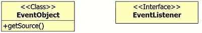
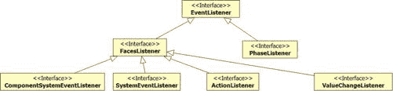
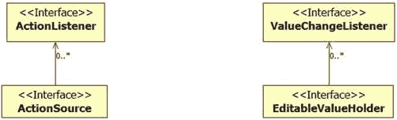
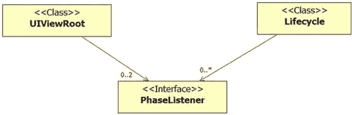
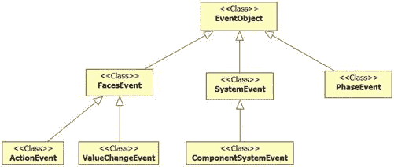
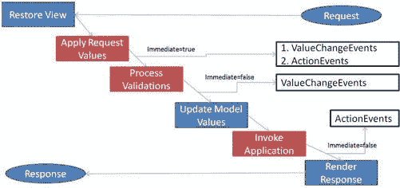
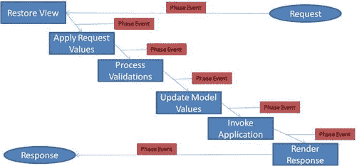
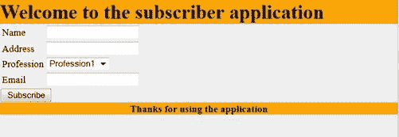
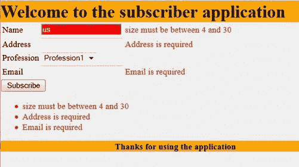
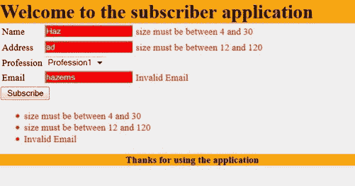

# 四、引擎盖下的 JSF——第三部分

在本章中，您将通过理解 JSF 事件模型，详细了解如何增强您的 JSF 应用。完成本章后，您将了解不同的 JSF 事件类型(JSF 面孔事件、相位事件和系统事件)。您将学习如何在 JSF 应用中处理 JSF 事件。在最后一节中，您将学习如何利用 JSF 视图参数来生成 RESTful JSF 页面，这些页面可以被最终用户添加为书签，也可以被 web 搜索爬虫编入索引。

JSF 事件

在深入 JSF 事件的细节之前，我们需要先了解什么是*事件*和什么是*事件监听器*。事件通常是用户执行的操作(如单击按钮或更改下拉值)。当事件发生时，事件源对象中的更改(或一组更改)会发生，并被事件对象捕获。事件对象应该告诉事件的源对象是什么，以及事件源发生了什么变化(如果有的话)。事件侦听器通常是一个在特定事件(事件侦听器类感兴趣的事件)发生时必须得到通知的类。

通常，在 Java 世界中，事件模型中的两个主要组件被表示为一个接口和一个类，如图图 4-1 所示。



图 4-1 。Java 事件模型主接口

EventListener 是一个标记接口，没有所有事件侦听器接口都必须扩展的方法，而 EventObject 类主要有一个方法 getSource()，它返回事件最初发生的对象(事件源)。为了处理 Java 事件模型，JSF 利用 EventObject 和 EventListener 来构建它的事件和侦听器模型。

为了定义 JSF 监听器，所有的 JSF 监听器接口都扩展了 EventListener 接口。图 4-2 显示了主要的 JSF 事件监听器(注意，为了简单起见，这个图没有显示 JSF 监听器的完整列表)。



图 4-2 。JSF 事件听众

有两种类型的 JSF 事件监听器:

*   **Faces 监听器**是动作监听器、值更改监听器、系统事件监听器和组件系统事件监听器的基本接口。
*   **阶段监听器**是监听器接口，用于 JSF 请求处理生命周期的每个标准阶段的开始和结束。

让我们深入了解子侦听器的细节，以了解谁可以创建这些侦听器以及何时可以执行它们。图 4-3 显示了两种与应用相关的事件监听器:

*   **ActionListener** 接口，负责接收动作事件。
*   **ValueChangeListener** 接口，负责接收值变化事件。



图 4-3 。与应用相关的事件侦听器

如此图所示，ActionSource 组件(或 ActionSource2 组件)可以有一个或多个操作侦听器。EditableValueHolder 组件(如 UIInput 组件)或 ValueHolder 组件可能有一个或多个值更改侦听器。

根据定义，系统事件监听器监听系统事件。系统事件是在 JSF 2.0 中引入的，它为 JSF 生命周期提供了一个优雅的视图。例如，使用系统事件侦听器，JSF 开发人员可以编写自定义代码，这些代码将在应用启动和拆卸事件中执行，或者在应用中引发异常时执行。

SystemEventListener 是系统事件侦听器的主接口。SystemEventListener 可以侦听所有系统事件类型。系统事件可以在 JSF 应用级别触发(如应用启动、应用拆除或应用异常)，也可以在 JSF 组件级别触发(如“验证组件之前”、“验证组件之后”或“呈现视图之前”)。如果系统事件发生在组件级，那么在这种情况下你可以使用更具体的事件监听器，这是 ComponentSystemEventListener 接口(如图图 4-2 所示)来处理。这是因为 ComponentSystemEventListener 侦听 ComponentSystemEvent(它扩展了 SystemEvent)。

阶段监听器允许处理不同的阶段事件。阶段事件发生在 JSF 请求处理生命周期的每个标准阶段的开始和结束。JSF 请求处理生命周期阶段有

*   恢复视图。
*   应用请求值。
*   流程验证。
*   更新模型值。
*   调用应用。
*   渲染响应。

如图 4-4 所示，生命周期实例可以有零个或多个附加的 phase listener，UIViewRoot 可以有零到两个 phase listener 实例。阶段侦听器将在“阶段事件”一节中详细说明。



图 4-4 。PhaseListener 接口

 **注意**还有一个监听器扩展了 FacesListener(为了简单起见，在图 4-2 中省略了):这个监听器是 BehaviorListener。BehaviorListener 监听 JSF HTML 组件的所有行为事件。这些事件将在第五章中说明。

既然我们已经介绍了 JSF 事件监听器模型，那么 JSF 事件模型呢？图 4-5 显示了 JSF 事件层级中的主要类别。



图 4-5 。JSF 事件对象层次结构中的主要类

为了定义 JSF 事件对象，所有的 JSF 事件对象都扩展了 EventObject 类。有三件重要的事情需要注意:

*   FacesEvent 是可由 UIComponents 触发的事件的基类。它有两个子类:ActionEvent 类，表示由 ActionSource2 组件触发的事件 ValueChangeEvent 类，表示由 ValueHolder 或 EditableValueHolder 组件触发的事件。
*   SystemEvent 是所有系统事件的基类。ComponentSystemEvent 类(扩展 SystemEvent)代表特定于 UIComponents 的系统事件。
*   PhaseEvent 是一个类，表示在 JSF 请求处理生命周期的每个标准阶段的开始和结束时发生的阶段事件。

 **注意**重要的是要知道所有的 JSF 事件监听器接口和事件类都位于(javax.faces.event)包中。在本章中，为了简单起见，我们将只提及事件监听器接口名或事件类名，而不提及完全限定的接口(或类)名。

面孔事件

Faces 事件 是那些可以被 UIComponents 触发的事件。面孔事件包括两种类型的事件:

*   动作事件。
*   价值变化事件。

动作事件由 ActionSource2 组件触发，如(CommandButton 或 CommandLink 组件)。例如，当单击 UICommand 组件时，将触发 action 事件。值更改事件由 ValueHolder 组件(如 outputText 组件)或 EditableValueHolder 组件(如 inputText 或 selectOneMenu 组件)触发。当组件的值更改时，将触发值更改事件。在讨论这两种类型事件的示例之前，重要的是要知道这些事件在 JSF 生命周期的各个阶段中的触发时间。图 4-6 显示了动作和数值变化事件的执行时间。



图 4-6 。动作和值更改事件的执行时间

如图所示，动作事件和值更改事件在以下三个阶段结束时执行:

*   应用请求值。
*   流程验证。
*   调用应用。

这是两个事件的四个执行场景 :

*   当 EditableValueHolder(或 ValueHolder)组件的 immediate 属性设置为 true 时，将在“应用请求值”阶段结束时执行 ValueChangeEvent。
*   当 ActionSource2 组件的 immediate 属性设置为 true 时，ActionEvent 将在“应用请求值”阶段结束时执行。
*   当 EditableValueHolder(或 ValueHolder)组件的 immediate 属性设置为 false 时，将在“流程验证”阶段结束时执行 ValueChangeEvent。
*   当 ActionSource2 组件的 immediate 属性设置为 false 时，将在“调用应用”阶段结束时执行 ActionEvent。

在接下来的两节中，我们将看到如何为动作和值更改事件创建侦听器的不同示例。

 **注意**根据对执行场景的解释，需要注意的是，默认情况下(当 immediate 属性设置为 false 时),动作事件和值更改事件都会排队，这意味着一旦用户(例如)对 ActionSource2 组件执行动作或对 EditableValueHolder 组件的值进行更改，这些事件将不会被触发。这两个事件都将排队，直到它们在 JSF 请求处理生命周期中的适当时间被触发，如上图所示。

动作事件

在前面的章节中，我们看到了一些带有动作方法的动作事件和动作监听器的例子。我们来回忆一下第二章的第一个应用例子。清单 4-1 展示了在第一个应用示例中带有动作方法的动作监听器的例子。

***清单 4-1。*** “第一次应用”示例中带有动作方法的动作监听器示例

```html
<?xml version='1.0' encoding='UTF-8' ?>
<!DOCTYPE html>
<html FontName">http://www.w3.org/1999/xhtml"
      xmlns:ui="http://java.sun.com/jsf/facelets"
      xmlns:h="http://java.sun.com/jsf/html">

<ui:composition template="/WEB-INF/templates/simple.xhtml">
    <ui:define name="title">
        #{bundle['application.loginpage.title']}
    </ui:define>
    <ui:define name="content">
                                       ...
            <h:commandButton value="#{bundle['application.login']}" action="#{user.login}"/>
            <br/><br/>
        </h:form>
    </ui:define>
</ui:composition>

</html>
```

正如我们在清单 4-1 中看到的，我们可以使用 UICommand (CommandButton) action 属性创建一个带有 action 方法的 action 监听器。清单 4-2 显示了#{user.login}动作方法代码。

***清单 4-2。*** #{user.login}动作方法代码

```html
public class User implements Serializable {
    ...
    public String login() {
        return "welcome";
    }
    ...
}
```

正如您将注意到的，action 方法是一种不带参数并返回表示结果的字符串的方法。

 **注意**的动作方法是由 JSF 内置的默认动作监听器处理的。默认的操作侦听器从操作方法中获取返回的结果字符串，然后将其传递给 NavigationHandler 来处理导航(如果有)。

如果您的操作方法中不需要导航，那么您可以使用操作侦听器方法来代替。清单 4-3 显示了一个包含 CommandButton 和 action listener 方法的表单，用于计算输入字段的阶乘数。

***清单 4-3。*** 一个动作监听器方法的例子

```html
<h:form>
             <h:outputText value="Enter Number:"/>
             <h:inputText value="#{calc.number}">
                          <f:validateLongRange minimum="0" maximum="25"/>
             </h:inputText>

             <br/>
             <h:commandButton value="Calculate Factorial"
                                              actionListener="#{calc.findFactorial}">
             </h:commandButton>

             <br/>
             <h:outputText value="Result is: #{calc.result}" rendered="#{calc.result ne 0}"/>

             <h:messages/>
</h:form>
```

可以使用 UICommand 组件的 action listener 属性将操作侦听器方法附加到 ui command 组件。如前所述，操作侦听器方法执行操作而不返回 JSF 导航的任何结果，因此操作侦听器方法返回 void 并将 ActionEvent 作为参数。清单 4-4 显示了 Calc 管理的 bean，它包括 findFactorial 动作监听器。

***清单 4-4。*** Calc 托管 Bean

```html
@ManagedBean
@RequestScoped
public class Calc implements Serializable {
    private int number;
    private long result;
    public int getNumber() {
        return number;
    }

    public void setNumber(int number) {
        this.number = number;
    }
    public long getResult() {
        return result;
    }

    public void setResult(long result) {
        this.result = result;
    }
    public void findFactorial(ActionEvent event) {
        result = 1;
        for (int i = 1; i <= number; i++) {
            result = result * i;
        }
    }
}
```

除了将默认操作侦听器与操作方法或操作侦听器方法一起使用之外，您还可以编写自己的自定义操作侦听器。这可以通过创建实现 ActionListener 接口的 action listener 类来实现。清单 4-5 展示了 CalcActionListener，它实现了 ActionListener。如图所示，processAction()获取当前输入数字，然后计算该数字的相应阶乘，最后在 Calc 托管 bean 的 result 属性中设置输出。

***清单 4-5。*** CalcActionListener 自定义动作监听器

```html
import javax.faces.context.FacesContext;
import javax.faces.event.AbortProcessingException;
import javax.faces.event.ActionEvent;
import javax.faces.event.ActionListener;

public class CalcActionListener implements ActionListener {

    @Override
    public void processAction(ActionEvent event) throws AbortProcessingException {
        FacesContext context = FacesContext.getCurrentInstance();
        Calc calc = context.getApplication().evaluateExpressionGet(context,
                                                                   "#{calc}",
                                                                   Calc.class);
        long result = 1;

        for (int i = 1; i <= calc.getNumber(); i++) {
            result = result * i;
        }
        calc.setResult(result);
    }
}
```

为了将定制动作监听器附加到 UICommand 组件，可以在 UICommand 组件中使用<actionlistener>标记。清单 4-6 显示了对清单 4-3 中提到的表单的更新，包括定制动作监听器的更新。</actionlistener>

***清单 4-6。***XHTML 页面中自定义动作监听器的例子

```html
<h:form>
             <h:outputText value="Enter Number:"/>
             <h:inputText value="#{calc.number}">
                          <f:validateLongRange minimum="0" maximum="25"/>
             </h:inputText>

             <br/>
             <h:commandButton value="Calculate Factorial">
                          <f:actionListener type="com.jsfprohtml5.factorial.model.CalcActionListener"/>
             </h:commandButton>

             <br/>
             <h:outputText value="Result is: #{calc.result}" rendered="#{calc.number ne 0}"/>

             <h:messages/>
</h:form>
```

要遵循的最佳实践是使用操作方法来执行业务操作，这可能还包括导航到新页面，并使用操作侦听器方法(或自定义操作侦听器)在执行实际的业务操作之前为操作做一些初始化工作(例如记录操作)。知道动作监听器方法(或自定义动作监听器)总是在动作方法之前执行是很重要的，执行顺序与它们在视图中声明和附加到 ActionSource2 组件的顺序相同。清单 4-7 显示了在清单 4-3 中提到的阶乘计算表单，它结合了“计算阶乘”命令按钮组件上的动作方法和动作监听器。

***清单 4-7。*** 动作方法和动作监听器组合在“计算阶乘”命令组件上

```html
<h:form>
             <h:outputText value="Enter Number:"/>
             <h:inputText value="#{calc.number}">
                          <f:validateLongRange minimum="0" maximum="25"/>
             </h:inputText>

             <br/>
             <h:commandButton value="Calculate Factorial"
                                              actionListener="#{calc.logFindFactorial}"
                                              action="#{calc.findFactorial}">
             </h:commandButton>

             <br/>
             <h:outputText value="Result is: #{calc.result}" rendered="#{calc.number ne 0}"/>

             <h:messages/>
</h:form>
```

记录 FindFactorial 操作的# { calc.logFindFactorial }的执行将在# { calc.findFactorial }进行实际阶乘计算之前执行。清单 4-8 显示了最初在清单 4-4 中显示的 Calc 受管 bean 的更新。

***清单 4-8。*** 更新了 Calc 托管 Bean

```html
@ManagedBean
@RequestScoped
public class Calc implements Serializable {
    private long number;
    private long result;

    public long getNumber() {
        return number;
    }

    public void setNumber(long number) {
        this.number = number;
    }
    public long getResult() {
        return result;
    }

    public void setResult(long result) {
        this.result = result;
    }

    public void logFindFactorial(ActionEvent event) {
        System.out.println("Getting the factorial for: " + number);
    }
    public String findFactorial() {
        result = 1;

        for (int i = 1; i <= number; i++) {
            result = result * i;
        }

        System.out.println("Factorial(" + number + ") = " + result);

        return null;
    }
}
```

在“数字”字段中输入一个数字，然后单击“计算阶乘”命令按钮，将在控制台中打印以下行，如下所示:

```html
Getting the factorial for: 3
Factorial(3) = 6
```

有时，您可能需要在执行操作方法之前直接在托管 bean 属性中设置一个值；如果您遇到这种情况，那么您可以在 ActionSource2 组件中使用<setpropertyactionlistener>标记。表 4-1 显示了<f:setPropertyActionListener>标签的主要属性。</setpropertyactionlistener>

表 4-1 。<f:setPropertyActionListener>标签的主要属性

| 

属性

 | 

描述

 |
| --- | --- |
| 价值* | 表示要存储为`target`属性的值的`ValueExpression`。 |
| 目标* | 表示作为`value`属性的目的地的`ValueExpression`。 |

为了理解如何使用<setpropertyactionlistener>标签，让我们看一个例子。清单 4-9 展示了一个 CommandButton 中的<f:setPropertyActionListener>标签的例子。</setpropertyactionlistener>

***清单 4-9。***??<f:setPropertyActionListener>的一个例子

```html
<h:commandButton value="Say Hi" action="page2">
             <f:setPropertyActionListener target="#{person.name}" value="Some user"/>
</h:commandButton>
```

如前面的代码清单所示，当单击 CommandButton 时，Person managed bean 的 name 属性将被设置为“Some user ”,然后当前页面将被转到 page2。清单 4-10 显示了个人管理的 bean。

***清单 4-10。*** 人管豆

```html
@ManagedBean
@SessionScoped
public class Person {
    private String name;

    public String getName() {
        return name;
    }
    public void setName(String name) {
        this.name = name;
    }
}
```

Person managed bean 是一个简单的 bean，只有一个属性名及其 setter 和 getter。在使用<setpropertyactionlistener>标记将 Person managed bean 的 name 属性设置为“Some user”之后，在 page2 中，如果我们在页面中有以下表达式:</setpropertyactionlistener>

```html
Hello, #{person.name}
```

这将产生

```html
Hello, Some user
```

数值变化事件

值更改事件是当 ValueHolder(或 EditableValueHolder)组件的值更改时触发的事件。让我们看一个值改变监听器的例子。假设我们想要显示一组国家的首都，当用户选择这些国家中的一个，然后单击一个命令按钮来获取所选国家的首都时，这些国家的首都显示在 JSF 的 SelectOneMenu 组件中。清单 4-11 显示了包含国家列表的表单。

***清单 4-11。*** 价值改变听者的例子

```html
<h:form>
             <h:outputLabel for="countries" value="Select a country: "/>
             <h:selectOneMenu id="countries" value="#{country.name}"
                                          valueChangeListener="#{country.findCapital}">

                          <f:selectItem itemLabel="---" itemValue="---"/>
                          <f:selectItem itemLabel="United States" itemValue="USA"/>
                          <f:selectItem itemLabel="Egypt" itemValue="Egypt"/>
                          <f:selectItem itemLabel="Denmark" itemValue="Denmark"/>
             </h:selectOneMenu>
             <h:commandButton value="Find Capital" /> <br/>

             <h:outputText value="Capital of #{country.name} is #{country.capital}"
                                   rendered="#{country.capital ne null}"/>
</h:form>
```

正如我们在粗体行中看到的，我们有一个 selectOneMenu 组件，它有四个使用<selectitem>标签添加的项目。第一项表示没有选择，而其余项表示国家。selectOneMenu 组件具有 valueChangeListener 属性，该属性包含值更改侦听器方法#{country.findCapital}。当用户选择一个可用的国家，然后单击 CommandButton 时，如果 selectOneMenu 值发生更改，将提交表单并执行值更改侦听器方法。清单 4-12 显示了国家管理的 bean。</selectitem>

***清单 4-12。*** 国家托管豆

```html
import javax.faces.bean.ManagedBean;
import javax.faces.bean.RequestScoped;
import javax.faces.event.ValueChangeEvent;

@ManagedBean
@RequestScoped
public class Country {
    private String name;
    private String capital;

    public String getName() {
        return name;
    }
    public void setName(String name) {
        this.name = name;
    }
    public String getCapital() {
        return capital;
    }
    public void setCapital(String capital) {
        this.capital = capital;
    }
    public void findCapital(ValueChangeEvent event) {
        System.out.println("Old selected value is: " + event.getOldValue());
        System.out.println("New selected value is: " + event.getNewValue());

        String selectedCountryName = (String) event.getNewValue();

        if ("USA".equals(selectedCountryName)) {
            capital = "Washington";
        } else if ("Egypt".equals(selectedCountryName)) {
            capital = "Cairo";
        } else if ("Denmark".equals(selectedCountryName)) {
            capital = "Copenhagen";
        }
    }
}
```

正如您在粗体行中注意到的，值更改侦听器方法返回 void，并将 ValueChangeEvent 作为参数。使用 ValueChangeEvent 的 getOldValue()和 getNewValue()方法，可以获得 ValueHolder(或 EditableValueHolder)组件的旧值和新值。在我们的示例中，我们获取代表新国家选择的新值，然后获取所选国家的合适的资本，最后在资本属性中设置结果以便由页面显示，如清单 4-11 所示。

而不是通过更改 ValueHolder(或 EditableValueHolder)组件的值并单击 CommandButton 或 CommandLink 来触发值更改事件。当 ValueHolder(或 EditableValueHolder)组件的值更改时，可以通过在组件的值更改时提交表单来触发值更改事件。清单 4-13 显示了如何通过移除 CommandButton 并提交值更改表单来应用此行为。

***清单 4-13。*** 通过提交 SelectOneMenu 的值更改表单来执行值更改监听器

```html
<h:form>
             <h:outputLabel for="countries" value="Select a country: "/>
             <h:selectOneMenu id="countries" value="#{country.name}"
valueChangeListener="#{country.findCapital}"
                                                               onchange="submit();">

                          <f:selectItem itemLabel="---" itemValue="---"/>
                          <f:selectItem itemLabel="United States" itemValue="USA"/>
                          <f:selectItem itemLabel="Egypt" itemValue="Egypt"/>
                          <f:selectItem itemLabel="Denmark" itemValue="Denmark"/>
             </h:selectOneMenu> <br/>

             <h:outputText value="Capital of #{country.name} is #{country.capital}"
                                                      rendered="#{country.capital ne null}"/>
</h:form>
```

除了使用默认值更改侦听器之外，您还可以编写自己的自定义值更改侦听器。这可以通过创建实现 value change listener 接口的自定义值更改侦听器类来实现。清单 4-14 显示了 CountryValueChangeListener，它利用 ValueChangeListener 并实现 processValueChange()，后者获取新选择的国家，然后查找其首都，最后将结果设置在国家管理的 bean 的 capital 属性中。

***清单 4-14。***CountryValueChangeListener 自定义监听器

```html
import javax.faces.context.FacesContext;
import javax.faces.event.AbortProcessingException;
import javax.faces.event.ValueChangeEvent;
import javax.faces.event.ValueChangeListener;

public class CountryValueChangeListener implements ValueChangeListener {

    @Override
    public void processValueChange(ValueChangeEvent event) throws AbortProcessingException {
        FacesContext context = FacesContext.getCurrentInstance();
        Country country = context.getApplication().evaluateExpressionGet(context,
                                                                   "#{country}",
                                                                   Country.class);

        String selectedCountryName = (String) event.getNewValue();

        if ("USA".equals(selectedCountryName)) {
            country.setCapital("Washington");
        } else if ("Egypt".equals(selectedCountryName)) {
            country.setCapital("Cairo");
        } else if ("Denmark".equals(selectedCountryName)) {
            country.setCapital("Copenhagen");
        }
    }
}
```

为了将自定义值更改监听器附加到 ValueHolder(或 EditableValueHolder)组件，可以在组件内部使用<valuechangelistener>标记。清单 4-15 显示了在清单 4-13 中提到的资本查找器表单的更新，带有自定义值变更监听器更新。</valuechangelistener>

***清单 4-15。***XHTML 页面中自定义值改变监听器的例子

```html
<h:form>
             <h:outputLabel for="countries" value="Select a country: "/>
             <h:selectOneMenu id="countries" value="#{country.name}"
                                                               onchange="submit();">

                          <f:selectItem itemLabel="---" itemValue="---"/>
                          <f:selectItem itemLabel="United States" itemValue="USA"/>
                          <f:selectItem itemLabel="Egypt" itemValue="Egypt"/>
                          <f:selectItem itemLabel="Denmark" itemValue="Denmark"/>

                          <f:valueChangeListener type="com.jsfprohtml5.factorial.model.CountryValueChangeListener"/>
             </h:selectOneMenu> <br/>

             <h:outputText value="Capital of #{country.name} is #{country.capital}"
                                                      rendered="#{country.capital ne null}"/>
</h:form>
```

如前面加粗的行所示，使用<valuechangelistener>与<actionlistener>非常相似；主要是，您需要指定 type 属性，该属性引用侦听器类的完全限定类名。</actionlistener></valuechangelistener>

阶段事件

阶段事件发生在 JSF 请求处理生命周期的每个标准阶段的开始和结束，如图图 4-7 所示。



图 4-7 。阶段事件执行时间

阶段事件由阶段监听器处理。如图 4-4 所示，生命周期实例可以有零个或多个附加的阶段监听器，UIViewRoot 可以有零到两个阶段监听器实例。为了创建一个相位监听器，你需要实现 JSF 的相位监听器接口。清单 4-16 显示了 JSF PhaseListener 接口 ?? 的代码。

***清单 4-16。*** 相位监听器接口

```html
package javax.faces.event;

import java.io.Serializable;
import java.util.EventListener;

public interface PhaseListener extends EventListener, Serializable {

    public void afterPhase(PhaseEvent event);

    public void beforePhase(PhaseEvent event);

    public PhaseId getPhaseId();
}
```

如清单 4-16 所示，PhaseListener 接口有以下方法:

*   getPhaseId():该方法返回请求处理阶段的标识符，在此期间，该侦听器对处理 PhaseEvent 事件感兴趣。合法值是由 PhaseId 类定义的单例实例，包括 PhaseId。ANY_PHASE 表示对所有标准阶段 的通知感兴趣。
*   beforePhase():当请求处理生命周期的特定阶段的处理即将开始时，将执行该方法。
*   afterPhase():这个方法将在特定阶段的处理刚刚完成时执行。

阶段侦听器对于调试不同 JSF 生命周期阶段的执行非常有用。它还可以用于授权 JSF 应用页面。让我们看一个例子，看看如何使用阶段侦听器来授权 JSF 页面。让我们回到第二章的第一个应用例子。该应用缺少的功能之一是用户可以直接打开欢迎应用，而不必通过登录页面。为了保护应用中的欢迎页面(或者其他页面),我们可以为此创建一个阶段侦听器。我们需要在应用中修改的一件事是设置一个会话标志，表明用户通过在登录页面中输入非空的用户名和密码进行了身份验证。清单 4-17 显示了更新后的用户管理 bean。

***清单 4-17。*** 更新用户管理的 Bean

```html
public class User implements Serializable {

    private String name;
    private String password;
    private Profession profession;

    private List<String> favoriteSports;
    private Map<String, String> spokenLanguages;

    ...

    public String login() {
        FacesContext context = FacesContext.getCurrentInstance();
        HttpSession session = (HttpSession) context.getExternalContext().getSession(true);

        // User passes through the login page and clicks the "login" button.
        session.setAttribute("isAuthenticated", true);

        return "welcome";
    }

    ...
}
```

如前面的代码清单所示，添加了一个会话属性“isAuthenticated ”,用于在 login()方法中将用户标记为已通过身份验证(本例中接受任何输入的非空用户名和密码)。清单 4-18 显示了授权监听器阶段监听器代码。

***清单 4-18。*** 授权监听器相位监听器

```html
package com.jsfprohtml5.firstapplication.model;

import javax.faces.application.NavigationHandler;
import javax.faces.context.FacesContext;
import javax.faces.event.PhaseEvent;
import javax.faces.event.PhaseId;
import javax.faces.event.PhaseListener;
import javax.servlet.http.HttpSession;

public class AuthorizationListener implements PhaseListener {

    @Override
    public void afterPhase(PhaseEvent event) {
        FacesContext context = event.getFacesContext();
        String currentPage = context.getViewRoot().getViewId();

        boolean isLoginPage = currentPage.endsWith("index.xhtml");
        HttpSession session = (HttpSession) context.getExternalContext().getSession(true);
        Object isAuthenticated = session.getAttribute("isAuthenticated");

        if (!isLoginPage && isAuthenticated == null) {
            NavigationHandler navigationHandler = context.getApplication().getNavigationHandler();
            navigationHandler.handleNavigation(context, null, "index");
        }
    }

    @Override
    public void beforePhase(PhaseEvent event) {
        //Nothing ...
    }

    @Override
    public PhaseId getPhaseId() {
        return PhaseId.RESTORE_VIEW;
    }
}
```

为了实现页面授权，我们需要在 RESTORE_VIEW 阶段完成后，在 JSF 生命周期上创建一个阶段侦听器。在 afterPhase() API 中，使用 context.getViewRoot()检索当前页面。getViewId()。当页面不是登录页面(index.xhtml)并且用户未通过身份验证时，则使用 NavigationHandler 将用户转发到登录页面。为了在 JSF 生命周期上安装阶段监听器，您需要在 faces 配置文件、中定义它，如清单 4-19 所示。

***清单 4-19。*** 在 Faces 配置文件中定义阶段监听器

```html
<faces-config ...>
    ...
    <lifecycle>
        <phase-listener>
            com.jsfprohtml5.firstapplication.model.AuthorizationListener
        </phase-listener>
    </lifecycle>
</faces-config>
```

 **提示**如果你想在一个特定的视图上应用一个相位监听器，而不是在所有的页面上应用，你可以通过使用如下的< f:phaseListener >标签来实现:<f:phase listener type = " package。customphasetlistener ">(其中 type 属性表示要创建和注册的完全限定的阶段监听器 Java 类名)。标记在嵌套了该标记的 UIViewRoot 上注册了一个 phaseListener 实例。

系统事件

系统事件 在 JSF 2.0 中引入，以允许 JSF 开发者监听高级生命周期事件并对其做出反应。如本章前面所述，系统事件可以发生在 JSF 应用级别(如应用启动或应用拆除)或 JSF 组件级别。与 Faces 事件不同，系统事件会立即发布，这意味着它们不会排队等待生命周期的后续处理阶段。表 4-2 显示了应用级可能发生的不同类型的系统事件(直接扩展 SystemEvent)。

表 4-2 。应用级别的 JSF 系统事件(扩展 SystemEvent)

| 

系统事件

 | 

描述

 |
| --- | --- |
| `PostConstructApplicationEvent` | 应用启动完成后立即发布。 |
| `PreDestroyApplicationEvent` | 在应用关闭之前立即发布。 |
| `ExceptionQueuedEvent` | 当 JSF 应用中出现意外异常时发布。这可能发生在 JSF 生命周期处理的任何阶段。 |

系统事件也可以发生在组件级 。表 4-3 显示了组件级最常见的系统事件类型。以下所有事件都从 ComponentSystemEvent 扩展而来。

表 4-3 。组件级的 JSF 系统事件(扩展组件系统事件)

| 

系统事件

 | 

描述

 |
| --- | --- |
| `PreRenderComponentEvent` | 该事件在组件呈现之前发布。 |
| `PostAddToViewEvent` | 这个事件是在组件被添加到 JSF 视图之后发布的。 |
| `PreValidateEvent` | 该事件在组件即将被验证之前发布。 |
| `PostValidateEvent` | 该事件在组件通过验证后立即发布。 |
| `PreDestroyViewMapEvent` | 此事件在视图范围映射即将被销毁之前发布。 |
| `PostConstructViewMapEvent` | 此事件在视图范围映射创建后立即发布。 |
| `PreRenderViewEvent` | 该事件在视图(`UIViewRoot`)即将呈现之前发布。 |
| `PostRestoreStateEvent` | 该事件在组件状态恢复后立即发布。 |

为了了解我们如何使用系统事件来支持我们的 JSF 应用，让我们回到我们在第三章中创建的订阅者应用。假设我们想要引入一个新的下拉项目，它将包括职业列表，如图图 4-8 所示。职业列表在应用中是静态的，所以会在应用启动时加载一次，在应用关闭 ?? 之前卸载。



图 4-8 。更新的订户应用屏幕

为了实现这个功能，我们可以使用 PostConstructApplicationEvent 在应用启动后加载静态列表数据，使用 PreDestroyApplicationEvent 在应用关闭前进行清理。

清单 4-20 显示了我们的应用的定制系统事件监听器，它将在应用启动后和关闭前被调用。

***清单 4-20。*** 订阅者自定义系统事件监听器

```html
package com.jsfprohtml5.subscriber.model;

import java.util.ArrayList;
import java.util.List;
import java.util.Map;
import javax.faces.application.Application;
import javax.faces.context.FacesContext;
import javax.faces.event.AbortProcessingException;
import javax.faces.event.PostConstructApplicationEvent;
import javax.faces.event.PreDestroyApplicationEvent;
import javax.faces.event.SystemEvent;
import javax.faces.event.SystemEventListener;
import javax.faces.model.SelectItem;

public class ListingLoader implements SystemEventListener {
    public static final String PROFESSIONS_KEY = "professions";

    @Override
    public void processEvent(SystemEvent event) throws AbortProcessingException {
        Map<String, Object> applicationMap = FacesContext.getCurrentInstance().
                                             getExternalContext().getApplicationMap();

        if (event instanceof PostConstructApplicationEvent) {

            //Load the listing data in the startup ...
            applicationMap.put(PROFESSIONS_KEY, getSampleProfessionList());
        } else if (event instanceof PreDestroyApplicationEvent) {

            //Unload the listing data in the shutdown ...
            applicationMap.remove(PROFESSIONS_KEY);
        }
    }

    @Override
    public boolean isListenerForSource(Object source) {
        return source instanceof Application;
    }

    private List<SelectItem> getSampleProfessionList() {
        List<SelectItem> sampleProfessions = new ArrayList<SelectItem>();

        sampleProfessions.add(new SelectItem("Profession1"));
        sampleProfessions.add(new SelectItem("Profession2"));
        sampleProfessions.add(new SelectItem("Profession3"));
        sampleProfessions.add(new SelectItem("Other"));

        return sampleProfessions;
    }
}
```

为了实现 SystemEventListener 接口，我们需要为两个方法提供实现:

1.  isListenerForSource(对象源):如果事件侦听器对从源对象接收事件感兴趣，则该方法应该返回 true。对于我们的侦听器来说，事件侦听器只对接收来自应用对象的事件感兴趣。

processEvent(SystemEvent 事件):一旦接收到 SystemEvent 并准备好进行处理，就会调用该方法。在我们的侦听器中，事件对象被检查为 PostConstructApplicationEvent 或 PreDestroyApplicationEvent。如果是 PostConstructApplicationEvent，则在应用映射中键为 PROFESSIONS_KEY 的映射条目中设置专业列表。在 PreDestroyApplicationEvent 中，可以执行任何可能的清理。在我们的侦听器中，职业列表只是从应用地图中移除。

为了允许我们的应用的定制系统事件监听器在 PostConstructApplicationEvent 或 PreDestroyApplicationEvent 中执行，我们需要在 faces 配置文件(faces-config.xml)中注册我们的定制系统事件监听器，如清单 4-21 所示。

***清单 4-21。*** 在 faces-config.xml 中注册我们的定制系统事件监听器

```html
<faces-config ...>

     <application>

         <system-event-listener>
             <system-event-class>javax.faces.event.PostConstructApplicationEvent</system-event-class>
             <system-event-listener-class>com.jsfprohtml5.subscriber.model.ListingLoader</system-event-listener-class>
         </system-event-listener>

         <system-event-listener>
             <system-event-class>javax.faces.event.PreDestroyApplicationEvent</system-event-class>
             <system-event-listener-class>com.jsfprohtml5.subscriber.model.ListingLoader</system-event-listener-class>
         </system-event-listener>

         ...
     </application>
</faces-config>
```

使用<application>元素中的<system-event-listener>元素，我们可以在特定的系统事件上注册一个系统事件监听器。它有两个主要元素:<system-event-class>元素，表示系统事件类的全限定类名，以及<system-event-listener-class>元素，表示系统事件监听器类的全限定类名。</system-event-listener-class></system-event-class></system-event-listener></application>

在我们的示例中，我们声明了两个<system-event-listener>元素，以允许我们的自定义 SystemEvent 侦听器(ListingLoader)接收来自 post constructionapplicationevent 和 PreDestroyApplicationEvent 的事件。</system-event-listener>

 **注意**<系统-事件-监听器>下还有一个可选元素，就是<源类>元素。< source-class >元素可用于指定事件源的全限定类名。

既然我们已经看到了可以在应用级别发生的系统事件的示例，那么让我们看看如何利用可以在组件级别发生的系统事件。假设我们想要定制订户申请表单的输入字段上的错误显示方式，以便当我们在验证中有一个错误(或一组错误)时，输入字段将被突出显示。这实际上是组件系统事件的一个完美用例。为了实现这个用例，我们需要利用 postValidate 事件。

JSF 引入了标签,我们可以直接将它作为任何 JSF HTML 组件的子组件，以便在其上安装 ComponentSystemEventListener 实例。表 4-4 显示了< f:event >标签的属性。注意< f:event >标签提到的属性是强制的 。

表 4-4 。< f:事件>标签属性

| 

属性

 | 

描述

 |
| --- | --- |
| 类型* | 计算结果为字符串的值表达式，该字符串表示要为其安装侦听器的事件的名称。有效值为`preRenderComponent`、`preRenderView`、`postAddToView`、`preValidate`和`postValidate`。除了提到的有效值，在用`@NamedEvent`注释对扩展类进行注释后，扩展`ComponentSystemEvent`的任何 java 类的全限定类名都可以用作“type”属性的值。 |
| 听众* | 方法表达式，必须计算为采用`ComponentSystemEvent`作为参数、返回类型为`void`的公共方法，或者不采用参数、返回类型为`void`的公共方法。 |

为了改变输入组件的风格，我们可以在其中放置一个 和一个< f:event >标签。清单 4-22 显示了如何监听用户名输入字段中的 postValidate 事件。

***清单 4-22。*** 监听用户名输入字段中的 postValidate 事件

```html
<h:inputText id="userName"
                                        value="#{person.name}"
                                        required="true"
                                        requiredMessage="#{bundle['user.name.required']}">

             <f:event type="postValidate" listener="#{person.checkName}"/>
             <f:validateBean validationGroups="com.jsfprohtml5.subscriber.bean.validation.groups.LengthGroup"/>
</h:inputText>
```

JSF 方法表达式#{person.checkName}检查用户名输入是否有效。如果用户名无效，则在输入字段中添加一个特定的样式类。清单 4-23 显示了 checkName 方法的代码。

***清单 4-23。*** 检查名称方法代码

```html
@ManagedBean
@RequestScoped
public class Person implements Serializable {

    ...

    public void checkName(ComponentSystemEvent componentSystemEvent) {
        UIComponent component = componentSystemEvent.getComponent();

        if (component instanceof EditableValueHolder) {
            EditableValueHolder editableValueHolder = (EditableValueHolder) component;

            if (! editableValueHolder.isValid()) {
                component.getAttributes().put("styleClass", "invalidInput");
            } else {
                component.getAttributes().put("styleClass", "");
            }
        }
    }
}
```

正如我们在清单中看到的，listener 方法将 ComponentSystemEvent 作为参数。使用 getComponent()，我们可以检索组件实例，然后使用 EditableValueHolder 的 is valid()方法检查组件是否有效(通过验证阶段)。如果组件无效，则将 invalidInput CSS 样式类添加到组件的 style class 属性中。invalidInput CSS 样式类很简单，如清单 4-24 中的 所示。

***清单 4-24。*** invalidInput 风格类

```html
.invalidInput {
    background-color: red;
    color: white;
}
```

图 4-9 显示了用户名输入字段没有通过验证时的样子。



图 4-9 。出现错误时设置用户名输入字段的样式

在每个输入组件上安装组件系统事件监听器，在出现错误的情况下使用<event>对这些输入元素进行样式化可能效率不高，并且会使我们在所有的应用表单中有很多重复。因此，在我们的 JSF 应用中，我们需要一种统一而简单的方法来控制所有输入字段中的错误显示。</event>

为了统一控制所有输入字段中的错误显示，我们可以在 PostValidateEvent 上创建一个定制的系统事件侦听器，并通过将 input text class 设置为事件源，将其应用于应用中的所有输入文本元素。清单 4-25 显示了 ErrorDisplayListener 类(我们定制的系统事件监听器类)。

***清单 4-25。***ErrorDisplayListener 类

```html
package com.jsfprohtml5.subscriber.model;

import javax.faces.component.EditableValueHolder;
import javax.faces.component.UIComponent;
import javax.faces.event.AbortProcessingException;
import javax.faces.event.SystemEvent;
import javax.faces.event.SystemEventListener;

public class ErrorDisplayListener implements SystemEventListener {

    @Override
    public void processEvent(SystemEvent event) throws AbortProcessingException {
        UIComponent component = (UIComponent) event.getSource();

        if (component instanceof EditableValueHolder) {
            EditableValueHolder editableValueHolder = (EditableValueHolder) component;

            if (! editableValueHolder.isValid()) {
                component.getAttributes().put("styleClass", "invalidInput");
            } else {
                component.getAttributes().put("styleClass", "");
            }
        }
    }

    @Override
    public boolean isListenerForSource(Object source) {
        return source instanceof UIComponent;
    }
}
```

如前面的清单所示，在 processEvent()中，任何具有验证错误的 EditableValueHolder 组件都将附加 invalidInput 样式。最后，为了将系统事件监听器应用到输入字段，我们需要在 faces 配置(faces-config.xml)中注册系统事件监听器，如清单 4-26 所示。

***清单 4-26。*** 在 Faces 配置文件中注册 ErrorDisplayListener

```html
<faces-config ...>

     <application>

         ...

         <system-event-listener>
             <source-class>javax.faces.component.html.HtmlInputText</source-class>
             <system-event-class>javax.faces.event.PostValidateEvent</system-event-class>
             <system-event-listener-class>com.jsfprohtml5.subscriber.model.ErrorDisplayListener
</system-event-listener-class>
         </system-event-listener>
     </application>

</faces-config>
```

使用<source-class>元素强制 postValidateEvent 的源为(javax . faces . component . html . html input text)，这是 JSF 输入文本元素类。编写并注册我们的自定义系统事件监听器后，当我们有一个或多个验证错误时，我们将能够自动看到样式化的输入元素，如图图 4-10 所示。</source-class>



图 4-10 。当我们有一个或多个验证错误时，样式化的输入元素

 **注**更新后的应用(首次应用和订阅应用)可从该书网站[`www.apress.com/9781430250104`](http://www.apress.com/9781430250104)下载；你可以在第四章的压缩文件中找到完整的源代码。

查看参数

为了支持可加书签的页面，JSF 2.0 中引入了视图参数来支持可寻址页面。视图参数允许 JSF 页面是 RESTful 的，这意味着它们可以被最终用户在浏览器中加入书签，以便他们以后可以随时返回使用这些页面。可以使用< f:viewParam >标签在 JSF Facelets 页面中创建视图参数。清单 4-27 展示了如何在 JSF 页面(car.xhtml)中定义< f:viewParam >标签。

***清单 4-27。*** 在 JSF 页面内使用< f:viewParam >标签(car.xhtml)

```html
<html FontName">http://www.w3.org/1999/xhtml"
      xmlns:ui="http://java.sun.com/jsf/facelets"
      xmlns:h="http://java.sun.com/jsf/html"
      xmlns:f="http://java.sun.com/jsf/core">

    <f:metadata>
        <f:viewParam name="model" value="#{car.model}"/>
        <f:viewParam name="color" value="#{car.color}"/>
    </f:metadata>
    <h:head>
        <title>Car Information</title>
    </h:head>

    <h:body>
        <p>
            Car Model: #{car.model} <br/>
            Car Color: #{car.color}
        </p>
    </h:body>
</html>
```

在前面的代码中，我们在页面中定义了两个视图参数。每个视图参数都有两个主要属性，name 属性指定请求参数的名称，value 属性表示请求参数的值将绑定到的值表达式。这意味着名称为 model 的请求参数的值将绑定到#{car.model}表达式，名称为 color 的请求参数将绑定到#{car.color}表达式。清单 4-28 显示汽车管理 bean 。

***清单 4-28。*** 车飞龙豆

```html
@ManagedBean
@RequestScoped
public class Car {
    private String model;
    private String color;

    public String getModel() {
        return model;
    }
    public void setModel(String model) {
        this.model = model;
    }

    public String getColor() {
        return color;
    }
    public void setColor(String color) {
        this.color = color;
    }
}
```

使用以下参数从浏览器调用 car.xhtml 页面后:

```html
/car.xhtml?model=300D&color=black
```

这将在 car.xhtml 页面中产生以下内容:

```html
Car Model: 300D
Car Color: black
```

 **注意**重要的是要知道< f:viewParam >导致一个 uiviewparam 作为当前视图的元数据被附加。UIViewParameter 扩展了 UIInput，这意味着通常对 UIInput 实例采取的任何操作对该类的实例都有效。因此，您可以将转换器、验证器和值更改监听器附加到< f:viewParam >标签上。

如前一篇技巧文章所示，我们可以将转换器和验证器都添加到<viewparam>标签中。让我们看看如何在 car.xhtml 页面中验证视图参数。让我们修改汽车管理 bean，添加一个新属性来描述汽车号码，如清单 4-29 所示。</viewparam>

***清单 4-29。*** 修改汽车管理豆

```html
@ManagedBean
@RequestScoped
public class Car {
    //...
    private Long number;

    //...
    public Long getNumber() {
        return number;
    }
    public void setNumber(Long number) {
        this.number = number;
    }
}
```

为了强制要求所有的汽车属性都是强制性的，就像我们处理其他 EditableValueHolder 组件一样，我们可以将 required 属性设置为 true。为了验证汽车号码属性在特定的数字范围内是一个有效的数字，我们可以在<viewparam>标签中使用<validatelongrange>。清单 4-30 展示了我们如何在 car.xhtml 页面中验证视图参数。</validatelongrange></viewparam>

***清单 4-30。*** 修改 car.xhtml 页面以利用验证

```html
<html FontName">http://www.w3.org/1999/xhtml"
      xmlns:ui="http://java.sun.com/jsf/facelets"
      xmlns:h="http://java.sun.com/jsf/html"
      xmlns:f="http://java.sun.com/jsf/core">

    <f:metadata>
        <f:viewParam name="model" value="#{car.model}"
                               required="true"
                                 requiredMessage="You need to specify car model"/>

        <f:viewParam name="color" value="#{car.color}"
                                required="true"
                                requiredMessage="You need to specify car color"/>
        <f:viewParam name="number" value="#{car.number}"
                                required="true"
                                requiredMessage="You need to specify car number">

            <f:validateLongRange minimum="1" maximum="9999999999"/>
        </f:viewParam>
    </f:metadata>

    <h:head>
        <title>Car Information</title>
    </h:head>

    <h:body>
        <p>
            <h:outputText  value="Car Model: #{car.model}" rendered="#{car.model ne null}" /> <br/>
            <h:outputText  value="Car Color: #{car.color}" rendered="#{car.color ne null}"/> <br/>
            <h:outputText  value="Car Number: #{car.number}" rendered="#{car.number ne null}"/>
        </p>

        <h:messages  styleClass="errorMessage"/>
    </h:body>
</html>
```

验证错误将显示在<messages>中；例如，当 URL 没有指定型号、颜色和数字参数时，或者当数字参数表示无效数字或超出范围的数字时(假定范围是从 1 到 9999999999)，就会发生这种情况。</messages>

为了支持浏览器书签功能和搜索引擎网络爬虫，JSF 2.0(及更高版本)提供了<link>组件。如果您将<link>组件的 includeViewParams 属性设置为 true，这将生成页面视图参数，作为< h:link >组件生成的 URL 的一部分。例如，如果我们将清单 4-30 中的< h:link >组件添加到 car.xhtml 页面，如下所示:

```html
<h:link includeViewParams="true" value="Can be bookmarked"/>
```

这将按照以下模式生成一个 URL:

```html
<a href="/contextPath/car.xhtml?model=xxx&amp;color=yyy&amp;number=zzz">Can be bookmarked</a>
```

 **注意**像< h:link >组件、< h:button >组件都有 includeViewParams 属性；但是，< h:button >为了查看目标页面，会生成一个依赖于 JavaScript onclick 动作的 HTML 按钮，这意味着 web 搜索爬虫无法到达。

除了<link>和<button>之外，还可以在 JSF 动作属性中使用 includeViewParams 参数(作为 JSF 动作结果的一部分)，清单 4-31 显示了一个新页面(intro.xhtml)中的 JSF 输入表单，允许用户输入汽车信息，如清单 4-30 中的所示。</button>

***清单 4-31。***【JSF】用于输入汽车信息的输入表单(intro.xhtml)

```html
<h:form>
            <h:panelGrid columns="3">
                <h:outputText value="Model:"></h:outputText>
                <h:inputText id="model"
                             value="#{car.model}"
                             required="true"
                             requiredMessage="You need to specify car model">
                </h:inputText>
                <h:message for="model" styleClass="errorMessage"/>

                <h:outputText value="Color:"></h:outputText>
                <h:inputText id="color"
                             value="#{car.color}"
                             required="true"
                             requiredMessage="You need to specify car color">
                </h:inputText>
                <h:message for="color" styleClass="errorMessage"/>

                <h:outputText value="Car Number:"></h:outputText>
                <h:inputText id="number"
                             value="#{car.number}"
                             required="true"
                             requiredMessage="You need to specify car number">

                    <f:validateLongRange minimum="1" maximum="9999999999"/>
                </h:inputText>
                <h:message for="number" styleClass="errorMessage"/>
            </h:panelGrid>

            <h:commandButton value="View car details"
                             action="car?faces-redirect=true&amp;includeViewParams=true" />
        </h:form>        
```

如粗体行所示，为了允许 JSF 命令按钮以 RESTful 方式导航到我们的 RESTful 页面(car.xhtml)(目标页面名称和参数将出现在浏览器地址栏中)，我们需要向 UICommand 的 action outcome 添加以下两个参数:

1.  faces-redirect:将 faces-redirect 参数设置为 true 允许当前页面被重定向(而不是转发)到目标页面(我们从第二章中知道)。
2.  includeViewParams:在操作结果内将 includeViewParams 设置为 true 允许 ActionSource2 组件在执行导航时包含视图参数。请记住，包含的视图参数必须在目标 JSF 页面中声明，在我们的示例中是(car.xhtml)。

假设在 intro.xhtml 页面中输入了有效数据，然后点击“查看汽车详情”按钮，页面将被重定向到(car.xhtml)页面，浏览器地址栏中有以下参数:

```html
contextPath/car.xhtml?model=xxx&color=yyy&number=zzz
```

这将在 car.xhtml 页面中产生以下内容:

```html
Car Model: xxx
Car Color: yyy
Car Number: zzz
```

 **注意**知道 JSF 2.x Facelets 是一种基于 XML 的视图技术是很重要的。这意味着(&)字符被解释为 XML 实体的开始。这导致为了表示实际的(&)字符，您必须使用& amp，如最后一个代码示例所示。

摘要

在本章中，您详细学习了 JSF 事件模型。您了解了如何在 JSF 应用中处理行动和价值变更事件。现在，您知道了如何利用 JSF 阶段监听器在您的 JSF 应用中实现一些好东西，比如授权或日志记录。您已经学习了不同类型的 JSF 系统事件，现在知道如何使用应用级和组件级系统事件。最后，您了解了如何使用 JSF 视图参数来使您的 JSF 页面 RESTful。