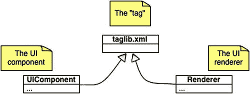
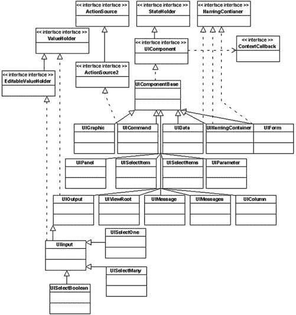
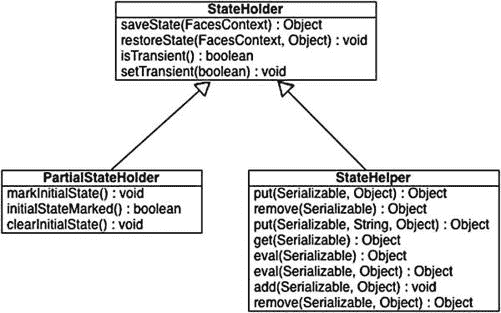
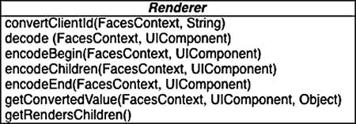
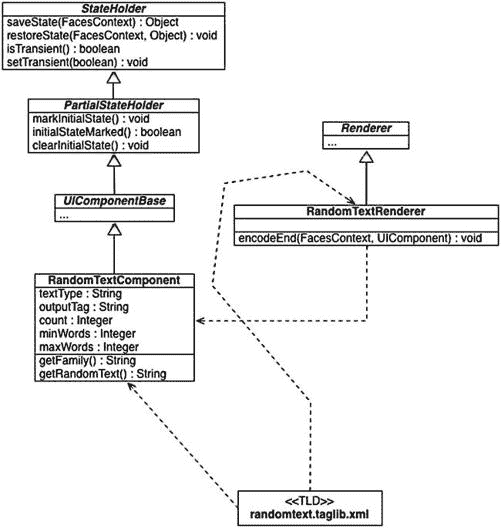
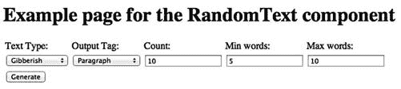
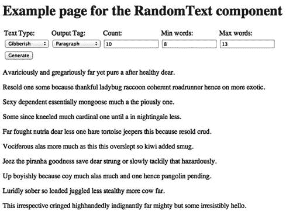
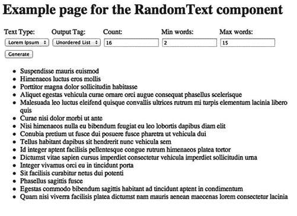

# 六、深入：JSF 定制组件

到目前为止，我们已经从页面作者和应用开发人员的角度看了 Java Server Faces。页面作者关心用户界面的创作，即在 Facelet 视图中构建标记、脚本和样式，在 Facelet 视图中利用 JSF 组件引入动态内容和行为。应用开发人员关心的是编写应用的服务器端行为。这包括构建页面作者的 Facelet 视图直接使用的托管 JSF bean，以及包含业务逻辑和持久性机制(如 JPA 实体)的企业 Java bean(EJB)。

在第六章、第七章和第八章中，我们将关注组件编写人员的职责。组件编写器的作用是创建可重用组件的库，这些组件或者支持特定的应用，或者可以在多个应用之间重用。第七章和 8 展示了复合材料组件的开发。本章的其余部分将关注如何创建非复合组件。第九章介绍了两个流行的带有可重用通用组件的库。这些库可供页面作者和应用开发人员使用，不需要组件编写器。本章介绍了 JSF 组件模型以及如何实现定制的可重用组件。在我们深入 JSF 组件模型之前，我们将首先看看面向组件的软件开发的一些特征。当开发组件时，重点是创建一个具有单一明确职责的软件包。该包应该具有最小的相互依赖性，以确保组件和使用该组件的环境之间的低耦合。有了单一责任和低耦合，就有可能实现全面的单元测试，覆盖组件的许多方面，如果不是所有方面的话。它还提供了一个机会来完整地记录如何使用组件以及它是如何设计的。最后，在开发组件时，组件编写人员必须考虑到组件可能会用在不可预见的场景中。这是应用和组件开发的主要区别之一。在应用开发中，可以完全控制提供给用户的应用和功能。在对象之间存在高耦合性和低内聚性的情况下，您可以轻松地编写应用。当编写一个组件时，范围受到单一职责和与外界良好定义的接口的限制。这允许低耦合和高内聚。

换句话说，当您创建一个组件时，您不能对外部环境做任何假设，它必须有一个定义良好的输入和输出接口，这样外部环境就不必考虑组件是如何实现的，而只需依赖组件所公开的契约。

我们将考虑两种类型的定制组件:用户界面(UI)组件，它们对用户来说是可视化的，以及非用户界面(非 UI)组件，它们实现非功能性或开发人员需求。

了解 JSF 组件架构

开发 JSF 是为了解决 web 应用开发过程中出现的实际问题。JSF 解决的问题之一是对可重用组件的支持，这些组件封装了页面作者的实际实现。JSF 附带了一组标准组件，但是当你着手构建一个简单的 web 应用时，这些组件是远远不够的。在开始开发定制组件之前，您必须了解 JSF 组件架构以及组件作者打算如何使用它。

作为组件编写人员，您可以编写两种类型的定制组件，非复合组件和复合组件。非复合部件是 JSF 第一版的一部分，所有标准部件都是非复合部件。JSF 2 中引入了复合组件，并通过 Facelets 视图声明语言(VDL)简化了组件的创建。非复合组件是用 Java 代码实现的，需要了解 JSF 组件架构。

当您开发 JSF 定制组件时，您必须熟悉几个核心类和文件。它们是 UIComponent、渲染器和标记库描述符(TLD)。

UIComponent 是一个抽象类，所有 JSF 组件都扩展了它。UIComponent 负责组件的数据、状态和行为。在一些简单的情况下，它可能还负责渲染输出，但应该避免使用渲染器的功能。Renderer 也是一个抽象类，自定义组件可以创建它来控制向用户呈现组件的 UI。每个组件(或组件库)都必须有一个 TLD 文件，该文件将 UIComponent 公开为一个标记，并将每个 UIComponent 与适当的呈现器相匹配。TLD 文件打包在独立库的 META-INF/目录中，或者如果它与使用组件的 WEB 应用打包在一起，则打包在 WEB-INF/目录中。TLD 文件的名称通常为 _COMPONENT-NAME_.taglib.xml，例如 my components . taglib . XML。TLD 文件在 web.xml 文件的上下文参数中引用。三个实体之间的关系见图 6-1 。



图 6-1 。组件开发中的两个核心类以及它们是如何绑定在一起的

您还可以将定制组件与其他定制帮助器耦合，例如验证器、转换器和事件监听器，如第三章和第四章中所述。

创建 JSF 定制组件需要四个步骤。

1.  创建组件模型和逻辑
2.  创建自定义组件类(从 UIComponent 或其子类型之一派生)
3.  如果自定义组件委托呈现，则创建自定义呈现器类
4.  创建一个 TLD 文件，该文件将组件和渲染器定义和公开为一个标记

现在让我们更详细地了解这些步骤。

RandomText 自定义组件

我们将通过逐步开发一个组件来演示定制组件的实现，该组件从一个名为 random text 的 web 服务生成随机文本，该 web 服务位于 [www.randomtext.me](http://www.randomtext.me) 。该组件的目的是根据用户或页面作者的输入生成一些随机文本。该组件可以简单地用于生成随机文本，或者页面作者可以在开发过程中使用它在页面上插入占位符。

步骤 1—创建组件模型和逻辑

当创建组件时，很容易将组件逻辑与必须实现的类混合起来，以使其在框架上工作。然而，这使得组件很难测试，并且您将框架特性与可以封装和重用的逻辑混在了一起。如果框架突然对如何实现组件有了新的或不同的需求，这也使得升级变得困难。

组件创建的第一步是在了解模型和逻辑如何与 UIComponent 和 Renderer 类交互之前构建模型和逻辑。RandomText 组件的模型相当简单。这是一个名为 RandomTextAPI 的简单类，它有一个调用 RandomText REST 服务并返回从该服务接收的输出的方法。清单 6-1 显示了简化服务的源代码。

***清单 6-1。RandomTextAPI.java 实现了一个简化的 API，用于从在线 randomtext.me REST 服务中获取随机文本***

```html
package com.apress.projsf2html5.chapter6.components;

import com.google.gson.JsonElement;
import com.google.gson.JsonObject;
import com.google.gson.JsonParser;
import java.io.BufferedReader;
import java.io.IOException;
import java.io.InputStreamReader;
import org.apache.http.HttpResponse;
import org.apache.http.client.HttpClient;
import org.apache.http.client.methods.HttpGet;
import org.apache.http.impl.client.DefaultHttpClient;

/**
 * Simple API for obtaining random text from an online REST service.
 *
 * @see <a href="http://www.randomtext.me">RandomText</a>
 */
public class RandomTextAPI {

    /**
     * Enumeration containing the type of text to return.
     */
    public enum TextType {

        /** Return gibberish text. */
        gibberish,
        /** Return lorem ipsum text. */
        lorem
    };

    /**
     * Enumeration containing the type of formatting to return.
     */
    public enum OutputTag {

        /** Return the output as paragraphs. */
        p,
        /** Return the output as items in an unordered list. */
        ul
    }

    /**
     * URL to the REST service with five parameters.
     */
    private static final String API_URL = "http://www.randomtext.me/api/%s/%s-%d/%d-%d";

    /**
     * Property in the JSON output that we will extract and return.
     */
    private static final String PROPERTY_CONTAINING_OUTPUT = "text_out";

    /**
     * Google's JSON parser for parsing the result from the service.
     */
    private JsonParser jsonParser = new JsonParser();

    /**
     * Gets a random text from the RandomText.me web service.
     *
     * @param type Type of random text to return, {@link TextType#gibberish} or
     * {@link TextType#lorem}
     * @param output Type of output to produce, {@link OutputTag#p} (paragraph
     * tags) or {@link OutputTag#ul} (a list)
     * @param outputCount Number of outputs to produce (i.e. number of
     * paragraphs or list items)
     * @param wordCountLower Lowest number of words in a single paragraph or
     * list item
     * @param wordCountUpper Highest number of words in a single paragraph or
     * list item
     * @return Random text formatted as {@code type} and {@code output}
     * @throws IOException
     */
    public String getRandomText(TextType type, OutputTag output, int outputCount, int wordCountLower, int wordCountUpper) throws IOException {

        // Generate URL based on method inptu
        String url = String.format(API_URL, type, output, outputCount, wordCountLower, wordCountUpper);

        // Prepare request to the randomtext.me
        HttpClient client = new DefaultHttpClient();
        HttpGet request = new HttpGet(url);
        HttpResponse response = client.execute(request);

        // Process response by reading the content into a StringBuilder
        BufferedReader rd = new BufferedReader(new InputStreamReader(response.getEntity().getContent()));
        StringBuilder apiResult = new StringBuilder();
        String line;
        while ((line = rd.readLine()) != null) {
            apiResult.append(line);
        }

        // Use the GSON Library to parse the JSON response from randomtext.me
        JsonElement jsonElement = jsonParser.parse(apiResult.toString());
        JsonObject jsonObject = jsonElement.getAsJsonObject();

        return jsonObject.get(PROPERTY_CONTAINING_OUTPUT).getAsString();
    }
}
```

这可以很容易地在下一步中直接复制到 UIComponent 的实现中，但是最终会将业务逻辑与组件表示混合起来，当您需要升级组件时，这很可能会带来维护方面的挑战。为了展示将模型和组件的开发分开的好处，您将在清单 6-2 中找到一个测试用例，如果业务逻辑与 UIComponent 实现混合在一起，这个测试用例将更难实现。

***清单 6-2。*** 针对 RandomTextAPI.java 的简单单元测试

```html
package com.apress.projsf2html5.chapter6.components;

import org.apache.commons.lang.StringUtils;
import org.junit.Test;
import static org.junit.Assert.*;

public class RandomTextAPITest {

    int outputCount = 10;
    int wordCountLower = 3;
    int wordCountUpper = 15;

    @Test
    public void testListRandomText() throws Exception {
        RandomTextAPI.TextType type = RandomTextAPI.TextType.gibberish;
        RandomTextAPI.OutputTag output = RandomTextAPI.OutputTag.ul;

        RandomTextAPI instance = new RandomTextAPI();
        String result = instance.getRandomText(type, output, outputCount, wordCountLower, wordCountUpper);

        int paragraphCount = StringUtils.countMatches(result, "<li>");

        assertEquals("Incorrect number of items in the list", outputCount, paragraphCount);
    }

    @Test
    public void testGibberishParagraphsRandomText() throws Exception {
        RandomTextAPI.TextType type = RandomTextAPI.TextType.gibberish;
        RandomTextAPI.OutputTag output = RandomTextAPI.OutputTag.p;

        RandomTextAPI instance = new RandomTextAPI();
        String result = instance.getRandomText(type, output, outputCount, wordCountLower, wordCountUpper);

        int paragraphCount = StringUtils.countMatches(result, "<p>");

        assertEquals("Incorrect number of paragraphs", outputCount, paragraphCount);
    }

    @Test
    public void testLoremIpsumParagraphsRandomText() throws Exception {
        RandomTextAPI.TextType type = RandomTextAPI.TextType.lorem;
        RandomTextAPI.OutputTag output = RandomTextAPI.OutputTag.p;

        RandomTextAPI instance = new RandomTextAPI();
        String result = instance.getRandomText(type, output, outputCount, wordCountLower, wordCountUpper);

        int paragraphCount = StringUtils.countMatches(result, "<p>");
        boolean containsLoremIpsum = result.contains("Lorem ipsum");

        assertEquals("Incorrect number of paragraphs", outputCount, paragraphCount);
        assertTrue("Lorem Ipsum was not found in the result", containsLoremIpsum);
    }
}
```

步骤 2—创建自定义组件

现在我们已经有了自己的逻辑，我们可以继续实现组件了。如前所述，所有组件都必须扩展 UIComponent 或它的一个子类型。UIComponentBase 是 UIComponent 的一个子类型。UIComponentBase 提供了除 getFamily()之外的所有抽象方法的默认实现。当您需要一个在 UIComponentBase 实现中无法满足的完整定制解决方案时，您可以实现 UIComponent。在大多数情况下，您会希望实现 UIComponentBase 或一个标准组件，如用于输入组件的 UIInput 或用于输出组件的 UIOutput。在图 6-2 中，你可以看到 UIComponent 类层次结构的 UML 图。



图 6-2 。UIComponent 层次结构的 UML 图

对于我们的随机文本组件，我们将扩展 UIComponentBase 类。这样我们只剩下一个方法要实现，即 getFamily()。每个组件必须有“组件系列”标识符。标识符用于将组件与渲染器相匹配。组件和渲染器的配对在 TLD 完成，您将在步骤 4 中看到。从 JSF 2.0 开始，您必须用@FacesComponent 注释来注释组件。这为您省去了创建标记处理程序的麻烦，而这在以前的 JSF 版本中是必需的。@FacesComponent 需要一个值，即“组件类型”标识符。这类似于“组件系列”标识符。“组件类型”的目的是允许 JSF 应用 singleton 在运行时基于其类型实例化组件。基于清单 6-3 中的代码，可以通过执行以下代码实例化一个新的 ui component:ui component my comp = context . get application()。create component(RandomTextComponent。COMPONENT _ TYPE)；

在组件上，我们还必须为我们希望从页面作者那里公开和收集的属性实现 getters 和 setters。带有描述和默认值的属性可在表 6-1 中找到

表 6-1 。随机文本组件的属性

| 

属性

 | 

描述

 | 

默认

 |
| --- | --- | --- |
| 文字类型 | 要生成的随机文本类型 | 莫名其妙的话 |
| 输出标签 | 要生成的 HTML 类型。p 代表段落，ul 代表无序列表。 | P |
| 数数 | 要返回的段落或项目数 | Ten |
| minWords | 每个段落或项目中返回的最小字数。 | five |
| maxWords | 每个段落或项目中返回的最大字数。 | Ten |

.

最后，我们需要一种方法来获得随机文本。该方法将收集属性并调用 RandomTextAPI。RandomTextComponent 的完整列表可以在列表 6-3 中找到。

***清单 6-3。***randomtextcomponent . Java—我们组件的 UIComponent 实现

```html
package com.apress.projsf2html5.chapter6.components;

import java.io.IOException;
import javax.faces.component.FacesComponent;
import javax.faces.component.UIComponentBase;

// "RandomText" is the Component Type
@FacesComponent(RandomTextComponent.COMPONENT_TYPE)
public class RandomTextComponent extends UIComponentBase {

    /** Component family of {@link RandomTextComponent}. */
    public static final String COMPONENT_FAMILY = "RandomText";

    /** Component type of {@link RandomTextComponent}. */
    public static final String COMPONENT_TYPE = "RandomText";

    /** Attribute name constant for textType. */
    private static final String ATTR_TEXT_TYPE = "textType";

    /** Default value for the textType attribute. */
    private static final String ATTR_TEXT_TYPE_DEFAULT = "lorem";

    /** Attribute name constant for outputTag. */
    private static final String ATTR_OUTPUT_TAG = "outputTag";

    /** Default value for the outputTag attribute. */
    private static final String ATTR_OUTPUT_TAG_DEFAULT = "p";

    /** Attribute name constant for count. */
    private static final String ATTR_COUNT = "count";

    /** Default value for the count attribute. */
    private static final Integer ATTR_COUNT_DEFAULT = 10;

    /** Attribute name constant for minWords. */
    private static final String ATTR_MIN_WORDS = "minWords";

    /** Default value for the minWords attribute. */
    private static final Integer ATTR_MIN_WORDS_DEFAULT = 5;

    /** Attribute name constant for maxWords. */
    private static final String ATTR_MAX_WORDS = "maxWords";

    /** Default value for the maxWords attribute. */
    private static final Integer ATTR_MAX_WORDS_DEFAULT = 10;

    @Override
    public String getFamily() {
        return RandomTextComponent.COMPONENT_FAMILY;
    }

    // LOGIC
    public String getRandomText() throws IOException {
        RandomTextAPI api = new RandomTextAPI();
        return api.getRandomText(
                RandomTextAPI.TextType.valueOf(getTextType()),
                RandomTextAPI.OutputTag.valueOf(getOutputTag()),
                getCount(),
                getMinWords(),
                getMaxWords());
    }

    // ATTRIBUTES
    public String getTextType() {
        return (String) getStateHelper().eval(ATTR_TEXT_TYPE, ATTR_TEXT_TYPE_DEFAULT);
    }

    public void setTextType(String textType) {
        getStateHelper().put(ATTR_TEXT_TYPE, textType);
    }

    public String getOutputTag() {
        return (String) getStateHelper().eval(ATTR_OUTPUT_TAG, ATTR_OUTPUT_TAG_DEFAULT);
    }

    public void setOutputTag(String outputTag) {
        getStateHelper().put(ATTR_OUTPUT_TAG, outputTag);
    }

    public Integer getCount() {
        return (Integer) getStateHelper().eval(ATTR_COUNT, ATTR_COUNT_DEFAULT);
    }

    public void setCount(Integer count) {
        getStateHelper().put(ATTR_COUNT, count);
    }

    public Integer getMinWords() {
        return (Integer) getStateHelper().eval(ATTR_MIN_WORDS, ATTR_MIN_WORDS_DEFAULT);
    }

    public void setMinWords(Integer minWords) {
        getStateHelper().put(ATTR_MIN_WORDS, minWords);
    }

    public Integer getMaxWords() {
        return (Integer) getStateHelper().eval(ATTR_MAX_WORDS, ATTR_MAX_WORDS_DEFAULT);
    }

    public void setMaxWords(Integer maxWords) {
        getStateHelper().put(ATTR_MAX_WORDS, maxWords);
    }
}
```

你可能已经注意到清单 6-3 中的 getter 和 setter 并不是封装类成员的典型 getter 和 setter。相反，它们使用 UIComponent 类上公开的 StateHelper。如果属性只是使用类成员来存储它们的值，那么这些值会在每次请求后消失，因为它们不会持久存储在任何地方。所有 UIComponents 都实现 PartialStateHolder 接口，目的是每个 UIComponent 都必须管理自己的状态。所有标准组件都实现 PartialStateHolder，并使用 StateHelper 来保存和检索必要的数据。但是，如果您扩展 UIComponent 而不是标准组件，您必须自己管理组件的状态。考虑到 JSF 实现可能在客户端或服务器端存储组件状态(取决于 javax . faces . state _ SAVING _ METHOD 上下文参数的值),组件编写器可能需要做大量工作来实现状态管理。幸运的是，JSF 的作者意识到了这一点，并为任何实现 UIComponent 的类提供了 StateHelper 类。StateHelper 透明地负责保存和恢复视图间组件的状态。参见图 6-3 中的 StateHolder 类层次和方法。基本上，StateHelper 允许我们将一个对象放入一个具有可序列化名称的映射中。稍后，我们可以使用相同的可序列化名称获取(评估)对象。如果请求的名称不可用，则返回空对象。为了避免检查空值，StateHelper 有一个重载的 eval 方法，您可以在该方法中指定要查找的对象的名称，以及在没有找到所请求的对象时应该返回的值。这对于为属性提供默认值很方便。



图 6-3 。StateHolder 和 StateHelper 类

使用 StateHelper 存储和检索值可以通过使用 put 和 eval 方法来实现，如清单 6-4 所示。

***清单 6-4。*** 使用 StateHelper 存储和检索状态值

```html
public void setTextType(String textType) {
  // Store the textType value under the constant ATTR_TEXT_TYPE
  getStateHelper().put(ATTR_TEXT_TYPE, textType);
}

public String getTextType() {
  // Retrieve the value stored under the constant ATTR_TEXT_TYPE
  return (String) getStateHelper().eval(ATTR_TEXT_TYPE);
}

public void setOutputTag(String outputTag) {
  // Store the outputTag value under the constant ATTR_OUTPUT_TAG
  getStateHelper().put(ATTR_OUTPUT_TAG, outputTag);
}

public String getOutputTag() {
  // Retrieve the value stored under the constant ATTR_OUTPUT_TAG
  // If the ATTR_OUTPUT_TAG constant could not be found, the value
  // in the constant ATTR_OUTPUT_TAG_DEFAULT will be returned instead.
  return (String) getStateHelper().eval(ATTR_OUTPUT_TAG, ATTR_OUTPUT_TAG_DEFAULT);
}
```

步骤 3-创建自定义渲染器类

我们已经实现了从页面作者处获取输入并使用 StateHelper 安全存储值的逻辑和组件。接下来，我们需要实现呈现器，将组件可视化呈现给用户。通过在 UIComponent 上实现 encodeXXX 和 decode 方法，实际上可以在没有渲染器的情况下做到这一点。这对于较小的组件可能很有效，对于我们的例子肯定也是如此，但是这种方法是不可伸缩的。呈现器的目的是将组件逻辑从用户界面的呈现中分离出来。此外，单个组件可以具有多个呈现器，用于在不同的客户端设备上创建不同的呈现。为桌面 web 浏览器呈现的标记可能与为移动 web 浏览器呈现的标记不同。因此，即使你有一个像我们的 RandomText 组件这样的小组件，最好还是把渲染器从 UIComponent 中分离出来。图 6-4 显示了抽象渲染器类，它必须被扩展以实现 RandomText 组件的渲染器。



图 6-4 。抽象渲染器类，必须对其进行扩展才能为自定义组件创建渲染器

在渲染器中覆盖的关键方法在表 6-2 中列出。

表 6-2 。为自定义组件创建渲染器时要重写的主要方法

| 

方法

 | 

描述

 |
| --- | --- |
| `Decode` | 为当前请求解码自定义组件上的任何新状态。当您希望接收来自用户的输入时，重写此方法。 |
| `encodeBegin` | 将自定义组件的开头呈现给响应流。如果希望对子组件进行编码，并且希望在编码之前向用户输出响应，请重写此方法。 |
| `encodeChildren` | 呈现自定义组件的子组件。当您想要更改子组件的编码方式时，请重写此方法。默认情况下，子组件使用各自的渲染器递归编码。通常不需要重写此方法，除非您想要阻止子级或类似的编码。 |
| `encodeEnd` | 将自定义组件的结尾呈现给响应流。这是最常见的重写方法。它是渲染器上调用的最后一个编码方法，通常是生成自定义标记并将其添加到响应流的地方。 |

RandomTextRenderer 将扩展 Renderer，并且像组件一样，我们将使用@FacesRenderer 注释对 Renderer 进行注释。该注释有两个强制属性:componentFamily 和 rendererType。组件系列用于指示渲染器针对哪个组件系列。渲染器类型是一个标识符，用于将渲染器与 TLD 中的组件进行匹配。步骤 4 将说明如何使用渲染类型和组件族匹配渲染和组件。

RandomTextComponent 不需要任何子组件，也不需要用户的任何输入。因此，唯一要重写的方法是 encodeEnd 方法。encodeEnd 方法必须输出一个包含类似于清单 6-5 中的简单标记的响应。

***清单 6-5。*** 示例输出 RandomTextRenderer 的标记

```html
<div id="unique-identifier-of-the-component">
    ... Random text generated by the component ...
</div>
```

既然我们知道了标记应该是什么样子，我们就可以实现呈现器了。清单 6-6 展示了 RandomTextRenderer 的实现。

***清单 6-6。*** 实现 RandomTextRenderer.java

```html
package com.apress.projsf2html5.chapter6.components;

import java.io.IOException;
import java.util.logging.Level;
import java.util.logging.Logger;
import javax.faces.component.UIComponent;
import javax.faces.context.FacesContext;
import javax.faces.context.ResponseWriter;
import javax.faces.render.FacesRenderer;
import javax.faces.render.Renderer;

@FacesRenderer(componentFamily = RandomTextComponent.COMPONENT_FAMILY, rendererType = RandomTextRenderer.RENDERER_TYPE)
public class RandomTextRenderer extends Renderer {

    /** Renderer type of {@link RandomTextRenderer}. */
    public static final String RENDERER_TYPE = "com.apress.projsf2html5.components.RandomTextRenderer";

    private static final Logger LOG = Logger.getLogger(RandomTextRenderer.class.getName());

    @Override
    public void encodeEnd(FacesContext context, UIComponent uicomponent) throws IOException {
        ResponseWriter writer = context.getResponseWriter();
        RandomTextComponent component = (RandomTextComponent) uicomponent;
        try {
            writer.startElement("div", component);
            writer.writeAttribute("id", component.getClientId(), "id");

            try {
                writer.write(component.getRandomText());
            } catch (IOException randomTextException) {
                writer.write(randomTextException.getMessage());
                LOG.log(Level.SEVERE, "Could not generate random text", randomTextException);
            }

            writer.endElement("div");
        } catch (IOException ex) {
            LOG.log(Level.SEVERE, "Could not generate markup", ex);
        }
    }
}
```

使用 FacesContext 上的 ResponseWriter，输出所需的标记相当简单。ResponseWriter 包含启动新元素、向现有元素添加属性和结束现有元素的方法。我们需要提供的只是元素或属性的名称和值，以及它们属于哪个组件。为了创建

元素，我们使用 startElement 方法。当元素尚未关闭时，可以使用 writeAttribute 方法添加属性。若要在元素中添加文本，可以使用 write 或 writeText 方法。writeText 将对字符串中的任何 HTML 进行转义，而 write 将转储给定的内容而不进行转义。最后，可以使用 endElement 方法关闭当前打开的元素。在输出中可以包含任意数量的元素和嵌套元素，但是最好将组件放在一个 div 中，并将 ID 属性设置为组件的 clientId 属性。这使得定位组件以及使用 Ajax 更新组件变得容易。

 **注意**当你从用户那里接收内容时，你应该总是使用 writeText，除非你相信用户不会给内容添加 HTML 和 Javascripts。

步骤 4—创建标签库描述符

TLD 的目的是将组件和渲染器作为标签定义和公开给 JSF 框架和页面作者。

TLD 文件用给定名称空间的所有标签定义了单个名称空间。该命名空间基于标准的 XML 命名空间，以避免当您拥有由不同开发人员提供的多个标记库时出现命名冲突。XML 名称空间是唯一的 URI，由标记库的供应商定义。在我们的例子中，我们选择了名称空间[`com . a press . projsf 2 html 5/random text`](http://com.apress.projsf2html5/randomtext)。要使用标签库，页面作者必须声明他想要使用名称空间和前缀来调用库。在清单 6-7 中可以看到一个声明使用带有 rt 前缀的标签库的例子。您可以为名称空间选择任何想要的前缀。

***清单 6-7。*** 声明使用标签库

```html
<?xml version='1.0' encoding='UTF-8' ?>
<!DOCTYPE html PUBLIC "-//W3C//DTD XHTML 1.0 Transitional//EN"
"http://www.w3.org/TR/xhtml1/DTD/xhtml1-transitional.dtd">
<html FontName">http://www.w3.org/1999/xhtml"
      xmlns:h="http://xmlns.jcp.org/jsf/html"
      xmlns:f="http://xmlns.jcp.org/jsf/core"
      xmlns:rt="http://com.apress.projsf2html5/randomtext">
    ...
    ...
</html>
```

定义了名称空间后，列出了名称空间中的每个标签。必须使用表 6-3 中列出的信息声明标签。

表 6-3 。TLD 中的标签详细信息

| 

元素

 | 

描述

 |
| --- | --- |
| `<tag>` | 包围单个标签的外部元素 |
| `<tag-name />` | 标签的名称 |
| `<component>` | 包含标签中组件详细信息的外部元素 |
| `<component-type />` | 标记中包含的组件类型。必须与 UIComponent 实现中设置的组件类型相匹配 |
| `<renderer-type />` | 用于呈现标记的呈现器类型。必须与渲染器实现中设置的渲染器类型相匹配 |
| `</component>` |  |
| `<attribute>` | 包含标签上单个属性详细信息的外部元素。对于应该向 JSF 框架和页面作者公开的所有属性，应该重复这一部分 |
| `<name />` | 属性的名称 |
| `<type />` | 属性的类型(例如 java.lang.String) |
| `<method-signature / >` | 如果输入是方法而不是类型，则为方法签名 |
| `<description />` | 属性的描述。这将出现在页面作者的代码帮助中 |
| `<required / >` | 确定属性是否必需的布尔值 |
| `<display-name / >` | ide 使用的属性的用户友好名称 |
| `<icon / >` | ide 使用的属性的图形表示 |
| `</attribute>` |  |
| `</tag>` |  |

完整的 TLD 文件可以在清单 6-8 中看到。

***清单 6-8。***/we b-INF/randomtext . taglib . XML

```html
<?xml version="1.0" encoding="UTF-8"?>
<facelet-taglib
    FontName">http://java.sun.com/xml/ns/javaee"
    xmlns:xsi="http://www.w3.org/2001/XMLSchema-instance"
    xsi:schemaLocation="http://java.sun.com/xml/ns/javaeehttp://java.sun.com/xml/ns/javaee/web-facelettaglibrary_2_0.xsd"
    version="2.0">
    <namespace>http://com.apress.projsf2html5/randomtext</namespace>

    <tag>
        <tag-name>randomtext</tag-name>

        <component>
            <component-type>RandomText</component-type>
            <renderer-type>com.apress.projsf2html5.components.RandomTextRenderer</renderer-type>
        </component>

        <attribute>
            <name>textType</name>
            <type>java.lang.String</type>
            <description>Type of random text to generate. Either gibberish or lorem</description>
            <required>true</required>
        </attribute>

        <attribute>
            <name>outputTag</name>
            <type>java.lang.String</type>
            <description>Type of HTML to generate. Either p for paras or ul for list.</description>
        </attribute>

        <attribute>
            <name>count</name>
            <type>java.lang.Integer</type>
            <description>Number of paragraphs or items to return</description>
            <required>true</required>
        </attribute>

        <attribute>
            <name>minWords</name>
            <type>java.lang.Integer</type>
            <description>Minimum number of words to return in each para or item.</description>
        </attribute>

        <attribute>
            <name>maxWords</name>
            <type>java.lang.Integer</type>
            <description>Maximum number of words to return in each para or item.</description>
        </attribute>
    </tag>
</facelet-taglib>
```

将 randomtext.taglib.xml 文件放在/WEB-INF 目录中。将文件放在此目录中并不会使其自动被 JSF 实现发现。我们必须首先告诉 JSF 实现通过 web.xml 中的 javax.faces.FACELETS_LIBRARIES 上下文参数来查看 taglib 文件；参见清单 6-9 。

***清单 6-9。*** /WEB-INF/web.xml

```html
<?xml version="1.0" encoding="UTF-8"?>
<web-app version="3.1" FontName">http://xmlns.jcp.org/xml/ns/javaee"
xmlns:xsi="http://www.w3.org/2001/XMLSchema-instance"
xsi:schemaLocation="http://xmlns.jcp.org/xml/ns/javaee
http://xmlns.jcp.org/xml/ns/javaee/web-app_3_1.xsd">
    <context-param>
        <param-name>javax.faces.FACELETS_LIBRARIES</param-name>
        <param-value>/WEB-INF/randomtext.taglib.xml</param-value>
    </context-param>
    <welcome-file-list>
        <welcome-file>faces/example.xhtml</welcome-file>
    </welcome-file-list>
</web-app>
```

我们现在已经实现了组件模型、定制组件、定制组件呈现器和组件的 TLD。最终组件的类图见图 6-5 。最后，我们必须实现一个简单的应用来测试组件是否按预期工作。



图 6-5 。组成 RandomText 自定义组件的类和文件的 UML 图

使用 RandomText 组件的示例

为了演示 RandomText 组件，我们将创建一个应用，其中组件属性可以通过输入控件来控制；参见图 6-6 。



图 6-6 。用于测试 RandomText 组件的输入控件

用户将能够选择要生成的文本类型(文本类型)、如何格式化输出(输出标签)、应该输出多少生成的文本(计数)以及生成的文本的每个块中的最小和最大字数(最小字数和最大字数)。单击“生成”按钮将调用组件，并根据输入控件中的值生成文本。

我们需要一个托管 bean 来保存输入控件中的值。被管理的 bean 可以在清单 6-10 中看到。

***清单 6-10。***example . Java—会话范围的受管 Bean，用于保存输入控件的值

```html
package com.apress.projsf2html5.chapter6.beans;

import javax.inject.Named;
import javax.enterprise.context.SessionScoped;
import java.io.Serializable;

@Named(value = "example")
@SessionScoped
public class Example implements Serializable {

    private String textType = "gibberish";
    private String outputTag = "p";
    private Integer count = 10;
    private Integer minWords = 5;
    private Integer maxWords = 10;

    public String getTextType() {
        return textType;
    }

    public void setTextType(String textType) {
        this.textType = textType;
    }

    public String getOutputTag() {
        return outputTag;
    }

    public void setOutputTag(String outputTag) {
        this.outputTag = outputTag;
    }

    public Integer getCount() {
        return count;
    }

    public void setCount(Integer count) {
        this.count = count;
    }

    public Integer getMinWords() {
        return minWords;
    }

    public void setMinWords(Integer minWords) {
        this.minWords = minWords;
    }

    public Integer getMaxWords() {
        return maxWords;
    }

    public void setMaxWords(Integer maxWords) {
        this.maxWords = maxWords;
    }
}
```

受管 bean 是一个普通会话范围的 bean，为每个输入控件提供 getters 和 setters，以显示给用户。带有输入控件的 Facelets 视图可以在清单 6-11 中看到。清单还展示了定制组件的用法，首先在 rt XML 前缀下声明它的用法，然后调用组件并设置其 ID。所有其他属性都是从支持 bean 中复制的。当调用“Generate”按钮时，backing bean 上的值将通过 Ajax 刷新。Ajax 组件告诉页面执行表单上所有的模型视图更新，然后通过其客户端 ID (rt1)呈现 RandomText 组件。

***清单 6-11。*** Facelets 视图演示了 RandomText 组件

```html
<?xml version='1.0' encoding='UTF-8' ?>
<!DOCTYPE html PUBLIC "-//W3C//DTD XHTML 1.0 Transitional//EN"
"http://www.w3.org/TR/xhtml1/DTD/xhtml1-transitional.dtd">
<html FontName">http://www.w3.org/1999/xhtml"
      xmlns:h="http://xmlns.jcp.org/jsf/html"
      xmlns:f="http://xmlns.jcp.org/jsf/core"
      xmlns:rt="http://com.apress.projsf2html5/randomtext">

    <h:head>
        <title>RandomText Component Demo</title>
    </h:head>

    <h:body>
        <h1>Example page for the RandomText component</h1>
        <h:form>
            <h:panelGrid columns="5">
                <h:outputText value="Text Type:" />
                <h:outputText value="Output Tag:" />
                <h:outputText value="Count:" />
                <h:outputText value="Min words:" />
                <h:outputText value="Max words:" />

                <h:selectOneMenu value="#{example.textType}">
                    <f:selectItem itemValue="gibberish" itemLabel="Gibberish" />
                    <f:selectItem itemValue="lorem" itemLabel="Lorem Ipsum" />
                </h:selectOneMenu>

                <h:selectOneMenu value="#{example.outputTag}">
                    <f:selectItem itemValue="p" itemLabel="Paragraph" />
                    <f:selectItem itemValue="ul" itemLabel="Unordered List" />
                </h:selectOneMenu>

                <h:inputText value="#{example.count}">
                    <f:convertNumber integerOnly="true" />
                </h:inputText>

                <h:inputText value="#{example.minWords}">
                    <f:convertNumber integerOnly="true" />
                </h:inputText>

                <h:inputText value="#{example.maxWords}">
                    <f:convertNumber integerOnly="true" />
                </h:inputText>

                <h:commandButton value="Generate">
                    <f:ajax render=":rt1" execute="@form" />
                </h:commandButton>
            </h:panelGrid>

        </h:form>

        <rt:randomtext id="rt1"
                       textType="#{example.textType}"
                       outputTag="#{example.outputTag}"
                       count="#{example.count}"
                       minWords="#{example.minWords}"
                       maxWords="#{example.maxWords}" />
    </h:body>
</html>
```

点击生成按钮时的输出示例见图 6-7 和图 6-8 。



图 6-7 。RandomText 组件已经生成了 10 段单词长度在 8 到 13 之间的乱码



图 6-8 。RandomText 组件已经生成了 16 个单词长度在 2 到 15 之间的 Lorem Ipsum 列表项

包装组件

当您有了一个可重用的组件时，下一步自然是在多个项目中使用它，或者将它分发给其他开发人员供一般使用。把你的类放在包里。您必须重新定位的唯一文件是 randomtext.taglib.xml。将该文件放在包结构的/META-INF 目录中。确保 TLD 文件以. taglib.xml 结尾，这是 JSF 实现在检测外部标记库时正在搜索的内容。

***清单 6-12。*** 文件结构用于封装组件

```html
| src/main/java/com/apress/projsf2html5/chapter6/components/RandomTextAPI.java
| src/main/java/com/apress/projsf2html5/chapter6/components/RandomTextComponent.java
| src/main/java/com/apress/projsf2html5/chapter6/components/RandomTextRenderer.java
| src/main/resources/META-INF/randomtext.taglib.xml
```

摘要

在本章中，我们探讨了构成 JSF 组件架构的各种类和接口。我们提到了两个关键类，UIComponent 和 renderer，以及 TLD 文件。当把类和文件放在一起时，可以为任何目的产生可重用的定制组件。例如，我们开发了一个定制组件，它与 REST 网站对话，根据几个参数生成随机文本。