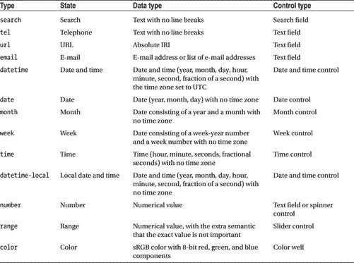
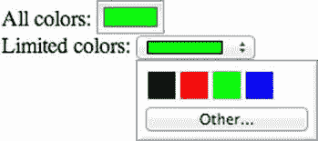
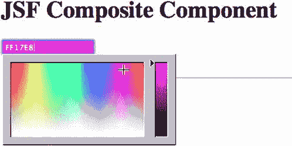
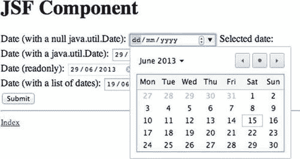
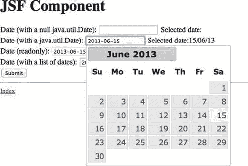
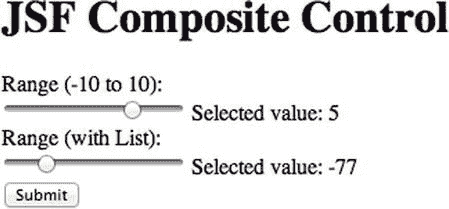
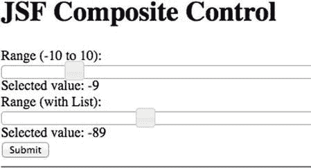
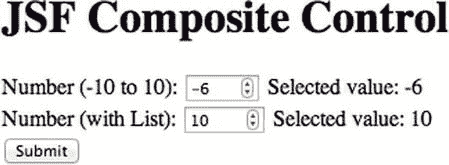
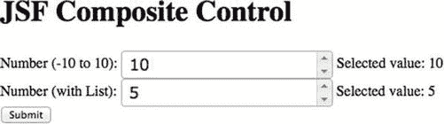

# 七、基本 JSF2 HTML5 组件

HTML5 引入了新的 web 表单元素来迎合常见的输入类型。这些新元素都没有 JSF 元素。在这一章中，我们将研究四种新的 HTML5 输入类型，并将它们实现为复合组件。本章中实现的输入类型是输入颜色、日期选择器、滑块和微调器类型。其他组件留给读者作为练习来实现。新输入类型的完整列表可在表 7-1 中找到。

表 7-1 。HTML5 中的新输入类型



输入颜色自定义组件

在本节中，我们将把 HTML5 颜色输入元素实现为一个复合组件。颜色输入的目的是允许用户使用浏览器内置的原生颜色选择器选择简单的颜色。表 7-2 概述了颜色输入元素可用的属性 。不是所有的浏览器都支持颜色选择器，在本章的最后，我们将实现一个后备，以防浏览器不支持这个特性。

表 7-2 。颜色输入元素支持的属性

| 

属性

 | 

数据类型

 |
| --- | --- |
| `autocomplete` | 布尔代数学体系的 |
| `list` | 字符串(对数据列表的引用) |
| `value` | 字符串(具有 8 位红色、绿色和蓝色成分的 sRGB 颜色，例如#ff0000 代表红色) |

使用输入元素有两种主要方式:要么允许用户选择任何颜色，要么将颜色数量限制在预定义的颜色列表中。清单 7-1 展示了两者的一个例子。示例结果见图 7-1 。

***清单 7-1。*** 使用 HTML5 颜色输入的例子

```html
<section>
    <label for="all-colors">All colors: </label>
    <input id="all-colors" type="color" value="#00ff00" />
</section>

<section>
    <label for="limit-colors">Limited colors: </label>
    <input id="limit-colors" type="color" value="#00ff00" list="basic-colors" />
</section>

<datalist id="basic-colors">
    <option value="#000000" label="Black" />
    <option value="#ff0000" label="Red" />
    <option value="#00ff00" label="Green" />
    <option value="#0000ff" label="Blue" />
</datalist>
```



图 7-1 。HTML5 颜色输入。所有颜色将显示所有颜色的调色板，受限颜色将显示引用的数据列表中指定的调色板

创建复合组件

基于清单 7-1 中的例子，我们需要为颜色输入元素、数据列表元素和选项元素创建一个复合组件 。我们将从创建不使用数据列表的元素的基本版本开始。

***清单 7-2。*** 基本颜色输入元素的复合组件(resources/projs html 5/Input Color . XHTML)

```html
<?xml version='1.0' encoding='UTF-8' ?>
<!DOCTYPE html PUBLIC "-//W3C//DTD XHTML 1.0 Transitional//EN" 
"http://www.w3.org/TR/xhtml1/DTD/xhtml1-transitional.dtd">
<html FontName">http://www.w3.org/1999/xhtml"
      xmlns:cc="http://xmlns.jcp.org/jsf/composite"
      xmlns:jsf="http://xmlns.jcp.org/jsf">

    <cc:interface>
        <cc:attribute name="value" type="java.lang.String" default="#000000" />
    </cc:interface>

    <cc:implementation>
        <div id="#{cc.clientId}">
            <input jsf:id="#{cc.id}" name="#{cc.id}"
                   jsf:value="#{cc.attrs.value}" type="color" />
        </div>
    </cc:implementation>
</html>
```

在接口中，组件公开了一个属性(值),所选的颜色将存储在该属性中。默认情况下，颜色设置为黑色(#000000)。在实现中，组件首先由一个普通的

包装，客户端 DOM ID 作为标识符。默认情况下，包装器什么也不做，但是当页面作者需要使用 CSS 来设计页面样式时，它可能会派上用场。在包装器内部，输出实际的颜色元素。通过使用 jsf 属性名称空间，我们告诉 Facelets 输入元素应该被视为 JSF 组件。jsf:value 属性的值引用接口中的 value 属性，以便可以设置和提取选定的颜色。

使用复合组件

使用复合组件 很容易，如清单 7-3 所示。导入复合组件的名称空间(即/resources 下存储组件的目录)。导入名称空间后，可以在<名称空间:componentFileName / >访问组件。

***清单 7-3。*** 使用颜色输入复合构件

```html
<?xml version='1.0' encoding='UTF-8' ?>
<!DOCTYPE html PUBLIC "-//W3C//DTD XHTML 1.0 Transitional//EN" 
"http://www.w3.org/TR/xhtml1/DTD/xhtml1-transitional.dtd">
<html FontName">http://www.w3.org/1999/xhtml"
      xmlns:h="http://xmlns.jcp.org/jsf/html"
      xmlns:jsf="http://xmlns.jcp.org/jsf"
      xmlns:projsfhtml5="[`xmlns.jcp.org/jsf/composite/projsfhtml5`](http://xmlns.jcp.org/jsf/composite/projsfhtml5)">
    <h:head>
        <title>Input Color Custom Component</title>
    </h:head>
    <h:body>
        <h1>Input Color Custom Component</h1>
        <h:form id="frm">
            <projsfhtml5:inputColor id="ic-favcolor" value="#{componentInputColor.color}" />
            <h:commandButton value="Submit" />
            <h:outputText id="selected-color" value="Color is: #{componentInputColor.color}" />
        </h:form>
    </h:body>
</html>
```

复合组件引用了清单 7-4 中受管 bean 上的一个普通字符串属性，名为 ComponentInputColor#color。点击提交按钮时，选择的颜色被保存在属性中进行处理，如图图 7-2 所示。

***清单 7-4。***【ComponentInputColor.java】代表存储所选颜色的支持 Bean

```html
package projsfandhtml5.chapter7;

import javax.faces.bean.ManagedBean;
import javax.faces.bean.ViewScoped;

@ManagedBean
@ViewScoped
public class ComponentInputColor {

    private String color = "";

    public String getColor() {
        return color;
    }

    public void setColor(String color) {
        this.color = color;
    }
}
```


图 7-2 。运行中的颜色输入复合组件。用户通过单击颜色控件选择颜色，然后单击提交。所选颜色的代码显示在提交按钮旁边

支持列表

许多新的 HTML5 输入元素支持使用列表。列表的目的是限制给定控件中的用户选择。在本节中，我们将创建一个通用组件，它可以被任何支持 list 属性的输入元素重用。

该实现需要两个复合组件:一个表示<datalist>元素，另一个表示嵌套的<option>元素。</option></datalist>

***清单 7-5。*** 表示嵌套的<选项>标签的复合组件(resources/projsfhtml 5/option . XHTML)

```html
<?xml version='1.0' encoding='UTF-8' ?>
<!DOCTYPE html PUBLIC "-//W3C//DTD XHTML 1.0 Transitional//EN" 
"http://www.w3.org/TR/xhtml1/DTD/xhtml1-transitional.dtd">
<html FontName">http://www.w3.org/1999/xhtml"
      xmlns:cc="http://xmlns.jcp.org/jsf/composite">

    <cc:interface>
        <cc:attribute name="value" type="java.lang.String" default="" />
        <cc:attribute name="label" type="java.lang.String" default="" />
    </cc:interface>

    <cc:implementation>
        <option value="#{cc.attrs.value}" label="#{cc.attrs.label}" />
    </cc:implementation>
</html>
```

option composite 组件在其接口中定义了两个属性:一个属性用于标签，一个属性用于值。label 的目的是提供一个用户友好的值表示，该值是在后台使用的机器友好的值。

***清单 7-6。*** 复合组件，表示颜色输入将为选项引用的外部数据列表(resources/projsfhtml 5/Datalist . XHTML)

```html
<?xml version='1.0' encoding='UTF-8' ?>
<!DOCTYPE html PUBLIC "-//W3C//DTD XHTML 1.0 Transitional//EN"
"http://www.w3.org/TR/xhtml1/DTD/
xhtml1-transitional.dtd">
<html FontName">http://www.w3.org/1999/xhtml"
      xmlns:cc="http://xmlns.jcp.org/jsf/composite">

    <cc:interface>
    </cc:interface>

    <cc:implementation>
        <datalist id="#{cc.id}">
            <cc:insertChildren />
        </datalist>
    </cc:implementation>
</html>
```

关于 datalist 组件，值得注意的一点是，它使用复合组件的 ID 作为自己的 ID。这意味着输入组件可以使用 datalist 的 ID 引用 datalist，而无需考虑名称空间。另一件要注意的事情是，它将嵌套在复合组件中的所有内容插入到 datalist 元素中。

***清单 7-7。*** 使用 Datalist 和 Option 复合组件。选项嵌套在数据列表中

```html
<projsfhtml5:dataList id="available-colors">
    <projsfhtml5:option value="#ff0000" label="Red"/>
    <projsfhtml5:option value="#00ff00" label="Green"/>
    <projsfhtml5:option value="#0000ff" label="Blue"/>
</projsfhtml5:dataList>
```

***清单 7-8。*** HTML 从清单 7-7 中的复合组件输出

```html
<datalist id="available-colors">
    <option value="#ff0000" label="Red"></option>
    <option value="#00ff00" label="Green"></option>
    <option value="#0000ff" label="Blue"></option>
</datalist>
```

剩下的惟一事情是支持 inputColor 组件中的列表。这是通过在接口中引入一个名为 list 的新属性来实现的，并在 color 元素的实现中引用该属性。

***清单 7-9。*** 在 inputColor 组件中实现对列表的支持(resources/projs html 5/input color . XHTML)

```html
<?xml version='1.0' encoding='UTF-8' ?>
<!DOCTYPE html PUBLIC "-//W3C//DTD XHTML 1.0 Transitional//EN" 
"http://www.w3.org/TR/xhtml1/DTD/xhtml1-transitional.dtd">
<html FontName">http://www.w3.org/1999/xhtml"
      xmlns:cc="http://xmlns.jcp.org/jsf/composite"
      xmlns:jsf="http://xmlns.jcp.org/jsf">

    <cc:interface>
        <cc:attribute name="value" type="java.lang.String" default="#000000" />
        <cc:attribute name="list" type="java.lang.String" default="" />
        <cc:clientBehavior name="change"
                           event="change"
                           targets="#{cc.id}" />
    </cc:interface>

    <cc:implementation>
        <div id="#{cc.clientId}">
            <input jsf:id="#{cc.id}" name="#{cc.id}" jsf:value="#{cc.attrs.value}" type="color"
                   list="#{cc.attrs.list}"/>
        </div>
    </cc:implementation>
</html>
```

Ajax——启用组件

JSF 2 引入了带有< f:ajax/ >标签的原生 Ajax 请求 。您可以在复合组件中使用 Ajax 标记，方法是声明您想要广播的事件以及该事件来自复合组件内部的何处。使用 clientBehavior 标记在复合组件的接口中完成公告。

***清单 7-10。*** 当颜色输入的值改变时，广播一个事件进行 Ajax 处理

```html
<?xml version='1.0' encoding='UTF-8' ?>
<!DOCTYPE html PUBLIC "-//W3C//DTD XHTML 1.0 Transitional//EN" 
"http://www.w3.org/TR/xhtml1/DTD/xhtml1-transitional.dtd">
<html FontName">http://www.w3.org/1999/xhtml"
      xmlns:cc="http://xmlns.jcp.org/jsf/composite"
      xmlns:jsf="http://xmlns.jcp.org/jsf">

    <cc:interface>
        <cc:attribute name="value" type="java.lang.String" default="#000000" />
        <cc:attribute name="list" type="java.lang.String" default="" />
        <cc:clientBehavior name="change" targets="#{cc.id}" event="change" />
    </cc:interface>

    <cc:implementation>
        <div id="#{cc.clientId}">
            <input jsf:id="#{cc.id}" name="#{cc.id}" jsf:value="#{cc.attrs.value}" type="color"
                   list="#{cc.attrs.list}"/>
        </div>
    </cc:implementation>
</html>
```

clientBehavior 有三个属性:name，包含可以在组件外部监听的事件的名称；目标，包含被监视组件的列表；和 event，JavaScript 事件的名称(没有 on 位，例如 onchange 事件应该是 change)被捕获并转发给监听该类型事件的任何人。

***清单 7-11。*** 监听变更事件，执行并呈现组件和输出文本

```html
<?xml version='1.0' encoding='UTF-8' ?>
<!DOCTYPE html PUBLIC "-//W3C//DTD XHTML 1.0 Transitional//EN" 
"http://www.w3.org/TR/xhtml1/DTD/xhtml1-transitional.dtd">
<html FontName">http://www.w3.org/1999/xhtml"
      xmlns:h="http://xmlns.jcp.org/jsf/html"
      xmlns:jsf="http://xmlns.jcp.org/jsf"
      xmlns:projsfhtml5="http://xmlns.jcp.org/jsf/composite/projsfhtml5"
      xmlns:f="http://xmlns.jcp.org/jsf/core">
    <h:head>
        <title>Input Color Custom Component with DataList and Ajax support</title>
    </h:head>
    <h:body>
        <h1>Input Color Custom Component with DataList and Ajax support</h1>
        <h:form id="frm">

            <projsfhtml5:inputColor id="ic-favcolor" value="#{componentInputColor.color}"
                                    list="available-colors">
                <f:ajax event="change" render=":frm:selected-color" execute="@this " />
            </projsfhtml5:inputColor>

            <projsfhtml5:dataList id="available-colors">
                <projsfhtml5:option value="#ff0000" label="Red"/>
                <projsfhtml5:option value="#00ff00" label="Green"/>
                <projsfhtml5:option value="#0000ff" label="Blue"/>
            </projsfhtml5:dataList>

            <h:commandButton value="Submit" />

            <h:outputText id="selected-color" value="Color is: #{componentInputColor.color}" />

        </h:form>
    </h:body>
</html>
```

使用 inputColor 组件接口中的 clientBehavior，您可以用一个标签来嵌套它，在这里您可以监听广播的事件。

不支持的浏览器的回退

如果您在不支持 HTML5 颜色输入的浏览器中尝试了上一章中的示例，您将在屏幕上看到一个文本字段，如图图 7-3 所示，而不是一个颜色选择器。


图 7-3 。在不支持的浏览器上呈现的颜色输入

支持回退要求能够检测浏览器是否支持给定的特性。如果它不支持自定义组件提供的功能，则应提供替代显示。

在回退示例清单 7-12 中，我们首先检查浏览器是否支持颜色输入。如果不支持颜色输入，我们使用 jscolor 库(在 www.jscolor.com 的[可以免费获得)提供一个后备，如图](http://www.jscolor.com)图 7-4 所示。

***清单 7-12。*** 支持回退到 JavaScript 颜色选择器

```html
<?xml version='1.0' encoding='UTF-8' ?>
<!DOCTYPE html PUBLIC "-//W3C//DTD XHTML 1.0 Transitional//EN" 
"http://www.w3.org/TR/xhtml1/DTD/xhtml1-transitional.dtd">
<html FontName">http://www.w3.org/1999/xhtml"
      xmlns:cc="http://xmlns.jcp.org/jsf/composite"
      xmlns:jsf="http://xmlns.jcp.org/jsf"
      xmlns:h="http://xmlns.jcp.org/jsf/html">

    <!-- INTERFACE -->
    <cc:interface>
        <cc:attribute name="value" type="java.lang.String" default="#000000" />
        <cc:attribute name="list" type="java.lang.String" default="" />
        <cc:clientBehavior name="change" targets="#{cc.id}" event="change" />
    </cc:interface>

    <!-- IMPLEMENTATION -->
    <cc:implementation>
        <h:outputScript library="js" name="jscolor.js" />

        <div id="#{cc.clientId}">
            <input jsf:id="#{cc.id}" jsf:value="#{cc.attrs.value}" type="color"
                   list="#{cc.attrs.list}"/>

            <script type="text/javascript">
                function html5_supports_input(type) {
                    var i = document.createElement("input");
                    i.setAttribute("type", type);
                    return i.type === type;
                }

                if (!html5_supports_input('color')) {
                    // The color input is not supported on the browser.
                    // Provide an alternative way of rendering the color picker,
                    // e.g. jscolor ([`jscolor.com/`](http://jscolor.com/))
                    var componentId = '${cc.clientId}:${cc.id}'.replace(/:/g, "\\:");
                    new jscolor.color(document.getElementById('${cc.clientId}:${cc.id}'), {})
                }
            </script>

        </div>
    </cc:implementation>
</html>
```



图 7-4 。inputColor 组件的回退版本 ??

 **提示**您可以使用像 Modernizr([www.modernizr.com](http://www.modernizr.com))这样的 JavaScript 库来检测 HTML5 和 CSS3 的本地实现的可用性，而不是实现您自己的 HTML5 特性检测算法。

输入日期选择器自定义组件

在本节中，我们将把 HTML5 日期选择器输入元素实现为一个复合组件。日期选择器输入的目的是允许用户使用浏览器内置的本地日期选择器选择日期。不是所有的浏览器都支持日期选择器，所以像颜色选择器一样，我们将提供一个后备，这次使用 JQuery-UI。像颜色输入组件一样，日期输入组件也支持 change 事件，我们将捕捉并广播到支持 Ajax 的组件。

表 7-3 包含日期输入元素支持的属性列表。我们将在复合组件中实现所有属性。如何使用属性的例子可以在清单 7-13 中找到。

表 7-3 。日期输入元素支持的属性

| 

属性

 | 

数据类型

 |
| --- | --- |
| `Autocomplete` | 布尔代数学体系的 |
| `List` | 字符串(对数据列表的引用) |
| `Value` | 日期字符串(年-月数-日数，例如 1970-01-10 是 1970 年 1 月 10 日<sup class="calibre20">日</sup> |
| `Max` | 日期字符串(用户可以选择的最晚可能日期) |
| `Min` | 日期字符串(用户可以选择的最早日期) |
| `Readonly` | 布尔代数学体系的 |
| `Required` | 布尔代数学体系的 |
| `Step` | 整数(每步改变的天数) |

***清单 7-13。*** 利用 HTML5 输入日期的例子

```html
<section>
   <label for="without-value">Date (without a preset date): </label>
       <input id="withouth-value" type="date" value="" />
   </section>

   <section>
       <label for="with-value">Date (with a preset date): </label>
       <input id="with-value" type="date" value="2013-05-03" step="10" />
   </section>

   <section>
       <label for="with-constraints">Date (with a constraints): </label>
       <input id="with-constraints" type="date" value="2013-05-03"
              min="2013-05-01" max="2013-05-31" />
   </section>

   <section>
       <label for="readonly">Date (readonly): </label>
       <input id="readonly" type="date" value="2013-05-03"
              readonly />
   </section>

   <section>
       <label for="with-list">Date (with list of dates): </label>
       <input id="with-list" type="date" value="" list="available-dates"  />
   </section>

   <datalist id="available-dates">
       <option value="2013-01-01" label="1st Option" />
       <option value="2013-03-10" label="2nd Option" />
       <option value="2013-06-19" label="3rd Option" />
       <option value="2013-10-10" label="4th Option" />
   </datalist>
</section>
```

创建复合组件

基于清单 7-13 中的 HTML5 示例，我们可以重用颜色输入组件中的 datalist 和 option 组件的实现。请注意，HTML5 中输入的日期值是一个年-月-日格式的字符串(例如 2013-04-20)。为了避免不必要的数据转换，我们将使用日期/时间转换器，以便组件的值可以设置为 java.util.Date 。

清单 7-14 显示了一个支持 HTML5 中指定属性的基本实现。组件的值是一个 java.util.Date，并使用 input 元素中嵌套的< f:convertDateTime / >转换器自动转换。required 和 readonly 属性具有 jsf 等效项，因此通过在属性前添加 JSF 前缀(即 JSF:readonly = " # { cc . attrs . readonly } ")将它们直接映射到 JSF。您可能已经注意到，min 和 max 属性并没有从接口直接映射到实现。不可能将转换器应用于属性值。这意味着我们不能简单地将接口中 min 属性的 java.util.Date 值赋给实现中的 min 属性。如果我们直接映射属性，则实现中 min 属性的值将呈现为 java.util.Date 值的“toString()”表示，其形式为:星期几+月名+月日+小时:分钟:秒+时区+年，例如，星期六 Jun 15 11:24:21 CET 2013。此格式与 HTML5 指定的格式(即年-月-日)不一致。因为我们不能在属性值上应用转换器，所以我们必须为负责数据对话的组件实现一个后备 bean。

***清单 7-14。*** 复合组件为 inputDate 组件(resources/projs html 5/input date . XHTML)

```html
<?xml version='1.0' encoding='UTF-8' ?>
<!DOCTYPE html PUBLIC "-//W3C//DTD XHTML 1.0 Transitional//EN" 
"http://www.w3.org/TR/xhtml1/DTD/xhtml1-transitional.dtd">
<html FontName">http://www.w3.org/1999/xhtml"
      xmlns:cc="http://xmlns.jcp.org/jsf/composite"
      xmlns:jsf="http://xmlns.jcp.org/jsf"
      xmlns:h="http://xmlns.jcp.org/jsf/html"
      xmlns:f="http://xmlns.jcp.org/jsf/core">

    <cc:interface>
        <cc:attribute name="value" type="java.util.Date" required="true" />
        <cc:attribute name="list" type="java.lang.String" default="" />
        <cc:attribute name="step" type="java.lang.String" default="1" />
        <cc:attribute name="min" type="java.util.Date" />
        <cc:attribute name="max" type="java.util.Date" />
        <cc:attribute name="readonly" type="java.lang.String" default="false" />
        <cc:attribute name="required" type="java.lang.String" default="false" />
        <cc:clientBehavior name="change" targets="date" event="change" />
    </cc:interface>

    <cc:implementation>
        <div id="#{cc.clientId}">
            <input jsf:id="date"
                   type="date"
                   jsf:value="#{cc.attrs.value}"
                   jsf:readonly="#{cc.attrs.readonly != 'false' ? 'true' : 'false'}"
                   jsf:required="#{cc.attrs.required != 'false' ? 'true' : 'false'}"
                   step="#{cc.attrs.step}"
                   list="#{cc.attrs.list}">
                <f:convertDateTime pattern="yyyy-MM-dd" />
            </input>
        </div>
    </cc:implementation>
</html>
```

为复合组件创建支持 Bean

复合组件支持 bean 必须扩展 javax . faces . component . uinamingcontainer。按照惯例，通过将支持 bean 命名为与复合组件相同的名称，并将支持 bean 放在与复合组件所在目录同名的包中，可以自动将支持 bean 映射到复合组件。或者，可以用@FacesComponent 注释来注释支持 bean，并将组件类型指定为注释的值。然后可以在复合组件的接口中指定组件类型。手动映射支持 bean 的好处是，其他复合组件可以重用支持 bean，并且不必将支持 bean 命名为与复合组件相同的名称。

清单 7-15 显示了一个为 inputDate 类型的复合组件声明的后备 bean 的基本示例。通过将接口的 componentType 属性设置为@FacesComponent 注释中声明的名称，复合组件映射到支持 bean，例如<cc:interface component type = " input date ">。

***清单 7-15。*** 为 inputDate 组件声明的空支持 Bean

```html
package projsfhtml5;

import javax.faces.component.FacesComponent;
import javax.faces.component.UINamingContainer;

@FacesComponent("inputDate")
public class InputDateComponent extends UINamingContainer {

}
```

为了支持 min 和 max 属性，我们需要 backing bean 上的两个属性:一个用于保存最小日期的字符串表示，另一个用于保存最大日期的字符串表示。我们将属性命名为 minDate 和 maxDate。通过为这两个属性提供 getters，它们将自动对复合组件可用。然后，我们将覆盖 encodeBegin 方法，从接口中提取 java.util.Dates，并将它们转换为可以在实现中使用的 HTML5 格式的日期。

***清单 7-16。*** Backing Bean 转换并暴露最小和最大日期

```html
package projsfhtml5;

import java.io.IOException;
import java.text.DateFormat;
import java.text.SimpleDateFormat;
import javax.faces.component.FacesComponent;
import javax.faces.component.UINamingContainer;
import javax.faces.context.FacesContext;

@FacesComponent("inputDate")
public class InputDateComponent extends UINamingContainer {

    private static final DateFormat HTML5_FORMAT = new SimpleDateFormat("yyyy-MM-dd");
    private String minDate = "";
    private String maxDate = "";

    @Override
    public void encodeBegin(FacesContext context) throws IOException {

        // Extract the minimum date from the interface
        java.util.Date attrsMin = (java.util.Date) getAttributes().get("min");
        if (attrsMin != null) {
            // Convert the date to an HTML5 date
            minDate = HTML5_FORMAT.format(attrsMin);
        }

        // Extract the maximum date from the interface
        java.util.Date attrsMax = (java.util.Date) getAttributes().get("max");
        if (attrsMax != null) {
            // Convert the date to an HTML5 date
            maxDate = HTML5_FORMAT.format(attrsMax);
        }

        super.encodeBegin(context);
    }

    /**
     * Gets the minimum date selectable in the date picker.
     *
     * @return Date formatted using the {@link inputDate#HTML5_FORMAT}
     */
    public String getMinDate() {
        return minDate;
    }

    /**
     * Gets the maximum date selectable in the date picker.
     *
     * @return Date formatted using the {@link inputDate#HTML5_FORMAT}
     */
    public String getMaxDate() {
        return maxDate;
    }
}
```

使用复合组件

有了后备 bean，我们就可以访问包含转换后的日期的 minDate 和 maxDate 属性，并将它们插入到复合组件的实现中。

***清单 7-17。*** 复合组件使用 Backing Bean 并访问转换后的值

```html
<?xml version='1.0' encoding='UTF-8' ?>
<!DOCTYPE html PUBLIC "-//W3C//DTD XHTML 1.0 Transitional//EN" 
"http://www.w3.org/TR/xhtml1/DTD/xhtml1-transitional.dtd">
<html FontName">http://www.w3.org/1999/xhtml"
      xmlns:cc="http://java.sun.com/jsf/composite"
      xmlns:jsf="http://xmlns.jcp.org/jsf"
      xmlns:h="http://xmlns.jcp.org/jsf/html"
      xmlns:f="http://xmlns.jcp.org/jsf/core">

    <cc:interface componentType="inputDate">
        <cc:attribute name="value" type="java.util.Date" required="true" />
        <cc:attribute name="list" type="java.lang.String" default="" />
        <cc:attribute name="step" type="java.lang.String" default="1" />
        <cc:attribute name="min" type="java.util.Date" />
        <cc:attribute name="max" type="java.util.Date" />
        <cc:attribute name="readonly" type="java.lang.String" default="false" />
        <cc:attribute name="required" type="java.lang.String" default="false" />
        <cc:clientBehavior name="change" targets="date" event="change" />
    </cc:interface>

    <cc:implementation>
        <div id="#{cc.clientId}">
            <input jsf:id="date"
                   type="date"
                   jsf:value="#{cc.attrs.value}"
                   jsf:readonly="#{cc.attrs.readonly != 'false' ? 'true' : 'false'}"
                   jsf:required="#{cc.attrs.required != 'false' ? 'true' : 'false'}"
                   step="#{cc.attrs.step}"
                   min="#{cc.minDate}"
                   max="#{cc.maxDate}"
                   list="#{cc.attrs.list}">
                <f:convertDateTime pattern="yyyy-MM-dd" />
            </input>
        </div>
    </cc:implementation>
</html>
```

有了复合组件和后台 bean，我们就可以使用该组件了。清单 7-18 显示了一些示例，并附有图 7-5 中的截图。

***清单 7-18。*** 使用 inputDate 复合组件的例子

```html
<h:form>
    <h1>JSF Component</h1>
    <section>
        <label>Date (with a null java.util.Date): </label>
        <projsfhtml5:inputDate value="#{componentInputDate.emptyDate}" />

        <h:outputLabel value="Selected date:" />
        <h:outputText value="#{componentInputDate.emptyDate}">
            <f:convertDateTime dateStyle="short" />
        </h:outputText>
    </section>
    <section>
        <label>Date (with a java.util.Date): </label>
        <projsfhtml5:inputDate value="#{componentInputDate.selectedDate}"
                               step="10"
                               min="#{componentInputDate.minDate}"
                               max="#{componentInputDate.maxDate}" />

        <h:outputLabel value="Selected date:" />
        <h:outputText value="#{componentInputDate.selectedDate}">
            <f:convertDateTime dateStyle="short" />
        </h:outputText>
    </section>
    <section>
        <label>Date (readonly): </label>
        <projsfhtml5:inputDate value="#{componentInputDate.selectedDate}"
                               readonly="true" />
    </section>
    <section>
        <label>Date (with a list of dates): </label>
         <projsfhtml5:inputDate value="#{componentInputDate.selectedDate2}"
                                list="available-dates"  />

         <projsfhtml5:dataList id="available-dates">
             <projsfhtml5:option label="1st Option" value="2012-01-01" />
             <projsfhtml5:option label="2nd Option" value="2012-01-02" />
             <projsfhtml5:option label="3rd Option" value="2012-01-03" />
         </projsfhtml5:dataList>
         <h:outputLabel value="Selected date:" />
         <h:outputText value="#{componentInputDate.selectedDate2}">
             <f:convertDateTime dateStyle="short" />
         </h:outputText>
     </section>
     <h:commandButton value="Submit" />
</h:form>
```



图 7-5 。运行中的<项目 html5:输入日期/ >组件

不支持的浏览器的回退

不支持 HTML 日期输入的浏览器会呈现一个带有日期的纯文本字段，就像上一节中的颜色输入一样。为了提供后备，我们可以再次使用 JavaScript 来检查浏览器是否支持该特性，如果不支持，我们可以提供控件的替代显示。在下面的例子中，我们使用 Modernizr 检查浏览器是否支持该特性，如果不支持，我们使用 JQuery-UI 的 DatePicker 组件，如图 7-6 所示。



图 7-6 。如果浏览器不支持 HTML5 日期输入，则返回 JQuery-UI

***清单 7-19。*** 使用 JQuery-UI 和 Modernizr 支持回退

```html
<?xml version='1.0' encoding='UTF-8' ?>
<!DOCTYPE html PUBLIC "-//W3C//DTD XHTML 1.0 Transitional//EN" 
"http://www.w3.org/TR/xhtml1/DTD/xhtml1-transitional.dtd">
<html FontName">http://www.w3.org/1999/xhtml"
      xmlns:cc="http://java.sun.com/jsf/composite"
      xmlns:jsf="http://xmlns.jcp.org/jsf"
      xmlns:h="http://xmlns.jcp.org/jsf/html"
      xmlns:f="http://xmlns.jcp.org/jsf/core">

    <cc:interface componentType="inputDate">
        <cc:attribute name="value" type="java.util.Date" required="true" />
        <cc:attribute name="list" type="java.lang.String" default="" />
        <cc:attribute name="step" type="java.lang.String" default="1" />
        <cc:attribute name="min" type="java.util.Date" />
        <cc:attribute name="max" type="java.util.Date" />
        <cc:attribute name="readonly" type="java.lang.String" default="false" />
        <cc:attribute name="required" type="java.lang.String" default="false" />
        <cc:clientBehavior name="change" targets="date" event="change" />
    </cc:interface>

    <cc:implementation>
        <h:outputStylesheet library="css" name="jquery-ui.css" />
        <h:outputScript target="head" library="js" name="modernizr.js" />
        <h:outputScript target="head" library="js" name="jquery-1.9.1.js" />
        <h:outputScript target="head" library="js" name="jquery-ui.js" />
        <script type="text/javascript">
            if (!Modernizr.inputtypes.date) {
                jQuery(function() {
                    var id = '${cc.clientId}:date'.replace(/:/g, "\\:");
                    jQuery("#" + id).datepicker({ dateFormat: 'yy-mm-dd' });
                });
            }
        </script>

        <div id="#{cc.clientId}">
            <input jsf:id="date" type="date" jsf:value="#{cc.attrs.value}"
                   jsf:readonly="#{cc.attrs.readonly != 'false' ? 'true' : 'false'}"
                   jsf:required="#{cc.attrs.required != 'false' ? 'true' : 'false'}"
                   step="#{cc.attrs.step}" min="#{cc.minDate}" max="#{cc.maxDate}"
                   list="#{cc.attrs.list}">
                <f:convertDateTime pattern="yyyy-MM-dd" />
            </input></div>
    </cc:implementation>
</html>
```

 **注意**在复合组件中使用< h:outputScript/ >和< h:outputStylesheet/ >的一个好处是，即使在一个页面中多次使用该组件，它也只会被包含一次。

滑块自定义组件

在本节中，我们将把 HTML5 range input 元素实现为一个复合组件。范围输入的目的是允许用户使用浏览器内置的本地滑块控件在数字范围内选择一个值。不是所有的浏览器都支持范围输入，所以像日期选择器一样，我们将使用 JQuery-UI 提供一个后备。我们还将支持 Ajax 事件，因为它们对于滑块向用户提供关于所选值的即时反馈特别有用。

表 7-4 包含范围输入元素支持的属性列表。我们将在复合组件中实现所有属性。如何使用属性 的例子可以在清单 7-20 中找到

表 7-4 。范围输入元素支持的属性

| 

属性

 | 

数据类型

 |
| --- | --- |
| `autocomplete` | 布尔代数学体系的 |
| `list` | 字符串(对数据列表的引用) |
| `value` | 代表范围中所选值的数字 |
| `max` | 范围控件中的上限 |
| `min` | 范围控件的下限 |
| `step` | 使用范围控制时要步进的数字 |

***清单 7-20。*** 使用 HTML5 范围输入的例子

```html
<section>
    <label for="without-value">Range (without value): </label>
    <input id="withouth-value" type="range" />
</section>

<section>
    <label for="min-to-max">Range (-10 to 10): </label>
    <input id="min-to-max" type="range" min="-10" max="10" value="0" />
</section>

<section>
    <label for="range-list">Range (list): </label>
    <input id="range-list" type="range" value="0" list="list" />
</section>

<datalist id="list">
    <option value="-100" />
    <option value="-75" />
    <option value="-50" />
    <option value="-25" />
    <option value="0" />
</datalist>
```

创建复合组件

范围组件的实现非常简单。相关的属性被添加到接口中，同时广播 JavaScript change 事件。该实现包含 JavaScript 库，用于在浏览器不支持 HTML5 输入范围控件的情况下进行后备。它还包括内联 JavaScript 检查输入范围控件是否受支持，如果不受支持，则使用 JQuery 和 JQuery UI 将

元素转换为范围控件。这个组件中的内联 JavaScript 比前面的组件稍微复杂一些。这是因为 JQuery UI 中的 slider 控件不是应用于一个<input>元素，而是应用于一个元素。这意味着每次移动滑块时，我们都需要更新<input>元素并触发一个 change 事件，以保持功能与原生 HTML5 版本一致。

***清单 7-21。*** 用于 inputRange 的复合组件(resources/projs html 5/input range . XHTML)

```html
<?xml version='1.0' encoding='UTF-8' ?>
<!DOCTYPE html PUBLIC "-//W3C//DTD XHTML 1.0 Transitional//EN" 
"http://www.w3.org/TR/xhtml1/DTD/xhtml1-transitional.dtd">
<html FontName">http://www.w3.org/1999/xhtml"
      xmlns:cc="http://java.sun.com/jsf/composite"
      xmlns:jsf="http://xmlns.jcp.org/jsf"
      xmlns:h="http://xmlns.jcp.org/jsf/html"
      xmlns:f="http://xmlns.jcp.org/jsf/core">

    <cc:interface>
        <cc:attribute name="value" type="java.lang.String" />
        <cc:attribute name="list" type="java.lang.String" default="" />
        <cc:attribute name="step" type="java.lang.String" default="1" />
        <cc:attribute name="min" type="java.lang.String" />
        <cc:attribute name="max" type="java.lang.String" />
        <cc:clientBehavior name="change" targets="range" event="change" />
    </cc:interface>

    <cc:implementation>
        <h:outputStylesheet library="css" name="jquery-ui.css" />
        <h:outputScript target="head" library="js" name="modernizr.js" />
        <h:outputScript target="head" library="js" name="jquery-1.9.1.js" />
        <h:outputScript target="head" library="js" name="jquery-ui.js" />

        <script type="text/javascript">
            if (!Modernizr.inputtypes.range) {
                jQuery(function() {
                    var rangeId = '${cc.clientId}:range'.replace(/:/g, "\\:");
                    var hideId = '${cc.clientId}'.replace(/:/g, "\\:");
                    jQuery("#" + hideId).hide();

                    var id = '${cc.clientId}:fallback'.replace(/:/g, "\\:");
                    jQuery("#" + id).slider({
                            min: #{cc.attrs.min},
                            max: #{cc.attrs.max},
                            step: #{cc.attrs.step},
                            slide: function(event, ui) {
                                // Update the value of the input element and fire a change event
                                jQuery("#" + rangeId).val(ui.value).change();
                            }});
                    });
            }
        </script>

        <!-- Div used for fallback in case the HTML5 range control is not supported -->
        <div id="#{cc.clientId}:fallback" style="display: block"></div>

        <div id="#{cc.clientId}">
            <input jsf:id="range" type="range" jsf:value="#{cc.attrs.value}"
                   step="#{cc.attrs.step}" min="#{cc.attrs.min}" max="#{cc.attrs.max}"
                   list="#{cc.attrs.list}" />
        </div>
    </cc:implementation>
</html>
```

使用复合组件

清单 7-22 展示了一些复合控件的例子，并附带了图 7-7 (原生 HTML5 支持)和图 7-8 (回退)中的截图。

***清单 7-22。*** 使用 inputRange 复合组件的例子

```html
<h1>JSF Composite Control</h1>
<section>
    <label for="min-to-max">Range (-10 to 10): </label>
    <projsfhtml5:inputRange value="#{componentInputRange.range1}" min="-10" max="10">
        <f:ajax event="change" execute="@this" render=":frm:selectedValue" />
    </projsfhtml5:inputRange>
    <h:outputText id="selectedValue" value="Selected value: #{componentInputRange.range1}"/>
</section>

<section>
    <label for="with-list">Range (with List): </label>
    <projsfhtml5:inputRange value="#{componentInputRange.range2}" min="-100" max="10" list="range-options">
        <f:ajax event="change" execute="@this" render=":frm:selectedValue2" />
    </projsfhtml5:inputRange>
    <h:outputText id="selectedValue2" value="Selected value: #{componentInputRange.range2}"/>
    <projsfhtml5:dataList id="range-options">
        <projsfhtml5:option value="-100" />
        <projsfhtml5:option value="-75" />
        <projsfhtml5:option value="-50" />
        <projsfhtml5:option value="-25" />
        <projsfhtml5:option value="0" />
        <projsfhtml5:option value="10" />
    </projsfhtml5:dataList>
</section>

<h:commandButton value="Submit" />
```



图 7-7 。原生 HTML5 支持



图 7-8 。回退到 JQueryUI 滑块

微调器自定义组件

最后，我们将把 HTML5 数字输入元素实现为一个复合组件。数字输入的目的是允许用户使用微调控件在数字范围内选择一个值，用户可以单击向上或向下，之后所选的值递增或递减。像所有其他控件一样，所有浏览器还不支持数字控件，所以我们将再次使用 JQuery-UI 提供一个后备。

表 7-5 包含数字输入元素支持的属性列表。我们将在复合组件中实现所有属性。如何使用属性 的例子可以在清单 7-23 中看到。

表 7-5 。数字输入元素支持的属性

| 

属性

 | 

数据类型

 |
| --- | --- |
| `Autocomplete` | 布尔代数学体系的 |
| `List` | 字符串(对数据列表的引用) |
| `value` | 代表所选值的数字 |
| `max` | 微调控制项中的上限 |
| `min` | 微调控制项的下限 |
| `step` | 使用微调控件时要步进的数字 |
| `readonly` | 布尔代数学体系的 |
| `required` | 布尔代数学体系的 |

***清单 7-23。*** 利用 HTML5 输入数字的例子

```html
<section>
    <label for="without-value">Number (without value): </label>
    <input id="withouth-value" type="number" />
</section>

<section>
    <label for="min-to-max">Number (-10 to 10): </label>
    <input id="min-to-max" type="number" min="-10" max="10" value="0" />
</section>

<section>
    <label for="preselect-list">Range (list): </label>
    <input id="preselect-list" type="number" value="0" list="list" />
</section>

<datalist id="list">
    <option value="-100" />
    <option value="-75" />
    <option value="-50" />
    <option value="-25" />
    <option value="0" />
</datalist>
```

创建复合组件

数字组件的实现类似于范围组件。相关的属性被添加到接口中，同时广播 JavaScript change 事件。该实现包含 JavaScript 库，用于在浏览器不支持 HTML5 输入数字控件的情况下进行后备。它还包括内联 JavaScript 检查是否支持输入数字控件，如果不支持，则使用 JQuery 和 JQuery UI 将输入字段转换为微调控件。每当 spinner 控件用于确保 Ajax 调用被广播时，还会挂接一个事件来触发一个 change 事件。

***清单 7-24。*** 复合组件为 input number(resources/projs html 5/input number . XHTML)

```html
<?xml version='1.0' encoding='UTF-8' ?>
<!DOCTYPE html PUBLIC "-//W3C//DTD XHTML 1.0 Transitional//EN"
"http://www.w3.org/TR/xhtml1/DTD/
xhtml1-transitional.dtd">
<html FontName">http://www.w3.org/1999/xhtml"
      xmlns:cc="http://java.sun.com/jsf/composite"
      xmlns:jsf="http://xmlns.jcp.org/jsf"
      xmlns:h="http://xmlns.jcp.org/jsf/html"
      xmlns:f="http://xmlns.jcp.org/jsf/core">

    <cc:interface>
        <cc:attribute name="value" type="java.lang.String" />
        <cc:attribute name="list" type="java.lang.String" default="" />
        <cc:attribute name="step" type="java.lang.String" default="1" />
        <cc:attribute name="min" type="java.lang.String" />
        <cc:attribute name="max" type="java.lang.String" />
        <cc:attribute name="readonly" type="java.lang.String" default="false" />
        <cc:attribute name="required" type="java.lang.String" default="false" />
        <cc:clientBehavior name="change" targets="number" event="change" />
    </cc:interface>

    <cc:implementation>
        <h:outputStylesheet library="css" name="jquery-ui.css" />
        <h:outputScript target="head" library="js" name="modernizr.js" />
        <h:outputScript target="head" library="js" name="jquery-1.9.1.js" />
        <h:outputScript target="head" library="js" name="jquery-ui.js" />

        <script type="text/javascript">
            if (!Modernizr.inputtypes.number) {
                jQuery(function() {
                    var id = '${cc.clientId}:number'.replace(/:/g, "\\:");
                    jQuery("#" + id).spinner();

                    jQuery('.ui-spinner-button').click(function() {
                        jQuery(this).siblings('input').change();
                    });
                });
            }
        </script>

        <div id="#{cc.clientId}">
            <input jsf:id="number" type="number" jsf:value="#{cc.attrs.value}"
                   step="#{cc.attrs.step}" min="#{cc.attrs.min}" max="#{cc.attrs.max}"
                   list="#{cc.attrs.list}"
                   jsf:readonly="#{cc.attrs.readonly != 'false' ? 'true' : 'false'}"
                   jsf:required="#{cc.attrs.required != 'false' ? 'true' : 'false'}"/>
        </div>
    </cc:implementation>
</html>
```

使用复合组件

清单 7-25 展示了复合控件 的一些例子，并附有截图图 7-9 (原生 HTML5 支持)和图 7-10 (回退)。

***清单 7-25。*** 使用 inputNumber 复合组件的例子

```html
<section>
    <label for="min-to-max">Number (-10 to 10): </label>
    <projsfhtml5:inputNumber value="#{componentInputNumber.number1}" min="-10" max="10">
        <f:ajax event="change" execute="@this" render=":frm:selectedValue" />
    </projsfhtml5:inputNumber>
    <h:outputText id="selectedValue" value="Selected value: #{componentInputNumber.number1}"/>
</section>

<section>
    <label for="with-list">Number (with List): </label>
    <projsfhtml5:inputNumber value="#{componentInputNumber.number2}" min="-100" max="10"
                             list="number-options">
        <f:ajax event="change" execute="@this" render=":frm:selectedValue2" />
    </projsfhtml5:inputNumber>
    <h:outputText id="selectedValue2" value="Selected value: #{componentInputNumber.number2}"/>
    <projsfhtml5:dataList id="number-options">
        <projsfhtml5:option value="-100" />
        <projsfhtml5:option value="-75" />
        <projsfhtml5:option value="-50" />
        <projsfhtml5:option value="-25" />
        <projsfhtml5:option value="0" />
        <projsfhtml5:option value="10" />
    </projsfhtml5:dataList>
</section>

<h:commandButton value="Submit" />
```



图 7-9 。原生 HTML5 支持



图 7-10 。回退到 JQueryUI 滑块

摘要

在这一章中，我们已经看到了将一些新的 HTML5 输入类型转换成 JSF 复合组件。在这一章中，我们研究了基本复合组件、嵌套组件和支持 Ajax 的组件的实现。复合组件为页面作者隐藏了不必要的逻辑。我们研究了如何检测浏览器是否支持我们输出的输入元素，如果不支持，就提供另一个视图。如果没有复合组件，您可能需要在每个页面上编写额外的 JavaScript 来检查兼容性。使用复合组件，所有的逻辑都包含在一个地方，很容易使用复合组件进行一个简单的更改，然后级联到所有的页面。