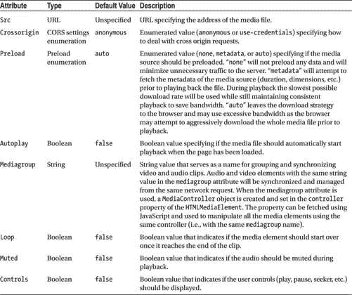
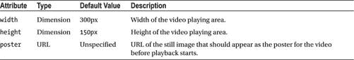
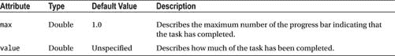
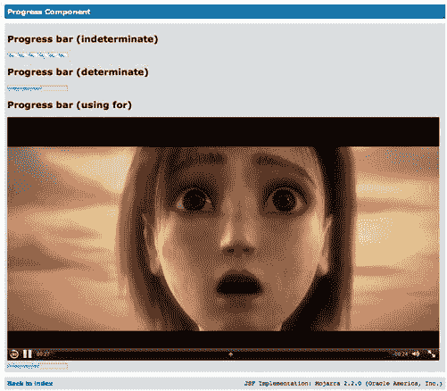

# 八、高级 JSF2 HTML5 组件

在前一章中，我们为 HTML5 中引入的一些新输入元素构建了 JSF2 组件。在本章中，我们将继续构建 JSF2 组件，这些组件利用了一些新的非输入 HTML5 元素。

媒体组件

随着移动设备使用的增加，HTML 的一个弱点变得越来越明显，那就是缺乏实现网页媒体播放器的标准化方法。在 HTML5 之前，网页作者必须使用 object 或 embed 元素通过 Java 小程序或 Flash SWFs 显示嵌入的媒体内容。如果你是一个经验丰富的网页作者，你应该知道要确保你的网页在所有浏览器上都能正常工作需要经历的所有麻烦。随着移动设备的出现，这个问题变得更加严重。尽管在过去十年中进行了各种 web 标准化努力，但您仍然必须在 web 代码中编写一些变通方法和故障转移，以确保它们在最流行的 web 浏览器和移动设备上运行良好。其中一个流行的移动平台是苹果的 iOS。早在 2010 年 4 月，史蒂夫·乔布斯写了一封公开信 <sup class="calibre18">1</sup> 解释苹果对 Flash 的想法，基本上是说 iOS 设备将不支持 Flash，未来应该使用新的开放标准(如 HTML5)来创建图形丰富的应用和游戏。

HTML5 中引入的媒体元素

用于播放视频和音频。HTML5 引入了四个新元素:音频、视频、源和轨道。音频和视频元素定义了视频或音频剪辑应该如何播放，以及网页访问者可以使用的控件。源元素嵌套在音频和视频元素中，可以插入源元素以提供媒体备选方案，web 浏览器可以根据其支持的媒体类型和编解码器从中进行选择。

 **注**你可以在 W3C 网站[www.w3.org/TR/html5/embedded-content-0.html#media-elements](http://www.w3.org/TR/html5/embedded-content-0.html#media-elements)上找到 HTML5 规范中关于媒体元素的规范细节。

音频和视频元素都实现了 HTML5 规范中指定的 HTMLMediaElement 接口。该接口定义了回放音频和视频剪辑的通用属性和方法(见表 8-1 )。可以使用音频和视频元素的属性 设置可写属性。可以通过 JavaScript 在 DOM 中访问只读属性和方法。

表 8-1 。媒体元素(音频和视频)的通用属性列表



video 元素包含一些附加属性，用于指定视频和海报(如果有)的尺寸，以便在视频回放开始之前显示。附加视频属性在表 8-2 中列出。

表 8-2 。仅适用于视频元素的附加属性列表



在清单 8-1 中，你会看到一个 HTML5 中引入的音频和视频元素的例子。该示例还展示了如何使用 JavaScript 控制媒体元素。

***清单 8-1。***html 5 中引入的音频和视频元素的基本示例，可在不使用 Java 小程序或 Flash SWFs 等插件的情况下播放音频和视频剪辑

```html
<!DOCTYPE html>
<html FontName">http://www.w3.org/1999/xhtml">
    <head>
        <meta charset="UTF-8" />
        <title>Media Element</title>
        <style>
            video, audio { display: block }
        </style>
        <script type="text/javascript">

            // Obtaining the MediaElement via JavaScript and invoking methods
            function togglePlay(source, elementId) {
                var mediaElement = document.getElementById(elementId);

                if (mediaElement.paused) {
                    mediaElement.play();
                    source.innerText = "Pause";
                } else {
                    mediaElement.pause();
                    source.innerText = "Play";
                }
            }
        </script>
    </head>
    <body>
        <article>
            <h2>Video Example</h2>

            <video id="video-example"
                   controls="controls"
                   poster="media/poster.png"
                   src="media/trailer.mp4">
                <!-- Provide fallback for browsers that doesn't support the video element -->
                <p>Browser not support the HTML5 Video element.</p>
            </video>
            <button onclick="togglePlay(this, 'video-example');">Play</button>
        </article>

        <article>
            <h2>Audio Example</h2>
            <audio id="audio-example"
                   controls="controls"
                   src="media/04-Death_Becomes_Fur.mp4">
                <!-- Provide fallback for browsers that doesn't support the audio element -->
                <p>Browser not support the HTML5 Audio element.</p>
            </audio>
            <button onclick="togglePlay(this, 'audio-example');">Play</button>
        </article>

    </body>
</html>
```

不同的网络浏览器和设备支持不同的媒体格式。可以指定多个媒体源，而不是进行设备和浏览器检测并相应地更新 src 属性。浏览器可以根据其支持的格式和编解码器自由选择最合适的媒体源。指定源时，没有必要在音频或视频元素的 src 属性中指定媒体文件。最常支持的格式和编解码器是 WebM 格式(使用 VP8 视频编解码器和 Vorbis 音频编解码器)和 MP4 格式(使用 H.264 视频编解码器和 ACC 或 MP3 音频编解码器)。

清单 8-2 是一个为提供多个视频和音频源的例子，这些视频和音频源将根据访问页面的浏览器所支持的格式自动选择。

***清单 8-2。*** 可提供多种媒体源，确保跨浏览器和设备的最佳播放效果

```html
<video id="video-example" controls="controls" poster="media/poster.png">
    <source src="media/trailer.mp4"  type="video/mp4" />
    <source src="media/trailer.webm" type="video/webm" />

    <!-- Provide fallback for browsers that doesn't support the video element -->
    <p>Browser not support the HTML5 Video element.</p>
</video>

<audio id="audio-example" controls="controls">
    <source src="media/04-Death_Becomes_Fur.mp4" type="audio/mp4" />
    <source src="media/04-Death_Becomes_Fur.oga" type="audio/ogg; codecs=vorbis" />

    <!-- Provide fallback for browsers that doesn't support the audio element -->
    <p>Browser not support the HTML5 Audio element.</p>
</audio>
```

使用 track 元素和 Web Video Text Tracks (WebVTT)格式的文件，可以将定时文本轨道(如字幕)添加到音频和视频元素中。关于这种格式的细节可以在 W3C 网站的 http://dev.w3.org/html5/webvtt/找到。通过指定轨道的种类(字幕、说明、元数据、章节和描述)，轨道可以用于不同的目的。也可以通过指定音轨的语言来本地化音轨。将根据浏览器中的语言设置自动选择曲目。

清单 8-3 是一个提供多个字幕的例子，这些字幕由浏览器根据用户偏好的地区自动选择。如果用户的首选语言环境是丹麦语，浏览器将选择丹麦语字幕。在所有其他情况下，它将回落到英文字幕。

***清单 8-3。*** 轨道元素可以用来指定多种语言的字幕；浏览器将根据其语言设置自动检测最合适的语言

```html
<video id="video-example" controls="controls" poster="media/poster.png">
    <source src="media/trailer.mp4"  type="video/mp4" />
    <source src="media/trailer.webm" type="video/webm" />

    <track src="media/subtitles_en.vtt"
           kind="subtitles" default="default"
           label="English" srclang="en" />
    <track src="media/subtitles_da.vtt"
           kind="subtitles"
           label="Dansk" srclang="da" />

    <!-- Provide fallback for browsers that doesn't support the video element -->
    <p>Browser not support the HTML5 Video element.</p>
</video>
```

 **提示** WebVTT 是取代 SRT 字幕格式的简单格式。WebVTT 文件包含一个提示列表，它指定了文本的时间。下面是在第 12 秒和第 16 秒之间以及第 18 秒和第 21 秒之间显示的两个文本的示例。

```html
WEBVTT

00:12.000 --> 00:16.000
What brings you to the land of the gatekeepers?

00:18.000 --> 00:21.000
I'm searching for someone
```

如果浏览器不支持视频或音频元素，您可以通过在视频和音频元素中添加必要的代码来指定后备。例如，你可以插入一个旧的学校 Flash SWF ，如清单 8-4 中的所示。

***清单 8-4。*** 浏览器不支持视频元素时回退到 Flash SWF 的例子

```html
<video id="video-example" controls="controls" poster="media/poster.png" src="media/trailer.mp4">
    <!-- Provide fallback for browsers that doesn't support the video element -->
    <object width="300" height="150" data="video-player.swf"
           type="application/x-shockwave-flash" title="Video Player ">
       <param name="movie" value="media/trailer.mp4" />
       <param name="height" value="300" />
       <param name="width" value="150" />
       <param name="menu" value="true" />
    </object>
</video>
```

创建 JSF 媒体组件

对于 HTML5 媒体元素的 JSF 支持，我们将为音频和视频元素创建一个组件。这两个组件将具有 HTML5 规范中的 HTMLMediaElement 中定义的公共属性。视频组件将有三个额外的属性来指定视频的尺寸，并在回放之前显示海报。为了支持媒体源和音轨，我们将在组件的接口中包含两个集合:一个用于指定可用的媒体源，一个用于可用的文本音轨。

在这种情况下，我们面临着新的挑战。html 5 中的布尔属性并不是简单的表示为 attribute="true "和 attribute="false "。HTML5 规范声明

*“元素上出现布尔属性代表真值，没有属性值代表假值。”*

这意味着我们不能将 autoplay 和 output 之类的属性作为 autoplay="true "或 autoplay="false ",因为浏览器会评估两个版本，就好像 autoplay 为 true 一样。挑战在于，我们必须读取传递给组件的值，并评估它是否应该插入到定制组件的输出中。有两种方法可以做到这一点。您可以在标签下面包含条件性的<f:passThroughAttribute/>标签，也可以在复合组件根中操作输出的元素，复合组件根是组件的一种托管 bean。我们将展示这两种方法，但是首先我们将定义复合组件的接口。

在清单 8-5 中组件接口的定义中，也有一个组件的最小实现。我们添加到视频标签的属性只在客户端有意义。也就是说，它们不会在服务器端增加任何价值。我们不需要跟踪 HTML5 属性的状态。因此，我们可以使用 JSF 2.2 中添加的传递功能来输出必要的 HTML5 属性。在清单 8-1 的最小实现中，视频标签有两个属性。这些属性以 jsf:为前缀，这告诉 Facelets TagDecorator 这些属性不是传递属性，它们应该与组件的 id 和 value 属性相匹配。TagDecorator 负责将组件映射到一个已知的 JSF 组件。例如，在前一章中创建的输入组件都映射到了< h:inputText / >或 HtmlInputText 组件。TagDecorator 不熟悉 HTML5 < video / >元素，并将它映射到一个名为 PassThroughElement 的后备类。

***清单 8-5。*** 复合组件接口，可用于视频和音频组件

```html
<?xml version='1.0' encoding='UTF-8' ?>
<!DOCTYPE html PUBLIC "-//W3C//DTD XHTML 1.0 Transitional//EN"
"http://www.w3.org/TR/xhtml1/DTD/xhtml1-transitional.dtd">
<html FontName">http://www.w3.org/1999/xhtml"
      xmlns:cc="http://xmlns.jcp.org/jsf/composite">

    <cc:interface componentType="UIMediaComponent">
        <cc:attribute name="value" type="java.lang.String"
                      shortDescription="URL of the video file to display" />
        <cc:attribute name="crossorigin" type="java.lang.String" default="anonymous"
                      shortDescription="Specifying how to deal with cross origin requests.
                                        anonymous (default) or use-credentials." />
        <cc:attribute name="preload" type="java.lang.String" default="auto"
                      shortDescription="Preload the video file. none, metadata or auto" />
        <cc:attribute name="autoplay" type="java.lang.Boolean" default="false"
                      shortDescription="Start playback as soon as the page has loaded" />
        <cc:attribute name="mediagroup" type="java.lang.String" default=""
                      shortDescription="Media group for which the video file belong" />
        <cc:attribute name="loop" type="java.lang.Boolean" default="false"
                      shortDescription="Restart the video once it reaches the end" />
        <cc:attribute name="muted" type="java.lang.Boolean" default="false"
                      shortDescription="Mute the audio of the video" />
        <cc:attribute name="controls" type="java.lang.Boolean" default="false"
                      shortDescription="Display user controls" />
        <cc:attribute name="poster" type="java.lang.String"
                      shortDescription="URL of a poster (image) to display before playback" />
        <cc:attribute name="width" type="java.lang.String"
                      shortDescription="Width of the video" />
        <cc:attribute name="height" type="java.lang.String"
                      shortDescription="Height of the video" />
        <cc:attribute name="sources" type="java.util.Collection"
                      shortDescription="Collection of alternative MediaSources" />
        <cc:attribute name="tracks" type="java.util.Collection"
                      shortDescription="Collection of MediaTracks" />
    </cc:interface>

    <cc:implementation >
          <div id="#{cc.clientId}">
              <video jsf:id="media-player"
                     jsf:value="#{cc.attrs.value}">
              </video>
          </div>
    </cc:implementation>
</html>
```

下面演示了在复合组件的输出中有条件地包含属性的两种方法。

方法一:<passthroughattribute></passthroughattribute>

每个属性都可以通过在<video>标签中嵌入<passthroughattribute>标签直接添加到 Facelets 视图文件中，如清单 8-6 所示。</passthroughattribute></video>

***清单 8-6。*** 使用条件< f:passThroughAttribute / >元素

```html
<cc:implementation >
    <div id="#{cc.clientId}">
        <video jsf:id="media-player"
               jsf:value="#{cc.attrs.value}"
               crossorigin="#{cc.attrs.crossorigin}"
               preload="#{cc.attrs.preload}"
               mediagroup="#{cc.attrs.mediagroup}"
               src="#{cc.attrs.value}">

            <c:if test="#{cc.attrs.autoplay}">
                <f:passThroughAttribute name="autoplay" value="true" />
            </c:if>

            <c:if test="#{cc.attrs.loop}">
                <f:passThroughAttribute name="loop" value="true" />
            </c:if>

            <c:if test="#{cc.attrs.muted}">
                <f:passThroughAttribute name="muted" value="true" />
            </c:if>

            <c:if test="#{cc.attrs.controls}">
                <f:passThroughAttribute name="controls" value="true" />
            </c:if>
        </video>
    </div>
</cc:implementation>
```

这种方法的好处是您不需要在组件后面有一个 UIComponent 类，并且您可以快速地改变如何输出<video>标签。使用这种方法的缺点是 Facelets 视图可能会被逻辑污染，而这些逻辑在其他地方会得到更好的管理。</video>

方法二:实现复合组件根

第二种方法实现了一个复合组件根，它是位于组件后面的 UIComponent 类。在这个类中，你可以实现任何你能想到的逻辑。在清单 8-7 中，你可以看到如何指定位于复合组件后面的 UIComponent。复合组件背后的实际 UIComponent 可以在清单 8-8 中看到。

***清单 8-7。*** 组件组件根被指定为复合组件接口中的 componentType

```html
<?xml version='1.0' encoding='UTF-8' ?>
<!DOCTYPE html PUBLIC "-//W3C//DTD XHTML 1.0 Transitional//EN"
"http://www.w3.org/TR/xhtml1/DTD/xhtml1-transitional.dtd">
<html FontName">http://www.w3.org/1999/xhtml"
      xmlns:cc="http://xmlns.jcp.org/jsf/composite"
      xmlns:jsf="http://xmlns.jcp.org/jsf"
      xmlns:c="http://xmlns.jcp.org/jsp/jstl/core">

    <cc:interface componentType="UIMediaComponent">
       <!-- OMITTED FOR READABILITY //-->
    </cc:interface>

    <cc:implementation >
        <div id="#{cc.clientId}">
            <video jsf:id="#{cc.elementId} "
                   jsf:value="#{cc.attrs.value}"
                   crossorigin="#{cc.attrs.crossorigin}"
                   preload="#{cc.attrs.preload}"
                   mediagroup="#{cc.attrs.mediagroup}"
                   src="#{cc.attrs.value}">
            </video>
        </div>
    </cc:implementation>
</html>
```

***清单 8-8。***【UIMediaComponent.java】表示复合组件根，在清单 8-3 中指定为 componentType

```html
package com.apress.projsf2html5.components.media;

import java.io.IOException;
import javax.el.ValueExpression;
import javax.faces.component.FacesComponent;
import javax.faces.component.UIComponent;
import javax.faces.component.UINamingContainer;
import javax.faces.context.FacesContext;

/**
 * Composite component for the {@code <audio/>} and {@code <video/>} elements.
 */
@FacesComponent("UIMediaComponent")
public class UIMediaComponent extends UINamingContainer {

    private static final String ELEMENT_ID = "media-player";
    private static final String ATTRIBUTE_AUTOPLAY = "autoplay";
    private static final String ATTRIBUTE_LOOP = "loop";
    private static final String ATTRIBUTE_MUTED = "muted";
    private static final String ATTRIBUTE_CONTROLS = "controls";
    private static final String ATTRIBUTE_POSTER = "poster";
    private static final String ATTRIBUTE_WIDTH = "width";
    private static final String ATTRIBUTE_HEIGHT = "height";

    public String getElementId() {
        return ELEMENT_ID;
    }

    @Override
    public void encodeBegin(FacesContext context) throws IOException {
        super.encodeBegin(context);
        UIComponent element = findMediaElement();

        addAttributeIfTrue(element, ATTRIBUTE_AUTOPLAY);
        addAttributeIfTrue(element, ATTRIBUTE_LOOP);
        addAttributeIfTrue(element, ATTRIBUTE_MUTED);
        addAttributeIfTrue(element, ATTRIBUTE_CONTROLS);
        addAttributeIfNotNull(element, ATTRIBUTE_POSTER);
        addAttributeIfNotNull(element, ATTRIBUTE_WIDTH);
        addAttributeIfNotNull(element, ATTRIBUTE_HEIGHT);
    }

    private void addAttributeIfNotNull(UIComponent component, String attributeName) {
        Object attributeValue = getAttribute(attributeName);
        if (attributeValue != null) {
            component.getPassThroughAttributes().put(attributeName, attributeValue);
        }
    }

    private void addAttributeIfTrue(UIComponent component, String attributeName) {
        if (isAttributeTrue(attributeName)) {
            component.getPassThroughAttributes().put(attributeName, attributeName);
        }
    }

    /**
     * Finds the {@code <video/>} or {@code <audio/>} element in the
     * composite component.
     *
     * @return {@link UIComponent} representing the {@code <video/>} or
     * {@code <audio/>} element
     * @throws IOException If {@link UIComponent} could not be found.
     * There is no way to recover from this exception at run-time. Ensure that
     * the ID of the element corresponds to ID specified in the
     * {@link #ELEMENT_ID} constant
     */
    private UIComponent findMediaElement() throws IOException {
        UIComponent element = findComponent(getElementId());

        if (element == null) {
            throw new IOException("Media element with ID "
                    + getElementId() + " could not be found");
        }
        return element;
    }

    /**
     * Utility method for retrieving the attributes of a component. This method
     * first checks if the attribute is an EL Expression followed by checking if
     * it is a simple value.
     *
     * @param name Name of the attribute to retrieve
     * @return The value of the attribute. If the contents of the attribute is
     * an EL Expression, the expression will be executed and returned. If the
     * contents of the attribute is a simple value, it will be returned as is.
     * If the attribute cannot be found {@code null} is returned.
     */
    private Object getAttribute(String name) {

        ValueExpression ve = getValueExpression(name);
        if (ve != null) {
            // Attribute is a value expression
            return ve.getValue(getFacesContext().getELContext());
        } else if (getAttributes().containsKey(name)) {
            // Attribute is a fixed value
            return getAttributes().get(name);
        } else {
            // Attribute doesn't exist
            return null;
        }
    }

    /**
     * Utility method that evaluates if the value in the given attribute is
     * {@link Boolean.TRUE}.
     *
     * @param attributeName Name of the attribute to evaluate
     * @return {@code true} if the value of the attribute evaluates to
     * {@link Boolean.TRUE}, otherwise {@code false} is returned
     */
    private boolean isAttributeTrue(String attributeName) {
        boolean isBoolean = getAttribute(attributeName) instanceof java.lang.Boolean;
        boolean isTrue = ((boolean) getAttribute(attributeName)) == Boolean.TRUE;
        return isBoolean && isTrue;
    }
}
```

这种方法的好处是，您可以轻松地对组件背后的逻辑进行单元测试。您还可以为多个组件重用复合组件根。例如，我们已经为音频和视频组件使用了前面的类。缺点是对于简单的组件来说，这可能是额外的工作，就代码行而言。此外，从复合组件输出的确切内容可能并不明显，因为输出现在是从 Facelets 视图和复合组件根生成和操作的。

支持源和轨道

除了视频和音频元素，HTML 5 还引入了可以嵌入视频和音频元素中的源和轨道元素，以支持多种媒体格式并提供文本轨道。我们已经在复合组件的接口中包含了可用属性的源和跟踪。在这些属性中，我们将期望对象的集合，因为每个视频和音频很可能有多个源和轨道。集合中的对象必须公开所需的属性来呈现源和轨道元素，所以我们创建了两个数据传输对象来保存关于源的细节，如清单 8-9 所示，以及关于轨道的细节，如清单 8-10 所示。

***清单 8-9。MediaSource.java 是一个简单的数据传输对象，用于保存媒体源的信息***

```html
package com.apress.projsf2html5.components.media;

import java.util.Objects;

/**
 * {@linkplain MediaSource Media source} used to provide the
 * {@link UIMediaComponent} with alternative media files.
 */
public class MediaSource {

    private String source;
    private String type;

    /**
     * Creates a new instance of {@link MediaSource} with a blank source and
     * mime type.
     */
    public MediaSource() {
        this("", "");
    }

    /**
     * Creates a new instance of {@link MediaSource} with a preset source and
     * MIME type.
     *
     * @param source URL of the media file to play
     * @param type MIME type of the media file
     */
    public MediaSource(String source, String type) {
        this.source = source;
        this.type = type;
    }

    /**
     * Gets the URL of the media file to play.
     *
     * @return URL of the media file to play
     */
    public String getSource() {
        return source;
    }

    /**
     * Sets the URL of the media file to play.
     *
     * @param source URL of the media file to play
     */
    public void setSource(String source) {
        this.source = source;
    }

    /**
     * Gets the MIME type of the media file specified as the source.
     *
     * @return MIME type of the media file specified as the source
     * @see <a href="http://www.iana.org/assignments/media-types/">IANA MIME
     * types</a>
     */
    public String getType() {
        return type;
    }

    /**
     * Sets the MIME type of the media file specified as the source.
     *
     * @param type MIME type of the media file specified as the source
     * @see <a href="http://www.iana.org/assignments/media-types/">IANA MIME
     * types</a>
     */
    public void setType(String type) {
        this.type = type;
    }
}
```

***清单 8-10。***MediaTrack.java 是一个简单的数据传输对象，用于保存文本轨道的详细信息

```html
package com.apress.projsf2html5.components.media;

import java.util.Locale;

/**
 * {@linkplain MediaTrack Text track } used to provide the
 * {@link UIMediaComponent} with localized text tracks for captioning, metadata,
 * subtitles, etc.
 */
public class MediaTrack {

    private String source;
    private MediaTrackKind kind;
    private boolean defaultTrack;
    private String label;
    private Locale locale;

    /**
     * Creates a new instance of {@link MediaTrack} with no details set.
     */
    public MediaTrack() {
        this("", null);
    }

    /**
     * Creates a new instance of {@link MediaTrack} with the track and kind
     * preset.
     *
     * @param source URL to the VTT text track
     * @param kind Kind of text track
     */
    public MediaTrack(String source, MediaTrackKind kind) {
        this(source, kind, "", null, false);
    }

    /**
     * Creates a new instance of {@link MediaTrack} with the track, kind, and
     * label preset.
     *
     * @param source URL to the VTT text track
     * @param kind Kind of text track
     * @param label Label of the track (for display)
     */
    public MediaTrack(String source, MediaTrackKind kind, String label) {
        this(source, kind, label, null, false);
    }

    /**
     * Creates a new instance of {@link MediaTrack} with the track, kind, and
     * label preset.
     *
     * @param source URL to the VTT text track
     * @param kind Kind of text track
     * @param label Label of the track (for display)
     * @param locale Locale of the VTT text track
     */
    public MediaTrack(String source, MediaTrackKind kind, String label, Locale locale) {
        this(source, kind, label, locale, false);
    }

    /**
     * Creates a new instance of {@link MediaTrack} with the source, kind,
     * label, {@link Locale} and default track preset.
     *
     * @param source URL to the VTT text track
     * @param kind Kind of text track
     * @param label Label of the track (for display)
     * @param locale Locale of the VTT text track
     * @param defaultTrack Is the track the default track?
     */
    public MediaTrack(String source, MediaTrackKind kind, String label, Locale locale, boolean defaultTrack) {
        this.source = source;
        this.kind = kind;
        this.defaultTrack = defaultTrack;
        this.label = label;
        this.locale = locale;
    }

    /**
     * Determine if the {@link MediaTrack} is the default track to use if the
     * browser could not match the appropriate track based on the
     * {@link Locale}.
     *
     * @return {@link Boolean#TRUE} if this is the default track, otherwise
     * {@link Boolean#FALSE}
     */
    public boolean isDefaultTrack() {
        return defaultTrack;
    }

    /**
     * Sets the Default Track indicator of text track.
     *
     * @param defaultTrack {@link Boolean#TRUE} if this is the default track,
     * otherwise {@link Boolean#FALSE}
     */
    public void setDefaultTrack(boolean defaultTrack) {
        this.defaultTrack = defaultTrack;
    }

    /**
     * Gets the URL of the VTT text track.
     *
     * @return URL of the VTT text track
     * @see <a href="http://dev.w3.org/html5/webvtt/">WebVTT: The Web Video Text
     * Tracks Format</a>
     */
    public String getSource() {
        return source;
    }

    /**
     * Sets the URL of the VTT text track.
     *
     * @param source URL of the VTT text track
     * @see <a href="http://dev.w3.org/html5/webvtt/">WebVTT: The Web Video Text
     * Tracks Format</a>
     */
    public void setSource(String source) {
        this.source = source;
    }

    /**
     * Gets the kind of text track.
     *
     * @return Kind of text track
     */
    public MediaTrackKind getKind() {
        return kind;
    }

    /**
     * Sets the kind of text track.
     *
     * @param kind Kind of text track
     */
    public void setKind(MediaTrackKind kind) {
        this.kind = kind;
    }

    /**
     * Gets the label of the text track for display.
     *
     * @return Label of the text track for display.
     */
    public String getLabel() {
        return label;
    }

    /**
     * Sets the label of the text track for display.
     *
     * @param label Label of the text track for display
     */
    public void setLabel(String label) {
        this.label = label;
    }

    /**
     * Gets the {@link Locale} of the text track.
     *
     * @return {@link Locale} of the text track
     */
    public Locale getLocale() {
        return locale;
    }

    /**
     * Sets the {@link Locale} of the text track.
     *
     * @param locale {@link Locale} of the text track
     */
    public void setLocale(Locale locale) {
        this.locale = locale;
    }
}
```

sources 和 tracks 集合嵌入在 video 元素中，sources 和 tracks 属性被添加到组件中，如清单 8-11 所示。

***清单 8-11。*** 支持复合组件中的源和轨道集合

```html
<?xml version='1.0' encoding='UTF-8' ?>
<!DOCTYPE html PUBLIC "-//W3C//DTD XHTML 1.0 Transitional//EN"
"http://www.w3.org/TR/xhtml1/DTD/xhtml1-transitional.dtd">
<html FontName">http://www.w3.org/1999/xhtml"
      xmlns:cc="http://xmlns.jcp.org/jsf/composite"
      xmlns:jsf="http://xmlns.jcp.org/jsf"
      xmlns:c="http://xmlns.jcp.org/jsp/jstl/core"
      xmlns:f="http://xmlns.jcp.org/jsf/core">

    <cc:interface componentType="UIMediaComponent">
        <!-- OMITTED FOR READABILITY //-->
        <cc:attribute name="sources" type="java.util.Collection"
                      shortDescription="Collection of alternative MediaSources. " />
        <cc:attribute name="tracks" type="java.util.Collection"
                      shortDescription="Collection of MediaTracks. " />
    </cc:interface>

    <cc:implementation >
        <div id="#{cc.clientId}">
            <video jsf:id="#{cc.elementId} "
                   jsf:value="#{cc.attrs.value}"
                   crossorigin="#{cc.attrs.crossorigin}"
                   preload="#{cc.attrs.preload}"
                   mediagroup="#{cc.attrs.mediagroup}"
                   src="#{cc.attrs.value}">

              <c:forEach items="#{cc.attrs.sources}"  var="source" >
                  <source src="#{source.source}" type="#{source.type}" />
              </c:forEach>

              <c:forEach items="#{cc.attrs.tracks}"  var="track" >
                  <track jsf:value="#{track.source}" src="#{track.source}">
                      <c:if test="#{track.kind != null}">
                         <f:passThroughAttribute name="kind" value="#{track.kind.toString()}" />
                      </c:if>
                      <c:if test="#{track.locale != null}">
                         <f:passThroughAttribute name="srclang"
                                                 value="#{track.locale.toString()}" />
                        </c:if>
                        <c:if test="#{track.defaultTrack}">
                            <f:passThroughAttribute name="defaultTrack" value="defaultTrack" />
                        </c:if>
                    </track>
                </c:forEach>
            </video>
        </div>
    </cc:implementation>
</html>
```

使用视频组件的示例

使用视频组件很简单。如果您想要向组件提供媒体源和文本轨道，您必须使用一个托管 bean 来包含您的集合；否则，组件可以与受管 bean 一起使用。清单 8-12 显示了一个例子，其中媒体源和文本轨道的集合是从后台 bean 中获取的。清单 8-13 中的后台 bean 将属性公开为可能来自数据库的集合。

***清单 8-12。*** 使用视频组件

```html
<h2>Video with a single media file</h2>
<projsfhtml5:video value="media/trailer.mp4"
                   autoplay="true"
                   controls="true" />

<h2>Video with multiple media sources and tracks</h2>
<projsfhtml5:video value="media/trailer.mp4"
                   controls="true"
                   sources="#{exampleVideoComponent.mediaSources}"
                   tracks="#{exampleVideoComponent.textTracks}"/>
```

***清单 8-13。*** 为视频组件撑腰豆

```html
package com.apress.projsf2html5.jsf;

import com.apress.projsf2html5.components.media.MediaSource;
import com.apress.projsf2html5.components.media.MediaTrack;
import com.apress.projsf2html5.components.media.MediaTrackKind;
import java.util.ArrayList;
import java.util.Collection;
import java.util.Locale;
import javax.enterprise.context.RequestScoped;
import javax.inject.Named;

@Named(value = "exampleVideoComponent")
@RequestScoped
public class ExampleVideoComponent {

    public Collection<MediaSource> getMediaSources() {
        Collection<MediaSource> sources = new ArrayList<>();
        sources.add(new MediaSource("media/trailer.mp4", "video/mp4"));
        sources.add(new MediaSource("media/trailer.webm", "video/webm"));
        return sources;
    }

     public Collection<MediaTrack> getTextTracks() {
        Collection<MediaTrack> tracks = new ArrayList<>();
        tracks.add(new MediaTrack("media/subtitles_da.vtt", MediaTrackKind.subtitles,
            "Dansk", new Locale("da"), false));
        tracks.add(new MediaTrack("media/subtitles_en.vtt", MediaTrackKind.subtitles,
            "English", Locale.ENGLISH, true));
        return tracks;
    }
}
```

进度条组件

大多数 JSF UI 框架都带有进度条组件。在 HTML5 之前，这些框架使用小部件框架，如 JQueryUI。HTML5 引入了一个新元素来表示进度条，这就是<progress>元素。元素可以用来显示确定的和不确定的进度。不确定进度可用于在等待进程完成时显示等待指示器，而确定进度可用于显示任务的进度，其中任务的结束时间是已知的。图 8-1 显示了一个不确定和确定进度条的例子。</progress>


图 8-1 。进度指标示例

progress 元素有两个简单的属性。省略这些属性会创建一个不确定的进度条。通过使用两个属性，您可以指定进度条的最大值和进度条的当前值(即位置)。关于属性的详细信息可以在表 8-3 中看到。

表 8-3 。进度元素的属性列表



progress 元素相当简单，可以快速转换成 JSF 组件。为了使组件有用，我们将添加一个附加的“for”属性，该属性可以指向另一个组件，如视频或音频组件。进度条将根据视频或音频组件的播放自动更新其进度。

该组件有一个复合组件视图、一个 JavaScript 和一个 FacesComponent。复合视图显示在清单 8-14 的中。注意组件的 JavaScript 是如何被分离到它自己的 JavaScript 文件中并使用 outputScript 组件导入的。outputScript 确保 JavaScript 文件只被导入一次，不管组件在一个页面上被使用多少次。

***清单 8-14。*** 复合进度组件 resources/projs html 5/Progress . XHTML

```html
<?xml version='1.0' encoding='UTF-8' ?>
<!DOCTYPE html PUBLIC "-//W3C//DTD XHTML 1.0 Transitional//EN"
"http://www.w3.org/TR/xhtml1/DTD/xhtml1-transitional.dtd">
<html FontName">http://www.w3.org/1999/xhtml"
      xmlns:cc="http://xmlns.jcp.org/jsf/composite"
      xmlns:jsf="http://xmlns.jcp.org/jsf"
      xmlns:c="http://xmlns.jcp.org/jsp/jstl/core"
      xmlns:f="http://xmlns.jcp.org/jsf/core"
      xmlns:h="http://xmlns.jcp.org/jsf/html">

    <cc:interface componentType="UIProgress">
        <cc:attribute name="value" type="java.lang.String"
                      shortDescription="How much of the task has been completed" />
        <cc:attribute name="max" type="java.lang.String"
                      shortDescription="The maximum number of the progress bar indicating that
                                        the task has completed" />
        <cc:attribute name="for" type="java.lang.String"
                      shortDescription="ID of the media component for which the progress bar
                                        should automatically update" />
    </cc:interface>

    <cc:implementation >

        <h:outputScript name="progress.js" library="projsfhtml5/progress" target="head"/>

        <div id="#{cc.clientId}">
            <progress jsf:id="progress">
                <c:if test="#{cc.attrs.value != null}">
                    <f:passThroughAttribute name="value" value="#{cc.attrs.value}" />
                </c:if>
                <c:if test="#{cc.attrs.max != null}">
                    <f:passThroughAttribute name="max" value="#{cc.attrs.max}" />
                </c:if>
                <cc:insertChildren />
            </progress>

            <c:if test="#{cc.attrs.for != null}">
                <script type="text/javascript">
                    progressBar.init("#{cc.clientId}", "#{cc.forClientId}");
                </script>
            </c:if>
        </div>
    </cc:implementation>
</html>
```

该组件支持通过 for 属性自动更新进度条。自动更新是通过清单 8-15 中的 progress.js JavaScript 配置的，该清单包含一个带两个参数的 JavaScript 闭包。第一个参数是进度条的标识符，第二个参数是进度条应该自动更新的源组件的标识符。在下面的 JavaScript 中，只支持音频和视频组件作为更新进度条的来源。

***清单 8-15。*** 支持复合组件的资源/projs html 5/progress/progress . js JavaScript

```html
if (!window["progressBar"]) {
    var progressBar = {};
}

progressBar.init = function init(componentId, forId) {
    var media = document.getElementById(forId + "\:media-player");
    var bar = document.getElementById(componentId + "\:progress");

    // Add an event listener for the “timeupdate” event of the media player
    media.addEventListener("timeupdate", function() {
        var percent = Math.floor((100 / media.duration) * media.currentTime);
        bar.value = percent;
    });
}
```

清单 8-16 中复合组件后面的 FacesComponent 是计算 for 属性中指定的组件的客户端标识符所必需的。

***清单 8-16。***ui Progress faces 进度复合组件所使用的组件

```html
package com.apress.projsf2html5.components.progress;

import java.io.IOException;
import javax.el.ValueExpression;
import javax.faces.component.FacesComponent;
import javax.faces.component.UIComponent;
import javax.faces.component.UINamingContainer;

/**
 * Composite component for the {@code <progress/>} element.
 */
@FacesComponent("UIProgress")
public class UIProgress extends UINamingContainer {

    private static final String ATTRIBUTE_FOR = "for";
    private UIComponent forComponent;

    /**
     * Finds the component specified in the {@code for} attribute.
     *
     * @return {@link UIComponent} specified in the {@code for} attribute
     * @throws IOException If a {@link UIComponent} with the name specified in
     * the {@code for} attribute could not be found
     */
    public UIComponent getForComponent() throws IOException {
        if (getAttributes().containsKey(ATTRIBUTE_FOR)) {
            String forAttribute = (String) getAttribute(ATTRIBUTE_FOR);

            this.forComponent = findComponent(forAttribute);

            if (this.forComponent == null) {
                throw new IOException("Component with ID "
                        + forAttribute + " could not be found");
            }
        } else {
            throw new IOException("The for attribute was not set on the component");
        }
        return forComponent;
    }

    /**
     * Gets the client id of the {@link #getForComponent()}
     *
     * @return Client id of the {@link #getForComponent()}
     * @throws IOException If the component specified in the {@code for}
     * attribute could not be found
     */
    public String getForClientId() throws IOException {
        UIComponent element = getForComponent();
        return element.getClientId(getFacesContext());
    }

    /**
     * Utility method for retrieving the attributes of a component. This method
     * first checks if the attribute is an EL Expression followed by checking if
     * it is a simple value.
     *
     * @param name Name of the attribute to retrieve
     * @return The value of the attribute. If the contents of the attribute is
     * an EL Expression, the expression will be executed and returned. If the
     * contents of the attribute is a simple value, it will be returned as is.
     * If the attribute cannot be found {@code null} is returned.
     */
    private Object getAttribute(String name) {

        ValueExpression ve = getValueExpression(name);
        if (ve != null) {
            // Attribute is a value expression
            return ve.getValue(getFacesContext().getELContext());
        } else if (getAttributes().containsKey(name)) {
            // Attribute is a fixed value
            return getAttributes().get(name);
        } else {
            // Attribute doesn't exist
            return null;
        }
    }
}
```

 **注意**for 属性只支持媒体组件。为了使组件可以投入生产，您应该实现对其他组件的支持，比如文件上传、表单完成和 Ajax 请求。

该组件的使用非常简单。通过不向组件提供任何属性，它可以用作不确定的进度条。通过提供 value 和 max 属性，它可以用作手动更新的确定性条。最后，还可以通过将 for 属性指向媒体组件来使用它。图 8-2 是使用清单 8-17 所示组件的截图。



图 8-2 。进度组件截图(版权 Blender Foundation | `www.sintel.org`)

***清单 8-17。*** 使用进度组件的例子

```html
<?xml version='1.0' encoding='UTF-8' ?>
<!DOCTYPE html PUBLIC "-//W3C//DTD XHTML 1.0 Transitional//EN"
"http://www.w3.org/TR/xhtml1/DTD/xhtml1-transitional.dtd">
<html FontName">http://www.w3.org/1999/xhtml"
      xmlns:ui="http://xmlns.jcp.org/jsf/facelets"
      xmlns:projsfhtml5="http://xmlns.jcp.org/jsf/composite/projsfhtml5">

    <ui:composition template="/base.xhtml">

        <ui:define name="title">
            Progress Component
        </ui:define>

        <ui:define name="top">
            Progress Component
        </ui:define>

        <ui:define name="content">

            <h2>Progress bar (indeterminate)</h2>
            <projsfhtml5:progress id="indeterminate" />

            <h2>Progress bar (determinate)</h2>
            <projsfhtml5:progress id="determinate" value="56" max="100"/>

            <h2>Progress bar (using for)</h2>
            <projsfhtml5:video id="video" value="media/trailer.mp4"
                               autoplay="true"
                               controls="true">
            </projsfhtml5:video>
            <projsfhtml5:progress id="video-progress"
                                  value="0" max="100"
                                  for=":video" />

        </ui:define>
    </ui:composition>
</html>
```

摘要

在这一章中，我们已经学习了创建高级 HTML5 组件。这些示例演示了如何用 FacesComponents 支持复合组件视图，您可以在其中实现高级逻辑，否则在 Facelets 视图中很难或不可能实现。应该清楚的是，创建 JSF 2.x 组件比早期版本的 JSF 要容易得多。然而，仍然需要大量的工作来创建可以重用和扩展用于多种目的的组件。作为一名组件开发人员，您将在指定接口和实现组件时面临选择。值得注意的是，如果不考虑页面作者将如何使用组件，简单地将 HTML5 元素直接转换为 JSF 组件可能没有多大用处。在开发视频和音频组件时，我们面临着像 HTML5 一样将轨道指定为嵌入式子元素的选择，但在大多数情况下，JSF 页面作者在托管 bean 的集合中已经有了轨道和源；因此，我们在接口中包含了音轨和源作为属性获取集合。

<sup class="calibre19">1</sup>2010 年 4 月史蒂夫·乔布斯对 Flash 的思考【http://www.apple.com/hotnews/thoughts-on-flash/