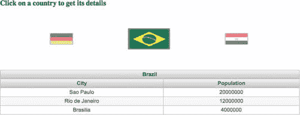
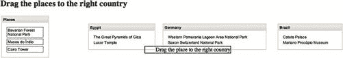

# 九、JSF 组件库

在这一章中，你将简要学习如何利用 JSF 组件库来生成漂亮的 web 应用。将向您介绍两个最著名的 JSF 开源组件库，它们是 PrimeFaces 和 RichFaces。虽然深入这些框架的细节超出了本书的范围，因为这些框架实在太大，无法在一章中涵盖，但是我们将向您概述每个组件库附带的不同组件，以及如何使用这些库来创建漂亮的 JSF 2.2 web 应用。

素数面

PrimeFaces 是一个开源的 JSF 组件库，具有许多不同的功能。PrimeFaces 拥有丰富的组件集，内置基于标准 JSF 2.0 Ajax API 的 Ajax，以及使用 web sockets 的 Ajax 推送支持；最后，PrimeFaces 包括移动用户界面 renderkit，允许 JSF 开发者在移动设备上创建 JSF 应用。PrimeFaces 还包括一个皮肤框架，它有超过 35 个内置主题。

为了配置 PrimeFaces，您需要下载 prime faces jar(prime faces-XXX . jar)。有两种方法可以下载这个 jar:你可以从 http://primefaces.org/downloads.html 下载，或者如果你是一个 Maven 用户，你可以将它定义为一个 Maven 依赖项。依赖项的组 ID 是 org.primefaces，工件 ID 是 primefaces，如下所示。

```html
<dependency>
     <groupId>org.primefaces</groupId>
     <artifactId>primefaces</artifactId>
     <version>3.5</version>
</dependency>
```

除了前面的配置之外，您还需要将 PrimeFaces Maven 存储库添加到您的 Maven 配置的存储库列表中，以便 Maven 可以如下下载它。

```html
<repository>
     <id>prime-repo</id>
     <name>Prime Repo</name>
     <url>http://repository.primefaces.org</url>
</repository>
```

PrimeFaces 需要 Java 5+运行时和 JSF 2.x 实现作为强制依赖。为了支持 PrimeFaces 中的一些特性，你可以包含一些可选的库，如表 9-1 所示。

表 9-1 。可选的 PrimeFaces 库

| 

图书馆

 | 

特征

 |
| --- | --- |
| itext 版本 2.1.7 | 资料转存(PDF) |
| Apache 3.7 版 | 资料汇出(Excel) |
| 罗马 1.9 版 | feed reader(feed reader) |
| Commons 文件上传版本 1.2.1 Commons io 版本 1.4 | FileUpload(文件上载) |

组件概述

PrimeFaces 有 100 多个 UI 组件，可以用来创建丰富的 Web 2.0 应用。深入这些组件的细节超出了本书的范围。然而，我们将在表 9-2 中给出这些组件的简短列表供您参考，根据 PrimeFaces 文档按字母顺序排序。

表 9-2 。PrimeFaces 组件概述

| 

成分

 | 

描述

 |
| --- | --- |
| `AccordionPanel` | AccordionPanel 是一个以堆叠格式显示内容的容器组件。 |
| `AutoComplete` | AutoComplete 在输入时提供实时建议。 |
| `BreadCrumb` | Breadcrumb 是一个导航组件，提供关于工作流中页面层次结构的上下文信息。 |
| `Button` | Button 是标准 h:button 组件的扩展，具有皮肤功能。 |
| `Calendar` | Calendar 是一个用于选择日期的输入组件，具有显示模式、分页、本地化、Ajax 选择等功能。 |
| `Captcha` | Captcha 是一个基于 Recaptcha API 的表单验证组件。 |
| `Carousel` | Carousel 是一个多用途组件，以幻灯片效果显示一组数据或一般内容。 |
| `Chart` | 图表用于显示图形数据。有各种图表类型，如饼图、条形图、折线图等。 |
| `Clock` | 时钟显示服务器或客户端的实时日期/时间。 |
| `Color Picker` | ColorPicker 是一个带有调色板的输入组件。 |
| `CommandButton` | CommandButton 是标准 CommandButton 的扩展版本，具有 Ajax 和主题功能。 |
| `CommandLink` | CommandLink 用 Ajax 功能扩展了标准的 JSF commandLink。 |
| `ConfirmDialog:` | ConfirmDialog 是对传统 JavaScript 确认框的替代。换肤、定制和避免弹出窗口拦截器是传统 JavaScript 确认的显著优势。 |
| `ContextMenu` | ContextMenu 提供鼠标右键事件时显示的覆盖菜单。 |
| `Dashboard` | Dashboard 提供了一个类似门户的布局，具有基于拖放的重新排序功能。 |
| `DataExporter` | DataExporter 可以方便地将使用 PrimeFaces 数据表列出的数据导出为各种格式，如 excel、pdf、csv 和 xml。 |
| `DataGrid` | DataGrid 在网格布局中显示数据集合。 |
| `DataList` | DataList 在列表布局中以几种显示类型呈现数据集合。 |
| `DataTable` | DataTable 是标准 DataTable 的增强版本，它为许多常见的用例提供了内置的解决方案，如分页、排序、选择、延迟加载、过滤。 |
| `DefaultCommand` | 当按下回车键时使用哪个命令提交表单是 web 应用中的一个常见问题，而不仅仅是 JSF 特有的问题。浏览器倾向于表现不同，因为似乎没有标准，即使标准存在，IE 可能也不会关心它。有一些丑陋的解决办法，比如在你的应用中放置一个隐藏的按钮，并为每个表单编写 JavaScript。DefaultCommand 通过规范化命令(如按钮或链接)来解决这个问题，通过按回车键提交表单。 |
| `Dialog` | 对话框是一个面板组件，可以覆盖页面上的其他元素。 |
| `Drag&Drop` | PrimeFaces 的拖放工具包括两个组件:Draggable 和 Droppable。 |
| `Dock` | Dock 组件模仿了众所周知的 Mac OS X 的 dock 接口。 |
| `Editor` | 编辑器是一个输入组件，具有丰富的文本编辑功能。 |
| `FeedReader` | FeedReader 用于显示提要中的内容。 |
| `Fieldset` | Fieldset 是一个分组组件，是 html fieldset 的扩展。 |
| `FileDownload` | 向客户机呈现动态二进制数据的传统方式是编写一个 servlet 或过滤器，并流式传输二进制数据。FileDownload 提供了一种更简单的方法。 |
| `FileUpload` | FileUpload 超越了浏览器输入 type="file "功能，并提供了一个基于 html5 的丰富解决方案，可针对传统浏览器进行适度降级。 |
| `Focus` | 焦点是一个实用组件，它使得管理 JSF 页面上的元素焦点变得很容易。 |
| `Galleria` | Galleria 用于显示一组图像。 |
| `GMap` | GMap 是与谷歌地图 API V3 集成的地图组件。 |
| `GraphicImage` | GraphicImage 扩展了标准的 JSF 图形图像组件，能够像 inputstream 一样显示二进制数据。GraphicImage 的主要用途是使显示存储在数据库中的图像或动态图像更容易。传统的方法是用一个 servlet 来实现流；GraphicImage 不需要 servlet 就能完成所有繁重的工作。 |
| `Growl` | Growl 基于 Mac 的 Growl 通知小工具，用于以叠加方式显示面部信息。 |
| `HotKey` | 热键是一个通用的键绑定组件，可以将任意形式的键绑定到 JavaScript 事件处理程序或 Ajax 调用。 |
| `IdleMonitor` | IdleMonitor 监视页面上的用户操作，并在用户再次空闲或活跃时通知回调。 |
| `ImageCompare` | ImageCompare 提供了一个丰富的用户界面来比较两幅图像。 |
| `ImageCropper` | ImageCropper 允许裁剪图像的某个区域。创建一个包含裁剪区域的新图像，并将其分配给服务器端的 CroppedImage 实例。 |
| `ImageSwitch` | ImageSwitch 是一个简单的图片库组件。 |
| `Inplace` | Inplace 提供简单的 Inplace 编辑和内嵌内容显示。Inplace 由两个成员组成:显示元素是初始的可点击标签，内联元素是显示元素切换时显示的隐藏内容。Inplace 提供简单的 inplace 编辑和内嵌内容显示。Inplace 由两个成员组成:显示元素是初始的可点击标签，内联元素是显示元素切换时显示的隐藏内容。 |
| `InputMask` | 输入掩码强制输入符合定义的掩码模板。 |
| `InputText` | InputText 是标准 inputText 的扩展，具有皮肤功能。 |
| `InputTextarea` | InputTextarea 是标准 inputTextarea 的扩展，具有自动完成、自动调整大小、剩余字符计数器和主题化功能。 |
| `Keyboard` | 键盘是使用虚拟键盘提供输入的输入组件。显著的特点是可定制的布局和皮肤功能。 |
| `Layout` | 布局组件具有高度可定制的 borderLayout 模型，即使你不熟悉网页设计，也可以非常容易地创建复杂的布局。 |
| `LightBox` | LightBox 是一个强大的覆盖图，可以显示图像、多媒体内容、自定义内容和外部 URL。 |
| `Log` | 日志组件是一个可视化控制台，用于在 JSF 页面上显示日志。 |
| `Media` | 媒体组件用于嵌入多媒体内容。 |
| `MegaMenu` | MegaMenu 是一个水平导航组件，可以一起显示子菜单。 |
| `Menu` | 菜单是一个导航组件，具有多种定制模式，如多层、iPod 风格的滑动和叠加。 |
| `Menubar` | 菜单栏是一个水平导航组件。 |
| `MenuButton` | MenuButton 在弹出菜单中显示不同的命令。 |
| `Message` | Message 是标准 JSF 消息组件的预皮肤扩展版本。 |
| `Messages` | Messages 是标准 JSF 消息组件的预皮肤扩展版本。 |
| `Mindmap` | 思维导图是一个交互式工具，可以可视化思维导图数据，包括延迟加载、回调和动画。 |
| `NotificationBar` | 通知栏显示多用途固定位置面板，用于通知。 |
| `OrderList` | OrderList 用于对具有基于拖放的重新排序、过渡效果和 POJO 支持的集合进行排序。 |
| `OutputLabel` | OutputLabel 是标准 outputLabel 组件的扩展。 |
| `OutputPanel` | OutputPanel 是一个具有自动更新能力的面板组件。 |
| `OverlayPanel` | OverlayPanel 是一个通用的面板组件，可以显示在其他内容之上。 |
| `Panel` | Panel 是一个分组组件，具有内容切换、关闭和菜单集成功能。 |
| `PanelGrid` | PanelGrid 是标准 PanelGrid 组件的扩展，增加了主题化和 colspan-rowspan 等特性。 |
| `PanelMenu` | PanelMenu 是 accordionPanel 和 tree 组件的混合组件。 |
| `Password` | 密码组件是标准 inputSecret 组件的扩展版本，具有主题集成和强度指示器。 |
| `PhotoCam` | PhotoCam 用于通过网络摄像头拍摄照片，并将其发送到 JSF 后端模块。 |
| `PickList` | 选项列表用于在两个不同的集合之间传输数据。 |
| `Poll` | Poll 是一个 Ajax 组件，能够定期发送 Ajax 请求。 |
| `Printer` | 打印机允许向打印机发送特定的 JSF 组件，而不是整个页面。 |
| `ProgressBar` | ProgressBar 是一个进程状态指示器，既可以在客户端工作，也可以使用 Ajax 与服务器端交互。 |
| `Rating` | 评级组件采用基于星级的评级系统。 |
| `RemoteCommand` | RemoteCommand 提供了一种直接从 JavaScript 执行 JSF 支持 bean 方法的方法。 |
| `ResetInput` | 当验证失败时，输入组件将它们的本地值保持在状态。ResetInput 用于从状态中清除缓存的值，以便组件从后备 bean 模型中检索它们的值。 |
| `Resizable` | 可调整大小的组件用于使另一个 JSF 组件可调整大小。 |
| `Ring` | 环是一个带有圆形动画的数据显示组件。 |
| `Schedule` | Schedule 提供了一个 Outlook 日历，类似 iCal 的 JSF 组件来管理事件。 |
| `SelectBooleanButton` | SelectBooleanButton 用于通过切换按钮选择二元决策。 |
| `SelectBooleanCheckbox` | SelectBooleanCheckbox 是带有主题集成的标准复选框的扩展版本。 |
| `SelectCheckboxMenu` | SelectCheckboxMenu 是一个多选组件，以叠加方式显示选项。 |
| `SelectManyButton` | SelectManyButton 是一个使用按钮 UI 的多选组件。 |
| `SelectManyCheckbox` | SelectManyCheckbox 是带有主题集成的标准 SelectManyCheckbox 的扩展版本。 |
| `SelectManyMenu` | SelectManyMenu 是标准 SelectManyMenu 的扩展版本，具有主题集成。 |
| `SelectOneButton` | SelectOneButton 是一个进行单项选择的输入组件。 |
| `SelectOneListbox` | SelectOneListbox 是标准 SelectOneListbox 的扩展版本，具有主题集成。 |
| `SelectOneMenu` | SelectOneMenu 是标准 SelectOneMenu 的扩展版本，具有主题集成。 |
| `SelectOneRadio` | SelectOneRadio 是标准 SelectOneRadio 的扩展版本，具有主题集成。 |
| `Separator` | 分隔符显示一条水平线来分隔内容。 |
| `SlideMenu` | SlideMenu 用于显示带有滑动动画的嵌套子菜单。 |
| `Slider` | 滑块用于为输入提供各种定制选项，如方向、显示模式和皮肤。 |
| `Socket` | Socket 组件是在服务器和客户端之间创建通道的代理。 |
| `Spacer` | Spacer 用于在元素之间放置空格。 |
| `Spinner` | 微调器是一个输入组件，通过增量和减量按钮提供数字输入。 |
| `SplitButton` | 默认情况下，SplitButton 显示一个命令，并在覆盖图中显示其他命令。 |
| `Stack` | Stack 是一个导航组件，它模仿了 Mac OS X 中的 stacks 特性。 |
| `TabMenu` | TabMenu 是一个导航组件，它将菜单项显示为选项卡。 |
| `TabView` | TabView 是一个选项卡式面板组件，具有客户端选项卡、Ajax 动态内容加载和内容转换效果。 |
| `TagCloud` | TagCloud 显示不同强度的标签集合。 |
| `Terminal` | Terminal 是一个 Ajax 驱动的基于 web 的终端，它将桌面终端带到了 JSF。 |
| `ThemeSwitcher` | ThemeSwitcher 支持动态切换 PrimeFaces 主题，无需刷新页面。 |
| `Toolbar` | 工具栏是命令和其他内容的水平分组组件。 |
| `Tooltip` | Tooltip 通过提供自定义效果、事件、html 内容和高级主题支持，超越了传统的 html 标题属性。 |
| `Tree` | 树用于显示分层数据和创建站点导航。 |
| `TreeTable` | TreeTable 用于以表格格式显示分层数据。 |
| `Watermark` | 水印在输入字段上显示提示。 |
| `Wizard` | Wizard 提供了一个 Ajax 增强的 UI，可以在单个页面中轻松实现工作流。向导由几个子选项卡组件组成，其中每个选项卡代表流程中的一个步骤。 |

在下一节中，我们将展示一个 PrimeFaces 应用示例，向您展示如何利用这个库来创建漂亮的 JSF 2.2 web 应用。

 **注**为了获得完整的质数面示例文档，你可以查看来自[`primefaces.org/documentation.html`](http://primefaces.org/documentation.html)的用户指南文档。您可以访问完整的 PrimeFaces 展示区，其中包括来自[`primefaces.org/showcase/ui/home.jsf`](http://primefaces.org/showcase/ui/home.jsf)的几乎所有 PrimeFaces 组件的示例。

集成和定制 PrimeFaces

Country Navigator 应用是一个 PrimeFaces 应用，它允许用户在点击任何一个可用国家的旗帜后，获得一个可用国家的可用城市列表(带有一些信息)，如图图 9-1 所示。



图 9-1 。县导航应用

如截图所示，应用页面主要由两个 UI 组件 : 组成

1.  Ring 组件，显示可用国家/地区的列表(德国、埃及和巴西)。
2.  DataTable 组件，该组件显示所选国家/地区的可用城市列表。

清单 9-1 显示了代表显示可用国家列表的 ring 组件的代码片段。

***清单 9-1。*** 显示不同国家的环形组件

```html
<p:ring id="custom" value="#{countryNavigator.countries}" var="country"
                   styleClass="image-ring" easing="swing">
        <p:commandLink update=":form:detail">
                <p:graphicImage valueimg/#{country.name}.gif"
                                     styleClass="flagIcon" />
                 <f:setPropertyActionListener value="#{country}"
                                            target="#{countryNavigator.activeCountry}" />
        </p:commandLink>
</p:ring>
```

# { countryNavigator.countries }表达式表示可用国家的列表。当单击一个环项目，然后通过 p:commandLink 的操作，所选的 country #{country}将在 countryNavigator 的 activeCountry 属性中设置，并且“detail”面板(包含城市数据表)将重新呈现所选国家的新城市。清单 9-2 显示了“细节”面板部分。

***清单 9-2。*** 【细节】面板部分

```html
<p:outputPanel id="detail" styleClass="detailsPanel" layout="block">

        <p:dataTable var="city" value="#{countryNavigator.activeCountry.cities}"
                                 rendered="#{countryNavigator.activeCountry ne null}">
                <f:facet name="header">
                        #{countryNavigator.activeCountry.name}
                </f:facet>

                <p:column headerText="City">
                        <h:outputText value="#{city.name}" />
                </p:column>

                <p:column headerText="Population">
                        <h:outputText value="#{city.population}" />
                </p:column>
        </p:dataTable>

</p:outputPanel>
```

当 countryNavigator 对象中存在可用的 activeCountry 时，将呈现“city”数据表，该表将显示所选国家的可用城市信息。清单 9-3 显示了完整的 CountryNavigator 托管 bean 代码。

***清单 9-3。*** CountryNavigator 托管 Bean

```html
package com.jsfprohtml5.countrynavigator.model;

import java.util.List;

public class CountryNavigator {
    private List<Country> countries;
    private Country activeCountry;

    public List<Country> getCountries() {
        return countries;
    }

    public void setCountries(List<Country> countries) {
        this.countries = countries;
    }

    public Country getActiveCountry() {
        return activeCountry;
    }

    public void setActiveCountry(Country activeCountry) {
        this.activeCountry = activeCountry;
    }
}
```

Country managed bean 保存国家类的名称、人口和城市，如清单 9-4 所示。

***清单 9-4。*** 国家托管豆

```html
public class Country {
    private String name;
    private long population;
    private List<City> cities;

    public String getName() {
        return name;
    }

    public void setName(String name) {
        this.name = name;
    }

    public long getPopulation() {
        return population;
    }

    public void setPopulation(long population) {
        this.population = population;
    }

    public List<City> getCities() {
        return cities;
    }

    public void setCities(List<City> cities) {
        this.cities = cities;
    }
}
```

城市管理 bean 保存城市类的名称和人口，如清单 9-5 中的所示。

***清单 9-5。*** 城市管理豆

```html
public class City {
    private String name;
    private long population;

    public String getName() {
        return name;
    }

    public void setName(String name) {
        this.name = name;
    }

    public long getPopulation() {
        return population;
    }

    public void setPopulation(long population) {
        this.population = population;
    }
}
```

清单 9-6 显示了 Country Navigator 应用页面的完整代码，它将 ring 组件与“details”面板部分合并在一起。

***清单 9-6。*** 国家导航器应用页面代码

```html
<html FontName">http://www.w3.org/1999/xhtml"
      xmlns:h="http://java.sun.com/jsf/html"
      xmlns:f="http://java.sun.com/jsf/core"
      xmlns:ui="http://java.sun.com/jsf/facelets"
      xmlns:p="http://primefaces.org/ui">

    <h:head>
        <title>Welcome to the Country Navigator</title>
        <h:outputStylesheet library="css" name="countryNavigator.css"  />
    </h:head>

    <h:body>
        <h:form id="form">
            <h2>Click on a country to get its details</h2>
            <p:ring id="custom" value="#{countryNavigator.countries}" var="country"
                    styleClass="image-ring" easing="swing">
                <p:commandLink update=":form:detail">
                    <p:graphicImage valueimg/#{country.name}.gif"
                                                styleClass="flagIcon" />
                     <f:setPropertyActionListener value="#{country}"
                                                                   target="#{countryNavigator.activeCountry}" />
                </p:commandLink>

            </p:ring>

            <p:outputPanel id="detail" styleClass="detailsPanel" layout="block">

                <p:dataTable var="city" value="#{countryNavigator.activeCountry.cities}"
                                      rendered="#{countryNavigator.activeCountry ne null}">
                    <f:facet name="header">
                        #{countryNavigator.activeCountry.name}
                    </f:facet>

                    <p:column headerText="City">
                        <h:outputText value="#{city.name}" />
                    </p:column>

                    <p:column headerText="Population">
                        <h:outputText value="#{city.population}" />
                    </p:column>
                </p:dataTable>

            </p:outputPanel>
        </h:form>
    </h:body>
</html>
```

为了填充国家和城市数据，创建并初始化 CountryNavigator 托管 bean 实例，如清单 9-7 中的 Faces 配置所示(注意，为了节省空间，省略了一些行)。

***清单 9-7。*** 面孔配置文件

```html
<?xml version='1.0' encoding='UTF-8'?>
<faces-config ...>

    <managed-bean>
        <managed-bean-name>countryNavigator</managed-bean-name>
        <managed-bean-class>com.jsfprohtml5.countrynavigator.model.CountryNavigator</managed-bean-class>
        <managed-bean-scope>request</managed-bean-scope>
        <managed-property>
            <property-name>countries</property-name>
            <list-entries>
                <value>#{egypt}</value>
                <value-class>com.jsfprohtml5.countrynavigator.model.Country</value-class>
                <value>#{germany}</value>
                <value-class>com.jsfprohtml5.countrynavigator.model.Country</value-class>
                <value>#{brazil}</value>
                <value-class>com.jsfprohtml5.countrynavigator.model.Country</value-class>
            </list-entries>
        </managed-property>
    </managed-bean>

    <!-- Egypt -->
    <managed-bean>
        <managed-bean-name>egypt</managed-bean-name>
        <managed-bean-class>com.jsfprohtml5.countrynavigator.model.Country</managed-bean-class>
        <managed-bean-scope>none</managed-bean-scope>
        <managed-property>
            <property-name>name</property-name>
            <value>Egypt</value>
        </managed-property>
         <managed-property>
            <property-name>population</property-name>
            <value>82000000</value>
        </managed-property>
        <managed-property>
            <property-name>cities</property-name>
            <list-entries>
                <value>#{cairo}</value>
                <value-class>com.jsfprohtml5.countrynavigator.model.City</value-class>
                <value>#{alexandria}</value>
                <value-class>com.jsfprohtml5.countrynavigator.model.City</value-class>
                <value>#{aswan}</value>
                <value-class>com.jsfprohtml5.countrynavigator.model.City</value-class>
            </list-entries>
        </managed-property>
    </managed-bean>
    <managed-bean>
        <managed-bean-name>cairo</managed-bean-name>
        <managed-bean-class>com.jsfprohtml5.countrynavigator.model.City</managed-bean-class>
        <managed-bean-scope>none</managed-bean-scope>
        <managed-property>
            <property-name>name</property-name>
            <value>Cairo</value>
        </managed-property>
         <managed-property>
            <property-name>population</property-name>
            <value>8000000</value>
        </managed-property>
    </managed-bean>

    <!-- Other configuration data is not shown ... -->
</faces-config>
```

 **注意** CountryNavigator 应用是一个 Maven web 应用:您可以从图书资源中下载，然后使用 mvn install 命令构建应用。最后，您可以在 GlassFish 版上部署最终的 country navigator-1.0-snapshot . war 来检查它是如何工作的。为了正确运行 Maven 命令，您必须确保 JAVA_HOME 指向安装在您的操作系统中的 Java 7 目录。

RichFaces

RichFaces 是一个开源的 JSF 组件库，拥有许多不同的功能。RichFaces 包括两个主要的标签库:

*   a4j 标记库，它提供了 Ajax 功能和通用工具。
*   丰富的标记库，它提供了一组与 Ajax 完全集成的自包含的丰富组件。

为了配置 RichFaces，您需要首先理解它的依赖关系 jars。RichFaces 依赖于四个主要的 jar，它们代表 RichFaces 核心和组件的 API 和实现，如下所示:

*   richfaces-core-api.jar
*   richfaces 核心 impl.jar
*   rich faces-组件-api.jar
*   richfaces-components-ui.jar

RichFaces jars 具有以下强制性依赖项:

*   Java Server Faces 2.x 实现:javax . Faces . jar(2 . 1 . 5 或更高版本)或 myfaces-impl . jar(2 . 1 . 5 或更高版本)
*   谷歌番石榴:Guava . jar(10 . 0 . 1 版本)。
*   CSS 剖析器:cssparser.jar(版本 0.9.5)。
*   CSS 的简单 API:sac . jar(1.3 版)

以及运行某些功能可能需要的以下可选 jar:

*   客户端验证(JSR-303 API 和实现)的 Bean 验证(JSR-303)集成:验证-api.jar(版本 1.0.0.GA)和 hibernate-validator.jar(版本 4.2.0.Final 或更高)。
*   推送传输库—Atmosphere(无依赖):atmosphere-runtime.jar(版本 1.0.10)(所选兼容模块 atmosphere-compat-*。罐子可能是必要的)。
*   推送 JMS 集成 (JMS API 和实现):JMS . jar(1.1 版)和 hornetq-JMS . jar(2 . 2 . 7 . final 或更高版本)
*   推送 CDI 集成 (CDI API 及实现):cdi-api.jar(版本 1.0-SP4)和 javax.inject.jar(版本 1)和 jsr-250-api.jar(版本 1.0)和 weld-servlet.jar(版本 1.1.4.Final)。
*   扩展缓存(EhCache): ehcache.jar(版本 1.6.0)。

 **注意**要知道，前面提到的一些依赖关系是 Java EE 6 规范的一部分，所以如果你在一个像 GlassFish 这样的 Java EE 6 应用服务器上工作(不仅仅是一个 servlet 容器)，那么就没有必要添加这些依赖关系。

有两种方式下载 RichFaces 依赖项:你可以直接从[www.jboss.org/richfaces/download.html](http://www.jboss.org/richfaces/download.html)下载，或者如果你是 Maven 用户，你可以使用 RichFaces Maven 原型(RichFaces 需要 Maven 3.0.3 或更高版本)。使用名为 richfaces-archetype-simpleapp 的 Maven 原型，您可以生成 richfaces 应用项目的基本结构和需求。

为了运行 RichFaces Maven 原型，需要将 JBoss 存储库添加到 Maven 配置中。在＄{ Maven _ Installation _ Dir }/conf/settings . XML 文件中的<profiles>元素下添加一个概要文件，如清单 9-8 所示。</profiles>

***清单 9-8。*** 将 JBoss 资源库添加到 Maven 配置中

```html
<profiles>
    ...
    <profile>
        <id>jboss-public-repository</id>
        <repositories>
            <repository>
                <id>jboss-public-repository-group</id>
                <name>JBoss Public Maven Repository Group</name>
                <url>https://repository.jboss.org/nexus/content/groups/public/</url>
                <layout>default</layout>
                <releases>
                    <enabled>true</enabled>
                    <updatePolicy>never</updatePolicy>
                </releases>
                <snapshots>
                    <enabled>true</enabled>
                    <updatePolicy>never</updatePolicy>
                </snapshots>
            </repository>
        </repositories>
        <pluginRepositories>
            <pluginRepository>
                <id>jboss-public-repository-group</id>
                <name>JBoss Public Maven Repository Group</name>
                <url>https://repository.jboss.org/nexus/content/groups/public/</url>
                <layout>default</layout>
                <releases>
                    <enabled>true</enabled>
                    <updatePolicy>never</updatePolicy>
                </releases>
                <snapshots>
                    <enabled>true</enabled>
                    <updatePolicy>never</updatePolicy>
                </snapshots>
            </pluginRepository>
        </pluginRepositories>
    </profile>
</profiles>
```

除了创建 jboss-public-repository 概要文件之外，还需要将其添加到<activeprofiles>元素中来激活，如清单 9-9 所示。</activeprofiles>

***清单 9-9。*** 激活 jboss-public-repository 概要

```html
<activeProfiles>
   <activeProfile>jboss-public-repository</activeProfile>
</activeProfiles>
```

在创建并激活 jboss-public-repository 之后，可以使用 rich faces-architect-simple app 原型生成项目。为此，为您的项目创建一个新目录，然后在该目录中运行以下 Maven 命令:

```html
mvn archetype:generate -DarchetypeGroupId=org.richfaces.archetypes -DarchetypeArtifactId=richfaces-archetype-simpleapp -DarchetypeVersion=4.3.2.Final -DgroupId=com.jsfprohtml5.richfacesapp -DartifactId=richFacesApp
```

可以使用-DgroupId 参数来定义应用管理的 beans 的包，而可以使用-DartifactId 来定义项目的名称。

前面的 richfaces-archetype-simpleapp 命令生成一个新的 richfaces 项目，其结构如下。

```html
richFacesApp
        ├── pom.xml
        ├── readme.txt
        └── src
               └──  main
                   ├── java
                   │   └── com
                   │       └── jsfprohtml5
                   │           └── richfacesapp
                   │              └── RichBean.java
                   └── webapp
                      ├── index.xhtml
                      ├── templates
                      │   └── template.xhtml
                      └── WEB-INF
                         ├── faces-config.xml
                         └── web.xml
```

这就是创建 RichFaces 应用所需的全部内容；现在，您可以使用普通的 mvn install 命令构建生成的 Maven 项目。

组件概述

RichFaces 有 40 多个 UI 组件，可以用来创建丰富的 Web 2.0 应用。深入这些组件的细节超出了本书的范围。但是，我们将在表 9-3 中给出一些组件的简短列表，供您参考，根据 RichFaces 文档按字母顺序排序(注意，所有这些组件都是 rich 标签库的一部分)。

表 9-3 。RichFaces 组件概述

| 

成分

 | 

描述

 |
| --- | --- |
| `Accordion` | <accordion>是一系列相互堆叠的面板，每个面板都折叠起来，只显示面板的标题。当单击面板的标题时，它会展开以显示面板的内容。单击不同的标题将折叠前一个面板并展开所选面板。包含在一个<accordion>组件中的每个面板都是一个<accordionitem>组件。</accordionitem></accordion></accordion> |
| `Autocomplete` | 组件是一个内置 Ajax 的自动完成输入框。 |
| `Calendar` | <calendar>组件允许用户通过内嵌或弹出日历输入日期和时间。</calendar> |
| `CollapsiblePanel` | 组件<collapsiblepanel>是一个可折叠的面板，当标题栏被激活时，它显示或隐藏内容。它是< rich:togglePanel >组件的简化版本。</collapsiblepanel> |
| `ContextMenu` | 组件用于创建一个层次化的上下文菜单，该菜单在 onmouseover、onclick 等事件上被激活。该组件可以应用于页面上的任何元素。 |
| `DataGrid` | <datagrid>组件是用于在网格中排列数据对象的。网格中的值可以从数据模型中动态更新，Ajax 更新可以局限于特定的行。该组件支持页眉、页脚和标题方面。</datagrid> |
| `DataScroller` | <datascroller>组件用于在多页表格或网格中导航。</datascroller> |
| `DataTable` | 组件用来呈现一个高度可定制的表格，包括表格的标题。它与<column>和<columngroup>组件一起工作，列出数据模型的内容。</columngroup></column> |
| `DragIndicator` | <dragindicator>组件定义了一个在拖放操作中鼠标光标下显示的图形元素。</dragindicator> |
| `DragSource` | 可以将<dragsource>组件添加到一个组件中，以表明它能够被用户拖动。然后可以将拖动的项目放入一个兼容的放置区域，使用<droptarget>组件指定。</droptarget></dragsource> |
| `DropDownMenu` | 组件<dropdownmenu>用于创建一个下拉的层次菜单。它可以与<toolbar>组件一起使用，在应用的工具栏中创建菜单。</toolbar></dropdownmenu> |
| `DropTarget` | 可以将<droptarget>组件添加到一个组件中，以便该组件可以接受拖动的项目。被拖动的项目必须用与< rich:dragSource >组件兼容的拖放类型来定义。</droptarget> |
| `Editor` | <editor>组件用于在页面上创建所见即所得编辑器。</editor> |
| `ExtendedDataTable` | <extendeddatatable>组件建立在<datatable>组件的功能之上，增加了一些特性，比如表体的滚动(水平和垂直)、垂直滚动的 Ajax 加载、冻结列、行选择和列的重新排列。它还支持所有基本的表特性，比如使用<datascroller>组件进行排序、过滤和分页。</datascroller></datatable></extendeddatatable> |
| `FileUpload` | <fileupload>组件允许用户上传文件到服务器。它的特点是多次上传，进度条，对文件类型的限制，以及对上传文件大小的限制。</fileupload> |
| `Focus` | <focus>组件允许用户操作页面上组件的焦点。它适用于任何输入字段。</focus> |
| `HashParam` | <hashparam>组件允许将客户端参数分组到一个散列图中。然后可以将哈希映射传递给任何 RichFaces 组件的客户端 JavaScript API 函数。</hashparam> |
| `HotKey` | <hotkey>组件允许 one 为页面或特定元素注册热键，并为这些键定义客户端处理功能。</hotkey> |
| `InplaceInput` | <inplaceinput>组件允许在文本块中内联输入信息，提高文本的可读性。</inplaceinput> |
| `InplaceSelect` | 除了<inplaceselect>组件使用下拉选择框而不是常规的文本字段来输入文本之外，<inplaceselect>组件与<inplaceinput>组件相似。</inplaceinput></inplaceselect></inplaceselect> |
| `InputNumberSlider` | <inputnumberslider>组件提供了一个改变数值的滑块。</inputnumberslider> |
| `InputNumberSpinner` | <inputnumberspinner>组件是一个单行输入字段，带有增加和减少数值的按钮。可以使用键盘上相应的方向键或通过在字段中键入来更改该值。</inputnumberspinner> |
| `jQuery` | <jquery>组件将样式和定制行为应用于 JSF 对象和常规 DOM(文档对象模型)对象。它使用 jQuery JavaScript 框架向 web 应用添加功能。</jquery> |
| `List` | <list>组件呈现一个项目列表。该列表可以是按数字排序的列表、无序的项目符号列表或数据定义列表。该组件使用数据模型来管理列表项，该模型可以动态更新。</list> |
| `Message` | <message>组件呈现为组件添加的单个 FacesMessage 消息实例。可以定制消息的外观，并且可以使用工具提示来获得关于消息的更多信息。</message> |
| `Messages` | <messages>组件的工作方式类似于<message>组件，但是它可以显示为当前视图添加的所有验证消息，而不仅仅是一条消息。</message></messages> |
| `Notify` | <notify>组件用于高级用户交互，使用通知框向用户提供关于应用中正在发生的事情的即时反馈。每次呈现该组件时，都会在浏览器屏幕的选定角落显示一个浮动通知框。</notify> |
| `NotifyMessage` | <notifymessage>组件构建在<notify>之上；区别在于用法。<notifymessage>组件显示与给定组件相关联的 FacesMessages，类似于<message>:为堆栈中的第一个 FacesMessage 显示一个通知，该通知以编程方式或在组件的转换/验证期间出现。消息的严重性决定了生成的通知的颜色和图标。</message></notifymessage></notify></notifymessage> |
| `NotifyMessages` | <notifymessages>组件与<notifymessage>组件相同，但是每个可用消息生成一个通知。<notifymessages>与<notifymessage>拥有相同的属性集。</notifymessage></notifymessages></notifymessage></notifymessages> |
| `NotifyStack` | 由<notify>、、< rich:notifyMessage >和< rich:notifyMessages >发出的通知默认显示在屏幕的右上角。rich:notifyStack >可以用来定义消息将出现在哪里，并处理它们的堆叠。</notify> |
| `OrderingList` | <orderinglist>是对列表中的项目进行排序的组件(客户端)。</orderinglist> |
| `Panel` | <panel>组件是一个带有可选标题的边框面板。</panel> |
| `PanelMenu` | 组件<panelmenu>与<panelmenuitem>和<panelmenugroup>一起使用来创建一个扩展的层次菜单。组件的外观可以高度定制，层次结构可以扩展到任意数量的子层。</panelmenugroup></panelmenuitem></panelmenu> |
| `PickList` | <picklist>是用于从列表中选择项目的组件。此外，它允许对所选项目进行排序(客户端)。</picklist> |
| `Placeholder` | <placeholder>组件允许用户为输入组件使用类似于 HTML5 占位符属性的功能。</placeholder> |
| `PopupPanel` | <popuppanel>组件提供了一个弹出面板或窗口，出现在应用的其余部分的前面。<popuppanel>组件既可以作为模态窗口，在活动时阻止与应用其他部分的交互，也可以作为非模态窗口。它可以定位在屏幕上，由用户拖动到新的位置，并调整大小。</popuppanel></popuppanel> |
| `ProgressBar` | <progressbar>组件显示一个进度条，向用户指示进程的状态。它既可以通过 Ajax 更新，也可以在客户端更新，外观和感觉可以完全定制。</progressbar> |
| `Select` | <select>组件提供了一个下拉列表框，用于从多个选项中选择一个值。</select>组件可以被配置为一个组合框，它将接受键入的输入。 |
| `TabPanel` | <tabpanel>组件提供了一组选项卡式面板，用于一次显示一个面板的内容。标签可以高度定制和主题化。一个<tabpanel>容器中的每个标签都是一个<tab>组件。</tab></tabpanel></tabpanel> |
| `TogglePanel` | <togglepanel>组件用作其他可切换组件的基础，即< rich:accordion >组件和< rich:tabPanel >组件。它提供了一个抽象的可切换组件，没有任何关联的标记。同样地，rich:togglePanel >组件可以被定制为在 accordion 组件和 tab panel 组件都不合适时提供可切换组件。</togglepanel> |
| `Toolbar` | <toolbar>组件是一个水平工具栏。任何 JavaServer Faces (JSF)组件都可以添加到工具栏中。</toolbar> |
| `Tooltip` | <tooltip>组件提供了一个信息工具提示。工具提示可以附加到任何控件，当鼠标光标悬停在控件上时显示。</tooltip> |
| `Tree` | <tree>组件提供了一个分层的树形控件。每个<tree>组件通常由<treenode>子组件组成。</treenode></tree></tree> |

在下一节中，我们将展示一个 RichFaces 应用示例，向您展示如何利用这个库。

 **注**为了获得 RichFaces 的完整文档，可以查看来自[`www.jboss.org/richfaces/docs`](http://www.jboss.org/richfaces/docs)的文档。您可以访问完整的 RichFaces 展示，其中包括来自[`showcase.richfaces.org`](http://showcase.richfaces.org)的几乎所有 RichFaces 组件的示例。

集成和定制 RichFaces

RightCountry 应用是一个 RichFaces 应用，它允许用户将一个可用地点列表拖动到相应的国家，如图 9-2 所示。



图 9-2 。正确的国家应用

该应用不允许用户将一个地方拖放到该地方不属于的国家。清单 9-10 显示了代表拖放源面板(在左边)的代码片段。

***清单 9-10。*** 【下拉源面板代码(在左边)

```html
<rich:panel styleClass="dropSourcePanel">
        <f:facet name="header">
                <h:outputText value="Places" />
        </f:facet>
        <h:dataTable id="places" columns="1"
                                    value="#{rightCountry.places}"
                                    var="place" footerClass="footerClass">

                <h:column>
                        <a4j:outputPanel styleClass="placesContainer"
                                              layout="block">

                                <rich:dragSource type="#{place.country}"
                                                dragValue="#{place}"
                                                dragIndicator="ind"/>

                                <h:outputText value="#{place.name}"></h:outputText>

                        </a4j:outputPanel>
                </h:column>
        </h:dataTable>
</rich:panel>
```

“拖放源”面板包含以下主要组件:

1.  “地点”数据表，列出了要显示的不同地点。
2.  dragSource，它允许数据表中的位置是可拖动的；在这个例子中，我们主要使用了 dragSource 的两个属性；dragValue，表示在拖放事件完成后要发送到拖放区的数据；dragIndicator，表示在拖动操作期间用作拖动指针的 drag indicator 组件的组件 ID。

除了拥有单个拖放源面板之外，我们还有三个拖放目标面板，它们将从拖放源面板接收项目；每个放置目标代表放置源项目的相应国家(埃及、德国和巴西)。清单 9-11 显示了第一个拖放目标面板(它将接收与埃及相关的拖放源项目)。

***清单 9-11。*** 首先放下目标面板

```html
<rich:panel styleClass="dropTargetPanel">
        <f:facet name="header">
                <h:outputText value="Egypt" />
        </f:facet>

        <rich:dropTarget acceptedTypes="Egypt" dropValue="Egypt"
                             dropListener="#{rightCountry.processDrop}"
                             render="places, egyptPlaces, germanyPlaces, brazilPlaces"/>
        <h:dataTable id="egyptPlaces" columns="1"
                        value="#{rightCountry.egyptPlaces}"
                        var="place" footerClass="footerClass">
                <h:column>
                    <h:outputText value="#{place.name}"></h:outputText>
                </h:column>
        </h:dataTable>
</rich:panel>
```

如前面的代码片段所示，拖放目标面板包含以下组件:

1.  “egyptPlaces”数据表，显示属于埃及的地方。
2.  dragTarget，它定义了可放置的区域；在示例中，我们使用了 dragTarget 的四个属性；acceptedTypes，定义可拖放区可接受的元素类型(如果与 dragSource 类型匹配，则可拖放区将接受 dragSource 项)；dropValue，表示 drop 事件完成后要处理的数据；dropListener，与表示操作监听器方法的 MethodExpression 绑定，该方法将在 drop 操作完成后被通知；最后是 render 属性，它定义了将参与请求处理生命周期的“呈现”部分的组件的 id。

在#{rightCountry.processDrop}方法表达式(将在拖放完成后执行)中，从 places 列表(与拖动源数据表绑定)中删除所选的 place 对象，并将其放入 egyptPlaces 列表中，以便用新的 place 对象更新“egyptPlaces”数据表，如清单 9-12 所示。

***清单 9-12。***right country 托管 Bean 的 processDrop 方法

```html
public void processDrop(DropEvent event) {
        Place place = (Place) event.getDragValue();
        String dropValue = (String) event.getDropValue();

        switch (dropValue) {
                case "Egypt":
                    egyptPlaces.add(place);
                    places.remove(place);
                    break;
                 //...
        }

        if (places.size() == 0) {
                FacesContext.getCurrentInstance().addMessage(null,
         new FacesMessage("Congratulations! You are done."));

                initialize();
        }
}
```

您可能会注意到，在使用完 drag source 面板中的所有元素(拖放到相应的合适目标)之后，会创建一条 Faces 消息，向用户显示“恭喜！你完了。”并使用 initialize()方法重置页面信息；该 Faces 消息将由<notifymessages>显示，如列表 9-13 所示。</notifymessages>

与埃及下降目标一样，德国和巴西的其他下降目标也是如此。清单 9-13 显示了*右国*申请页面的完整代码。

***清单 9-13。*** 右国申请页面

```html
<html FontName">http://www.w3.org/1999/xhtml"
      xmlns:rich="http://richfaces.org/rich"
      xmlns:a4j="http://richfaces.org/a4j"
      xmlns:f="http://java.sun.com/jsf/core"
      xmlns:h="http://java.sun.com/jsf/html">
    <h:head>
        <title>Welcome to the Right Country application</title>
        <h:outputStylesheet library="css" name="rightCountry.css"  />
    </h:head>
    <h:body>
        <rich:dragIndicator id="ind" acceptClass="accept" rejectClass="reject"
                                       draggingClass="default">
            Drag the place to the right country
        </rich:dragIndicator>

        <h:form id="form">
            <h2>Drag the places to the right country</h2>

            <h:panelGrid columnClasses="column" columns="4"
                                  styleClass="containerPanel">
                <rich:panel styleClass="dropSourcePanel">
                    <f:facet name="header">
                        <h:outputText value="Places" />
                    </f:facet>
                    <h:dataTable id="places" columns="1"
                                 value="#{rightCountry.places}"
                                 var="place" footerClass="footerClass">

                        <h:column>
                            <a4j:outputPanel styleClass="placesContainer"
                                                        layout="block">

                                <rich:dragSource type="#{place.country}"
                                                      dragValue="#{place}"
                                                      dragIndicator="ind"/>

                                <h:outputText value="#{place.name}"></h:outputText>

                            </a4j:outputPanel>
                        </h:column>
                    </h:dataTable>
                </rich:panel>

                <rich:panel styleClass="dropTargetPanel">
                    <f:facet name="header">
                        <h:outputText value="Egypt" />
                    </f:facet>

                    <rich:dropTarget acceptedTypes="Egypt" dropValue="Egypt"
                                            dropListener="#{rightCountry.processDrop}"
                                            render="places, egyptPlaces, germanyPlaces, brazilPlaces"/>

                    <h:dataTable id="egyptPlaces" columns="1"
                                         value="#{rightCountry.egyptPlaces}"
                                         var="place" footerClass="footerClass">
                        <h:column>
                            <h:outputText value="#{place.name}"></h:outputText>
                        </h:column>
                    </h:dataTable>
                </rich:panel>

                <rich:panel styleClass="dropTargetPanel">
                    <f:facet name="header">
                        <h:outputText value="Germany" />
                    </f:facet>

                    <rich:dropTarget acceptedTypes="Germany" dropValue="Germany"
                                            dropListener="#{rightCountry.processDrop}"
                                            render="places, egyptPlaces, germanyPlaces, brazilPlaces"/>

                    <h:dataTable id="germanyPlaces" columns="1"
                                          value="#{rightCountry.germanyPlaces}"
                                          var="place" footerClass="footerClass">
                        <h:column>
                            <h:outputText value="#{place.name}"></h:outputText>
                        </h:column>
                    </h:dataTable>
                </rich:panel>

                <rich:panel styleClass="dropTargetPanel">
                    <f:facet name="header">
                        <h:outputText value="Brazil" />
                    </f:facet>

                    <rich:dropTarget acceptedTypes="Brazil" dropValue="Brazil"
                                            dropListener="#{rightCountry.processDrop}"
                                            render="places, egyptPlaces, germanyPlaces, brazilPlaces"/>

                    <h:dataTable id="brazilPlaces" columns="1"
                                          value="#{rightCountry.brazilPlaces}"
                                          var="place" footerClass="footerClass">
                        <h:column>
                            <h:outputText value="#{place.name}"></h:outputText>
                        </h:column>
                    </h:dataTable>
                </rich:panel>
            </h:panelGrid>

            <rich:notifyMessages stayTime="2000" nonblocking="true" />
        </h:form>
    </h:body>
</html>
```

RightCountry 托管 bean 包含四个列表，这四个列表与拖动源和四个放置目标绑定在一起。清单 9-14 显示了完整的 RightCountry 托管 bean 代码。

***清单 9-14。*** RightCountry 托管豆

```html
package com.jsfprohtml5.rightcountry.model;

import java.io.Serializable;
import java.util.ArrayList;
import java.util.List;
import javax.faces.application.FacesMessage;
import javax.faces.context.FacesContext;
import org.richfaces.event.DropEvent;

public class RightCountry implements Serializable {
    private List<Place> places;
    private List<Place> egyptPlaces;
    private List<Place> germanyPlaces;
    private List<Place> brazilPlaces;

    public RightCountry() {
        initialize();
    }

    public List<Place> getPlaces() {
        return places;
    }

    public void setPlaces(List<Place> places) {
        this.places = places;
    }

    public List<Place> getEgyptPlaces() {
        return egyptPlaces;
    }

    public void setEgyptPlaces(List<Place> egyptPlaces) {
        this.egyptPlaces = egyptPlaces;
    }

    public List<Place> getGermanyPlaces() {
        return germanyPlaces;
    }

    public void setGermanyPlaces(List<Place> germanyPlaces) {
        this.germanyPlaces = germanyPlaces;
    }

    public List<Place> getBrazilPlaces() {
        return brazilPlaces;
    }

    public void setBrazilPlaces(List<Place> brazilPlaces) {
        this.brazilPlaces = brazilPlaces;
    }

    public void processDrop(DropEvent event) {
        Place place = (Place) event.getDragValue();
        String dropValue = (String) event.getDropValue();

        switch (dropValue) {
            case "Egypt":
                egyptPlaces.add(place);
                places.remove(place);
                break;
            case "Germany":
                germanyPlaces.add(place);
                places.remove(place);
                break;
            case "Brazil":
                brazilPlaces.add(place);
                places.remove(place);
                break;
        }

        if (places.size() == 0) {
            FacesContext.getCurrentInstance().addMessage(null,
                                                         new FacesMessage("Congratulations! You are done."));

            initialize();
        }
    }

    private void initialize () {
        egyptPlaces = new ArrayList<>();
        germanyPlaces = new ArrayList<>();
        brazilPlaces = new ArrayList<>();
        places = new ArrayList<>();

        places.add(new Place("The Great Pyramids of Giza", "Egypt"));
        places.add(new Place("Western Pomerania Lagoon Area National Park", "Germany"));
        places.add(new Place("Catete Palace", "Brazil"));
        places.add(new Place("Saxon Switzerland National Park", "Germany"));
        places.add(new Place("Luxor Temple", "Egypt"));
        places.add(new Place("Mariano Procópio Museum", "Brazil"));
        places.add(new Place("Bavarian Forest National Park", "Germany"));
        places.add(new Place("Museu do Índio", "Brazil"));
        places.add(new Place("Cairo Tower", "Egypt"));
    }
}
```

最后，清单 9-15 展示了 RightCountry 应用的 CSS 样式类。

***清单 9-15。***right country 应用的 CSS 样式类

```html
.column {
    width: 25%;
    vertical-align: top;
}

.dropTargetPanel {
    width: 90%;
}

.dropSourcePanel {
    width: 133px;
}

.containerPanel {
    width: 100%;
}

.placesContainer {
    width: 100px;
    border: 1px solid gray;
    padding: 2px
}

.footerClass {
    text-align: center;
    padding-top: 5px;
}

.default {
  padding-left:30px;
  background-position: 5px;
  background-repeat: no-repeat;
 }

.accept {
  background-position: 5px;
  background-repeat: no-repeat;
  border:2px solid green
}

.reject {
  border:2px solid red;
  background-position: 5px;
  background-repeat: no-repeat;
}
```

 **注意**像 CountryNavigator 应用一样，RightCountry 应用是一个 Maven web 应用，你可以在[www.apress.com/9781430250104](http://www.apress.com/9781430250104)从图书网站下载；它可以像 CountryNavigator 应用一样进行构建和部署。

摘要

在这一章中，向您介绍了两个最流行的开源 JSF 组件库(PrimeFaces 和 RichFaces)。尽管深入研究这些框架的细节超出了本书的范围，但是我们开发了两个应用(一个用于 PrimeFaces，另一个用于 RichFaces ),以便向您展示如何利用这些组件库在 JSF 2.2 世界中生成漂亮的 web 应用。