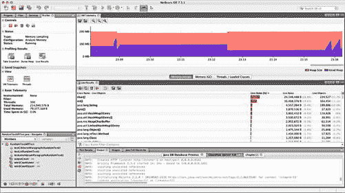

# 十一、JSF2 高级主题

本章收集了 JSF 应用作者在编写现实生活中的 JSF 应用时必须考虑的高级主题。我们还将看看如何使用< f:ajax >标签来 ajax 化并改善用户体验。Ajax 部分之后是使用 JavaScript 开发 JSF JavaScript API 的例子。最后，如果没有彻底的测试，你就无法构建一个真实世界的应用。我们将通过 JBoss 社区研究由 Red Hat 赞助的 Arquillian 测试框架。

JSF 应用的设计考虑因素

本节重点介绍在构建 JSF 应用时应该考虑的设计注意事项。我们将触及最小化会话数据使用的重要性，如何实现安全性，在哪里保存状态视图，以及最后托管 bean 作用域与 CDI 作用域的比较。

最小化会话范围的使用

当开发 JSF 应用时，你应该特别小心使用会话范围的 bean。将对象存储在用户会话中可能很诱人，因为在整个应用中都可以方便地使用它。这种便利的问题是每个用户的内存占用越来越多。您可能会得到大型的会话对象，直到用户结束会话时才被收集。这将限制并发用户的数量，因为访问系统的用户越多，应用服务器需要的物理内存就越多，从而使应用不可伸缩。会话范围的对象应该只用于存储应该从用户会话开始到结束都有效的数据。贯穿整个用户会话的公共数据可以是用户名、人名、登录时间和首选项。您应该避免使用会话范围的对象来存储有关主-详细信息中选定对象的数据，或者存储可能非常大的二进制对象，如用户配置文件图片。根据经验，在您的 JSF 应用中应该只有一个会话范围的受管 bean。如果您觉得需要多个会话范围的 beans，请认真考虑您的应用的架构。

 **提示**对于开发人员来说，直到软件开发生命周期结束时才解决应用性能问题是很常见的。然而，当您在 JSF 中使用会话对象时，您必须在开发过程的早期和整个过程中注意应用的性能测试和概要分析。在模拟多个用户会话时分析内存占用尤其重要。有许多可用的 Java 概要文件。我们建议您使用与您的开发环境很好地集成的分析器，以便在开发过程中尽可能容易地分析您的应用。如果 profiler 使用起来很慢而且很麻烦，您可能会避免使用它，并且您也不会尽早发现可伸缩性问题。一些 ide 有内置的分析器，可以很容易地分析内存和 CPU 消耗，如图 11-1 所示。要模拟多个用户会话，您可以使用像 Apache jMeter([`jmeter.apache.org`](http://jmeter.apache.org))这样的开源工具，在这里您可以构建一个测试计划，通过在一段时间内生成多个线程来模拟多个用户。



图 11-1 。具有内置探查器的 IDE (NetBeans)示例

当在集群环境中操作时，使用会话范围的 beans 还会增加会话复制的复杂性。在集群环境中，流量通常会在集群中的可用节点之间保持平衡。即使群集试图确保单个用户会话从启动它的节点提供服务，您仍然会遇到这样的情况:一个节点出现故障，流量必须重定向到另一个节点。为了避免用户会话在节点故障期间丢失，必须将会话设置为在节点之间复制。幸运的是，这由应用服务器负责，但是这是在使用会话范围的 beans 时必须解决的另一个问题。

容器管理的安全性

许多应用需要使用用户名和密码或通过客户端证书来保护部分或全部功能。Java EE 规范的创建者定义了一个容器管理的安全框架 ，使得应用开发人员更容易保护他们的应用。或者，应用开发人员将实现一个自定义的安全模型，也称为应用管理的安全性。实现应用管理的安全性需要大量的工作和技能，最终它可能无法提供通过容器管理的安全性无法实现的任何功能或保护。

容器管理的安全性基于一种模型，其中资源(URL)由定义的用户角色保护。登录后，用户被分配到用户角色，剩下的工作由应用服务器负责。应用开发人员唯一需要关心的是定义哪些资源受哪些用户角色的保护。当容器检测到用户未被授权访问所请求的资源时，它会自动将用户定向到登录机制。登录机制可以是基本身份验证、表单身份验证或客户端证书身份验证。基本身份验证将通过浏览器中的本地用户名和密码对话框提示用户输入用户名和密码。表单认证允许应用开发人员提供自己的登录表单，该表单至少必须包含用户名和密码的输入字段。最后，客户端证书身份验证使用 X.509 证书来执行公钥身份验证。安全基础设施的其余部分对应用开发人员来说是完全隐藏的。应用开发人员通过指定安全领域与应用服务器进行通信。安全领域是在应用外部的应用服务器中配置的。安全领域可以指定用户位于 SQL 数据库、LDAP 目录甚至纯文本文件中。应用服务器负责提供安全领域。应用服务器通常为开发人员提供接口来实现他们自己的安全领域，以防您对用户应该如何登录有特殊要求。例如，您可以实现一个安全领域，通过在线服务(如 Google 或 Yahoo)进行身份验证。该实现是应用服务器定制的，但是抽象出了如何处理身份验证。这使得基于容器的安全性非常灵活，并降低了应用开发人员的复杂性。应用开发人员在/WEB-INFO/web.xml 中配置基于容器的安全性。所有符合 JEE 标准的 web 应用服务器都支持容器管理安全性的概念，因此是可移植的。

***清单 11-1。*** 基于容器的安全性，为具有几个受保护资源的简单应用配置

```html
<?xml version="1.0" encoding="UTF-8"?>
<web-app version="3.1" FontName">http://xmlns.jcp.org/xml/ns/javaee" xmlns:xsi="http://www.w3.org/2001/XMLSchema-instance" xsi:schemaLocation="http://xmlns.jcp.org/xml/ns/javaeehttp://xmlns.jcp.org/xml/ns/javaee/web-app_3_1.xsd">
<servlet>
        <servlet-name>Faces Servlet</servlet-name>
        <servlet-class>javax.faces.webapp.FacesServlet</servlet-class>
        <load-on-startup>1</load-on-startup>
    </servlet>
    <servlet-mapping>
        <servlet-name>Faces Servlet</servlet-name>
        <url-pattern>/faces/*</url-pattern>
    </servlet-mapping>
    <welcome-file-list>
        <welcome-file>faces/index.xhtml</welcome-file>
    </welcome-file-list>

    <!--
        Security Contraints (protection) for the CUSTOMER role.
    -->
    <security-constraint>
        <display-name>Customer Constraints</display-name>
        <web-resource-collection>
            <web-resource-name>MyAccount</web-resource-name>
            <description>Account Pages</description>
            <url-pattern>/myaccount/*</url-pattern>
        </web-resource-collection>
        <auth-constraint>
            <description/>
            <role-name>CUSTOMER</role-name>
        </auth-constraint>

        <!--
            This section switches the transport from HTTP to HTTPS, thereby
            encrypting the traffic between the browser and server.
        -->
        <user-data-constraint>
            <description>Must switch to HTTPS as the page may contain confidential information.</description>
            <transport-guarantee>CONFIDENTIAL</transport-guarantee>
        </user-data-constraint>
    </security-constraint>

    <!--
        Security Contraints (protection) for the ADMINISTRATOR role.
    -->
    <security-constraint>
        <display-name>Administrator Constrains</display-name>
        <web-resource-collection>
            <web-resource-name>AdministratorSection</web-resource-name>
            <description>Administrator pages</description>
            <url-pattern>/admin/*</url-pattern>
        </web-resource-collection>
        <auth-constraint>
            <description/>
            <role-name>ADMINISTRATOR</role-name>
        </auth-constraint>
    </security-constraint>
    <!--
        Specify which Login Mechanism and Security Realm to use. The details of
        the Realm itself is configured on the application server (outside the
        application).
    -->
    <login-config>
        <auth-method>BASIC</auth-method>
        <realm-name>CRMRealm</realm-name>
    </login-config>
    <!--
        Definition of the Security Roles used in the application
    -->
    <security-role>
        <description>A customer accessing the application</description>
        <role-name>CUSTOMER</role-name>
    </security-role>
    <security-role>
        <description>An administrator of the application</description>
        <role-name>ADMINISTRATOR</role-name>
    </security-role>
</web-app>
```

国家储蓄

正如我们在第五章中提到的，JSF 2.2 引入了无状态视图的概念。你可以通过指定一个视图应该是瞬态的来使一个视图无状态，如清单 5-23 所示。这提高了应用的性能，因为它不必存储请求之间的视图状态。这显然不适用于所有视图，因为我们必须为一些视图保留状态，但是您应该仔细考虑是否您的每个视图都需要保留状态。

在您确实需要状态保存的情况下，您应该在服务器端而不是客户端启用状态保存。当视图状态保存在客户端时，它被序列化为一个字符串，并存储在一个名为 javax.faces.ViewState 的隐藏输入字段中。首先，每次处理视图时，序列化和反序列化视图状态都会产生开销。其次，您将使用更多的带宽在浏览器和服务器之间来回发送状态。使用客户端状态保存的好处是可以最小化应用的内存占用。您应该仔细考虑什么对您的应用最重要。清单 11-2 显示了用于在/WEB-INF/web.xml 中配置状态保存的上下文参数

***清单 11-2。*** 启用服务器端视图状态保存示例

```html
<?xml version="1.0" encoding="UTF-8"?>
<web-app version="3.1" FontName">http://xmlns.jcp.org/xml/ns/javaee"
xmlns:xsi="http://www.w3.org/2001/XMLSchema-instance"
xsi:schemaLocation="http://xmlns.jcp.org/xml/ns/javaeehttp://xmlns.jcp.org/xml/ns/javaee/web-app_3_1.xsd">
    ...
    <context-param>
        <param-name>javax.faces.STATE_SAVING_METHOD</param-name>
        <!-- Replace server with client below to enable client-side state saving -->
        <param-value>server</param-value>
    </context-param>
    ...
</web-app>
```

上下文和依赖注入(CDI)

当您开发 JSF 2.x 应用时，您可以选择使用内置的托管 bean 作用域(@RequestScoped、@SessionScoped 和@ViewScoped)或使用 JSR 299 中定义的上下文和依赖注入(CDI)服务 。CDI 提供了一个架构，其中所有的 Java EE 组件(Servlets、Enterprise JavaBeans、managed beans)都遵循相同的编程模型和生命周期，并具有定义良好的作用域。它允许 Java EE 组件松散耦合，并在需要的地方注入。CDI 已经被证明是如此成功，以至于内置的托管作用域将在 JSF 的未来版本中被弃用。如果你开始开发一个新的应用，你应该从一开始就使用 CDI 服务。如果您正在处理一个必须继续维护的现有应用，那么您应该开始计划从内置受管 bean 作用域到 CDI 作用域的迁移。

在 JSF 启用 CDI 很简单。创建/WEB-INF/beans.xml，指定 CDI beans 应该如何被发现，如清单 11-3 所示。一旦创建了文件，就可以开始在应用中使用 CDI 作用域。

***清单 11-3。*** /WEB-INF/beans.xml 在您的 JSF 应用中启用 CDI

```html
<?xml version="1.0" encoding="UTF-8"?>
<beans FontName">http://xmlns.jcp.org/xml/ns/javaee"
       xmlns:xsi="http://www.w3.org/2001/XMLSchema-instance"
       xsi:schemaLocation="http://xmlns.jcp.org/xml/ns/javaee
http://xmlns.jcp.org/xml/ns/javaee/beans_1_1.xsd"
       bean-discovery-mode="annotated">
</beans>
```

 **警告**不要试图混合搭配 CDI 作用域和内置的 JSF 管理的 bean 作用域。当你的 JSF bean 因为活跃在不同的作用域而开始行为不端时，这将会导致混乱。

Ajax 化 JSF 应用

在 JSF 2.0 之前，你必须实现自己对 Ajax 的支持，或者使用第三方库，比如 RichFaces。从 JSF 2.0 开始，Ajax 就已经被使用< f:ajax >标签或 JavaScript API 支持了。

使用 <标签

<ajax>是在 UIComponents 上注册 Ajax 行为的标签。标签可以作为一个子元素嵌套在 UIComponent 中，或者如果相同的 Ajax 行为应该应用于所有 ui component，它可以包含多个 ui component。</ajax>

标签为配置 Ajax 行为提供了一个小而强大的属性选择。表 11-1 概述了可用的属性。

表 11-1 。< f:ajax/ >标签的属性

| 

属性

 | 

描述

 |
| --- | --- |
| `disabled` | 确定是否不应该呈现 Ajax 行为。默认值为 false。 |
| `delay` | Ajax 请求延迟的毫秒数。如果在延迟期间有多个请求进入，那么只有最后一个请求会被执行。 |
| `event` | 指定 Ajax 行为应该响应的 DOM 事件的字符串。请务必注意，它只是事件名称(例如，“click”而不是“onclick”)。必须使用标记从 UIComponent 发出该事件；否则 Ajax 行为永远不会被触发。 |
| `execute` | 当 Ajax 行为被触发时应该执行的以空格分隔的组件列表。 |
| `immediate` | 确定 Ajax 行为是在应用请求值阶段(true)还是在调用应用阶段(false)被触发。默认值为 false。 |
| `listener` | 对应该处理由 Ajax 行为触发的 AjaxBehaviorEvent 的侦听器的引用。 |
| `onevent` | JavaScript 函数的名称，该函数应处理执行 Ajax 请求时发出的事件。 |
| `onerror` | JavaScript 函数的名称，该函数应处理执行 Ajax 请求时发出的错误。 |
| `render` | Ajax 请求成功时应该(重新)呈现的以空格分隔的组件列表。 |

清单 11-4 展示了一个使用< f:ajax >标签根据输入文本组件中输入的内容更新输出面板的例子。Ajax 行为与 keyup DOM 事件挂钩(键入一个键)。当接收到事件时，将执行输入文本组件，输入的值存储在 ajaxDemo 托管 bean 的 outputMessage 属性中。当请求返回成功时，将重新呈现输出消息面板，并在面板中显示输入文本中输入的消息。该示例还通过将所有 Ajax 事件传递给一个名为 processInput 的 JavaScript 函数来演示 onevent 属性的用途，该函数在请求开始和成功完成时切换 Ajax 微调器的可见性。

***清单 11-4。*** 使用< f:ajax/ >标签在更新文本字段时注册 ajax 行为的例子

```html
<h:form id="my-message">
    <h:outputLabel value="Your message" for="input-message" />

    <h:inputText id="input-message" value="#{ajaxDemo.outputMessage}">
        <f:ajax event="keyup"
                onevent="function(data) { processInput(data, 'my-message:busy'); }"
                render="output-message" execute="@this" />
    </h:inputText>

    <h:graphicImage id="busy" library="images" name="spinner.gif" style="display: none; float: left;" />

    <h:panelGroup id="output-message">#{ajaxDemo.outputMessage}</h:panelGroup>

</h:form>

<script type="text/javascript">
// Handle for onevent
function processInput(data, id) {
    if (data.status === 'begin') {
        toggle_visibility(id);
    } else if (data.status === 'success') {
        toggle_visibility(id);
    }
}

// Utility function for toggling the visibility of an element
function toggle_visibility(id) {
    var e = document.getElementById(id);
    if (e.style.display == 'block')
        e.style.display = 'none';
    else
        e.style.display = 'block';
}
</script>
```

您会注意到我们在 execute 属性中使用了一个特殊的值。execute 和 render 属性都支持一些特殊的值。这些特殊值是为了方便起见，这样您就不必为通常受 Ajax 行为影响的组件输入特定的组件标识符。这些值在表 11-2 中列出。

表 11-2 。执行/呈现特殊值

| 

关键字

 | 

描述

 |
| --- | --- |
| `@all` | 执行或渲染所有组件 |
| `@none` | 不要执行或呈现任何组件 |
| `@this` | 执行或呈现触发 Ajax 行为的组件 |
| `@form` | 以触发 Ajax 行为的组件的形式执行或呈现所有组件 |

使用 JavaScript API

JSF 附带了一个 JavaScript API ，可以一起使用，也可以代替< f:ajax >标签。JavaScript API 在 jsf 名称空间下的所有页面上都是可用的。像< f:ajax >一样，JavaScript API 可以用来发起 ajax 请求。JavaScript API 也可以用于监控 Ajax 请求和处理错误。

使用 JavaScript API 发起 Ajax 请求的方法签名如清单 11-5 所示，表 11-3 解释了该方法的输入参数。

***清单 11-5。*** 使用 JavaScript 发起 Ajax 请求的方法签名

```html
jsf.ajax.request(source, event, {options});
```

表 11-3 。jsf.ajax.request 的输入参数


清单 11-6 展示了一个使用 JavaScript API 执行更新面板网格脚本的按钮示例。

***清单 11-6。*** 使用 JavaScript API 更新面板网格

```html
<h:panelGroup id="clicks" layout="block">
    <h:outputLink id="refresh" onclick="refreshClicks(this, event); return false;">
        Refresh:
    </h:outputLink>
    <h:outputText value="#{javaScriptApiDemo.clicks}" />
</h:panelGroup>

<script type="text/javascript">
    function refreshClicks(source, event) {
        jsf.ajax.request(source, event, {render: 'clicks'});
    }
</script>
```

在清单 11-6 中，我们看到 JavaScript refreshClicks 函数在刷新输出链接的 onclick 事件中被调用。它将自己作为源和 onclick 生成的事件传递给刷新函数。它以返回 false 结束，这样单击链接就不会调用完整的 HTTP 请求。所有神奇的事情都发生在 refreshClicks 函数中。这里使用传递给函数的源和事件来触发 Ajax 请求。Ajax 请求有一个单独的选项，声明从 Ajax 请求返回时，应该呈现带有 ID clicks 的元素。ID 为 clicks 的元素是一个面板组，包含链接和从名为 javaScriptApiDemo 的受管 bean 中检索的值。如果受管 bean 中的点击值增加了，refreshClicks 函数将更新显示并显示当前的点击次数。

 **提示**在 JSF 应用中修改 Ajax 请求时，你最终会得到一个 httpError，说明“Http 传输返回一个 0 状态码”。这通常是混合 ajax 和完整请求的结果。出于性能和数据完整性的原因，这通常是不希望的”(见图 11-2 )。这条警告消息可能看起来很隐晦，但它只是说，您试图在执行完整的 HTTP 请求时执行 Ajax 请求。如果您忘记在调用 Ajax 请求的 onclick 事件的末尾包含 return false，就会发生这种情况

错: <outputlink onclick="do-some-ajax();">对:<h:output link onclick = " do-some-Ajax()；返回 false"/ ></outputlink>

您还可以通过使用清单 11-7 中所示的执行选项，在选定的组件上执行请求生命周期。


图 11-2 。同时执行 Ajax 和完整 HTTP 请求时显示错误

***清单 11-7。*** 使用执行选项在选定的组件上执行 JSF 请求生命周期

```html
<h:form id="my-name-form">
    <h:outputLink onclick="saveName(this, event); return false;">Save name</h:outputLink>
    <h:inputText id="my-name" value="#{javaScriptApiDemo.myName}" />
    <h:panelGroup id="my-name-display">Your name is: #{javaScriptApiDemo.myName}</h:panelGroup>
</h:form>

<script type="text/javascript">
    function saveName(source, event) {
        jsf.ajax.request(source, event, {
            execute: '@form',
            render: 'my-name-form:my-name-display'
        });
    }
</script>
```

清单 11-7 中的例子显示了一个输入框，用户可以在其中输入自己的名字。该名称被映射到 javaScriptApiDemo 受管 bean 上一个名为 myName 的属性。当前存储在 myName 属性中的名称显示在面板组中输入字段的下方。当点击“保存名称”链接时，将调用保存名称功能。saveName 函数中的 Ajax 请求将选项 execute 设置为@form，表示发出请求的表单应该执行 JSF 请求生命周期。从请求返回后，my-name-form 表单中的 my-name-display 面板被更新。值得注意的是，清单 11-7 完全等同于清单 11-8 。使用< f:ajax >标签和 JavaScript API 之间的选择取决于您试图解决的特定任务。如果同时控制页面的其他方面，将所有功能收集到逻辑分组的 JavaScript 函数中，那么使用 JavaScript API 可能更有意义。如果页面没有任何其他正在执行的 JavaScript，那么使用 JavaScript API 而不是坚持使用< f:ajax >标签可能是多余的。

***清单 11-8。*** 与清单 11-x 相同的例子，但是使用了< f:ajax >标签来代替 JavaScript API

```html
<h:form id="my-name-form-pure-jsf">
    <h:outputLink>
        <f:ajax render="my-name-display-pure-jsf" execute="my-name-pure-jsf" />
        Save name
    </h:outputLink>
    <h:inputText id="my-name-pure-jsf" value="#{javaScriptApiDemo.myName}" />
    <h:panelGroup id="my-name-display-pure-jsf">
        Your name is: #{javaScriptApiDemo.myName}
    </h:panelGroup>
</h:form>
```

监控 Ajax 事件

使用<ajax>标签不可能做到的一件事是监控客户端上执行的所有 Ajax 请求，以及对请求中可能出现的问题的一般错误处理。JavaScript API 提供了两个事件监听器。一个是 Ajax 请求事件的事件监听器(addOnEvent)，另一个是服务器错误通知(addOnError)。Ajax 请求事件监听器发出三种事件，如表 11-4 所示。服务器错误事件监听器发出四种事件，如表 11-5 所示。</ajax>

表 11-4 。从 Ajax 请求事件侦听器发出的事件

| 

事件

 | 

描述

 |
| --- | --- |
| `begin` | 每当 Ajax 请求开始时发出 |
| `complete` | 每当 Ajax 请求完成时发出 |
| `success` | 每当 Ajax 请求成功完成时发出 |

表 11-5 。从服务器错误事件侦听器发出的事件

| 

事件

 | 

描述

 |
| --- | --- |
| `httpError` | 如果 HTTP 状态不在 2xx 成功范围内，则发出此事件 |
| `serverError` | 当服务器端发生错误或异常时发出 |
| `malformedXML` | 当服务器返回不正确的 XML 响应时发出 |
| `emptyResponse` | 当服务器没有返回响应时发出 |

清单 11-9 是一个挂钩到两个事件处理程序的 JavaScript 的例子。通过使用< h:outputScript/ >标签，JavaScript 可以被任何 Facelets 页面使用，如清单 11-10 所示。

***清单 11-9。*** JavaScript 挂钩到 JSF JavaScript API 公开的事件监听器

```html
function outputAjaxEvent(data) {
    console.log(data);
}

function outputError(errorData) {
    console.log(errorData.type + " (" + errorData.status + "): " + errorName + ". " + errorDescription);
    // Register error on a remote error logging server
}

function showProgress(data) {
    if (data.status === 'begin') {
        toggle_visibility('in-progress');
    } else if (data.status === 'success') {
        toggle_visibility('in-progress');
    }
}

// Utility function for toggling the visibility of an element
function toggle_visibility(id) {
    var e = document.getElementById(id);
        if (e.style.display == 'block')
            e.style.display = 'none';
        else
            e.style.display = 'block';
}

jsf.ajax.addOnEvent(outputAjaxEvent);
jsf.ajax.addOnEvent(showProgress);
jsf.ajax.addOnError(outputError);
```

***清单 11-10。*** 使用 JavaScript 文件的 Facelets 页面

```html
<?xml version='1.0' encoding='UTF-8' ?>
<!DOCTYPE html PUBLIC "-//W3C//DTD XHTML 1.0 Transitional//EN"
"http://www.w3.org/TR/xhtml1/DTD/xhtml1-transitional.dtd">
<html FontName">http://www.w3.org/1999/xhtml"
      xmlns:h="http://xmlns.jcp.org/jsf/html"
      xmlns:ui="http://xmlns.jcp.org/jsf/facelets"
      xmlns:f="http://xmlns.jcp.org/jsf/core">

    <ui:composition template="/base.xhtml">

        <ui:define name="title">
            Chapter 11 - JavaScript API Demo
        </ui:define>

        <ui:define name="top">
            Chapter 11 - JavaScript API Demo
        </ui:define>

        <ui:define name="content">

            <h:outputScript name="events.js" library="js" />

            <h:form id="my-name-form-pure-jsf">
                <h:outputLink>
                    <f:ajax render="my-name-display-pure-jsf" execute="my-name-pure-jsf"  />
                    Save name
                </h:outputLink>
                <h:inputText id="my-name-pure-jsf" value="#{javaScriptApiDemo.myName}" />
                <h:panelGroup id="my-name-display-pure-jsf">
                    Your name is: #{javaScriptApiDemo.myName}
                </h:panelGroup>
            </h:form>

            <!—
                 Hidden by default. This is only shown when an Ajax
                 request begins and hidden when a request completes successfully
            -->
            <h:panelGroup id="in-progress" layout="block" style="display: none;">
                <h:panelGroup style="font-weight: bold;">
                    PLEASE WAIT - THE PAGE IS LOADING
                </h:panelGroup>
            </h:panelGroup>

        </ui:define>
    </ui:composition>

</html>
```

测试 JSF 应用

任何真实世界的应用都必须经过一定程度的测试。开发 web 应用时，编写单元测试来验证功能背后的单个类通常是不够的。您可以通过使用 JUnit 测试组件和 beans 背后的逻辑，但是当您有一个 JSF 应用时，这通常是不够的。测试 JSF 应用有很多方面，不仅仅是确保后端逻辑正确。在 JSF 应用中，HTTP(客户端-服务器交互)、Ajax 请求和 web 浏览器差异增加了复杂性。因此，真正的测试需要一个框架，能够测试应用的部署版本，发起请求(Ajax 和完整的 HTTP)并在请求后测试应用的状态。有许多流行的功能测试框架可用，如 Selenium、FitNesse 和 Cucumber。这些测试框架可以通过验证应用在用户端的行为是否符合预期来帮助我们进行黑盒测试。理想情况下，我们希望有一个集成测试框架，允许我们验证应用及其组件的行为，就像它们在应用服务器上部署时的行为一样。这将允许更精确的测试。

什么是 Arquillian？

Arquillian 是一个完整的 Java EE 应用容器内测试平台。Arquillian 与测试框架(如 JUnit 和 TestNG)集成在一起，使得编写单元测试的任何人都可以轻松采用。Arquillian 使用您选择的嵌入式应用服务器来部署要测试的类和资源。一旦在嵌入式应用服务器中部署了 JSF 应用，就可以通过调用类和资源并检查它们的响应来测试系统的行为。现成的 Arquillian 能够测试 JEE 组件，如 EJB 和 CDI beans。已经为 Arquillian 构建了几个扩展来支持功能测试。表 11-6 概述了 Arquillian 的流行扩展。

表 11-6 。Arquillian 的流行扩展

| 

延长

 | 

目的

 | 

成熟度

 |
| --- | --- | --- |
| 雄蜂 | Selenium 也使用 WebDriver API 的包装器。这个扩展使得创建简单的功能测试成为可能。
**链接:** `http://arquillian.org/modules/drone-extension/` | 稳定的 |
| 弯曲 | 模拟客户端的交互，同时在 JSF 请求生命周期的不同阶段检查服务器端的状态变化。
**链接:** `http://arquillian.org/modules/warp-extension/` | 希腊字母的第一个字母 |
| 石墨烯 | 通过保护和拦截请求来优雅地支持 Ajax，从而增强了 Drone 扩展。
**链接:** `http://arquillian.org/modules/graphene-extension/` | 稳定的 |
| 坚持 | 验证应用的持久层。允许使用 XML、XLS、YAML、JSON 和 SQL 等常见数据格式植入数据库。
**链接:** `http://arquillian.org/modules/persistence-extension/` | 希腊字母的第一个字母 |
| 表演 | 验证测试在给定的时间范围内执行。将在回归测试中发现性能问题。
**链接:** `http://arquillian.org/modules/performance-extension/` | 贝塔 |
| 蒸汽 2 | 允许测试 Seam 库和注入点。
**链接:** `http://arquillian.org/modules/seam2-extension/` | 贝塔 |

在这一节中，我们将探索如何使用 Arquillian 和 Drone 扩展对 JSF 应用进行黑盒测试。首先，我们将看看如何为 Maven 项目设置 Arquillian 和 Drone ,然后看看如何使用 Drone 扩展编写合理的 JUnit 测试。

注意 Arquillian Warp Extension 是 JSFUnit 项目的官方替代品，不再被维护。在撰写本文时，Warp 扩展仍处于 Alpha 状态，没有可用的产品示例。

设置阿奎利亚人和无人机

在这一节中，我们将看看如何在 Maven 项目中设置 Arquillian 和 Drone 。如果你不使用 Maven，你可以在 Arquillian 网站(【http://www.arquillian.org】??)上找到在你的项目中包含必要依赖项的指南。

清单 11-11 显示了 Maven 项目对象模型(POM) ，用于在您的项目中包含 Arquillian 和 Drone。

***清单 11-11。*** pom.xml 包含使用 Arquillian 和 Drone 所需的依赖项

```html
<?xml version="1.0" encoding="UTF-8"?>
<project FontName">http://maven.apache.org/POM/4.0.0" xmlns:xsi="http://www.w3.org/2001/XMLSchema-instance"
xsi:schemaLocation="http://maven.apache.org/POM/4.0.0
http://maven.apache.org/xsd/maven-4.0.0.xsd">
    <modelVersion>4.0.0</modelVersion>

    <groupId>com.apress.projsf2html5</groupId>
    <artifactId>chapter11</artifactId>
    <version>1.0-SNAPSHOT</version>
    <packaging>war</packaging>

    <name>chapter11</name>

    ...

    <dependencyManagement>
        <dependencies>
            <dependency>
                <groupId>org.jboss.arquillian</groupId>
                <artifactId>arquillian-bom</artifactId>
                <version>1.1.1.Final</version>
                <scope>import</scope>
                <type>pom</type>
            </dependency>
            <dependency>
                <groupId>org.jboss.arquillian.extension</groupId>
                <artifactId>arquillian-drone-bom</artifactId>
                <version>1.2.0.CR1</version>
                <type>pom</type>
                <scope>import</scope>
            </dependency>
        </dependencies>
    </dependencyManagement>

    <dependencies>
        <dependency>
            <groupId>org.glassfish.main.extras</groupId>
            <artifactId>glassfish-embedded-all</artifactId>
            <version>4.0</version>
            <scope>test</scope>
        </dependency>
        <dependency>
            <groupId>junit</groupId>
            <artifactId>junit</artifactId>
            <version>4.11</version>
            <scope>test</scope>
        </dependency>
        <dependency>
            <groupId>org.jboss.arquillian.junit</groupId>
            <artifactId>arquillian-junit-container</artifactId>
            <scope>test</scope>
        </dependency>
        <dependency>
            <groupId>org.jboss.arquillian.container</groupId>
            <artifactId>arquillian-glassfish-embedded-3.1</artifactId>
            <version>1.0.0.CR4</version>
            <scope>test</scope>
        </dependency>
        <dependency>
            <groupId>org.jboss.arquillian.extension</groupId>
            <artifactId>arquillian-drone-impl</artifactId>
            <scope>test</scope>
        </dependency>
        <dependency>
            <groupId>org.jboss.shrinkwrap.descriptors</groupId>
            <artifactId>shrinkwrap-descriptors-api-javaee</artifactId>
            <scope>test</scope>
        </dependency>
        <dependency>
            <groupId>org.jboss.shrinkwrap.descriptors</groupId>
            <artifactId>shrinkwrap-descriptors-impl-javaee</artifactId>
            <scope>test</scope>
        </dependency>
        <dependency>
            <groupId>org.jboss.shrinkwrap</groupId>
            <artifactId>shrinkwrap-api</artifactId>
            <scope>test</scope>
        </dependency>
        <dependency>
            <groupId>org.jboss.arquillian.extension</groupId>
            <artifactId>arquillian-drone-webdriver-depchain</artifactId>
            <type>pom</type>
            <scope>test</scope>
        </dependency>
        <dependency>
            <groupId>org.jboss.arquillian.extension</groupId>
            <artifactId>arquillian-drone-selenium</artifactId>
            <scope>test</scope>
        </dependency>
        <dependency>
            <groupId>org.jboss.arquillian.extension</groupId>
            <artifactId>arquillian-drone-selenium-server</artifactId>
            <scope>test</scope>
        </dependency>
        <dependency>
            <groupId>org.seleniumhq.selenium</groupId>
            <artifactId>selenium-java</artifactId>
            <scope>test</scope>
        </dependency>
        <dependency>
            <groupId>org.seleniumhq.selenium</groupId>
            <artifactId>selenium-server</artifactId>
            <scope>test</scope>
            <exclusions>
                <exclusion>
                    <groupId>org.mortbay.jetty</groupId>
                    <artifactId>servlet-api-2.5</artifactId>
                </exclusion>
            </exclusions>
        </dependency>
        <dependency>
            <groupId>org.slf4j</groupId>
            <artifactId>slf4j-simple</artifactId>
            <version>1.6.4</version>
            <scope>test</scope>
        </dependency>

        <dependency>
            <groupId>javax</groupId>
            <artifactId>javaee-web-api</artifactId>
            <version>7.0</version>
            <scope>provided</scope>
        </dependency>

    </dependencies>

    ...

</project>
```

使用 Arquillian 和 Drone 编写测试

我们将使用 Arquillian 来模拟 web 应用到 web 容器的部署。一旦 web 应用被部署在嵌入式容器中，我们将开始使用无人机扩展运行功能测试，方法是对部署的应用执行请求，并验证它是否以预期的输出进行响应。作为一个例子，我们将测试一个简单的应用，它要求用户输入他的名字，然后问候用户。用户界面的实体模型如图图 11-3 所示。基于实体模型，我们需要一个 Facelets 文件向用户显示 UI 和一个 CDI bean 来存储名称，如图图 11-4 所示。


图 11-3 。测试应用的 UI 模型


图 11-4 。包含用于测试应用的 CDI Bean 和 Facelets 页面的类图

基于实体模型和类图，我们可以使用 Gherkin 格式编写几个伪测试，稍后我们将使用 Drone 实现这些测试。

| **场景:**输入我的名字 |
| **假设**我在页面上输入我的名字“离合器电源” |
| 当我按下提交按钮时 |
| **然后**应用会向我问候“你好，离合器电源” |

| **场景:**我进入页面 |
| **假定**我进入页面 |
| 当我无所事事时 |
| **然后**将不会显示任何问候语 |

CDI bean 的实际实现可以在清单 11-12 中看到。它是一个简单的请求范围 bean，只有一个名为 name 的属性。清单 11-13 显示了 Facelets 文件，它向用户显示输入字段，包括一个提交按钮。注意，我们有一个面板组，仅当 CDI bean 的 name 属性不为空时才显示。

***清单 11-12。*** 简单请求作用域 CDI Bean 公开一个名称属性

```html
package com.apress.projsf2html5.chapter11.jsf;

import java.io.Serializable;
import javax.enterprise.context.RequestScoped;
import javax.inject.Named;

@Named(value = "helloYou")
@RequestScoped
public class HelloYou implements Serializable {

    private String name;

    public String getName() {
        return name;
    }

    public void setName(String name) {
        this.name = name;
    }
}
```

***清单 11-13。*** Facelets 文件向用户显示输入框和提交按钮

```html
<?xml version='1.0' encoding='UTF-8' ?>
<!DOCTYPE html PUBLIC "-//W3C//DTD XHTML 1.0 Transitional//EN"
"http://www.w3.org/TR/xhtml1/DTD/xhtml1-transitional.dtd">
<html FontName">http://www.w3.org/1999/xhtml"
      xmlns:h="http://xmlns.jcp.org/jsf/html"
      xmlns:ui="http://xmlns.jcp.org/jsf/facelets">

    <ui:composition template="/base.xhtml">

        <ui:define name="title">
            Chapter 11 - Testing - Hello You
        </ui:define>

        <ui:define name="top">
            Chapter 11 - Testing - Hello You
        </ui:define>

        <ui:define name="content">

            <h:form id="hello-form">
                <h:outputLabel value="What's your name?" for="input-name" />
                <h:inputText id="input-name" value="#{helloYou.name}" />
                <h:commandButton id="submit" value="Submit" />

                <h:panelGroup id="output-message" rendered="#{not empty helloYou.name}">
                    Hello #{helloYou.name}
                </h:panelGroup>

            </h:form>

        </ui:define>
    </ui:composition>
</html>
```

CDI bean 和 Facelet 页面的结果可以在图 11-5 中看到。


图 11-5 。你好应用

我们现在准备测试应用。我们的测试将用@RunWith 注释，告诉 JUnit 我们将使用 Arquillian 作为我们的测试运行程序。我们还使用@RunAsClient 注释告诉 Arquillian 我们不会在服务器端进行测试，而是作为 web 客户端发送请求。这是使用无人机扩展进行功能测试所必需的。接下来，我们将指定我们想要测试的资源和类。这是通过使用包膜 API 创建 WebArchive 对象来完成的。WebArchive 应该包含所有的资源和类，并且只包含那些。目的是隔离被测试的文件，避免增加不必要的复杂性。创建 WebArchive 的方法必须被注释为@Deployment，以便 Arquillian 在执行测试之前检测必须部署的内容。最后，我们将编写实际的测试。完整的测试可以在 清单 11-14 中看到。

***清单 11-14。*** 测试 Hello You 应用的 Arquillian 测试用例

```html
package com.apress.projsf2html5.chapter11;

import com.apress.projsf2html5.chapter11.jsf.HelloYou;
import com.thoughtworks.selenium.DefaultSelenium;
import java.io.File;
import java.net.URL;
import org.jboss.arquillian.container.test.api.Deployment;
import org.jboss.arquillian.container.test.api.RunAsClient;
import org.jboss.arquillian.drone.api.annotation.Drone;
import org.jboss.arquillian.junit.Arquillian;
import org.jboss.arquillian.test.api.ArquillianResource;
import org.jboss.shrinkwrap.api.ShrinkWrap;
import org.jboss.shrinkwrap.api.asset.EmptyAsset;
import org.jboss.shrinkwrap.api.spec.WebArchive;
import org.junit.Test;
import org.junit.runner.RunWith;
import static org.junit.Assert.*;

@RunWith(Arquillian.class)
@RunAsClient
public class HelloYouTest {

    /** This will give us the contextPath where the web application was installed. */
    @ArquillianResource
    URL contextPath;

    /** This will give us access to a Drone that simulates a browser. */
    @Drone
    private DefaultSelenium browser;

    /**
     * The method annotated with Deployment outputs the web archive representing
     * the application.The archive must contain all the resource and classes
     * being tested.
     *
     * @return {@link WebArchive} containing the resources and classes
     * representing the Hello You application
     */
    @Deployment
    public static WebArchive createDeployment() {
        return ShrinkWrap.create(WebArchive.class, "hello-you.war")
                .addClasses(HelloYou.class)
                .addAsWebResource(new File("src/main/webapp/hello-you.xhtml"))
                .addAsWebResource(new File("src/main/webapp/contracts/basic/base.xhtml"), "contracts/basic/base.xhtml")
                .addAsWebResource(new File("src/main/webapp/contracts/basic/cssLayout.css"), "contracts/basic/cssLayout.css")
                .addAsWebResource(new File("src/main/webapp/contracts/basic/default.css"), "contracts/basic/default.css")
                .addAsWebInfResource(new File("src/main/webapp/WEB-INF/web.xml"))
                .addAsManifestResource(EmptyAsset.INSTANCE, "beans.xml");
    }

    /**
     * Scenario: Entering my name.
     * Given that I enter my name 'Clutch Powers' on the page
     * When I press the Submit Button
     * Then I will be greeted 'Hello Clutch Powers' by the application
     */
    @Test
    public void helloyou_EnterName_GreetingFound() {
        String startUrl = contextPath.toString() + "faces/hello-you.xhtml";

        // Open the hello-you page
        browser.open(startUrl);

        // Type name in the input field
        browser.type("id=hello-form:input-name", "Clutch Powers");

        // Click the submit button
        browser.click("id=hello-form:submit");

        // Wait for the page to load (max 5 seconds)
        browser.waitForPageToLoad("5000");

        // Check that the "Hello <name>" element is displayed on screen
        assertTrue(browser.isVisible("id=hello-form:output-message"));

        // Check that the name entered is the one expected
        assertEquals("Welcome message missing",
                browser.getText("id=hello-form:output-message"),
                "Hello Clutch Powers");
    }
    /**
     * Scenario: I enter the page.
     * Given that I enter page
     * When I do nothing
     * Then I there will be no greeting displayed
     */
    @Test
    public void helloyou_OpenPage_GreetingHidden() {
        String startUrl = contextPath.toString() + "faces/hello-you.xhtml";

        // Open the hello-you page
        browser.open(startUrl);

        // Check that the "Hello <name>" element is NOT displayed on the screen
        assertFalse(browser.isVisible("id=hello-form:output-message"));
    }
}
```

DefaultSelenium 无人机能够模拟多种浏览器交互。有趣的方法示例在 表 11-7 中突出显示。

表 11-7 。用于模拟用户交互的 DefaultSelenium 方法示例

| 

方法

 | 

描述

 |
| --- | --- |
| `attachFile(fieldLocator, fileLocation)` | 用于在文件输入表单字段中附加文件 |
| `Click(locator)` | 单击具有指定定位器的给定元素 |
| `doubleClick(locator)` | 双击具有指定定位器的给定元素 |
| `dragAndDrop(locator, movements)` | 模拟从源到位置的拖放 |
| `getText(locator)` | 获取给定元素中的文本 |
| `isVisible(locator)` | 已确定给定元素在屏幕上是否可见 |
| `Open(url)` | 打开给定的页面 |
| `typeKeys(location, value)` | 在给定的输入字段中键入值 |
| `waitForPageToLoad(timeout)` | 等待页面加载给定的毫秒数 |

摘要

在本章中，我们探讨了开发 JSF 应用的设计考虑因素，如安全性、性能和内存消耗。我们还看了如何使用标签来 Ajax 化 JSF 应用。使用标签可以在单个以及一组 JSF 组件上设置 Ajax 请求。为了补充标签，我们来到幕后探索 JSF JavaScript API。最后，我们看了使用 Aqullian 测试框架结合无人机扩展来测试 JSF 应用，无人机扩展支持 JSF 应用的功能测试。