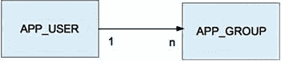
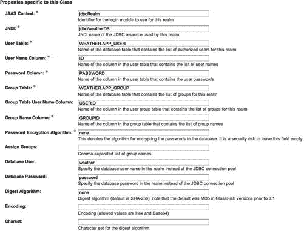

# 十二、JSF2 安全性和性能

在本章中，您将学习如何使用 Java EE 容器提供的安全特性来保护您的 JSF 应用。您知道如何在第十章中介绍的天气应用中应用容器管理的认证、授权和数据保护。在这一章中，你还将学习如何调整你的 JSF 应用的性能，以使你的 JSF 页面响应更快。

JSF 应用安全

Web 应用安全 可以分为三个主要方面，我们将在本节详细阐述:

*   *认证* 是向系统确认用户身份真实的行为。
*   *授权* 定义了用户在执行身份验证后被允许访问系统的哪些部分。
*   *数据保护* 是关于确保用户和系统之间的数据不能被未授权方修改或伪造。

在 Java EE 中，您可以依赖 Java EE 容器提供的安全特性，以便在您的 Java EE 应用中实现安全需求(如果您的 Java EE 应用依赖于 Java EE 容器提供的安全特性；这意味着您的 Java EE 应用正在使用“容器管理的安全性”)。除了在容器级别管理安全性，您还可以在应用级别管理安全性(这种方法称为应用管理的安全性)。应用管理的安全性并不意味着从头开始实现所有的应用安全特性；应用管理的安全性通常利用 Java EE 容器提供的安全特性，以便在应用中实现客户需要的自定义安全特性。

 **注意**如果从客户需求来看，没有理由实现定制的安全解决方案，那么强烈建议 Java EE 应用使用容器管理的安全性。

Java EE 容器管理的安全性提供了容器管理的身份验证、授权和数据保护。在接下来的小节中，我们将详细解释这些术语。

证明

Java EE 容器提供了不同类型的认证机制:

*   HTTP 基本
*   基于表单
*   摘要

HTTP 基本身份验证

在 HTTP 基本身份验证中，服务器从 web 客户端请求用户名和密码，并通过与指定或默认领域中授权用户的数据库进行比较来验证用户名和密码是否有效。当您没有在 web 配置文件中指定身份验证机制时，基本身份验证是默认的。

使用基本身份验证时，会发生以下步骤:

*   客户端请求访问受保护的资源。
*   web 服务器返回一个对话框，要求输入用户名和密码。
*   客户端向服务器提交用户名和密码。
*   服务器对指定领域中的用户进行身份验证，如果成功，则返回请求的资源。

 **注意**领域是系统的用户和组的存储。

基于表单的身份验证

在基于表单的身份验证中，您可以在应用中开发和自定义登录和错误页面。当在 web 配置文件中声明基于表单的身份验证时，会发生以下步骤:

*   客户端请求访问受保护的资源。
*   如果客户端未经身份验证，服务器会将客户端重定向到登录页面。
*   客户端将登录表单提交给服务器。
*   服务器尝试对用户进行身份验证。
*   如果身份验证成功，将检查通过身份验证的用户的主体，以确保其角色有权访问资源(授权)。如果用户得到授权，服务器将使用存储的 URL 路径将客户端重定向到资源。
*   如果身份验证失败，客户端将被转发或重定向到错误页面。

有关基于表单的身份验证的完整示例，请查看“在天气应用中应用托管安全性”一节

 **注意**需要注意的是，HTTP 基本认证以 Base64 编码的文本形式发送用户名和密码；而基于表单的身份验证是以纯文本的形式发送它们，这意味着它们是不安全的，所以建议使用安全传输机制(如 SSL)。为了配置 SSL，您需要查看应用服务器的文档，因为它是针对每个应用服务器的；例如，为了在 Tomcat 7 中配置 SSL，请检查以下链接:[`tomcat.apache.org/tomcat-7.0-doc/ssl-howto.html`](http://tomcat.apache.org/tomcat-7.0-doc/ssl-howto.html)。

摘要认证

摘要认证基于用户名和密码认证用户(类似于基本的 HTTP 认证)。但是，与基本身份验证不同，摘要式身份验证不通过网络发送用户密码。相反，客户端发送密码的单向加密哈希。

配置身份验证方法

为了在您的 Java EE web 应用中配置认证方法，您可以使用< login-config >元素，如 web 配置文件(web.xml)中所示:

```html
<login-config>
    <auth-method>FORM</auth-method>
    <realm-name>jdbcRealm</realm-name>
    <form-login-config>
        <form-login-page>/home.xhtml</form-login-page>
        <form-error-page>/error.xhtml</form-error-page>
    </form-login-config>
</login-config>
```

您可能已经注意到，<login-config>元素有以下子元素:</login-config>

*   元素指定了 web 应用的认证机制。它可以是消化的，基本的或形式的或没有。
*   <realm-name>元素指定领域名。</realm-name>
*   <form-login-config>元素指定了登录和错误页面。当使用基于表单的登录时，应该使用它。</form-login-config>

批准

授权定义了基于角色的访问控制，它决定了用户可以访问系统的哪些部分。在 Java EE 中，为了实现这一点，可以在 web.xml 中使用<安全约束>元素，如清单 12-1 所示。

***清单 12-1。*** 范例<范例>范例

```html
<?xml version="1.0" encoding="UTF-8"?>
<web-app version="3.1" FontName">http://xmlns.jcp.org/xml/ns/javaee"
xmlns:xsi="http://www.w3.org/2001/XMLSchema-instance"
xsi:schemaLocation="http://xmlns.jcp.org/xml/ns/javaee
http://xmlns.jcp.org/xml/ns/javaee/web-app_3_1.xsd">

    ...

    <security-constraint>
        <display-name>securityConstraint</display-name>
        <web-resource-collection>
            <web-resource-name>resources</web-resource-name>
            <url-pattern>/protected/*</url-pattern>
            <http-method>PUT</http-method>
            <http-method>DELETE</http-method>
            <http-method>GET</http-method>
            <http-method>POST</http-method>
        </web-resource-collection>
        <auth-constraint>
            <role-name>weatherUserRole</role-name>
        </auth-constraint>
        <user-data-constraint>
            <transport-guarantee>CONFIDENTIAL</transport-guarantee>
        </user-data-constraint>
    </security-constraint>
    <login-config>
        <auth-method>FORM</auth-method>
        <realm-name>WeatherRealm</realm-name>
        <form-login-config>
            <form-login-page>/home.xhtml</form-login-page>
            <form-error-page>/error.xhtml</form-error-page>
        </form-login-config>
    </login-config>
    ...

</web-app>
```

<security-constraint>元素用于使用资源的 URL 映射来定义对资源集合的访问权限。它可以包含以下元素:</security-constraint>

*   Web 资源集合(<web-resource-collection>):描述一组要保护的资源的 URL 模式和 HTTP 操作的列表。</web-resource-collection>
*   授权约束(<auth-constraint>):指定是否使用身份验证，并指定被授权执行受约束请求的角色。</auth-constraint>
*   用户数据约束(<user-data-constraint>):指定在客户端和服务器之间传输数据时如何保护数据(将在“数据保护”一节中说明)。</user-data-constraint>

一个 web 资源集合(<we b-resource-collection>)包含以下元素:

*   <web-resource-name>(可选)是您用于 web 资源的名称。</web-resource-name>
*   <url-pattern>是要保护的 URL。</url-pattern>
*   <http-method>用于指定哪些方法应该被保护。</http-method>

授权约束 ( <授权约束>)包含<角色名称>元素。您可以根据需要在< auth-constraint >元素中使用任意数量的< role-name >元素。为应用定义的角色必须映射到应用服务器上定义的用户和组(每个应用服务器都有自己的方式向用户和组映射声明此角色；查看“在天气应用中应用托管安全性”一节，了解如何在 GlassFish application server 版上实现这一点。

数据保护

数据保护是指保护在客户端和服务器之间传输的数据。在 Java EE 中，为了进行数据保护，可以使用 web.xml 中<security-constraint>的<user-data-constraint>元素，如清单 12-1 所示，并在清单 12-2 中突出显示。</user-data-constraint></security-constraint>

***清单 12-2。web.xml 中<安全约束>元素的*** <用户数据约束>

```html
<security-constraint>
        <display-name>securityConstraint</display-name>
        <web-resource-collection>
                <web-resource-name>resources</web-resource-name>
                <url-pattern>/protected/*</url-pattern>
        </web-resource-collection>
        <auth-constraint>
                <role-name>weatherUserRole</role-name>
        </auth-constraint>
        <user-data-constraint>
                <transport-guarantee>CONFIDENTIAL</transport-guarantee>
        </user-data-constraint>
</security-constraint>
```

如粗体行所示，<user-data-constraint>元素包含<transport-guarantee>元素。<transport-guarantee>元素指定了客户端和服务器之间的通信，它可以有以下值之一:无、整数、机密。INTEGRAL 表示应用要求数据(在客户端和服务器之间发送)的发送方式不能被第三方恶意更改，而 CONFIDENTIAL 表示应用要求防止其他恶意第三方观察传输内容。INTEGRAL 和 CONFIDENTIAL 都意味着 SSL。</transport-guarantee></transport-guarantee></user-data-constraint>

在天气应用中应用托管安全性

在第十章中，我们介绍了*天气应用*，作为基本 JSF 2.2 应用的一个例子。在*天气应用*中，我们从应用代码中处理认证(应用登录)和授权(访问天气页面)。不建议从应用代码中处理安全性，尤其是当我们讨论没有自定义安全性需求的典型身份验证和授权场景时；因此，让我们将容器管理的安全性(基于表单的身份验证和授权)应用于天气应用。

首先，让我们修改 home.xhtml 以包含基于表单的身份验证的 html 形式，而不是从应用代码中处理登录要求。清单 12-3 显示了 home.xhtml 的更新。

***清单 12-3。***更新至 home.xhtml 页面

```html
<?xml version='1.0' encoding='UTF-8' ?>
<!DOCTYPE html>
<html FontName">http://www.w3.org/1999/xhtml"
          xmlns:ui="http://java.sun.com/jsf/facelets"
          xmlns:h="http://xmlns.jcp.org/jsf/html">

<ui:composition template="/WEB-INF/templates/main.xhtml">
    <ui:define name="title">
        #{bundle['application.loginpage.title']}
    </ui:define>
    <ui:define name="content">

        <!-- Form authentication -->
        <form action="j_security_check" method="POST">
           Username:<input type="text" name="j_username"></input><br/>
           Password:<input type="password" name="j_password"></input><br/>
           <input type="submit" value="#{bundle['application.login']}"></input>
        </form>
        <h:link value="#{bundle['application.loginpage.register']}" outcome="registration"/>

    </ui:define>
</ui:composition>

</html>
```

如粗体行所示，为了使用基于表单的身份验证，按照 servlet 规范，我们必须使用 HTML

<form>标记(而不是标准的 JSF )，将表单操作设置为“j_security_check”，将表单方法设置为“POST”，并将用户名和密码字段的名称设置为“j_username”和“j _ password”；最后，有一个提交按钮来提交表单。清单 12-4 显示了 web.xml 中基于表单的认证配置</form>

***清单 12-4。*** 天气应用的基于表单的认证配置

```html
<?xml version="1.0" encoding="UTF-8"?>
<web-app version="3.1" ...>
   ...
   <security-constraint>
        <display-name>securityConstraint</display-name>
        <web-resource-collection>
            <web-resource-name>resources</web-resource-name>
            <url-pattern>/protected/*</url-pattern>
        </web-resource-collection>
        <auth-constraint>
            <role-name>weatherUser</role-name>
        </auth-constraint>
        <user-data-constraint>
            <transport-guarantee>CONFIDENTIAL</transport-guarantee>
        </user-data-constraint>
    </security-constraint>
    <login-config>
        <auth-method>FORM</auth-method>
        <realm-name>WeatherRealm</realm-name>
        <form-login-config>
            <form-login-page>/home.xhtml</form-login-page>
            <form-error-page>/error.xhtml</form-error-page>
        </form-login-config>
    </login-config>
    <welcome-file-list>
        <welcome-file>protected/weather.xhtml</welcome-file>
    </welcome-file-list>
...
</web-app>
```

如粗体行所示，在安全约束部分，只有 weatherUser 角色能够访问受保护文件夹(/protected/*)下的资源。在登录配置部分，认证方式设置为 FORM(即基于表单的认证)，领域名称设置为 WeatherRealm，最后在表单登录配置中，登录页面设置为 home.xhtml(如清单 12-3 所示)，错误页面(用户登录失败时会显示)设置为 error.xhtml，当用户登录成功时，用户会被转发到受保护文件夹下的 weather.xhtml 页面。

为应用定义的 weatherUser 角色必须映射到应用服务器上定义的组。对于 GlassFish，您可以在配置文件(glassfish-web.xml)中定义角色和组之间的映射，如清单 12-5 所示。

***清单 12-5。*** glassfish-web.xml 文件

```html
<?xml version="1.0" encoding="UTF-8"?>
<!DOCTYPE glassfish-web-app PUBLIC ...>
<glassfish-web-app error-url="">
  <context-root>/weather</context-root>
  <security-role-mapping>
    <role-name>weatherUser</role-name>
    <group-name>weather_user</group-name>
  </security-role-mapping>
  ...
</glassfish-web-app>
```

如配置文件所示，角色名(weatherUser)被映射到领域存储库(WeatherRealm)中的实际组名(weather_user)。

WeatherRealm 是天气应用的用户和组的存储；您可能还记得，我们有一个 APP_USER 表，用来存储应用用户。由于 JDBC realm(GlassFish 和其他一些 Java EE 应用服务器支持它)，您可以将现有的用户/组数据库变成一个领域；然而，我们需要添加另一个数据库表(APP_GROUP)来定义用户组，如图图 12-1 所示。



图 12-1 。天气应用数据模型的修改

清单 12-6 显示了包含 APP_USER 和 APP_GROUP 属性以及它们之间关系的 SQL 语句。

***清单 12-6。*** 天气应用数据模型的 SQL 语句

```html
CREATE TABLE APP_USER (
    ID VARCHAR(64) PRIMARY KEY,
    FIRST_NAME VARCHAR(32),
    LAST_NAME VARCHAR(32),
    PASSWORD VARCHAR(32),
    PROFESSION VARCHAR(32),
    EMAIL VARCHAR(64),
    ZIP_CODE VARCHAR(32)
);

CREATE TABLE APP_GROUP(userid varchar(64) not null, groupid varchar(64) not null, primary key(userid, groupid));

ALTER TABLE APP_GROUP add constraint FK_USERID foreign key(userid) references APP_USER(id);
```

最后，为了在 GlassFish 4.0 中创建我们的自定义领域，单击“配置->服务器配置->安全性->领域”，输入合适的领域信息，最后保存领域，如图 12-2 所示。



图 12-2 。在 GlassFish 版中定义新领域

表 12-1 显示了 WeatherRealm 的配置属性。

表 12-1 。自定义领域配置属性

| 

财产

 | 

价值

 |
| --- | --- |
| JAAS 背景 | jdbcrealm-JDBC 范围 |
| 命名服务 | jdbc/weatherDB |
| 用户表 | 天气。应用 _ 用户 |
| 用户名列 | 身份 |
| 密码栏 | 密码 |
| 组表 | 天气。APP_GROUP |
| 组表用户名列 | 使用者辩证码 |
| 组名列 | 组名 |
| 密码加密算法 | 没有人 |
| 分配组 | [将此字段留空] |
| 数据库用户 | 天气 |
| 数据库密码 | 密码 |
| 摘要算法 | 没有人 |
| 编码 | [将此字段留空] |
| 字符集 | [将此字段留空] |

现在，我们为*天气应用*配置了容器管理的安全性，因此我们应该从 faces-config.xml 中删除 AuthorizationListener 类及其引用。清单 12-7 显示了更新后的受天气控制的 bean。

***清单 12-7。*** 更新了防风类

```html
@Named
@RequestScoped
public class WeatherBacking extends BaseBacking {

    @EJB
    private UserManagerLocal userManager;

    @PostConstruct
    public void loadUser(ComponentSystemEvent event) {
        try {
            String userID = getRequest().getUserPrincipal().getName();
            AppUser sourceAppUser = userManager.getUser(userID);
            AppUser targetAppUser = (AppUser) evaluateEL("#{appUser}", AppUser.class);

            targetAppUser.setFirstName(sourceAppUser.getFirstName());
            targetAppUser.setLastName(sourceAppUser.getLastName());
            targetAppUser.setZipCode(sourceAppUser.getZipCode());
        } catch (Exception ex) {
            Logger.getLogger(WeatherBacking.class.getName()).log(Level.SEVERE, null, ex);
            getContext().addMessage(null, new FacesMessage(SYSTEM_ERROR));
        }
    }

    public String logout() {
        try {
            getRequest().logout();

            return "/home.xhtml?faces-redirect=true";
        } catch (ServletException ex) {
            Logger.getLogger(WeatherBacking.class.getName()).log(Level.SEVERE, null, ex);
        }

        return null;
    }
}
```

如代码所示，loadUser()方法使用其 ID 检索当前用户信息(用户 ID 可以从 java.security.Principal 检索，可以使用 HTTPServletRequest 的 getUserPrincipal() API 获取)。logout()调用 HTTPServletRequest 的 logout()方法，以便将用户从当前已验证的会话中注销。清单 12-8 显示了更新后的 weather.xhtml 页面。

***清单 12-8。*** 更新 weather.xhtml 页面

```html
<?xml version='1.0' encoding='UTF-8' ?>
<!DOCTYPE html>
<html FontName">http://www.w3.org/1999/xhtml"
      xmlns:ui="http://java.sun.com/jsf/facelets"
      xmlns:h="http://java.sun.com/jsf/html"
      xmlns:f="http://java.sun.com/jsf/core"
      xmlns:mashup="http://code.google.com/p/mashups4jsf/">

<ui:composition template="/WEB-INF/templates/main.xhtml">
    <ui:define name="title">
        #{bundle['application.weatherpage.title']}
    </ui:define>
    <ui:define name="content">
         <f:event listener="#{weatherBacking.loadUser}" type="preRenderView" />
        <h:form>
            #{bundle['application.welcome']}, #{appUser.firstName} #{appUser.lastName}! <br/><br/>

            #{bundle['application.weatherpage.currentInfo']} for #{appUser.zipCode}:
            <mashup:yahooWeather temperatureType="c" locationCode="#{appUser.zipCode}"/> <br/><br/>

            <h:commandLink value="#{bundle['application.weatherpage.logout']}"
                           action="#{weatherBacking.logout}"></h:commandLink> <br/><br/>
        </h:form>
    </ui:define>
</ui:composition>

</html>
```

如粗体行所示，为了检索当前用户信息，在 preRenderView 事件中调用 weatherBacking bean 的 loadUser()方法(每次在视图呈现之前调用)。RegistrationBacking 类也必须更新。清单 12-9 显示了更新后的注册支持 bean。

***清单 12-9。*** 更新注册支持 Bean

```html
@Named
@RequestScoped
public class RegistrationBacking extends BaseBacking {

    @EJB
    private UserManagerLocal userManager;

    public String register() {
        FacesContext context = FacesContext.getCurrentInstance();
        Map<Object, Object> flowScope = context.getApplication().getFlowHandler().getCurrentFlowScope();

        AppUser appUser = new AppUser();

        appUser.setId((String) flowScope.get("id"));
        appUser.setPassword((String) flowScope.get("password"));
        appUser.setEmail((String) flowScope.get("email"));

        appUser.setFirstName((String) flowScope.get("fname"));
        appUser.setLastName((String) flowScope.get("lname"));
        appUser.setProfession((String) flowScope.get("profession"));

        appUser.setZipCode((String) flowScope.get("zipCode"));

        //Assign a group to the user ...
        AppGroup appGroup = new AppGroup(appUser.getId(), "weather_user");
        List<AppGroup> appGroups = new ArrayList<>();

        appGroups.add(appGroup);
        appUser.setAppGroupList(appGroups);

        try {
            userManager.registerUser(appUser);
        } catch (UserExistsException ex) {
            Logger.getLogger(RegistrationBacking.class.getName()).log(Level.SEVERE, null, ex);
            context.addMessage(null, new FacesMessage(USERNAME_ALREADY_EXISTS));
            return null;
        } catch (Exception ex) {
            Logger.getLogger(RegistrationBacking.class.getName()).log(Level.SEVERE, null, ex);
            context.addMessage(null, new FacesMessage(SYSTEM_ERROR));
            return null;
        }

        return "flowReturn";
    }

    //...
}
```

如粗体行所示，在创建 appUser 对象并用用户信息填充后，它被分配给“weather_user”组，该组在清单 12-5 的映射文件中提到。

为了在*天气应用*中应用容器管理的安全性，我们需要做的就是这些。为了获得*天气应用*的完整源代码，请从 www.apress.com/9781430250104[的图书网站](http://www.apress.com/9781430250104)第十二章源代码下载。

JSF 应用性能

调优 JSF 应用的性能是每个 JSF 开发者需要了解的最重要的方面之一。在这一部分中，我们将讨论为了增强 JSF 2.x 应用的性能而可以调整的最重要的方面。

刷新周期

这个时间间隔指定了 Facelets 编译器在检查页面中的更改之前必须等待的时间。在开发过程中，建议将(javax . faces . facelets _ REFRESH _ PERIOD)参数的值设置为较低的值，以便在开发过程中帮助 JSF 开发人员能够在应用运行时编辑页面。在生产中，为了获得更好的性能，建议将(javax . faces . facelets _ REFRESH _ PERIOD)参数的值设置为-1(这意味着您不希望编译器在编译页面后检查更改)，如下所示。

```html
<?xml version="1.0" encoding="UTF-8"?>
<web-app ...>
    ...
    <context-param>
        <param-name>javax.faces.FACELETS_REFRESH_PERIOD</param-name>
        <param-value>-1</param-value>
    </context-param>
    ...
</web-app>
```

跳过评论

将(javax.faces.FACELETS _ SKIP _ COMMENTS)参数设置为 true 有助于通过从 FACELETS 页面中删除注释来减少通过网络发送的数据量。这些注释有助于在开发过程中理解代码，但在部署过程中是不必要的，同时，由于允许系统用户查看源代码注释，它们会带来安全风险。由于对安全性和性能都有影响，因此将该参数设置为 true 很重要，如下所示。

```html
<?xml version="1.0" encoding="UTF-8"?>
<web-app ...>
    ...
    <context-param>
        <param-name>javax.faces.FACELETS_SKIP_COMMENTS</param-name>
        <param-value>true</param-value>
    </context-param>
    ...
</web-app>
```

设计阶段

将 javax.faces.PROJECT_STAGE 参数设置为“Development”允许 JSF 环境在页面中打印出调试信息。这在开发过程中很有帮助，但是在部署之后没有任何用处，除非您在测试环境中对错误或问题进行故障排除。在生产中，始终将该参数值设置为“生产”，以提高生产过程中的性能，如下所示。

```html
<?xml version="1.0" encoding="UTF-8"?>
<web-app ...>
    ...
    <context-param>
        <param-name>javax.faces.PROJECT_STAGE</param-name>
        <param-value>Production</param-value>
    </context-param>
    ...
</web-app>
```

状态保存方法

将 javax . faces . state _ SAVING _ METHOD 参数设置为“server”(这是默认值)比将该参数设置为“client”提供了更好的性能。这是因为服务器状态保存不需要状态的序列化。以下是将状态保存方法设置为“服务器”的示例。

```html
<?xml version="1.0" encoding="UTF-8"?>
<web-app ...>
    ...
    <context-param>
        <param-name>javax.faces.STATE_SAVING_METHOD</param-name>
        <param-value>server</param-value>
    </context-param>
    ...
</web-app>
```

但是，重要的是要知道，如果服务器中没有足够的内存，可以将状态保存方法设置为“client”。

响应缓冲器

建议增加响应缓冲区大小，以减少渲染时的内存重新分配，这可以通过将 javax . faces . facelets _ BUFFER _ SIZE 参数(如果使用 Mojarra，则为 com . sun . faces . responsebuffersize 参数)设置为适合应用服务器内存容量的适当值来实现，如下例所示。

```html
<?xml version="1.0" encoding="UTF-8"?>
<web-app ...>
    ...
    <context-param>
        <param-name>javax.faces.FACELETS_BUFFER_SIZE</param-name>
        <param-value>500000</param-value>
    </context-param>
    <context-param>
        <param-name>com.sun.faces.responseBufferSize</param-name>
        <param-value>500000</param-value>
    </context-param>
    ...
</web-app>
```

如示例所示，javax.faces.FACELETS _ BUFFER _ SIZE 和 com . sun . faces . responsebuffersize 参数都设置为 500000 字节。

会话中的视图数量

会话中的视图数量由 Apache MyFaces 和 Oracle Mojarra 中的两个不同的上下文参数表示:

*   org . Apache . MyFaces . number _ OF _ VIEWS _ IN _ SESSION(在 Apache MyFaces 中)
*   com . sun . faces . numberofviewsinsession(Oracle Mojarra 中)

仅当状态保存方法设置为“服务器”时，这些参数才起作用。它定义了存储在会话中的序列化视图的最大数量。默认情况下，它被设置为 20(在 Apache MyFaces 中)或 15(在 Oracle Mojarra 中)。对于许多应用来说，将此参数设置为 15 或 20 可能不合适，因此，如果您的 JSF 应用不要求会话中具有如此数量的序列化视图，则建议减少此参数以节省服务器内存，如下所示。

```html
<?xml version="1.0" encoding="UTF-8"?>
<web-app ...>
        ...
        <context-param>
            <param-name>org.apache.myfaces.NUMBER_OF_VIEWS_IN_SESSION</param-name>
            <param-value>3</param-value>
        </context-param>
        ...
</web-app>
```

在 Mojarra 中，还有另一个相关的上下文参数(也适用于服务器端状态保存)可以优化，这就是(com . sun . faces . numberoflogicalviews)参数。此参数表示存储在会话中的应用逻辑视图的数量。默认情况下，它设置为 15。为了节省服务器内存，您可以尽可能减少这个数字，如下所示。

```html
<?xml version="1.0" encoding="UTF-8"?>
<web-app ...>
        ...
        <context-param>
                <param-name>com.sun.faces.numberOfLogicalViews</param-name>
                <param-value>3</param-value>
        </context-param>
        ...
</web-app>
```

理解这两个参数的语义很重要:

*   numberOfLogicalViews 参数是指会话中逻辑视图的数量，您可以通过在不同的浏览器标签中打开您的 JSF 应用来进行试验；每个浏览器标签代表一个逻辑视图(**获取**视图)。例如，如果 numberOfLogicalViews 参数设置为三，并且您依次打开四个不同的浏览器选项卡，转到第一个选项卡，并提交表单(假设页面包含表单)，那么您将得到 ViewExpiredException，因为代表第一个逻辑视图的第一个选项卡已从逻辑视图的 LRU(最近最少使用)映射中删除。这也意味着，如果您依次打开三个不同的浏览器选项卡，并转到其中任何一个选项卡来提交表单，您将不会遇到此异常，因为您没有超过逻辑视图的最大数量，即三个。
*   numberOfViewsInSession 参数指的是会话中**帖子**的浏览量，您可以通过在页面中多次提交表单来进行试验。例如，如果 numberOfViewsInSession 参数设置为 3，并且您提交了一个页面表单四次，按下浏览器的后退按钮四次，然后重新提交第一个页面表单，您将得到 ViewExpiredException，因为代表第一个视图的第一个页面表单已从**帖子**视图的 LRU 地图中删除。这也意味着，如果您提交表单三次，然后返回重新提交第一页表单，您将不会遇到此异常，因为您没有超过帖子查看次数的最大值，即三次。

Apache MyFaces 特定调优

如果应用服务器中有足够的内存，并且因为压缩会消耗 CPU 时间，那么可以禁用服务器状态压缩，如下所示。

```html
<?xml version="1.0" encoding="UTF-8"?>
<web-app ...>
        ...
        <context-param>
                <param-name>
                        org.apache.myfaces.COMPRESS_STATE_IN_SESSION
                </param-name>
                <param-value>false</param-value>
        </context-param>
        ...
</web-app>
```

注意，当状态保存方法设置为“server”时,( org . Apache . myfaces . compress _ STATE _ IN _ SESSION)参数起作用。当状态保存方法设置为“server”时，另一个需要注意的重要参数是(org . Apache . myfaces . serialize _ STATE _ IN _ SESSION)。将 org . Apache . myfaces . serialize _ STATE _ IN _ SESSION 参数设置为 false，可以禁止序列化会话中的状态，这也将提供更好的性能，如下所示。

```html
<?xml version="1.0" encoding="UTF-8"?>
<web-app ...>
        ...
        <context-param>
                <param-name>
                        org.apache.myfaces.SERIALIZE_STATE_IN_SESSION
                </param-name>
                <param-value>false</param-value>
        </context-param>
        ...
</web-app>
```

无国籍的 JSF

JSF 2.2 的一个有用特性是创建无状态视图的能力。创建无状态视图有两个主要优点:

*   无状态视图比默认的有状态视图具有更好的性能，因为没有花费时间来保存和恢复

    <form>中动态组件的状态。</form>

*   无状态视图比默认的有状态视图(使用

    <form>)消耗更少的内存，因为在中保存动态组件的状态不消耗内存。</form>

虽然对于中小型页面来说，性能和内存的提升相对较小，但是当您的应用中有很多组件的大型页面时，以及当您的 JSF 应用有很多硬件能力有限的并发用户时，这种提升会非常显著；这意味着无状态视图可以使 JSF 应用更具可伸缩性。

 **注意**如果你想使用 JSF 开发公共网站，无状态视图是最强大的选择之一。

因为无状态视图没有状态，所以认识到它们不能同时用于视图和会话范围的 beans 是很重要的；这意味着您应该知道您的托管 beans 是在请求范围内设置的。

 **注意**无状态视图可能与 JSF 组件库不兼容，如 PrimeFaces 或 RichFaces。因此，通常，您必须验证您正在使用的 JSF 组件在无状态模式下是否工作良好。

为了将无状态行为应用到您的 JSF 视图，您需要将<view>的瞬态属性设置为 true，如下所示。</view>

```html
<?xml version='1.0' encoding='UTF-8' ?>
<!DOCTYPE html>
<f:view FontName">http://www.w3.org/1999/xhtml"
            xmlns:f="http://xmlns.jcp.org/jsf/core"
            xmlns:h="http://xmlns.jcp.org/jsf/html"
            transient="true">
    <html>
        <h:head>
            <title>Stateless Page</title>
        </h:head>
        <h:body>
                <!-- JSF HTML components -->
        </h:body>
    </html>
</f:view>
```

为了让你的 JSF 视图无状态，这就是你需要做的一切。

最佳实践

除了上述所有建议之外，您还需要考虑以下几点:

*   不要在托管 beans 的 getters 中执行 I/O 操作的业务逻辑，因为在请求处理生命周期中可能会多次调用它们，这会降低应用的整体性能。业务逻辑必须转移到 JSF 动作方法或事件侦听器中。
*   避免复杂的 EL 表达式。如果您有一个复杂的表达式，将其逻辑移到 Java 托管 beans 中。
*   如果必须显示包含大量记录的数据表，请始终使用分页。
*   如果可能的话，使用 Ajax ( <ajax>)只发送您希望服务器处理的页面部分，并且只呈现应该重新呈现的页面部分(而不是整个页面)。</ajax>
*   最小化使用会话范围的受管 beans，以便最小化服务器内存的使用，并提高应用的可伸缩性。

摘要

在本章中，您了解了身份验证、授权和数据保护之间的区别。您了解了如何使用 Java EE 容器提供的安全特性来保护您的 JSF 应用。您知道如何在第十章中介绍的天气应用中应用容器管理的认证、授权和数据保护。您还了解了如何通过修改默认的 JSF 上下文参数和应用一组最佳实践来优化 JSF 应用的性能。