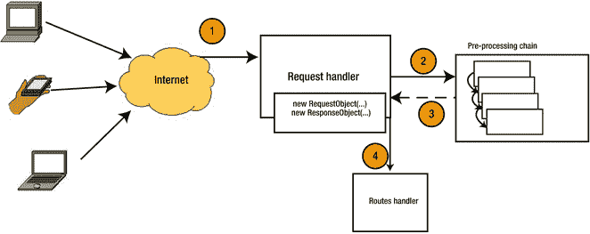
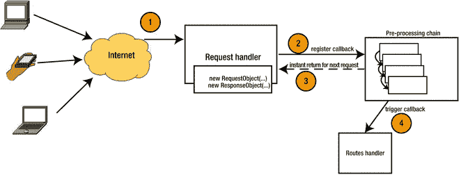
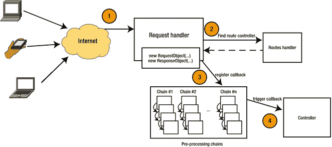
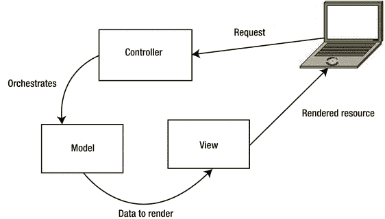
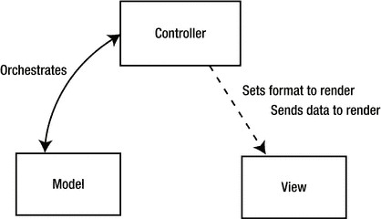
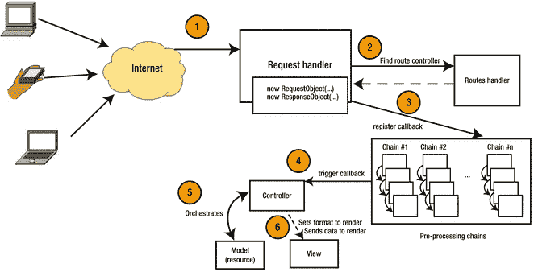
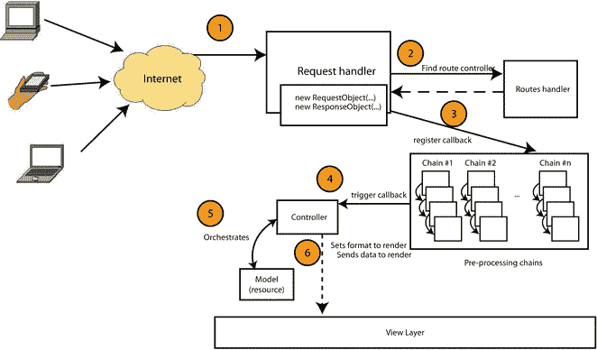
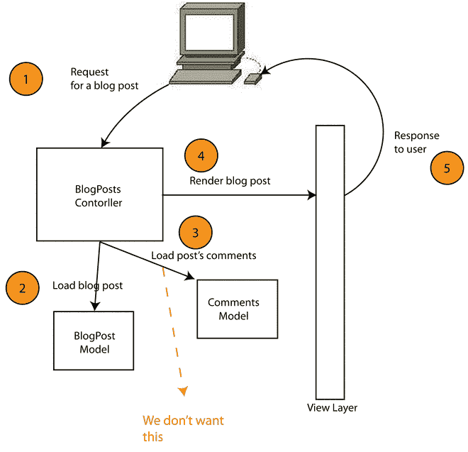
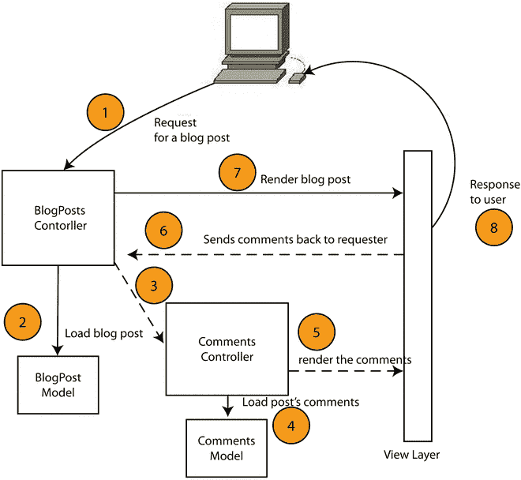
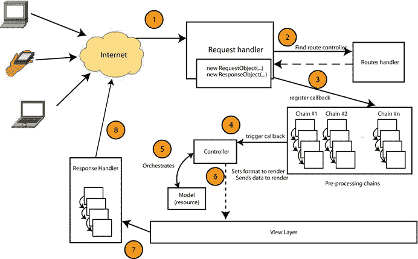

# 四、构建 REST API

理解一个基于 REST 的架构是非常重要的，这意味着如果你的所有服务都基于 REST 风格，那么系统会是什么样子。但是在开始工作之前，了解这些 REST 服务的内部架构是什么样子也是同样重要的。

Node.js 中有几个模块，每天有成千上万的下载，可以帮助您创建一个 API，而不必太担心它的内部方面。如果您急于推出产品，这可能是一个好主意，但是既然您是来学习的，我将介绍构成标准的通用 REST API 的所有组件。

提到了这些模块，但我不会详细说明它们是如何使用的。那将在下一章出现——所以继续读下去吧！

出于本书的目的，在设计 API 时，我将采用传统的方法，而您将使用 MVC 模式(模型-视图-控制器)；尽管您可能熟悉其他选项，但它是最常见的选项之一，通常非常适合作为 web 用例。

RESTful API 的基本内部架构包含以下内容:

*   请求处理程序。这是接收每个请求并在做任何事情之前处理它的焦点。
*   中间件/预处理链。这些人帮助形成请求，并为身份验证控制提供一些帮助。
*   路由处理程序。请求处理程序完成后，请求本身已经过检查，并添加了您需要的所有内容，该组件将确定谁需要处理请求。
*   控制器。这个人负责与一个特定资源相关的所有请求。
*   模型。在我们的例子中也称为资源。您将把与资源相关的大部分逻辑集中在这里。
*   制图表达层。这一层负责创建对客户端应用可见的表示。
*   响应处理程序。最后，响应处理程序负责将响应的表示发送回客户机。

Note

正如我以前多次说过的，这本书主要关注基于 HTTP 的 REST，这意味着本章提到的任何请求都是 HTTP 请求，除非另有说明。

## 请求处理器、预处理链和路由处理器

请求处理程序、预处理链和路由处理程序是对系统的任何请求的前三个组件，因此它们是拥有一个响应迅速的 API 的关键。幸运的是，您正在使用 Node.js，正如您在第三章中看到的，Node.js 非常擅长处理许多并发请求，因为它有事件循环和异步 I/O。

也就是说，让我们列出请求处理程序需要的属性，以便 RESTful 系统按预期工作:

*   它必须收集所有的 HTTP 头和请求体，解析它们，并向请求对象提供这些信息。
*   它需要能够与预处理链模块和路由处理器通信，以便确定需要执行哪个控制器。
*   它需要创建一个能够完成并(可选地)向客户端写回响应的响应对象。

图 4-1 显示了客户端和服务器之间初始联系的步骤:

图 4-1。

Example of how the request handler and its interactions with other components look The client application issues a request for a particular resource.   The request handler gathers all information. It creates a request object and passes it along to the pre-processing chain.   Once finished, the pre-processing chain returns the request object—with whatever changes made to it—to the request handler.   Finally, the RH sends the request and response objects to the routes handler so that the process can continue.  

图 4-1 中有一个问题引起了你的注意(或者应该引起注意):如果预处理链花费的时间太长，请求处理程序必须等待它完成，然后才能将请求移交给路由处理程序，任何其他传入的请求也必须等待。

如果预处理链正在执行一些繁重的任务，如加载用户相关数据或查询外部服务，这对 API 的性能尤其有害。

感谢您使用 Node.js 作为这里一切的基础，您可以轻松地将预处理链更改为异步操作。通过这样做，请求处理程序能够接收新的请求，同时仍然等待来自前一个请求的处理链。图 4-2 显示了图表将如何变化。

图 4-2。

Changes to the architecture show how to improve it by using a callback

正如你在图 4-2 中看到的，变化是最小的，至少在架构层面上是如此。请求处理程序建立对路由处理程序的回调；并且一旦预处理链完成，就执行该回调。在设置好回调之后，请求处理程序又可以处理下一个请求了。这显然为这个组件提供了更多的自由，允许整个系统每秒处理更多的请求。

Note

这种改变实际上不会加快预处理链的执行时间，也不会加快完成单个请求的时间，但是它将允许 API 每秒处理更多的请求，这实际上意味着避免了一个明显的瓶颈。

至于预处理链，您将使用它进行一般操作，这是您将要处理的大多数路线中所需要的。这样，您就可以从处理程序中提取代码，并将其集中到较小的代码单元(函数)中，每个请求都会按顺序调用这些代码单元。

你将在下一章看到的大多数模块都有一个版本的预处理链。例如，Express.js 将可以在链中执行的功能称为“中间件”vantage . js 将它们称为“预处理器”,以区别于该模块也提供的后处理器。

Tip

在向这个链中添加一个新函数时，要记住的主要规则是，作为一个良好的实践，这个函数应该处理一个任务，并且只处理一个任务。(这通常是软件开发的每个方面都要遵循的良好实践，有人称之为 Unix 哲学，有人称之为 KISS 不管你怎么称呼它，记住它是个好主意。)这样，在测试时启用和禁用它们变得非常容易，甚至可以改变它们的顺序。另一方面，如果您开始添加处理多件事情的函数，比如认证用户和加载他/她的首选项，您将不得不编辑函数的代码来禁用这些服务之一。

因为您希望整个预处理异步完成，以将请求处理程序从等待链完成的状态中释放出来，所以链将使用异步串行流。这样你就可以确定执行的顺序；但与此同时，您可以自由地让这些函数执行比正常情况花费更长时间的操作，比如对外部服务的异步调用、I/O 操作等等。

让我们最后看一下最后一张图。到目前为止，它看起来很棒:您能够异步处理请求，并且您可以通过在将请求交给 routes 处理程序之前对其进行预处理来对请求做一些有趣的事情。但是有一个问题:预处理链对于所有路线都是相同的。

如果 API 足够小，这可能不是问题，但为了安全起见，并提供完全可扩展的架构，让我们看看在当前版本上可以做的另一个变化，以提供您需要的自由(见图 4-3 )。

图 4-3。

Change on the architecture to provide room for multiple pre-processing chains

这个链条(如图 4-3 所示)比前一个大，但是确实解决了扩容问题。该过程现已更改为以下步骤:

The client application issues a request for a particular resource.   The request handler gathers all information. It creates a request object and passes it along to the request handler to return the right controller. This action is simple enough to do synchronously. Ideally, it should be done in constant time (O(1)).   Once it has the controller, it registers an asynchronous operation with the correct pre-processing chain. This time around, the developer is able to set up as many chains as needed and associates them to one specific route. The request handler also sets up the controller’s method to be executed as the callback to the chain’s process.   Finally, the callback is triggered, and the request object, with the response object passed into the controller’s method to continue the execution.   Note

步骤 2 提到基于请求的控制器查找应该在恒定时间内完成。这不是硬性要求，但应该是理想的结果；否则，在处理许多并发请求时，这一步可能会成为影响后续请求的瓶颈。

## MVC:又名模型-视图-控制器

模型-视图-控制器(MVC)架构模式 1 可能是最广为人知的模式。忘掉四人帮的设计模式， 2 忘掉你所学的关于软件设计和架构模式的一切；如果你熟悉 MVC，你就没有什么可担心的了。

实际上，那不是真的；反正大部分都不是。MVC 是目前 web 项目中最著名和最常用的设计模式之一(这是事实)。也就是说，你不应该忘记其他人；事实上，我强烈建议您实际上熟悉最常见的(当然除了 MVC)，比如单例、工厂、构建器、适配器、复合、装饰器等等。只要查一查，读一读，研究一些例子；把它们作为工具箱的一部分总是很方便的。

回到 MVC，尽管它在过去几年里变得非常流行，特别是自 2007 年以来(恰好是在这一年，流行的 web 框架 Ruby on Rails 的第 2 版发布，MVC 是其核心架构的一部分)，这个坏男孩并不新鲜。事实上，它最初是由 Krasner 和 Pope 在 1988 年的 SmallTalk-80 3 上描述为一种创建用户界面的设计模式。

它在 web 项目中如此受欢迎的原因是因为它完全适合 web 提供的多层架构。考虑一下:由于客户端-服务器架构，您已经有两层了，如果您组织代码在编排和业务逻辑之间划分一些职责，您将在服务器端获得多一层，这可以转化为表 4-1 中所示的场景。

表 4-1。

List of Layers

<colgroup><col> <col></colgroup> 
| 层 | 描述 |
| --- | --- |
| 业务逻辑 | 您可以将系统的业务逻辑封装到不同的组件中，您可以将这些组件称为模型。它们代表系统处理的不同资源。 |
| 管弦乐编曲 | 模型知道如何做他们的工作，但不知道什么时候使用什么样的数据。控制器会处理这个问题。 |
| 表示层 | 处理创建信息的可视化表示。在普通的 web 应用中，这是 HTML 页面。在 RESTful API 中，这一层负责每个资源的不同表示。 |

Note

在表 4-1 之前，我提到过客户机-服务器架构为 MVC 提供了前两层，这意味着客户机将充当表示层。这并不完全正确，稍后您会看到，但它确实作为一个概念层，这意味着您需要一种方法让应用将信息呈现给用户(客户端)。

让我们看看图 4-4 中的示意图，它代表了表 4-1 。

图 4-4。

The interaction between the three layers

图 4-4 显示了三个组件的解耦:控制器、模型(在这种情况下你也可以调用资源)和视图。这种分离允许清晰地定义每个组件的职责，这反过来有助于保持代码的整洁和易于理解。

尽管这很棒，但自从被一些 web 开发框架采用后，这种模式已经发生了一些变化，比如 Ruby on Rails 它现在看起来更像图 4-5 中所示。

图 4-5。

MVC applied to the web

模式的当前迭代移除了模型和视图之间的关系，而是将该职责交给了控制器。控制器现在还编排视图。

这个最终版本是您将添加到我们当前不断发展的架构中的版本。让我们看看它会是什么样子(见图 4-6 )。

图 4-6。

The architecture with the added MVC pattern

我们的架构中增加了步骤 5 和 6。当控制器上的正确方法被触发时(在步骤 4 中)，它处理与模型的交互，收集所需的数据，然后将其发送到视图，以将其呈现给客户端应用。

这种架构非常好，但是仍然有一个可以改进的地方。使用我们的 RESTful API，表示与资源数据结构严格相关，您可以将视图一般化为视图层，它会负责将资源转换为您需要的任何格式。这种变化简化了开发，因为您将整个视图相关的代码集中到一个单独的组件(视图层)中。

图 4-7 中的图表可能变化不大，但是视图框到视图层的变化代表了代码的一般化，这最初意味着每个资源都有一个特定的视图代码。

图 4-7。

View layer added to the architecture

### MVC 的替代方案

MVC 是一个伟大的架构。几乎每个开发人员都在使用它，或者在 web 项目中使用过它。当然，并不是每个人都喜欢它，因为它遭受了开发社区中其他流行事物所遭受的相同命运(Ruby on Rails 有人喜欢吗？).如果它在互联网上变得流行，每个人都在使用它做任何事情——直到他们意识到不是每个项目看起来都像 MVC 钉子，所以你必须开始寻找其他形状的锤子(其他替代架构)。

但幸运的是，还有其他选择；根据项目的特定方面，有一些类似的架构模式可能更适合您的需求。其中一些是 MVC 的直接衍生物，另一些试图从稍微不同的角度来处理同一个问题(我说“稍微”是因为，正如您将要看到的，有一些共同点)。

#### 分层 MVC

分层 MVC 4 是 MVC 的一个更复杂的版本，因为你可以将一个 MVC 组件嵌套在另一个组件中。这使开发人员能够拥有像一个页面的 MVC 组、另一个页面内导航的 MVC 组和一个页面内容的最终 MVC 组件这样的东西。

这种方法在开发可插入组件的可重用小部件时特别有用，因为每个 MVC 组都是自包含的。当要显示的数据来自不同的相关来源时，这很有用。在这些情况下，拥有 HMVC 结构有助于保持关注点的分离完好无损，并避免组件之间不应该出现的耦合。

让我们看一个非常基本的例子。想象一下，一个用户正在阅读一篇博客文章及其下面的相关评论。有两条路可以走:用 MVC 或者用 h MVC。

使用 MVC，请求被发送到 BlogPosts 控制器，因为这是被请求的主要资源；之后，控制器加载适当的博客文章模型，并使用该模型的 ID 加载相关的评论模型。就在这里，BlogPosts 控制器和评论模型之间出现了不必要的耦合。您可以在图 4-8 中看到这一点。

图 4-8。

The problem that HMVC tries to solve

图 4-8 显示了需要去除的联轴器；从架构的角度来看，这显然是可以改进的。所以让我们看看使用 HMVC 会是什么样子(见图 4-9 )。

图 4-9。

The same diagram with the HMVC pattern applied

架构看起来当然更复杂，步骤也更多，但也更清晰，更容易扩展。现在在第 3 步中，您向一个全新的 MVC 组件发送一个请求，这个组件负责处理评论。该组件将依次与相应的模型和通用视图层进行交互，以返回注释的表示。BlogPost 控制器接收该表示，并将其附加到从 BlogPost 模型获得的数据上，然后将所有内容发送回视图层。

如果您想在博客中创建一个新的部分来显示特定的博客文章及其评论，那么您可以很容易地重用 comments 组件。

总而言之，这种模式可以被认为是普通 MVC 的一种专门化，在设计复杂系统时它会派上用场。

#### 模型–视图–视图模型

模型-视图-视图模型模式 5 由微软在 2005 年创建，作为一种使用 WPF 和 Silverlight 促进 UI 开发的方式；它允许 UI 开发人员使用专注于用户体验(UX)的标记语言(称为 XAML)编写代码，并使用代码绑定访问动态功能。这种方法允许开发人员和 UX 开发人员独立工作，而不影响彼此的工作。

就像 MVC 一样，这个架构中的模型集中了业务逻辑，而视图模型充当模型和视图之间的中介，公开第一个模型中的数据。它还包含大部分视图逻辑，允许 ViewLayer 只专注于显示信息，而将所有动态行为留给 ViewModel。

图 4-10。

An MVVC architecture

如今，这种模式已经被微软之外的其他人采用，比如 Java 中的 ZK 框架和 KnockoutJS、AngularJS、Vue.js 以及 JavaScript 中的其他框架(由于 MVVM 是一种专门从事 UI 开发的模式，所以用 JavaScript 编写的 UI 框架是这种模式的主要采用者是有道理的)。

#### 模型-视图-适配器

模型-视图-适配器 6 (MVA)模式非常类似于 MVC，但是有一些不同之处。主要地，在 MVC 中，主要的业务逻辑集中在每个模型中，它也包含主要的数据结构，控制器负责编排模型和视图。

在 MVA，模型只是您正在处理的数据，业务逻辑集中在适配器中，它负责与视图和模型进行交互。所以基本上，更瘦的模型和更胖的控制器。但是玩笑归玩笑，这允许视图和模型完全解耦，将所有责任交给适配器。

当切换适配器以在相同的视图和模型上实现不同的行为时，这种方法非常有效。

该模式的架构如图 4-11 所示。

图 4-11。

The MVA pattern shown as a diagram

## 响应处理程序

我们的 API 架构的最后一个组件是响应处理程序；它负责从视图层获取资源表示，并将其发送回客户端。响应格式(与表示的格式不同)必须与请求的格式相同；在这种情况下，它将是一个 HTTP 1.1 消息。

HTTP 响应有两个部分:头部和主体，头部包含几个指定消息属性的字段。消息体的内容是资源的实际表示。标题是我们现在最感兴趣的部分；它包含内容类型、内容长度等字段。其中一些字段是强制的，如果您打算完全遵循 REST 风格(您确实这样做了)，那么其中一些字段是必需的。

*   可缓存:来自第一章中定义的 REST 所施加的约束。适用时，每个请求都必须显式或隐式设置为可缓存。这转化为 HTTP 头`cache-control`的使用。
*   内容类型:响应主体的内容类型对于客户端应用理解如何解析数据非常重要。如果您的资源只有一种可能的表示，内容类型可能是一个可选的头，因为您可以通过您的文档通知客户端应用开发人员有关格式的信息。但是如果你在将来改变它，或者添加一个新的，那么它可能会对你的客户造成一些严重的损害。因此，考虑这个标题是强制性的。
*   状态:状态代码不是强制性的，但是非常重要，正如我在前面的章节中提到的。它为客户端应用提供了请求结果的快速指示器。
*   日期:该字段应包含消息发送的日期和时间。它应该采用 HTTP-date 格式 7 (例如，Fri，2014 年 12 月 24 日 23:34:45 GMT)。
*   Content-length:该字段应该包含所传输消息体的字节数(长度)。

让我们看一个用 JSON 表示资源的 HTTP 响应的例子:

`HTTP/1.0 200 OK`

`Date: Fri, 31 Dec 1999 23:59:59 GMT`

`Content-Type: application/json`

`Cache-control: private, max-age=0, no-cache`

`Content-Length: 1354`

`{`

`"name": "J.K.Rolling",`

`"id": "ab12351bac",`

`"books": [`

`{`

`"title": "Harry Potter and the Philosopher’s Stone",`

`"isbn": "9788478888566"`

`},`

`{`

`"title": "Harry Potter and the Prisoner of Azkaban",`

`"isbn": "9788422685227"`

`}`

`]`

`}`

如果您想获得额外的好处，还可以对响应处理程序进行一项改进。这完全是多余的，大多数 Node.js 框架都没有(除了梵蒂冈. js)。

这个想法是有一个后处理函数链，它接收视图层返回的响应内容，并转换它，或者用更多的数据丰富它。它将作为预处理链的第一个版本:整个过程的一个公共链。

有了这个想法，你可以从控制器中抽象出更多的代码，只要把它移到后处理阶段。像模式验证(我将在本书后面讨论)或响应头设置这样的代码可以集中在这里，并增加一个简单的机制来切换它或禁用链中的步骤。

让我们看看我们的 API 的最终架构(见图 4-12 )。

图 4-12。

The final architecture with the response handler and the added post-processing chain

## 摘要

这一章讲述了完整且实用的 RESTful API 架构的基础知识。它甚至涵盖了一些额外的东西，这些东西并不是必需的，但是拥有它们当然很好，比如预处理和后处理。您还查看了我们设计背后的主要架构(MVC)和一些替代方案，以防您的需求与 MVC 模型不完全匹配。

在下一章，我将开始讨论你将用来编写这个架构的实现的模块。

Footnotes 1

[`http://en.wikipedia.org/wiki/Model%E2%80%93view%E2%80%93controller`见](http://en.wikipedia.org/wiki/Model%E2%80%93view%E2%80%93controller)。

  2

[`http://www.amazon.com/Design-Patterns-Elements-Reusable-Object-Oriented/dp/0201633612/`见](http://www.amazon.com/Design-Patterns-Elements-Reusable-Object-Oriented/dp/0201633612/)。

  3

[`http://dl.acm.org/citation.cfm?id=50757.50759`见](http://dl.acm.org/citation.cfm?id=50757.50759)。

  4

[`http://en.wikipedia.org/wiki/Hierarchical_model%E2%80%93view%E2%80%93controller`见](http://en.wikipedia.org/wiki/Hierarchical_model%E2%80%93view%E2%80%93controller)。

  5

[`http://en.wikipedia.org/wiki/Model_View_ViewModel`见](http://en.wikipedia.org/wiki/Model_View_ViewModel)。

  6

[`http://en.wikipedia.org/wiki/Model%E2%80%93view%E2%80%93adapter`见](http://en.wikipedia.org/wiki/Model%E2%80%93view%E2%80%93adapter)。

  7

[`http://tools.ietf.org/html/rfc7231#section-7.1.1.1`见](http://tools.ietf.org/html/rfc7231#section-7.1.1.1)。