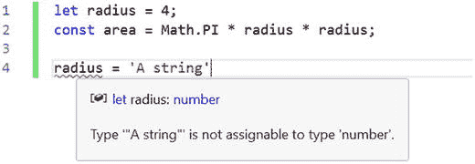
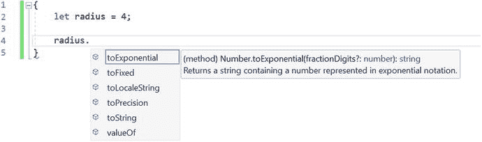
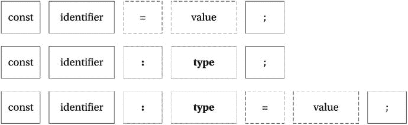
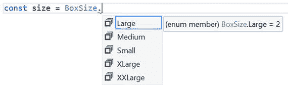
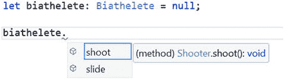
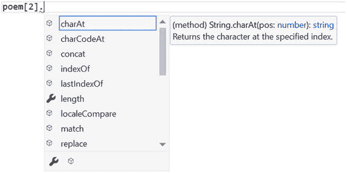
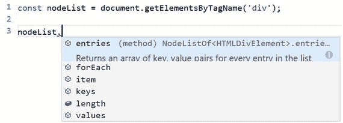

# 一、TypeScript 语言功能

如果我们可以用大规模应用开发所缺少的东西来增强 JavaScript，比如静态类型、类[和]模块，会怎么样...这就是 TypeScript 的作用。—安德斯·海尔斯伯格

TypeScript 是 JavaScript 的超集。这意味着 TypeScript 语言包括了整个 JavaScript 语言以及一些有用的附加特性。这与 JavaScript 的各种子集和各种林挺工具形成对比，这些工具试图减少可用的功能，以创建一种更小的语言，减少惊喜。本章将向您介绍额外的语言特性，从简单的类型注释开始，逐步发展到更高级的特性和 TypeScript 的结构元素。本章并没有涵盖 ECMAScript 语言规范中包含的所有特性，所以如果您需要复习 JavaScript，可以看看附录 1。

需要记住的一件重要事情是，JavaScript 中的所有标准控制结构都可以在 TypeScript 程序中立即使用。这包括以下内容:

*   控制流程
*   数据类型
*   经营者
*   子程序

程序的基本构建块将来自 JavaScript，包括 if 语句、switch 语句、循环、算术、逻辑测试和函数。这是 TypeScript 的主要优势之一——它基于一种已经为大量不同的程序员所熟悉的语言(和一个语言家族)。JavaScript 不仅在 ECMA-262 规范中有完整的文档，在书籍、开发者门户网站、论坛和问答网站上也有。当特性被添加到 JavaScript 中时，它们也会出现在 TypeScript 中。

TypeScript 编译器通常会在其规范的早期更新新的 JavaScript 特性。大多数功能在浏览器支持它们之前都是可用的。在许多情况下，您可以在 TypeScript 程序中使用这些功能，因为编译器会将它们转换为针对 ECMAScript 标准的旧版本的代码。

本章中讨论的每一种语言特性都有简短、独立的代码示例，将特性放在上下文中。出于介绍和解释特性的目的，示例简短扼要；这样就可以从头到尾阅读这一章。然而，这也意味着你可以在以后参考这一章。一旦你读完了这一章，你应该知道理解本书其余部分所描述的更复杂的例子所需要的一切。

## JavaScript 是有效的类型脚本

在我们了解更多关于 TypeScript 语法的内容之前，有必要强调一个重要的事实:所有的 JavaScript 都是有效的 TypeScript。您不需要放弃任何 JavaScript 知识，因为它们都可以直接转移到您的 TypeScript 代码中。您可以获取现有的 JavaScript 代码，将其添加到 TypeScript 文件中，所有语句都将有效。在 TypeScript 中，有效代码和无错代码有细微的区别；因为，尽管您的代码可能工作，但 TypeScript 编译器会警告您它检测到的任何潜在问题。发现微妙的和以前未被发现的错误是向 TypeScript 过渡的程序员的共同经历。

如果将 JavaScript 列表转移到 TypeScript 文件中，即使代码被认为是有效的，也可能会收到错误或警告。一个常见的例子来自于 JavaScript 中的动态类型系统，在这个系统中，在同一个变量的生命周期中为其分配不同类型的值是完全可以接受的。TypeScript 检测这些赋值并生成错误，以警告您变量的类型已被赋值所更改。因为这是程序中常见的错误原因，所以可以通过创建单独的变量、执行类型断言或使变量动态化来更正错误。本章后面有关于类型注释的更多信息，类型系统将在第三章中详细讨论。

不像某些编译器只创建未检测到编译错误的输出，TypeScript 编译器仍然会尝试生成合理的 JavaScript 代码。清单 1-1 中显示的 TypeScript 代码产生了一个错误，但是仍然产生了 JavaScript 输出。这是一个令人钦佩的特性，但正如编译器警告和错误一样，您应该纠正源代码中的问题，获得干净的编译。如果您经常忽略这些消息，您的程序最终会表现出意想不到的行为。在某些情况下，您的清单可能包含非常严重的错误，以至于 TypeScript 编译器无法生成 JavaScript 输出。

Caution

“所有 JavaScript 都是有效的类型脚本”规则的唯一例外是`with`语句和特定于供应商的扩展，直到它们被正式添加到 ECMAScript 规范中。从技术上讲，您仍然可以使用`with`语句，但是块中的所有语句都不会被检查。

清单 1-1 中的 JavaScript `with`语句展示了同一个例程的两个例子。虽然第一个显式调用了`Math.PI`，但是第二个使用了一个`with`语句，将`Math`的属性和功能添加到当前范围。嵌套在`with`语句中的语句可以省略`Math`前缀，直接调用属性和函数，例如`PI`属性或`floor`函数。

在`with`语句的末尾，原始的词法范围被恢复，因此在`with`块之外的后续调用必须使用`Math`前缀。

```js
// Not using with
const radius1 = 4;
const area1 = Math.PI * radius1 * radius1;

// Using with
const radius2 = 4;
with (Math) {
    const area2 = PI * radius2 * radius2;
}

Listing 1-1.Using JavaScript’s “with” statement

```

ECMAScript 5 和更高版本的 ECMAScript 在严格模式下不允许使用`with`语句，默认情况下，对于类和模块使用严格模式。TypeScript 将`with`语句视为错误，并将`with`语句中的所有类型视为动态类型。这是由于以下原因:

*   事实上它在严格模式下是不允许的。
*   普遍认为`with`声明是危险的。
*   在编译时确定范围内的标识符的实际问题。

因此，记住这些规则的小例外，您可以将任何有效的 JavaScript 放入 TypeScript 文件，它将是有效的 TypeScript。作为一个示例，下面是传输到 TypeScript 文件的面积计算脚本。

Note

ECMAScript 6 规范，也称为“ES6 Harmony”，代表了 JavaScript 语言的重大变化。该规范已被划分为年度块，发布为 ECMAScript 2015、ECMAScript 2016 等。

```js
const radius = 4;
const area = Math.PI * radius * radius;
Listing 1-2.Transferring JavaScript in to a TypeScript file

```

在清单 1-2 中，语句只是普通的 JavaScript，但是在 TypeScript 中，变量`radius`和`area`都将受益于类型推断。因为`radius`是用值`4`初始化的，所以可以推断出`radius`的类型是`number`。只需稍微增加努力，将已知为`number`的`Math.PI`乘以已经被推断为`number`的`radius`变量，就可以推断出`area`的类型也是`number`。

使用类型推断，可以检查赋值的类型安全性。图 1-1 显示了当一个字符串被赋值给半径变量时，不安全赋值是如何被检测到的。在第三章中有更详细的类型推断解释。就目前而言，请放心，类型推断是一件好事，它会节省您很多精力。



图 1-1。

Static type checking

## 变量

TypeScript 变量必须遵循 JavaScript 命名规则。用于命名变量的标识符必须满足以下条件。

第一个字符必须是下列字符之一:

*   大写字母
*   小写字母
*   下划线
*   美元符号
*   类别中的 Unicode 字符-大写字母(Lu)、小写字母(Ll)、标题大写字母(Lt)、修饰字母(Lm)、其他字母(Lo)或字母数字(Nl)

后续字符遵循相同的规则，此外还允许以下内容:

*   数字
*   类别中的 Unicode 字符-非空格标记(Mn)、空格组合标记(Mc)、十进制数字(Nd)或连接符标点(Pc)
*   Unicode 字符 U+200C(零宽度非连接符)和 U+200D(零宽度连接符)

您可以使用 Mathias Bynens 的 JavaScript 变量名验证器来测试变量标识符是否符合命名规则。

[`http://mothereff.in/js-variables`](http://mothereff.in/js-variables)

Note

一些更奇特的字符的可用性可以允许一些有趣的标识符。您应该考虑这种变量名引起的问题是否多于它解决的问题。例如，这是有效的 JavaScript: `const`  `= 'Dignified';`

用`const`或`let`声明的变量是块范围的，而用旧的`var`关键字声明的变量是函数范围的。如果您省略了这些关键字，您就隐式地(也许是意外地)在全局范围内声明了该变量。建议减少添加到全局范围的变量数量，因为它们有名称冲突的风险。您可以通过声明局部变量来避免全局范围，例如在函数、模块、命名空间、类或一组简单的花括号中(如果您使用的是块范围的关键字)。

当你限制一个变量的作用域时，意味着它不能在它被创建的作用域之外被操作。作用域遵循嵌套规则，该规则允许变量在当前作用域和内部嵌套作用域中使用，但不能在外部使用。换句话说，您可以使用当前作用域中声明的变量和更大作用域中的变量。参见清单 1-3 。

```js
let globalScope = 1;

{
    let blockScope = 2;

    // OK. This is from a wider scope
    globalScope = 100;

    // Error! This is outside of the scope the variable is declared in
    nestedBlockScope = 300;

    {
        let nestedBlockScope = 3;

        // OK. This is from a wider scope
        globalScope = 1000;

        // OK. This is from a wider scope
        blockScope = 2000;
    }
}

Listing 1-3.Block scope

```

TypeScript 捕捉范围冲突，并在您试图访问在较窄范围内声明的变量时发出警告。您可以帮助编译器帮助您避免在不同的范围内重用名称的有效但经常是偶然的编码风格。在清单 1-4 中，日志记录语句工作正常，两个`firstName`变量被分开保存。这意味着原始变量不会被同名的嵌套变量覆盖。

```js
let firstName = 'Chris';

{
    let firstName = 'Tudor';

    console.log('Name 1: ' + firstName);
}

console.log('Name 2: ' + firstName);

// Output:
// Name 1: Tudor
// Name 2: Chris

Listing 1-4.Name reuse with let

```

如果使用了关键字`var`来代替关键字`let`，两个日志记录语句都将显示名称“Tudor”，如清单 1-5 所示。尽管这两个变量看起来是单独的声明，但只有一个名为`firstName`的变量存在，并且被嵌套的作用域覆盖。

```js
var firstName = 'Chris';

{
    var firstName = 'Tudor';

    console.log('Name 1: ' + firstName);
}

console.log('Name 2: ' + firstName);

// Output:
// Name 1: Tudor
// Name 2: Tudor

Listing 1-5.Name reuse with var

```

基于这个例子，您可以决定您是想要 let 风格的作用域，还是 var 风格的作用域用于您重用其名称的变量；或者您可以使用更好的变量名来避免依赖任何一种行为。

## 常数

常量是遵循`let`关键字范围规则的变量，但不能被重新分配。当你用关键字`const`声明一个变量时，你不能在以后给这个变量赋值。值得注意的是，这并没有使变量成为不可变的，正如你在清单 1-6 中看到的。不允许在声明常数后直接赋值，但是可以改变常数中的值，例如，通过对已经赋值的值调用方法，或者在数组的情况下通过添加项

```js
const name = 'Lily';

// Error! Cannot assign to name because it is a constant
name = 'Princess Sparkles';

const digits = [1, 2, 3];

// Mutable - this changes the value of digits without using an assignment
digits.push(4, 5, 6);

Listing 1-6.Constants

```

推荐的编码风格是从对所有变量使用`const`关键字开始，如果你决定允许的话，用`let`关键字打开一个要重新分配的变量。常数通过遵循最小特权原则降低了代码的复杂性，因为您不需要继续扫描程序来查看后面的赋值是否会改变值；但是请注意，变量不是不可变的，可以通过其他方式进行更改。

## 类型

TypeScript 是可选的静态类型；这意味着会自动检查类型，以防止意外分配无效值。可以通过声明动态变量来退出。静态类型检查减少了因意外误用类型而导致的错误。你也可以创建类型来替换原始类型，以防止参数排序错误，如第三章所述。最重要的是，静态类型允许开发工具提供智能自动完成。

图 1-2 显示了知道变量类型的自动完成，并提供了相关的选项列表。它还显示了关于自动完成列表中的属性和方法的扩展信息。上下文自动完成对于原始类型足够有用，但是大多数合理的集成开发环境甚至可以在 JavaScript 文件中复制简单的推理。然而，在具有许多自定义类型、模块和类的程序中，TypeScript 语言服务的深度类型知识意味着您将在整个程序中拥有明智的自动完成功能。



图 1-2。

TypeScript autocompletion

### 键入注释

尽管 TypeScript 语言服务擅长自动推断类型，但有时它无法理解您的意图。有时，为了安全起见，您可能希望将类型显式化，或者缩小类型的范围。在这些情况下，可以使用类型批注来指定类型。

对于变量，类型注释在标识符之后，冒号之前。图 1-3 显示了产生类型化变量的组合。这些组合按优先顺序显示，第一个组合是最理想的。最不可取的是添加类型注释和赋值的最冗长的方式。虽然这种风格在本章的很多例子中都有出现，但实际上这是你用得最少的一种。



图 1-3。

Typed variable combinations

为了演示代码中的类型注释，清单 1-7 展示了一个变量的例子，它有一个显式的类型注释，将变量标记为一个字符串。基本类型是最简单的类型注释形式，但是您并不局限于这种简单的类型。

```js
const name: string = 'Steve';
Listing 1-7.Explicit type annotation

```

用于指定注释的类型可以是基元类型、数组类型、函数签名、类型别名或任何您想要表示的复杂结构，包括您创建的类和接口的名称。您还可以通过允许多种类型中的一种(联合类型)来实现宽松，或者通过限制允许值的范围来实现更严格的限制(文字类型)。如果您想退出静态类型检查，您可以使用特殊的`any`类型，它将变量的类型标记为动态。不对动态类型进行检查。清单 1-8 展示了一系列类型注释，涵盖了这些不同的场景。

```js
// primitive type annotation
const name: string = 'Steve';
const heightInCentimeters: number = 182.88;
const isActive: boolean = true;

// array type annotation
const names: string[] = ['James', 'Nick', 'Rebecca', 'Lily'];

// function annotation with parameter type annotation and return type annotation
let sayHello: (name: string) => string;

// implementation of sayHello function
sayHello = function (name) {
    return 'Hello ' + name;
};

// object type annotation
let person: { name: string; heightInCentimeters: number; };

// Implementation of a person object
person = {
    name: 'Mark',
    heightInCentimeters: 183

};

Listing 1-8.
Type annotations

```

Note

尽管许多语言在标识符之前指定类型，但是在标识符之后的 TypeScript 中放置类型批注有助于强调类型批注是可选的。它还允许您使用所有的变量语句，包括`const`和`let`。这种类型注释的风格也受到了类型理论的启发。

如果类型批注变得太复杂，可以创建一个接口或类型别名来表示类型，以简化批注。清单 1-9 演示了如何简化`person`对象的类型注释，这在清单 1-8 中的前一个例子的末尾显示过。如果您打算重用该类型，这种技术尤其有用，因为它提供了可重用的定义。接口和类型别名不限于描述对象类型；它们足够灵活，可以描述你可能遇到的任何结构。本章后面将更详细地讨论接口。

在选择是使用接口还是类型别名时，有必要了解接口可以做而类型别名不能做的事情。接口可以在 extends 或 implements 子句中使用，这意味着您可以在定义其他接口和类时显式使用它们。接口也可以接受类型参数，使接口成为泛型。类型别名不能做到这两点。

```js
// Interface
interface PersonInterface {
    name: string;
    heightInCentimeters: number;
}

const sherlock: PersonInterface = {
    name: 'Bendict',
    heightInCentimeters: 183
}

// Type Alias
type PersonType = {
    name: string;
    heightInCentimeters: number;
};

const john: PersonType = {
    name: 'Martin',
    heightInCentimeters: 169
}

Listing 1-9.Interface and type alias

```

### 原始类型

TypeScript 中的基本类型非常基本，但是通过类型系统的工具，您可以组合它们、扩大它们、缩小它们来表示程序中的概念。这些类型直接表示底层 JavaScript 类型，并遵循为这些类型设置的标准:

*   `string`–一系列 UTF-16 代码单元
*   `boolean`–对或错
*   `number`–双精度 64 位浮点值
*   `symbol`–唯一的、不可变的符号，可替代字符串作为对象键

没有特殊类型来表示整数或数字类型的其他特定变体，因为执行静态分析来确保所有可能的赋值都有效是不切实际的。

类型系统还包含几个表示特殊值的类型:

*   `undefined`类型是尚未赋值的变量值。
*   `null`类型可以用来表示对象值的有意缺失。例如，如果您有一个方法来搜索一个对象数组以找到匹配，它可以返回`null`来表明没有找到匹配。
*   `void`类型用于表示没有值的情况，例如，表示函数不返回任何值。
*   `never`类型代表一段不可到达的代码，例如一个抛出异常的函数的返回类型是`never`。

### 对象和动态类型

TypeScript 中所有不是原始类型的都是`object`类型的子类。程序中的大多数类型都可能属于这个定义。

我们类型中的最后一项是动态`any`类型，它可以用来表示任何类型。使用动态类型时，没有针对该类型的编译器类型检查。

在不能自动推断类型的情况下，编译器也使用`any`类型，尽管您可以使用编译器标志禁止这些隐式的`any`类型(请参考附录 2，了解您可以为编译指定的选项的完整列表)。您还可以在不希望编译器检查类型的情况下使用它，这样您就可以访问 JavaScript 语言的所有动态特性。

既然已经描述了所有的基本类型，下一节将介绍一些特殊的机制，用于以缩小或扩大允许值范围的方式组合类型。

### 列举

枚举是最简单的收缩类型之一。枚举表示命名元素的集合，您可以使用它来避免用硬编码的值破坏您的程序。默认情况下，枚举是从零开始的，尽管您可以通过指定第一个值来更改这一点，在这种情况下，数字将从您设置的值开始递增。如果愿意，您可以选择为所有标识符指定值。

在清单 1-10 中，VehicleType 枚举可用于在整个程序中使用良好命名的标识符来描述车辆类型。指定标识符名称时传递的值是代表标识符的数字，例如，在清单 1-10 中使用的车辆类型。卡车标识符导致数字 5 存储在类型变量中。通过将枚举视为数组，也可以从枚举中获取标识符名称。

```js
enum VehicleType {
    PedalCycle,
    MotorCycle,
    Car,
    Van,
    Bus,
    Lorry
}

const type = VehicleType.Lorry;

const typeName = VehicleType[type]; // 'Lorry'

Listing 1-10.Enumerations

```

在 TypeScript 中，枚举是开放式的。这意味着在一个公共根中具有相同名称的所有声明都将贡献给一个类型。当跨多个块定义枚举时，第一个声明之后的后续块必须指定用于继续序列的数值，如清单 1-11 所示。对于从第三方、环境声明和标准库中扩展代码来说，这是一种有用的技术。

```js
enum BoxSize {
    Small,
    Medium
}

//...

enum BoxSize {
    Large = 2,
    XLarge,
    XXLarge
}

Listing 1-11.Enumeration split across multiple

blocks

```

在多个块中声明的枚举的消费者可以看出在一个块中声明的枚举没有区别，如图 1-4 所示。



图 1-4。

Using a multi-block enumeration Note

术语公共根来自图论。在 TypeScript 中，该术语与程序中模块树的特定位置相关。每当考虑合并声明时，它们必须具有相同的完全限定名，这意味着在树的同一级别上具有相同的名称。

#### 位标志

您可以使用枚举来定义位标志。位标志允许通过打开和关闭序列中的各个位来选择或取消选择一系列项目。为了确保枚举中的每个值都与一位相关，编号必须遵循二进制序列，即每个值都是 2 的幂，例如:

```js
1, 2, 4, 8, 16, 32, 64, 128, 256, 512, 1,024, 2,048, 4,096, and so on

```

清单 1-12 显示了一个使用位标志枚举的例子。默认情况下，当您创建一个变量来存储状态时，所有项目都被关闭。要打开一个选项，只需将它赋给变量。要打开多个项目，可以用按位 OR 运算符(|)将项目组合起来。如果您碰巧使用按位“或”运算符多次包含项，则这些项将保持打开状态。按位标志在附录 3 中有详细解释。

```js
enum DiscFlags {
    None = 0,
    Drive = 1,
    Influence = 2,
    Steadiness = 4,
    Conscientiousness = 8
}

// Using flags
var personality = DiscFlags.Drive | DiscFlags.Conscientiousness;

// Testing flags

// true
var hasD = (personality & DiscFlags.Drive) == DiscFlags.Drive;

// false
var hasI = (personality & DiscFlags.Influence) == DiscFlags.Influence;

// false
var hasS = (personality & DiscFlags.Steadiness) == DiscFlags.Steadiness;

// true
var hasC = (personality & DiscFlags.Conscientiousness) == DiscFlags.Conscientiousness;

Listing 1-12.Flags

```

分配给枚举中每一项的值可以是常数，也可以是计算值。常量值是可以由类型系统解释的任何表达式，如文字值、计算和二元运算符。计算值是编译器无法有效解释的表达式，如分配字符串长度或调用方法。这里的术语严重超载；当考虑“常量与计算值”时，术语“常量”不应与关键字`const`混淆，关键字可用于变量和一种特殊的枚举，称为常量枚举。

#### 常数枚举

可以使用关键字`const`创建一个常量枚举，如清单 1-13 所示。与普通枚举不同，常量枚举在编译期间被擦除，引用它的所有代码都被替换为硬编码值。

```js
const enum VehicleType {
    PedalCycle,
    MotorCycle,
    Car,
    Van,
    Bus,
    Lorry
}

const type = VehicleType.Lorry;

Listing 1-13.Constant enumeration

```

清单 1-14 显示了这个例子编译后的 JavaScript 输出。整个枚举都消失了，引用卡车车辆类型的代码被替换为值 5。为了帮助理解，插入了注释来描述文字值。

```js
var type = 5 /* Lorry */;
Listing 1-14.JavaScript output of a constant enumeration

```

为了使值的内联成为可能，常量枚举不允许有计算成员。

### 工会类型

联合类型通过指定值可以属于多种类型来扩展允许的值。像 jQuery 这样的库通常会公开一些函数，例如，允许您传递一个 jQuery 对象或一个字符串选择器；而联合类型允许您将可能的值限制为这两种类型(而不是求助于完全动态的类型)。

如清单 1-15 所示，创建一个类型或者是`Boolean`或者是`number`是可能的。联合类型使用管道分隔符来分隔每种可能的类型，您可以将它们理解为“OR”试图提供与联合中的某个类型不匹配的值会导致错误。

```js
// Type annotation for a union type
let union: boolean | number;

// OK: number
union = 5;

// OK: boolean
union = true;

// Error: Type "string" is not assignable to type 'number | boolean'
union = 'string';

// Type alias for a union type
type StringOrError = string | Error;

// Type alias for union of many types
type SeriesOfTypes = string | number | boolean | Error;

Listing 1-15.Union Types

```

创建联合类型时，可以考虑使用类型别名来减少程序中定义的重复，并为概念命名。可以使用程序中可用的任何类型来创建联合，而不仅仅是基元类型。

### 文字类型

文字类型可用于将允许值的范围缩小到该类型的一个子集，例如将一个字符串缩减为一组特定的值。清单 1-16 显示了一种类型的`Kingdom`，它具有生物体的六个分类部门作为可能的值。类型为`Kingdom`的变量只能使用文字类型中包含的特定值。

```js
type Kingdom = 'Bacteria' | 'Protozoa' | 'Chromista' | 'Plantae' | 'Fungi' | 'Animalia';

let kingdom: Kingdom;

// OK
kingdom = 'Bacteria';

// Error: Type 'Protista' is not assignable to type 'Kingdom'
kingdom = 'Protista';

Listing 1-16.String literal type

```

文字类型实际上只是由特定值组成的联合类型，因此您也可以使用相同的语法创建数字文字类型或联合/文字混合类型。

```js
// Number literal type
type Fibonacci = 1 | 2 | 3 | 5 | 8 | 13;

let num: Fibonacci;

// OK
num = 8;

// Error: Type '9' is not assignable to type 'Fibonacci'
num = 9;

// Hybrid union/literal type
type Randoms = 'Text' | 10 | false;

let random: Randoms;

// OK
random = 'Text';
random = 10;
random = false;

// Error: Not assignable.
random = 'Other String';
random = 12;
random = true;

Listing 1-17.Number literal types and hybrid union/literal types

```

文字类型的行为类似于枚举的行为，因此如果您在文字类型中只使用数字，请考虑枚举在您的程序中是否更具表达性。

### 交叉点类型

交集类型将几个不同的类型组合成一个超类型，该超类型包括所有参与类型的成员。在联合类型为“A 型或 B 型”的情况下，交叉类型为“A 型和 B 型”。清单 1-18 显示了滑雪者和射击者的两个接口，这两个接口组合成了 biathelete 交叉类型。交集类型使用“与”字符，您可以将其读作“与”

```js
interface Skier {
    slide(): void;
}

interface Shooter {
    shoot(): void;
}

type Biathelete = Skier & Shooter;

Listing 1-18.Intersection Types

```

为了查看交集类型的结果，图 1-5 显示了为 biathelete 类型显示的自动完成，同时显示了 shoot 和 slide 方法。自动完成还显示成员的原始类型。



图 1-5。

Intersection type members

交集类型对于处理 mixins 很有用，你会在第四章读到。

### 数组

TypeScript 数组的内容具有精确的类型。要指定数组类型，只需在类型名后添加方括号。这适用于所有类型，无论它们是基元类型还是自定义类型。当您将项目添加到数组时，将检查其类型以确保它是兼容的。当您访问数组中的元素时，您将获得高质量的自动完成，因为每一项的类型是已知的。清单 1-19 展示了每一种类型检查。

在清单 1-19 中有一些有趣的观察结果。当声明了`monuments`变量时，`Monument`对象数组的类型注释可以是简写的:`Monument[]`或手写的:`Array<Monument>`——这两种样式在含义上没有区别。因此，你应该选择你认为可读性更好的。注意，数组是在等号后面使用空数组文字(`[]`)实例化的。您还可以用值来实例化它，方法是将它们添加到括号中，用逗号分隔。

使用`monuments.push(...)`添加到数组的对象不是明确的`Monument`对象。这是允许的，因为它们与`Monument`接口兼容。如果您遗漏了一个属性，将会警告您该类型不兼容；如果您添加一个额外的成员，您也会收到一个警告，这有助于捕捉拼写错误的成员名称。

使用`monuments.sort(...)`对数组进行排序，它采用一个函数来比较值。当比较是数字时，comparer 函数可以简单地返回`a - b`，在其他情况下，您可以编写自定义代码来执行比较，并返回一个正数或负数用于排序(如果值相同，则返回零)。

```js
interface Monument {
    name: string;
    heightInMeters: number;
}

// The array is typed using the Monument interface
const monuments: Monument[] = [];

// Each item added to the array is checked for type compatibility
monuments.push({
    name: 'Statue of Liberty',
    heightInMeters: 46
});

monuments.push({
    name: 'Peter the Great',
    heightInMeters: 96
});

monuments.push({
    name: 'Angel of the North',
    heightInMeters: 20
});

function compareMonumentHeights(a: Monument, b: Monument) {
    if (a.heightInMeters > b.heightInMeters) {
        return -1;
    }
    if (a.heightInMeters < b.heightInMeters) {
        return 1;
    }
    return 0;
}

// The array.sort method expects a comparer that accepts two Monuments
const monumentsOrderedByHeight = monuments.sort(compareMonumentHeights);

// Get the first element from the array, which is the tallest
const tallestMonument = monumentsOrderedByHeight[0];

// Peter the Great
console.log(tallestMonument.name);

Listing 1-19.Typed arrays

```

使用索引来访问数组中的元素。索引是从零开始的，所以`monumentsOrderedByHeight`数组中的第一个元素是`monumentsOrderedByHeight[0]`。当从数组中访问一个元素时，会为`name`和`heightInMeters`属性提供自动完成功能。

要了解更多关于使用数组和循环的信息，请参考附录 1。

### 元组类型

元组类型使用数组，并根据元素的位置指定元素的类型。清单 1-20 显示了一个元组类型，其中数组中的三个项被类型化。

```js
let poem: [number, boolean, string];

// OK
poem = [1, true, 'love'];

// Error: 'string' is not assignable to 'number'
poem = ['my', true, 'love'];

Listing 1-20.Tuple types

```

当通过索引访问类型时，类型是已知的，并将被编译器检查。自动完成列表也是特定类型的，如图 1-6 所示，其中第三项(在索引 2 处)是一个字符串。



图 1-6。

Autocompletion members for tuple types

元组以它们定义的项数命名(大于 7 项的元组称为 n 元组)。

*   配对:2 个项目
*   三件套:3 件
*   四倍:4 项
*   五个:5 个项目
*   六:6 项
*   9 月:7 项

元组的常见用例是能够从一个方法返回多个值，而不必定义更复杂的结构。从概念上讲，只要数据是相关的，并且它的生命周期很短，元组就是有用的。

### 字典类型

您可以使用索引类型在 TypeScript 中表示字典，如清单 1-21 所示。索引类型在方括号中指定键及其类型，然后以类型注释的形式指定值的类型。cephalopod 字典是一个具有动态键的对象，但是 TypeScript 将确保键和值的类型是正确的。

```js
interface Cephalopod {
    hasInk: boolean;
    arms: number;
    tentacles: number;
}

interface CephalopodDictionary {

    [index: string]: Cephalopod;

}

let dictionary: CephalopodDictionary = {};

dictionary['octopus vulgaris'] = { hasInk: true, arms: 8, tentacles: 0 };
dictionary['loligo vulgaris'] = { hasInk: true, arms: 8, tentacles: 2 };

// Error. Not assignable to type 'Cephalopod'
dictionary[0] = { hasInk: true };

const octopus = dictionary['octopus vulgaris'];

// 0 (The common octopus has no tentacles)
console.log(octopus.tentacles);

// Remove item
delete dictionary['octopus vulgaris'];

Listing 1-21.Indexed types

```

字典可以用来映射语言翻译，或者在任何需要根据唯一键查找条目的地方使用。

### 映射类型

为了减少创建仅在可选性或可读性方面不同的相似类型所需的工作量，映射类型允许您在单个表达式中创建现有类型的变体。映射类型使用`keyof`关键字，这是一个索引类型查询，它收集程序中某个类型允许的属性名列表。

在清单 1-22 中，选项类型被手动重复为只读类型、可选类型和可空类型。options 接口上只有两个成员，但这已经是冗长的代码了。

```js
interface Options {
    material: string;
    backlight: boolean;
}

// Manually created readonly interface
interface ManualReadonlyOptions {
    readonly material: string;
    readonly backlight: boolean;
}

// Manually created optional interface
interface ManualOptionalOptions {
    material?: string;
    backlight?: string;
}

// Manually created nullable interface
interface ManualNullableOptions {
    material: string | null;
    backlight: string | null;
}

Listing 1-22.Manual type variations

```

清单 1-23 显示了所有这些重复的替代方案。创建了三种可重用的类型，可以用一行代码生成只读、可选或可空的类型变体。这三种命名类型创建了这些选项界面的变体。

```js
interface Options {
    material: string;
    backlight: boolean;
}

// Mapped types
type ReadOnly<T> = { readonly [k in keyof T]: T[k]; }
type Optional<T> = {[k in keyof T]?: T[k]; }
type Nullable<T> = {[k in keyof T]: T[k] | null; }

// Creating new types from mapped types
type ReadonlyOptions = Readonly<Options>;
type OptionalOptions = Optional<Options>;
type NullableOptions = Nullable<Options>;

Listing 1-23.Mapped types

```

您用映射类型创建的类型可以用在类型注释中来代替原始接口，如清单 1-24 所示，每个类型的行为都会相应地更新。

```js
// Read-only type
const options1: ReadonlyOptions = {
    backlight: true,
    material: 'plastic'
};

// Error. Property is read-only
options1.backlight = false;

// Optional type
const options2: OptionalOptions = {
    // All members are optional
};

// Nullable type
const options3: NullableOptions = {
    backlight: null,
    material: null
};

Listing 1-24.Using mapped types

```

清单 1-23 中的三种映射类型可以直接转移到您的程序中，以便您在需要时快速创建自己的类型变体。

### 类型断言

如果 TypeScript 确定某个赋值无效，但您知道您正在处理一种特殊情况，则可以使用类型断言重写该类型。当您使用类型断言时，您是在从编译器那里承担责任，并且必须确保赋值是有效的。如果你犯了一个错误，你的程序可能无法正常工作。类型断言在语句之前，如清单 1-25 所示。`property`变量可能是一所房子或一座大厦，因此对声明为`Mansion`的变量的后续赋值将会失败。因为我们知道变量与`Mansion`接口兼容(它拥有满足接口所需的所有三个属性)，所以类型断言`<Mansion>`向编译器确认了这一点。

```js
interface House {
    bedrooms: number;
    bathrooms: number;
}

interface Mansion {
    bedrooms: number;
    bathrooms: number;
    butlers: number;
}

function getProperty() : House | Mansion {
    // ...
}

const property = getProperty();

// OK as the property is on both House and Mansion
const bedroomCount = property.bedrooms;

// Errors: Property 'butlers' does not exist on type 'House | Mansion'
const butlerCount = property.butlers;

// OK with type assertion
const workingButlerCount = (<Mansion>property).butlers;

Listing 1-25.Type assertions

```

尽管就编译器而言，类型断言会重写类型，但在断言类型时，仍然会执行检查。通过在您想要使用的实际类型和变量的标识符之间添加一个额外的`<any>`类型断言，可以强制一个类型断言，如清单 1-26 所示。当您强制类型断言时，您就承担了额外的责任，因为编译器认为您的代码不会工作。

```js
const name: string = 'Avenue Road';

// Error: Type 'string' cannot be converted to type 'number'
const bedroomCount: number = <number>name;

// Works
const workingBedroomCount: number = <number><any>name;

Listing 1-26.Forced type assertions

```

### 防护类型

在处理宽类型定义时，您可能会发现需要缩小它的范围，以便使用一个在其他情况下不可用的成员。清单 1-27 显示了一个带有参数的函数，参数可以是字符串或数字。除非使用类型保护，否则尝试对数字使用字符串中的长度成员或 toFixed 方法将会导致错误。类型保护是一个导致类型变窄的语句，例如，示例中的 if 语句检查变量的类型是字符串，这意味着编译器知道 if 分支和 else 分支中的类型(因为如果它不是字符串，它一定是数字)。

```js
function typeGuardExample(stringNumber: string | number) {
    // Error: Property does not exist
    const a = stringNumber.length;
    const b = stringNumber.toFixed();

    // Type guard
    if (typeof stringNumber === 'string') {
        // OK
        return stringNumber.length;
    } else {
        // OK
        return stringNumber.toFixed();
    }
}

Listing 1-27.Type Guard

```

标准型护罩包括`typeof`和`instanceof`；但是如果这还不能解决您的问题，您可以编写自己的自定义类型保护。清单 1-28 显示了一个定制类型的保护，它决定一个提供的对象是否满足`SpeedControllable`接口的要求。自定义类型保护函数使用特殊的类型注释`treadmill is SpeedControllable`，这告诉编译器该函数可以作为类型保护的一部分用于缩小类型。自定义类型保护函数返回一个布尔值，表明该类型是否是速度可控的。

```js
interface SpeedControllable {
    increaseSpeed(): void;
    decreaseSpeed(): void;
    stop(): void;
}

interface InclineControllable {
    lift(): void;
    drop(): void;
}

function isSpeedControllable(treadmill: SpeedControllable | any)
    : treadmill is SpeedControllable {
    if (treadmill.increaseSpeed
        && treadmill.decreaseSpeed
        && treadmill.stop) {
        return true;
    }

    return false;
}

function customTypeGuardExample(treadmill: SpeedControllable | InclineControllable) {
    // Error: Property does not exist
    const a = treadmill.increaseSpeed();
    const b = treadmill.lift();

    // Type guard
    if (isSpeedControllable(treadmill)) {
        // OK
        treadmill.increaseSpeed();
    } else {
        // OK
        treadmill.lift();
    }
}

Listing 1-28.Custom Type Guard

```

结果与标准类型防护相同，跑步机参数的类型在 if 分支和 else 分支中是已知的。当您对许多类型(而不是两个)的联合使用类型保护时，您可能需要使用额外的类型保护来进一步缩小剩余的类型。

### 歧视工会

有区别的联合(或标记的联合)允许您组合联合类型、类型别名和类型保护，以获得完整的自动完成并检查具有公共字符串文字属性的类型。构成区别联合的组件如下:

1.  几种类型共享一个共同的字符串文字属性，称为判别式。
2.  这些类型的联合的类型别名，称为联合。
3.  检查判别式的一种类型保护装置。

在清单 1-29 中，立方体和长方体类型共享判别式“种类”这些类型被添加到 prism union 中，这导致了 volume 函数中 switch 语句的完全自动完成。switch 语句充当类型保护，意味着在每种情况下，棱镜的类型都是正确的缩小类型。

默认情况像安全网一样使用，以确保不存在被 switch 语句排除在外的可区分联合的类型。例如，如果您要将一个三棱柱添加到有区别的并集，您将收到一个警告“类型为‘triangular prism’的参数不可分配给类型为‘never’的参数”，这告诉您它不是由 volume 方法处理的。

```js
interface Cube {
    kind: 'cube'; // Discriminant
    size: number;
}

interface Cuboid {
    kind: 'cuboid'; // Discriminant
    width: number;
    depth: number;
    height: number;
}

// Union
type Prism = Cube | Cuboid;

function volume(prism: Prism): number {
    // Type Guard
    switch (prism.kind) {
        case 'cube':
            return prism.size * prism.size * prism.size;
        case 'cuboid':
            return prism.width * prism.depth * prism.height;
        default:
            assertNever(prism);
            break;
    }
}

function assertNever(arg: never): never {
    throw new Error("Possible new tagged type: " + arg);
}

Listing 1-29.
Discriminated

union

```

如果您遵循面向对象的方法，您可能不会从这个特性中获得太多好处，但是它是函数式编程的一个常见用例。

## 经营者

所有标准的 JavaScript 操作符都可以在您的 TypeScript 程序中使用。JavaScript 操作符在附录 1 中有描述。本节描述由于类型限制或影响类型而在 TypeScript 中具有特殊意义的运算符。

### 增量和减量

增量(`++`)和减量(`--`)运算符只能应用于`any`、`number`或`enum`类型的变量。这主要用于增加循环中的索引变量或者更新程序中的计数变量，如清单 1-30 所示。在这些情况下，您通常会使用`number`类型。操作符处理`any`类型的变量，因为不对这些变量进行类型检查。

```js
let counter = 0;

do {
    ++counter;
} while (counter < 10);

// 10
alert(counter);

Listing 1-30.Increment and decrement

```

当递增或递减枚举时，数字表示被更新。清单 1-31 展示了递增`size`变量如何导致枚举中的下一个元素，递减`size`变量如何导致枚举中的前一个元素。使用此方法时要小心，因为您可以增加和减少超出枚举范围的值。

```js
enum Size {
    S,
    M,
    L,
    XL
}

var size = Size.S;

++size;
console.log(Size[size]); // M

var size = Size.XL;

--size;
console.log(Size[size]); // L

var size = Size.XL;

++size;
console.log(Size[size]); // undefined

Listing 1-31.Increment and decrement

of enumerations

```

### 二元运算符

下表中的运算符设计用于处理两个数字。在 TypeScript 中，对类型为`number`或`any`的变量使用运算符是有效的。当你使用一个`any`类型的变量时，你应该确保它包含一个数字。这个列表中的运算结果总是一个数字。

二元运算符:`- *  /  %  <<  >>  >>>  &  ^  |`

加号(`+`)操作符不在这个列表中，因为它是一个特例:一个数学加法操作符和一个连接操作符。选择加法还是连接取决于运算符两边变量的类型。如清单 1-32 所示，这是 JavaScript 程序中的一个常见问题，其中一个有意的加法导致两个值的连接，从而产生一个意外的值。如果您试图将一个字符串赋给一个`number`类型的变量，或者试图为一个被注释为返回一个`number`的函数返回一个字符串，这将在 TypeScript 程序中被捕获。

确定由加法运算产生的类型的规则如下:

*   如果任一参数的类型为`string`，则结果总是为`string`。
*   如果两个参数的类型都是`number`或`enum`，则结果是一个`number`。
*   如果其中一个参数的类型是`any`，而另一个参数不是`string`，则结果是`any`。
*   在任何其他情况下，操作员都不允许。

```js
// 6: number
const num = 5 + 1;

// '51': string
const str = 5 + '1';

Listing 1-32.Binary plus operator

```

当加号运算符仅与单个参数一起使用时，它充当数字的快速转换。清单 1-33 展示了加号运算符的一元用法。一元减运算符也将类型转换为`number`并改变其符号。

```js
const str: string = '5';

// 5: number
const num = +str;

// -5: number
const negative = -str;

Listing 1-33.
Unary plus and minus operators

```

### 按位运算符

TypeScript 中的位运算符接受所有类型的值。运算符将表达式中的每个值视为 32 位序列，并返回一个数字。正如前面关于枚举的部分和附录 3 中所讨论的，位运算符对于处理标志很有用。

按位运算符的完整列表如表 1-1 所示。

表 1-1。

Bitwise Operators

<colgroup><col> <col> <col></colgroup> 
| 操作员 | 名字 | 描述 |
| --- | --- | --- |
| `&` | 和 | 当两个输入都为 1 时，返回每个位置都为 1 的结果。 |
| `&#124;` | 运筹学 | 在每个输入为 1 的位置返回一个为 1 的结果。 |
| `^` | 异或 | 返回每个位置都为 1 的结果，其中恰好有一个输入为 1。 |
| `<<` | 左移 | 左侧参数中的位向左移动右侧参数中指定的位数。从左边移出的位被丢弃，而在右边加零。 |
| `>>` | 右移 | 左侧参数中的位按照右侧参数中指定的位数向右移动。移出右侧的位被丢弃，匹配最左侧位的数字被添加到左侧。 |
| `>>>` | 零填充右移 | 左侧参数中的位按照右侧参数中指定的位数向右移动。从右边移出的位被丢弃，左边加零。 |
| `∼` | 不 | 接受单个参数并反转每个位。 |

### 逻辑运算符

逻辑运算符通常用于测试布尔变量或将表达式转换为布尔值。本节解释如何在 TypeScript 中为此目的使用逻辑运算符，以及如何在布尔类型的上下文之外使用逻辑 and 和逻辑 or 运算符。

#### “非”算符

NOT ( `!`)运算符的常见用法是反转一个布尔值:例如，如果`isValid`变量是`false`，则`if (!isValid)`有条件地运行代码。以这种方式使用运算符不会影响类型系统。

NOT 运算符可以以影响类型的方式在 TypeScript 中使用。同样，一元加号操作符可以作为一种将任何类型的变量转换为数字的简便方法，NOT 操作符可以将任何变量转换为`Boolean`类型。这可以通过使用两个一元 NOT 运算符(`!!`)的序列来完成，而不需要反转变量的真值。两者都在清单 1-34 中进行了说明。传统上，单个`!`用于反转语句以减少代码中的嵌套，而双`!!`将类型转换为布尔值。

```js
const truthyString = 'Truthy string';
let falseyString: string;

// False, it checks the string but inverts the truth
const invertedTest = !truthyString;

// True, the string is not undefined or empty
const truthyTest = !!truthyString;

// False, the string is empty
const falseyTest = !!falseyString;

Listing 1-34.NOT operator

```

当使用这种技术转换为布尔值时，JavaScript 类型杂耍规则适用。因此，有必要熟悉一下适用于这种操作的“真”和“假”的概念。术语 falsey 适用于在逻辑运算中使用时等同于`false`的某些值。其他都是“真”，相当于`true`。以下值为“falsey”并被评估为`false`

*   `undefined`
*   `null`
*   `false: boolean`
*   `'': string`(空字符串)
*   `0: number`
*   `NaN`(JavaScript 不是数字值)

所有其他值被评估为`true`。令人惊讶的例子包括:

*   `'0': string`
*   `'False': string`

这种检查方式不同于其他语言，但允许对变量进行相当强大的速记测试，如清单 1-35 所示。假设变量可以是`undefined`或`null`，并且您可能不想同时检查两者，这是一个有用的特性。如果您想执行类型安全的检查而不使用杂耍，您可以使用三字符操作符`===`或`!==`；例如，`if (myProperty === false)`测试比较两边的类型是否相同，它们的值是否相同。

```js
var myProperty;

if (myProperty) {
    // Reaching this location means that...
    // myProperty is not null
    // myProperty is not undefined
    // myProperty is not boolean false
    // myProperty is not an empty string
    // myProperty is not the number 0
    // myProperty is not NaN
}

Listing 1-35.Shorthand Boolean test

```

#### 逻辑积算符

逻辑 AND 运算符(`&&`)的常见用法是断言一个逻辑表达式的两边都为真，例如`if (isValid && isRequired)`。如果表达式的左侧为 false(或者为 false，表示可以转换为 false)，则求值结束。否则，将计算表达式的右侧。

AND 运算符也可以在逻辑上下文之外使用，因为表达式的右边只有在左边为真时才计算。在清单 1-36 中，只有定义了控制台对象时才会调用`console.log`函数。在第二个例子中，只有在已经有一个`player1`值的情况下，才会设置`player2`变量。当表达式的结果被赋值给一个变量时，该变量将总是具有右边表达式的类型。

```js
// longhand
if (console) {
    console.log('Console Available');
}

// shorthand
console && console.log('Console Available');

const player1 = 'Martin';

// player2 is only defined if player1 is defined
const player2 = player1 && 'Dan';

// 'Dan'
alert(player2);

Listing 1-36.AND operator

```

#### OR 运算符

逻辑 OR ( `||`)运算符的常见用途是测试表达式的两边之一是否为真。首先评估左侧，如果左侧为真，则评估结束。如果左边不为真，则计算表达式的右边。

OR 运算符不太常见的用法是合并两个值，在左边的值为 falsey 的情况下，用右边的值替换左边的值。清单 1-37 说明了这种用法。结果具有表达式中两种类型之间的最佳公共类型。最佳常见类型在第三章中有更详细的解释。

```js
// Empty strings are falsey
let errorMessages = '';

// result is 'Saved OK'
let result = errorMessages || 'Saved OK';

// Filled strings are truthy
errorMessages = 'Error Detected';

// result is 'Error Detected'
result = errorMessages || 'Saved OK';

let undefinedLogger;

// if the logger isn't initialized, substitute it for the result of the right-hand expression
const logger = undefinedLogger || { log: function (msg: string) { alert(msg); } };

// alerts 'Message'
logger.log('Message');

Listing 1-37.OR operator

```

#### 短路评估

逻辑 AND 运算符和逻辑 or 运算符都受益于短路评估。这意味着，一旦语句可以被逻辑地回答，求值就停止。虽然这节省了第二个语句的处理，但真正的好处是，这意味着您可以确保在使用值之前对其进行定义。

在清单 1-38 中，在不支持短路计算的语言中，if 语句会失败，因为正在访问 caravan 变量的一个属性，这是未定义的。因为一个未定义的变量是 false，只需要对表达式的左边求值就可以知道整个表达式是 false，所以`caravan.rooms`属性永远不会被访问。

```js
interface Caravan {
    rooms: number;
}

let caravan: Caravan;

if (caravan && caravan.rooms > 5) {
    //...
}

Listing 1-38.Short-circuit evaluation

```

#### 条件运算符

当你写一个 if-else 语句导致不同的值被赋给同一个变量时(如清单 1-39 所示)，你可以使用一个条件操作符来缩短你的代码，尽管一致地使用对称的 if-else 语句有一些好处；其中之一是它使得代码重复更容易被发现。

```js
const isValid = true;
let message: string;

// Long-hand equivalent
if (isValid) {
    message = 'Okay';
} else {
    message = 'Failed';
}

Listing 1-39.The If-statement

```

条件操作符是一种基于逻辑测试分配两个值之一的简便方法，如清单 1-40 所示。当在 TypeScript 中使用条件运算符时，结果具有两个可能值之间的最佳公共类型。第三章描述了最常见的类型。

```js
const isValid = true;

// Conditional operator
const message = isValid ? 'Okay' : 'Failed';

Listing 1-40.Conditional operator

```

### 类型运算符

在 JavaScript 中处理对象时，有一组操作符可以帮助您。诸如`typeof`、`instanceof`、`in`和`delete`的操作符与类的工作特别相关；你会在本章后面的类章节中找到更多关于这些操作符的信息。

### 解构

析构允许你将一个数组或对象解包到命名变量中。清单 1-41 显示了一个三角形数组，该数组被分解成两个变量，这两个变量捕获数组中的第一项和第二项。一旦数组被析构，命名变量就包含了值。原始数组不受析构的影响。

```js
const triangles = [1, 3, 6, 10, 15, 21];

// Destructuring
const [first, second] = triangles;

// 1
console.log(first);

// 3
console.log(second);

Listing 1-41.
Array

destructuring

```

析构时也可以使用 rest 参数。休止符参数前面有三个点(...)前缀，在其他领域也会出现，比如函数。rest 参数必须出现在列表的最后，它将接收命名参数解包后剩下的所有值。清单 1-42 向三角形编号示例添加了一个 rest 参数。

```js
const triangles = [1, 3, 6, 10, 15, 21];

// Destructuring with a rest argument
const [first, second, ...remaining] = triangles;

// 1
console.log(first);

// 3
console.log(second);

// [6, 10, 15, 21]
console.log(remaining);

Listing 1-42.Array destructuring

with a rest parameter

```

您可以通过在逗号之间留出空格来跳过数组中的项目，如清单 1-43 所示，其中第三个项目被跳过。只要不指定变量名，就可以跳过任意多的项目。

```js
const triangles = [1, 3, 6, 10, 15, 21];

// Skipping third item
const [first, second, , fourth] = triangles;

// 1
console.log(first);

// 3
console.log(second);

// [10]
console.log(fourth);

Listing 1-43.
Skipping

items

```

析构的一个创造性应用是交换变量值而不引入中间变量。清单 1-44 使用析构赋值一次传递值。

```js
let a = 3;

let b = 5;

// Swapping
[a, b] = [b, a];

// 5
console.log(a);

// 3
console.log(b);

Listing 1-44.
Variable

swapping

```

还可以使用析构来解包对象。对象析构的语法略有不同，如清单 1-45 所示。表达式的左侧看起来像一个对象文字，但其中的值实际上是新的变量，这些变量将被赋予出现在它们左侧的值。您可以将析构视为提取数据的数组文字和提取数据的对象文字。

```js
const highSchool = { school: 'Central High', team: 'Centaurs' };

// Object destructuring
const { school: s, team: t } = highSchool;

// 'Central High'
console.log(s);

// 'Centaurs'
console.log(t);

Listing 1-45.
Object

destructuring

```

如果使用与属性名匹配的变量名，也可以自动解包对象。在清单 1-46 中，变量使用与高中对象成员相同的名称:学校和团队。

```js
const highSchool = { school: 'Central High', team: 'Centaurs' };

// Auto-unpacking
const { school, team } = highSchool;

// 'Central High'
console.log(school);

// 'Centaurs'
console.log(team);

Listing 1-46.
Auto-unpacking

```

当您在对象析构中使用 rest 参数时，它将导致对象包含您没有显式解包的所有属性。清单 1-47 演示了对象析构 rest 参数。

```js
const pets = { cat: 'Pickle', dog: 'Berkeley', hamster: 'Hammy'}

// Object destructuring
const { dog, ...others } = pets;

// 'Berkeley'
console.log(dog);

//  Object { cat: 'Pickle', hamster: 'Hammy'}
console.log(others);

Listing 1-47.
Object destructuring

with rest parameter

```

如果您的析构超过了可用的值，结果将是未定义的，如清单 1-48 所示，其中第四个变量将是未定义的，因为数组只有三项。

```js
const triangles = [1, 3, 6];

// Destructuring past available values
const [first, second, third, fourth] = triangles;

// undefined
console.log(fourth);

Listing 1-48.
Undefined

result

```

为了减少未定义的值，您可以提供默认值作为析构表达式的一部分。清单 1-49 显示了第三和第四个变量的默认值。因为数组中有三项，所以第三个变量的值是 6，但是第四个变量的值是默认值-1，而不是未定义的。

```js
const triangles = [1, 3, 6];

// Destructuring past available values
const [first, second, third = -1, fourth = -1] = triangles;

// 6
console.log(third);

// -1
console.log(fourth);

Listing 1-49.
Default values

```

元组和析构是一个强大的组合。如果您有一个返回元组的方法，您可以立即将其析构为命名变量。这使元组类型的生命周期尽可能短，并通过使每个变量显式化来更好地表达返回值。清单 1-50 展示了 tuple/destructing 组合的作用。

```js
// Returning a tuple
function getThreeLandmarks(): [string, string, string] {
    return ['Golden Gate Bridge', 'Palace of Westminster', 'Colosseum '];
}

// Destructuring the tuple into named variables
const [sanFrancisco, london, rome] = getThreeLandmarks();

Listing 1-50.
Tuples

and Destructuring

```

当析构使你的代码更可读时，它是有价值的。虽然你可以用析构做一些聪明的事情，但是聪明的做法是判断它是否产生了更好地表达意图的代码，或者它是否只是使代码变得混乱。本节中的例子都是对该特性的非常保守的使用，虽然简洁，但是可读性很好。

### 传播算子

spread 运算符的作用与析构相反，可用于使用浅表副本打包数组和对象。spread 运算符可以处理属性，但很遗憾不能处理方法。清单 1-51 显示了数组扩展，导致值被打包到新数组中。spread 操作符再次重用 rest 参数语法。

```js
const squares = [1, 4, 9, 16, 25];
const powers = [2, 4, 8, 16, 32];

// Array spreading
const squaresAndPowers = [...squares, ...powers];

// [1, 4, 9, 16, 25, 2, 4, 8, 16, 32]
console.log(squaresAndPowers);

Listing 1-51.Array spreading

```

对象扩展的语法几乎相同，如清单 1-52 所示，结果是一个对象包含两个输入对象的所有成员。如果相同的成员出现在两个对象上，则最后一个赋值获胜并覆盖任何以前的值。

```js
const emergencyService = {
    police: 'Chase',
    fire: 'Marshall',
};

const utilityService = {
    recycling: 'Rocky',
    construction: 'Rubble'
};

// Object spreading
const patrol = { ...emergencyService, ...utilityService };

// { police: 'Chase', fire: 'Marshall', recycling: 'Rocky', construction: 'Rubble' }
console.log(patrol);

Listing 1-52.Object spreading

```

您甚至可以对函数参数使用 spread 运算符；清单 1-53 中的代码使用六边形数组中提供的数字调用函数。

```js
function add(a: number, b: number, c: number) {
    return a + b + c;
}

const hexagons = [1, 6, 15];

// Spread operator in function call
const result = add(...hexagons);

// 22
console.log(result);

Listing 1-53.
Spread operator

in function call

```

spread 操作符的一个主要优点是，在许多情况下，它不再需要循环语法，这使得您的代码更具可读性和表达性。

## 功能

现在您已经理解了类型的细节，您已经准备好将这些知识应用到类型脚本程序的核心主题:函数。虽然使用类、名称空间和模块有一些有趣的代码组织选项，但是函数是可读、可维护和可重用代码的构建块。

在 TypeScript 中，您可能会发现大多数函数都被编写为属于某个类的方法。使用模块和类将代码组织成逻辑单元是有意义的。无论您是否选择使用这些结构元素，函数都可以通过几个 TypeScript 语言特性得到改进。

对于变量，类型注释只有一个位置，就在标识符后面。对于函数，有几个地方可以用类型信息进行注释。在清单 1-54 中，你会看到每个参数都可以被赋予一个类型注释。在清单 1-54 的例子中，`getAverage`函数接受三个参数，每个参数可以有不同的类型。调用该函数时，会检查传递给该函数的每个参数的类型。函数中的类型也是已知的，这允许合理的自动完成建议和函数体内的类型检查。

括号外还有一个附加的类型注释，用于指示返回类型。在清单 1-54 中，函数返回一个字符串。根据该注释检查每个 return 语句，以确保返回值与返回类型兼容。您可以使用`void`类型来指示函数不返回值。这将防止函数内部的代码返回值，并停止调用代码将函数的结果赋给变量。

```js
function getAverage(a: number, b: number, c: number): string {
    const total = a + b + c;
    const average = total / 3;
    return 'The average is ' + average;
}

const result = getAverage(4, 3, 8); // 'The average is 5'

Listing 1-54.Function type annotations

```

函数上的类型注释是显式添加注释带来好处的少数地方之一。如果不注释返回类型，在不同分支返回不同类型的情况下，TypeScript 可能会推断出联合类型。参数的注释保持内联调用代码，并确保在函数中强制类型。

### 可选参数

在 JavaScript 中，可以在不提供任何参数的情况下调用函数，即使函数指定了参数。在 JavaScript 中，传递的参数甚至可能比函数需要的多。在 TypeScript 中，编译器会检查每个调用，如果参数在数量或类型上与所需的参数不匹配，就会发出警告。

因为参数被彻底检查，所以您需要注释可选参数，以通知编译器调用代码省略参数是可以接受的。为了使参数可选，在标识符后面加上一个问号，如清单 1-55 所示，这是`getAverage`函数的更新版本，接受两个或三个参数。

可选参数必须位于参数列表中任何必需参数之后。例如，如果第三个参数是必需的，则第二个参数不能是可选的。

```js
function getAverage(a: number, b: number, c?: number): string {
    let total = a;
    let count = 1;

    total += b;
    count++;

    if (typeof c !== 'undefined') {
        total += c;
        count++;
    }

    const average = total / count;
    return 'The average is ' + average;
}

// 'The average is 5'
const result = getAverage(4, 6);

Listing 1-55.Optional paramters

```

当使用可选参数时，必须检查该值以查看它是否已被初始化。`typeof`检查是该检查的常用模式。如果您使用速记检查`of (b)`，您会发现空字符串和数字零会被视为变量未定义。更长的表达式`if (typeof b === 'undefined')`通过彻底检查类型和值来避免这种情况。

### 默认参数

默认参数是可选参数的补充。无论何时考虑使用可选参数，都应该考虑使用默认参数作为替代设计。当您指定一个默认参数时，它允许通过调用代码省略该参数，并且在没有传递该参数的情况下，将使用默认值。

要为参数提供默认值，请在函数声明中赋值，如清单 1-56 所示。

```js
function concatenate(items: string[], separator = ',', beginAt = 0, endAt = items.length) {
    let result = '';

    for (let i = beginAt; i < endAt; i++) {
        result += items[i];
        if (i < (endAt - 1)) {
            result += separator;
        }
    }

    return result;
}

const items = ['A', 'B', 'C'];

// 'A,B,C'
const result = concatenate(items);

// 'B-C'
const partialResult = concatenate(items, '-', 1);

Listing 1-56.
Default parameters

```

默认参数生成的 JavaScript 代码包含一个`type of`检查，就像清单 1-55 中为可选参数手工编写的检查一样。这意味着默认参数会导致函数体内部的检查，如果没有传递参数，该检查会分配默认值。但是，对于默认参数，这些检查只出现在输出中，这使得 TypeScript 代码清单简短明了。因为检查是在函数体内进行的，所以您可以使用各种各样的运行时值作为缺省值——不像在其他语言中那样局限于编译时常量。默认值可以通过计算得出，甚至可以从其中一个参数中获得(如清单 1-56 中的参数`endAt`的情况)，或者引用任何属性、变量、常量或其他可以从函数体内访问的值。

### 休息参数

Rest 参数允许调用代码指定零个或多个指定类型的参数。为了正确传递参数，rest 参数必须遵循以下规则

*   只允许一个 rest 参数。
*   rest 参数必须出现在参数列表的最后。
*   rest 参数的类型必须是数组类型。

要声明一个 rest 参数，在标识符前面加上三个句点，并确保类型注释是一个数组类型，如清单 1-57 所示。

```js
function getAverage(...a: number[]): string {
    let total = 0;
    let count = 0;

    for (let i = 0; i < a.length; i++) {
        total += a[i];
        count++;
    }

    const average = total / count;
    return 'The average is ' + average;
}

// 'The average is 6'
const result = getAverage(2, 4, 6, 8, 10);

Listing 1-57.Rest Parameters

```

您的函数应该可以接收任意数量的参数，包括零个。在编译后的 JavaScript 代码中，您会看到编译器已经添加了代码，将参数列表映射到方法体中的数组变量。

Note

如果您要求至少传递一个参数，那么您需要在 rest 参数之前添加一个必需的参数来强制执行这个最低要求。这将是清单 1-57 中`getAverage`函数的正确签名，以避免潜在的被零除错误。

### 霸王

在介绍函数重载之前，我特意介绍了联合类型，以及可选、默认和 rest 参数；在大多数情况下，您可以使用这些语言功能编写方法，避免编写重载。在这不可能的地方，你应该考虑编写单独的、命名良好的函数，使它们不同的意图显而易见。这并不是说函数重载没有有效的用途，如果你已经考虑了其他选择，选择使用重载是一个完全合理的选择。

在许多语言中，每个重载都有自己的实现，但是在 TypeScript 中，重载都修饰一个实现，如清单 1-58 中突出显示的。函数的实际签名最后出现，并被重载隐藏。这个最终签名被称为实现签名。实现签名必须定义与所有前面的签名兼容的参数和返回值。这意味着，每个重载的返回类型可以不同，参数列表不仅在类型上不同，而且在参数数量上也不同。如果重载指定的参数少于实现签名，则实现签名必须将额外的参数设置为可选、默认或 rest 参数。

当调用定义了重载的函数时，编译器会构造一个签名列表，并尝试确定与函数调用匹配的签名。如果没有匹配的签名，调用将导致错误。如果一个或多个签名匹配，则最早的匹配签名(按照它们在文件中出现的顺序)确定返回类型。

```js
function getAverage(a: string, b: string, c: string): string;

function getAverage(a: number, b: number, c: number): string;

// implementation signature
function getAverage(a: any, b: any, c: any): string {
    const total = parseInt(a, 10) + parseInt(b, 10) + parseInt(c, 10);
    const average = total / 3;
    return 'The average is ' + average;
}

// The average is 5
const result = getAverage(4, 3, 8);

Listing 1-58.
Overloads

```

重载给函数带来了负担，因为可能需要测试或转换类型，并且它们可能会导致函数中出现多个逻辑分支。如果类型兼容并且函数中不需要编写额外的代码，重载允许在多种情况下使用单个函数。

对于清单 1-58 ，更简单的解决方案是使用带有单个函数签名的`string | number`的联合类型。联合类型可能会消除函数重载的大多数情况，剩下的情况通常可以用可选的或默认的参数来替换。如果你的程序中有很多重载，你可能会错过使用这些语言特性的机会。

Note

使用重载时，不能直接调用实现签名，因此所有调用都必须与重载之一兼容。

### 专门的霸王签名

专用重载签名是指 TypeScript 中基于字符串常量创建重载的能力。重载不是基于不同的参数，而是基于一个参数的字符串值，如清单 1-59 所示。这允许在许多情况下重用函数的单个实现，而不需要调用代码来转换类型。

使用专用重载签名时，有一些规则要遵循

*   必须至少有一个非专门化的签名。
*   每个专门化签名必须返回一个非专门化签名的子类型。
*   实现签名必须与所有签名兼容。

```js
class HandlerFactory {
    getHandler(type: 'Random'): RandomHandler;
    getHandler(type: 'Reversed'): ReversedHandler;
    getHandler(type: string): Handler; // non-specialized signature
    getHandler(type: string): Handler { // implementation signature
        switch (type) {
            case 'Random':
                return new RandomHandler();
            case 'Reversed':
                return new ReversedHandler();
            default:
                return new Handler();
        }
    }
}
Listing 1-59.
Specialized overload signatures

```

专门化签名最常见的情况是，非专门化签名返回一个超类，每个重载返回一个继承(或在结构上兼容)该超类的更专门化的子类。这就是在早期版本的 TypeScript 标准库中声明文档对象模型(DOM)方法`getElementsByTagName`的经典定义的方式，这意味着根据传递给函数的 HTML 标记名，您可以得到一个适当类型的`NodeList`。清单 1-60 中显示了这个方法签名的摘录(标准库的当前版本使用了稍微不同的机制)。

当您编写满足这些规则的签名时，您可能会发现您的实现签名与您的非专门化签名是相同的。请记住，实现签名对调用代码是隐藏的，因此尽管它看起来像重复，但却是必要的。清单 1-59 说明了这一点，它展示了专门化的子类是如何被注释为返回类型的，其中一个特定的值在类型参数中传递。

```js
// This example does not list all variations...
getElementsByTagName(name: "a"): NodeListOf<HTMLAnchorElement>;
getElementsByTagName(name: "blockquote"): NodeListOf<HTMLQuoteElement>;
getElementsByTagName(name: "body"): NodeListOf<HTMLBodyElement>;
getElementsByTagName(name: "button"): NodeListOf<HTMLButtonElement>;
getElementsByTagName(name: "form"): NodeListOf<HTMLFormElement>;
getElementsByTagName(name: "h1"): NodeListOf<HTMLHeadingElement>;
getElementsByTagName(name: string): NodeList; // Non-specialized signature
getElementsByTagName(name: string): NodeList { // implementation signature
    return document.getElementsByTagName(name);
}
Listing 1-60.
getElementsByTagName

```

这是一种不常见的技术，但是对于定义 web 浏览器的行为来说是必要的。专用重载检查被传递的值并基于该值选择重载，例如，如果您传递一个带有值`"blockquote"`的`name`参数，清单 1-60 中的第二个签名将被匹配，返回类型为`NodeListOf<HTMLQuoteElement>`。

### 箭头功能

TypeScript 为定义函数提供了速记语法。arrow 函数的灵感来自 ECMAScript 标准的新增内容。箭头函数允许您省去`function`关键字，并以一种超紧凑的方式定义您的函数。当您以 ECMAScript 3 或 5 为目标时，清单 1-61 中的所有函数在输出中都产生相同的 JavaScript 函数。

Note

TypeScript 编译器可以选择 ECMAScript 规范的版本 3 和版本 5，并支持新的年度版本，如 ECMA2015 及以后的版本。ECMAScript 规范的第 4 版被放弃了，所以从技术上讲它并不存在。

```js
const shortAddNumbers = (a: number, b: number) => a + b;

const mediumAddNumbers = (a: number, b: number) => {
    return a + b;
}

const longAddNumbers = function (a: number, b: number) {
    return a + b;
}

Listing 1-61.Arrow functions

```

清单 1-61 中的每个函数变体都定义了一个接受两个数并返回这两个数之和的函数。在最短的例子中，虽然没有`return`关键字，但是编译器会返回单个表达式的结果。如果你想写多个表达式，你需要用括号把函数括起来，并使用`return`关键字。

有时，箭头函数返回的单个表达式将是一个对象，例如，`{ firstName: 'Mark', lastName: 'Rendle' }`。对象声明周围的大括号混淆了 TypeScript 编译器，所以你需要用圆括号将它标记为表达式，如清单 1-62 所示。

```js
const makeName = (f: string, l: string) => ({ first: f, last: l });
Listing 1-62.Wrapping an object in parentheses

```

您还可以使用箭头语法来保留关键字`this`的词法范围。这在处理回调、承诺或事件时特别有用，因为这些表示您可能会失去当前范围的情况。这将在本章后面的类一节中详细讨论，但它在类之外也很有用，如清单 1-63 所示。

`ScopeLosingExample`对象使用标准语法创建函数，当定时器到期时调用该函数。当函数被计时器调用时，`this`的范围丢失，所以`this.text`的值是`undefined`，因为我们不再在对象上下文中。在`ScopePreservingExample`中，唯一的变化是使用了 arrow 语法，它修复了范围问题，并允许获得正确的值。

```js
const scopeLosingExample = {
    text: "Property from lexical scope",
    run: function () {
        setTimeout(function () {
            alert(this.text);
        }, 1000);
    }
};

// alerts undefined
scopeLosingExample.run();

const scopePreservingExample = {
    text: "Property from lexical scope",
    run: function () {
        setTimeout(() => {
            alert(this.text);
        }, 1000);
    }
};

// alerts "Property from lexical scope"
scopePreservingExample.run();

Listing 1-63.Preserving scope with arrow syntax

```

在后台，TypeScript 编译器在定义 arrow 函数之前创建一个名为`_this`的变量，并将其值设置为当前值`this`。它还用新引入的`_this`变量替换函数中`this`的任何用法，因此 JavaScript 输出中的语句现在显示为`_this.text`。在函数中使用`_this`变量会在变量周围创建一个闭包，这将保留变量和函数的上下文。您可以自己遵循这种模式，如果您既需要`this`的原始含义，也需要`this`的功能范围含义，比如在处理事件时，这种模式会很有用。

### 函数 Currying

Currying 是一个过程，在这个过程中，一个具有多个参数的函数被分解成多个函数，每个函数只有一个参数。由此产生的函数链可以分阶段调用，部分应用的阶段成为组合函数和值的可重用实现。

可以使用箭头函数进行函数 currying，如清单 1-64 所示。第一个函数接受一个名为`a`的参数，并返回另一个获取了原始参数值的函数。返回的函数接受一个名为`b`的单参数，被调用时返回 a 和 b 的乘积，你可以抓住第一次函数调用的结果多次使用，这是 currying 的关键点之一。

```js
// Currying

const multiply = (a: number) => (b: number) => a * b;

// Pass both arguments in sequence: 30
const numA = multiply(5)(6);

// Pass just the first argument and re-use
const orderOfMagnitude = multiply(10);

// 10
const deca = orderOfMagnitude(1);

// 100
const hecta = orderOfMagnitude(deca);

// 1,000
const kilo = orderOfMagnitude(hecta);

Listing 1-64.Currying with arrow functions

```

如果你发现第一个函数调用链很奇怪，你可以实现一个可以用一两个参数调用的函数，如清单 1-65 所示。此示例使用一个重载来允许单个参数或两个参数变量，并使用一个 guard 子句将代码分支为返回一个函数或一个数字。这使得“普通”调用可以与两个参数相乘，并支持函数 currying。

```js
function multiply(a: number): (b: number) => number;
function multiply(a: number, b: number): number;
function multiply(a: number, b: number = null) {
    if (b === null) {
        return (b: number) => a * b;
    }

    return a * b;
}

// Pass both arguments "normally": 30

const numA = multiply(5, 6);

// Pass just the first argument and re-use
const orderOfMagnitude = multiply(10);

// 10
const deca = orderOfMagnitude(1);

// 100
const hecta = orderOfMagnitude(deca);

// 1,000
const kilo = orderOfMagnitude(hecta);

Listing 1-65.
Currying

with function overloads

```

如果您正在努力想出这个特性的一个实际应用，清单 1-66 中显示了一个实际的例子，其中代替重复日志记录函数的第一个参数，它可以被指定一次并在每次调用日志记录函数时被应用。这减少了重复，提高了可读性。

```js
const log = (source: string) => (message: string) => console.log(source, message);

const customLog = log('Custom Log:');

// Custom Log: Message One
customLog('Message One');

// Custom Log: Message Two
customLog('Message Two');

Listing 1-66.
Practical

currying

```

如果您发现自己用相似的参数多次调用一个函数，那么您可以应用 currying 来清理函数调用。

## 接口

TypeScript 接口可以用于多种目的。如您所料，接口可以用作抽象类型，由具体的类实现，但它们也可以用于定义您的 TypeScript 程序中的任何结构。接口也是定义契约的构造块，这些契约由不是用 TypeScript 编写的第三方库和框架提供。在第九章中有更多关于编写环境声明来定义外部代码的细节。

接口是用关键字`interface`声明的，并且包含一系列注释来描述它们所代表的契约。正如您所料，注释描述了属性和函数，以及构造函数和索引器，这些在其他语言中并不常见。当编写接口来描述您打算在程序中实现的类时，您不需要定义构造函数或索引器。包含这些特性是为了帮助您用可能不类似于类的结构来描述外部代码。这将在第四章中讨论。

清单 1-67 展示了一组描述车辆、乘客、位置和目的地的接口。属性和方法是用本章中常见的类型注释来声明的。使用关键字`new`声明构造函数。

```js
interface Point {
    // Properties
    x: number;
    y: number;
}

interface Passenger {
    // Properties
    name: string;
}

interface Vehicle {
    // Constructor
    new(): Vehicle;

    // Properties
    currentLocation: Point;

    // Methods
    travelTo(point: Point): void;
    addPassenger(passenger: Passenger): void;
    removePassenger(passenger: Passenger): void;
}

Listing 1-67.Interfaces

```

接口不会导致任何编译的 JavaScript 代码；这是由于第三章中描述的类型擦除。接口在设计时用于提供自动完成，在编译时用于提供类型检查。

就像枚举一样，接口保持开放，所有具有公共根的声明都合并到一个结构中。这意味着您必须确保组合接口是有效的；您不能在同一个接口的多个块中声明相同的属性(您将收到“重复标识符”错误)，并且您不能定义相同的方法(尽管您可以向现有方法添加重载)。



图 1-7。

The native NodeList

在编写自己的程序时，在几个块中声明一个接口并不是一个特别有价值的特性，但是在扩展内置定义或外部代码时，这个特性是无价的。例如，图 1-7 显示了`NodeList`上可用的项目:`item`方法和`length`属性。`NodeList`的内置接口定义如清单 1-68 所示；属性、`item`方法和索引器都包括在内。

```js
interface NodeList {
    readonly length: number;
    item(index: number): Node;
    [index: number]: Node;
}
Listing 1-68.Built-in NodeListOf<T> interface

```

如果接口是封闭的，您将被限制在 TypeScript 附带的标准库中定义的契约，但是在清单 1-69 中，一个额外的接口块扩展了内置的`NodeList`接口，以添加一个本地不可用的`onclick`属性。该实现没有包含在这个示例中——它可能是一个新的 web 标准，还没有进入 TypeScript 的标准库，或者是一个添加了额外功能的 JavaScript 库。就编译器而言，标准库中定义的接口和 TypeScript 文件中定义的接口是一个接口。你可以在第五章中找到更多关于扩展现有对象的信息，在第六章中找到关于专门扩展本地浏览器功能的信息。

```js
interface NodeList {

    onclick: (event: MouseEvent) => any;

}

const nodeList = document.getElementsByTagName('div');

nodeList.onclick = function (event: MouseEvent) {
    alert('Clicked'
};

Listing 1-69.Extending the NodeList interface

```

还可以用接口描述混合类型，比如函数/对象混合类型。清单 1-70 展示了一个非常简短的混合类型，它可能是 jQuery 的一个虚构的早期版本，这可能是世界上最著名的混合类型实现。

```js
// Hybrid type

interface SimpleDocument {

    (selector: string): HTMLElement;

    notify(message: string): void;

}

// Implementation
const prepareDocument = function (): SimpleDocument {
    let doc = <SimpleDocument>function (selector: string) {
        return document.getElementById(selector);
    };

    doc.notify = function (message: string) {
        alert(message);
    }

    return doc;
}

const $ = prepareDocument();

// Call $ as a function
const elem = $('myId');

// Use $ as an object
$.notify(elem.id);

Listing 1-70.Hybrid types

```

值得重申的是，接口不仅仅是用来描述你打算在一个类中实现的契约，它们还可以用来描述你在程序中可以想到的任何结构，无论是函数、变量、对象还是它们的组合。当方法接受 options 对象作为参数时，这在 jQuery 等 JavaScript 框架中很常见，可以使用接口为复杂对象参数提供自动完成功能。

还有一个与 TypeScript 中的接口相关的稍微模糊的特性值得记住。接口可以从类继承，就像子类可以从超类继承一样。当您这样做时，接口继承该类的所有成员，但没有任何实现。添加到类中的任何东西也将被添加到接口中。你会发现这个特性在与泛型结合使用时特别有用，这将在本章后面解释。

## 班级

关于 TypeScript 语言的大多数前述信息都涉及用类型信息注释代码的各种方法。正如你将在第三章中读到的，尽管理解各种类型注释很重要，但 TypeScript 有强大的类型推断功能，可以为你做很多工作。另一方面，结构元素将成为熟悉的工具，塑造成你的手的形状。当涉及到组织你的程序时，类是最基本的结构元素。

当使用类时，有相当多的方面需要学习，但是如果你以前有任何基于类的面向对象的经验，许多特性将是可识别的，即使细节或语法是新的。

### 构造器

无论是否指定构造函数，TypeScript 中的所有类都有一个构造函数。如果省略构造函数，编译器会自动添加一个。对于不从另一个类继承的类，自动构造函数将是无参数的，并将初始化任何类属性。当该类扩展另一个类时，自动构造函数将匹配超类签名，并在初始化它自己的任何属性之前将参数传递给超类。

清单 1-71 显示了两个拥有手工编写的构造函数的类。与本章中的许多其他代码清单相比，它是一个稍微长一点的例子，但是在解释每个方面之前，它值得通读一遍。

```js
class Song {
    constructor(private artist: string, private title: string) {

    }

    play() {
        console.log('Playing ' + this.title + ' by ' + this.artist);
    }
}

class Jukebox {
    constructor(private songs: Song[]) {
    }

    play() {
        const song = this.getRandomSong();
        song.play();
    }

    private getRandomSong() {
        const songCount = this.songs.length;
        const songIndex = Math.floor(Math.random() * songCount);

        return this.songs[songIndex];
    }
}

const songs = [
    new Song('Bushbaby', 'Megaphone'),
    new Song('Delays', 'One More Lie In'),
    new Song('Goober Gun', 'Stereo'),
    new Song('Sohnee', 'Shatter'),
    new Song('Get Amped', 'Celebrity')
];

const jukebox = new Jukebox(songs);

jukebox.play();

Listing 1-71.
Constructors

```

这个例子首先给你的印象是构造函数参数没有映射到成员变量。如果您在构造函数参数前加上一个访问修饰符，比如`private`，它将自动为您映射。您可以引用这些构造函数参数，就像它们被声明为类的属性一样；例如，`this.title`，可以在`Song`类中的任何地方使用，以获得该实例上的歌曲标题。清单 1-72 显示了手动映射参数的等价代码，但这是为了说明这会产生大量冗余代码，您应该避免这种方法。

```js
class Song {

    private artist: string;
    private title: string;

    constructor(artist: string, title: string) {
        // Don't do this!
        this.artist = artist;
        this.title = title;
    }

    play() {
        console.log('Playing ' + this.title + ' by ' + this.artist);
    }
}

Listing 1-72.Manually mapped constructor

parameters

```

### 访问修饰符

访问修饰符改变类成员的可见性。TypeScript 中有三种可用的访问修饰符:

*   私人的
*   保护
*   公众的

private 修饰符将可见性仅限于同一个类。当您在成员上使用 private 修饰符时，它不会出现在自动完成中(这是您不能使用它的强烈暗示)，并且试图从类外部访问该成员将导致编译器错误。你甚至不能从子类中访问成员。

protected 修饰符允许成员在同一个类和子类中使用。不允许从任何地方访问。

public 修饰符是类成员的默认值，允许从所有位置访问。除非您想显式地使用 public 关键字，否则没有必要在属性或方法上指定该关键字，但是您需要将它添加到构造函数参数中，以使它们自动映射到属性。

当考虑类成员的可见性时，值得从最不可见的访问修饰符开始，它是私有的。当一个成员是私有的时，你可以对它进行修改，知道它只在你要修改的类中使用。当您增加成员的可见性时，您也增加了更改的复杂性，并且当您试图重构代码时，您的血压会升高。访问修饰符是封装的关键组成部分。当您要将私有成员变为公共成员时，请考虑是否应该将代码移到该类中。

访问修饰符在编译期间被移除，因此访问在运行时不受控制，但在编译期间以逻辑方式强制执行。

### 属性和方法

实例属性通常在 TypeScript 类中的构造函数之前声明。属性定义由三部分组成:可选的访问修饰符、标识符和类型注释。例如:`public name: string;.`你也可以用一个值来初始化属性:`public name = 'Jane';`当你的程序被编译时，属性初始化器被移到构造函数的顶部，所以它们在你放入构造函数的任何代码之前运行。可以使用`this`关键字从类内部访问实例属性。如果该属性是公共的，则可以使用实例名来访问它。

您还可以将静态属性添加到您的类中，静态属性的定义方式与实例属性相同，但是在访问修饰符(如果指定了的话)和标识符之间使用了`static`关键字。使用清单 1-73 中所示的类名访问静态属性，其中使用`Playlist.maxSongCount`访问静态`maxSongCount`属性——甚至在类的方法中；这是因为属性不是在每个实例上定义的。

您可以将静态和实例属性都设为只读，以防止值被覆盖。静态属性`maxSongCount`已被标记为`readonly`以防止该值从 30 改变。

```js
class Playlist {

    private songs: Song[] = [];

    static readonly maxSongCount = 30;

    constructor(public name: string) {
    }

    addSong(song: Song) {
        if (this.songs.length >= Playlist.maxSongCount) {
            throw new Error('Playlist is full');
        }

        this.songs.push(song);
    }
}

// Creating a new instance
const playlist = new Playlist('My Playlist');

// Accessing a public instance property
const name = playlist.name;

// Calling a public instance method
playlist.addSong(new Song('Therapy?', 'Crooked Timber'));

// Accessing a public static property
const maxSongs = Playlist.maxSongCount;

// Error: Cannot assign to a readonly property
Playlist.maxSongCount = 20; 

Listing 1-73.Properties and methods

```

清单 1-73 也展示了一个典型的方法定义。方法的定义很像函数，但是它们省略了关键字`function`。您可以用前面函数一节中讨论的所有参数和返回值类型注释来注释方法。您可以用访问修饰符作为方法名的前缀来控制其可见性，默认情况下这是公共的。就像实例属性一样，可以使用`this`关键字从类内部访问方法；如果它们是公共的，可以使用实例名在类外访问它们。

您可以通过在方法名前面加上关键字`static`来创建静态方法。即使没有创建类的实例，并且程序中只存在每个静态成员的一个实例，也可以调用静态成员。所有静态成员都是通过类名而不是实例名来访问的，静态成员不能访问非静态属性或方法。

如果您的目标是 ECMAScript 5 或更高版本，TypeScript 支持属性 getters 和 setters。这些方法的语法与下面描述的方法签名相同，除了它们以`get`或`set`关键字为前缀。如清单 1-74 所示，属性获取器和设置器允许你用一个方法来包装属性访问，同时为调用代码保留一个简单属性的外观。

```js
interface StockItem {
    description: string;
    asin: string;
}

class WarehouseLocation {
    private _stockItem: StockItem;

    constructor(public aisle: number, public slot: string) {

    }

    get stockItem() {
        return this._stockItem;
    }

    set stockItem(item: StockItem) {
        this._stockItem = item;
    }
}

const figure = { asin: 'B001TEQ2PI', description: 'Figure' };

const warehouseSlot = new WarehouseLocation(15, 'A6');

warehouseSlot.stockItem = figure; 

Listing 1-74.Property getters and setters

```

### 阶级遗产

TypeScript 中有两种类型的类继承。一个类可以使用关键字`implements`实现一个接口，一个类可以使用关键字`extends`从另一个类继承。

当您实现一个接口时，由于 TypeScript 中的结构类型，`implements`声明完全是可选的。如果您使用关键字`implements`指定接口，您的类将被检查以确保它符合接口承诺的契约。清单 1-75 展示了`Song`类如何实现`Audio`接口。`play`方法必须在`Song`类中实现，其签名必须与`Audio`接口声明兼容。一个类可以实现多个接口，每个接口用逗号分隔，例如:`implements Audio, Video`。

```js
interface Audio {
    play(): any;
}

class Song implements Audio {
    constructor(private artist: string, private title: string) {
    }

    play(): void {
        console.log('Playing ' + this.title + ' by ' + this.artist);
    }

    static Comparer(a: Song, b: Song) {
        if (a.title === b.title) {
            return 0;
        }

        return a.title > b.title ? 1 : -1;
    }
}

class Playlist {
    constructor(public songs: Audio[]) {
    }

    play() {
        var song = this.songs.pop();
        song.play();
    }

    sort() {
        this.songs.sort(Song.Comparer);

    }
}

class RepeatingPlaylist extends Playlist {

    private songIndex = 0;

    constructor(songs: Song[]) {
        super(songs);
    }

    play() {
        this.songs[this.songIndex].play;

        this.songIndex++;

        if (this.songIndex >= this.songs.length) {
            this.songIndex = 0;
        }
    }
}

Listing 1-75.Class heritage

```

Note

类中的方法可以有比接口指定的更少的参数。这允许一个类忽略执行该方法不需要的参数。指定的任何参数都必须与接口中的参数匹配。

您使用关键字`extends`继承了一个类，如清单 1-75 所示。一个`extends`子句使你的类成为一个派生类，它将获得它所继承的基类的所有属性和方法。通过添加与基类成员具有相同名称和种类的成员，可以重写基类的公共成员。`RepeatingPlaylist`继承自`Playlist`类，并通过`this.songs`使用基类的`songs`属性，但是用一个专门的实现覆盖了`play`方法，该实现在重复循环中播放下一首歌曲。

清单 1-75 中显示的`RepeatingPlaylist`类上的`constructor`可以省略，因为将生成的自动构造函数会与它完全匹配。

如果子类接受额外的参数，你需要遵循一些规则。对基类的`super`调用必须是子类构造函数中的第一个语句，你不能为子类中的参数指定比基类中的参数更严格的访问修饰符。

继承时必须遵循一些规则:

*   一个类只能从一个超类继承。
*   类不能直接或通过继承链从自身继承。

可以创建一个从另一个类继承并实现多个接口的类。在这种情况下，该类必须是基类以及每个接口的子类型。

### 抽象类

抽象类可以用作基类，但不能直接实例化。抽象类可以包含实现的方法，也可以包含抽象方法，抽象方法没有实现，必须由任何子类实现。

清单 1-76 包含一个带有抽象`notify`方法的抽象记录器类，以及一个实现的受保护的`getMessage`方法。每个子类都必须实现`notify`方法，但是可以共享基类的`getMessage`实现。

```js
// Abstract class
abstract class Logger {
    abstract notify(message: string): void;

    protected getMessage(message: string): string {
        return `Information: ${new Date().toUTCString()} ${message}`;
    }
}

class ConsoleLogger extends Logger {
    notify(message) {
        console.log(this.getMessage(message));
    }
}

class InvasiveLogger extends Logger {
    notify(message) {
        alert(this.getMessage(message));
    }
}

let logger: Logger;

// Error. Cannot create an instance of an abstract class
logger = new Logger();

// Create an instance of a sub-class
logger = new InvasiveLogger();

logger.notify('Hello World');

Listing 1-76.Abstract classes

```

抽象类类似于接口，因为它们包含一个可能没有实现的契约。他们可以用实现代码来添加，并且可以针对成员指定访问修饰符:这是接口不能做的两件事。

### 范围

如果从事件中调用类方法，或者将其用作回调，则该方法的原始上下文可能会丢失，这会导致使用实例方法和实例属性时出现问题。当上下文改变时，`this`关键字的值被替换。

清单 1-77 显示了一个丢失上下文的典型例子。如果直接针对`clickCounter`实例调用`registerClick`方法，它将按预期工作。当`registerClick`方法被分配给`onclick`事件时，上下文丢失，`this.count`在新的上下文中为`undefined`。

```js
class ClickCounter {
    private count = 0;

    registerClick() {
        this.count++;
        alert(this.count);
    }
}

const clickCounter = new ClickCounter();

document.getElementById('target').onclick = clickCounter.registerClick;

Listing 1-77.Lost context

```

有几种技术可以用来保存上下文以实现这一点，您可以在不同的场景中选择使用不同的方法。

#### 属性和箭头函数

您可以用一个属性替换该方法，并使用箭头函数初始化该属性，如清单 1-78 所示。如果您知道该类将被事件或回调所消耗，这是一种合理的技术，但是如果您的类不知道何时何地可能会被调用，这就不是一种选择。

```js
class ClickCounter {
    private count = 0;

    registerClick = () => {
        this.count++;
        alert(this.count);
    }
}

Listing 1-78.Preserving context with a property and an arrow function

```

#### 调用点的函数包装

如果您想保持您的类不变，您可以将对实例方法的调用包装在一个函数中，以创建一个闭包，使上下文与函数保持一致。清单 1-79 演示了这一点，它允许在`registerClick`方法中使用`this`，而无需将方法转换为属性。这比搞乱班级更可取。

```js
document.getElementById('target').onclick = function () {
        clickCounter.registerClick();
};
Listing 1-79.Preserving context with a closure

```

#### ECMAScript 5 绑定函数

另一种不影响原始类的技术是使用 JavaScript 的`bind`函数，该函数在 ECMAScript 5 及更高版本中可用。bind 函数设置方法的上下文。它可以更普遍地用于永久替换上下文，但是在清单 1-80 中，它用于将`registerClick`方法的上下文固定为`clickCounter`实例。

```js
const clickHandler = clickCounter.registerClick.bind(clickCounter); 

document.getElementById('target').onclick = clickHandler;

Listing 1-80.Preserving context with bind

```

#### 事件捕获

如果需要捕获事件参数，最简单的方法是使用箭头函数，如清单 1-81 所示。registerClick 方法已更新为采用标识符，该标识符是使用事件目标(或旧版本的 Internet Explorer 中的 source 元素)获得的。这保留了上下文并在一个简洁的语句中捕获了事件信息。

```js
class ClickCounter {
    private count = 0;

    registerClick(id: string) {
        this.count++;
        alert(this.count);
    }
}

const clickCounter = new ClickCounter();

document.getElementById('target').onclick = (e) => {
    const target = <Element>e.target || e.srcElement;
    clickCounter.registerClick(target.id);
};

Listing 1-81.Preserving context and capturing the event

```

#### 选择解决方案

有几种技术可以用来确保在对回调和事件使用类实例方法时保留上下文。关于哪一个是正确使用的，没有固定的规则；这要看具体用途和你自己的设计喜好。

如果你的目标是稍微老一点的浏览器，`bind`功能可能不是一个选项，但是如果老浏览器不是问题，你可能会发现它比闭包更优雅，而且它肯定会让你的意图更清晰。属性和箭头函数技术是一个巧妙的技巧，但是可能会让太多关于方法调用位置的知识泄露到您的类中。

设计程序时要考虑的一件事是运行时创建的每个类的实例数量。如果您正在创建成百上千个实例，那么使用普通的实例方法比使用分配给属性的箭头函数更有效。这是因为普通的实例方法只定义一次，由所有实例使用。如果使用属性和箭头函数，它将在每个实例上复制。当创建大量实例时，这种重复会成为很大的开销。

如果你想在责任之间保持一个清晰的划分，遵循这个指导方针；当您需要保留回调的范围时，最好在设置回调时保留它，而不是通过调整类本身。

### 类型信息

在运行时获取类型是一个需要小心对待的话题。如果你的程序通过测试类型来控制程序的流程，你应该已经听到警钟了。检查类型和基于类型的不同方向的分支是一个强烈的信号，表明您已经破坏了封装。考虑到这一点，下一节将描述如何在运行时检查类型并获取类型名。

要测试一个类实例的类型，可以使用`instanceof`操作符。操作符被放置在实例和您想要测试的类型之间，如清单 1-82 所示。如果您有指定类的实例，或者如果指定类出现在继承链中的任何位置，测试返回 true。在所有其他情况下，它返回 false。

```js
class Display {
    name: string = '';
}

class Television extends Display {

}

class HiFi {

}

const display = new Display();
const television = new Television();
const hiFi = new HiFi();

let isDisplay;

// true
isDisplay = display instanceof Display;

// true (inherits from Display)
isDisplay = television instanceof Display; 

// false
isDisplay = hiFi instanceof Display;

Listing 1-82.Using the instanceof operator

```

您还可以使用`in`关键字测试特定属性的存在。扩展清单 1-82 中的前一个例子，我们可以测试清单 1-83 中所示的`name`属性的存在。如果该类具有该属性，或者该类继承自具有该属性的类，那么`in`操作符将返回 true。

```js
let hasName;

// true
hasName = 'name' in display;

// true
hasName = 'name' in television;

// false
hasName = 'name' in hiFi;

Listing 1-83.The in property

```

值得注意的是，由于 TypeScript 编译器中的代码生成，未初始化的属性将不会被检测到，因为除非该属性有值，否则它不会出现在编译的 JavaScript 代码中。在清单 1-84 中,`hasName`属性将是`false`,因为尽管声明了一个`name`属性，但是`name`属性从未被初始化。如果`name`属性被赋值，`hasName`将会是`true`。

```js
class Display {
    name: string;
}

const display = new Display();

// false
const hasName = 'name' in display;

Listing 1-84.Uninitialized property

```

Note

当使用`in`关键字时，不要忘记属性名的引号，因为您将需要传递一个字符串。如果没有引号，您将测试一个变量的值，而这个变量可能还没有定义。

如果您想在运行时获得类型名，您可能会尝试使用`typeof`操作符。不幸的是，这将返回所有类的类型名“object”。这意味着您需要检查实例的构造函数来找到类型名。这可以如清单 1-85 所示完成。

```js
const tv = new Television();
const radio = new HiFi();

// Television
const tvType = tv.constructor.name;

// HiFi
const radioType = radio.constructor.name;

Listing 1-85.Obtaining runtime types

```

如果你使用一个缩小器来压缩你编译的 JavaScript 文件，这种工具通常会改变你的类的名字，例如，Television 类可能被简化为简单的“x”。如果您打算检查构造函数名，您需要在缩小工具中禁用函数名的压缩。

## 无商标消费品

泛型编程允许以允许稍后指定类型的方式编写算法。这允许以相同的方式处理类型，而不会牺牲类型安全性，也不需要单独的算法实例来处理每种类型。通过指定类型约束，可以约束算法使用的可能类型。

在 TypeScript 中，可以创建泛型函数，包括泛型方法、泛型接口和泛型类。

### 通用函数

要使一个函数成为泛型，您可以在函数名之后立即添加一个用尖括号(< >)括起来的类型参数。然后，类型参数可用于注释函数参数、返回类型或函数中使用的类型(或其任意组合)。清单 1-86 对此进行了说明。

调用泛型函数时，可以通过将类型参数放在函数名后面的尖括号中来指定类型参数。如果可以推断出类型(例如，通过检查传递给函数的自变量的类型)，则类型自变量变成可选的。

```js
function reverse<T>(list: T[]) : T[] {
    const reversedList: T[] = [];

    for (let i = (list.length - 1); i >= 0; i--) {
        reversedList.push(list[i]);
    }

    return reversedList;
}

const letters = ['a', 'b', 'c', 'd'];

// d, c, b, a
const reversedLetters = reverse<string>(letters);

const numbers = [1, 2, 3, 4];

// 4, 3, 2, 1
const reversedNumbers = reverse<number>(numbers);

Listing 1-86.Generic functions

```

Tip

在清单 1-86 的两个例子中，类型参数都可以省略，因为编译器能够根据传递给函数的参数来推断类型。

### 通用接口

要创建泛型接口，类型参数直接放在接口名称之后。清单 1-87 显示了一个通用的`Repository`接口，它有两个类型参数，分别代表域对象的类型和该域对象的 ID 类型。这些类型参数可以在接口声明中的任何地方用作注释。

当`CustomerRepository`类实现通用接口时，它提供具体的`Customer`和`CustomerId`类型作为类型参数。检查`CustomerRepository`类的主体以确保它实现了基于这些类型的接口。

```js
class CustomerId {
    constructor(private customerIdValue: number) {
    }

    get value() {
        return this.customerIdValue;
    }
}

class Customer {
    constructor(public id: CustomerId, public name: string) {

    }
}

interface Repository<T, TId> {
    getById(id: TId): T;
    persist(model: T): TId;
}

class CustomerRepository implements Repository<Customer, CustomerId> {
    constructor(private customers: Customer[]) {

    }

    getById(id: CustomerId) {
        return this.customers[id.value];
    }

    persist(customer: Customer) {
        this.customers[customer.id.value] = customer;
        return customer.id;

    }
}

Listing 1-87.Generic interfaces

```

### 通用类

如果泛型接口可以在代码中节省一些重复，那么泛型类可以通过提供一个实现来服务许多不同类型的场景，从而节省更多。类型参数跟在类名后面，用尖括号括起来。type 参数可用于在类中批注方法参数、属性、返回类型和局部变量。

清单 1-88 使用一个泛型类为一个域模型中所有命名的 ID 类型提供一个单一的实现。这允许命名所有的 id，而不需要每个命名类型的单独实现。这是 P. J. Plauger(有意编程，Prentice Hall，1993)描述的防止值的意外替换的常见模式。这种技术可以在 TypeScript 中使用，尽管在实现这种技术时需要记住一些细节；这些将在第三章中讨论。

```js
class DomainId<T> {
    constructor(private id: T) {

    }

    get value(): T {
        return this.id;
    }
}

class OrderId extends DomainId<number> {
    constructor(orderIdValue: number) {
        super(orderIdValue);
    }
}

class AccountId extends DomainId<string> {
    constructor(accountIdValue: string) {
        super(accountIdValue);
    }
}

// Examples of compatibility

function onlyAcceptsOrderId(orderId: OrderId) {
    // ...
}

function acceptsAnyDomainId(id: DomainId<any>) {
    // ...
}

const accountId = new AccountId('GUID-1');
const orderId = new OrderId(5);

// Error: Argument of type 'AccountId' is not assignable to parameter of type 'OrderId'
onlyAcceptsOrderId(accountId);

// OK
onlyAcceptsOrderId(orderId);

// OK
acceptsAnyDomainId(accountId);

Listing 1-88.Generic classes

```

### 类型约束

类型约束可用于限制泛型函数、接口或类可以操作的类型。清单 1-89 展示了如何使用一个接口来指定一个契约，所有类型都必须满足这个契约才能用作类型参数。使用`extends`关键字指定类型约束，无论约束是接口、类还是描述约束的类型注释。

如果指定的类型参数不满足约束，编译器将发出错误。该约束还允许 TypeScript 语言服务为一般类型成员提供自动完成建议。

```js
interface HasName {
    name: string;
}

class Personalization {
    static greet<T extends HasName>(obj: T) {
        return 'Hello ' + obj.name;
    }
}

Listing 1-89.Type constraints

```

在类型约束中只能指定一个类。虽然不能在类型约束中指定多个类，但可以创建一个扩展多个类的接口，并将该接口用作约束，这样可以获得相同的结果。与约束一起使用的任何类型都需要满足已经组合到单个接口中的所有类签名。

## TypeScript 期货

有计划要给 TypeScript 语言添加更多的特性。从短期来看，大多数语言的改变将会使 TypeScript 与 ECMAScript 规范的发展保持同步。这种语言不会受到 ECMAScript 发展的限制，路线图目前包含了一系列正在考虑实现的特性，以支持更丰富的类型系统和改进的工具。

## 摘要

本章介绍了使用 TypeScript 编写大型应用所需的所有语言特性。如果您需要参考这些特性，可以重新阅读本章。现在，您应该已经牢牢掌握了类型注释，能够使用运算符来执行速记类型转换，在类内部创建例程，并利用泛型来避免近乎重复的实现。

下一章提供了关于组织你的程序的更多信息，第三章深入研究了类型系统，如果你的背景是名义类型语言，这一点尤其重要。

## 要点

*   所有 JavaScript 都是有效的类型脚本。
*   基本类型与 JavaScript 基本类型紧密相关。
*   类型是在 TypeScript 中推断出来的，但是您可以提供批注来使类型显式化或处理编译器无法处理的情况。
*   接口可以用来描述复杂的结构，使类型注释更短。
*   所有 TypeScript 数组都是泛型的。
*   您可以使用枚举作为位标志。
*   存在应用类型强制的特殊情况，但在大多数情况下，类型检查会因类型的无效使用而生成错误。
*   您可以向函数和方法添加可选、默认和 rest 参数。
*   箭头函数为声明函数提供了一个简短的语法，但也可以用来保留词法范围。
*   枚举、接口和模块是开放的，因此在同一个公共根中具有相同名称的多个声明将产生一个定义。
*   类为您的 TypeScript 程序带来了结构，并使使用通用设计模式成为可能。
*   您可以在运行时获取类型信息，但是应该负责任地使用它。