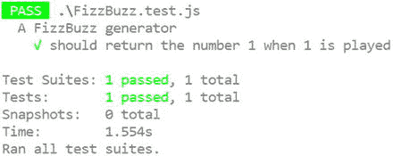
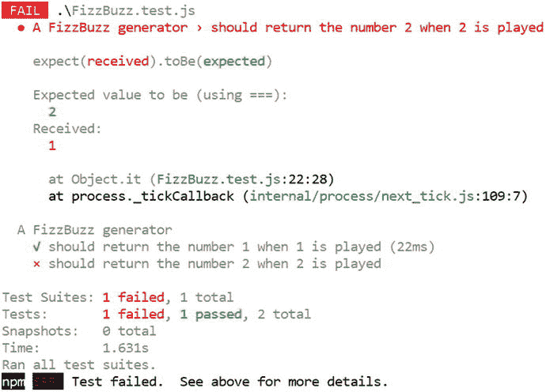
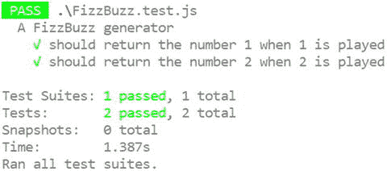
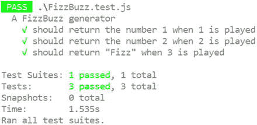
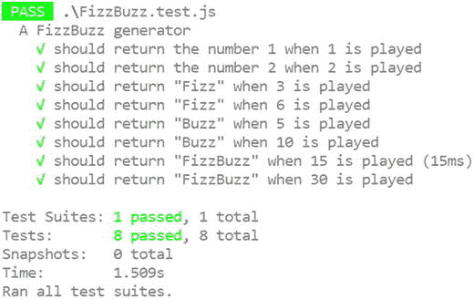

# 十、自动化测试

我对任何领域的专家的定义是一个对真正发生的事情有足够了解的人。—P. J .普洛伊格

对于任何编写大规模应用的人来说，自动化测试都是一个重要的话题。通过自动化程序测试，开发人员可以花更多的时间在新特性上，花更少的时间修复缺陷。自动化测试对于重构也是必不可少的。没有任何一种测试方法能够独自提供足够高的缺陷检测率。这意味着在软件发布之前，需要几种测试的组合来检测合理数量的问题。

这可能令人惊讶，但是经验证据表明，对于不同种类的测试，您将实现以下缺陷检测率，如 Steve McConnell 在 Code Complete (Microsoft Press，2004)中所记录的:

*   单元测试可以检测出高达 50%的缺陷。
*   集成测试可以检测高达 40%的缺陷。
*   回归测试可以检测多达 30%的缺陷。

这些数字表明，随着测试在软件开发生命周期的后期进行，更多的缺陷会漏网。众所周知，缺陷越晚被发现，成本越高。记住这一点，也许测试优先编程提供了减少 bug 的最有效的方法之一(还有结对编程，因为协作工作方法已经被发现比任何类型的测试检测到更多的缺陷)。测试驱动设计(TDD)的支持者也会很快指出，测试是一种额外的东西，而不是 TDD 的主要目的，TDD 是一种帮助设计内聚的代码单元的工具。他们可能是对的，但是测试也很好！

本章的目的不是让你转向测试驱动的设计。无论您是选择在编码前编写测试，还是在编写完程序的一部分后编写测试，或者希望自动化测试而不是手动执行测试，本章中的信息都是有用的。

Note

缩写词 TDD 最初是为测试驱动开发创造的，但是对测试驱动设计的修改描述向这种实践在帮助形成程序设计中所扮演的角色致敬。

## 框架选择

有许多用 JavaScript 编写的高质量测试框架可以用来测试你的程序。这里列出了三个最流行的，但是还有很多没有列出来，你甚至不需要使用框架，因为测试也可以在普通的类型脚本代码中进行。

*   茉莉
*   摩卡
*   玩笑

本章中的例子是使用 Jest 编写的，Jest 是一个易于设置的测试框架，由于它与 React 框架的紧密联系，已经获得了一些关注。

示例中显示的代码涵盖了 FizzBuzz 编码形的前几个步骤。编码形是一种实践方法，涉及解决一个简单的问题，逐渐适应挑战你的设计。附录 4 解释了编码表。FizzBuzz 形是基于一种由一系列计数规则组成的儿童游戏。当你表演形时，你的目标是通过游戏中的下一个规则；避免提前思考的诱惑。随着您编写更多的代码，设计将会浮现出来，您可以重构您的程序(安全地知道，如果您的测试通过，您不会意外地改变行为)。

## 开玩笑的测试

Jest 是为了补充 React 框架而编写的，但它可以用来测试任何类型脚本或 JavaScript 程序。运行 Jest 最常见的方式是通过 Node。语法很简单，容易学习，过去用过 Jasmine 的人都很熟悉。

### 安装 Jest

将 Jest 添加到项目中的最简单方法是从 NPM 获取包和类型定义。您可以通过将这些包添加到您的开发依赖项中来做到这一点，如清单 10-1 所示。您还会注意到，我们使用 package.json 文件来告诉 Node 哪个框架将处理我们的测试运行。

```js
{
  "name": "fizzbuzz",
  "version": "1.0.0",
  "devDependencies": {

    "@types/jest": "²¹.1.0",

    "jest": "²¹.1.0"

  },

  "scripts": {

    "test": "jest"

  }

}
Listing 10-1.Package dependencies

```

一旦下载了这些包，就可以开始编写代码了。

### 第一个规范

将被测试的 FizzBuzz 类的一个简单实现如清单 10-2 所示。这个类的目的是在 FizzBuzz 游戏中给出一个数字时提供一个正确的答案。完整的实现将通过返回所玩的数字或者用诸如“Fizz”、“Buzz”或“FizzBuzz”之类的游戏词来替换该数字来做出响应，这取决于该数字是能被 3、5 还是 3 和 5 整除

Note

FizzBuzz 游戏通常是集体玩的。每个人依次从 1 开始说出下一个数字。如果这个数能被三整除，玩家应该说“嘶嘶”而不是这个数。如果这个数字能被 5 整除，玩家应该说“嗡嗡”，如果这个数字能被 3 和 5 整除，玩家应该说“嘶嘶嗡嗡”

规范被用来驱动编程任务，而不是一次实现所有这些逻辑。因此，该类在实现任何超出初始实现的行为之前等待 Jest 规范，该行为总是返回数字 1。

```js
export class FizzBuzz {
    generate(input: number) {
        return 1;
    }
}
Listing 10-2.FizzBuzz code in FizzBuzz.ts

```

清单 10-3 中显示了与此行为匹配的 Jest 测试。这个测试代表了你第一次向某人解释 FizzBuzz 的规则时，你和他对话中的第一句话。例如，“播放数字 1 时，您应该说‘1’。”

```js
import { FizzBuzz } from './FizzBuzz';

describe('A FizzBuzz generator', () => {
    it('should return the number 1 when 1 is played', () => {
        const fizzBuzz = new FizzBuzz();

        const result = fizzBuzz.generate(1);

        expect(result).toBe(1);
    });
});

Listing 10-3.Jest test in FizzBuzz.test.ts

```

`describe`方法接受一套规范和一个将测试每一个规范的函数的名称。`it`方法代表一个单一的规范。套件和规范中使用的语言旨在让人们能够读懂。在这种情况下，组合套件描述和规格说明文本如下，

> When playing 1, the FizzBuzz generator should return the number 1.

通过仔细选择规范中的语言，您可以从您的测试套件中获得免费的文档。你甚至可以想出一个更好的描述方式，用更人性化的语言来描述这种行为。如果是这种情况，您应该更改描述以匹配您改进的措辞。在这些细节上花点心思是值得的，因为从长远来看，这会使规范更有价值。

通过实例化`FizzBuzz`类、播放数字 1 并检查结果是否为 1，传递到规范中的函数与该声明相匹配。

Jest 在名为*.test.js 的文件中查找测试，不包括 node_modules 文件夹中的文件，因此命名很重要。如果您忘记了这一点，那么当您运行 Jest 时将找不到任何测试。

要运行 Jest，只需在项目文件夹中运行清单 10-4 中所示的命令。

```js
npm test
Listing 10-4.Running Jest

```

该命令的输出如图 10-1 所示。



图 10-1。

The Jest test result

现在你已经做好了一切准备，可以开始测试了。接下来，您将使用额外的测试来驱动 FizzBuzz 程序的实现。

### 推动实施

现在测试自动化已经就绪，可以使用新的规范来驱动实现了。清单 10-5 显示了在 FizzBuzz 游戏中玩数字 2 时预期行为的第二个规范。

```js
import { FizzBuzz } from './FizzBuzz';

describe('A FizzBuzz generator', () => {
    it('should return the number 1 when 1 is played', () => {
        const fizzBuzz = new FizzBuzz();

        const result = fizzBuzz.generate(1);

        expect(result).toBe(1);
    });

    it('should return the number 2 when 2 is played', () => {
        const fizzBuzz = new FizzBuzz();

        const result = fizzBuzz.generate(2);

        expect(result).toBe(2);
    });
});

Listing 10-5.Extending the specification

```

第二个规范将失败，因为 FizzBuzz 类被硬编码为无论播放哪个值都返回“1”。运行测试的结果如图 10-2 所示。



图 10-2。

The failing test result

失败消息表明测试“`Expected value to be: 2, Received: 1,`”这意味着 Jest 没有通过测试，因为返回了“1”，而预期的是“2”。

为了通过测试，必须更新`FizzBuzz`类，如清单 10-6 所示。返回输入的任何数字都将通过两个现有规范。虽然您可能知道您将很快添加更多的规范，而这些规范将不会包含在这个实现中，但是在编写代码之前等待一个失败的测试可以确保每个变体的测试都已编写完成，并且在您编写导致它们通过的代码之前失败。知道如果行为不正确，测试将会失败，这将给你以后重构程序的信心。

```js
export class FizzBuzz {
    generate(input: number) {
        return input;
    }
}
Listing 10-6.Updated FizzBuzz class

```

当您在此更改后重新运行规范时，所有规范都将通过。结果如图 10-3 所示。



图 10-3。

The passing test suite

清单 10-7 展示了驱动`FizzBuzz`类实现的下一个规范。这个规范要求在播放数字三的时候，要用数字三代替“嘶嘶”这个词。

```js
it('should return "Fizz" when 3 is played', () => {
    const fizzBuzz = new FizzBuzz();

    const result = fizzBuzz.generate(3);

    expect(result).toBe('Fizz');
});

Listing 10-7.The Fizz specification

```

在首先检查规范失败后，您可以更新清单 10-8 中所示的实现。这个更新也是通过测试的最简单的代码。

```js
class FizzBuzz {
    generate(input: number) : string | number {
        if (input === 3) {
            return 'Fizz';
        }

        return input;
    }
}

Listing 10-8.The updated

FizzBuzz class

```

此阶段运行规范的结果如图 10-4 所示。阅读测试输出，感受一下测试如何用业务领域的语言描述程序。



图 10-4。

The passing test suite of three tests

### 重构

既然已经编写了大量的规范，并且实现了通过这些规范的代码，那么重构程序是值得的。重构代码包括改变程序的结构和设计，而不改变行为。知道你真的在重构(而不是无意中改变程序的实际功能)的最简单的方法是进行自动化测试，突出任何偶然的改变。

同样值得强调的是，你的测试代码应该和你的产品代码一样好写和可维护，但是不那么抽象。出于这个原因，清单 10-9 展示了重构后的规范，其中 FizzBuzz 类的重复实例化被移到了一个`beforeEach`方法中，Jest 将在每个规范之前自动运行。

```js
import { FizzBuzz } from './FizzBuzz';

describe('A FizzBuzz generator', () => {
    let fizzBuzz: FizzBuzz;

    beforeEach(() => {

        fizzBuzz = new FizzBuzz();

    });

    it('should return the number 1 when 1 is played', () => {
        const result = fizzBuzz.generate(1);

        expect(result).toBe(1);
    });

    it('should return the number 2 when 2 is played', () => {
        const result = fizzBuzz.generate(2);

        expect(result).toBe(2);
    });

    it('should return "Fizz" when 3 is played', () => {
        const result = fizzBuzz.generate(3);

        expect(result).toBe('Fizz');
    });
}); 

Listing 10-9.Refactored specifications

```

无论何时重构代码，都应该重新运行所有的测试，以确保没有改变程序的行为。如果您的测试套件失败了，您可以简单地撤销您的更改并重新开始，而不是调试程序。测试运行之间的每一次迭代都应该小到足以丢弃。

```js
export class FizzBuzz {
    generate(input: number): string | number {
        let output = '';

        if (input % 3 === 0) {
            output += 'Fizz';
        }

        if (input % 5 === 0) {
            output += 'Buzz';
        }

        return output === '' ? input : output;
    }
}

Listing 10-10.A working FizzBuzz class using conditional statements

```

清单 10-10 中的代码展示了`FizzBuzz`类的一个工作版本，它涵盖了返回一个数字的默认规则以及`Fizz`、`Buzz`和`FizzBuzz`的三种变体。在这一点上，尽管`generate`方法仍然很短，但是可以从代码中看到替代的设计。特别是，随着新规则的增加(可能被 7 整除的数字应该返回‘Bazz’)，您可能会决定引入和修改一个设计模式来捕获特定的规则。

Note

FizzBuzz 编码形式通常用一种叫做责任链的设计模式来解决，尽管还有其他可能的解决方案。

清单 10-11 中显示了为推动这一实现而创建的规范。现在总共有八种规格来涵盖四种可能的响应。

```js
import { FizzBuzz } from './FizzBuzz';

describe('A FizzBuzz generator', () => {
    let fizzBuzz: FizzBuzz;
    const FIZZ = 'Fizz';
    const BUZZ = 'Buzz'
    const FIZZ_BUZZ = 'FizzBuzz';

    beforeEach(() => {
        fizzBuzz = new FizzBuzz();
    });

    it('should return the number 1 when 1 is played', () => {
        const result = fizzBuzz.generate(1);

        expect(result).toBe(1);
    });

    it('should return the number 2 when 2 is played', () => {
        const result = fizzBuzz.generate(2);

        expect(result).toBe(2);
    });

    it('should return "Fizz" when 3 is played', () => {
        const result = fizzBuzz.generate(3);

        expect(result).toBe(FIZZ);
    });

    it('should return "Fizz" when 6 is played', () => {
        const result = fizzBuzz.generate(6);

        expect(result).toBe(FIZZ);
    });

    it('should return "Buzz" when 5 is played', () => {
        const result = fizzBuzz.generate(5);

        expect(result).toBe(BUZZ);
    });

    it('should return "Buzz" when 10 is played', () => {
        const result = fizzBuzz.generate(10);

        expect(result).toBe(BUZZ);
    });

    it('should return "FizzBuzz" when 15 is played', () => {
        const result = fizzBuzz.generate(15);

        expect(result).toBe(FIZZ_BUZZ);
    });

    it('should return "FizzBuzz" when 30 is played', () => {
        const result = fizzBuzz.generate(30);

        expect(result).toBe(FIZZ_BUZZ);
    });

});

Listing 10-11.The specifications for the working FizzBuzz class

```

除了测试 FizzBuzz 类，这些规范还为程序提供了准确的文档。输出如图 10-5 所示。您可能会注意到 Jest 已经标记了其中一个测试的执行时间(15 ms)，这有助于您识别任何降低测试套件速度的测试。



图 10-5。

The passing test suite of three tests

这些测试是可执行规范的一种形式——一种活的文档形式，也证明了你的程序执行了文档记录的行为。

### 隔离依赖关系

有时你可能需要测试依赖于资源的部分代码，这使得你的测试变得脆弱。例如，它可能依赖于第三方 API 或处于特定状态的数据库。如果您需要在不依赖这些依赖项的情况下测试代码，您可以在使用本节中描述的技术进行测试时隔离它们。

在许多编程语言中，每当您需要提供一个测试 double 时，使用一个模仿框架已经变得很自然。然而，在 TypeScript 中，创建测试 doubles 非常简单，您可能永远都不需要搜索框架。

清单 10-12 显示了依赖于`localStorage`的`FizzBuzz`类的修改版本，它在 TypeScript 中实现了`Storage`接口。`constructor`接收存储对象，`generate`函数使用它来获取在“嘶嘶”情况下显示的显示消息。

```js
class FizzBuzz {
    constructor(private storage: Storage) {

    }

    generate(input: number): string | number {
        if (input === 3) {
            return this.storage.getItem('FizzText');

        }

        return input;
    }
}

Listing 10-12.A FizzBuzz class that relies on storage

```

您可以用清单 10-13 中所示的简单对象来满足这种依赖性。`storage`变量与`Storage`接口的匹配刚好足以通过测试。与其他编程语言不同，这种解决测试 double 问题的方法非常简单；你几乎不需要考虑用一个框架来解决问题。

```js
describe('A FizzBuzz generator', () => {
    it('should return "FakeFizz" when 3 is played', () => {
        // Create a test double for storage
        var storage: any = {

            getItem: () => 'FakeFizz'

        };

        const fizzBuzz = new FizzBuzz(storage);

        const result = fizzBuzz.generate(3);

        expect(result).toBe('FakeFizz');
    });
});

Listing 10-13.Using an object

```

总的来说，您应该坚持使用简单的对象作为测试替身，并且您的测试应该检查结果，而不是具体的实现细节。知道当你玩 3 时你得到“Fizz”是一个很强的行为测试，但是检查一个`storage`对象是否被调用来提供一个匹配特定键的值根本不是一个好的测试，因为当你改变实现细节时这将失败。

## 摘要

希望自动化测试的价值已经在这一章得到了展示。然而，如果你仍然持怀疑态度，你可以尝试在有测试和没有测试的情况下运行编码卡塔，看看它是否有助于你下定决心。您可以在附录 4 中了解更多信息。

尽管本章所有的例子都使用了 Jest，但是使用 Mocha 或 Jasmine 也同样简单，并且两者都提供了同样简单的语法。无论您使用什么来运行测试，都要努力使输出看起来像人类可读的文档，因此如果有人需要文档，您可以简单地提供您的测试套件的输出。

我已经为 TypeSpec 的 TypeScript 创建了一个基于 Gherkin 语言的行为驱动框架的实现，您可以使用它来结合业务规范和测试自动化，但是我在本章中使用 Jest，因为我更希望程序员从更常用的工具开始。您可以在 GitHub 上找到更多关于 TypeSpec 的信息:

[`https://github.com/Steve-Fenton/TypeSpec`](https://github.com/Steve-Fenton/TypeSpec)

## 要点

*   自动化单元测试比集成测试或回归测试更有效(尽管一个好的策略是使用多种测试来获得最佳的缺陷检测率)。
*   有很多 JavaScript 和 TypeScript 的框架，但是如果你想缩小范围，可以看看 Jest、Jasmine 和 Mocha。
*   您可以使用 Jest 编写充当测试和文档的规范。
*   用规范驱动实现可以确保如果行为不正确，测试会失败。在实现之后编写测试并不保证测试会失败。
*   您应该重构生产代码和测试代码。
*   您可以使用简单的对象来隔离您的依赖项，这比那些可能将您的测试与实现捆绑得太紧的智能工具更好。