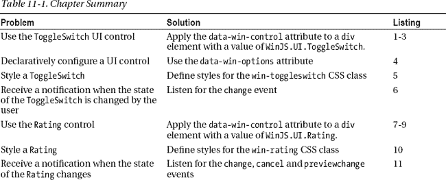
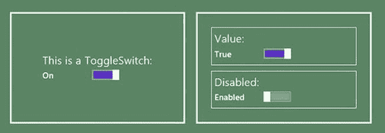
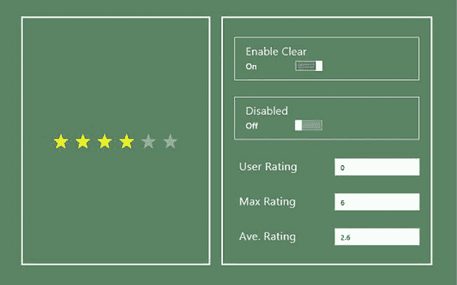
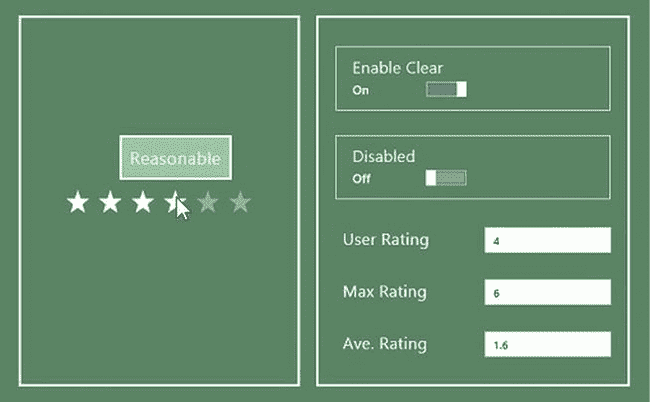
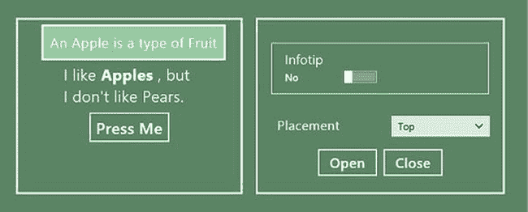

# 十一、使用`ToggleSwitch`、`Rating`和`Tooltip`控件

在这一章，我开始详细描述 WinJS UI 控件，使用我在第十章中创建的框架应用。这些 UI 控件是创建与更广泛的 Windows 视觉主题一致的应用的重要构件，值得详细研究。

WinJS UI 控件的机制类似于您可能使用过的其他 JavaScript UI 工具包，如 jQuery UI。将控件应用于元素，并应用其他元素、样式和事件处理程序来创建丰富的视觉效果。

您可以轻松地在 Windows 应用中使用 jQuery UI 或类似的库，但最终会得到奇怪的结果，并且会错过一些控件与其他 WinJS 功能(如数据绑定)的紧密集成。在本章和接下来的章节中，我将依次描述每个控件。我告诉你如何应用和配置控件，何时应该使用控件，以及如何观察用户与控件的交互。

在这一章中，我从三个相对简单的控件开始:`ToggleSwitch`、`Rating`和`Tooltip`控件。这些是最基本的控件，虽然它们很有用，但是它们并不有趣，或者与您可能遇到的其他 JavaScript UI 工具包没有什么不同。表 11-1 对本章进行了总结。

### 使用切换开关控制

我将从`WinJS.UI.ToggleSwitch`控件开始。这是一个很好的开始控件，因为它很简单，而且因为我在第十章中创建的框架应用中使用了这个控件来演示本章和后续章节中其他控件的功能。

顾名思义，`ToggleSwitch`控件让用户在`on`和`off`状态之间切换。鼠标用户可以点击`ToggleSwitch`的空白部分来改变状态，触摸用户可以向左或向右滑动开关。`ToggleSwitch`控件在从一种状态转换到另一种状态时会执行一个简短的动画。你可以在图 11-1 中看到`ToggleSwitch`是如何出现的。稍后，我将向您展示我为创建这个布局而添加到示例框架中的内容。

***图 11-1。**示例应用中的 ToggleSwitch 控件*

#### 何时使用拨动开关控制

当你需要向用户展示一个二元决策时，你应该使用`ToggleSwitch`控件。改变值的滑动动作非常友好，比普通的 HTML 复选框或带有`Yes`和`No`选项的`select`元素更容易使用。我经常使用这个控件让用户配置应用设置(我在第二十章中描述过)。

 **提示**如果你在一列中显示几个`ToggleSwitch`控件，确保所有的`true` / `on`值都在同一侧——如果一些开关需要放在右边来启用某个功能，而其他开关放在左边，只会让用户感到困惑。

#### 演示 ToggleSwitch 控件

为了演示`ToggleSwitch`控件，我在第十章的`UIControls`项目的`pages`文件夹中添加了一个新的 HTML 文件。您可以在清单 11-1 的中看到这个名为`ToggleSwitch.html`的文件的内容。

***清单 11-1** 。/pages/ToggleSwitch.html 文件的内容*

`<!DOCTYPE html>
<html>
<head>
    <title></title>
    
</head>
<body>
    

        

**            

**
        

        

        

    

</body>
</html>`

您可以从清单中看到，我使用了键`toggleSwitch`来定位`controls.js`文件中的定义对象。您可以在清单 11-2 中看到那些定义对象。

***清单 11-2** 。ToggleSwitch 控件的定义对象*

`(function () {

WinJS.Namespace.define("App.Controls", {

    toggleSwitch: [
        { type: "toggle", id: "checked", title: "Value", value: true },
        { type: "toggle", id: "disabled", title: "Disabled", value: false }],
    });

})();`

最后，我通过对清单 11-3 中的文件进行添加，将命令添加到了导航栏中。

***清单 11-3** 。将 ToggleSwitch.html 文件添加到导航栏*

`...
var navBarCommands = [
        //{ name: "AppTest", icon: "target" },
**          { name: "ToggleSwitch", icon: "\u0031" },**
];
...`

#### 应用和配置 ToggleSwitch 控件

通过将`data-win-control`属性设置为`WinJS.UI.ToggleSwitch`，将`ToggleSwitch`控件应用于`div`元素。正如我在第十章中所解释的，当底层 HTML 元素被`WinJS.UI.processAll`方法处理时，它被赋予一个`winControl`属性(要么是因为你已经显式调用了该方法，要么是因为内容已经使用`WinJS.UI.Pages.render`方法加载，该方法为你调用了`processAll`)。

属性返回由属性指定的控件对象，这允许你在代码中调用方法和设置控件定义的属性。为了方便起见，您可以使用`data-win-options`属性在 HTML 中以声明方式设置属性值，指定一个包含名称/值对的 JSON 片段。

对于左边的`ToggleSwitch`，我已经为`title`属性设置了一个值，该值用于显示在控件上方的文本，如清单 11-4 所示。

***清单 11-4** 。使用 data-win-options 属性设置标题属性*

`...

    

...`

表 11-2 描述了由`ToggleSwitch`定义的配置属性，所有这些属性都可以使用`data-win-options`属性或在您的 JavaScript 代码中设置。

在演示`ToggleSwitch`控件的代码中，我创建了改变`checked`和`disabled`属性的配置控件。通过查看`templates.js`文件中的`createtoggle`方法，你可以看到我是如何使用 JavaScript 来设置其他属性的，我在第十章的最后给你展示了这个文件。我使用来自定义对象的值来设置`labelOn`、`labelOff`和`title`属性。

#### 样式化 ToggleSwitch 控件

WinJS UI 控件可以使用一组 CSS 类来设置样式。这是使用 WinJS 控件的好处之一，也是我还没有感觉到需要在我的任何 Windows 应用项目中使用 jQuery UI 的原因之一(这说明了一些问题，因为我*喜欢* jQuery 和 jQuery UI)。我已经在表 11-3 中列出并描述了`ToggleSwitch`控件支持的一组类。

因为我使用了`ToggleSwitch`控件来帮助演示许多其他 WinJS UI 控件，所以我在`/css/default.css`文件中添加了一些 CSS 样式，这些样式使用了表 11-3 中的类。你可以在清单 11-5 中看到这些风格。

 **小心**不要忘乎所以的设计 UI 控件。你想让你的应用和一般的 Windows 外观保持一致。为此，您应该只设置控件的样式，以便它们易于阅读，并且与布局中使用的配色方案相对应。

***清单 11-5** 。将样式应用于 ToggleSwitch 控件*

`...
.controlPanel **.win-toggleswitch** {
    width: 90%;
    margin: 15px;
    padding-left: 20px;
}

**.win-toggleswitch .win-title** {
    color: white;
    font-size: 20px;
}
...`

每当你覆盖一个`ToggleSwitch`控件的样式时，你必须使用`win-toggleswitch`类，甚至当你覆盖一个子样式时，比如`win-title`。如果你不这样做，那么由 Visual Studio 项目中的默认 CSS 定义的样式(在`ui-light.css`和`ui-dark.css`文件中，我在第二章中描述过)将具有更大的特异性，而你的自定义值将不会有任何影响。

对于`default.css`文件中的样式，我将一个`border`和一些`margin`和`padding`应用于我用作配置控件的`ToggleSwitch`控件，并更改了所有`ToggleSwitch`控件标题的文本大小和颜色。

 **提示**很难弄清楚定制风格到底有什么效果。通过在调试器中运行您的应用，切换到 Visual Studio `DOM Explorer`窗口，单击`Select Element`按钮并单击布局中的控件，您可以看到 WinJS UI 控件的结构。您将能够看到围绕应用了`data-win-control`属性的元素创建的 HTML 元素，并看到底层组件的样式。

#### 处理 ToggleSwitch 控件事件

当用户更改开关的位置时，`ToggleSwitch`控件发出`change`事件(当以编程方式更改属性值时，不会发出该事件)。我将依次列出每个控件的事件，以便在您需要和翻阅本章时更容易找到这些信息。表 11-4 描述了`change`事件，尽管只有一个而且是非常基本的事件。

我在`ToggleSwitch.html`文件中添加了一个处理程序，它通过更新右侧面板中一个配置控件的`checked`值来响应`change`事件，使得这些控件之间的关系是双向的。您可以在清单 11-6 的中看到事件处理程序。

***清单 11-6** 。添加 ToggleSwitch 更改事件的处理程序*

`<!DOCTYPE html>
<html>
<head>
    <title></title>
    
</head>
<body>
    

        

            

        

        

        

    

</body>
</html>`

我使用`then`方法确保配置控件已经由`Templates.createControls`方法创建，并使用`addEventListener`方法设置处理程序。注意，我直接在应用了`ToggleSwitch`控件的`div`元素上设置了事件监听器，但是我通过读取`winControl.checked`值来获取控件的状态。这是所有 WinJS UI 控件的模式——事件是从底层 HTML 元素发出的，但是控件的状态是通过`winControl`属性访问的。

要测试事件处理程序，请启动示例应用，单击导航栏上的`ToggleSwitch`按钮，并切换左侧布局面板中的`ToggleSwitch`控件。您将看到右侧面板中的`Value`配置控件的状态同步变化。这种关系反过来也一样，但那是因为我在`Templates.createtoggle`方法中为`change`事件设置了一个监听器，我在第十章中描述过。

 **提示**当`ToggleSwitch`被禁用时，用户不能移动开关位置，但如果通过编程修改`winControl.checked`属性，开关将正确反映变化。

### 使用评级控制

`WinJS.UI.Rating`控件允许用户通过提供星级来表达意见。在图 11-2 中，你可以看到`Rating`控件是如何出现在左侧面板中的。用户可以通过点击或触摸星星来指定评级，并通过在星星阵列上上下拖动鼠标或手指来更改评级。稍后，我将向您展示我在示例项目中添加的内容，以创建这个布局。

***图 11-2。**一个 WinJS。UI .评级控制*

#### 何时使用评级控制

用星星的数量来表达观点或评价的想法是如此根深蒂固，以至于你不应该将这个控件用于任何其他目的。如果您想从用户那里获得一个数字，那么使用一个常规的`input`元素，将`type`属性设置为`number`。

如果你*确实*想要用户的意见，那么`Rating`控件是理想的。尝试使用常见的星级数(3、5 和 10 是常用的)，在整个应用中坚持这个数字，并确保你利用这个机会表达积极和消极的观点。每当使用`Rating`控制时，确保每个星级具有相同的含义。

#### 演示评级控制

为了演示`Rating`控件，我在`UIControls`项目的`pages`文件夹中添加了一个新的 HTML 文件。您可以在清单 11-7 中看到这个名为`Rating.html`的文件的内容。

***清单 11-7。**/pages/rating . html 文件的内容*

`<!DOCTYPE html>
<html>
<head>
    <title></title>
    
    
</head>
<body>
    

        

**            

**
        
` `        

    

</body>
</html>`

这个文件包含了一些特定于`Rating`控件的 CSS 样式(我会简单描述一下)。清单 11-8 显示了我添加到`controls.js`文件中的定义对象，以在图 11-2 所示的右侧面板中创建配置元素。

***清单 11-8。**评级控件的定义对象*

`...
**rating**: [
    { type: "toggle", id: "enableClear", title: "Enable Clear", value: true },
    { type: "toggle", id: "disabled", title: "Disabled", value: false },
    { type: "input", id: "userRating", title: "User Rating", value: 0 },
    { type: "input", id: "maxRating", title: "Max Rating", value: 6 },
    { type: "input", id: "averageRating", title: "Ave. Rating", value: 2.6 }],
...`

为了让用户能够导航到`Rating.html`页面，我对`templates.js`文件进行了添加，如清单 11-9 所示。

***清单 11-9** 。将 Rating.html 文件添加到导航栏*

`...
var navBarCommands = [
    //{ name: "AppTest", icon: "target" },
    { name: "ToggleSwitch", icon: "\u0031" },
**    { name: "Rating", icon: "\u0032" },**
];
...`

#### 应用和配置评级控制

通过将`data-win-control`属性设置为`WinJS.UI.Rating`，将`Rating`控件应用于`div`元素。我用配置控件管理的属性在表 11-5 中描述，并可通过`winControl`属性访问。

我为`Rating`控件定义的配置控件允许您尝试更改除了`tooltipStrings`之外的所有属性，我在`Rating.html`页面的`script`元素中设置了`tooltipStrings`(我将在下面解释)。

##### 管理评级

在`averageRating`、`maxRating`和`userRating`属性之间有一个特定的交互，你需要在其中工作以从`Rating`控件获得正确的效果。

`maxRating`属性指定了`Rating`显示的星的数量，并有效地设置了可以使用该控件选择的评级的上限。显示的星星数是一个整数。

属性可以用来显示其他地方的评级。平均值的常见用途是显示其他用户的评级或当前用户在以前提供的评级。您可以将`averageRating`值指定为实数(如`4.2`)，部分星星将会显示出来。`userRating`属性表示用户选择的值。这是另一个整数值。

只有当`userRating`属性为零时，才会显示`averageRating`值。一旦用户提供了一个等级(或者在外部设置了`userRating`属性)，就会隐藏`averageRating`值并显示`userRating`值。我在`Rating`控件的例子中添加了控件，让你指定这些属性的值，你可以在图 11-3 中看到从`averageRating`到`userRating`值的转换。

***图 11-3。**用用户评级值替换平均评级*

如果`enableClear`属性是`true`，那么用户可以拖动或滑动到`Rating`控件的左边，清除`userRating`值。发生这种情况时，再次显示`averageRating`值。如果`enableClear`属性为`false`，则控制不能被清除。请谨慎使用此设置，因为它会诱使用户做出不可逆的评级。如果您确实将`enableClear`设置为`false`，那么您应该提供一个附近且明显的控件，将`userRating`属性设置回零，并让用户重新开始。一般来说，你应该让用户放弃他们提供的任何值——当这不可能的时候，用户会感到困惑和烦恼。

##### 设置工具提示

如果用户在一颗星星上悬停或滑动，`Rating`控件将显示一个工具提示。默认情况下，这些是数字，反映评级代表的星级数。如果您将`tooltipStrings`设置为一个字符串数组，那么数组值将被用作工具提示内容。我在`pages/Rating.html`文件的脚本元素中显式设置了`tooltipStrings`属性。为了方便起见，下面是我使用的值:

`...
rating.winControl.tooltipStrings = ["Terrible", "Pretty Bad", "Not So Good",
    "Reasonable", "Good", "Excellent"];
...`

你可以在图 11-4 中看到一个工具提示值是如何呈现给用户的。

***图 11-4。**显示工具提示的评级控件*

 **提示**如果你设置了一个比`maxRating`属性的值多一项的数组，那么当用户向左拖动或滑动以清除评级时(假设`enableClear`属性为`true`)，将显示最后一个字符串值。

#### 设置评级控件的样式

`Rating`控件支持多种样式，您可以覆盖这些样式来定制控件的外观，每种样式都在表 11-6 中进行了描述。

这些类必须组合成非常特殊的排列来设计一个`Rating`控件。清单 11-10 显示了来自`Rating.html`文件中`style`元素的 CSS，我用它来改变示例中`Rating`控件的默认样式。

***清单 11-10** 。Rating.htmlfile 文件中的 CSS*

`...
.win-rating .win-star.win-user.win-full {
    color: yellow;
}
.win-rating .win-star.win-average.win-full {
    color:  #000;
}
.win-rating .win-star.win-average.win-full,
.win-rating .win-star.win-tentative.win-full {
    color:  white;
}  
...`

应用表格中的样式时必须遵循的顺序是:

`.win-rating **.win-star.win-[rating value].win-[star state]**`

我用粗体标记的类应用于同一个元素，这意味着不用空格来分隔它们。如果您想要为`userRating`值设置显示的完整星号的样式，您可以覆盖这个序列:

`.win-rating .win-star.win-**user**.win-**full**`

您可以覆盖多组星形的样式，但需要小心。最安全的方法是列出多个完整的类组合，如下所示:

`...
.win-rating .win-star.win-average.win-full,
.win-rating .win-star.win-user.win-full,
.win-rating .win-star.win-tentative.win-full {
    color:  white;
}
...`

您可以省略一些类来用选择器撒一个更大的网，但是您仍然必须确保选择器比微软定义的那些更具体，后者使用完整的类序列。最直接的方法是使用已经应用了`Rating`控件的元素的`id`，就像这样:

`...
#rating .win-star.win-full {
    color:  green;
}
...`

#### 处理评级控制事件

`Rating`控件支持三个事件，我已经在表 11-7 中描述过。

清单 11-11 展示了我如何在`/pages/Ratings.html`文件中添加脚本元素来处理`change`事件。我使用这个事件来更新布局右侧面板中的配置控件，这会影响到`userRating`属性。

***清单 11-11** 。处理评级变更事件*

`...

...`

我对由`Template.createControls`方法返回的`Promise`对象使用了`then`方法，以确保在创建配置元素并将其添加到应用布局之前，我不会创建事件处理程序。

### 使用工具提示控件

当鼠标或手指停留在一个元素上或当键盘获得焦点时,`Tooltip`控件弹出一个包含有用信息的窗口。这是一个简单的控件，但是在如何配置和应用一个`Tooltip`方面仍然有很大的灵活性。你可以在图 11-5 的中看到一个工具提示的例子。HTML 中的其他控件用于配置`Tooltip`的不同方面，我将在下面的章节中解释。

***图 11-5。**一个工具提示控件*

#### 何时使用工具提示控件

当你想为用户提供指导或一些补充信息时，可以使用`Tooltip`控件，也许是为了帮助他们在选择应用中的特定选项时做出明智的选择，或者只是关于他们正在查看的内容的一些附加信息。

 **提示**`Tooltip`是一个*瞬态*控件，会自动消失(我在下面解释发生这种情况的情况)。您不能对任何类型的交互式内容使用瞬变控件，如`button`或`Rating`控件。为此，您需要使用`Flyout`控件，我在第七章的中介绍了它，并在第十二章的中再次详细描述了它。

#### 演示工具提示控件

您可以看到我添加到`controls.js`文件中的定义对象，以演示清单 11-12 中的控件。将使用`tooltip`键访问这些对象。

***清单 11-12** 。工具提示控件的定义对象*

`...
tooltip: [
    { type: "toggle", id: "infotip", title: "Infotip", value: false,
        labelOn: "Yes", labelOff: "No" },
    { type: "select", id: "placement", title: "Placement",
        values: ["top", "bottom", "left", "right"],
        labels: ["Top", "Bottom", "Left", "Right"]},` `    { type: "buttons", labels: ["Open", "Close"] }],
...`

我在添加到`UIControls`项目的`pages`文件夹中的新 HTML 文件中使用了定义对象。您可以在清单 11-13 的中看到这个名为`Tooltip.html`的文件的内容。

***清单 11-13** 。/pages/Tooltip.html 文件的内容*

`<!DOCTYPE html>
<html>
<head>
    
    <title></title>
    
</head>
<body>
    

        

            
I like
                
                    <b>Apples</b>
                , but I don't like Pears.

            

                <button>Press Me</button>
            

        

        

    

    

        

            
            Apples grow on small, deciduous trees.` `                Apples have been grown for thousands of years in Asia
                and Europe, and were brought to North America by European
                colonists.
            
        

    

</body>
</html>`

该文件遵循与前面示例相同的基本模式。该文件比前面的例子要长，因为它包含了一些简单的内容，我使用本节中演示的`Tooltip`控件来显示这些内容。

另一个区别是，我在应用布局的右侧面板中为我创建的`button`元素添加了一个`click`事件的处理程序。这个处理程序调用由与被点击的`button`内容相对应的`winControl`属性定义的方法，因此点击`Open`按钮调用`winControl.open`方法，点击`Close`按钮调用`winControl.close`方法。我将很快解释这两种方法。

演示该控件的最后一步是将`Tooltip.html`文件添加到导航栏，我通过添加到清单 11-14 中所示的`templates.js`文件来完成。

***清单 11-14** 。将 Tooltip.html 文件添加到导航栏*

`...
var navBarCommands = [
    //{ name: "AppTest", icon: "target" },
    { name: "ToggleSwitch", icon: "\u0031" },
    { name: "Rating", icon: "\u0032" },
**    { name: "Tooltip", icon: "\u0033" },**
];
...`

 **注意**`Tooltip.html`文件中的标记包含一个`img`元素，其`src`属性引用了`images`文件夹中一个名为`apple.png`的文件。你可以获得我作为本书源代码下载的一部分使用的图像，或者，如果你喜欢，只需重命名你必须交给`apple.png`的图像，并将其复制到 Visual Studio 项目的`images`文件夹中。

#### 应用和配置工具提示控件

基本前提是将与`Tooltip`相关的 HTML 元素包装在一个已经应用了`WinJS.UI.Tooltip`控件的`div`元素中，如清单 11-15 所示。

***清单 11-15** 。将工具提示控件应用于块元素*

`...
**
**
        <button>Press Me</button>
**
**
...`

在这个取自`/pages/Tooltip.html`文件的片段中，我将一个`button`元素包装在一个已经应用了`Tooltip`的`div`元素中。当用户将鼠标指针悬停或者将手指放在`button`元素上时，将显示由`contentElement`属性指定的元素的内容。在示例中，我已经将`contentElement`属性设置为`tooltipContent`，它引用了清单 11-16 中的元素。

***清单 11-16** 。用于工具提示控件的内容*

`...

    

        
        Apples grow on small, deciduous trees.
            Apples have been grown for thousands of years in Asia
            and Europe, and were brought to North America by European
            colonists.
        
    

...`

这个元素的内容是由`img`和`span`元素组成的标准 HTML 标记。请注意，我已经将内容元素放在了一个`div`元素中，该元素的 CSS `display`属性被设置为`none`——这防止用户看到内容，直到它被`Tooltip`控件显示出来。

 **提示**这是我使用了在上一节中添加到项目中 img/apple.png`文件的地方。你可以在图 11-6 中看到这个图像。

当鼠标指针悬停在图 11-6 中的`Press Me`按钮上时，可以看到结果。

***图 11-6。**设置工具提示控件的内容*

`contentElement`是可以在`Tooltip`控件上设置的属性之一，可以通过`data-win-options`属性设置，也可以通过`winControl`属性以编程方式设置。你可以在表 11-8 中看到完整的属性集，我将在接下来的章节中演示它们。

##### 创建内联工具提示&使用 innerHTML 属性

您还可以将`Tooltip`控件应用到`span`元素，如果您使用的是内嵌显示的内容，并且`div`元素会扰乱布局，这将非常有用。我在`Tooltip.html`文件中定义的另一个工具提示已经以这种方式应用，如清单 11-17 所示。

***清单 11-17** 。将工具提示控件应用于 span 元素*

`...

I like
    
           <b>Apples</b>
    , but I don't like Pears.

...`

`Tooltip`将应用的元素仍然围绕着它所涉及的内容，在这个例子中是单词 apple。当鼠标指针悬停在文本块中的单词 Apples 上时，`Tooltip`将显示给用户。

作为使用`contentElement`属性的替代方法，我已经使用`innerHTML`属性设置了`Tooltip`控件的内容。这个属性让你将`Tooltip`的内容设置为一个字符串值，这是我在图 11-5 中展示的工具提示。

##### 设置显示持续时间

用户可以通过多种方式触发`Tooltip`。如果用户触摸或按住元素上的鼠标按钮，那么将显示`Tooltip`弹出窗口，直到手指从显示屏上移开或释放鼠标按钮。

如果用户通过键盘操作(比如在元素间跳转)或者将鼠标悬停在目标控件上来触发`Tooltip`，那么弹出窗口会显示 5 秒钟，之后会自动关闭。

通过将`infotip`属性设置为`true`，可以将这个时间延长到 15 秒。该值旨在用于包含大量信息且用户不太可能在较短时间内解析的`Tooltip`。

该示例右侧面板中的`ToggleSwitch`为左侧面板中的内嵌`Tooltip`设置了`infotip`属性。通过使用这个开关，您可以看到不同时间跨度的效果。

 **提示**如果你需要让你所有的`Tooltip`显示 15 秒，你可能要重新考虑你向用户呈现内容的方式。对于引导用户浏览你的应用的小信息片段来说，是完美的。考虑使用一个`Flyout`作为通用弹出窗口，正如我在第十二章中所描述的。

##### 设置工具提示位置

`placement`属性控制`Tooltip`弹出窗口相对于目标元素出现的位置。默认值是`top`，意味着弹出窗口显示在元素的稍上方，但是您也可以指定`left`、`right`和`bottom`。示例中右侧面板中的`select`元素设置左侧面板中内联`Tooltip`的`placement`属性。你可以在图 11-7 中看到交替放置的效果。

***图 11-7。**左侧、底部和右侧工具提示位置*

你不必担心调整`placement`值来确保`Tooltip`弹出窗口适合屏幕。如果由`placement`属性指定的值意味着弹出窗口不合适，WinJS 将自动调整弹出窗口的位置。表 11-9 显示了当弹出窗口不能显示指定值时，对于`placement`属性的每个可能值将尝试的一系列回退布局。

 **提示**对于为左撇子用户配置的设备，回退序列中左右位置的顺序将会颠倒。

弹出窗口的确切位置是相对于鼠标或触摸事件的位置，并受到一个偏移量的影响，该偏移量取决于触发`Tooltip`的事件类型。键盘事件的偏移量是 15 像素(例如，当用户切换到目标元素时)，鼠标事件的偏移量是 20 像素，触摸事件的偏移量是 45 像素。较大的偏移量旨在允许用户阅读`Tooltip`内容，而不会被光标、手写笔或手指遮挡。

#### 以编程方式管理工具提示控件

通过使用`open`和`close`方法，你可以直接控制`Tooltip`何时显示和隐藏——尽管如果你使用这些方法，你应该暂停一会儿，考虑你使用`Tooltip`的方式是否与其他 Windows 应用一致。(如果你想要一个通用的弹出窗口，你应该使用一个`Flyout`，正如我在第十二章中描述的那样)。

为了快速参考，我在表 11-10 中描述了这些方法。这看起来可能是多余的，但是 WinJS UI 控件不使用一致的方法命名方案，当你希望能够快速发现`Tooltip`控件是否定义了`show`或`open`和`close`或`hide`时，就会出现这种情况。

`open`方法采用可选参数，用于模拟不同种类的触发事件，支持的值有`touch`、`mouseover`、`mousedown`和`keyboard`。如果不提供参数，则使用`default`值。每个值都有略微不同的效果，包括用于定位弹出窗口的偏移量(如前一节所述)、弹出窗口显示前的延迟以及弹出窗口关闭前的显示时间。

您需要小心，因为`touch`、`mousedown`和`default`参数不会自动关闭弹出窗口。在`touch`和`mousedown`模式下，这是因为弹出窗口会一直显示，直到手指从屏幕上移开或鼠标按钮松开。如果您对`open`菜单使用这些参数，那么您必须使用`close`方法显式关闭`Tooltip`弹出菜单。示例右侧面板中的`Open`和`Close`按钮调用了`open`和`close`方法(调用`open`方法时没有参数，因此直到使用`Close`按钮才会关闭弹出窗口)。

 **提示**我发现不带参数调用`open`方法在开发过程中非常有用，因为它让我看到了`Tooltip`的内容是如何显示的，而无需执行触发操作。

#### 设置工具提示控件的样式

`Tooltip`控件支持一个 CSS 类:`win-tooltip`。您可以使用该类作为设计显示内容样式的起点。没有其他类，因为在`Tooltip`中没有固定的元素结构。清单 11-18 显示了我在`/css/default.css`文件中为`Tooltip`控件定义的样式。

***清单 11-18** 。样式化工具提示控件*

`...
.win-tooltip {
    background-color: #8ED09C;
    color: white;
    border: medium solid white;
    font-size: 16pt;
}
...`

#### 处理工具提示事件

`Tooltip`控件支持我在表 11-11 中描述的四个事件。为了完整起见，我列出了这些事件，但是我还没有发现这些事件在实际项目中的用途，因为`Tooltips`旨在呈现简单、自包含的内容。

就像`Tooltip`控件的其他一些特性一样，如果你需要这些事件，我建议你停下来考虑一下你的应用设计。这可能是因为你有非常特殊的需求，但更有可能的是你要强迫`Tooltip`控件做一些打破 Windows 应用交互规则的事情。考虑一下我在第十二章的中描述的`Flyout`控制是否是一个更合适的选择。

### 总结

在这一章中，我已经向你介绍了三个最简单的 WinJS UI 控件——尽管，正如你所看到的，要在你的应用中获得正确的效果，还有很多细节需要考虑。在下一章，我将把注意力转向时间和日期选择器以及`Flyout`和`Menu`控件。