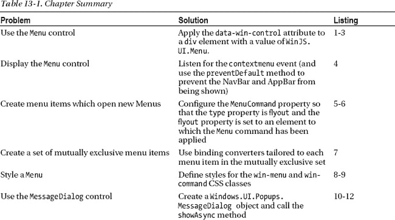
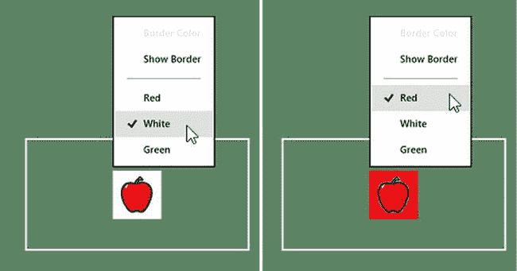
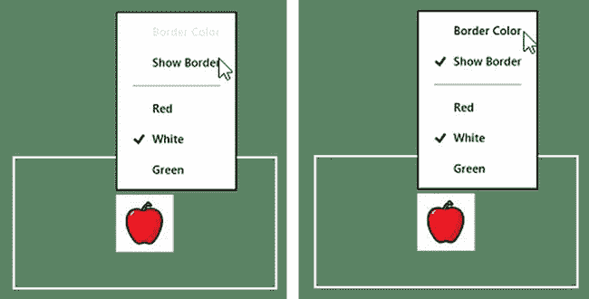
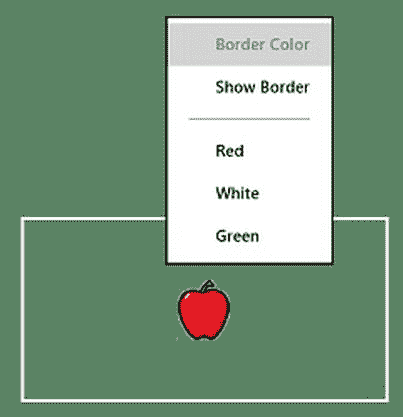
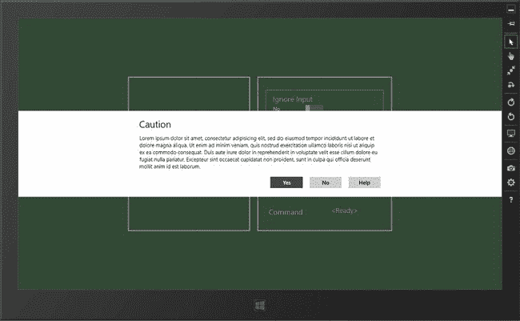
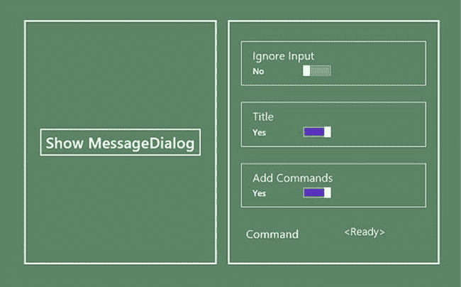
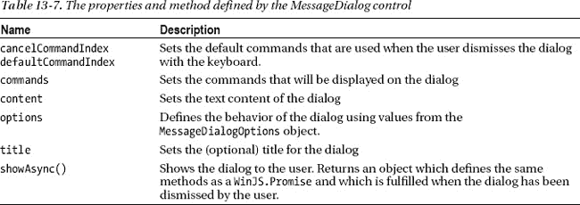
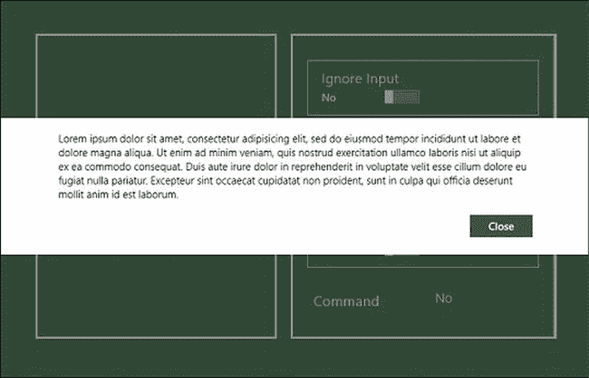
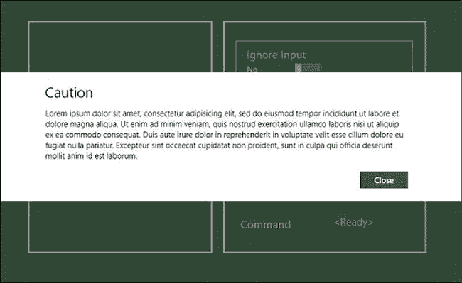

# 十三、使用菜单和对话框

在这一章中，我将向你展示如何创建两种弹出界面控件。第一个是`WinJS.UI.Menu`控件，用于创建上下文菜单，允许用户直接在应用布局中的元素上执行操作。`Menu`控件很灵活，有一些有用的特性，但是我发现用户激活上下文菜单的机制不太明显，这意味着使用这个控件时需要仔细考虑。

我在本章中描述的第二个控件与我在本书中描述的其他控件略有不同。`MessageDialog`控件是`Windows`名称空间的一部分，它没有我为 WinJS UI 控件描述的共同特征:例如，它不适用于 HTML 元素，也没有`winControl`属性。任何 Windows 应用开发语言都可以使用`MessageDialog`控件，这使得它的使用稍微有些不同。但是，它提供了一个用户交互，这是使用任何 WinJS 控件都无法获得的，这使得掌握它的努力是值得的。表 13-1 对本章进行了总结。

### 使用菜单控制

`Menu`控件提供弹出上下文菜单，该菜单被构造为向用户提供一个或多个由`MenuCommand`控件表示的命令。`MenuCommand`和`Menu`控件之间的关系类似于`AppBarCommand`和`AppBar`之间的关系，我在第七章的中描述过。

默认情况下不显示`Menu`控件，所以本例中左侧面板中的主要元素是一个图像。如果用鼠标右键单击或触摸并按住图像，将会触发`contextmenu`事件。我通过使`Menu`控件出现来处理这个事件，如图图 13-1 所示。

***图 13-1。**显示菜单控件*

#### 何时使用菜单控制

为用户提供命令的主要机制是使用 AppBar，我在第七章中描述过。`Menu`控件提供了一种回退机制，当用户想要操作的对象不适合 AppBar 模型时，可以使用这种机制。坦率地说，这是一个非常主观的决定，我在项目中遵循的规则是尽可能地支持应用栏，因为并非所有用户都意识到 Windows 应用中可以使用上下文菜单。

命令应该在你的应用中只出现一次，这意味着你不应该在一个`Menu`上重复应用栏支持的命令。微软建议在一个`Menu`上最多使用 5 个命令，尽管 Windows 目前没有强制限制。

#### 演示菜单控制

我在示例应用中添加了一个`pages/Menu.html`文件来演示`Menu`和`MenuCommand`控件，你可以在清单 13-1 中看到该文件的内容。这是一个很长的列表，因为在这个例子中有两个`Menu`控件和许多菜单命令。

***清单 13-1** 。Menu.html 文件的内容*

`<!DOCTYPE html>
<html>
<head>
    <title></title>
    
</head>
<body>
    

        

            
        

        

**        
**

            <button data-win-control="WinJS.UI.MenuCommand" class="border" disabled
                data-win-options="{id: "menuCmdBorderColor", label:"Border Color",
                    type:"flyout", flyout:"borderMenu"}"></button>

            <button data-win-control="WinJS.UI.MenuCommand" class="border"
                data-win-options="{id: "menuCmdShowBorder",
                    label:"Show Border", type:"toggle"}"></button>

            

            <button data-win-control="WinJS.UI.MenuCommand" class="background"
                data-win-options="{id: "menuCmdRed", label:"Red"}"></button>

            <button data-win-control="WinJS.UI.MenuCommand" class="background"
                data-win-options="{id: "menuCmdWhite", label:"White"}"></button>

            <button data-win-control="WinJS.UI.MenuCommand" class="background"
                data-win-options="{id: "menuCmdGreen", label:"Green"}"></button>
        

**        
**
            <button data-win-control="WinJS.UI.MenuCommand" data-color="red"
                data-win-options="{id: "menuCmdRedBorder", label:"Red Border"}">
            </button>` `            <button data-win-control="WinJS.UI.MenuCommand" data-color="black"
                data-win-options="{id: "menuCmdBlackBorder", label:"Black Border"}">
            </button>
            <button data-win-control="WinJS.UI.MenuCommand" data-color="white"
                data-win-options="{id: "menuCmdWhiteBorder", label:"White Border"}">
            </button>
        

    

</body>
</html>`

为了在图 13-1 的的右面板中创建配置控件，我对清单 13-2 中的文件进行了添加。

***清单 13-2** 。菜单控件的定义对象*

`...
**menu**: [{ type: "select", id: "placement", title: "Placement",
        values: ["top", "bottom", "left", "right"],
        labels: ["Top", "Bottom", "Left", "Right"], useProxy: true},
       { type: "select", id: "alignment", title: "Alignment",
        values: ["left", "center", "right"],
        labels: ["Left", "Center", "Right"], useProxy: true}],
...`

为了允许用户导航到`Menu.html`文件，我添加了`templates.js`文件，如清单 13-3 所示。正如你在《??》第七章中回忆的那样，这些条目用于在应用的导航条上生成命令，以支持内容页面之间的导航。

***清单 13-3** 。将 Menu.html 添加到导航栏*

`...
var navBarCommands = [
    //{ name: "AppTest", icon: "target" },
    { name: "ToggleSwitch", icon: "\u0031" },
    { name: "Rating", icon: "\u0032" },
    { name: "Tooltip", icon: "\u0033" },
    { name: "TimePicker", icon: "\u0034" },
    { name: "DatePicker", icon: "\u0035" },
    { name: "Flyout", icon: "\u0036" },
**    { name: "Menu", icon: "\u0037" },**
];
...`

#### 应用和配置菜单控件

`WinJS.UI.Menu`控件应用于`div`元素，并与`AppBar`和`Flyout`控件共享一些共同的特性和功能。使用`MenuCommand`控件在`Menu`中定义命令，该控件应用于`button`和`hr`元素，就像我在第七章的中描述的`AppBarCommand`控件一样。`Menu`控件支持与`Flyout`控件相同的配置属性集。表 13-2 总结了这些特性。

一个`Menu`的默认位置就在锚元素的正上方(如果有足够的屏幕空间)。您可以使用示例右侧面板中的`select`元素来更改菜单的位置。在图 13-2 中，您可以看到`placement`属性的`left`和`right`值的效果。

***图 13-2。**菜单放置属性的左右值的效果*

 **注意**如果你习惯于 Windows 桌面的上下文菜单，那么`Menu`弹出窗口的位置看起来会有点奇怪——就好像`Menu`与用户交互的元素是断开的。我发现这非常烦人，于是我花了一些时间研究如何移动弹出窗口，使它显示在我点击鼠标的地方旁边。在花了一些时间使用 WinJS `Menu`控件后，我开始意识到默认位置很有意义，因为它允许用户立即看到他们选择的命令的效果。这是我将在本章后面回到的内容，但是我建议您保持`Menu`的定位不变。

##### 显示菜单

当用户用鼠标右键单击或触摸并按住屏幕时，Windows 会触发`contextmenu`事件。不幸的是，这是显示 NavBar 和 AppBar 的同一个事件，所以你需要确保在传递给你的处理函数的事件上调用`preventDefault`方法，如清单 13-4 所示。重要的是，只在那些你将显示`Menu`控件的元素上处理`contextemenu`事件，并让应用显示所有其他元素的导航栏和应用栏。

***清单 13-4** 。显示菜单控件并阻止默认行为*

`...
targetImg.addEventListener("contextmenu", function (e) {
    menu.winControl.show(e.target);` `**    e.preventDefault();**
});
...`

##### 定义菜单命令

使用`MenuCommand`控件定义显示在`Menu`上的命令。`MenuCommand`控件支持由`AppBarCommand`控件定义的属性子集，我在表 13-3 中总结了这些属性。我不打算详述所有这些属性，因为你可以在第七章中看到它们的影响。有几项技术值得指出，我将在接下来的章节中解释这些技术。否则，您可以从清单中看到如何在`Menu`控件中创建项目。

 **提示**你可以在`Menu`中创建一个分隔符，将相关命令组合在一起。为此，将`MenuCommand`控件应用于`hr`元素，并使用`data-win-options`属性将`type`属性设置为`separator`。你可以在清单 13-1 中看到一个分隔符的例子。

##### 创建菜单序列

您可以配置一个`MenuCommand`控件，当它被选中时显示另一个菜单，创建一个菜单链，允许用户在一组复杂的选项中导航。使用`type`和`flyout`属性将菜单关联在一起。你可以在清单 13-5 中的示例应用中看到我是如何做到这一点的。

***清单 13-5** 。使用弹出属性*将方法链接在一起

`...
<button data-win-control="WinJS.UI.MenuCommand" class="border"
    data-win-options="{id: "menuCmdBorderColor", label:"Border Color",
        **type:"flyout", flyout:"borderMenu"**}">
</button>
...`

对于这个标签为`Border Color`的`MenuCommand`，我将`type`属性设置为`flyout`，将`flyout`属性设置为另一个应用了`Menu`控件的元素的`id`。你可以在清单 13-6 中看到第二个`Menu`的定义。

***清单 13-6** 。应用第二个菜单控件*

`...

    <button data-win-control="WinJS.UI.MenuCommand" data-color="red"
        data-win-options="{id: "menuCmdRedBorder", label:"Red Border"}">
    </button>
    <button data-win-control="WinJS.UI.MenuCommand" data-color="black"
        data-win-options="{id: "menuCmdBlackBorder", label:"Black Border"}">
    </button>
    <button data-win-control="WinJS.UI.MenuCommand" data-color="white"
        data-win-options="{id: "menuCmdWhiteBorder", label:"White Border"}">
    </button>

...`

结果是当您从第一个`Menu`中选择`Border Color`项时，显示第二个`Menu`。你可以在图 13-3 中看到效果。第二个`Menu`代替了第一个，而不是出现在它旁边。

***图 13-3。**将菜单链接在一起*

 **提示**如果你愿意，你可以用一个`Flyout`控件代替第二个`Menu`。这对于向用户提供太复杂而不能用一组菜单项来处理的选项是有用的。也就是说，如果你需要一个`Flyout`，那么你可能要重新考虑你的策略，看看是否有一种更简单的方式向用户展示你的命令。

##### 创建互斥的菜单项集合

我最常用`MenuCommand`来创建互斥的菜单项。我想在示例应用中创建两个这样的集合:第一个是主菜单中的`Red`、`White`和`Green`项目，第二个集合由较小的二级菜单中的`Red`、`Black Border`和`White` `Border`项目组成。

第一组对应于用于`img`元素的背景颜色，第二组对应于边框颜色。在这两种情况下，我都希望选择代表当前设置的`MenuCommand`,并在单击其他项目时保持该选择的最新状态。互斥菜单项易于设置，但这是一个手动过程，并且在`Menu`或`MenuCommand`控件中没有特定的支持。

技术很简单——我需要将`MenuCommand`控件上的`selected`属性设置为用户选择的项目的`true`,并将同一互斥集合中所有其他`MenuCommand`的属性设置为`false`——最有效的方法是使用`WinJS.Utilities.query`方法定位给定集合中的所有元素。为了帮助我做到这一点，我已经确保每组中的`MenuCommand`控件都有一个我可以轻松识别的共同特征。对于主菜单中的`Red`、`White`和`Green`项，我将`MenuCommand`控件应用到的所有按钮元素分配给了背景类，如下所示:

`...
<button data-win-control="WinJS.UI.MenuCommand" **class="background"**
    data-win-options="{id: "menuCmdRed", label:"Red"}"></button>

<button data-win-control="WinJS.UI.MenuCommand" **class="background"**
    data-win-options="{id: "menuCmdWhite", label:"White"}"></button>

<button data-win-control="WinJS.UI.MenuCommand" **class="background"**
    data-win-options="{id: "menuCmdGreen", label:"Green"}"></button>
...`

对于其他菜单中使用的`button`元素，我添加了一个自定义的`data-*`属性，如下所示:

`...
<button data-win-control="WinJS.UI.MenuCommand" **data-color="red"**
    data-win-options="{id: "menuCmdRedBorder", label:"Red Border"}">
</button>
<button data-win-control="WinJS.UI.MenuCommand" **data-color="black"**
    data-win-options="{id: "menuCmdBlackBorder", label:"Black Border"}">
</button>
<button data-win-control="WinJS.UI.MenuCommand" **data-color="white"**
    data-win-options="{id: "menuCmdWhiteBorder", label:"White Border"}">
</button>
...`

您通常会坚持一个可识别的特征，但是我想向您展示我最常用的两种方法。现在我可以很容易地用 CSS 选择器查询文档来定位集合中的所有`MenuCommand`，我可以更新`Menu.html`文件中的`script`元素来在用户选择菜单项时设置`selected`属性，如清单 13-7 所示。

***清单 13-7** 。确保菜单命令控件组上的互斥*

`...
$("#menu, #borderMenu").listen("click", function (e) {` `    if (WinJS.Utilities.hasClass(e.target, "background")) {
        targetImg.style.backgroundColor = e.target.winControl.label.toLowerCase();
**        WinJS.Utilities.query("button.background").forEach(function (menuButton) {**
**            menuButton.winControl.selected = (menuButton == e.target);**
**        });**
    } else if (e.target.winControl && e.target.winControl.id == "menuCmdShowBorder") {

        var showBorder = e.target.winControl.selected;
        if (!showBorder) {
            targetImg.style.border = "none";
        }
        this.winControl.getCommandById("menuCmdBorderColor").disabled = !showBorder

    } else if (e.target.hasAttribute("data-color")) {
        targetImg.style.border = "medium solid " + e.target.getAttribute("data-color");
**        WinJS.Utilities.query("button[data-color]").forEach(function (menuButton) {**
**            menuButton.winControl.selected = menuButton == e.target;**
**        });**
    }
});
...`

你可以在图 13-4 中看到在主菜单上选择一个项目然后选择另一个项目的效果。

***图 13-4。**创建互斥的菜单命令控件组*

#### 以编程方式管理菜单

`Menu`控件支持的方法类似于`AppBar`控件定义的方法，如表 13-4 所示，我在这里已经描述了这些方法。

我倾向于不使用显示和隐藏菜单命令的方法，因为它们让我觉得我的`Menu`结构太复杂了。我也更喜欢在`Menu`上保留相同的命令集，并简单地禁用那些目前不可用的命令。这就是我在示例中所做的。在选中边框命令之前，边框颜色命令是未选中的，如图图 13-5 所示。我宁愿清楚地表明命令*确实存在，但并不适用，也不愿给出一组不断变化的命令。*

***图 13-5。**禁用菜单命令而不是隐藏它*

#### 设计菜单控件的样式

`Menu`控件支持两个 CSS 类进行样式化，如表 13-5 中所述。

要将样式应用于`Menu`和`MenuCommand`控件，您需要看看微软用来创建控件的 HTML 和 CSS，并设计一个选择器来覆盖默认情况下添加到 Visual Studio 应用项目中的`ui-light.css`和`ui-dark.css`文件中定义的默认值。在清单 13-8 中，你可以看到我如何应用一个样式来改变被禁用的`MenuCommand`控件的显示颜色。

***清单 13-8** 。使用 win-menu CSS 类来设计 MenuCommand 控件的样式*

`...

...`

我在示例中使用了一个`Menu`控件的`id`属性值，以确保我定义的样式比`ui-dark.css`文件中的样式更具体。你可以在清单 13-9 中看到默认情况下决定背景颜色的样式(我使用我在第二章中介绍的`DOM Explorer`窗口来决定)。

***清单 13-9** 。设置被禁用的 MenuCommand* 的背景颜色的默认样式

`.win-menu.win-ui-light button:focus, .win-ui-light .win-menu button:focus, .win-menu.win-ui-
light button:active, .win-ui-light .win-menu button:active {
   background-color: rgb(222, 222, 222);
}`

您可以看到类`.win-ui-light`是如何被使用的。这并不理想，但是一旦知道它的存在，解决这个额外的特性就足够简单了。你可以在图 13-6 中看到我定义的样式的效果。

***图 13-6。**改变被禁用的菜单命令控件的颜色*

#### 处理菜单事件

在处理菜单控件时，感兴趣的主要事件是`click`事件，当用户点击它时，该事件由`MenuCommand`控件触发，表示菜单项已被选择——您可以在清单 13-1 中看到我是如何处理该事件的，在清单 13-7 中也是如此。

`Menu`控件本身支持我在表 13-6 中描述的四个事件，这也是`Flyout`控件支持的四个事件。我还没有找到这些事件的令人信服的用途，这就是为什么我没有把它们包括在`Menu`控件的例子中。

### 使用 MessageDialog 控件

我在本书中描述的所有其他 UI 控件都在`WinJS.UI`名称空间中，并且是用 JavaScript 编写的。然而，有一个控件在这个名称空间之外，但它在创建遵循 Windows 外观的应用时非常有用。这个控件是`Windows.UI.Popups.MessageDialog`控件，你用它向用户显示一个对话框。你可以在图 13-7 中看到`MessageDialog`的例子。

***图 13-7。**消息对话框 UI 控件*

 **注意**`Windows.UI.Popups`命名空间也包含了`PopupMenu`控件。我没有在本书中描述这个控件，因为它与我在上一节中描述的`WinJS.UI.Menu`控件具有相同的功能。

#### 何时使用 MessageDialog 控件

当你需要让用户注意到一些重要的事情或者当你需要做出一个重要的决定时,`MessageDialog`是很有用的。关键词是*重要*，因为当使用`MessageDialog`控件时，应用布局变暗，对话框显示在整个屏幕上。所有用户交互都被阻止，直到用户关闭对话框(通过按下`Escape`或`Enter`键)或点击/触摸其中一个对话框按钮。

我认为`MessageDialog`是最后的 UI 控件，因为它打断了用户的工作流程——这与 Windows 广泛的设计精神背道而驰。

您可以在由`MessageDialog`控件显示的对话框窗口中添加多达三个按钮，这意味着您无法为用户提供细微的选择。这意味着你不仅在打断用户，而且在强迫他们做出一个清晰明确的决定，通常是一个`yes` / `no`的选择。

你应该谨慎而不情愿地使用`MessageDialog`。在我自己的应用项目中，我只在用户将要启动一个会导致永久、不可恢复的数据丢失的操作时使用`MessageDialog`，比如删除文件或其他数据。我建议你使用同样的约束——不仅因为`MessageDialog`是侵入性的，而且因为如果你太自由地使用它，用户将学会不读它就关闭对话框——增加了他们忽略真正重要的信息的机会。

 **提示**你可以使用一个`Flyout`向用户显示一个对话框，但是它不会自动使布局的其余部分变暗，也不会像 MessageDialog 控件那样阻止用户交互。

#### 演示消息对话框控件

为了演示`MessageDialog`控件，我在 Visual Studio 项目的`pages`文件夹中添加了一个名为`MessageDialog.html`的新文件。你可以在清单 13-10 中看到这个文件的内容。

***清单 13-10** 。MessageDialog.html 文件的内容*

`<!DOCTYPE html>
<html>
<head>
<title></title>

</head>
<body>
    

        

            <button id="showButton">Show MessageDialog</button>
        
` `        

    

</body>
</html>`

为了在布局的右面板中生成我需要演示的配置控件`MessageDialog`控件，我已经将清单 13-11 中所示的定义对象添加到了`/js/controls.js`文件中。

***清单 13-11** 。MessageDialog 控件的定义对象*

`...
**messagedialog**: [
    { type: "toggle", id: "delay", title: "Ignore Input", value: false, labelOn: "Yes",
        labelOff: "No", useProxy: true },
    { type: "toggle", id: "title", title: "Title", value: true, labelOn: "Yes",
        labelOff: "No", useProxy: true },
    { type: "toggle", id: "addcommands", title: "Add Commands", value: true,
        labelOn: "Yes", labelOff: "No", useProxy: true },
    { type: "span", id: "commandSpan", value: "<Ready>", title: "Command" }],
...`

最后，我向`/js/templates.js`文件添加了如清单 13-12 所示的内容，这样用户就可以使用应用的导航条导航到`MessageDialog.html`文件。

***清单 13-12** 。启用 MessageDialog.html 文件导航*

`...
var navBarCommands = [
    //{ name: "AppTest", icon: "target" },
    { name: "ToggleSwitch", icon: "\u0031" },
    { name: "Rating", icon: "\u0032" },
    { name: "Tooltip", icon: "\u0033" },
    { name: "TimePicker", icon: "\u0034" },
    { name: "DatePicker", icon: "\u0035" },
    { name: "Flyout", icon: "\u0036" },
    { name: "Menu", icon: "\u0037" },
**    { name: "MessageDialog", icon: "\u0038" },**
];
...`

你可以在图 13-8 中看到这些增加的布局。与本书这一部分中的其他控件一样，您可以使用布局右侧面板中的控件来配置`MessageDialog`控件，以探索我在接下来的章节中描述的特性。

***图 13-8。**MessageDialog.html 文件的布局*

#### 使用 MessageDialog 控件

`MessageDialog`控件的工作方式与 WinJS UI 控件不同。该控件没有应用于 HTML 元素，也没有`winControl`属性。相反，您创建一个`Windows.UI.Popups.MessageDialog`对象并使用它定义的属性来配置对话框并显示给用户。`MessageDialog`控件支持表 13-7 中显示的属性和方法，我将在下面的章节中描述和演示。

##### 创建基本对话框

显示对话框最简单的方法是创建一个新的`MessageDialog`对象并调用`showAsync`方法。构造函数`MessageDialog`有一个强制参数，它是一个字符串，包含应该在对话框中显示的内容。有一个可选参数，用作`title`属性的值。

您可以使用示例应用看到最基本的对话框。将右侧面板中的所有`ToggleSwitch`控件设置为`No`并点击`Show MessageDialog`按钮。你可以在图 13-9 中看到结果。(我编辑了这一部分的图片，以便更容易看到细节)。

***图 13-9。**用消息对话框控件创建的基本对话框*

当您创建一个基本对话框时，`MessageDialog`控件会为您添加一个`Close`按钮，当它被点击时会自动关闭对话框。你可以在图 13-10 中看到给对话框添加一个标题的效果——这个效果是我在例子中通过将`Title ToggleSwitch`设置为`Yes`实现的。

***图 13-10。**一个带有标题的基本对话框*

##### 添加自定义命令

您可以通过放置最多带有三个自定义按钮的`Close`按钮来自定义对话框。这些按钮使用`Windows.UI.Popups.UICommand`对象指定，该对象定义了表 13-8 中所示的属性。

在示例应用中，您可以通过将标记为`Add Commands`的`ToggleSwitch`设置为`Yes`来向对话框添加命令。我通过创建新的`UICommand`对象并对从`MessageDialog`对象的`commands`属性中获取的对象使用`append`方法来添加命令。我重复了清单 13-13 中的例子中的相关语句。

***清单 13-13** 。向对话框添加命令*

`...
if (proxyObject.addcommands) {
**    ["Yes", "No", "Help"].forEach(function (text) {**
**        md.commands.append(new winpop.UICommand(text));**
**    });**
    md.defaultCommandIndex = 0;
    md.cancelCommandIndex = 1;
}
...`

命令按照添加的顺序显示，你可以在图 13-7 中看到添加这些命令按钮的效果。

##### 确定点击的命令

您可以使用从`showAsync`方法返回的对象来确定用户单击哪个按钮来关闭对话框。`showAsync`方法实际上并不返回一个`WinJS.Promise`对象，但是它返回的对象定义了`then`、`cancel`和`done`方法，通常可以像`Promise`一样使用。没有取回`WinJS.Promise`对象的原因是`MessageDialog`控件不是 WinJS 库的一部分，并且不知道 JavaScript 如何在应用中工作。该对象可以像`Promise`一样使用的原因是因为微软努力确保所有 Windows 应用开发语言的 API 的一致性，并以 JavaScript 可以使用的方式包装异步操作。

当您对从`showAsync`方法返回的对象使用`then`方法时，您的函数被传递给代表用户单击的对话框按钮的`UICommand`。在清单 13-14 中，你可以看到我如何使用这个特性来设置示例布局右侧面板中`span`元素的内容，这里我复制了示例应用中的相关代码。

***清单 13-14** 。确定用户点击了哪个对话框按钮*

`...
md.showAsync().then(function (command) {
    commandSpan.innerText = command.label;
});
...`

从`showAsync`方法中获得的类似于`Promise`的对象直到用户关闭对话框后才会实现。

##### 设置默认命令

您可以使用`defaultCommandIndex`和`cancelCommandIndex`来指定当用户点击`Enter`或`Escape`键时将被传递给`then`功能的`UICommand`。这些属性被设置为使用`commands`属性添加的`UICommands`对象的索引，你可以在清单 13-15 的例子中看到我是如何设置这些属性的。

***清单 13-15** 。指定默认命令*

`...
if (proxyObject.addcommands) {
    ["Yes", "No", "Help"].forEach(function (text) {
        md.commands.append(new winpop.UICommand(text));
    });
    md.defaultCommandIndex = 0;
    md.cancelCommandIndex = 1;
}
...`

您的`then`函数将在您指定的索引处被传递给`UICommand`，即使用户没有明确点击任何对话框按钮。在清单中，我指定的索引值意味着使用`Enter`键相当于单击`Yes`按钮，使用`Escape`键相当于单击`No`按钮。

 **注意**确保你始终如一地使用默认命令功能，这样`Escape`键总是取消，`Enter`键总是确认你呈现给用户的动作或决定。

##### 延迟响应用户交互

`MessageDialog.options`属性允许你使用来自`Windows.UI.Popup.MessageDialogOptions`对象的值配置控件的行为，在表 13-9 中有描述。出于某种原因，`MessageDialogOptions`对象只定义了一个特定行为的值，即当对话框被`MessageDialog`对象显示时，在一小段时间内禁止用户交互。

您可以通过将标签为`Ignore Input`的`ToggleSwitch`设置为`true`来应用示例应用中的`acceptUserInputAfterDelay`行为。当你点击`Show MessageDialog`时，对话框上显示的命令按钮将被暂时禁用，防止命令被点击。几秒钟后，按钮被激活，允许用户像往常一样与对话框交互。

### 总结

在下一章，我将返回到`WinJS.UI`名称空间并描述`FlipView`控件。这是第一个也是最简单的 WinJS 数据驱动控件，它提供了由数据对象集合支持的功能。正如你将了解到的，数据驱动控件建立在我在第八章中介绍的数据绑定和模板特性的基础上，以便灵活地向用户显示那些数据项。