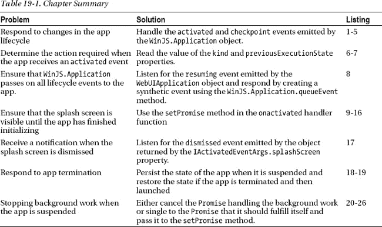
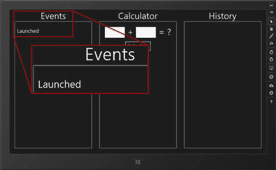
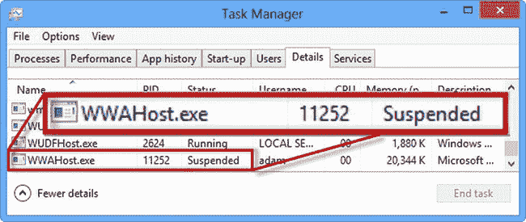
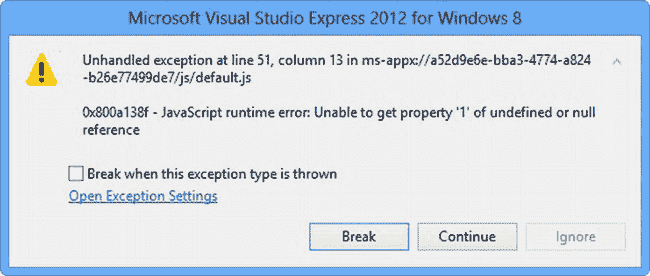
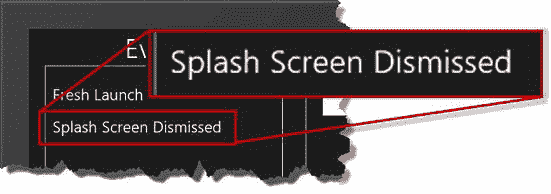
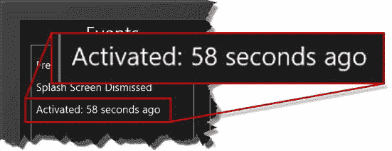

# 十九、了解应用生命周期

我将关注的第一个集成领域是 Metro 应用生命周期。到目前为止，在本书中，我一直在掩饰应用的启动和管理方式，我一直依赖于 Visual Studio 在创建新项目时添加到`default.js`文件中的一部分代码，为了简洁起见，我删除了其他部分。

在这一章中，我将解释 Metro 应用生命周期中的不同阶段，解释它们是如何发生的以及为什么会发生，并向您展示如何理解您的应用何时从一个阶段进入另一个阶段。在这个过程中，我将解释为什么 Visual Studio 添加的代码不是那么有用，向您展示如何修复它，并向您展示如何确保您的应用适合整体 Metro 和 Windows 8 生命周期模型。表 19-1 对本章进行了总结。

### 了解应用生命周期

Windows 8 积极管理 Metro 应用，以保持设备内存空闲。这样做是为了确保最大限度地利用可用内存，并减少电池消耗。作为这一战略的一部分，Metro 应用拥有明确的生命周期。除了最简单的应用，所有应用都需要知道 Windows 8 何时将应用从生命周期的一个阶段转移到另一个阶段，这是通过侦听一些特定的系统事件来完成的。我将描述这些事件，并向您展示如何处理它们，但在这一部分，我将描述生命周期，以便您了解您的 Metro 应用运行的环境。

#### 激活

一个应用在启动时被激活，通常是当用户点击开始屏幕上的图标时。这是 Metro 应用的基本初始化，就像任何类型的应用启动时一样，您需要创建布局、加载数据、设置事件监听器等等。简而言之，激活的应用从不运行变为运行，并负责引导其状态以向用户提供服务。

 **注意**并非所有的激活都是为了启动一个应用——正如我将在本章后面解释的，Windows 也会激活你的应用，这样它就可以执行其他任务，包括那些由*契约*定义的任务。契约是本书这一部分的主题，你将在第二十四章开始看到它们是如何工作的。

#### 暂停

当一个应用不被使用时，它会被 Windows 8 暂停，最常见的原因是用户已经切换到使用另一个应用。这就是应用管理中积极的部分:在用户切换到另一个应用后几秒钟，一个应用就被挂起了。简而言之，一旦你的应用对用户不再可见，你就可以期待它被暂停。

暂停的应用被冻结。应用的状态被保留，但应用代码不会被执行。用户不会意识到某个应用已被暂停，该应用的缩略图仍会出现在正在运行的应用列表中，以便可以再次选择它。

#### 恢复

当用户选择一个暂停的应用并再次显示它时，暂停的应用被恢复。Windows 会保留应用的布局和状态，因此在恢复应用时，您不需要加载数据和配置 HTML 元素。

#### 终止

如果 Windows 需要释放内存，暂停的 Metro 应用将被终止。暂停的应用在终止时不会收到任何通知，应用的状态和任何未保存的数据都会被丢弃。应用布局的快照将从向用户显示的运行应用列表中移除，并替换为作为占位符的闪屏。如果用户再次启动应用，应用将返回激活状态。

 **注意** Windows 没有为 Metro 应用开发者提供关于应用何时终止的明确政策。这是最后的手段，但 Windows 可以在任何需要的时候自由终止应用，并且您不能根据可用的系统资源来假设应用被终止的可能性。

### 与 WinJS 合作。应用

既然您已经理解了生命周期的不同阶段，我将向您展示如何在应用 JavaScript 代码中处理它们。这个部分的关键对象是`WinJS.Application`，它提供了对 JavaScript Metro app 的生命周期事件和一些相关特性的访问。

 **提示** `WinJS.Application`只是包装了`Windows.UI.WebUI.WebUIApplication`对象中的功能。使用`WinJS.Application`的价值在于它以一种更符合 JavaScript 和 web 应用开发的方式呈现了生命周期特性。你可以直接使用`WebUIApplication`类，但是我发现有一些有用的`WinJS.Application`特性值得使用。

我将从`WinJS.Application`支持的事件开始，我已经在表 19-2 中描述过了。对于处理应用生命周期，重要的事件是`activated`和`checkpoint`。事实上，我很少使用其他事件。

当您创建一个新的 Metro 项目时，Visual Studio 会向`js/default.js`文件添加一些代码，使用`WinJS.Application`对象提供一些基本的生命周期事件处理。对于这一章，我已经创建了一个名为`EventCalc`的新 Visual Studio Metro 应用项目，你可以在清单 19-1 中看到 Visual Studio 创建的`default.js`文件。(我已经编辑了清单中的注释，并突出显示了与`WinJS.Application`对象相关的部分。)

***清单 19-1** 。Visual Studio 添加到 default.js 文件中的代码*

`// For an introduction to the Blank template, see the following documentation:
// http://go.microsoft.com/fwlink/?LinkId=232509` `(function () {
    "use strict";

    WinJS.Binding.optimizeBindingReferences = true;

**    var app = WinJS.Application;**
    var activation = Windows.ApplicationModel.Activation;

    **app.onactivated** = function (args) {
        if (args.detail.kind === activation.ActivationKind.launch) {
            if (args.detail.previousExecutionState !==
                activation.ApplicationExecutionState.terminated) {
**                // app has been launched**
            } else {
**               // app has been resumed**
            }
            args.setPromise(WinJS.UI.processAll());
        }
    };

    **app.oncheckpoint** = function (args) {
**        // app is about to be suspended**
    };

**    app.start();**
})();`

你可以使用`addEventListener`方法来设置你的事件监听器函数，但是微软已经为 Visual Studio 生成的代码使用了`on*`属性，我将在本章中遵循这个约定。

 **提示**注意，清单中的最后一条语句是对`WinJS.Application.start`方法的调用。`WinJS.Application`对象将事件排队，直到`start`方法被调用，此时事件被传递给你的代码。调用`stop`方法会导致`WinJS.Application`再次开始对事件进行排队。一个常见的问题是忘记调用`start`，创建一个激活时不做任何事情的应用。

这个清单中有几个问题。首先，Visual Studio 添加到新项目中的代码不是很有帮助。第二，`WinJS.Application`对象不会转发`WebUIApplication`对象发送的所有事件。如果你使用`/js/default.js`文件中的代码构建一个复杂的应用而不解决这两个问题，你迟早会碰壁。在我构建出`EventCalc`示例应用后，我将解释这两个问题并演示它们的解决方案。

#### 构建示例应用

示例应用是一个非常简单的计算器，允许您将两个数字相加。该应用还显示其接收的生命周期事件的详细信息。在图 19-1 中可以看到没有任何内容的 app 布局。

***图 19-1。**event calc 应用*

##### 定义视图模型

这是一个基本的简单应用，但如果我添加一个简单的视图模型，它将帮助我演示应用的生命周期。清单 19-2 显示了`viewmodel.js`文件的内容，我将它添加到了 Visual Studio 项目的`js`文件夹中。

***清单 19-2** 。EventCalc 应用的视图模型*

`(function () {

    WinJS.Namespace.define("ViewModel", WinJS.Binding.as({
        State: {
            firstNumber: null,
            secondNumber: null,
            result: null,
            history: new WinJS.Binding.List(),
            eventLog: new WinJS.Binding.List()
        }
    }));

    WinJS.Namespace.define("ViewModel.Converters", {
        calcNumber: WinJS.Binding.converter(function (val) {
            return val == null ? "" : val;
        }),
        calcResult: WinJS.Binding.converter(function (val) {
            return val == null ? "?" : val;
        }),
    });
})();`

`ViewModel.State`对象为相加的两个值和计算结果定义属性。我还使用了两个`WinJS.Binding.List`对象来记录计算和保存应用接收的生命周期事件的细节。除了状态数据之外，我还定义了一对简单绑定转换器，当视图模型属性没有赋值时，它们将阻止`null`显示在布局中。

##### 定义标记

我的示例应用只包含一组内容，所以我在`default.html`文件中定义了标记，而不是使用单页内容模型和导航 API。你可以在清单 19-3 的中看到`default.html`的内容。我没有在这个文件中使用任何新技术。布局分为三个部分。第一部分和最后一部分包含`ListView`控件，该控件使用视图模型列表对象作为数据源，中间部分包含基本的 HTML 元素，用于捕获用户的计算输入并显示结果。

***清单 19-3** 。default.html 文件的内容*

`<!DOCTYPE html>
<html>
<head>
    <meta charset="utf-8" />
    <title>EventCalc</title>

    <!-- WinJS references -->
    <link href="//Microsoft.WinJS.1.0/css/ui-dark.css" rel="stylesheet" />
    
    

    <!-- EventCalc references -->
    <link href="/css/default.css" rel="stylesheet" />
    
    
</head>
<body>
    

        

    

    

        Events
        

        

    

    

        Calculator
        

            <input id="firstInput" data-win-bind="innerText: firstNumber` `                ViewModel.Converters.calcNumber" />
            +
            <input id="secondInput" data-win-bind="innerText: secondNumber
                ViewModel.Converters.calcNumber" />
            =
            
            <button id="calcButton">Calculate</button>
        

    

    

        History
        

        

    

</body>
</html>`

##### 定义 CSS

为了管理 HTML 元素的布局，我在`/css/default.css`文件中定义了如清单 19-4 所示的样式。这些样式依赖于标准的 CSS 属性，没有使用特定于 Metro 的特性。

***清单 19-4** 。/css/default.css 文件的内容*

`body {display: -ms-flexbox;-ms-flex-direction: row;
    -ms-flex-align: stretch;-ms-flex-pack: center;}
div.container {width: 30%; display: inline-block;margin: 0 20px;    
    text-align: center;font-size: 35pt;}

#eventList, #historyList, #calcElems {
    border: thin solid white;height: 85%;padding-top: 20px;
}

#calcButton {font-size: 20pt; margin: 20px;}
#calcContainer input {font-size: 25pt;width: 100px;}

*.calcSymbol, #result {font-size: 35pt;}
.message {font-size: 20pt;margin: 5px;text-align: left;}`

##### 定义 JavaScript

这个应用所有有趣的部分都发生在 JavaScript 代码中。清单 19-5 建立在 Visual Studio 添加到`default.js`文件的代码上，因此生命周期事件的细节显示在一个`ListView`控件中，并且可以执行计算。

***清单 19-5** 。构建在 Visual Studio 创建的 default.js 文件上*

`(function () {
    "use strict";

    var app = WinJS.Application;
    var activation = Windows.ApplicationModel.Activation;
    WinJS.strictProcessing();

**    function writeEventMessage(msg) {**
**        ViewModel.State.eventLog.push({ message: msg });**
**    };**

    app.onactivated = function (args) {
        if (args.detail.kind === activation.ActivationKind.launch) {
            if (args.detail.previousExecutionState !==
                activation.ApplicationExecutionState.terminated) {
**                // app has been launched**
**                writeEventMessage("Launched");**
**                performInitialization();**
            } else {
**                // app has been resumed**
**                writeEventMessage("Resumed");**
            }

            args.setPromise(WinJS.UI.processAll().then(function () {
**                return WinJS.Binding.processAll(calcElems, ViewModel.State);**
            }));
        }
    };

**    app.oncheckpoint = function (args) {**
**        // app is about to be suspended**
**        writeEventMessage("Suspended");**
**    };**

**    function performInitialization() {**
**        calcButton.addEventListener("click",**
**            function (e) {**
**                var first = ViewModel.State.firstNumber = Number(firstInput.value);**
**                var second = ViewModel.State.secondNumber = Number(secondInput.value);**
**                var result = ViewModel.State.result = first + second;**
**            });**

**        ViewModel.State.bind("result", function (val) {**` `**            if (val != null) {**
**                ViewModel.State.history.push({**
**                    message: ViewModel.State.firstNumber + " + "**
**                        + ViewModel.State.secondNumber + " = "**
**                        + val**
**                });**
**            }**
**        });**
    };

    app.start();
})();`

`writeEventMessage`函数向视图模型添加一个项目，报告生命周期事件的接收，格式化消息，以便它可以与我在`default.html`文件中定义的模板一起工作。

`performInitialization`函数包含我希望在应用启动时执行的代码——对于这个应用，这意味着为由`button`元素发出的`click`事件设置一个处理程序，并设置一个编程数据绑定，以便在视图模型`result`属性更改时生成计算历史。

 **提示**注意，在`onactivated`处理程序中，我对传递给函数的参数对象调用了`setPromise`方法。我将在本章后面的处理闪屏部分解释这个方法。

### 触发生命周期变更

将应用从生命周期的一部分转移到另一部分的最简单方法是使用 Visual Studio。如果你查看工具栏，你会看到一个标有`Suspend`的菜单项。如果你点击标签右边的小箭头，你会看到菜单也包含了`Resume`和`Suspend and`?? 的选择，如图图 19-2 所示。(您可能需要从 Visual Studio`View`–`Toolbars`菜单中选择`Debug`位置才能看到工具栏。)

***图 19-2。**使用 Visual Studio 控制应用生命周期*

菜单项迫使应用从一个生命周期阶段转移到另一个阶段。它们很有用，因为它们允许您在附加调试器的情况下测试代码。在应用开发的早期阶段，我经常使用这个功能。

然而，Visual Studio 只能模拟生命周期事件，这意味着调试器运行时和不运行时会有细微的差别。这意味着您应该花时间通过直接从操作系统生成事件来测试您的应用的行为方式，而不依赖于 Visual Studio 调试器。

问题是，当调试器没有被使用时，一个影响是没有`JavaScript Console`窗口可用于显示调试消息，这使得更难弄清楚发生了什么。正是因为这个原因，我在示例应用中添加了一个`ListView`控件，这样我就可以在应用本身的布局中记录生命周期事件的到来——这是我经常用于应用最终测试的一种技术。

#### 在 Windows 8 中生成生命周期事件

生成生命周期事件实际上非常简单，只要您耐心等待，看看 Windows 8 显示的指示生命周期变化的指示。在接下来的小节中，我将向您展示如何在不使用 Visual Studio 的情况下生成每个`activated`、`resuming`和`suspending`事件。正如我所说的，这是测试你的用户将会看到什么的唯一现实的方法。

##### 启动应用

触发`activated`事件最简单的方法是启动应用，尽管重要的是不要用 Visual Studio 调试器来做这件事。你可以从开始屏幕中选择应用的磁贴，或者从 Visual Studio `Debug`菜单中选择`Start Without Debugging`。

 **提示**在 Visual Studio 中至少启动一次之前，示例应用的磁贴不会添加到开始屏幕。之后，您应该会看到应用的磁贴列在屏幕的最右侧。有时磁贴会不可见，特别是如果你一直在模拟器和本地机器之间切换以运行应用——在这种情况下，我发现通过键入应用名称的前几个字母并从结果列表中选择它来搜索应用足以使文件正确显示。

当你启动`EventCalc`应用时，你会看到默认的闪屏(因为我没有改变所用颜色或图标的清单设置)，然后看到如图图 19-3 所示的应用布局。请注意，左侧的`ListView`控件中已经记录了`activated`事件。我用消息`Launched`记录了这个事件，以表明接收到的事件是一个启动应用的请求——这一点我将在本章后面详细解释。

***图 19-3。**在没有调试器的情况下启动示例应用*

#### 暂停应用

让 Windows 暂停应用最简单的方法就是按`Win+D`切换到桌面。您可以通过启动`Task Manager`，切换到`Details`选项卡并找到`WWAHost.exe`进程来跟踪应用生命周期的进程(这是用于运行 JavaScript Metro 应用的可执行文件的名称——因此，您启动的每个 Metro 应用都会有一个进程)。您可能需要点击任务管理器中的`More Details`按钮才能看到`Details`选项卡。

 **注意**您需要在本地机器上启动任务管理器，即使示例应用正在模拟器中运行。任务管理器不能在模拟器中运行，但是`WWAHost.exe`进程在本地机器的任务管理器中仍然可见。

几秒钟后，Windows 将暂停应用，进程状态将在`Task Manager`中变为`Suspended`。你可以在图 19-4 中看到一个暂停的应用是如何显示在任务管理器中的。

***图 19-4。**使用任务管理器观察一个 Metro 应用被挂起*

 **注意**连接到 Visual Studio 调试器的应用永远不会在`Task Manager`中显示为挂起，因为它们保持活动状态，以便调试器可以控制应用。如果你没有看到挂起的消息，通常是因为应用是用调试器启动的。

我需要使用任务管理器来检查应用的状态，因为我再也看不到应用的布局，而且由于我没有使用调试器，我也看不到任何调试消息。在下一节中，当我恢复应用时，您将看到收到了`suspending`事件的证据。

#### 恢复应用

你可以通过将应用带回到前台来恢复应用，最简单的方法是将鼠标移动到左上角(或在触摸屏上从左边缘滑动)并单击缩略图。应用将返回并填满屏幕，您将看到在应用布局的左侧`ListView`控件中记录了一个新事件，如图图 19-5 所示。

***图 19-5。**app 收到暂停和恢复事件*

图中显示`suspending`事件被 app 接收。这发生在应用对用户隐藏之后，但在进程在`Task Manager`中显示为暂停之前。这个小间隔是我将在本章后面返回的东西，因为它为应用提供了一个准备被挂起的机会，这对某些类型的应用来说是无价的。

图*没有*显示的是`resuming`事件的接收。这是 Visual Studio 添加到项目中的代码的问题之一。我将向您展示如何确保您的应用很快获得该事件。

#### 终止应用

你可以通过输入`Alt` + `F4`来终止应用的执行。应用会突然终止，并且不会发送警告事件。以这种方式退出应用允许您确保您的应用在下次启动时正确恢复，并检查它使用的任何远程服务(web 服务、数据库等。)能够正确地恢复资源。

这是终止你的应用的两种方式之一。另一种情况发生在应用暂停，Windows 需要释放一些资源的时候。在这两种情况下，您的应用将被终止，而不会收到任何通知事件。在这一章的后面，我将向你展示当你的应用被暂停时如何准备终止，我也将向你展示当你的应用下次启动时如何判断它是如何被终止的。

您可以通过使用 Visual Studio 工具栏菜单中的`Suspend and Shutdown`项(包含`Suspend`和`Resume`项的菜单)来模拟 Windows 终止应用的情况。

### 获取激活类型和以前的应用状态

在我可以修复`default.js`文件中的代码以便获得所有的生命周期事件之前，我需要做一些准备工作，以便我可以弄清楚当事件到来时我被要求做什么。为此，我需要深入研究事件的细节，以发现激活类型和我的应用在事件被调度之前所处的状态。

当一个应用被发送`activated`事件时，传递给`onactivated`函数的事件对象有一个`detail`属性，该属性返回一个`Windows.ApplicationModel.Activation.IActivatedEventArgs`对象。

`IActivatedEventArgs`对象定义了我在表 19-3 中描述的三个属性，这些属性为你提供了所有你需要的信息，让你知道 Windows 要求你的应用做什么。我将在接下来的章节中描述其中的两个属性，并在本章的后面返回到第三个属性。

#### 确定激活的种类

一个应用可以被激活用于一系列不同的目的，例如在应用之间共享数据，从设备接收数据，以及处理搜索查询。这些激活目的是由 Windows *契约*定义的，它允许你将你的应用集成到 Windows 中，我将在这一章的后面返回——你将能够在后面的章节中看到我如何实现契约的例子。对于这一章，我关心的是*启动*激活，这发生在用户已经启动应用或者应用在暂停后已经恢复的时候。

您可以通过从`activated`事件中读取`kind`属性来确定您正在处理的激活类型。`kind`属性返回由`Windows.ApplicationModel.Activation.ActivationKind`枚举定义的值之一。我在`launch`的这一章中寻找的唯一值，它告诉我应用已经被启动或恢复。你可以看到我如何在清单 19-6 的函数中检查这一点。

***清单 19-6** 。检查启动激活类型*

`...
app.onactivated = function (args) {` `    if (**args.detail.kind === activation.ActivationKind.launch**) {
       // the app has been launched
       writeEventMessage("Launched");
    }
};
...`

#### 确定以前的应用状态

在处理一个启动激活请求时，你需要知道应用在激活前是什么状态，这可以通过读取`previousExecutionState`属性来确定。该属性返回由`Windows.ApplicationModel.Activation.ApplicationExecutionState`枚举定义的值之一，我已经在表 19-4 中列出了这些值。

如果你的应用之前的状态是`notRunning`或`closedByUser`，那么你正在处理一个*的重新开始*的发布。您需要初始化您的应用(设置 UI 控件、事件监听器等。)并为应用的首次用户交互做准备。

如果之前的状态是`suspended`，那么应用将已经被初始化，并且应用的状态将与应用被挂起时一样。`terminated`状态是两种情况的奇怪组合。应用是由系统终止的，而不是用户，所以这个想法是，如果用户再次启动应用，他们应该能够像暂停和终止发生之前一样继续。但是，应用的状态在终止时会丢失。为了实现正确的行为，您需要存储应用挂起时的状态，以防发生终止。我将在本章的后面解释如何做到这一点。

当 Windows 希望您的应用履行其契约义务时，通常会遇到`running`状态，并且该应用已经在运行，因为用户之前已经启动了它。当您使用 Visual Studio `Refresh`按钮重新加载应用的内容时，您也会遇到这种情况——当然，这不是您的应用在部署给用户时会遇到的情况。你如何响应运行状态将取决于你的应用和它所支持的契约，但是在这一章中，我将把`running`状态视为与`notRunning`相同的状态，只是为了确保应用与 Visual Studio `Refresh`按钮一起正常工作。这可能对所有的应用都没有意义，但是因为我的用户——也就是你——可能会在 Visual Studio 中运行应用，所以这是最明智的做法。

#### 应对不同的投放类型

现在您已经理解了 Windows 如何在`activated`事件中提供细节，我可以在我的`/js/default.js`文件中添加一些代码来响应不同的情况。你可以在清单 19-7 中看到我添加的内容。

***清单 19-7** 。区分激活类型和以前的执行状态*

`...
app.onactivated = function (args) {
    if (args.detail.kind === activation.ActivationKind.**launch**) {
**        switch (args.detail.previousExecutionState) {**
**            case activation.ApplicationExecutionState.suspended:**
**                writeEventMessage("Resumed from Suspended");**
**                break;**
**            case activation.ApplicationExecutionState.terminated:**
**                writeEventMessage("Launch from Terminated");**
**                performInitialization();**
**                break;**
**            case activation.ApplicationExecutionState.notRunning:**
**            case activation.ApplicationExecutionState.closedByUser:**
**            case activation.ApplicationExecutionState.running:**
**                writeEventMessage("Fresh Launch");**
**                performInitialization();**
**                break;**
**        }**

        args.setPromise(WinJS.UI.processAll().then(function () {
            return WinJS.Binding.processAll(calcElems, ViewModel.State);
        }));
    }
};
...`

当我收到一个启动激活事件时，我使用一个 switch 语句来检查所有的`ApplicationExecutionState`值。我将`notRunning`、`closedByUser`和`running`的值视为相同，并调用`performInitialization`函数来设置我的事件监听器和数据绑定。我已经更改了传递给`writeEventMessage`函数的消息，以使我收到的事件的意义更加清晰。

我也是在前一个状态是`terminated`的时候调用`performInitialization`函数。我将在本章后面添加一些额外的代码，以区分我处理这种状态的方式与`notRunning`、`running`和`closedByUser`。对于所有这些先前的状态，我需要初始化我的应用，以确保我的事件处理程序和数据绑定已经设置好。

我还没有对`suspended`值做任何事情，除了调用`writeEventMessage`函数来记录事件的接收。我不需要初始化我的应用，因为系统正在恢复执行，我的事件处理程序和数据绑定已经存在。当我谈到后台活动时，我会在这一部分添加一些代码，但是目前，什么也不做是将对`suspended`状态的响应区分开来的原因。

 **提示**你会注意到我调用了`WinJS.UI.processAll`和`WinJS.Binding.processAll`方法，而不管我正在处理哪种激活。我将在本章的后面回到这段代码。

你可以在图 19-6 中看到我显示的三个激活事件消息中的两个。您可以使用 Visual Studio 非常容易地自己重新创建这些事件。首先，使用`Debug`菜单中的`Start Debugging`项启动应用——这将产生如图左侧所示的`Fresh Launch`消息。

***图 19-6。**显示启动激活事件的详细信息*

现在从工具栏菜单中选择`Suspend and Shutdown`项，这将终止应用。再次启动应用，`activated`事件的先前执行状态将被设置为`terminated`，导致出现图中右侧所示的消息。

### 捕获恢复事件

我的`default.js`文件中的代码可以区分不同类型的激活事件，并根据应用之前的状态做出响应——但当应用恢复时，我仍然没有收到事件。为了补救这一点，我在`default.js`文件中添加了如清单 19-8 所示的内容。

***清单 19-8** 。捕捉恢复事件*

`(function () {
    "use strict";

    var app = WinJS.Application;
    var activation = Windows.ApplicationModel.Activation;
    WinJS.strictProcessing();

    function writeEventMessage(msg) {
        ViewModel.State.eventLog.push({ message: msg });
    };

    app.onactivated = function (args) {
        // *...code removed for brevity...*
    };

    app.oncheckpoint = function (args) {
        // app is about to be suspended
        writeEventMessage("Suspended");
    };

    function performInitialization() {
        // *...code removed for brevity...*
    };

**    Windows.UI.WebUI.WebUIApplication.addEventListener("resuming", function (e) {**
**        WinJS.Application.queueEvent({**
**            type: "activated",**` `**            detail: {**
**                kind: activation.ActivationKind.launch,**
**                previousExecutionState: activation.ApplicationExecutionState.suspended**
**            }**
**        });**
**    });**

    app.start();
})();`

正如我之前提到的，`WinJS.Application`对象是由`Windows.UI.WebUI.WebUIApplication`对象提供的功能的包装器。出于我不明白的原因，`WinJS.Application`类在由`WebUIApplication`对象发送恢复事件时不会将其转发给应用，我对`default.js`文件的添加修复了这一遗漏:我监听由`WebUIApplication`对象发出的`resuming`事件，并通过调用`queueEvent`对象将其送入由`WinJS.Application`维护的事件队列。

我传递给`queueEvent`方法的对象符合被激活事件的模式，即*被*传递——类型属性被设置为`activated`,`detail`属性具有返回预期值的`kind`和`previousExecutionState`属性。

这并不理想，但是如果您希望能够响应整个生命周期的变化，这是很重要的。图 19-7 展示了修复的效果，您可以通过启动示例应用，然后从 Visual Studio 工具栏菜单中选择`Suspend`和`Resume`项来复制这个结果。

***图 19-7。**说明捕捉恢复事件的效果*

### 响应生命周期变化

当然，应用响应生命周期变化的方式会有所不同，但是无论你的应用提供什么工具，你都需要考虑一些核心行为。在接下来的章节中，我描述了一些关键技术，当你响应生命周期事件时，这些技术可以让你的应用适应生命周期模型。

#### 处理闪屏

你可能已经注意到我在本章的`onactivated`处理函数中使用了`setPromise`方法，如清单 19-9 所示。这是一个有用的`WinJS.Application`功能，可以防止应用初始化前闪屏消失。

***清单 19-9** 。使用 setPromise 方法保留闪屏*

`...
app.onactivated = function (args) {
    if (args.detail.kind === activation.ActivationKind.launch) {
        switch (args.detail.previousExecutionState) {
            case activation.ApplicationExecutionState.suspended:
                writeEventMessage("Resumed from Suspended");
                break;
            case activation.ApplicationExecutionState.terminated:
                writeEventMessage("Launch from Terminated");
                performInitialization();
                break;
            case activation.ApplicationExecutionState.notRunning:
            case activation.ApplicationExecutionState.closedByUser:
            case activation.ApplicationExecutionState.running:
                writeEventMessage("Fresh Launch");
                performInitialization();
                break;
        }

**        args.setPromise(WinJS.UI.processAll().then(function () {**
**            return WinJS.Binding.processAll(calcElems, ViewModel.State);**
**        }));**
    }
};
...`

闪屏将一直显示，直到传递给`args.setPromise`方法的`Promise`完成。在这个清单中，我使用了一系列的`Promise`对象，它们分别调用`WinJS.UI.processAll`和`WinJS.Binding.processAll`方法。只有当这两种方法都完成时，应用布局才会替换闪屏。

 **提示**我在第十章中描述了`WinJS.UI.processAll`法，在第八章中描述了`WinJS.Binding.processAll`法。

目前，示例应用中没有任何东西会延迟闪屏的移除，因此，为了演示这个特性，我将在接下来的部分中添加一些新功能。

##### 添加到示例应用

我的示例应用非常简单，但是在真正的应用中可能需要大量的初始设置。为了模拟这种情况，我更改了示例应用，以便在应用首次启动时计算前 5000 个整数值相加的结果，然后在用户执行计算时使用这些数据来产生计算结果。如果你愿意的话，忘记这样做没有什么好的理由，除了这是一个有用的演示。首先，我向视图模型添加了一个新值来包含缓存的结果，如清单 19-10 所示。

***清单 19-10** 。为缓存数据添加视图模型属性*

`...
WinJS.Namespace.define("ViewModel", WinJS.Binding.as({
    State: {
        firstNumber: null,
        secondNumber: null,
        result: null,
        history: new WinJS.Binding.List(),
        eventLog: new WinJS.Binding.List(),
**        cachedResult: null**
    }
}));`

为了生成缓存的结果，我在项目中添加了一个名为`tasks.js`的新文件，其中包含一个定制的`WinJS.Promise`实现。你可以在清单 19-11 中看到`tasks.js`文件的内容，它展示了`doWork`函数的实现。(我在第九章中解释了`Promise`对象如何工作以及如何实现自己的对象)。

***清单 19-11** 在 tasks.js 文件中实现自定义承诺*

`(function () {
    WinJS.Namespace.define("Utils", {
        doWork: function (count) {
            var canceled = false;

            return new WinJS.Promise(function (fDone, fError, fProgress) {
                var blockSize = 500;

                var results = {};

                (function calcBlock(start) {
                    for (var first = start; first < start + blockSize; first++) {
                        results[first] = {};
                        for (var second = start; second < start + blockSize; second++) {
                            results[first][second] = first + second;
                        }
                    }
                    if (!canceled && start + blockSize < count) {
                        fProgress(start);
                        setImmediate(function () {
                            calcBlock(start + blockSize);
                        });
                    } else {
                        fDone(results);
                    }
                })(1);

            }, function () {
                canceled = true;
            });
        }` `    });
})();`

定制的`Promise`代码可能很难阅读，但是清单中的代码在调用`setImmediate`函数之前一次将 500 个块中的成对数字加在一起，以避免锁定 JavaScript 运行时。我将`calcBlock`函数定义为一个自执行函数，并在用参数`1`定义后立即调用它来计算第一组结果。

此代码创建的数据结构是一个对象，它具有每个数值的属性，每个属性的值是另一个对象，它的属性对应于第二个数值，其值是总和，如下所示:

`results = {
    1 = {
        1: 2,
        2: 3,
        3: 4,
    }
}`

完整的结果集被传递给`Promise`完成函数，这意味着可以使用`doWork`函数返回的`Promise`对象的`then`方法来访问它。我已经将`tasks.js`文件添加到了`default.html`文件的头部分，如清单 19-12 所示。

***清单 19-12** 。将 tasks.js 文件添加到 default.html 头文件*

`...
<head>
    <meta charset="utf-8" />
    <title>EventCalc</title>

    <!-- WinJS references -->
    <link href="//Microsoft.WinJS.1.0/css/ui-dark.css" rel="stylesheet" />
    
    

    <!-- EventCalc references -->
    <link href="/css/default.css" rel="stylesheet" />
    
**    **
    
</head>
...`

##### 生成缓存的结果

要查看`setPromise`对象解决的问题，它有助于查看当*不使用*方法时会发生什么。为此，我在`onactivated`处理程序中调用了`doWork`方法，但是没有使用`setPromise`对象。你可以在清单 19-13 中看到对`default.js`文件的添加。

***清单 19-13** 。不使用 setPromise 对象生成缓存结果*

`...
app.onactivated = function (args) {
    if (args.detail.kind === activation.ActivationKind.launch) {
        switch (args.detail.previousExecutionState) {
            case activation.ApplicationExecutionState.suspended:
                writeEventMessage("Resumed from Suspended");
                break;
            case activation.ApplicationExecutionState.terminated:
                writeEventMessage("Launch from Terminated");
                performInitialization();
                break;
            case activation.ApplicationExecutionState.notRunning:
            case activation.ApplicationExecutionState.closedByUser:
            case activation.ApplicationExecutionState.running:
                writeEventMessage("Fresh Launch");
                performInitialization();
                break;
        }

**        Utils.doWork(5000).then(function (data) {**
**            ViewModel.State.cachedResult = data;**
**        });**

        args.setPromise(WinJS.UI.processAll().then(function () {
            return WinJS.Binding.processAll(calcElems, ViewModel.State);
        }));
    }
};
...`

只有在计算完所有值后，才会将缓存的结果分配给视图模型属性。风险在于，在所有数据可用之前，用户将看到应用的布局。

我发现一项任务花费大约 5-10 秒钟是合适的。

你可以在`performInitialization`函数中看到潜在的问题，我在清单 19-14 中修改了这个函数以使用缓存的结果。

***清单 19-14** 。使用 performInitialization 函数中的缓存数据*

`...
function performInitialization() {
    calcButton.addEventListener("click", function (e) {
        var first = ViewModel.State.firstNumber = Number(firstInput.value);
        var second = ViewModel.State.secondNumber = Number(secondInput.value);` `**        if (first < 5000 && second < 5000) {**
**            ViewModel.State.result = ViewModel.State.cachedResult[first][second];**
**        } else {**
**            ViewModel.State.result = first + second;**
**        }**
    });

    ViewModel.State.bind("result", function (val) {
        if (val != null) {
            ViewModel.State.history.push({
                message: ViewModel.State.firstNumber + " + "
                    + ViewModel.State.secondNumber + " = "
                    + val
            });
        }
    });
};
...`

如果用户试图在缓存数据准备好之前执行计算，试图从视图模型中读取结果将会产生一个异常，如图 19-8 所示。在缓存数据准备就绪之前，尝试执行 1 + 1 计算后，显示了图中的错误消息。`click`事件处理程序中的代码，如清单 19-14 所示，试图访问一个名为 1 的变量，但它还不存在。

***图 19-8。**试图在缓存结果生成之前使用它们*

##### 维护闪屏

另一种方法是使用`setPromise`方法，这将确保闪屏一直显示到它所经过的`Promise`完成。你可以在清单 19-15 中看到我是如何为示例应用做这些的。

***清单 19-15** 。使用 setPromise 方法保持闪屏显示*

`...
app.onactivated = function (args) {
    if (args.detail.kind === activation.ActivationKind.launch) {
        switch (args.detail.previousExecutionState) {
            case activation.ApplicationExecutionState.suspended:
                writeEventMessage("Resumed from Suspended");
                break;
            case activation.ApplicationExecutionState.terminated:
                writeEventMessage("Launch from Terminated");
                performInitialization();
                break;
            case activation.ApplicationExecutionState.notRunning:
            case activation.ApplicationExecutionState.closedByUser:
            case activation.ApplicationExecutionState.running:
                writeEventMessage("Fresh Launch");
                performInitialization();
                break;
        }

**        var cachedPromise = Utils.doWork(5000).then(function (data) {**
**            ViewModel.State.cachedResult = data;**
**        });**

**        var processPromise = WinJS.UI.processAll().then(function () {**
**            return WinJS.Binding.processAll(calcElems, ViewModel.State);**
**        });**

**        args.setPromise(WinJS.Promise.join([cachedPromise, processPromise]));**
    }
};
...`

当`doWork`函数生成缓存的结果时，`WinJS.UI.processAll`和`WinJS.Binding.processAll`方法没有理由不能对标记进行操作，所以我使用了`WinJS.Promise.join`方法来创建一个`Promise`,让这两个活动交错进行——正是这个组合的`Promise`被我传递给了`setPromise`方法，它确保了闪屏将一直显示，直到`doWork`和两个`processAll`调用都完成了它们的工作。

当然，我还没有完全正确的行为——每当我的应用启动时，我的结果都会被计算，即使它是从`suspended`状态恢复的。我需要更好地选择何时执行初始化，最简单的方法是开始在`performInitialization`函数中生成缓存的结果，当应用还没有从挂起状态恢复时就会调用这个函数。你可以在清单 19-16 中看到我是如何做到这一点的，它显示了对`default.js`文件的进一步修改。

***清单 19-16** 。确保恢复应用时不会生成缓存结果*

`(function () {
    "use strict";

    var app = WinJS.Application;` `var activation = Windows.ApplicationModel.Activation;
    WinJS.strictProcessing();

    function writeEventMessage(msg) {
        ViewModel.State.eventLog.push({ message: msg });
    };

    app.onactivated = function (args) {
**        var promises = [];**

        if (args.detail.kind === activation.ActivationKind.launch) {
            switch (args.detail.previousExecutionState) {
                case activation.ApplicationExecutionState.suspended:
                    writeEventMessage("Resumed from Suspended");
                    break;
                case activation.ApplicationExecutionState.terminated:
                    writeEventMessage("Launch from Terminated");
**                    promises.push(performInitialization());**
                    break;
                case activation.ApplicationExecutionState.notRunning:
                case activation.ApplicationExecutionState.closedByUser:
                case activation.ApplicationExecutionState.running:
                    writeEventMessage("Fresh Launch");
**                    promises.push(performInitialization());**
                    break;
            }

**            promises.push(WinJS.UI.processAll().then(function () {**
**                return WinJS.Binding.processAll(calcElems, ViewModel.State);**
**            }));**

            args.setPromise(WinJS.Promise.join(**promises**));
        }
    };

    app.oncheckpoint = function (args) {
        // app is about to be suspended
        writeEventMessage("Suspended");
    };

    function performInitialization() {
        calcButton.addEventListener("click", function (e) {
            var first = ViewModel.State.firstNumber = Number(firstInput.value);
            var second = ViewModel.State.secondNumber = Number(secondInput.value);
            if (first < 5000 && second < 5000) {
                ViewModel.State.result = ViewModel.State.cachedResult[first][second];
            } else {
                ViewModel.State.result = first + second;
            }
        });` 
`        ViewModel.State.bind("result", function (val) {
            if (val != null) {
                ViewModel.State.history.push({
                    message: ViewModel.State.firstNumber + " + "
                        + ViewModel.State.secondNumber + " = "
                        + val
                });
            }
        });

**        return Utils.doWork(5000).then(function (data) {**
**            ViewModel.State.cachedResult = data;**
**        });**
    };

    Windows.UI.WebUI.WebUIApplication.addEventListener("resuming", function (e) {
        WinJS.Application.queueEvent({
            type: "activated",
            detail: {
                kind: activation.ActivationKind.launch,
                previousExecutionState: activation.ApplicationExecutionState.suspended
            }
        });
    });

    app.start();
})();`

##### 了解闪屏何时关闭

如果初始化需要几秒钟，保持闪屏可见是可以接受的。超过这一点，看起来你的应用在启动时就挂起了，变得没有响应。如果您有很多初始化要执行，那么您应该避免使用`setPromise`对象，而是向用户显示某种进度显示。要做到这一点，你需要知道闪屏什么时候被关闭，什么时候被你的应用的布局所取代。

当闪屏被替换为应用布局时，`IActivatedEventArgs`对象的`splashScreen`属性发出一个`dismissed`事件。你可以通过传递给`onactivated`处理函数的`Event`对象的`detail.splashScreen`属性获得这个值，如清单 19-17 所示。

***清单 19-17** 。收到闪屏已被取消的通知*

`...
app.onactivated = function (args) {
    var promises = [];

    if (args.detail.kind === activation.ActivationKind.launch) {
        switch (args.detail.previousExecutionState) {
            case activation.ApplicationExecutionState.suspended:
                writeEventMessage("Resumed from Suspended");
                break;` `            case activation.ApplicationExecutionState.terminated:
                writeEventMessage("Launch from Terminated");
                promises.push(performInitialization());
                break;
            case activation.ApplicationExecutionState.notRunning:
            case activation.ApplicationExecutionState.closedByUser:
            case activation.ApplicationExecutionState.running:
                writeEventMessage("Fresh Launch");
                promises.push(performInitialization());
                break;
        }

**        if (args.detail.splashScreen) {**
**            args.detail.splashScreen.addEventListener("dismissed", function (e) {**
**                writeEventMessage("Splash Screen Dismissed");**
**            });**
**        }**

        promises.push(WinJS.UI.processAll().then(function () {
            return WinJS.Binding.processAll(calcElems, ViewModel.State);
        }));

        args.setPromise(WinJS.Promise.join(promises));
    }
};
...`

应用恢复时没有闪屏——不仅仅是因为 Metro 没有使用闪屏，还因为我将恢复事件提供给了`WinJS.Application`,并且没有定义`splashScreen`属性。这意味着您需要检查一下`splashScreen`属性是否存在。

如果您启动该应用，您将看到在左侧`ListView`控件中显示一条通知消息，报告闪屏已被取消，如图图 19-9 所示。如果您仍然有应用初始化要执行，那么这将提示您向用户显示一些临时消息或内容。

***图 19-9。**闪屏关闭时显示消息*

#### 处理 App 终止

处理一个终止后又启动的 app，需要做一些工作。一个应用不会被警告即将被终止——系统会暂停应用，然后，如果资源紧张，终止应用进程以释放内存。Windows 无法告诉应用它将被终止，除非让它退出挂起状态，这将需要一些 Windows 试图回收的资源。

处理应用终止需要代表应用做一些仔细的工作，因为微软想对用户隐藏终止。这是一个明智的想法，当一个应用遵循这种模式时，它会为用户创造更好的整体地铁体验，用户不会在意有限的设备资源导致的应用终止。用户没有关闭应用，当他们从“正在运行”的应用列表中选择闪屏占位符时，他们会期望应用会让他们从停止的地方继续。

要做到这一点，您需要存储应用挂起时的状态。这就像购买应用终止保险一样——你希望你的应用只是被恢复，你不必恢复状态，但你需要采取预防措施，以防你的应用被终止。

`WinJS.Application`对象通过它的`sessionState`属性帮助你存储你的应用状态。通过将一个对象分配给该属性来存储状态，该对象将作为 JSON 数据永久存储。使用的 JSON 解析器非常简单，不会处理复杂的对象，包括可观察的对象，这意味着您通常需要创建一个新的对象来表示您的应用的状态——当然，如果您的应用被终止然后被激活，请准备好使用该对象来恢复该状态。

为了演示这项技术，我在`viewmodel.js`文件中添加了两个新函数来保存和恢复应用状态数据，如清单 19-18 所示。

 **注意**`sessionState`属性应该只用于存储应用状态，比如用户输入到 UI 控件中的值，用户在应用中导航到的点，以及将应用恢复到其先前状态所需的其他数据。用户数据和设置应该*而不是*使用`sessionState`属性存储。我将在第二十章中向您展示如何处理设置，以及如何在第二十二章–24 章中使用文件系统。

***清单 19-18** 。创建和恢复状态对象的功能*

`(function () {

    WinJS.Namespace.define("ViewModel", WinJS.Binding.as({
        State: {
            firstNumber: null,
            secondNumber: null,
            result: null,
            history: new WinJS.Binding.List(),
            eventLog: new WinJS.Binding.List(),
            cachedResult: null
        }
    }));

    WinJS.Namespace.define("ViewModel.Converters", {
        calcNumber: WinJS.Binding.converter(function (val) {
            return val == null ? "" : val;
        }),
        calcResult: WinJS.Binding.converter(function (val) {
            return val == null ? "?" : val;
        }),
    });` `**    WinJS.Namespace.define("ViewModel.State", {**
**        getData: function () {**
**            var data = {**
**                firstNumber: ViewModel.State.firstNumber,**
**                secondNumber: ViewModel.State.secondNumber,**
**                history: [],**
**                events: []**
**            };**
**            ViewModel.State.history.forEach(function (item) {**
**                data.history.push(item);**
**            });**
**            ViewModel.State.eventLog.forEach(function (item) {**
**                data.events.push(item);**
**            });**
**            return data;**
**        },**
**        setData: function (data) {**
**            data.history.forEach(function (item) {**
**                ViewModel.State.history.push(item);**
**            });**
**            data.events.forEach(function (item) {**
**                ViewModel.State.eventLog.push(item);**
**            });**
**            ViewModel.State.firstNumber = data.firstNumber;**
**            ViewModel.State.secondNumber = data.secondNumber;**
**        }**
**    });**

})();`

请注意，我对包含的数据是有选择性的。例如，我不包括`result`属性。如果我这样做了，并在应用再次启动时恢复了该值，那么设置该属性将触发我在`default.js`中定义的数据绑定，并在历史记录中创建一个新的(意外的)条目。不设置这个值的缺点是，最后提供给用户的结果不会显示在中间的列中。

这是处理应用状态数据的典型方式——你通常可以非常接近地恢复到应用暂停前的状态，但总有一些事情很难恢复。至于你在处理这些问题时能走多远，这是一个判断的问题。

 **提示**我在这个例子中也省略了 app 状态下缓存的计算数据。决定在应用状态中包含相对大量的数据是另一个判断。如果数据是我可以快速再现的东西，就像在这种情况下，那么我倾向于从状态中忽略它，因为我预计终止是一种相对罕见的情况，我宁愿承受再现数据的代价，而不是存储数据的代价，后者无限期地保留在设备上，可能会给用户带来其他问题。这个问题没有简单的答案，您必须查看您正在处理的数据，并找出给用户最佳体验的方法。在你阅读了第二十章之后，你将能够就如何存储更大数量的数据做出明智的决定，我在其中描述了存储应用数据的其他方法。

为了保存和恢复应用状态，我从`default.js`文件中调用视图模型方法，以响应适当的生命周期事件，如清单 19-19 所示。

***清单 19-19** 。存储和恢复状态数据*

`...
app.onactivated = function (args) {
    var promises = [];

    if (args.detail.kind === activation.ActivationKind.launch) {
        switch (args.detail.previousExecutionState) {
            case activation.ApplicationExecutionState.suspended:
                writeEventMessage("Resumed from Suspended");
                break;
            case activation.ApplicationExecutionState.terminated:
**                ViewModel.State.setData(app.sessionState);**
                writeEventMessage("Launch from Terminated");
                promises.push(performInitialization());
                break;
            case activation.ApplicationExecutionState.notRunning:
            case activation.ApplicationExecutionState.closedByUser:
            case activation.ApplicationExecutionState.running:
                writeEventMessage("Fresh Launch");
                promises.push(performInitialization());
                break;
        }

        if (args.detail.splashScreen) {
            args.detail.splashScreen.addEventListener("dismissed", function (e) {
                writeEventMessage("Splash Screen Dismissed");
            });
        }

        promises.push(WinJS.UI.processAll().then(function () {
            return WinJS.Binding.processAll(calcElems, ViewModel.State);
        }));

        args.setPromise(WinJS.Promise.join(promises));
    }
};

app.oncheckpoint = function (args) {
    // app is about to be suspended
**    app.sessionState = ViewModel.State.getData();**
    writeEventMessage("Suspended");
};
...`

就在应用挂起之前，调用了`oncheckpoint`处理函数，这提示我通过将`getData`方法的结果赋给`sessionState`属性来存储我的应用状态。如果我的应用启动了，并且之前的执行状态是`terminated`，我通过读取`sessionState`属性的值来恢复状态数据。

这些变化的效果是，当应用终止时，用户获得了(几乎)无缝的体验。你可以在图 19-10 的中看到状态是如何恢复的，以及生命周期事件通知，显示应用被启动之前已经被终止。

***图 19-10。**保存和恢复 app 状态的效果*

#### 处理 App 暂停

除了存储应用的状态，你还可以使用`oncheckpoint`处理函数来释放应用正在使用的资源，并控制应用正在执行的任何后台任务。

例如，在资源方面，您可能需要关闭与服务器的连接或安全地关闭文件。你不知道你的应用将被挂起多长时间，也不知道它是否会在挂起时被终止，所以使用`oncheckpoint`处理程序让你的应用进入安全状态是有意义的。如果您使用远程服务器，最好尝试关闭连接，以便其他用户可以使用它们–大多数服务器最终会发现您的应用已经消失，但这可能需要一段时间，而且仍然有一些企业服务器对并发连接的数量有严格的限制，即使这些连接没有主动处理请求。

就后台任务而言，如果在应用暂停时，您有使用`setImmediate`、`setInterval`或`setTimeout`方法延迟的工作，那么这项工作将在应用再次恢复时执行——这并不总是有用的，尤其是当应用恢复时，状态可能会发生变化，这使得处理被延迟执行的函数的结果更加困难。

在这一节中，我将向您展示如何在应用挂起之前进行准备。我将使用一个简单的后台任务来完成这项工作，因为这意味着您不必按照示例设置服务器。后台任务将计算出自应用上次激活以来已经过了多少秒——这在现实世界中并不是一件有用的事情，但它是一个有用的示例，因为它允许我向您展示当后台活动的上下文变得陈旧时会发生什么。清单 19-20 显示了我对`tasks.js`文件所做的更改，以定义新的活动。

***清单 19-20** 。为示例应用定义后台活动*

`(function () {
    WinJS.Namespace.define("Utils", {
        doWork: function (count) {
            // ...*statements removed for brevity*...
        },

**        doBackgroundWork: function () {**
**            var interval = 1000;**
**            var canceled = false;**
**            var timeoutid;**` `**            return new WinJS.Promise(function (fDone, fError, fProgress) {**
**                var startTime = Date.now();**
**                (function getElapsedTime() {**
**                    var elapsed = Date.now() - startTime;**
**                    fProgress(elapsed / 1000);**
**                    if (!canceled) {**
**                        timeoutid = setTimeout(getElapsedTime, interval);**
**                    } else {**
**                        fDone();**
**                    }**
**                })();**
**            }, function () {**
**                canceled = true;**
**                if (timeoutid) {**
**                    clearTimeout(timeoutid);**
**                }**
**            });**
**        }**
    });
})();`

当调用`doBackgroundWork`函数时，我创建了一个新的`Promise`，它对当前时间进行快照，然后生成进度消息来指示自任务开始以来已经过去了多少秒。我将更新的时间间隔设置为一秒钟，这样在测试生命周期事件时，我就不必为更新等待太长时间。

我还在`default.js`文件中添加了代码，以启动后台工作并显示结果。您可以在清单 19-21 中看到这些变化。

***清单 19-21** 。开始后台工作并显示进度信息*

`...
function performInitialization() {
    calcButton.addEventListener("click", function (e) {
        var first = ViewModel.State.firstNumber = Number(firstInput.value);
        var second = ViewModel.State.secondNumber = Number(secondInput.value);
        if (first < 5000 && second < 5000) {
            ViewModel.State.result = ViewModel.State.cachedResult[first][second];
        } else {
            ViewModel.State.result = first + second;
        }
    });

    ViewModel.State.bind("result", function (val) {
        if (val != null) {
            ViewModel.State.history.push({
                message: ViewModel.State.firstNumber + " + "
                    + ViewModel.State.secondNumber + " = "
                    + val
            });
        }
    });` `**    startBackgroundWork();**

    return Utils.doWork(5000).then(function (data) {
        ViewModel.State.cachedResult = data;
    });
};

**var backgroundPromise;**

**function startBackgroundWork() {**
**    backgroundPromise = Utils.doBackgroundWork();**
**    var updatedExistingEntry = false;**
**    backgroundPromise.then(function () { }, function () { }, function (progress) {**
**        var newItem = {**
**            message: "Activated: " + Number(progress).toFixed(0) + " seconds ago"**
**        };**
**        ViewModel.State.eventLog.forEach(function (item, index) {**
**            if (item.message.indexOf("Activated:") == 0) {**
**                updatedExistingEntry = true;**
**                ViewModel.State.eventLog.setAt(index, newItem);**
**            }**
**        });**
**        if (!updatedExistingEntry) {**
**            ViewModel.State.eventLog.push(newItem);**
**        }**
**    });**
**}**
...`

`startBackgroundWork`函数调用`doBackgroundWork`并使用`then`方法接收进度更新，每个更新包含自激活以来的秒数。我将这些信息写入视图模型中的事件日志，但是因为我不想让日志中每一秒都充满消息，所以我在日志中创建了一个对象，并在每次收到进度更新时替换它。

在`doBackgroundWork`函数中，我已经用后台任务开始的时间来表示 app 被激活的时刻。为了做出合理的估计，我从`performInitialization`函数中调用了`startBackgroundWork`函数，该函数在应用启动时被调用，并且之前不处于`suspended`状态。你可以在图 19-11 中看到这些变化的结果，图中显示了一个已经运行了一段时间的应用实例。

***图 19-11。**显示应用激活后经过的时间*

要查看过时的上下文问题，请启动应用并运行一段时间。然后暂停和恢复应用。应用暂停时不会进行任何后台工作，但应用恢复后会立即重新开始。从字面上看，该应用会从停止的地方继续运行，这意味着后台任务生成的进度更新是基于任务首次启动的时间，而不是该应用最近一次激活的时间。

示例中的这个问题是微不足道的，但是现实世界中经常会出现类似的问题。执行`oncheckpoint`函数是停止后台任务的机会，这些任务依赖于应用再次启动时将失效的数据。有两种停止后台工作的方法—*取消并忘记*和*停止并等待*。我将在接下来的章节中解释这两个问题。

##### 使用取消和忘记技术

这是最简单的技术——您只需调用执行后台工作的`Promise`的`cancel`方法。你可以在清单 19-22 中的函数中看到我是如何做到这一点的——快速、简单、容易。

***清单 19-22** 。取消 oncheckpoint 处理函数*中的承诺

`...
app.oncheckpoint = function (args) {
    // app is about to be suspended
    app.sessionState = ViewModel.State.getData();
**    backgroundPromise.cancel();**
    writeEventMessage("Suspended");
};
...`

当应用从暂停状态恢复时，你可以再次开始工作，如清单 19-23 所示。

***清单 19-23** 。恢复应用时开始后台工作*

`...
switch (args.detail.previousExecutionState) {
    case activation.ApplicationExecutionState.suspended:
**        startBackgroundWork();**
        writeEventMessage("Resumed from Suspended");
        break;
    case activation.ApplicationExecutionState.terminated:
        ViewModel.State.setData(app.sessionState);
        writeEventMessage("Launch from Terminated");
        promises.push(performInitialization());
        break;
    case activation.ApplicationExecutionState.notRunning:
    case activation.ApplicationExecutionState.closedByUser:
    case activation.ApplicationExecutionState.running:
        writeEventMessage("Fresh Launch");
        promises.push(performInitialization());
        break;
}
...`

这种方法的缺点是，在`Promise`检查应用是否被取消之前，或者在工作正在进行期间，应用可能会被暂停。这可能意味着当应用恢复时，将有一个或多个过时的更新。您可以通过在您的`Promise`代码中添加一个额外的检查来轻松地解决这个问题，如清单 19-24 所示，它显示了我对`tasks.js`文件所做的更改。

***清单 19-24** 。执行额外检查，以避免应用恢复时更新过时*

`...
doBackgroundWork: function () {
    var interval = 1000;
    var canceled = false;
    var timeoutid;

    return new WinJS.Promise(function (fDone, fError, fProgress) {
        var startTime = Date.now();
        (function getElapsedTime() {
            var elapsed = Date.now() - startTime;
**            if (!canceled) {**
**                fProgress(elapsed / 1000);**
                timeoutid = setTimeout(getElapsedTime, interval);
            } else {
                fDone();
            }
        })();
    }, function () {
        canceled = true;
        if (timeoutid) {
            clearTimeout(timeoutid);
        }
    });
}
...`

我已经将调用转移到了进度更新函数，这样只有在`Promise`没有被取消的情况下才会调用它。这降低了向用户显示过时更新的可能性，因为即使在应用暂停时正在处理一个工作单元，当应用恢复时也不会显示该工作的结果。

##### 使用停止和等待技术

我对自定义`Promise`中调用 progress 函数的方式所做的更改减少了过时更新的机会，但并没有完全消除它——当应用暂停时，可能会调用 progress 处理程序，当应用恢复时，调用将会完成。这意味着只有当一个过时的更新不会导致严重的问题时，才应该使用“取消并忘记”技术。

如果您需要确保不使用过时的数据，那么您需要*停止并等待*技术。向`oncheckpoint`处理函数传递一个支持`setPromise`方法的对象。如果您将执行后台工作的`Promise`传递给此方法，应用的暂停将被延迟最多 5 秒钟，以便让`Promise`完成。

在这种情况下，你不能取消`Promise`。对`Promise.cancel`方法的调用立即返回并将`Promise`置于错误状态，而`Promise`正在执行的后台工作将继续，直到取消状态被下一次检查——这挫败了目标。

相反，你必须向`Promise`发出信号，表示它应该终止，但要以一种将承诺留在常规完成状态的方式进行。我对`tasks,js`文件做了一些进一步的修改来演示这种技术，你可以在清单 19-25 中看到。

***清单 19-25** 。修改提前完工的背景承诺*

`...
doBackgroundWork: function () {
    var interval = 1000;
    var canceled = false;
    var timeoutid;

    var p = new WinJS.Promise(function (fDone, fError, fProgress) {
        var startTime = Date.now();
        function getElapsedTime() {
            var elapsed = Date.now() - startTime;
**            if (!canceled && !p.stop) {**
                fProgress(elapsed / 1000);
                timeoutid = setTimeout(getElapsedTime, interval);
            } else {
                fDone();
            }
        };
**        setImmediate(getElapsedTime);**
    }, function () {
        canceled = true;
        if (timeoutid) {
            clearTimeout(timeoutid);
        }
    });

**    p.stop = false;**
**    return p;**
}
...`

我在由`doBackgroundWork`函数返回的`Promise`对象上定义了一个附加属性，并在自定义的`Promise`代码中引用它。这允许我有一个 per- `Promise`标志，表示后台工作应该停止，`Promise`应该表明它已经完成。

为了做到这一点，我改变了最初执行`getElapsedTime`函数的方式，从自执行函数切换到调用`setImmediate`方法。推迟执行`getElapsedTime`函数意味着在最初调用`getElapsedTime`之前执行在`Promise`对象上创建`stop`属性的代码，这意味着我可以检查函数中`stop`属性的值，安全地知道到那时它已经被定义了。

您可以在清单 19-26 的中看到我是如何使用`stop`属性的，它显示了我对`default.js`文件中的`oncheckpoint`函数所做的修改。

***清单 19-26** 。使用 setPromise 方法推迟应用暂停*

`...
app.oncheckpoint = function (args) {
    // app is about to be suspended
    app.sessionState = ViewModel.State.getData();
**    backgroundPromise.stop = true;**
**    args.setPromise(backgroundPromise);**
    writeEventMessage("Suspended");
};
...`

在`oncheckpoint`函数中的`args`对象上可用的`setPromise`方法与`onactivated`函数中的同名方法扮演着不同的角色:当你将一个`Promise`传递给该方法时，它会在你的应用被挂起之前给它片刻的宽限，等待承诺的兑现。

使用这种技术时，有几个要点需要记住。首先，使用`setPromise`方法只会推迟暂停你的应用 5 秒钟。在此之后，应用将被暂停，当应用恢复时，您将面临状态更新的风险——这意味着您需要确保您的后台工作在短时间内执行，并且您需要足够频繁地检查`stop`标志，以确保没有超过 5 秒期限的机会。第二点是，你不能用这种方法取消`Promise`——只有当你能安排好事情，使`Promise`在不进入错误状态的情况下完成时，这种方法才会起作用——否则，在`Promise.cancel`方法被调用之后，在`Promise`正在做的工作被暂停之前，你的应用会被挂起。

### 总结

在这一章中，我解释了 Metro 应用的不同生命周期阶段，并向您展示了这些阶段是如何由 Windows 发出信号的。我向您展示了如何解决 Visual Studio 添加到新项目中的`WinJS.Application`对象和代码的问题，以便您的应用能够获得全方位的生命周期通知并做出适当的响应。我演示了应用基于其先前状态启动时所需的不同操作，并向您展示了如何确保在应用初始化时显示闪屏，以及如何存储和恢复状态数据，以便您可以在应用被 Windows 终止后启动时正确响应。

应用生命周期的主题贯穿全书的这一部分。我将向您展示用于支持契约的不同类型的激活事件，这是 Windows 平台的一个关键特性。首先，我将在下一章向您展示如何使用用户设置和应用数据。