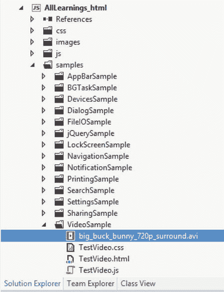
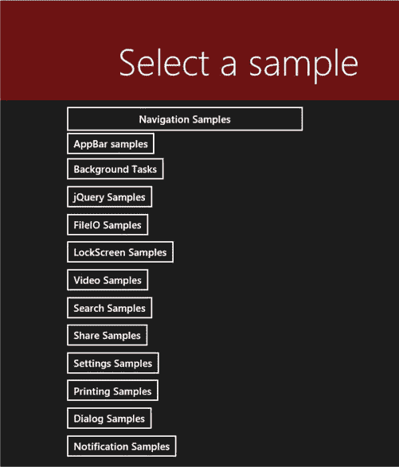
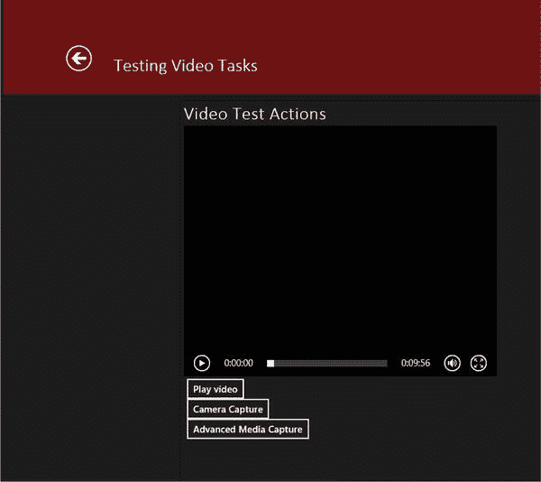
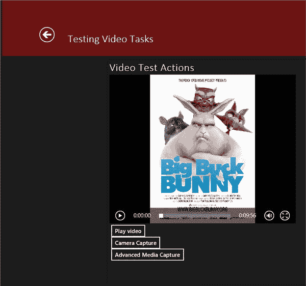
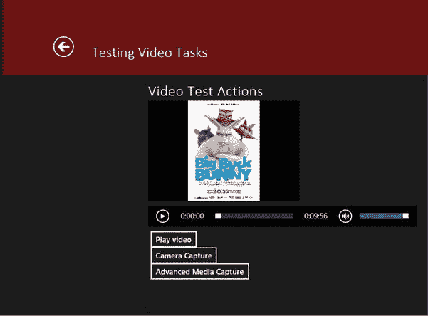
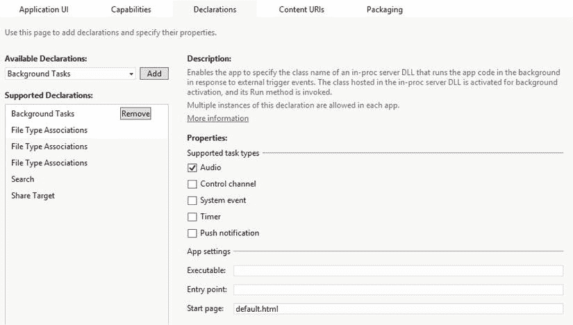
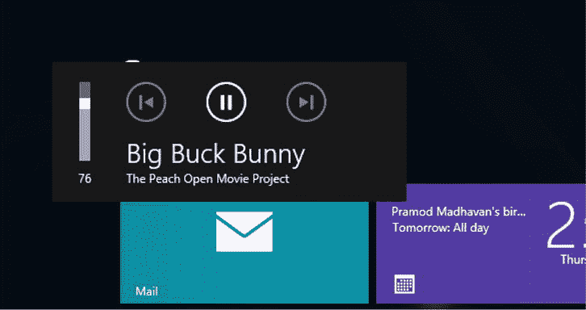

# 四、穿越媒体迷宫

Abstract

媒体体验长期以来一直是微软平台的一个弱点，但这并不是因为这些功能不是系统固有的。Windows 提供了广泛的内置播放和管理功能。该平台的不足之处在于向最终用户公开媒体内容创建和管理工具。如果您了解 DirectX 或任何底层 API，那么您就可以继续这样做了。但是传统上，这种技术的应用范围并没有远离那些有资金雇佣具有这种知识的资源的组织。

媒体体验长期以来一直是微软平台的一个弱点，但这并不是因为这些功能不是系统固有的。Windows 提供了广泛的内置播放和管理功能。该平台的不足之处在于向最终用户公开媒体内容创建和管理工具。如果您了解 DirectX 或任何底层 API，那么您就可以继续这样做了。但是传统上，这种技术的应用范围并没有远离那些有资金雇佣具有这种知识的资源的组织。

微软通过 Windows Store 应用发布了 Windows 8，改变了这一局面。Windows Store 应用的编程界面旨在确保提供现代、快速和流畅的应用。作为一个全方位的内容创建和消费平台，Windows 8 凭借其广泛的媒体支持功能脱颖而出，这些功能通过 Windows Runtime (Win RT)和 Windows Runtime for JavaScript 向开发人员公开。

## 媒体播放

如果您曾经从事过 Windows 窗体开发，您就会知道媒体播放曾经是多么可怕。在 Windows Presentation Foundation/Silverlight、Flash 和 HTML 5 之前，Windows 平台上的媒体播放涉及使用一种称为 ActiveX 的技术将 Windows Media Player 播放用户界面嵌入到播放目标中。无论是在网页中还是在桌面应用中，Windows media playback 都是一种完全断开的体验，甚至需要最终用户下载并安装附加组件才能访问媒体。

在 Windows 8 JavaScript 应用中，微软选择保持该语言完全符合 HTML 5。为此，媒体播放遵循使用熟悉的`video`标签的模式。从上一章对页面和导航的讨论中，你可能已经注意到，当你需要从应用中引用 HTML 时，你使用相对路径来实现。这也符合标准的 HTML 模式和实践。可以想象，回放媒体至少需要指定要回放的媒体的位置。在 Windows 应用中，用于回放的媒体可以来自两个地方(一般来说):它可以是机器本地的，也可以来自某个远程源 web 资源。本地媒体以与 HTML 内容(以及应用中需要引用的任何其他类型的内容)相同的方式放置在项目结构中。在图 4-1 中，我已经将我计划播放的视频内容放在了我的项目结构中。本练习使用了 [`www.bigbuckbunny.org`](http://www.bigbuckbunny.org/) 中的大巴克兔子视频。你可以直接从 [`www.bigbuckbunny.org/index.php/download/`](http://www.bigbuckbunny.org/index.php/download/) 下载一份录音。

图 4-1。

Project structure with video added

这当然是一个比前一章中使用的更加复杂的项目结构。尽管它有更多的文件夹，但模式保持不变。即使主 HTML 文档不再是主要内容区域，您也可以使用应用级导航来帮助您在页面之间移动。(当然，从概念上讲，它仍然是主要文档；其他“页面”仅仅是被注入其中。)本节并不详细介绍每个示例，而是为将托管其余应用的应用提供基准。让我们从应用的主框架开始。

### 设置项目

在第三章中，当你深入研究导航机制时，你设计了主页面`default.html`以两种视图显示其内容。在最上面的部分是承载所有页面的框架；在它的下面是可以用来从一个例子到另一个例子导航的按钮。您在这个项目中重用这个公式来创建一个布局和导航结构，允许您在一个项目中构建所有的示例。当然，您可以自由地以对您有意义的方式组织您的示例项目。不管它们是在同一个项目中还是分开的，它们都应该运行相同的程序。(请注意，您需要在为不同的示例创建不同的项目的场景中包含所有适当的引用。)清单 4-1 显示了示例浏览器项目的 HTML 布局。

Listing 4-1\. HTML Layout for Example Browser

`<!DOCTYPE html>`

`<html>`

`<head>`

`<meta charset="utf-8" />`

`<title>AllLearnings_html</title>`

`<!-- WinJS references -->`

`<link href="//Microsoft.WinJS.1.0/css/ui-dark.css" rel="stylesheet" />`

``

``

`<!-- AllLearnings_html references -->`

`<link href="/css/default.css" rel="stylesheet" />`

``

`</head>`

`<body>`

`
`

`

`

`<header aria-label="Header content" role="banner" style="margin-top: 0px;`

`vertical-align: bottom;">`

`<h1 class="titlearea win-type-ellipsis" style="margin-left: 100px;">`

`<button id="btn_back" class="win-backbutton" aria-label="Back" type="button"`

`style="margin-left: 0px; margin-right: 20px; visibility: collapse;"></button>`

`Select a sample`

`</h1>`

`</header>`

`
`

`
`

`
`

`</body>`

`</html>`

在您看到这段代码的用户界面之前，您需要将清单 4-2 中的代码添加到应用启动部分。这确保了示例页面的内容宿主在应用启动时加载一些内容。在这种情况下，它加载了一个页面，这个页面将所有的例子都作为页面上的按钮列出。

Listing 4-2\. Application Startup Handler for the Example Browser

`if (args.detail.kind === activation.ActivationKind.launch)`

`{`

`args.setPromise(WinJS.UI.processAll().then(function ()`

`{`

`WinJS.Navigation.navigate("/samplelist.html");`

`}));`

`}`

基本上是一个按钮列表，代表你的应用可以显示的每个例子。从本章开始，这些按钮中只有一个是适用的，但是您仍然要将它们都添加到这里。每当你用一个新的例子开始一个新的章节时，应用这里强调的模式取决于你。你知道基于主题要激活的按钮。清单 4-3 显示了示例列表页面的用户界面。

Listing 4-3\. UI for the Example Listing Page

`<!DOCTYPE html>`

`<html>`

`<head>`

`<meta charset="utf-8" />`

`<title>SampleList</title>`

`<!-- WinJS references -->`

`<link href="//Microsoft.WinJS.1.0/css/ui-dark.css" rel="stylesheet" />`

``

``

`<link href="SampleList.css" rel="stylesheet" />`

``

``

`</head>`

`<body>`

`<section aria-label="Main content" role="main" style="margin-top: 5px; margin-left: 100px;">`

`
`

`
`

`

`

`
`

`
`

`
`

`

`

`
`

`<input id="btn_navsamples" type="button" value="Navigation Samples"`

`style="width: 353.55px; height: 35.89px;" />`

`
`

`
`

`<input id="btn_appbarsamples" type="button" value="AppBar samples">`

`
`

`
`

`<input id="btn_backgroundtasks" type="button" value="Background Tasks">`

`
`

`
`

`<input id="btn_jquery" type="button" value="jQuery Samples">`

`
`

`
`

`<input id="btn_fileio" type="button" value="FileIO Samples">`

`
`

`
`

`<input id="btn_lockscreen" type="button" value="LockScreen Samples">`

`
`

`
`

`<input id="btn_video" type="button" value="Video Samples">`

`
`

`
`

`<input id="btn_search" type="button" value="Search Samples">`

`
`

`
`

`<input id="btn_share" type="button" value="Share Samples">`

`
`

`
`

`<input id="btn_settings" type="button" value="Settings Samples">`

`
`

`
`

`<input id="btn_printing" type="button" value="Printing Samples">`

`
`

`
`

`<input id="btn_dialogs" type="button" value="Dialog Samples">`

`
`

`
`

`<input id="btn_notifications" type="button" value="Notification Samples">`

`
`

`
`

`</section>`

`</body>`

`</html>`

图 4-2 显示了应用运行时的样子。

图 4-2。

App UI for the example browser

清单 4-4 显示了这个页面的 JavaScript 代码，用于点击按钮启动视频示例。像这样的事件处理程序应该放在正在执行的页面的`ready`函数中。在这种情况下，那将是`samplelist.js`。

Listing 4-4\. Event Handler Code for When the Video Button Is Clicked

`btn_video.onclick = function ()`

`{`

`WinJS.Navigation.navigate("/samples/videosample/testvideo.html"`，ⅵ

`"Testing Video Tasks");`

`};`

注意到这个`navigate`用法的有趣之处了吗？在第三章的中，当你使用`navigate`时，你只传递了一个参数:你要导航到的 HTML 文件的 URL。现在你要传递一个额外的参数:字符串`"Testing Video Tasks"`。第二个参数用于将状态信息从导航页面传递到被导航的页面。这是在两个页面之间传递上下文信息的好方法，而不必创建全局状态。清单 4-5 展示了如何使用`WinJS.Navigation`的`navigated`事件将这个值传递给页面呈现函数。如果你还记得第三章的话，全局导航需要在根主机页面的 JavaScript 代码中。这是托管所有其他页面的主 HTML 页面的 JavaScript(类似于框架在基于 web 的 HTML 页面中的工作方式)。对于这个项目，这是`default.js`文件。在主应用函数中，您可以将其插入到主声明之后和调用`app.start()`之前的任何地方。注意，在默认项目配置中，`default.js`位于项目的`js`文件夹中(见图 4-1 )。

Listing 4-5\. JavaScript for the Main HTML Page

`WinJS.Navigation.addEventListener("navigated", function (args)`

`{`

`//find the frame`

`var frame = document.getElementById("frame");`

`//clear the frame`

`WinJS.Utilities.empty(frame);`

`if (WinJS.Navigation.canGoBack)`

`btn_back.style.visibility = "visible";`

`else`

`btn_back.style.visibility = "collapse";`

`if (args.detail.state != null)`

`txt_title.textContent = args.detail.state;`

`//render the location onto the frame`

`args.detail.setPromise(WinJS.UI.Pages.render(args.detail.location, frame`，ⅵ

`args.detail.state));`

`});`

您从这段代码中调用了两件事。首先，使用`state`的值在根页面上设置一个标题——这个想法是用户总是知道他们在哪里。其次，根据导航栈是否允许后退来设置后退按钮的`visibility`状态(最初是不可见的)。为了支持向后导航，将清单 4-6 中的代码添加到应用的`activated`事件处理程序中(应用启动代码位于`default.js`)。

Listing 4-6\. Code to Handle Backward Navigation

`var btn_back = document.getElementById("btn_back");`

`btn_back.onclick = function ()`

`{`

`WinJS.Navigation.back();`

`};`

### 媒体播放

当您点击视频样本按钮时，您应该会看到如图 4-3 所示的屏幕。

图 4-3。

Video sample user interface

你能猜出生成这个页面的 HTML 是什么吗？当然，对于经验丰富的 web 开发人员来说，这样的页面是微不足道的(这样做是为了将重点主要放在 Windows 8 开发上，而不是 HTML 布局实践)。清单 4-7 显示了它是如何组成的。注意，到目前为止，还没有使用 WinJS，所以这个页面理论上可以毫不费力地移植到 web 上。

Listing 4-7\. HTML for the Video Sample

`<!DOCTYPE html>`

`<html>`

`<head>`

`<meta charset="utf-8" />`

`<title>TestVideo</title>`

`<!-- WinJS references -->`

`<link href="//Microsoft.WinJS.1.0/css/ui-dark.css" rel="stylesheet" />`

``

``

`<link href="TestVideo.css" rel="stylesheet" />`

``

``

``

`</head>`

`<body>`

`
`

`
`

`
`

`Video Test Actions`

`
`

`
`

`<video id="player_video" style="width: 500px; height: 400px"`

`src="/samples/videosample/big_buck_bunny_720p_surround.avi" autoplay></video>`

`
`

`
`

`
`

`
`

`<button id="btn_playvideo">Play video</button>`

`
`

`
`

`<button id="btn_capture">Camera Capture</button>`

`
`

`
`

`<button id="btn_advancedcapture">Advanced Media Capture</button>`

`
`

`
`

`
`

`
`

`
`

`</body>`

`</html>`

现在不要担心按钮`btn_capture`和`btn_advancecapture`；当你进入 Windows 8 应用中的媒体捕获机制时，会详细讨论它们。在本例中，最终用户无法控制回放开始的时间。由于`autoplay`属性，回放在这里立即开始。您可以将回放控制委托给用户，如清单 4-8 所示(当然也去掉了`autoplay`反馈)。

Listing 4-8\. Video Playback

`<video id="player_video" style="width:500px; height:400px"`

`src="/samples/videosample/big_buck_bunny_720p_surround.avi"``controls`

当然，您也可以使用 JavaScript 通过应用控制回放。清单 4-9 使用 JavaScript 来播放视频(您也可以使用 JavaScript 的`pause()`函数来停止或暂停视频)。

Listing 4-9\. JavaScript Video Playback (Playing Video)

`btn_playvideo.onclick = function ()`

`{`

`player_video.play();`

`};`

除了`autoplay`和`controls`之外，您还可以对`video`标签应用其他各种属性。这些包括但当然不限于以下内容:

*   `muted`:告诉视频控制静音
*   `poster`:允许您指定一个 URL，该 URL 指向视频不播放时显示的图像
*   `loop`:告诉视频控制在视频结束后重启视频

清单 4-10 显示了`poster`属性的用法。可以想象，在用户决定播放视频之前，它对描述视频内容非常有用。你可能在 YouTube、AOL 和 MSN 等热门网站上看到过这种技术，诱使你播放视频。

Listing 4-10\. Adding a Poster to the Video Tag

`<video id="player_video" style="width: 500px; height: 400px"`

`src="/samples/videosample/big_buck_bunny_720p_surround.avi"`

`poster="/samples/videosample/Big_buck_bunny_poster_big.jpg"` `controls></video>`

在这种情况下，您使用项目文件夹中的文件作为图像(该图像文件也可以来自任何 web 资源)。我选择使用大巴克兔子电影的海报，可以在下面的维基共享网址找到: [`https://commons.wikimedia.org/wiki/File:Big_buck_bunny_poster_big.jpg`](https://commons.wikimedia.org/wiki/File:Big_buck_bunny_poster_big.jpg) 。你当然欢迎使用任何对你有意义的图像。

运行此示例时，可以看到图像直接显示在视频控件中。只要视频处于停止状态(像这样的媒体可以播放、暂停或停止)，它就会一直保持在那里。图 4-4 显示了播放开始前视频控件的外观。

图 4-4。

Poster associated with the `video` tag

使用`video`标签，您还可以直接从后端 web 服务器播放媒体。清单 4-11 显示了这一点。

Listing 4-11\. Server-side Video Playback

`<video id="player_video" style="width:500px; height:400px"`

`src="` [`http://sample.com/samples/videosample/big_buck_bunny_720p_surround.avi`](http://sample.com/samples/videosample/big_buck_bunny_720p_surround.avi) `"`

`controls></video>`

为了让这个示例工作，您必须将 Internet 客户端功能添加到您的应用清单中，如第一章中所述。互联网客户端授予 Windows 8 应用访问互联网的权限。没有它，你就不能通过任何 API 连接到任何基于云的资源。

Windows 8 中的`video`控件是`HTMLMediaElement`的子类。它可以用来播放视频和音频。如果你确定除了音频(也许是一个游戏介绍序列或一个音乐流应用)之外没有其他需要，那么你可以使用`audio`标签。像`video`标签一样，`audio`标签可以用来回放视频和音频内容，但需要注意的是`audio`标签只能回放音频(不呈现视频)。尝试用清单 4-12 中的代码替换清单 4-11 中的 HTML。

Listing 4-12\. Playing Only Audio

`<audio id="player_video" src="/samples/videosample/big_buck_bunny_720p_surround.avi"`

`controls></audio>`

现在，当你点击播放视频按钮，只有与大巴克兔子视频相关的声音播放。您可能还会注意到，现在只有视频控件的底部(带有播放/暂停按钮的部分)是可见的。当我说`audio`标签不播放任何视频时，我是认真的。

当然，如清单 4-13 所示，`audio`标签也可以用于从远程服务器传输音频，方式与`video`标签相同。

Listing 4-13\. Streaming Only Audio from a Remote Server

`<audio id="player_video" src="`[`http://sample.com/samples/videosample/`](http://sample.com/samples/videosample/)ⅳ

`big_buck_bunny_720p_surround.avi" controls></audio>`

到目前为止的例子使用了一个视频，大巴克兔子，它使用 AVI 文件格式。Windows 8 支持音频和视频播放的多种编码类型和文件格式。来自 MSDN 的表 4-1 显示了所有支持的媒体格式。

表 4-1。

Supported Media Playback Formats

<colgroup><col> <col> <col> <col></colgroup> 
| 媒体文件容器或文件格式 | 文件扩展名 | 媒体流格式(编解码器) |
| --- | --- | --- |
| 录像 | 声音的 |
| --- | --- |
| MPEG-4 | `.3g2` | H.263 H.264(基线、主、高)MPEG-4 第二部分 SP 和 ASP | AAC(拉加、HE) |
| `.3gp2` |
| `.3gp` |
| `.3gpp` |
| `.m4a` | 不适用的 | AAC (LC、HE) MP3 AC3 (DD、DD+) |
| `.m4v` | H.263 H.264(基线、主、高)MPEG-4 第二部分 SP 和 ASP |
| `.mp4v` |
| `.mp4` |
| `.mov` |
| MPEG-2 | `.m2ts`(如 AVCHD) | H.264 | MPEG-2 (L1，L2，立体声仅限)MPEG-1 (L1，L2) AAC (LC，HE) AC3 (DD，DD+) |
| 格式 | `.asf` | VC-1 WMV9 战斗机 | WMA 标准 WMA 语音 WMA 无损 WMA 专业 AC3 (DD，DD+) |
| `.wm` |
| `.wmv` |
| `.wma` | 不适用的 |
| 阿德特 | `.aac` | 不适用的 | AAC(拉加、HE) |
| `.adt` |
| `.adts` |
| MP3 文件 | `.mp3` | 不适用的 | MP3 文件 |
| 声音资源文件 | `.wav` | 不适用的 | PCM MP3 MS ADPCM IMA ADPCM MS CCITT g . 711 MS GSM 6.10 AC3(日、月+) |
| 影片格式 | `.avi` | MPEG-4 第二部分 SP 和 ASP 运动-JPG H.263 未压缩 | PCM MP3 MS ADPCM IMA ADPCM MS CCITT g . 711 MS GSM 6.10 AC3(日、月+) |
| AC-3 | `.ac3` `.ec3` | 不适用的 | AC3 (DD、DD+) |

您可以在 [`http://msdn.microsoft.com/en-us/library/windows/apps/hh986969.aspx`](http://msdn.microsoft.com/en-us/library/windows/apps/hh986969.aspx) 直接访问该表。

### 视频/音频效果

您可以为视频播放器中播放的视频或音频添加效果。要添加任何效果，可以使用`video`类的`msInsertVideoEffect`方法。清单 4-14 在`btn_playvideo`事件处理程序中增加了一行。

Listing 4-14\. Adding a Video Stabilization Effect to a Video Being Played Back

`btn_playvideo.onclick = function ()`

`{`

`player_video.msInsertVideoEffect`

`("Windows.Media.VideoEffects.videoStabilization", false);`

`player_video.play();`

`};`

清单 4-14 应用了框架内置的视频稳定效果。这种效果可以在指定的命名空间中找到。注意，`videoStabilization`不是一个类，而是一个字符串，它表示映射到这个效果的唯一标识符(`ClassID`)。在这样的动画视频中，稳定自然是无效的。但是，如果您有摄像机或照相机拍摄的视频，并且可以在开发 PC 上访问，欢迎您在 PC 上尝试。

### 背景音频

前一节开始深入研究`audio`元素的复杂性。您看到了如何使用`audio`标签来播放位于用户机器上或来自远程服务器的音频数据。然而，当这些音频文件播放时，它们被默认设计为仅在前台播放。在 Windows 8 的世界里，这意味着一旦你离开应用，声音就会停止。现在，您可以通过向您一直使用的示例代码中添加一个新的音频控件来尝试一下。(您先前将`video`标签修改为`audio`标签，以查看两者之间的区别；您不需要为音频创建单独的专用标签。)清单 4-15 显示了到目前为止你一直在使用的修改过的用户界面的摘录，现在有了一个专用的音频控件。该控件以声明方式配置为在加载页面时自动播放。视频控件的尺寸也减小了。

Listing 4-15\. UI with a Dedicated Audio Control

`
`

`style="width: 300px; height: 200px"``style="width: 300px; height: 200px"`

`src="/samples/videosample/big_buck_bunny_720p_surround.avi"`

`poster="/samples/videosample/Big_buck_bunny_poster_big.jpg" controls></video>`

`
`

`
`

`<audio id="player_audio" src="/samples/videosample/big_buck_bunny_720p_surround.avi"`

`controls autoplay></audio>`

`
`

这段代码应该替换前面清单中的部分，它只包含了元素`video`的`div`。或者，您可以添加第二个音频`div`并修改视频`div`以适应列表。在这两种情况下，您都应该有两个媒体控制，一个在另一个上面，所有内建回放控制都在这两个媒体控制上启用。图 4-5 显示了该用户界面的外观。请注意，当您运行它时，音频会立即开始播放(基于您分配给它的`autoplay`属性)。另请注意，当您切换到另一个应用或 Windows 8 开始屏幕时，音频会迅速淡出。

图 4-5。

Test video UI with both video and audio controls

导航回应用，音频再次开始。如果您在导航离开时密切关注媒体的播放时间，请注意，它的值从您导航离开的点开始增加(并且还注意到媒体是从稍后的位置播放的)。这是因为音频一直在播放，而你的示例应用被转移到背景。但是，因为以这种方式配置的音频在托管它的应用对用户不再可见时听不到，所以当您切换到不同的应用时什么也听不到。

启用后台回放需要三个步骤。首先，您需要声明性地告诉 Windows 音频播放器是为背景音频播放而设计的。然后，您需要通知 Windows 您打算让应用在后台运行(为了播放音频)。最后，您需要将应用挂接到背景音频播放基础结构，以便用户可以使用 Windows media 播放控件来控制背景音频。我们开始吧。

在这个`audio`标签中，您设置了几个属性中的一个，如果在`video`元素上设置，这些属性将是无用的:`msAudioCategory`属性。系统使用该属性来帮助识别和管理音频的性能和集成。当它的值被设置为`BackgroundCapableMedia`时，它将通过`audio`元素播放的音频标记为可供背景音频播放器使用。清单 4-16 显示了修改后的`audio`标签。

Listing 4-16\. `audio` Tag Configured for Background Audio Playback

`<audio id="player_audio" src="/samples/videosample/big_buck_bunny_720p_surround.avi"`

`msAudioCategory="BackgroundCapableMedia"` `controls autoplay></audio>`

现在您已经完成了必要的用户界面修改，下一步是转到项目的`package.appxmanifest`配置文件的便捷的声明选项卡。您正在向应用添加一个新的后台任务声明，它支持音频任务。务必在起始页文本框中指定项目起始页，如图 4-6 所示。

图 4-6。

Background audio declaration

你快完成了。现在，您必须修改后面的代码，以启用后台音频子系统的挂钩。这是必需的，以便用户可以在使用另一个应用时识别和控制音频。清单 4-17 添加了管理它的代码。注意一些`audio`元素事件的使用，比如`onplay`和`onstop`。这些都是强大的事件，用于判断视频控件何时播放、暂停、出错以及处于许多其他状态，所以如果您计划构建富媒体应用，请了解它们。

Listing 4-17\. Enabling Background Audio

`(function ()`

`{`

`"use strict";`

`var media_control = null;`

`WinJS.UI.Pages.define("/samples/VideoSample/TestVideo.html", {`

`ready: function (element, options)`

`{`

`media_control = Windows.Media.MediaControl;`

`media_control.onplaypressed = function ()`

`{`

`player_audio.play();`

`}`

`media_control.onpausepressed = function ()`

`{`

`player_audio.pause();`

`}`

`media_control.onstoppressed = function ()`

`{`

`player_audio.pause();`

`}`

`media_control.onplaypausetogglepressed = function ()`

`{`

`if (media_control.isPlaying)`

`{`

`player_audio.pause();`

`} else {`

`player_audio.play();`

`}`

`}`

`player_audio.onplaying = function ()`

`{`

`media_control.isPlaying = true;`

`}`

`player_audio.onpause = function ()`

`{`

`media_control.isPlaying = false;`

`}`

`player_audio.onended = function ()`

`{`

`media_control.isPlaying = false;`

`}`

`Windows.Media.MediaControl.isPlaying = false;`

`Windows.Media.MediaControl.artistName = "The Peach Open Movie Project";`

`Windows.Media.MediaControl.trackName = "Big Buck Bunny";`

`btn_playvideo.onclick = function ()`

`{`

`player_audio.play();`

`};`

`}`，

`});`

`})();`

为了让后台回放工作，您的代码必须至少为`onplaypressed`、`onpausepressed`、`onstoppressed`和`onplaypausetoggle`提供一个事件处理程序。如果这些事件中的任何一个没有被处理，后台回放将不会工作。图 4-7 显示了大巴克兔子音频在后台运行时的背景音频控制器。

图 4-7。

Audio being controlled through the background audio controller

### 向其他设备传输流媒体

您可以将您在应用中回放的媒体连接到任何支持您想要流化的媒体类型的数字生活网络联盟(DLNA)兼容设备。DLNA 是一个非营利性的贸易组织，它定义和管理支持设备间数字内容共享的互操作性标准。例如，支持 DLNA 的电视可以通过家庭网络无线接收来自移动设备的输入。Play To 是一种允许用户使用这些 DLNA 标准将媒体内容从他们的设备流式传输到他们选择的屏幕上的技术。

当用户在显示或播放媒体的应用中选择设备魅力时，一个潜在的播放设备列表就会呈现在他们面前。选择一个播放目标会向已配置为将内容流式传输到播放基础架构的应用发送请求，通知应用呈现它想要流式传输的流。当应用附加流时，编程接口就完成了。清单 4-18 修改了前一个例子的用户界面，引入了一个播放音频和视频的专用按钮。

Listing 4-18\. New UI for the Example App

`<!DOCTYPE html>`

`<html>`

`<head>`

`<meta charset="utf-8" />`

`<title>TestVideo</title>`

`<!-- WinJS references -->`

`<link href="//Microsoft.WinJS.1.0/css/ui-dark.css" rel="stylesheet" />`

``

``

`<link href="TestVideo.css" rel="stylesheet" />`

``

``

``

`</head>`

`<body>`

`
`

`
`

`
`

`Video Test Actions`

`
`

`
`

`<video id="player_video" style="width: 300px; height: 200px"`

`src="/samples/videosample/big_buck_bunny_720p_surround.avi"`

`poster="/samples/videosample/Big_buck_bunny_poster_big.jpg" controls>`

`</video>`

`
`

`
`

`<audio id="player_audio"`

`src="/samples/videosample/big_buck_bunny_720p_surround.avi"`

`msaudiocategory="BackgroundCapableMedia" controls>`

`</audio>`

`
`

`
`

`
`

`
`

`<button id="btn_playvideo">Play video</button>`

``

`<button id="btn_playaudio">Play audio</button>`

`
`

`
`

`<button id="btn_capture">Camera Capture</button>`

`
`

`
`

`<button id="btn_advancedcapture">Advanced Media Capture</button>`

`
`

`
`

`
`

`
`

`
`

`</body>`

`</html>`

清单 4-19 显示了 JavaScript 代码，包括合并 Play To 功能的代码。

Listing 4-19\. Implementing Play To in the Example App

`(function ()`

`{`

`"use strict";`

`var media_control = null;`

`var manager = null;`

`WinJS.UI.Pages.define("/samples/VideoSample/TestVideo.html", {`

`ready: function (element, options)`

`{`

`media_control = Windows.Media.MediaControl;`

`media_control.onplaypressed = function ()`

`{`

`player_audio.play();`

`}`

`media_control.onpausepressed = function ()`

`{`

`player_audio.pause();`

`}`

`media_control.onstoppressed = function ()`

`{`

`player_audio.pause();`

`}`

`media_control.onplaypausetogglepressed = function ()`

`{`

`if (media_control.isPlaying)`

`{`

`player_audio.pause();`

`} else`

`{`

`player_audio.play();`

`}`

`}`

`player_audio.onplaying = function ()`

`{`

`media_control.isPlaying = true;`

`}`

`player_audio.onpause = function ()`

`{`

`media_control.isPlaying = false;`

`}`

`player_audio.onended = function ()`

`{`

`media_control.isPlaying = false;`

`}`

`Windows.Media.MediaControl.isPlaying = false;`

`Windows.Media.MediaControl.artistName = "The Peach Open Movie Project";`

`Windows.Media.MediaControl.trackName = "Big Buck Bunny";`

`btn_playvideo.onclick = function ()`

`{`

`player_video.play();`

`};`

`btn_playaudio.onclick = function ()`

`{`

`player_audio.play();`

`}`

`manager = Windows.Media.PlayTo.PlayToManager.getForCurrentView();`

`manager.onsourcerequested = function (e)`

`{`

`e.sourceRequest.setSource(player_video.msPlayToSource);`

`}`

`}`，

`});`

`})();`

使游戏成为可能的关键因素是`PlayToManager`类。为了讨论这个问题，我必须暂时深入一下魅力条和魅力条编程的主题(在第五章中有更详细的介绍)。一般来说，当用户在你的应用处于活动状态时通过点击一个 charms bar 按钮来选择一个动作时(还有其他高级场景，其中你的应用是不活动的，如第五章中所讨论的)，Windows 会询问你的应用，看它是否支持用户请求的功能。正如您在介绍性章节中看到的，这可以是搜索、共享、设置或设备。通过多功能设备请求播放功能。当用户在你的应用运行时点击设备图标时，会向你的应用发出一个查询，看看它是否有一个播放视频，它愿意使用 Play To 通过网络发送。Windows 通过你的应用处理前面提到的`PlayToManager`类的`onsourcerequested`事件来确定你至少对 Play To 感兴趣。要发布你的内容，只需调用清单 4-19 所示的`setSource`函数，通过调用它的`msPlayToSource`属性，传递一个你想要的源媒体的句柄。

如果你决定在应用中使用(或不使用)Play To，这里有一些临别指南。微软希望，如果你的应用功能中有回放媒体，你就可以将 Play 暴露给 contract(这是一个将 Play 与你听到的其他 charms 结合使用的花哨词)。目前，这是一个请求，而不是命令。此外，由于 Play To 是 Windows 的一项功能，用户可以通过 charms 栏随时请求播放，因此建议在应用的整个生命周期内将媒体播放器保留在范围内。在您创建的示例中，用户在到达视频示例页面之前不会意识到播放功能；当他们离开该页面时，他们就失去了播放《大兔兔》电影的能力，因为该页面已从内存中删除。然而，如果您在用于播放目的的`default.html`页面上有一个可用的根`video`标记，那么用户可以自由地浏览示例应用，而不会出现任何问题。

## 媒体捕获

Windows 8 捕获框架为应用开发人员提供了在应用中捕获照片、音频记录和视频记录形式的媒体的能力。对于任何拥有摄像头的 Windows 8 设备，您都可以使用摄像头捕捉编程接口来录制视频或拍照。最简单的方法是使用内置的`CameraCaptureUI`对话框。

在你进入这个对话框做什么之前，我应该提一下，与 Windows 8 的大多数事情一样，你的应用需要用户许可才能访问运行它的设备的板载摄像头。这意味着您需要向您的`package.appxmanifest`文件添加一些功能。要使用摄像头、麦克风和录像机，必须启用网络摄像头功能。我还建议申请权限，将图片存储在图片库中，并附带网络摄像头功能。这就是所谓的图片库功能。(您需要这些功能以及音乐库功能来运行本节中的示例，所以一定要启用它们。)

`CameraCaptureUI`打开代表相机取景器的全屏模式对话框。当这个对话框被激活时，用户的屏幕看起来如图 4-8 所示。

图 4-8。

Camera capture dialog

您可以指定当通过启动相机捕捉对话框的功能启动相机捕捉对话框时，用户可以使用哪些选项:

*   仅对于图片，选择`Windows.Media.Capture.CameraCaptureUIMode.photo`。
*   对于视频，选择`Windows.Media.Capture.CameraCaptureUIMode.video`。
*   如果你想让用户选择使用对话框来捕捉图片或视频，还有一个选项:`Windows.Media.Capture.CameraCaptureUIMode.photoOrVideo`。

`CameraCaptureUI`还公开了一个名为`PhotoSettings`的属性，它属于`CameraCaptureUIVideoCaptureSettings`类型(相同的名称空间)。此属性可用于在对话框上执行附加配置。例如，您可以使用此设置来切换是否希望用户启用裁剪。我们来看一个用`CameraCaptureUI`类拍照的例子。

首先，回想一下前面的例子中有额外的`btn_capture`和`btn_advancecapture`按钮，您忽略了它们。在清单 4-20 中，你最后为`btn_capture`添加了一个事件处理程序来展示捕捉媒体是多么容易。

Listing 4-20\. Using the Camera Capture Interface to Capture an Image and Place It in the Pictures Library

`btn_capture.onclick = function ()`

`{`

`var capture = Windows.Media.Capture.CameraCaptureUI();`

`capture.captureFileAsync(Windows.Media.Capture.CameraCaptureUIMode.photoOrVideo)`

`.then(function (file)`

`{`

`if (file != null)`

`file.copyAsync(Windows.Storage.KnownFolders.picturesLibrary);`

`});`

`};`

对于简单明了的场景来说，这是很棒的，但是它有两个缺点。首先，全屏模式对话框覆盖了整个应用用户界面，基于您正在构建的应用的类型，您可能不希望这样。其次，它只允许视频和图像捕捉。如果你想更深入地控制你的应用捕获媒体的能力——例如，如果你需要捕获音频——你可以使用`MediaCapture`类来实现。您可以使用清单 4-21 中的代码在 JavaScript 中创建和初始化一个`MediaCapture`对象。

Listing 4-21\. Capturing Media Using the `MediaCapture` Object

`// Create and initialize the MediaCapture object`。

`function initMediaCapture() {`

`var capture = null;`

`capture = new Windows.Media.Capture.MediaCapture();`

`capture.initializeAsync().then (function (result) {`

`}, errorHandler);`

`}`

如果您需要稍微调整一下媒体捕获机制，WinRT 通过`MediaCaptureInitializationSettings`对象提供了这样的机制。配置此设置可让您的应用指定您希望捕获如何发生的详细信息。您可以使用它进行音频采集而不是视频采集，并设定采集的格式。因为某些用例在媒体捕获时是常见的，API 还提供了编码配置文件，可用于快速设置记录格式和结构。清单 4-22 为`btn_advancedcapture`按钮添加了一个事件处理程序，显示了如何使用概要文件来设置音频记录。

Listing 4-22\. Capturing an Audio Recording

`btn_advancedcapture.onclick = function ()`

`{`

`var capture = new Windows.Media.Capture.MediaCapture();`

`var profile = Windows.Media.MediaProperties.MediaEncodingProfile.createMp3`

`(Windows.Media.MediaProperties.AudioEncodingQuality.High);`

`Windows.Storage.KnownFolders.musicLibrary.createFileAsync("recordings.mp3"`，ⅵ

`Windows.Storage.CreationCollisionOption.generateUniqueName).then(function (file)`

`{`

`capture.initializeAsync().then(function ()`

`{`

`capture.startRecordToStorageFileAsync(profile, file);`

`});`

`});`

`};`

清单 4-23 使用同样的模式创建一个使用 WMV 格式捕获视频的概要文件。

Listing 4-23\. Capturing Video

`btn_advancedcapture.onclick = function ()`

`{`

`var capture = new Windows.Media.Capture.MediaCapture();`

`var profile = Windows.Media.MediaProperties.MediaEncodingProfile.createWmv`

`(Windows.Media.MediaProperties.VideoEncodingPropertiesHigh);`

`Windows.Storage.KnownFolders.musicLibrary.createFileAsync("video.wmv"`，ⅵ

`Windows.Storage.CreationCollisionOption.generateUniqueName).then(function (file)`

`{`

`capture.initializeAsync().then(function ()`

`{`

`capture.startRecordToStorageFileAsync(profile, file);`

`});`

`});`

`};`

如果您将清单 4-23 中的代码嵌入到一个应用中，您可能会注意到缺少了一些东西。当应用捕捉视频时，你没有取景器可以看到摄像机当前指向的方向。当您使用`MediaCapture`类进行视频捕获时，没有用于显示取景器内容的内置用户界面(本质上是预览正在录制的内容)。JavaScript 应用的 WinRT 不同于传统的。这是因为它们没有用于呈现媒体捕获预览的内置控件(称为`CaptureElement`)。相反，WinJS 重用了`video`标签来完成这个任务。清单 4-24 中的例子显示了如何在应用中启用视频捕获预览。

Listing 4-24\. Enabling Video Preview

`var capture = new Windows.Media.Capture.MediaCapture();`

`..`。

`var myVideo = document.getElementById("player_video");`

`myVideo.src = URL.createObjectURL(capture);`

`myVideo.play();`

在前面的例子中，一旦捕获被初始化，页面上的一个`video`标记的源就被设置为那个`MediaCapture`对象的对象 URL，它是通过调用`URL.createObjectURL`获得的。将这段代码添加到清单 4-23 中，可以在`video`标签的框架中预览捕获的内容(之前大巴克兔子在这里展示)。

## 摘要

在本章中，您了解了在应用中使用媒体的许多方式。本章的研究结果包括:

*   将本地来源和远程网站的媒体播放集成到您的应用中
*   媒体捕获和在您的应用中实现它的许多方法，以及使用`CameraCaptureUI`可以做的许多事情
*   更强大的`MediaCapture`类，它提供了捕获音频和创建用于捕获视频的定制取景器的功能
*   在保持应用用户界面的重要性的场景中使用`MediaCapture` API(当然，在高级场景中，当您需要捕获管道的较低层次的改进时)