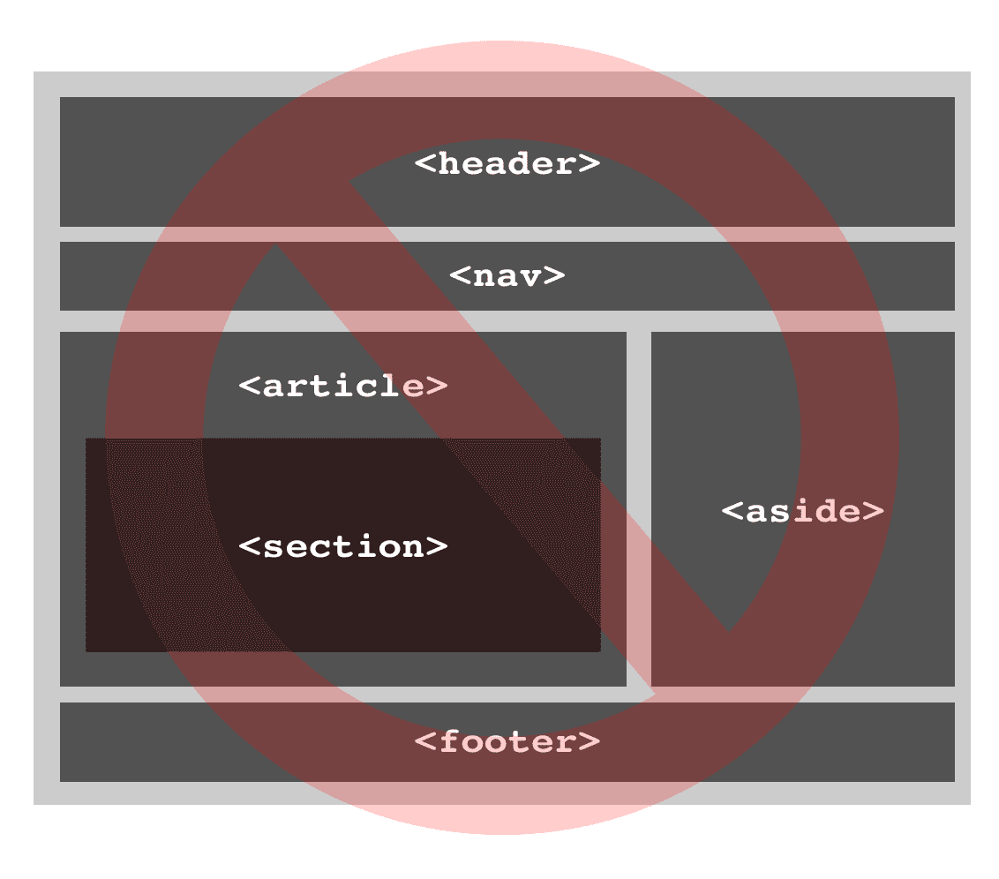

# 三、新的结构元素——这不会有好结果（以及争议）

网页设计者最常见的任务之一是标记页面结构，它通常由页眉、页脚、导航、侧边栏和内容区域组成。这是那种你被蒙上眼睛铐在椅子上旋转五分钟后就能做的事情。

HTML5 引入了一些新元素来帮助我们定义给定网页的结构，比如`<section>`、`<article>`、`<nav>`、`<aside>`、`<header>`和`<footer>`。

我们不应该使用它们。它们是 2004 年由一个人心血来潮编出来的，甚至和 ?? 似乎都忘记了它们的目的是什么。

如果你只需要知道这些，很好。继续使用带有有意义的类名和 ID 名的`
`，以及适当的`<h1>` - `<h6>`标题。它们将永远有效(或多或少)，你不会错过任何东西。

但是，我建议在标记文档时使用一些非 HTML5 的特性，比如为盲人和视力受损的用户使用 ARIA 属性，为搜索引擎结果使用微数据模式(如果合适的话)。(我们将在后面的章节中详细讨论这些。)

然而，我们将深入处理这些新元素，因为每个人都会犯错误。我们将直接记录它们是如何进入规范的，以及它们真正的目的，这涉及到一种完全不同的组织页面的方式。

## 一点痛苦的滋味

以下是这些新结构元素带来的一些问题:

*   他们赋予网页设计者已经使用的术语(如页眉和页脚)新的用途，同时声称只是在做网页设计者已经在做的事情。
*   他们引入了一种新的方法来组织模糊、复杂和不必要的文档。
*   它们严重损害了一些用户的可访问性(特别是那些使用 IE6、IE7 甚至是关闭 JavaScript 的 IE8 的用户)。
*   它们引入了宽泛、不清晰、定义不明确的用例，这将使 web 标准更难学习(也更难教授)。

这些都是严重的问题，对网络标准有害无益。标记应该是轻量级的，易于学习和应用。应该不需要精神体操来尝试和解决在哪里使用什么。

但是这些新的结构标签创造了一种奇怪的、准宗教的体验，你必须向高级牧师(HTML5 大师)咨询他们对模糊的宗教文本(HTML5 规范)的解释，只是为了标记一个该死的网页。

“但是，但是...这些元素在官方 HTML5 规范中！肯定有*必须是一个很好的理由吗？”*

 *继续读...

## 这些元素从何而来？

测验问题:这些元素是如何添加到 HTML5 规范中的？

1.  专家们考虑了各种使用案例，权衡了各种选择和替代方案，并在广泛咨询和仔细审议后，选择了最重要的方案。

2.  web 设计者和 HTML 作者的社区(比如你和我)迫切需要某些元素来实现特定的功能，经过大量讨论后，社区提出了一个必要元素的候选列表。

3.  采用了一种科学的、基于研究的方法，在这种方法中，标记模式被“在野外”研究，并被编码成一堆新元素。

4.  一些标记专家认为这是个好主意，并在 7 年多前就把它们扔进了规范中。

而答案是……(d)。

“但我在[此处插入您选择的 HTML5 书籍]中读到，它更像答案(c)。WHATWG 研究了 ID 和类名的真实用法，这就是它们是如何产生的！”

我们会谈到这一点。

我很好奇是谁添加了这些元素，什么时候添加的，为什么添加。所以我把这些问题问了 HTML5 规范编辑伊恩·希克森，下面是他的回复(经允许转载):

> 我和其他 WHATWG 贡献者在 2004 年左右[添加了它们]，因为在看到作者如何使用 HTML4 后，它们是显而易见的添加元素。我们后来(2005 年末到 2006 年初)做了一些客观的研究，找出前十名的 HTML 类是什么，结果发现它们基本上与我们添加的元素完全匹配，这很方便。

您可能在其他 HTML5 书籍、HTML5 讲座或关于这些新元素的博客文章中读到过这种“客观研究”。但是几乎每个人都在篡改历史。有时他们说研究是第一位的——事实并非如此。有时这只是暗示研究是第一位的，这仍然是一种疏忽。

(实际上，根据正在讨论的研究——http://code.google.com/·韦伯统计/2005-12/classes.html——主要的发现是，在被抽样的 10 亿个页面中，大约 90%根本没有类。如果希克森和 WHATWG 真的遵循了这里的研究，他们早就完全废除了课程！)

那么，如果这些元素不是来自研究，它们是从哪里来的呢？

在探索 WHATWG 邮件列表的黑暗角落时，我发现希克森在 2004 年 11 月首次提到了这些元素，当时他讨论了他白板上列出的块级元素。(参见:[`lists.whatwg.org/ htdig.cgi/ whatwg-whatwg.org/ 2004 年 11 月/002329.html`](http://lists.whatwg.org/htdig.cgi/whatwg-whatwg.org/2004-November/002329.html)。)

在同一个星期，他说“我正在考虑做的是[添加]部分元素[这]将是:`<body>` `<section>` `<article>` `<navigation>` `<sidebar>`”。(你可以在这里看到完整的电子邮件:[`lists.whatwg.org/ htdig.cgi/ whatwg-whatwg.org/ 2004 年 11 月/002362.html`](http://lists.whatwg.org/htdig.cgi/whatwg-whatwg.org/2004-November/002362.html)。)

当然，在这个过程中的某个地方`<navigation>`变成了`<nav>`,`<sidebar>`变成了`<aside>`。

所以这些每个人都想弄明白的新的，主要的结构元素可能被包括在内，因为希克森在 2004 年在他的白板上草草记下了它们。它们实际上为“分割”提供了更广泛的用途(我们很快就会谈到)。但是有必要确定它们是如何出现在规范中的，以及它们有多武断。

在第一章中，我们看到 XHTML 2.0 因为过于雄心勃勃而失败。在 HTML5 中，我们取而代之的是几年前编辑心血来潮在白板上画的一些语义元素，以及当时一些 WHATWG 成员的一些输入。

## 谁在乎呢。

“唉，谁在乎呢？”你可能会想。"如果研究最终支持使用这些元素，那有什么大不了的？"

问题是，在我看来，当希克森说这些新元素“完全符合我们…添加的元素”时，他有点厚脸皮虽然它们与常用元素有着相同的名称，但规范描述了它们在 ?? 的使用方式，与网页设计者和作者所熟悉的方式大相径庭。对于这些网页设计者和作者应该使用的标准来说，这是一个大问题。

当你采用人们使用的术语，重新定义它们应该如何使用(甚至给它们多种用法)，然后告诉这些人不要担心，因为这些术语正是他们已经在使用的，会发生什么？你让他们去混乱之城。

## HTML5 新元素的核心矛盾

HTML5 应该是关于编纂我们已经在做的事情，或者“铺平道路”。当谈到这些新标签和标记基本模板时，他们建议你可以用新标签替换当前的`
`结构标签(例如，用`<header>`替换`
`，就大功告成了。

这无疑是 2007 年 12 月 ALA 文章“HTML 5 预览”中的含义，这个观点在此后的书籍和博客文章中反复出现，通常带有类似下面这样的图形:

图 3.1。这是不对的。不要这样。

用新元素替换旧的看起来很容易，对吗？漂亮、干净的元素取代了一堆随机的`
`，多可爱啊！

不幸的是，这个想法有几个问题:

*   **元素太少。**没有足够的新元素来进行合理的 1:1 替换。相信我，s 不会去任何地方。所以，如果你听到有人说“终于，我可以摆脱我的不性感的东西了！”我允许你用枪打他们的屁股。
*   **不相等。**虽然元素通常被认为是相等的，但事实并非如此。虽然“切片”元素(`<section>`、`<article>`、`<aside>`和`<nav>`)可能工作相同，但`<header>`和`<footer>`元素旨在在切片元素内*工作。这可以产生巨大的差异(我们将很快看到文档大纲)，但是如果你遵循了关于这些元素的大部分讨论，你将永远不会知道。*
*   **不可替代。**当你深入研究 HTML5 规范时，你会发现规范中描述的这些标签*根本不是现有标签的一对一替代。它们实际上是用来创建一种新形式的*文档大纲*。一份文件什么？我们接下来将对此进行探讨。*

这些元素有其他问题(它们没有为语义或搜索引擎添加任何东西)，但我们将在稍后针对这两个不会消亡的僵尸神话时讨论它们。我们还将了解“语义”在标记中的实际含义，以及搜索引擎真正想要的是什么。

## 现在概述什么？

如果你试图理解 HTML5 的新结构元素而不理解*文档大纲*，你会认为它们是一堆任意的、奇怪命名的元素，具有令人困惑的用例。

然而，一旦你理解了*文档概要*，你会发现它们实际上是一堆任意的、奇怪命名的元素，有着令人困惑的用例，也有着可疑价值的总体目的。

当然，这是深奥的东西。但是请耐心听我说，你将会看到 HTML5 是如何试图以一种全新的方式来做一些像构建网页这样基本的事情。这与其说是在铺牛道，不如说是在修建一条新的牛公路。

## 什么是大纲，我为什么要关心？

大纲是文档的一种层次化的要点表示。

实际上，每当我们标记一个文档并使用标题元素时，我们都会制作一个大纲。因此，即使你从未听说过“文件大纲”，你也有可能已经做了一个。很奇怪吧。

我们从来没有听说过它们的原因是因为网页设计师从来不需要使用它们。它们主要被盲人用户用作导航的主要手段。谈到可访问性，轮廓是一个大问题。因此，我们能做的帮助盲人和视力受损的用户浏览文档的最好的事情就是在使用 web 标准时提供一个好的标题结构。(我们将在第四章对此进行更深入的探讨)。

HTML5 试图从根本上改变我们制作这些轮廓的方式...并且维持现有的方式(嗯，有点)。这种新的大纲方法是新 HTML5 标签存在的原因，也是希克森和 WHATWG 最初考虑添加“章节元素”的原因。

## 我们目前是如何创建轮廓的(甚至没有意识到)

让我们后退一点，看看我们目前的大纲。在(X)HTML 中，文档的层次结构是由标题级别决定的，使用熟悉的`<h1>`到`<h6>`标签。

所以你可以这样标记你的页面(作为一个简化的例子)，用标题代表每一部分的“重要性”:

`<h1>My Sweet Blog</h1>
    <h2>Latest Posts</h2>
        <h3>My Blog Post 1</h3>
        <h3>My Blog Post 2</h3>
        <h3>My Blog Post 3</h3>

    <h3>Blog Sidebar</h3>
        <h4>Blog Archives</h4>
        <h4>Popular posts</h4>
        <h4>Blog roll</h4>

    <h4>Blog Footer</h4>
        <h5>My delicious links</h5>
        <h5>My flickr photos</h5>
        <h5>My social networks</h5>` 

文档的层次结构或“大纲”如下所示:

 `1\. My Cool Site
        1\. Latest Posts
            1\. My Blog Post 1
            2\. My Blog Post 2
            3\. My Blog Post 3
            4\. Blog Sidebar
                1\. Blog Archives
                2\. Popular posts
                3\. Blog roll
                4\. Blog Footer
                    1\. My delicious links
                    2\. My flickr photos
                    3\. My social networks` 

哦哦。我们有麻烦了。我们所有的下级标题都被它们上面的标题“拥有”。“博客侧边栏”不应该是“最新文章”下的标题——它应该开始一个新的部分。

如果我们将“博客侧边栏”的标题级别更改为`<h2>`(与“最新帖子”相同)，我们将得到:

`1\. My Cool Site
        1\. Latest Posts
            1\. My Blog Post 1
            2\. My Blog Post 2
            3\. My Blog Post 3
        2\. Blog Sidebar
            1\. Blog Archives
            2\. Popular posts` 

但是现在我们不再代表标题的重要性。相反，我们试图使用一组有限的标签(`<h1>` - `<h6>`)来建立一个逻辑结构，这些标签习惯于“拥有”它们下面的所有东西——即使它们不应该拥有。

这是另一个例子。假设我们有一页写着:

`<h2>My HTML5 Book Review</h2>
        <h3>Likes</h3>
            
It explained some elements of HTML5 well.

        <h3>Dislikes</h3>
            
The author had an annoying habit of writing silly, self-referential examples.

        

        
I bought this HTML5 book for the low, low price of... 

        
` 

在这个文档大纲中，*整个评审*将归入`<h3>Dislikes</h3>`之下，因为标题“拥有”其下的所有内容，尽管它实际上应该归入`<h2>My HTML5 Book Review</h2>`之下。通常这种*结构性*问题会被忽视。然而，让评论文本出现在“不喜欢”下面的*视觉*问题不会*不被注意到，所以出于样式的目的，我们可能会引入一个`
`，以便我们可以在视觉上区分“不喜欢”下面的段落和评论主体本身。*

事实上，这通常是我们组织文档的方式——我们使用`
`将它们分成逻辑部分。但是就可访问性而言，这与文档大纲没有关系——大纲仅由标题创建。

如你所见，标题对于创建轮廓是有缺陷的。人们经常使用标题级别来显示不同的字体大小(有或没有 CSS)，或者表示任意的“重要性”而不是结构。有时他们只是将 HTML 直接剪切并粘贴到一个新模板中。

当你考虑所有这些，以及使用`<h1>` - `<h6>`的局限性时，很明显大多数网页没有像那样的*逻辑轮廓。*

但是他们*确实*有一个大纲，并且使用`<h1>` - `<h6>` *给盲人和视力受损的用户提供了一种导航我们文档的方式，研究表明这对于使用屏幕阅读器的人来说是常见的。(我们一会儿会谈到这项研究。)因此，尽管存在缺陷，出于可访问性的原因，我们需要更认真地对待结构标题*而不是更少。**

(查看任何网站的轮廓(试试你自己的！)，查看一下谷歌 Chrome 的 html 5 Outliner:[`chrome.google.com/网上商店/detail/afoibbobkebhgcfnknfndkgemglgomo`](https://chrome.google.com/webstore/detail/afoibpobokebhgfnknfndkgemglggomo)。)

但是如果有一种方法可以创建任意的轮廓而不依赖标题呢？事实证明，人们已经考虑这个问题很多年了——如果不是几十年的话。

## “切片”是个老问题

标题问题，以及如何组织文档，是一个长期存在的问题。早在 2002 年，XHTML 2.0 就在其第一稿中提出了一个解决方案(参见:【http://www.w3.org/】TR/2002/WD-XHTML 2-2002 08 05/)，其中涉及嵌套`<section>`标签和使用通用`<h>`元素作为标题。

早在 1991 年，蒂姆·伯纳斯·李就提出了 XHTML 2.0 中的“分段”解决方案，正如 Jeremy Keith 所指出的(见:[《http://adactio.com/日报》/ 1683/](http://adactio.com/journal/1683/) )，当时 Berners-Lee 说:

> 事实上，我更喜欢标题(那些来自 AAP DTD 的)有一个可嵌套的
> 
> <section>，而不是
> 
> # 、
> 
> ## 等..
> 
> </section>
> 
> 元素，还有一个通用的<h>..</h>区段内的任何水平将产生所需的航向水平。

是的，整整二十年前。

HTML5 试图通过遵循与 XHTML 2.0 相似的途径将这种分段概念引入主流 HTML，同时还保持了一些向后兼容性。结果是，我们可以说，*混合*。

但是在我们开始 HTML5 的实现之前，让我们看看标题对于可访问性有多重要。

## 如果我们关心盲人用户，我们应该关心标题

正如我们之前提到的，在 HTML4 中，是像`<h2>`博客侧边栏`</h2>`这样的标题(而不是像`
`博客侧边栏`
`这样的随机`
`标题)创建了文档大纲。对于盲人用户来说，这些标题很重要。

有多重要？在对 1000 多名屏幕阅读器用户的调查中(其中 80%的人是盲人，16%的人视力受损):

> 对这个问题的回答给了我们最大的惊喜。很明显，提供标题结构对于 76%的屏幕阅读器用户来说是很重要的，当标题可用时，他们总是或经常通过标题导航。标题导航的使用随着屏幕阅读器熟练程度的提高而增加，90.7%的专家用户、79.3%的高级用户、69.9%的中级用户和 55.4%的初学者经常使用标题导航。

(你可以在这里看到完整的结果:[`webaim.org/项目/screenreadersurvey/#标题`](http://webaim.org/projects/screenreadersurvey/#headings)。)

你意识到了吗？我没有，多年来我一直在随意地使用`<h1>` - `<h6>`。我想大多数网页设计师都有一些模糊的想法，认为`<h1>` - `<h6>`标签很重要，但不知道它们对盲人用户有多重要。

因此，我们有了一个既定的、直接的、易于实现的方法来为盲人和视力受损的用户提供轮廓。也就是说，直到我们击中 HTML5。

## HTML5 的“改进”大纲在发布之前就已经死了

我们已经建立了什么是文档大纲(页面的项目符号、目录样式表示)，并且我们已经建立了它们当前是如何创建的(使用`<h1>` - `<h6>`元素)。

简而言之，HTML5 建议如何创建文档大纲:

*   大纲中的每个要点或“章节”都使用四个“章节”元素之一来定义:`<section>`、`<article>`、`<nav>`和`<aside>`；而不是`<h1>` - `<h6>`元素。这里的意图是解决`<h1>` - `<h6>`的局限性。(我们将在下一章探索这些新元素。)
*   按照 XHTML 2.0，没有通用的`<h>`元素。但是在纯 HTML5 中，建议我们可以在任何地方使用`<h1>`作为通用的标题元素。事实上，*html 5 中的任何*标题元素都将被视为通用标题，其级别由它在 sectioning 元素中的嵌套深度决定。
*   但是没有“纯”HTML5 这样的东西，所以我们需要保持向后兼容性。因此，我们仍然应该在逻辑上使用`<h1>` - `<h6>`，这意味着在一个文档中维护*两个*稍微不同的文档轮廓。

大概就是这个意思。以下是该规范的表述([`www.whatwg.org/规范/网络应用/当前工作/多页/章节. html #标题和章节`](http://www.whatwg.org/specs/web-apps/current-work/multipage/sections.html)):

> 节可以包含任何级别的标题，但是强烈建议作者要么只使用 h1 元素，要么对节的嵌套级别使用适当级别的元素。

请不要到处使用`<h1>`元素！

在我看来，每个人(规范和公开评论中的希克森，社区中的标准倡导者，以及一般的设计师和作者)都在沟通这一点上犯了一个完整的错误。

这种不良的沟通意味着设计者和开发者一直在使用这些 HTML5 元素，而不理解他们所创建的轮廓。这些元素应该带来更好的逻辑文档大纲。相反，考虑到它们实现的随意性，他们创建了 HTML5 风格的文档大纲，甚至比他们打算取代的基于`<h1>` - `<h6>`的大纲更加*破碎。*

HTML5 版本的大纲实际上在任何人理解它之前就已经死了，更不用说正确地实现它了。

具有讽刺意味的是:这种方法，理论上可能会在未来带来可访问性的好处(没有人知道屏幕阅读器何时或者是否会使用这些轮廓)，现在正在摧毁一小部分 IE 用户的页面风格*。因此，它已经造成了伤害，但没有明确的未来利益。(我们将在下一章详细讨论这个问题。)*

 *我们仍将在第四章探索这些新的 HTML5 元素，但主要是为了让你明白它们有多糟糕。(记住，很酷的 HTML5 会在后面的章节中介绍。)

## 偷偷摸摸的大创意会导致死创意

这种新的概述方法的第一个问题是 HTML5 只是“铺路”和编纂现有实践的想法。

很明显，引入一种全新的组织文档的方式，不管沟通多么糟糕，都不是“铺路”。

你不能回头告诉作者和设计师，“这就是你一直在做的！”但是希克森做到了，他说新元素只是为了保存普通的类名。这里只是几个例子。

2009 年，([`lists.w3.org/档案馆/Public/Public-html/2009 aug/0717.html`](http://lists.w3.org/Archives/Public/public-html/2009Aug/0717.html))希克森说:

> 根据最常见的 class= " "属性值，它们或多或少满足了 Web 开发人员最常见的请求。它们的主要目的是简化创作和样式。

而在 2012 年([`lists.whatwg.org/皮佩尔梅尔/whatwg-whatwg.org/ 2012 年 1 月/034506.html`](http://lists.whatwg.org/pipermail/whatwg-whatwg.org/2012-January/034506.html)):

> 大多数情况下，这些新元素使创作变得更加容易。

因此，如果 HTML5 要引入一个大的新想法，它需要传达这个大的新想法。相反，看起来希克森不记得，或者懒得争论，他和 WHATWG 加入规范的大想法。

HTML5 的拥护者(以及规范本身)需要恰当地传达新元素的目的，或者废除它们。

就像现在一样，他们只是在给网页设计社区施加压力。

我举个例子。规范说`<header>`和`<footer>`元素定义了部分中的区域*，但是没有定义部分本身，因此不会出现在文档大纲中。这是大多数人都会犯的错误，包括那些通过书籍和博客教授 HTML5 的人，他们的例子经常显示`<header>`与`<section>`不相上下。规范还说`<header>`和`<footer>`可以在每个页面上多次使用(例如，每个部分一次)，但是你永远不会从大多数 HTML5 资源中找到这一点。*

这些观点可能看起来很迂腐，不切实际。但是它们说明了一些非常严重的事情——社区正试图以一种与实际的 HTML5 规范没有太大关系的方式实现 HTML5 标记。这是一种不经意间出现的奇怪的标记中间状态，因为这是每个人都认为这些元素应该被使用的。

## 我们分了规格

在某种意义上，就标记而言，社区已经分叉了 HTML5。这是个大问题。有 HTML5 的“常见(但不正确)理解”分支，还有实际的 HTML5 规范。但是遵循“共识”并用“听起来正确”的元素替换模板中的可视区域对任何人都没有好处。我们只是在误用新元素的时候创造了一个奇怪的、破碎的轮廓。有这么多破碎的 HTML5 大纲，大纲作为一个概念在到达时几乎已经死亡。

一会儿我们将分别探讨每个元素，但现在让我们继续关注全局。

## 我们应该如何构建一个 HTML5 页面？

目前所有这些可能看起来有点混乱，所以让我们后退一步，看看在 HTML5 中构造页面的一般规则(例如！)，如规范中所述:

*   我们应该使用`<section>`、`<article>`、`<nav>`或`<aside>`在*大纲*中创建一个新的*部分*。(即文件大纲中的新项目符号。)你可以用 Chrome 的 HTML5 Outliner 插件看看你的轮廓是什么样子:[`chrome.google.com/网络商店/detail/afoibbobkebhgfnnknfndkgemglgomo`](https://chrome.google.com/webstore/detail/afoibpobokebhgfnknfndkgemglggomo)。是的，这里的术语很笨拙——拥有多个元素，包括`<section>`,在文档大纲中创建一个部分是相当混乱的！
*   我们在每一节中用`<header>`或`<footer>`或*来划分该节*的页眉或页脚*。该部分可以是从根<主体>部分到单个注释的任何内容。(单个注释应该是一个`<article>`，我们将在第四章看到，它将在文档大纲中创建一个部分。)*
*   我们使用标题元素(`<h1>` - `<h6>`)在大纲中给每个部分一个标题，并提供向后兼容性。(在我写这篇文章的时候，任何地方都没有对 HTML5 大纲的有意义的支持，似乎也不会有。所以“向后”兼容实际上可能是“可预见未来的兼容”。)

你可能认为你可以用`<section>`代替所有的`
`来创建一个大纲。然而，`<section>`不会用在你只需要一个样式挂钩的情况下，所以在一个真正的 HTML5 文档中你仍然会有大量的`
`。事实上，一个“正确的”HTML5 文档应该有:

*   一堆`<section>`、`<article>`、`<nav>`和`<aside>`标签来创建轮廓
*   一堆造型用的`
`
*   多余地使用`<h1>` - `<h6>`标签来尽可能好地复制大纲(这是屏幕阅读器将实际使用的)
*   在每个部分中有少量多余的`<header>`和`<footer>`标记，它们不做任何事情。

简化创作？用两种方法构建页面，维护两个轮廓，添加一堆多余的标签？

我不这么认为。这还是在我们考虑设计标题样式之前。

## HTML5 风格有点疯狂

让我们想象一个纯粹的 HTML5 未来，按照规范的建议，我们可以在任何地方使用`<h1>`作为通用标题元素，并且我们使用新的 sectioning 元素来创建轮廓。也就是说，如果我们使用三段深度的`<h1>`，它本质上就是一个`<h3>`。

假设我们想要将这个三段深度的`<h1>`设计成一个`<h3>`。我们怎么把它挑出来？如果四个元素可以创建一个部分，并且可以以任意组合的方式使用，你能想象在级联的任何地方挑选 h1，给它不同的级别不同的风格吗？你会睡不着的。

在标题恰如其分的博客文章《不要使用 HTML5 节来设计标题》([`www.stubbornella.org/ content/2011/09/06/Style-Headings-Using-HTML5-Sections/`](http://www.stubbornella.org/content/2011/09/06/style-headings-using-html5-sections/))中，妮可·沙利文谈到了当你试图通过层叠来设计 html 5 风格的`<h1>`元素时会出现的疯狂，并给出了这个简单的例子:

`h1{font-size: 36px}
section h1{font-size: 28px}
section section h1{font-size: 22px}
section section section h1{font-size: 18px}
section section section section h1{font-size: 16px}
section section section section section h1{font-size: 14px}
section section section section section section h1{font-size: 13px}
section section section section section section section h1{font-size: 11px}`

然而，正如沙利文指出的那样，那是大大简化了的*版本。当你必须设计所有(比如说)六层深度的标题时，真正的疯狂就开始了，这些标题可能嵌套在`<section>`、`<article>`、`<aside>`或`<nav>`的任意组合中。对于喜剧价值，看看这样的样式表会是什么样子:[`github.com/ cboone/hypsometric-CSS/blob/master/html 5/html 5-defaults . CSS # L426`](https://github.com/cboone/hypsometric-css/blob/master/html5/html5-defaults.css#L426)。这太疯狂了。*

那么唯一的选择就是依靠类名作为标题，但是在创作时避免类名正是 WHATWG 试图解决的“问题”。

你认为我们的客户和乐于创建和编辑网页的同事会理解正确划分文章的细微差别吗？我对此表示怀疑。

难怪人们会感到困惑。

哦，最重要的是，你的`<nav>`(以及任何其他新的 HTML5 元素)的风格可能会让大约 1%的用户失望。(我们很快会再次谈到这一点。)

这就是 HTML5 的方式。而且很乱。

毫不奇怪，即使是最有经验的 web 作者也会陷入 HTML5 大纲的泥潭。在这里了解一下罗杰·约翰逊的经历，例如:[`www.456bereastreet.com/档案/2011 03/html 5 _ sectioning _ elements _ headings _ and _ document _ outlines/`](http://www.456bereastreet.com/archive/201103/html5_sectioning_elements_headings_and_document_outlines/)。

## 这不是无关紧要的——人们必须教这些东西

“好吧，也许在这一点上，涨价的书呆子们弄错了。可能这些标签大多是多余的。所以没人用，或者做的不太对。谁在乎呢，加价学究先生？”

事情是这样的，将这些新元素——以及任意轮廓等概念——引入官方 HTML5 规范意味着人们*实际上必须教授这些东西*。(见鬼，一些设计师甚至教他们的孩子这些东西——例如，看看 Cameron Moll 的很酷的 HTML5 白板磁铁:【http://cameronmoll.tumblr.com/邮报】10688505696/html 5-白板磁铁。)

这对网络标准是不利的。它甚至让基本的 HTML 变得难教、难学、难实现，这是为了什么？构建一个网页应该是我们最不担心的事情——不会让一代学生和专业人士分心。

(那些教学网络标准的注意:如果你真的讨厌你的学生，让他们解释一下`<article>`和`<section>`的区别。)

## 这给我们留下了什么？

希克森和 WHATWG 的意图是好的。理论上，即使不考虑大纲，使用这些标签也可以提高可访问性。(例如，屏幕阅读器可以跳过`<nav>`标签直接进入内容。)但迄今为止，生产屏幕阅读器的厂商对 HTML5 兴趣不大。而且已经有人支持更好的替代方案，我们接下来会看到这一点。

所以我们不需要 HTML5 的新元素来实现可访问性。事实上，我们应该避免它们对另一部分用户造成的伤害。

人们仍然会使用这些标签，主要是因为他们想“做正确的事情”，希望标准仙女会在他们的枕头下留下零钱和/或苹果产品。但这只是浪费生产时间，这些时间可以更好地用在更重要的事情上。

请记住:最终出现在规范中的往往只是几个(甚至一个)感兴趣的、聪明的普通人在 7 年多前(截至本文写作时)的想法。甚至有可能他们不记得他们为什么想要它。所以我认为我们被允许对什么是最好的有不同意见，并且挑选我们实现的东西。

但是可访问性会怎么样呢？我们只是让视力受损的用户保持现状吗？不，因为幸运的是有更好的选择。

## 一种合理的可访问性结构化标记方法

有一种方法可以在我们的标记中为盲人和视力受损者添加助手*而不用*陷入 HTML5 的新结构元素——ARIA roles 的泥潭。

事实上，这是 WAI-ARIA，代表“易接近的人显然不做引人注目的缩写”。或者，正如坚持准确性的人可能会告诉你的，这是“网页可访问性倡议-可访问的富互联网应用程序”。(我们就叫它咏叹调吧。)

这不是 HTML5 规范的一部分。相反，它是一个独立的(巨大的)W3C 规范，兼容 HTML5、HTML 4 和 XHTML 1.x。

ARIA 的秘密是`role`属性，可以像这样添加到元素中:

`
`

完整的咏叹调规格很大。非常大。(看到这里:[`www.w3.org/ TR/瓦伊-阿利亚/`](http://www.w3.org/TR/wai-aria/) 。)但是我们将会看到一个叫做*地标*的小子集(参见:[`www.w3.org/ TR/wai-aria/roles # landmark _ roles`](http://www.w3.org/TR/wai-aria/roles#landmark_roles))。

例如，下面是一个简单页面的四个主要区域:

*   页眉
*   内容
*   补充报道
*   页脚

下面是我们如何用 ARIA 来标记它:

`

    

    

`

别紧张。

当我们讨论 HTML5 元素时，我们将触及我们可以使用的角色，并在第四章中重述。

## ARIA 优势

与 HTML5(或以前的 HTML 版本)相比，ARIA 角色有几个好处:

*   角色通常反映了 web 作者如何构建页面。(例如，标题或“横幅”是用于页面顶部的内容，而不是像 HTML5 那样用于页面的每个部分。)
*   它们使我们的标记保持相对干净，因为我们可以使用属性选择器将`role`属性作为 IE7 和更高版本的样式挂钩，比如`div[role="banner"] {border:10px pink;}`。(如果需要支持 IE6 用户，还可以包含冗余类。)
*   它们现在可以在支持 ARIA 里程碑的屏幕阅读器中工作，如 JAWS 版本 10 屏幕阅读器、NVDA 2010.1 和 iPhone IOS4+上的 VoiceOver。(详见[`www.paciellogroup.com/博客/2010/10/using-wai-aria-landmark-roles/`](http://www.paciellogroup.com/blog/2010/10/using-wai-aria-landmark-roles/)。)
*   它们不会像新的 HTML5 元素那样，在关闭 JavaScript 的情况下破坏 IE6-8 用户的样式。

这种技术现在可以帮助盲人用户，不损害网络标准，也不需要你用第二种方式来分割你的文档。

我们将在下一章学习新的 HTML5 元素时，看看合适的 ARIA 标志。

## 布局建议

在我们结束本章之前，让我回顾一下我认为我们应该如何在 HTML5 时代标记页面:

*   我们**不应该**使用新标签。(但我们接下来会看到它们，以及我们应该使用的咏叹调地标。)
*   鉴于盲人和视力受损的用户对标题的依赖程度，我们应该更加认真地对待标题。
*   我们**应该**使用 ARIA 地标来实现可访问性。
*   我们**应该**否则就像我们一直做的那样使用带有语义类名或 id 的`
`。(如果你想尖叫“但是它们没有语义！”，一定要看完关于语义学的第五章。)**