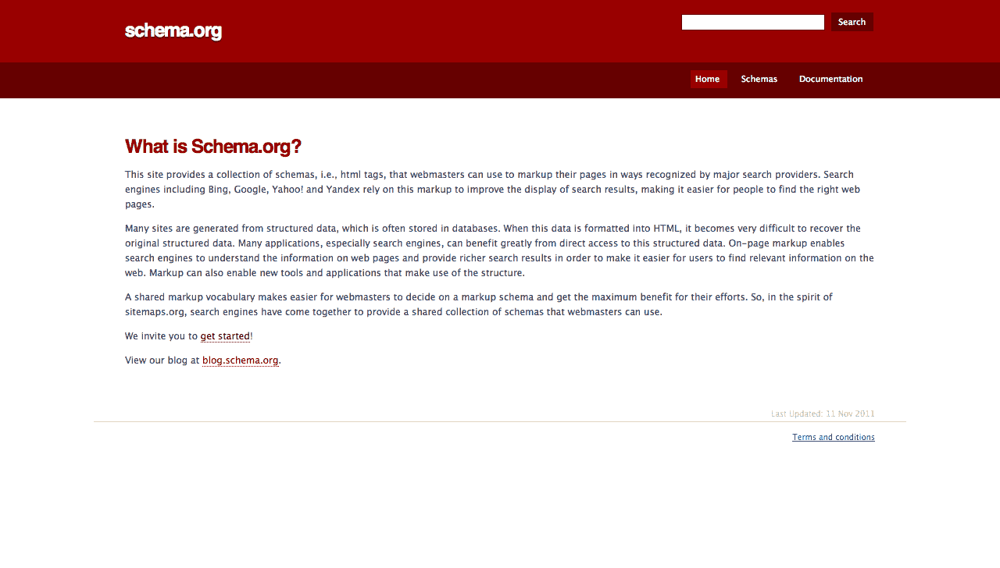
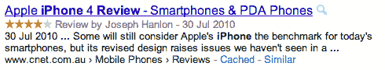

# 五、我们来谈谈语义学吧，宝贝。

关于新 HTML5 结构元素的一个常见说法是它们“更具语义性”。

在我看来，新元素“更有语义”，就像水果味的糖果棒“更有营养”一样——一点也不。

然而，HTML5 中的语义问题给了我们一个很好的借口来快速浏览一下“语义”标记的全貌。我们将看看语义标记从何而来；语义标记承诺提供但从未真正提供的东西；最后，我们将快速浏览一下你现在可以使用的东西——由主要搜索引擎公司(谷歌、微软和雅虎)提出的新模式，有望改善你的搜索结果的显示。

到本章结束时，你的标记书呆子 dar 将被调整得如此之好，你将能够把那些把“语义”作为一个时髦词汇的标记装腔作势者与那些仍然在等待语义网到来的铁杆标记书呆子区分开来...

## 简而言之，语义学

说到 web，实际上有两种“语义”——给定网页的本质标记和所谓的语义 web。让我们从我们作为网页设计师每天练习的语义标记开始。

“语义标记”是网络标准运动的基石之一。2003 年，Jeffrey Zeldman，也许是语义标记和网络标准最著名的倡导者，在他的博客([`www.zeldman.com/日报/ 0303a.shtml`](http://www.zeldman.com/daily/0303a.shtml) )上写道:

> CSS 与精益语义标记的结合使得网站更快、更易移植、更易访问。这种结合有助于站点在更多的现有环境中工作，并且是为尚未开发的环境做准备的最好希望。

对于网页设计师来说，这是理论和实践上的一个重大变化。正如 Zeldman 所说，我们会将页面的所有样式信息保存在一个单独的 CSS 文件中，并用“精简的语义标记”来描述内容。

下面是 Zeldman 在 2002 年的一篇数字网络文章中使用的语义标记的一个例子([`www.digital-web.com/文章/999 _ of _ websites _ are _ obsolete/`](http://www.digital-web.com/articles/999_of_websites_are_obsolete/))。首先，Zeldman 从一个电子商务网站上借用了一些“不具意义”的标记来展示我们正在远离的东西(当你读它的时候不要害怕):

`<td width="100%"><b>Join now!`

然后，用 CSS 处理样式，标记就变成了:

`<h2>Join now!</h2>`

瞧，它就在那里:精简的语义标记，我们现在几乎认为是理所当然的。在实践中，这是一个巨大的、非常值得的转变。

但是是什么让这个例子“语义化”而不是第一个呢？“语义”只是“有意义”的一种奇特说法，通过使用标题标签(`<h2>`)，它现在对浏览器(和屏幕阅读器)来说意味着一些东西——“这是一个标题”。屏幕阅读器可以(也确实)使用这些标题在文档中导航，浏览器可以为这些元素提供默认样式(例如，使其成为块级元素)。

它也让我们人类阅读起来很容易。当我们浏览标记时，毫无疑问这是一段文字——它是一个标题。简单吧？

这突出了“语义标记”中的两个关键群体:人和机器(浏览器、屏幕阅读器、搜索引擎等)。)它应该是“人类可读的”和“机器可读的”——语义标记 101。

“机器可读”语义标记还有其他好处。搜索引擎可以扫描、索引和搜索我们的内容，这种方式在 Flash 网站或纯粹由图像组成的网站(印刷设计师偶尔会粗制滥造)中要困难得多(如果不是不可能的话)。

也就是说，谷歌不太在乎你使用什么标记。

## 这些问题已经解决了

事情是这样的:这些问题的解决方案已经存在十多年了，不管你用的是什么风格的 HTML。搜索引擎可以索引我们的内容，屏幕阅读器可以理解它，我们精简的语义标记使它易于阅读和维护。

然后学究们接手了。

网页设计圈的人开始想“嗯，如果*语义*好，那么*更语义*一定更好，对吧？”

不完全是。

除了人类可读性和基本的机器可读性之外，“更多的语义”没有任何意义(讽刺！).但这并没有阻止人们讨论哪些元素更具语义性或更合适，这十有八九与讨论它是“splade”(或者更准确地说，对你们这些坚持己见的人来说是“splayd”)还是“spork”一样有用。(显然是 Splade。)

## 没有“更多”语义这回事

我谦卑地提议，在关于 HTML 元素的网页设计讨论中，禁止无限制地使用“更多语义”。

每当你听到有人说某事“更有语义”，问他们这个简单的问题。

“给谁的？”

如果他们只能说“但是...更有语义！”，他们只是无中生有地含糊其辞。但是如果他们说类似“对屏幕阅读器来说更有语义性”这样的话，*那就是*一个我们可以评估的有效声明。

屏幕阅读器*真的*为这些“更多语义”的元素做了什么不同的事情吗？它们是否得到支持？或者它们会像 HTML5 元素第一次使用时那样导致错误吗？(见:【http://www.accessibleculture.org/ ?? 博客/2010/11/html 5-plus-aria-sanity-check/)

(记住:由于没有 JS IE6-8 的问题，使用 HTML5 元素实现可访问性就像用一个孩子来娱乐另一个孩子。)

同样，如果他们说“但是对于搜索引擎来说，它更有语义*，我们可以评估这个特定的声明。谷歌的开发者指南是怎么说的？SEO 社区怎么看？等等。*

但是，请不要在讨论 HTML5 的时候再提出“但是它的语义更加丰富”这样的非限定性说法。这些可疑的假设多年来一直像藤壶一样附在 good ship Web 标准上，现在是我们加速高压软管并清理它们的时候了(假设藤壶实际上是这样被清除的)。

好了，迷你咆哮结束。人类可读性和基本的机器可读性问题已经解决，这就是我们的现状，我们可能希望 HTML5 将带我们前进。但是在我们讨论 HTML5 的方法之前，让我们先来谈谈语义标记背后的重要思想。

## 语义标记的伟大构想——语义网

如果我们能进一步发展语义标记的“机器可读”部分会怎么样？如果机器(尤其是浏览器)可以读取我们的标记，不仅知道出现了什么内容，还知道给定的内容块实际上意味着什么，那会怎么样？

这是语义标记背后的重要思想。如果我们能准确地描述我们页面的内容，特别是 ?? 的内容，那么机器就可以用这些数据做很酷的事情。

这是(或者可能曾经是)部分“语义网”背后的思想——一个由 XML 化的网络驱动的大而广的概念。(在这里了解更多:[`en.wikipedia.org/维基/语义网`](http://en.wikipedia.org/wiki/Semantic_Web)。)网络将是一个完美描述的文档库，用 XML 极其详细地标记出来。许多有影响力的人都相信基于 XML 的未来。事实上，在 2002 年的早期标记示例和`<h2>`的使用中，Zeldman 将 web 标准描述为一种我们可以“从过去的 Web 语言 HTML 过渡到未来的语言 XML”的方式。

然而，正如我们在第一章中所看到的，向 XML 的转变已经死亡，真正的“语义网”的梦想也随之破灭。相反，网络成为了一个奇妙的应用平台，走向了社会化，并继续成为我们所熟知和喜爱的网络。但这并不是人们所希望的首都语义网。

当人们在任何情况下谈论“语义”元素时，无论是 HTML5 还是任何未来的 HTML 发展，我们都需要记住这段历史。他们指的是哪种“语义”——我们每天都在使用的人类和机器可读的基本语义，还是 XML 驱动的语义网的死胡同？

## 语义:还没死，或者，Google & Co 抛出了一个微语义炸弹

实际上，在我们现在使用的精益语义标记和空想语义 Web 之间还有第三种选择——微数据(和微格式),它给我们的标记增加了一层元数据。

(各种方法在这里竞争，特别是微格式、微数据和 RDFa。但是我只是将整体概念称为“微语义”，也称为“结构化数据”。)

使用微语义，我们只需将语义数据嵌入到现有的 HTML 文档中。让我们看看微语义学如何帮助网络上的日常生活。

## 具有真实(微观)语义的电子商务

我们以网购为例。在这里，真正的语义标记理论上可以帮助桌面浏览器(即我们所有人)、使用屏幕阅读器的视障人士和搜索引擎。

桌面浏览器:假设我们正在网上购买一台新电视，并通过访问一些网站来比较特定型号的功能和价格来进行研究。在大多数情况下(好吧，如果你像我一样痴迷于研究)，这意味着将每个网站的相关信息复制并粘贴到一个单独的文档中——这既繁琐又容易出错。

现在，想象一下，如果这些电子商务网站都用一个`<productdetail>`标签和嵌套的`<price>`和`<specs>`标签来标记它们的页面。我们的浏览器可以很容易地找到页面的产品细节部分，只需点击一下，我们就可以将价格和规格添加到比较购物列表中。有了特定的、有意义的标签，你的浏览器——一台机器——可以很快地为你找到、编辑和分类某些信息。毕竟这是他们最擅长的。

**屏幕阅读器:**它也可以帮助盲人或视力受损者。想象一个盲人为一个新的音响系统做同样的研究。如果电子商务页面标有这些`<price>`和`<specs>`标签，理论上它们的屏幕阅读器可以读出*价格和产品规格。然后，他们可以将这些细节保存到他们的比较购物清单中，继续前进。但在此之前，他们必须尝试通过向他们朗读标题和内容来浏览高度复杂的页面。*

搜索引擎:通过正确标注价格和规格，谷歌、必应和其他搜索引擎可以在搜索结果中相当可靠地显示产品价格，改善整体搜索体验。(这实际上现在是可能的，我们将会谈到。)

它们只是当我们拥有真正的语义标记时可能发生的事情的几个例子。机器——浏览器、屏幕阅读器和搜索引擎——可以很容易地挑选出有用的信息，并用它们做一些很酷的事情(比如创建一个比较购物清单)。

问题是，要使用不同的标签来描述这些数据，HTML 规范需要大量不同的标签。每种内容——从诗歌到产品到政策文件——都需要自己的标签，这样机器就知道内容是什么。随着越来越多的标签被添加到规范中，HTML 标签列表实际上是一个小字典，或者说是一个非常大的字典。写 HTML 的作者很可能会失去理智。

好消息是我们*可以*标记我们的内容，使这种比较购物成为可能(特别是搜索引擎例子),而不需要更多的 HTML 标签。我们只是用机器可读的属性和值来注释现有的 HTML。(这个我很快会再讲。)

然而，添加少量 HTML5 风格的新元素并不是通向“更多语义”文档的途径。它们不能帮助机器处理数据，我们的标记变得更加混乱——很难让它更可读。

相反，我们需要一种新的机制来描述这些数据。希望这就是 HTML5 将引领我们的方向。

## 真正的语义学请站出来好吗？

我知道你在想什么。“如果我们有办法添加不污染整个规范的标签就好了。某种可扩展标记语言。”但是正如我们在第一章中看到的，我们尝试了，但失败了。

很明显，我们需要一种方法来扩展 HTML，而不涉及 a)向规范中添加相当于字典的元素，或者 b)尝试 XML 化 web。

还有第三种选择，一群人已经研究各种解决方案好几年了。

简单地说，这个想法是这样的:只需将带有一组约定的术语值的属性附加到我们现有的 HTML 中。下面是一个例子(我已经编好了属性和值):

`
 ... content ...
`

如你所见，这很简单。但是梳理一下术语是值得的，因为不同的术语和实现会使一个简单的想法看起来比实际复杂得多。

我们需要区分微观语义的几个部分:

*   **基础设施:**当*向文档添加*语义数据时，我们可以采取不同的技术方法(例如，我们使用什么 HTML 基础设施)。归结起来就是我们使用哪些属性——现有的`class`属性(微格式)，新的 HTML5 属性，比如`itemprop`(微数据)，或者属性，比如`property`和`content` (RDFa)。毫不奇怪，对事实感兴趣的人会为哪个最好而激动不已。但是是我们说什么，而不是我们怎么说，那就有趣多了。
*   **词汇:**我们所说的——我们在这些属性中坚持的*类*数据——是橡胶上路的地方。我们需要共同努力让它发挥作用。实现数据的人(网页设计者)和可能使用数据的公司(例如搜索引擎)需要就一组稳定的术语——词汇表——达成一致，以描述一篇评论、一个人或一件事，这样每个人都在同一页上。
*   **概念:**然后是围绕不同的方式构建的社区来实现这个基础设施和词汇表，并利用它做一些很酷的事情。

一个一直在用微语义数据做很酷的事情的团体是微格式社区。他们有一个活跃的社区([`microformats.org/`](http://microformats.org/))，一种使用 HTML 作为基础设施的微格式方式(`class`属性)，以及特定的微格式词汇表。这些是微观语义的不同部分，并展示了社区如何能够在网络上以一种有意义的方式来研究语义。

您可能听说过，并且可能在过去实现过微格式。不幸的是，正如我所写的，它的未来或多或少被搜索巨头扼杀了，他们提出了微语义或“结构化数据”的新方法。

## 为什么要关心微观语义？

当我写这篇文章时，谷歌、微软和雅虎！发起了可能是 web 历史上最大的一次将真正的语义引入 HTML 文档的努力。

他们是如何发射的？在匆忙的午休时间，我写了一篇博文，创建了一个拥有“我的第一个 HTML 页面”模板的网站。他们还成功地单枪匹马地激怒了已经投入到这个过程中的每个人，这些人多年来一直在宣扬微语义学。不是一个好的开始。

图 5.1。Schema.org。谁说语义不性感了？哦...所有人。对吧..

## schema . org—语义的未来？

2011 年中期，谷歌、微软和雅虎的一些工程师。决定他们不喜欢当前社区驱动的方法，并宣布他们选择 HTML5 的微数据作为获胜的*基础设施*(即我们应该用来添加微语义数据的 HTML 属性)。因此，他们发布了 Schema.org([`schema.org/`](http://schema.org/))——一个词汇表，或“模式”，主要搜索引擎将使用它来显示更丰富的搜索结果。

这样，微语义派的三个部分都被改变了。基础设施(HTML5 的微数据)、词汇(Schema.org)和驱动因素(公司，而不是社区)都是全新的。

(你可以在这里阅读谷歌的公告:[`googlewebmastercentral.blogspot.com/ 2011/06/introducing-schemaorg-search-engines.html`](http://googlewebmastercentral.blogspot.com/2011/06/introducing-schemaorg-search-engines.html)和微软的公告:[`www.bing.com/社区/网站 _ 博客/b/search/archive/2011/06/02/bing-Google-and-Yahoo-unite-to-build-the-web-of-objects . aspx`](http://www.bing.com/community/site_blogs/b/search/archive/2011/06/02/bing-google-and-yahoo-unite-to-build-the-web-of-objects.aspx)。)

下面是一个更丰富的搜索结果的例子:

图 5.2。谷歌“iPhone 评论”，你会得到类似的结果。请注意包含了多少元数据——评级、审核者、日期和面包屑都在这里。

## 我们以前不能这样做吗？

这类似于谷歌在 2009 年推出的“丰富片段”微语义倡议，你可能听说过(甚至实现过)。但是 Rich Snippets 只支持少数现有的词汇表，并且允许作者在微数据、微格式和 RDFa 之间进行选择。(另外它只得到谷歌的支持。)

现在我们有了一个“认可的”实现基础设施(微数据)，一套集中的词汇表，以及实现它们的一个重要原因:在 Google、Bing 和 Yahoo！。

这是一件大事。

(记住这纯粹是为了搜索结果*显示*，而不是搜索*排名。我们的客户知道这两者的区别是很重要的。)*

值得注意的不是搜索巨头选择了一种基础设施，而是 300 多种词汇，它们可能会在未来几年定义 web 上的语义。这一切都是在没有任何标准流程(或社区参与)的情况下闭门完成的。

## 我们期待已久的语义网？

毫无疑问——这是自很久以前以来，语义在网络上发生的最大的、得到实际支持的事情。

回到第一章，我们看了 XML 应该如何转换 web 上的语义，但是没有。(那只是架构宇航员在工作。)我们还看了 HTML5 是如何添加一些语义元素的，这些元素要么是有害的，要么加起来很少。(向 HTML 本身添加更多元素不是语义的解决方案。)

这种微语义的方法承诺了一条中间道路，感兴趣的社区已经探索了一段时间。让我们先浏览一下现有的方法，然后再来看看 schema.org 的发射(以及它的所有糟糕之处)。

## 微格式

微格式社区在 2004 年启动后，多年来一直在开发和倡导微语义，并取得了一定的成功(参见:[`microformats.org/维基/微格式历史`](http://microformats.org/wiki/history-of-microformats))。来自 http://microformats.org/[关于](http://microformats.org/about):

> 微格式首先是为人类设计的，其次才是为机器设计的，它是一组简单、开放的数据格式，建立在现有的广泛采用的标准之上。微格式并没有抛弃现在有效的东西，而是试图通过适应当前的行为和使用模式(例如 XHTML、博客)来解决更简单的问题。

例如，在 2011 年 2 月，脸书的所有活动都使用微格式发布(见:[`microformats.org/ 2011/02/17/Facebook-adds-hcalendar-hcard`](http://microformats.org/2011/02/17/facebook-adds-hcalendar-hcard%5D))。使用适当的浏览器扩展(如 Chrome 的 Google 日历扩展),事件旁边会出现一个按钮，你可以点击它将详细信息添加到你的日历中。很漂亮，是吧？

microformats.org 的创始人之一坦泰克·切利克对谷歌和微软 schema.org 公司的声明([`twitter.com/ #！/t/status/77083481494142976`](http://twitter.com/#!/t/status/77083481494142976))作何反应？

> #schemaorg 对每个从事 vCard、iCalendar 等开放词汇表工作的人和公司嗤之以鼻。

哎哟。

## 网页摘要和结构化标记

微格式是一种简单、直接、受设计限制的微语义方法。

RDFa(或 Resource Description Framework——in——attributes)是 W3C 处理机器可读数据的更复杂(但更灵活)的方法，自 1997 年以来一直被称为“RDF”。(RDFa 始于 2004 年。)它从未真正以任何显著的方式引起开发人员的兴趣，但它仍然存在。

六月中旬，当关于 Schema.org 公告的争论激烈时，马克·皮尔格林打趣道([`twitter.com/ #！/dive into mark/status/80980932957450240`](http://twitter.com/#!/diveintomark/status/80980932957450240)—链接现在 404s 这是在朝圣者的互联网消失法案之前):

> W3C:自 1997 年以来未能使 RDF 变得可口

赞。

但是现实世界中也有一些有趣的用法，比如用于电子商务的 GoodRelations 词汇表([`www.heppnetz.de/项目/ goodrelations/`](http://www.heppnetz.de/projects/goodrelations/) )可以推动我们前面看到的电子商务示例。

比起 RDFa 的灵活性和复杂性，Web 设计者通常更喜欢微格式的简单性。然而，对微语义感兴趣的社区已经围绕 RDFa 成长起来。

W3C RDF 工作组的现任主席 Manu Sporny 对谷歌和微软的 schema.org 声明作何反应？在《Schema.org 的错误选择》([`manu.sporny.org/ 2011/False-Choice/`](http://manu.sporny.org/2011/false-choice/))中:

> 《Schema.org》是三家大公司伪装下的一小撮人的作品。RDFa 和微格式并不依赖成千上万的 Web 开发人员来构建真正的开放标准。这不是我们在网上做事的方式。

呀。

## 微观数据

最后，我们有微数据，这是 schema.org 使用的新格式。

没有什么比几种相互竞争、略有不同的元数据格式更能迫使 web 作者在他们的页面上添加深奥的元数据了。因此，HTML5 的编辑伊恩·希克森认为微格式太冷，RDFa 太热，于是发明了第三种方法——微数据——他觉得*刚刚好*(可以这么说)。(以下是希克森在 WHATWG 上介绍这一功能的长篇帖子:【http://lists.whatwg.org/·htdig.cgi/·whatwg-whatwg.org/·2009 年 5 月/019681.html。)

注意，就 HTML5 规范而言，微数据是关于提供用于添加微语义的*基础设施*(带有新的有效属性)。它没有指定这些词汇表应该是什么，或者谁应该发明或维护它们。例如，它与 schema.org 的实际词汇完全分离。

从科技巨头的角度来看，这是一种获胜的模式。

(关于各种格式的更长的讨论，以及 Schema.org 的含义，见亨利·西沃宁的优秀的“schema . org 和预先存在的社区”[`hsivonen.iki.fi/ schema-org-and-Communities/`](http://hsivonen.iki.fi/schema-org-and-communities/)。)

## 微观数据和 Schema.org

现在谷歌，微软，雅虎！不仅在推动单一的格式(微数据)，而且也在推动单一的词汇表集，以在 web 上实现真正的语义。

每样东西都有一个特定的词汇(或“模式”):书籍、电影、事件、组织、地点、人、餐馆、产品、评论，凡是你能想到的。(完整名单见此:[`schema.org/医生/full.html`](http://schema.org/docs/full.html)。)

甚至还有识别网页本身的模式，包括页眉、页脚、侧边栏和导航。我猜 ARIA，HTML5 之类的还不够。

如果这种技术开始流行，这是一个很大的“如果”，它将是我们如何标记页面的一场巨大革命——比 XHTML、HTML5 以及接下来的任何 HTML 风格都要大。

“语义网”终于到来了吗？

## 如何不启动新的计划

> " schema.org...没有什么比扔掉多年的词汇/本体工作更好的了”
> —杰·迈尔斯，2011 年 6 月 3 日，[`twitter.com/ #！/杰·迈尔斯/status/7634419867037696`](http://twitter.com/#!/jaymyers/status/76344419867037696)

如果这一新举措的不温不火的推出是值得借鉴的话，那就不会了。这几乎是一个教科书式的案例，告诉我们该做什么，不该做什么。

以下是一些他们本可以处理得更好的事情:

*   **咨询:**Schema.org 的公告不知从何而来——没有咨询社区，也没有提前通知，只是希望“有所作为”。
*   **拓展:**通常来说，惹恼那些多年来一直倡导与你的计划相似的东西的人并不是一个好主意。Google、Microsoft 和 Yahoo！没有让微格式和/或 RDFa 社区参与进来(或者至少鼓励迁移)。完全无视他们。这让他们很不开心。
*   Schema.org 推出时是一个完全普通的网站，几乎没有人性化的一面，只有一个“反馈”按钮。谁编辑的？谁想出来的？我们该和谁谈？流程是怎样的？*有流程吗？就网站而言，这完全是个谜。事实上，常见问题是“谁在持续管理 schema.org？”并回答“谷歌、必应和雅虎！正在持续管理 schema.org。”好吧，我想我们总是可以联系谷歌，必应和雅虎！那么。(公平地说，他们最终在这里建了一个 Schema.org 博客:【http://blog.schema.org/】??。)*
**   新手友好:对于大多数网站设计师来说，微语义是一个相当“另类”的概念。虽然 Schema.org 确实有一本“入门”指南(【http://schema.org/文档】/gs.html)，但如果他们想让除了懂行的超级书呆子之外的任何人学会，它需要一个更友好的解释，说明微语义(包括模式示例)的方式、原因和内容。*   **一个不错的网站:**模式列表最初是以 ASCII 艺术风格的列表呈现的，带有如下可怕的标记([`schema.org/文档/full.html`](http://schema.org/docs/full.html)):

    `  &nbsp;&nbsp;&nbsp;&nbsp;|&nbsp;&nbsp;&nbsp;&nbsp;&nbsp;&nbsp;&nbsp;&nbsp;|&nbsp;&nbsp;&nbsp;&nbsp;<a name=Movie><a href=../Movie>Movie</a>:&nbsp;duration,&nbsp;director,&nbsp;actors,&nbsp;producer,&nbsp;trailer &nbsp;&nbsp;&nbsp;&nbsp;|&nbsp;&nbsp;&nbsp;&nbsp;&nbsp;&nbsp;&nbsp;&nbsp;|&nbsp;&nbsp;&nbsp;&nbsp;&nbsp;&nbsp;&nbsp;&nbsp;&nbsp;&nbsp;&nbsp;&nbsp;&nbsp;&nbsp;productionCompany,&nbsp;musicBy `*

 *(顺便说一下，那是描述电影的。)当他们甚至不能在自己的网站上使用基本的 HTML 语义时，我们应该如何认真对待这些微观语义呢？*(更新:在 2012 年，此标记通过将列表更改为...一个巨大的表格，包含嵌套表格和间隔单元格。去想想。)*

更不用说列出的大量模式(超过 300 个！)，事实上微数据没有被正确执行(见:[`jenitennison.com/博客/ node/ 156`](http://jenitennison.com/blog/node/156) )，或者关于专利的问题(见:[`www.seobythesea.com/？p = 5608`](http://www.seobythesea.com/?p=5608)中途)。真是一团糟。

所有这一切都有可能是自网络诞生以来，网络语义的最大变化。

## Schema.org 背后的人是怎么想的？

谷歌的产品经理 Kavi Goel 参加了 SemTech 2011(“语义技术大会”)的一个讨论 Schema.org 的会议。有些回答并不能激发信心。(参见 W3C 的官方记录:[`www.w3.org/ 2011/06/semtech-bof-notes-smaller.html`](http://www.w3.org/2011/06/semtech-bof-notes-smaller.html)。)

比如(略有删节):

> 伊凡·赫曼:Schema.org 就在那里，...你如何设想未来 schema.org 可能成为一个发展新词汇的地方？我[原文如此]的地方，使它成为一个更加开放的社会进程？
> 
> 卡维·戈尔:我现在还没有一个很好的答案。我不认为任何一家公司想完全拥有它。通过选择 3，我们表明我们(谷歌)不仅仅是在这么做。[...]
> 
> 然后它留下了一个问题，哪里是完全开放的讨论...我们还没有答案，但这很重要。我们需要整理外面的东西。
> 
> 凯文·马克斯:我们的微格式有一个编辑按钮，你们的有一个反馈按钮。微格式的核心是我们达成一致。你说“我们在封闭的房间里做的”。你还没有展示你的作品，你的证据，别人怎么能参与进来。这才是最让人担心的。
> 
> 卡维·戈埃尔:这个观点完全正确。微格式在创建开放社区方面做得很好。
> 
> 对于我们为什么没有那样做，没有一个好的答案。
> 
> 带着一大堆新事物来到微格式可能是一种选择。我们确实想在那里得到一些东西。

在讨论的早些时候，Goel 说:

> 成就是得到了一些东西。我们知道它并不完美。我们可以做得更好。我们希望这是迈向更广泛采用的一步。

希望如此。在这个阶段，急于“弄点东西出来”似乎弊大于利，但他们可以挽回自己。我们现在有了一种格式和一套词汇表用于 web 上的微语义。如果谷歌(和/或微软)真的投入一些资源，并且两家公司中的某个人真的获得了这个项目的所有权，这确实是一件大事。

值得赞扬的是，在 Schema.org 参与的人终于进行了协商，有关各方正在讨论前进的道路。例如，参见:“schema . org Workshop-A Path Forward”[`semanticweb.com/ schema-org-Workshop-A-Path-Forward _ b 23387`](http://semanticweb.com/schema-org-workshop-a-path-forward_b23387)。

另请参见 Schema.org 博客的零星更新，了解进一步的拓展努力:[`blog.schema.org/`](http://blog.schema.org/)。

## 总结:语义和 HTML

当我写这篇文章的时候，Schema.org 声明的影响仍然在网上回荡。但即使如此，我们仍然可以说一些关于语义、HTML 和我们应该做什么的事情:

*   **语义问题:**描述*含义*的真实语义，而不仅仅是*结构，*发生在 HTML 之上的一层*。这似乎是解决网络上长期存在的语义问题的方法。XML 不会给我们带来真正的语义，更多的 HTML 标签也不会。它是我们现有 HTML 之上的一层微语义。*
*   微格式和 RDFa 可能是死路一条:微格式这些年做得非常好，我喜欢它的简单格式。但谷歌和微软的决定让这些格式看起来像是死胡同，微语义生态系统(包括浏览器插件和验证器)可能会转向微数据和 Schema.org 词汇表。当然，Schema.org 也可能彻底失败，微格式社区(就其一而言)可以继续努力。(无论如何，谷歌不会放弃对的任何支持。)
*   **参与进来:**阅读并尝试已经存在的微格式工具(如浏览器扩展和 bookmarklets)来体验微语义的可能性是值得的。但 Schema.org 似乎是未来的事实意味着我们作为一个社区需要研究各种模式并提供反馈。
*   **问题依旧:**关于流程的很多问题(会有吗？)和 Schema.org 的未来仍然没有答案——正如卡维·戈尔所证明的那样，这些问题甚至连煽动者也无法回答。关于它的广泛使用还有更大的问题。主流采用会导致垃圾搜索引擎的尝试吗？(人家当然会去尝试。)会不会都变成“metacrap”(【http://www.well.com/】?? ~多克托罗/metacrap.htm)？我们拭目以待。
*   **蓄势待发:**谷歌和微软对 Schema.org 的“请求原谅比请求许可更好”的态度意味着标准化进程将不会持续数年——最好现在就开始。如果它被广泛采用，我们的网上购物的例子可能最终会成为现实。现在，这里是 2012 年 2 月宣布使用 Schema.org 微语义来描述视频，这是“现在推荐的描述网络视频的方式”:【http://googlewebmastercentral.blogspot.com/】2012/02/using-schemaorg-markup-for-videos.html。
*   **它现在正在被使用:**像**易贝**、 **IMDB** 、**烂番茄**和其他公司已经实现了 Schema.org 的语义，并且正在从他们的搜索引擎结果的改进显示中受益，正如本文所展示的:[`www.seomoz.org/博客/ schema-examples`](http://www.seomoz.org/blog/schema-examples) 。

归根结底，Schema.org 是一个半满的玻璃杯，半空的玻璃杯。我们现在有了一套支持良好的标准语义模式，可以轻松地添加到任何 HTML 结构中。如果我们用谷歌、必应或雅虎搜索。我们可以取得切实的成果。添加语义数据的先有鸡还是先有蛋的问题已经解决，格式已经选定，模式已经发布。

但是匆忙的发布(至少可以说是乏味的)，放弃词汇表的任何标准过程，践踏多年的现有工作是一个沉重的代价。*