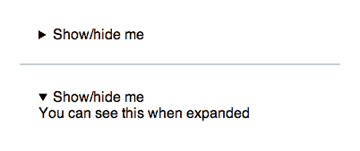

#  七、其他 HTML5 元素：好的、坏的和古怪的

我们已经比较深入地讨论了结构化标记，现在让我们来深入探讨一下本质。HTML5 重新定义了几个内联和块级元素，并引入了更多元素。我们将浏览一些更改和添加，然后考虑这些元素背后更广泛的哲学。

## 大胆尝试，否则就去死

让我们从一些看似无关痛痒的元素开始，比如`<b>`、`<i>`、`<strong>`和`<em>`标签，以及 HTML5 中的变化。

只有在网络标准的土地上，我们才能把像**粗体**和*斜体*这样简单的东西变成教条主义、高级理论和破碎的实用现实的复杂混合体。

当网络标准起飞时，我们都努力将*表示*与*内容*分开。字体标签和表格不再会扰乱我们的标记。相反，我们会用 CSS 来设计我们的页面，并用适当的标签以一种有意义的(即语义)方式来描述我们的内容。

这使得可怜的老标签`<b>`和`<i>`处境艰难。它们表面上是表示性的——它们描述了文本应该是什么样子，而不是它意味着什么——我们正在以手指所能携带的最快速度逃离表示性标签。所以我们都接受了`<em>`标签而不是`<i>`(表示“强调”)，以及`<strong>`标签而不是`<b>`(表示“强烈强调”)。这些新标签现在描述了文本的含义——它被*强调*，并且“强调”的文本看起来(或听起来)如何(理论上)取决于浏览器或屏幕阅读器。然后，我们可以出于纯粹的风格原因使用`<b>`和`<i>`，出于语义目的使用`<strong>`和`<em>`——这是一个微妙的区别，但仍然是一个区别。

我欣然接受了这种变化(你可能也是)，认为这很重要。但事实并非如此。是的，它有助于在表示和语义标记之间划出一条界限，但这是相当狭隘的观点。没有任何实际的好处。例如:

*   **我们只是把一个换成了另一个:**给出的`<strong>`仍然是粗体文本，`<em>`仍然是斜体文本，我们只是把`<b>`换成了`<strong>`，把`<i>`换成了`<em>`，就这样。“强调”的内容和没有任何特别强调的粗体或斜体样式的内容之间的区别已经消失了，因为我们一直在用它们来表达。所见即所得的编辑对此尤其感到内疚。差别太微妙了。
*   屏幕阅读器完全忽略了它们:这些“语义”标签(据说)的主要好处是，屏幕阅读器可以“强调”或“强烈强调”地阅读文本。事实上，总的来说，屏幕阅读器完全忽略了它们。(详见:【http://www.paciellogroup.com/博客/2008/02/screen-readers-lack-emphasis/)进一步讨论。)
*   **搜索引擎不在乎:**谷歌对待`<strong>`和`<b>`，以及`<em>`和`<i>` *完全*一样。(参见马特·卡茨的视频:[`video.google.com/视频播放？docid=-1756437348670651505#`](http://video.google.com/videoplay?docid=-1756437348670651505#) 。)

因此，对于这些元素的所有教条主义，现实非常简单——使用你想要的任何东西。阅读它的人不会在意，阅读它的机器(屏幕阅读器、搜索引擎)也不会在意。

但是这些元素适合 HTML5 的什么地方呢？

我猜如果你正在写一个规范，你必须*尝试*弄清楚这些元素是如何被使用的，并强调(双关语)它们*应该如何*被使用。以下是规范中的内容(重点是附加的):

> `<i>`—`i`元素表示以**替换语音或语气**的文本跨度，或者从正常散文偏移的文本跨度。
> 
> `<em>`—`em`元素代表其内容的**重音**。
> 
> `<b>`—`b`元素表示一段文本，该文本在风格上与普通散文有**的偏移**，但不传达任何额外的重要性。
> 
> `<strong>`—`strong`元素代表**对其内容的强烈重要性**。

HTML5doctor.com 有一整篇文章都在讲述这在理论上是如何工作的(见:[`html5doctor.com/ I-b-em-strong-element/`](http://html5doctor.com/i-b-em-strong-element/%5D))，但这真的是纯粹的虚构。如果你认为人们真的会用这种方式标记他们的文档，我有 150 亿个网页要给你看。正如伊恩·希克森自己喜欢说的那样(【http://www.webstandards.org/】2009/05/13/interview-with-Ian-hickson-editor-of-the-html-5-specification/):

> 如果他们(浏览器供应商)不实现它，这个规范只是一个虚构的作品。[...我不想写小说。

如果 HTML5 规范记录了实际的行为(例如，“铺平道路”)，规范只会说`<b>`和`<strong>`使文本加粗；`<i>`和`<em>`使文本倾斜；屏幕阅读器倾向于完全忽略它们。现实就是这样。其他都是虚构的。

这可能看起来微不足道，但我们已经触及了一个更大的哲学问题:在 HTML 中标记文档有多少是类似文字处理器的格式，标记文本的*有多少是表示*的？对于大多数网络作者来说——通常是我们的客户使用我们为他们建立的内容管理系统——这是关于文字处理器式的格式，*，这没关系*。我们很快会回到这个话题。

## 把你的锚绕在这上面，还有其他一些零碎的东西

让我们快速总结一下 HTML5 中的其他一些特性和元素

### 在块级元素周围环绕锚点

我们现在可以做一些事情，比如在标题和段落周围包裹一个链接，这对于像博客文章这样的项目是很有用的。我们需要设置 wrapping `<a>`元素来显示:block(参见:【http://mattwilcox.net/沙盒/html 5-block-anchor/test.html)否则可能会有意想不到的行为。

(有人报告了火狐 3.5 中的问题(见本文讨论[`www.smashingmagazine.com/ 2009/08/04/designing-a-html-5-layout-from-scratch/# highlighter _ 741571`](http://www.smashingmagazine.com/2009/08/04/designing-a-html-5-layout-from-scratch/#highlighter_741571))，所以在块级元素周围包装链接时要彻底测试。)

### <mark></mark>

我们可以使用一个新的`<mark>`元素来突出显示文本(使用适当的 CSS)，而不是使用`<span class="mark">keyword</span>`。例如，这可以在搜索结果中突出显示搜索关键词。

### 

<figure>和

<figcaption></figcaption>

</figure>

`<figure>`和`<figcaption>`元素让我们标记照片、图表、表格、代码片段或任何其他自包含的内容，这些内容引用自“文档的主要流程”，正如规范所说。所以，我们可能有:

`<figure>````<figcaption>Yup, this is my photo.</figcaption>`

(更多例子见 spec:[`www.whatwg.org/ specs/we B- apps/current-work/multipage/grouping-content . html # the-figure-element`](http://www.whatwg.org/specs/web-apps/current-work/multipage/grouping-content.html#the-figure-element)。)

这些元素可能对可访问性有些帮助(例如，屏幕阅读器可以读出图形及其标题)，但这是一个复杂的问题。更多信息请见史蒂夫·福克纳撰写的这篇内容广泛的文章:【http://www.paciellogroup.com/博客/2011/08/html 5-accessibility-chops-the-fig-the-fig-fig caption-elements/。

这些元素也遇到了我们前面讨论过的相同的 IE6-8 no-JS 样式问题。

新的`<time>`元素主要用于微格式(远在 Schema.org 出生之前),但应该对未来的微语义计划有用。除此之外，`<time>`复杂得令人迷惑。这是 HTML5 元素的戏剧女王，如果`<time>`是一个电视节目，它将是*大胆而美丽的*。

仅在 2011 年，它就被伊恩·希克森取消了，然后在 W3C HTML5 规范中被部分恢复，然后被希克森以一种改进的方式重新添加到 HTML 5-但我们只是称之为 HTML WHATWG 规范中。布鲁斯·劳森(Bruce Lawson)在这里写了关于`<time>`的移除和重现的博客:[`www.brucelawson.co.uk/ 2011/goodbye-html 5-time-hello-data/`](http://www.brucelawson.co.uk/2011/goodbye-html5-time-hello-data/)和这里:[`www.brucelawson.co.uk/ 2011/the-return-of-time/`](http://www.brucelawson.co.uk/2011/the-return-of-time/)。

在 2011 年的所有戏剧性事件之前，它已经成为 WHATWG 邮件列表上的大量辩论的主题(伊恩·希克森在这里总结了 2009 年的一场辩论:[`lists.whatwg.org/·htdig.cgi/·whatwg-whatwg.org/ 2009 年 3 月/018888.html`](http://lists.whatwg.org/htdig.cgi/whatwg-whatwg.org/2009-March/018888.html))。

值得思考的是，HTML5 编辑器如何能够心血来潮地任意删除一个元素，添加一个新的元素(`<data>`)，然后在面临强烈反对的情况下重新发明之前死去的元素，这应该是浏览器制造商可以实现的规范。

(如果你喜欢惩罚，或者刚从某种查理·西恩式的狂欢中走出来，并且*真的*需要睡眠，这里有一个超过 8000 字的关于`<time>`的 WHATWG 维基条目:[`wiki.whatwg.org/维基/时代`](http://wiki.whatwg.org/wiki/Time)。)

那么，我们如何使用这个新的、从坟墓中复活的`<time>`版本呢？

在当前版本中，`<time>`元素允许使用各种字符串，比如年份字符串(2011)、月份字符串(2011-11)、日期字符串(2011-11-12)、带有或不带有秒和微秒的时间字符串(14:54)、日期和时间字符串的组合(2011-11-12T14:54:39.92922)，以及更复杂的带有时区偏移量的字符串(2011-11-12t 06:52

例如，您可以这样使用它:

`<p>The Y2K bug destroyed civilization on <time>2000-01-01</time>.</p>`

这比最初的`<time>`元素更加自由，有效字符串的完整列表请参见规范:[`www.whatwg.org/规范/网络应用/当前工作/#时间元素`](http://www.whatwg.org/specs/web-apps/current-work/#the-time-element)。

`<time>`元素还允许一个机器可读的日期时间值，它可以被固定在`datetime`属性中，在`<time>`标签中有一些更人性化的东西(或者实际上，什么都没有)，比如:

`<p>The Y2K bug destroyed civilization at the <time datetime="2010-01-01"> beginning of this year</time>.</p>`

这对微语义很方便，比如 Schema.org 微数据。

您还可以添加一个 boolean `pubdate`属性来指示一个`<article>`(或者整个文档，如果它不在`<article>`中的话)的发布时间:

`<p>This Y2k article published on <time pubdate datetime="2000-01-01T01:42">Dec 31, 1999</time>.</p>`

(记住一个*布尔*属性通过包含它简单地表示“是”，即“这是出版日期”，或者通过排除它表示“否”——它不接受值。)

### <details>和<summary></summary></details>

新的`<details>`元素可以作为一个显示/隐藏框，而不需要使用 JavaScript。它有一个布尔属性(即独立的，没有值)为`open`，它告诉浏览器默认显示打开的框。但是如果属性不存在，它将被折叠，用`<summary>`元素描述折叠时出现的内容。

这里有一个例子:

`<details>
    <summary>Show/hide me</summary>
    <p>You can see this when expanded<p>
</details>`

这将产生以下结果:



图 7.1。

<details>元件关闭(上图)和打开(下图)。</details>

该规范建议它可以用在复杂的表单中(并以 OSX 的文件信息窗口为例),在那里你想要显示或隐藏某些设置或表单输入。浏览器供应商仍在努力解决默认情况下他们应该如何设计这个样式。目前只有 Chrome 支持。

这是对规范的一个奇怪的补充，也是 WHATWG 的一个奇怪的小创新。JavaScript 或 CSS 驱动的行为的常见模式近年来变得非常普遍(想想标签、下拉菜单、弹出框、灯箱等等)，但是没有人希望在纯 HTML 中复制这种功能。然而，显示/隐藏三角形控件被认为值得包含在规范中。这就是 WHATWG 的 HTML5 的小秘密。

### <small></small>

 <small>一些现有的 HTML4 元素也被重新定义。

例如，`<small>`元素现在意味着“小字”而不是“视觉上的小”。我觉得在游戏这么晚的时候重新定义一个元素的想法很奇怪，但就是这样。

我甚至不知道*是一种`<address>`元素。它是一个块级元素，在 HTML5 中，是给定部分(例如一个`<article>`，可能在`<article>`的`<footer>`)或文档本身的联系信息。该规范明确表示，对于任意的邮政地址，它是*而不是*，应该在`<p>`标签中。如果 WHATWG 的人发现你把它用作了一个任意的邮政地址，那你就等着被人指指点点吧。*

在 HTML5 中,`<cite>`被重新定义为*,排除了*以前可以接受的引用人名的用法。现在只对作品开放。这真的惹恼了杰瑞米·基思，他在 24 种方式上写了这件事(见:[`24ways.org/ 2009/煽动暴乱`](http://24ways.org/2009/incite-a-riot))。同样，HTML 编辑器可以随心所欲地重新定义元素，这很奇怪。这提出了一个问题，我们是否应该为“内联语义”的这些元素而烦恼，这使我们...

## 我们甚至应该使用这些晦涩的小标签吗？

如果新的*功能*出现在浏览器或其他代理中(而不仅仅是 HTML5 规范的内部)，当然，这些元素中的一些可能会不时地被证明是方便的。

但是让我们后退一步，考虑一下纯“语义”文本级元素的更大图景。在讨论`<b>`和`<strong>`以及`<i>`和`<em>`时，我们已经谈到了简单的文字处理器风格的格式和标记含义的问题。现在让我们以`<address>`元素为例。2009 年 11 月，杰克·奥斯本在 HTML5doctor.com([`html5doctor.com/地址元素/`](http://html5doctor.com/the-address-element/) )上写道:

> 自从 1995 年起草 HTML3 规范以来，address 元素就一直存在，并且在 HTML5 的最新草案中继续存在。但是在它创建了将近 15 年之后，它仍然在开发者中引起混乱。那么我们应该如何在文档中使用地址呢？

也许，在 *15 年*之后，是时候重新思考了。我们的目标是什么？我们还要再等 15 年吗？30 年后，网络最终会正确使用`<address>`吗？如果是，那又怎样？

15 年前，我们可能认为‘有一天’有人会用我们精心标记的页面做一些有用的事情。我们现在更清楚了。是时候重新评估了。我们花了 15 年的时间来试验 HTML，看看在语义和功能方面什么是有效的。是时候评估结果了。

如果 HTML5 真的在这里为 cowpaths 铺路，它将为像`<address>`和`<cite>`这样的元素开放定义(而不是收紧定义)，或者更好地让它们完全过时。我们不需要他们。他们什么都不做。HTML 之上的微语义*让它们过时了。搜索引擎已经通过 Schema.org(以及更早的如 Rich Snippets)证明了他们想要微语义，而不是重新定义 HTML 元素。作者对它们没什么用。那么为什么要保留它们呢？*

当谈到标记的这些更好的方面时，这是我们需要承认的事实。文档的 HTML 除了与格式(标题、段落、列表、链接等)明确相关的基本语义之外，其他方面都很糟糕。)，并提供通用的页面结构(使用`<div>` s，现在有一些 ARIA 角色随意散布)，但这就是它的美妙之处；正是这一点让它变得如此普遍和容易理解。

深入研究 HTML5 标记的细节揭示了另一个大杂烩。一些有趣的内容，一些令人困惑的内容，许多关于一些难以置信的小问题的争论，以及缺乏真正推动标记和网络向前发展的一致愿景。

话说回来，在这方面对 HTML 的批评并不新鲜。这是 1996 年，克莱·舍基在他的文章《赞美进化系统》中写的一段话([`www.shirky.com/写作/evolve.html`](http://www.shirky.com/writings/evolve.html)):

> HTTP 和 HTML 是互联网协议的欢呼垫和欢乐蜂鸣器，只有作为精心制作的恶作剧才能理解。对于任何试图在网络上完成任何严肃事情的人来说，很明显，在全球超文本协议的各种实现中，我们有一个最糟糕的可能。
> 
> 当然，除了其他人。

事实就是如此。</small>