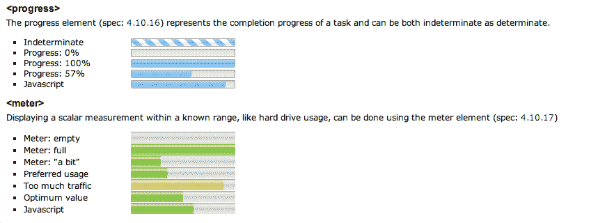
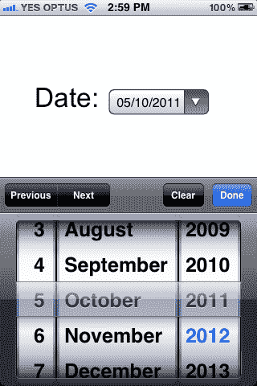

#  八、把这个放进你的表单里，然后让它冒烟

HTML5 表单是 HTML5 历史的一个很好的例子。W3C 的架构宇航员开发了一种基于 XML 的替代 HTML 4 表单的方法，称为 XForms([`en.wikipedia.org/维基/ XForms`](http://en.wikipedia.org/wiki/XForms) )，它在 2004 年 10 月被宣布为 W3C 推荐标准。它很强大，但对网络完全没用。

在 2003 年末，提出了一种替代方案来扩展而不是取代 HTML 4 的表单([`hixie.ch/规范/ html/ forms/ xforms-basic-1`](http://hixie.ch/specs/html/forms/xforms-basic-1) )。WHATWG 称之为 Web Forms 2.0，并最终集成到 HTML5 中。

注意时间框架:2003 年。

WHATWG 在本世纪初至中期所做的工作是为了扩展基本的 HTML 表单，并解决使用 JavaScript 处理复杂表单交互时经常出现的问题。

但是在 2005 年，JavaScript 库的想法越来越流行，Prototype.js 达到了 1.0([`en.wikipedia.org/维基/Prototype _ JavaScript _ Framework`](http://en.wikipedia.org/wiki/Prototype_JavaScript_Framework))，jQuery 在 2006 年达到了 1.0([`blog.jquery.com/ 2006/08/26/jQuery-10/`](http://blog.jquery.com/2006/08/26/jquery-10/))。

Web 应用程序大规模起飞，对可靠的跨浏览器 JavaScript 库的需求变得越来越迫切。像 Prototype.js 和 jQuery 这样的库(以及其他许多已经开发出来的库，比如 MooTools)满足了这种迫切的需求，并且继续被开发，jQuery 的 UI 库在 2007 年末出现([`blog.jquery.com/ 2007/09/17/jQuery-UI-interactions-and-widgets/`](http://blog.jquery.com/2007/09/17/jquery-ui-interactions-and-widgets/))。其他成熟的、专注于 web 应用的 JavaScript 框架也已经出现(参见这里的对比:【http://en.wikipedia.org/维基/JavaScript 框架对比】??)。

在许多方面，这些库提供了 WHATWG 想要嵌入 HTML 的所有功能，而且速度更快。

## 慢慢本土化

尽管如此，原生 HTML5 表单功能开始出现在现代浏览器中，包括 IE10(IE9 及以下版本不支持 HTML5 表单)。虽然浏览器看起来很现代，但功能却不现代。到 IE10 发布的时候，距离 Web Forms 2.0 被提出已经将近十年了，HTML5 表单功能成为主流还需要几年时间(也就是 IE10 的使用变得广泛的时候)。

也就是说，更高级的 HTML5 表单功能也开始出现在移动设备中。例如，在 iOS5 中，一个简单的 HTML5 元素让我们可以访问原生的 iOS 日期选择器小部件。这突出了最好的 web 标准——我们放入一个简单的 HTML 元素，然后浏览器提供适当的小部件。在这种情况下，它是一个基于触摸的小工具，这在本世纪初是不可想象的。

在任何情况下，在未来的许多年里，在桌面上我们仍然会在表单中使用 JavaScript，即使只是为了支持 IE9 和更低版本。现代 JavaScript 库将变得更快，功能更丰富，并提供更多的功能(和样式选项)——所有这一切都发生在 WHATWG 2003 年关于表单的想法被广泛采用之前，这就是近年来浏览器开发的缓慢步伐(尽管有 Chrome)。

尽管如此，今天仍有一些我们可以使用的便利功能(尤其是针对移动设备)，我们将审视其他新功能，看看现在可以使用哪些功能(以及是否应该使用*)。*

 *## 表单可以成就一个网站，也可以毁掉一个网站

设计师对形式有着复杂的感情，从模糊的厌恶到彻底的厌恶。(话又说回来，你可能是一个*形式鉴赏家*和规则的例外。)

然而，我们都需要开始热爱表单——或者至少不那么讨厌它们——因为我们网站的成功可能取决于它。不管人们是想注册、登记、结账还是联系我们，这都可以归结为表单的质量。

糟糕的形式是糟糕的业务，哦，天啊，还有一些糟糕的形式(见:几乎每一个小规模的电子商务网站)。你最不希望看到的是人们在最后一关给你钱，因为你的表现没有达到标准。

另一方面，设计深思熟虑的、人性化的表单(并对它们进行彻底的 A/B 测试)是一笔好生意。有时候是 3 亿美元的好生意:[`www.uie.com/文章/ three_hund_million_button`](http://www.uie.com/articles/three_hund_million_button) 。

我提到这一点仅仅是因为表单在网页设计领域似乎被低估了，尽管它对一个网站的成功至关重要。人们已经写了整本关于表单设计的书(见:[`rosenfeldmedia.com/书籍/网络表单/`](http://rosenfeldmedia.com/books/webforms/) )。

但是现在让我们关注 HTML5 的表单特性。

## 好消息，坏消息

让我们做这个好消息，坏消息风格。

好消息是 HTML5 有了一些新的表单特性，使得表单不再那么依赖 JavaScript 来实现常见的功能，比如客户端验证、范围选择器、日期小部件甚至颜色选择器。

坏消息是 IE9(以及更早的版本)不支持其中任何一个。

好消息是脚本，包括 jQuery 库(例如[`flowplayer.org/工具/`](http://flowplayer.org/tools/) )将让我们在支持的地方使用 HTML5 表单功能，并在浏览器缺乏支持的地方提供后备。

坏消息是，这些表单小部件的一些原生浏览器 UI 比它们将取代的 JavaScript 替代品更差，更难使用，更难(如果不是不可能的话)设计风格。

好消息是，表单的一些新增功能是向后兼容的，并为 iOS 和 Android 设备提供了一些不错的功能，所以你现在可以使用那些功能了。

坏消息是，当我写这篇文章时，大部分主要的 HTML5 表单功能实现不均衡，甚至在非 IE 浏览器中也是如此。因此，我们在实现时需要小心谨慎。

尽管如此，我们今天可以实现一些小事情。所以很快我们将从“不动脑筋的”方面来看 HTML5 表单功能，有点/有点/可能的功能，以及有趣但还没有准备好的功能。

## HTML5 表单资源

在撰写本文时，跟踪哪个浏览器支持哪个表单特性(以及它们实现得有多好)有点像噩梦。随着主流浏览器的快速发布(尤其是 Chrome 和 Firefox ),在这里深入记录谁支持什么没有太大意义，所以在本章中，我们将只是浏览一下主要特性和主要的浏览器支持问题。如果你真的想深入研究 HTML5 表单，请查看下面的参考资料。

如果您正在寻找 HTML5 表单功能的当前浏览器支持和浏览器实现细节的权威细节，请参见 Wufoo 的优秀资源:[`wufoo.com/ html 5/`](http://wufoo.com/html5/)。在我们进行的过程中，我会在 Wufoo 的 HTML5 表单站点上放置特定页面的链接。他们有:

*   完整演示
*   兼容性图表
*   支持/不支持行为的屏幕截图
*   浏览器怪癖的描述
*   JavaScript 回退，等等。

太棒了。绝对值得一试。

其他有用的资源包括:

*   总是得心应手的[`caniuse.com/`](http://caniuse.com/)有很多关于浏览器支持的信息，有给定特性的更多信息的链接。
*   马克·皮尔格林的《深入 HTML5》一书有一个有用的章节，介绍了 HTML5 的一些新形式:[`diveintohtml5.info/·forms.html`](http://diveintohtml5.info/forms.html)。
*   Peter-Paul Koch 有一个方便的新 HTML5 输入和表单属性的兼容性表:[`www.quirksmode.org/ html 5/inputs.html`](http://www.quirksmode.org/html5/inputs.html)。
*   维基百科上有一个广泛的(如果不是特别方便读者的话)浏览器兼容性图表，通过渲染引擎对浏览器进行分类:[`en.wikipedia.org/维基/Comparison _ of _ layout _ engines _(html 5)# Form _ elements _ and _ attributes`](http://en.wikipedia.org/wiki/Comparison_of_layout_engines_(HTML5)#Form_elements_and_attributes)。
*   Opera 的开发者网站对新的 HTML5 表单功能进行了简单介绍:[`dev.opera.com/文章/查看/html 5 中的新表单功能/`](http://dev.opera.com/articles/view/new-form-features-in-html5/) 。
*   在我写这篇文章的时候，IE10 正在进行第四次平台预览。最新版本增强了对 HTML5 表单的支持，所以要小心旧的 IE10 信息暗示某些功能不受支持。先查一下微软的文档:[`msdn.microsoft.com/ en-us/library/hh 673546 . aspx # html 5 _ Forms`](http://msdn.microsoft.com/en-us/library/hh673546.aspx#HTML5_Forms)。

## HTML5 表单:无需动脑

HTML5 引入了一些我们*可以*马上开始使用的东西，特别是电子邮件地址、URL 和搜索术语的输入框。这些是我们熟悉的`<input type="text">`的替代品。好消息是，*不会*识别这些新的输入类型的浏览器会表现得好像这个字段只是`type="text"`。

HTML5 还为我们的输入字段(如`autofocus`和`autocomplete`)引入了各种新的*属性*，其中一些我们将在这里看到，其他的我们将在下面触及。这里的属性我们通常可以直接开始使用，因为浏览器支持相当好，并且浏览器的*缺乏*不是特别重要。

## 新的输入类型:电子邮件、网址、电话号码和搜索

HTML5 引入了一系列新的输入类型，iOS 和 Android 设备目前使用这些输入类型来显示适合该输入类型的键盘。有时这些接触是微妙的(电子邮件输入类型包括“@”键，url 输入类型得到一个“.”。com "键等。)并且有时它们更明显(例如，电话号码输入`tel`类型得到一个数字键盘)。

具有有用的移动键盘变体的新输入类型(至少适用于 iOS 和 Android)包括:

*   **邮箱:** `<input type="email">`
*   **URL:** `<input type="url">`
*   **电话号码:** `<input type="tel">`
*   **搜索:** `<input type="search">`

图 8.1。不同输入类型的 iOS 键盘变体。

这些输入类型不仅在移动环境中有用——它们(尽管是搜索)也应该提供客户端验证。因此，在 Firefox 4+、Chrome、Opera 和 IE10 中，如果您使用`type="url"`作为例子，并且用户没有提供有效的 URL，您将得到一个类似这样的错误气泡(每个浏览器都有自己的变化):

图 8.2。使用新的输入类型还在支持的浏览器中提供了一些输入验证。

对于不同的输入类型和不同的浏览器，验证的实现是不均衡的(例如，`tel`根本没有指定的默认验证)，所以要小心行事。(当然，客户端验证只是为了方便用户。)

对这些验证错误进行样式化目前是高度实验性的。例如，WebKit 中有一些实验性的 CSS3 伪元素，允许您设计错误气泡。你可以在这个文档的末尾看到语法和结果:[`trac.webkit.org/ wiki/Styling % 20 form % 20 controls`](http://trac.webkit.org/wiki/Styling%20Form%20Controls)。

搜索输入字段与我们讨论过的其他三个字段略有不同——规范不要求浏览器做任何特殊的事情，但是一些浏览器(尤其是 Safari)在搜索字段的角落，可能会提供以前搜索的列表，并在您输入内容时提供一个清除按钮(一个带 x 的圆圈)。

如前所述，较老的浏览器只是将这些字段视为`type="text"`，所以现在使用这些输入类型没有坏处。

有关更多信息，请参见 Wufoo 文档:

*   电子邮件:[`wufoo.com/ html 5/types/1-email.html`](http://wufoo.com/html5/types/1-email.html)
*   URL:[`wufoo . com/html 5/types/3-URL . html`](http://wufoo.com/html5/types/3-url.html)
*   电话号码:[`wufoo.com/ html 5/types/2-tel.html`](http://wufoo.com/html5/types/2-tel.html)
*   搜索:[`wufoo.com/ html 5/类型/5-search.html`](http://wufoo.com/html5/types/5-search.html)

(还有其他新的 HTML5 输入类型，如`range`、`number`、`date`、??、，我们将在下面的“我还不会……”部分。)

## 属性:自动完成、自动聚焦、只读和拼写检查

### 自动完成

`<input type="text" autocomplete="off">`

HTML5 指定了一个`autocomplete`属性，这个属性对于关闭浏览器自动完成功能*(自动完成功能默认是打开的)特别有用。当浏览器的自动完成建议不合适(例如，规范建议的一次性授权密钥)或令人困惑(例如，当用户应该输入另一个名称时，自动完成建议用户的名称)时，您可能希望这样做。支持只出现在最近的现代浏览器中，根本没有 IE 支持。尽管如此，也没什么坏处。*

 *### 自（动）调焦装置

`<input type="text" autofocus>`

boolean `autofocus`属性在页面加载时自动将焦点分配给给定的输入。要看到这一点，最快的方法是去[`google.com`](http://google.com)——搜索框会自动聚焦，你可以马上开始输入。这通常是用 JavaScript 完成的，但是对于一些用户来说这可能是一件麻烦的事情。例如，我的焦点现在在谷歌的搜索框中，我不能使用 delete 键返回我的历史记录中的一页——它认为我想删除搜索栏中的文本。

为了解决这个(相当温和的)问题，HTML5 将这种自动聚焦功能转移到标记中，而不是依赖于 JavaScript，因此您的浏览器可以(理论上)通过首选项或扩展禁用它。

IE9 不支持`autofocus`，但是 Mark Pilgrim 在这里详细介绍了一个后备脚本:[`diveintohtml5.info/ forms . html #自动对焦`](http://diveintohtml5.info/forms.html#autofocus)。

### 只读

`<input type="text" value="You can’t touch this" readonly>`

HTML5 指定了一个被广泛支持的(不言自明的)布尔`readonly`属性。

### 拼写检查

`<input type="text" name="captcha" spellcheck="false">`

使用`spellcheck`属性，我们可以按照`autocomplete`属性，对默认浏览器行为施加一些控制。例如，我们可以对不适当的字段关闭它，如验证码。你必须指定`spellcheck`应该是`true`还是`false`。

## HTML5 表单:有点可能

这里有几个 HTML5 表单特性，在某些情况下可能会有帮助，或者至少可以让你在博客上进行试验。这里的浏览器支持可能是混合的；实现可能有所不同；并且应该考虑回落。

### 属性:占位符

HTML5 为表单字段引入了占位符文本，这是一个受欢迎的附加功能。设计者喜欢它，因为它允许我们将字段标签(或支持文本)放在字段本身中，并设计更紧凑的表单。在非 IE 浏览器(Firefox 3.7+，Safari 4+，Chrome 4+，iOS4+，Opera 11+)中支持很好，IE10 也会支持。

这个占位符文本的语法也非常简单。只需将`placeholder="My placeholder text"`添加到给定字段:

`<input type="search" placeholder="Hit enter to search!">`

图 8.3。活动中的占位符属性。

整洁，对不对？那么，为什么这是在“有点，也许”部分？

*   **无样式:**对样式化占位符文本的支持目前还处于试验阶段(参见本讨论:【http://stackoverflow.com/】questions/2610497/change-an-inputs-html 5-placeholder-color-with-CSS)。
*   **没有 IE9(及以下版本)支持:**IE9 及以下版本缺乏支持是一种耻辱，因为这在其他方面得到了很好的支持。缺乏对 IE9 的支持意味着我们必须在一段时间内提供替代方案，这可能会引发一些棘手的问题。幸运的是，Modernizr 特征检测脚本(【http://www.modernizr.com/】??)可以在适当的时候帮助提供后备。
*   回落是棘手的:然而，回落并不总是合适的。我们可以退回到 JavaScript，但是 JavaScript 占位符对于一些细节(例如用户名和密码)会干扰浏览器内置的自动完成功能，这会变得很难看。
*   转化率的一致性:这是回退比原生更好的问题。如果(如果！)现代的基于 JavaScript 的占位符文本提高了表单的可用性(从而提高了它的转换率，如果你真的下定决心，你可以通过 A/B 测试来发现),那么它应该用于*所有的*浏览器，不管它们是否支持 HTML5。事实上，如果 JavaScript 选项给了我们更多的设计灵活性，为什么还要使用原生功能呢？就目前而言，大多数 HTML5 表单功能都是如此。

HTML5 的简单占位符文本在简单的情况下可能是好的(当有支持时)，但是当转化率(和设计灵活性)都很重要时，JavaScript 解决方案通常会提供更多的灵活性(并且看起来更好启动)。

对于一个简单的特性来说，这需要考虑很多。希望占位符文本支持会成熟到这些问题没有实际意义的地步，但我们将等待 IE10 成为主流之前，发生这种情况。

更多信息，请参见:[`wufoo.com/ html 5/属性/01-placeholder.html`](http://wufoo.com/html5/attributes/01-placeholder.html)

`<progress value="77" max="100">77% complete</progress>`

HTML5 在规范的 forms 部分引入了一个`<progress>`元素，它旨在表示“任务的完成进度”。它是为(令人惊讶的)进度条而设计的，通常(但不是唯一)用于 web 应用程序中，并随着任务的进展通过 JavaScript 进行更新。它可以指示上传进度，或者当没有给出值时，它可以指示客户端正在等待来自服务器的响应。

我们可以使用可选属性*值*和*最大值*来显示到目前为止取得的进展。对于不支持`<progress>`的浏览器，我们鼓励以文本形式内嵌进度。

这里的想法是浏览器应该在本地设置这个元素的样式，所以它看起来像一个典型的 OS 进度条(例如，类似于当你复制一个文件时)。截至发稿时，所有现代浏览器都支持`<progress>`不包括 Safari，但包括 IE10 (IE9 及以下不支持)。

这里有几个来自 OSX Chrome 的例子，来自彼得·贝弗卢的演示，你可以自己尝试一下([`peter.sh/举例/？/html/meter-progress.html`](http://peter.sh/examples/?/html/meter-progress.html)):

图 8.4。<progress>和<meter>元素的例子。</meter></progress>

其他浏览器只是忽略标签并显示文本(例如“77%完成”)。关于浏览器兼容性的最新消息，请看 Wufoo 的便利图表:[`wufoo.com/ html 5/元素/2-progress.html`](http://wufoo.com/html5/elements/2-progress.html)。

这似乎是一个奇怪的附加，但当你考虑 HTML5 的 web 应用程序遗产时，它更有意义。

更多内容请见:[`wufoo.com/ html 5/元素/2-progress.html`](http://wufoo.com/html5/elements/2-progress.html)

`<meter min="0" max="100" value="50">50 of 100 people "liked" this</meter>`

虽然`<progress>`是一个‘有点，也许’，`<meter>`实际上应该归入‘我还不会’，但是它们在一起有意义，所以我们将把`<meter>`留在这里。

`<progress>`和`<meter>`元素听起来相似，但是它们有不同的用例，服务于不同的目的。`<meter>`元素用于度量，例如捐赠度量表示向 10，000 美元的目标前进了 5，000 美元。它还可以用来表示以某种方式投票的人的百分比，或者“喜欢”某样东西，或者表示某个事件售出的门票数量(正如规范所建议的)，甚至表示硬盘上的磁盘空间。很明显，这不是 ?? 的唯一标准，比如说，5000 美元本身，或者身高和体重。

希克森说他把它添加到规范中主要是为了阻止人们滥用`<progress>`。

描述量表的属性有六种:`value` *、* `min` *、* `low` *、* `high`、 `max`、*、*、`optimum`(只有`value`是强制的，下面我们会涉及其中的一些属性)。

然后事情变得很奇怪。

元素看起来很简单，但是使用 Chrome(如果他们采用了 experiment WebKit 特性，可能还有 Safari)会变得很奇怪。Chrome 应用了原生样式，所以你会得到像这样漂亮的指示条:

图 8.5。Chrome 中的<meter>元素。</meter>

然而，试图让事情变得简单和自然(把元素放进去，浏览器完成剩下的工作)会把我们带到一条奇怪的路上。如果我们想让`<meter>`元素的样式完全不同呢？好吧，我们必须撤销所有默认的浏览器样式，然后应用许多实验性的 CSS3，这在现代浏览器中几乎没有支持，正如史蒂夫·沃克曼发现的那样(见:[`www.steveworkman.com/ web-design/html-5-web-design/2009/my-problem-with-html-5-style-meter/`](http://www.steveworkman.com/web-design/html-5-web-design/2009/my-problem-with-html-5-styling-meter/))。

有多疯狂？WebKit 包括一些用于`<meter>`样式的实验性 CSS 伪类，包括`meter::-webkit-meter-even-less-good-value`，甚至还有一个内置的*星级系统*和`-webkit-appearance: rating-level-indicator;`(详见[`trac.webkit.org/ wiki/Styling % 20 form % 20 controls`](http://trac.webkit.org/wiki/Styling%20Form%20Controls))。

一方面，很高兴看到浏览器实际上用 HTML5 元素做了一些事情——欢迎使用它们的实用理由。另一方面，把`<meter>`当作一个原生样式的表单控件会带我们走上一条非常奇怪的道路，因为有很多 bizarro CSS3。我们真的需要 WebKit 中的本地星级系统吗？现在，把`<meter>`看作是一个实验性的新事物，尤其是只有 Chrome 和 Opera 支持它。

更多内容请见:[`wufoo.com/ html 5/元素/1-meter.html`](http://wufoo.com/html5/elements/1-meter.html)

## HTML5 格式:“我还不会，但如果你真的想，你可以”

我们先来看一下`required`和`pattern`属性，然后是其他几个回退到`type="text"`的输入类型，包括`number`*`range`*`date`*和`color`。***

 ***### 属性:必需

`<input type="text" name="musthaveaname" required>`

布尔属性`required`的作用与您所想的完全一样——它告诉浏览器给定的`input`(或`textarea`)在提交之前必须有一个值。注意，字段必须有一个`name`属性，这样`required`才能生效。

Safari 对该功能的半心半意的实现(见:[`css-tricks.com/论坛/讨论/11524/modernizr-giving-a-semi-false-positive-with-safari-input-attribute/P1`](http://css-tricks.com/forums/discussion/11524/modernizr-giving-a-semi-false-positive-with-safari-input-attribute/p1))目前将该功能放在“我还不会……”篮子，当它向特征嗅探工具报告它*支持*的特征时，当它不支持时，产生一个误报。这使得在不借助浏览器嗅探的情况下很难创建一般的回退。IE9 及以下版本不支持`required`属性。

当用户试图提交必填字段为空的表单时，浏览器会以不同的方式警告用户。设置这些警告样式的能力也是非常实验性的——这与我们讨论新输入类型给出的验证警告的情况相同(例如，如果您在 URL 输入字段中输入非 URL 值)。如前所述，WebKit 提供了 CSS3 伪元素，让我们可以对错误气泡进行样式化:[`trac.webkit.org/维基/样式化%20Form%20Controls`](http://trac.webkit.org/wiki/Styling%20Form%20Controls) 。

这个属性的另一个重要警告是(正如 Wufoo 页面所指出的),只有在提交整个表单时才会出现错误。现代的 JavaScript 技术会检查 blur 上的值(即，当您处理表单时)，因此更加用户友好。

更多信息，请参见:[`wufoo.com/ html 5/属性/09-required.html`](http://wufoo.com/html5/attributes/09-required.html)

### 属性:模式

`<input pattern="[0-9][A-Z]{3}">`

`pattern`属性允许我们指定一个正则表达式，给定字段的值必须匹配该表达式。(上面的正则表达式匹配一个后跟三个大写字母的数字，例如 1ABC。)这可能用于确保用户的邮政编码(或邮政编码)匹配适当的格式，或者提交的 URL 匹配特定的域(例如，如果提供 facebook 个人资料 URL，则它包含 facebook.com)。正则表达式不适合胆小的人。

不幸的是，`pattern`属性遭遇了我们在 Safari 中为`required`所遇到的同样的误报问题。它也遭受了我们为`required`讨论过的同样的可用性问题。

请记住，客户端验证应该只是为了方便用户而使用，而服务器端验证应该是最重要的。这种验证很容易绕过，显然不应该用于安全目的或输入卫生。

还有大量可靠的现代 JavaScript 验证脚本，我们将在一段时间内依赖它们，它们提供了更多用户友好的特性(比如在输入时进行验证，或者至少在浏览表单时进行验证)。

更多信息，请参见:[`wufoo.com/ html 5/属性/10-pattern.html`](http://wufoo.com/html5/attributes/10-pattern.html)

### 输入类型:数字(微调)

`<input type="number" name="itemquantity" min="2" max="12" step="2">`

前面我们看了电子邮件地址、URL 和电话号码的输入类型。HTML5 还引入了普通旧数字的输入类型。桌面浏览器通常使用这种输入类型来提供增加字段数值的 UI(例如，购物车中的商品数量)。

截至发稿时，只有 IE10、Safari 5+、Chrome 和 Opera 支持这种输入类型。iOS4 只是给你一个数字键盘，Opera 11 让你输入任何字符。`number`输入类型接受属性`min`和`max`来约束可能值的范围，接受属性`step`来增加一定的数量(例如，如果你买的东西只有一对，就增加两个)。

该字段的浏览器验证是一个大杂烩(更多信息请参见 Wufoo 页面)。然而真正的问题是用户界面。例如，在 WebKit 浏览器中，这是非常残忍的。他们给你这个可怜的“数字旋转器”，我看不出年纪大的人(至少)会如何处理这么小的按钮:

图 8.6。数字输入类型通常给出一个数字微调器。

这是一个浏览器制造商因糟糕的原生界面小部件而失望的例子。有更好的 JavaScript 方法为用户提供向上/向下箭头来增加值，并且您自己设计的任何小部件都将比 WebKit 实现更有用。

UI 问题、较差的浏览器支持和不一致的实现使得实现为时过早。

更多信息，请参见:[`wufoo.com/ html 5/types/7-number.html`](http://wufoo.com/html5/types/7-number.html)

### 输入类型:范围(滑块)

`<input type="range" name="myslider" min="0" max="10" step="2">`

`type="range"`输入给了我们一个滑块，这很好。Firefox 中没有支持，但在 Opera 和 WebKit(即 Chrome 和 Safari)中已经存在很长时间了，IE10 中将会提供支持。iOS5 中也支持。您还可以使用属性`min`、`max`和`step`来约束可能的值，以及滑块可以移动的增量。

图 8.7。Chrome 的范围滑块。

然而，浏览器的实现和样式有点杂乱无章。在我看来，有更好的 jQuery 选项可以提供跨浏览器支持、更多特性和更好、更一致的 UI。

在浏览器支持的情况下，您可以退回到原生的 range 小部件，但是您为什么要这么麻烦呢？只有当原生窗口小部件确实更好时(也就是说，确实有更多的人填写表单)，使用原生窗口小部件才有意义——在没有转化率数据支持的情况下，你不应该这样假设。现在(以及可预见的未来)，使用 JavaScript。

更多信息，请参见:[`wufoo.com/ html 5/types/8-range.html`](http://wufoo.com/html5/types/8-range.html)

### 输入类型:日期(时间/日历部件)

`<input type="date">
<input type="month">
<input type="week">
<input type="time">
<input type="datetime">
<input type="datetime-local">`

HTML5 指定了几个与日期和时间相关的输入(`date`、`month`、`week`、`time`、`datetime`、`datetime-local`)，这些输入应该显示日期选择器(用于日期、月份和星期)或数字微调器(用于时间值)。

不幸的是，浏览器对这些输入类型的支持比我们到目前为止看到的任何其他输入类型都要差。目前，Opera 是唯一一个实现日期选择器的浏览器，我们可以说，它具有*功能*外观。

图 8.8。Opera 相当实用的日期窗口小部件。

实际上，使*成为*唯一支持日期输入的浏览器。iOS5 已经引入了对其中一些日期输入的支持，为用户提供了用于这些字段的原生日期选择器控件，这确实非常方便。移动设备中的这种标准支持与我在本章中提出的“只使用 JavaScript”的观点形成了鲜明的对比。

如前所述，这是最好的 web 标准——很久以前构思的 HTML 功能以一种巧妙的方式在一个平台上实现，当这个功能被构思出来时，这个平台还不存在。

图 8.9。iOS5 日期选择器。

您是否应该尽可能使用本机功能？对于 IOS5 用户来说，当然可以。对于 Android 和其他移动用户？当他们赶上来的时候。在桌面上？再过几年，一个普遍支持的日期选择器小部件将在非紧急情况下变得很方便。但是当表单对网站的业务至关重要时，就样式和定制功能而言，要放弃很多控制。

相比之下，jQuery UI(举例来说)已经提供了可定制的、主题化的日期选择器小部件，这些小部件提供了多个月份、内嵌显示、键盘快捷键等等。

图 8.10。jQuery UI date 小部件是一个更加灵活的选项。

浏览器支持的极度缺乏意味着在可预见的未来，JavaScript 或日期窗口小部件将会破产，这并没有错。

更多信息，请参见:[`wufoo.com/ html 5/types/4-date.html`](http://wufoo.com/html5/types/4-date.html)

### 输入类型:颜色(颜色选择器)

`<input type="color">`

出于某种原因，HTML5 还指定了一个颜色选择器。

图 8.11。Opera 的颜色选择器小部件。

截至发稿时，只有 Opera 11+和(很奇怪)黑莓浏览器支持它。WebKit 支持目前处于试验阶段。有许多更好的 JavaScript 替代品。

更多信息，请参见:[`wufoo.com/ html 5/types/6-color.html`](http://wufoo.com/html5/types/6-color.html)

### 输入类型和元素:数据列表

`<input list="mydatalist" name="phonelist">
<datalist id= "mydatalist">
    <option value="iPhone">
    <option value="Android">
    <option value="Blackberry">
    <option value="Windows Phone">
</datalist>`

HTML5 引入了一个`<datalist>`元素，它与`list`输入属性结合使用，在您键入时在下拉菜单中提供一组建议列表。(如上所示，`<input>`元素上的`list`属性与`<datalist>`元素上的`id`属性相匹配。)这些只是建议—用户仍然可以输入他们想要的任何内容。它本质上只是一个简单的自动建议功能，比如说，当你在一个电子商务网站上填写你的详细信息时，可以用来选择你的国家。(通常的选择——一个巨大的`<select>`列表——通常被证明是相当笨拙的。)

图 8.12。Opera 的 datalist 实现相当不错。

不幸的是，完全缺乏 WebKit 支持(即 Chrome 和 Safari)使得目前很难推荐。然而，Firefox 4+，Opera 9+和 IE10 支持它。

对于这种功能，还有更好的 JavaScript 方法。例如，参见《收获》中的非常酷的选择:[`harvesthq.github.com/选择/`](http://harvesthq.github.com/chosen/) 。它提供了各种各样的列表替换，有非常干净的用户界面，对所有现代浏览器的可靠兼容性，以及对旧浏览器的优雅降级。

(Wufoo 不要提那可怜的老 datalist 了，查查本章开头列出的兼容性表，看看浏览器支持是如何整流的。)

## 你这个伪君子。我认为需要 JavaScript 是有史以来最糟糕的事情。

可能看起来很奇怪，当我在第四章前面批评 HTML5 的支持者让 JavaScript 成为 IE6-8 用户基本布局的强制时，我却在为表单提倡 JavaScript。这里的区别在于，对于禁用了 JavaScript 的用户来说，仍然可以优雅地降级表单——对于这些用户来说，使用 HTML5 元素时不会有优雅的降级。

## 可访问性呢？

如果我们将 JavaScript 用于表单，我们仍然应该努力确保表单是可访问的。有一种神话认为，屏幕阅读器可以忽略现代的、不引人注目的 JavaScript，就像 JavaScript 被禁用一样继续工作。不是真的。以下是罗杰·约翰逊([`www.456bereastreet.com/档案馆/2010 11/accessibility _ myths _ in _ 2010/`](http://www.456bereastreet.com/archive/201011/accessibility_myths_in_2010/)):

> 如果屏幕阅读器真的不支持 JavaScript，或者一般的屏幕阅读器用户禁用了 JavaScript，[那么使用不引人注目的 JavaScript 并且不太考虑可访问性将是]一种合理的方法。然而，屏幕阅读器运行在支持 JavaScript 的 web 浏览器之上，正如我在“不显眼的 JavaScript 不一定是可访问的 JavaScript”中提到的，大多数屏幕阅读器用户确实启用了 JavaScript。

为了让屏幕阅读器访问表单，它们需要适当的标签、描述和结构。(更多信息，请参见本文:[`webaim.org/技术/表单/ screen_reader`](http://webaim.org/techniques/forms/screen_reader) )但他们仍然能看到我们的 JavaScript，所以我们需要让盲人用户也能使用它。

HTML5 表单到此结束！*****