#  九、画布让我（有点）希望我能做 Flash

Canvas 让我们可以在网页的特定区域以编程方式进行绘制。它可以做一些非常酷的事情:设计增强、可视化、绘图/绘画应用、图像处理和游戏(至少在视觉方面)。

稍后我们将进入画布的具体细节。但是，首先让我们看看一些大的东西，以及与闪存不可避免的比较。

Canvas 不是 Flash，将(主要)用于 2D 图形的单一 web 技术与功能丰富、得到广泛支持的客户端环境*和*一个成熟的开发工具生态系统相比，有点风马牛不相及。然而，除了 HTML5(和相关技术)之外，*正被吹捧为 Flash 的有力竞争者。但是探索 Canvas(和整个 HTML5)让我希望我可以用 Flash 做一些令人惊奇的事情。这不是一个流行的观点——我在写关于 web 标准的文章，难道我不应该讨厌 Flash 吗？这也不是我认为我会有的——我已经十年没有使用 Flash 了，作为一个刻板的设计师/苹果粉丝(同义反复？)我经常经历 Flash 在 Mac 上占用内存、崩溃、消耗资源的痛苦(并大量应用 Flashblock)。*

然后我看了看人们今天在 Flash 中实际构建的东西，我对桌面 Flash 网站上那些大预算、最好的、随处运行的纯粹的*酷*因素感到一阵设计师的嫉妒。说真的，看看 http://thefwa.com 的和像乐高星球大战 III([`www.lucasarts.com/游戏/乐高星球大战 III/index.jsp`](http://www.lucasarts.com/games/legostarwarsiii/index.jsp))这样的游戏网站。如果说 Flash 确实适合某些类型的网站，那就是这些。这些网站是网络互动的基准。我们已经研究了 HTML5 在交互式网络方面的现状，我们还有很长的路要走。

## Flash 正在消亡，HTML5 是我们的全部

然而，我们很难回避 Flash 正在消亡的事实。

众所周知，iOS 设备上没有闪光灯，这一点已经被广泛讨论过。(参见已故史蒂夫·乔布斯 2010 年 4 月的文章《关于 Flash 的想法》，了解*为什么*苹果选择不支持 Flash:【http://www.apple.com/·hot news/Thoughts-on-Flash/。)

但未来的安卓设备上也不会有任何 Flash 插件。2011 年 11 月，Adobe 宣布他们将完全停止对移动设备上的 flash 插件的支持(见:[`arstechnica.com/小工具/新闻/2011/11/Adobe-据报道-规划-去内脏-移动-Flash-player-策略. ars`](http://arstechnica.com/gadgets/news/2011/11/adobe-reportedly-planning-to-gut-mobile-flash-player-strategy.ars) )，将他们的重点转移到 Flash 驱动的本地应用程序，并最终转移到 HTML5。

Windows Phone 也从未支持过 Flash 插件。

iOS 设备上(至少)没有 Flash 使得提供一个移动的、纯 HTML 版本的网站成为大多数网站的必需品。如果你打算建立一个 HTML 版本的网站，你需要一个很好的理由来建立一个额外的基于 Flash 的桌面网站。但是在某些情况下仍然有正当理由——一个简单的移动 HTML 站点，或者一个丰富的桌面 Flash 站点。

然后微软投下了一颗重磅炸弹。

2011 年 9 月，微软宣布，对于 Windows 8，IE10 的 Metro 版本将不支持*任何*插件(【http://blogs.msdn.com/】b/b8/archive/2011/09/14/Metro-style-browsing-and-plug-in-free-html 5 . aspx)。没有闪光灯，没有银光，什么都没有。默认的地铁界面什么都没有。Windows 8 实际上将有两个独立的界面——一个是传统的熟悉的桌面模式，另一个是新的触摸友好的默认地铁模式。如果你想使用 Flash 网站，你将被踢出 Metro 体验，回到桌面模式，IE10 仍将运行 Flash 和其他插件。这可能会像听起来那样笨拙。

用于移动浏览器的 Flash 并没有成功，但是微软的这一声明也标志着 Flash 在桌面上的终结。

Flash 的写作就在墙上。旗舰操作系统将在全球数亿台台式机上运行，其默认体验不会支持 Flash(或任何其他插件技术)。

Flash(插件)快死了，我不是轻描淡写的说。一段时间以来，许多技术预言家一直在预测它的消亡，但现实现在是不可否认的。苹果没有 iOS 支持，Adobe 没有未来的 Android 支持，现在微软也没有 Metro 支持。

## Canvas 和 HTML5 能填补空白吗？

Windows 8 将于 2012 年底推出，网站所有者将会突然争先恐后地寻找 HTML5 来替代他们目前对 Flash 的使用。数百万用户将首次体验无闪存桌面体验。考虑一下其中的含义:

*   广告:网站所有者和广告商不会坐视他们的广告收入和点击率下降，他们也不会回到动画 gif。HTML5 支持的(和移动可视的)横幅广告将会有一个巨大的转变，Canvas 将会在那里扮演一个重要的角色。
*   **媒体交付:**音频和视频内容将需要使用 HTML5 来交付，但正如我们将在下一章中看到的，这并不像听起来那么简单。
*   游戏: HTML5 游戏也将严重依赖于画布，我们将在本章稍后探讨。
*   **站点:**最后，将会有大量的传统 Flash 站点无法在 Metro IE10 中运行，更不用说在移动设备上了。餐馆网站，我在看你。(在转换基于 Flash 的餐厅网站方面，有一个利基市场在等着某人！)遗憾的是，这也意味着像乐高星球大战 III 这样的交互式网站将无法在 Metro IE10 中运行，但希望这能鼓励有进取心的设计师和开发者将网络标准推向绝对的极限。

## flash:html 5 IDE？

Adobe 多年来一直在研究 Flash 到 Canvas 的导出——首先是在 2009 年，当时他们在 MAX conference 上演示了这种功能(见演示:[`youtu.be/ v 69s 22 zbqa`](http://youtu.be/v69S22ZBBqA))，然后在 2012 年初宣布了一个他们正在开发的扩展，名为“用于 CreateJS 的 Adobe Flash Professional Toolkit”(见声明和视频:[`blogs.adobe.com/ creative layer/2012/02/28/html 5-Flash-Professional/`](http://blogs.adobe.com/creativelayer/2012/02/28/html5-flash-professional/))。(错误的报道在 2010 年中期流传，Flash CS5 将根据 MAX 2009 视频重新浮出水面导出到 Canvas，但事实并非如此。)最新的演示展示了一个简单的动画，从 Flash 跳到 Canvas，并在 PC 和 iPad 上流畅地播放，但这个工具对大多数网络专业人士来说是否足够复杂(当它最终发布时)仍有待观察。

html 5 IDE flash 在术语上可能听起来矛盾，但几年前将 Internet Explorer 等同于尖端的 web 标准支持也是如此。Canvas 已经存在很长时间了，它在现代浏览器中的支持已经相当成熟，所以 Flash 作为 HTML5 内容创建环境的未来仍然完全掌握在 Adobe 手中。

(同样值得注意的是，2010 年 Adobe 还发布了一个名为 Wallaby 的实验性 FLA-to-HTML 工具([`labs.adobe.com/科技/ wallaby/`](http://labs.adobe.com/technologies/wallaby/) )，它严重依赖于 SVG 和仅支持 WebKit 的 CSS3。2011 年，Adobe 发布了 Edge 的预览版(【http://labs.adobe.com/】科技/ edge/ )，这是一款简单的 HTML 动画工具，主要依赖于 JavaScript，尽管它声称自己是“HTML5”。然而，Adobe 表示“我们从社区中清楚地听到了他们使用 Edge 在 canvas 和 SVG 中制作动画内容的愿望”，并且“在 Edge 产品储备中已经有了对这些功能的实现请求”，因此基于 Canvas 的动画可能会以各种形式从 Adobe 获得。问题是 Adobe 是否不只是在 HTML5 的水里摸摸脚趾头。)

## 然后应用程序出现了

由于一些重要的 HTML5 功能(尤其是音频和视频，我们将在下一章中看到)的不成熟，以及缺乏 Canvas 等成熟的设计工具，一些网站所有者可能别无选择，只能在未来几年坚持使用 Flash，特别是作为一种传统技术。或者，他们会开始推应用。

我们正在进入网络的一个奇怪时期。

一方面，就技术而言，web 标准已经赢了，而且赢得很漂亮。他们坚持面对来自专有技术(Flash、Silverlight 和许多其他已经半途而废的技术)、实现者冷漠(例如，微软让 IE 在 2000 年代停滞不前)和规范死胡同(W3C 的 XHTML 2 崩溃)的众多挑战。对于网络纯粹主义者来说，这是一个不可思议的胜利，几年前这似乎还不确定。毕竟微软— *微软！*——正在发布其桌面版浏览器，只有*的*支持网络标准，不仅加入了实现尖端网络技术的队伍，而且做得特别好。

另一方面，HTML5 的 web 标准以及相关的开发工具仍然不是很好。正如我们将看到的，Canvas 有它的用途，但 Canvas 和最广义的 HTML5 在开发、采用和工具集方面仍有很长的路要走，才能与当今 Flash 的成就相媲美。那么当开发者想做一些很酷的事情，但是在浏览器中做不到的时候会发生什么呢？

他们会开发应用程序。

iOS 应用。安卓应用。地铁应用。具有讽刺意味的是，特定平台的应用程序让我们远离了网络的真正承诺——所有人都可以从任何平台获得网络。随着台式电脑变得普遍，我们在 90 年代看到了特定平台软件的爆炸，然后在 00 年代开始出现 web 应用程序——从任何特定平台供应商那里解放出来的软件。现在我们有一个激烈的竞争环境，主要平台供应商(即苹果、谷歌和微软)将拥有最好的应用视为竞争优势，*和*其中两家供应商正在尽自己的努力使 Flash 成为一个相关的 web 技术平台。

这让我们陷入了一个奇怪的境地:应用程序市场正在爆炸，网络标准环境正在迅速成熟，但网络技术平台却存在一些漏洞，这些漏洞被广泛标记为“HTML5”。

Adobe 深知这一点。我小心翼翼地在上面强调了一个事实，那就是他们放弃了 Flash *插件*用于移动浏览器；手机上完全没有 Flash。相反，他们正专注于将移动 Flash 作为原生应用程序开发的环境(这要归功于 Adobe 的 AIR runtime ),并且我们很可能会看到一些由于 Flash 插件而在网络上可用的内容(特别是游戏和流媒体视频和音频)完全从网络上移除，并作为应用程序重生，至少在网络技术赶上来之前是如此。在匆忙填补 Flash 留下的空白的过程中，我们也有可能看到特定于供应商的 web 技术的推出，以及“最佳观看方式”的糟糕旧时代的回归消息。网络上的 Flash 可能正在消亡，但它正在带走一些网络。

对网络来说，这是一个有趣的时代——网络标准赢了，但是到目前为止还没有技术让网络成为一个无处不在的平台。相反，我们看到了 90 年代式的特定平台应用的爆炸，以及特定供应商的“围墙花园”将使网络成为二等公民的威胁。

然而，并非一切都完了——首先，许多“原生”应用在很大程度上是由表面下的网络标准驱动的。就 Adobe 而言，它也在投资 HTML5 开发工具，并参与网络标准进程。浏览器制造商正在以惊人的速度改进他们的浏览器，弥合网络标准和本地应用程序开发之间鸿沟的新规范一直在出现。我们将在第十二章讨论 HTML5 和网络应用时对此进行更多的探讨。

## 让我们用闪光埋葬闪光主义

如果 Flash 正在网络上消亡，我们应该致力于用它埋葬一些 Flash 主义。让我们确保记住 Flash 时代的教训，特别是当涉及到闪屏、加载屏幕、无意义的动画、烦人的小部件以及过度工程化、过度设计的“体验”时。他们大多是可怕的想法。有些事情根本不值得重复，无论是在 Flash、大量 JavaScript、高级 CSS3、Canvas 中完成，还是以上的一些不虔诚的组合。

我们也要小心对一项技术的判断太快。Canvas 目前正在经历尴尬的青春期——充满了潜在的、令人尴尬的错误、实验、单音节的咕哝，最后(希望如此！)成熟。每当新技术进入网络领域，它通常会以一系列实验性或不适当的方式作为噱头展示，然后才进入它的凹槽并被适度和适当地使用。希望画布很快找到它的凹槽。

## 我们已经不在画布上了

这就是背景。现在让我们看看 Canvas 元素实际上是做什么的。

`<canvas>`元素定义了一个位图区域——或者“canvas”——您可以用 Canvas 的 JavaScript API 对其进行编程和绘制。Canvas 元素自 2004 年以来一直存在，并被集成到 HTML5 中。所有现代浏览器都原生支持它(包括 IE9，尽管 IE6-8 需要使用仿真)，现代移动浏览器也是如此。

实际的元素如下所示:

`<canvas id="mycanvas" width="500" height="200">
    Sorry, your browser doesn’t support canvas.
</canvas>`

像 HTML5 中的其他东西一样，不理解`<canvas>`标签的浏览器只是将它们视为通用元素(像`<mymadeupelement>`)并忽略它们，暴露它们之间的文本。

这就是 HTML 的全部内容。其他一切都是通过 JavaScript API 完成的，它让我们:

*   绘制形状、渐变和阴影
*   处理图像和文本
*   创建动画(通过每秒重画足够次数的画布)。

使用画布就像在 Photoshop 中的单一图层上绘图。你只有一层像素可以处理，一旦你在上面画了，它们就没了。因此，为了制作动画(例如在游戏中)，我们需要为每一帧重新绘制画布。Canvas 没有管理和操作对象的意识(这是 SVG 的事情，我们将在第十一章中讨论)，但是各种各样的库(特别是用于可视化和游戏的库)已经涌现出来帮助处理这一问题。

假设 Canvas 是通过它的 JavaScript API 来操作的，那么您想亲自动手的程度将取决于您对 JavaScript 和以编程方式绘制图形的兴趣。下面是一个我们如何绘制一个基本正方形的例子(使用上面的`<canvas>`元素和`<body onload="draw();">`):

`function draw() {
    var canvas = document.getElementById('mycanvas');
    var context = canvas.getContext('2d');
    context.fillStyle = "rgb(200,0,0)";
    context.fillRect (10, 10, 100, 100);
}`

这个函数获取我们的`mycanvas` Canvas 元素(使用我们上面看到的 500 x 200px 的例子)，将填充颜色设置为红色，然后使用`fillRect(*x, y, width, height*)`函数绘制一个实心的红色矩形。正如你在下面看到的，我们画了一个红色方块，它在 *x* 轴偏移 10px，在 *y* 轴偏移 10px，宽 100px，高 100px。(我用 CSS 在我们的`<canvas>`周围添加了一个 1px 的边框，这样你可以看到元素本身的大小。)

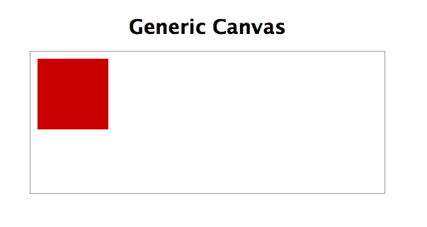

图 9.1。我们非常简单的画布例子。

我们不会深入研究 Canvas API 的工作原理，因为网上有大量可靠的资源，包括:

*   Mozilla 的开发者网络画布教程是一个很好的起点，因为它涵盖了基础知识，并且在每个部分都有一堆到其他资源的链接:[`developer.mozilla.org/ en/Canvas _ tutorial`](https://developer.mozilla.org/en/Canvas_tutorial)。
*   Opera 在这里有一个关于画布基础知识的简短介绍:[`dev.opera.com/文章/查看/ html-5-canvas-the-basics/`](http://dev.opera.com/articles/view/html-5-canvas-the-basics/) 。
*   马克·皮尔格林的《深入 HTML5》有一个很长的章节是关于画布入门的:[`diveintohtml5.info/·canvas.html`](http://diveintohtml5.info/canvas.html)。
*   这里有一个用画布创建突围克隆的教程:[`billmill.org/静态/ canvastutorial/`](http://billmill.org/static/canvastutorial/) 。
*   这里有一个专门的画布教程网站:[`www.html5canvastutorials.com/`](http://www.html5canvastutorials.com/)。
*   web 开发人员的 HTML5 规范(没有浏览器供应商的所有实现细节)在这里简要介绍了 Canvas 的特性:[`developers.whatwg.org/·the-canvas-element.html`](http://developers.whatwg.org/the-canvas-element.html)。

Canvas 在游戏和可视化方面有很大的潜力，还有更普通的用途，比如创建图表甚至工具提示。但也许 Canvas 最令人兴奋的用途是通过 WebGL 以一种迂回的方式将 3D 带到网络上。

我们一会儿再看。首先，让我们看一些画布的例子。

## 用帆布做酷的东西

你可以用画布做很多很酷的事情，从动画到成熟的游戏。让我们从更简单的东西开始:工具提示。

## 工具提示

简陋的工具提示能证明 Canvas 比最先进的 CSS3 更受支持吗？

### 镶齿的

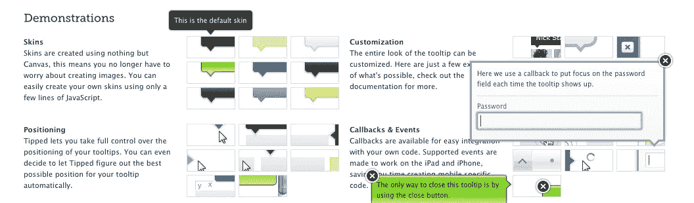

图 9.2。提示示例。

我也这么认为 tipped([`projects.nickstakenburg.com/ tipped`](http://projects.nickstakenburg.com/tipped))是使用画布来增强页面的一个很好的例子。通过 JavaScript API 以编程方式绘制工具提示，无需担心图像。使用 Canvas 及其 JavaScript API 可以轻松创建新的皮肤和主题，以及圆角、阴影和渐变等效果。此外，通过 ExCanvas 提供的 IE6-8 兼容性(我们很快就会看到)，我们可以获得完全支持 IE 的所有 CSS3 风格的效果。

## 图表

稍后我们将涉及一些基于 SVG 的图表工具(包括 gRaphaë和优秀的 Highcharts)。但是也不缺少基于画布的图表选项。这里有一个小选择。

### RGraph

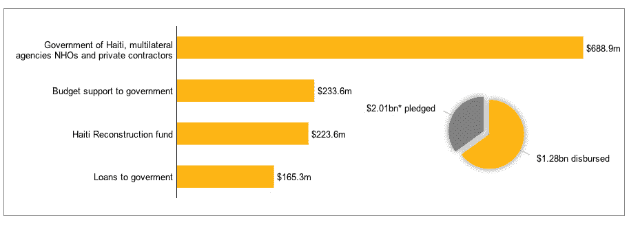

图 9.3。图表。

这里有一个画布图表，它是用强大的，如果不是那么漂亮的 RGraph([`www.rgraph.net/`](http://www.rgraph.net/))构建的。基于画布的图表的美妙之处在于它在 iOS(和 Android)中的坚实支持，而 Flash 不是一个选项。(如果你需要更好的跨平台支持，付费的[`www.zingchart.com/`](http://www.zingchart.com/)会做 Canvas、Flash 和 SVG。如果你在寻找更简单的东西，Flot 是一个流行的、免费的、基于 jQuery 和画布的制图工具:【http://code.google.com/】p/Flot/。)

### 设想

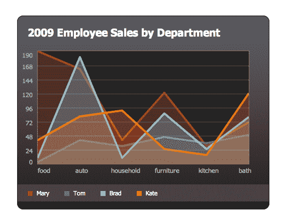

图 9.4。想象行动。

Filament Group 的 Visualize 插件也提供了一个可访问的画布制图解决方案，它给出了上面的结果。在他们的网站上有详细的讨论:[`www.filamentgroup.com/实验室/update _ to _ jquery _ visualize _ accessible _ charts _ with _ html 5 _ from _ designing _ with/`](http://www.filamentgroup.com/lab/update_to_jquery_visualize_accessible_charts_with_html5_from_designing_with/)。

### 人类福利

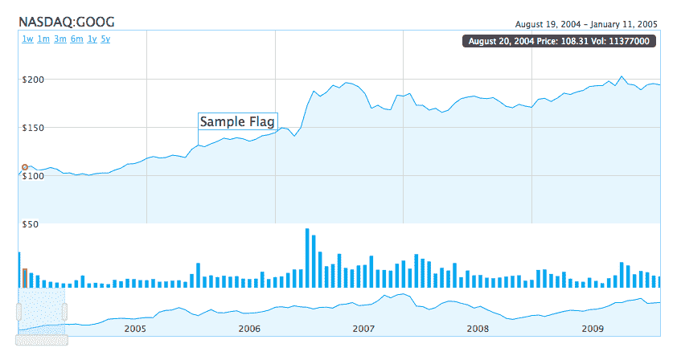

图 9.5。亨伯兰斯复杂的帆布动力图表。

humble fence([`www.humblesoftware.com/金融/指数`](http://www.humblesoftware.com/finance/index))是一个 HTML5 驱动的谷歌金融风格的图表演示。因为 Canvas 只是另一个 HTML 元素，所以您可以很容易地在它上面放置其他的`
`(或任何其他 DOM 对象), HumbleFinance 在这里已经为图表标签和其他文本做了这样的工作。

### 佩蒂

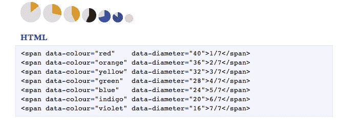

图 9.6。小例子。

peity(【http://benpickles.github.com/】peity/)是一个 jQuery 插件，它可以将元素内容转换成迷你饼图、条形图或折线图。它获取像`5,3,9,6,5,9,7,3,5,2`这样的元素中的值，并将其转换为呈现适当图表的`<canvas>`元素。jQuery 迷你图(【http://omnipotent.net/】jquery.sparkline/)采用了类似的基于画布的方法，并且有更多的选项。

## 形象化

### Processing.js

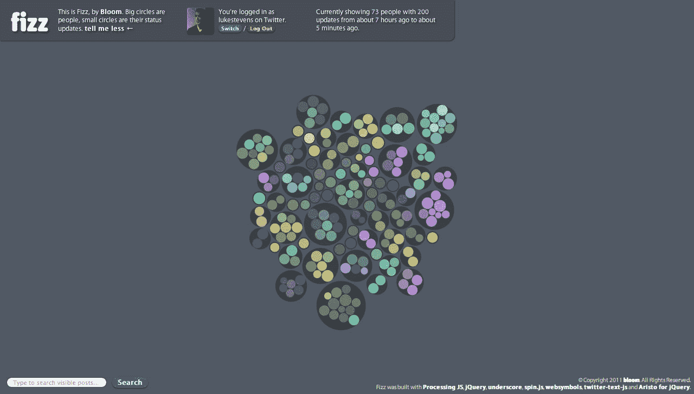

图 9.7。Processing.js 示例 Fizz。

一些最好的画布例子使用 Processing . js([`processingjs.org/`](http://processingjs.org/))，这是处理可视化编程语言的 JavaScript 端口。例子从简单的游戏到抽象的数字艺术，再到可视化。

### “隐私在脸书的演变”

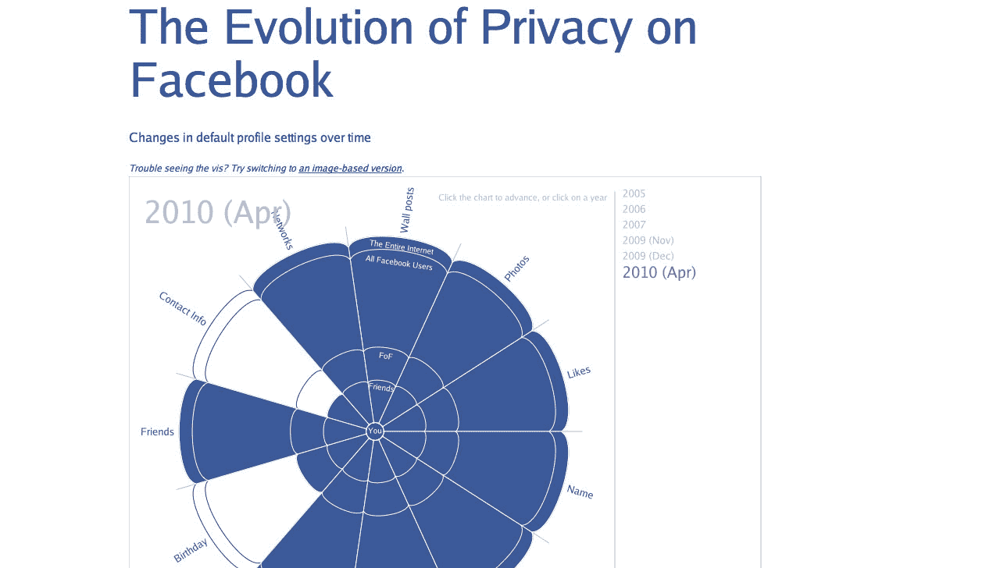

图 9.8。“脸书隐私的演变”可视化。

使用 Processing.js 的基于画布的可视化的一个最实际的例子是交互式“脸书隐私的演变”可视化([`mattmckeon.com/ Facebook-Privacy/`](http://mattmckeon.com/facebook-privacy/))。因为它是在 Canvas 中实现的，所以它可以在 iOS 设备上工作，但我们仍然需要担心与(目前)更大的 IE6-8 组的兼容性。

### 画布、Twitter 和音频混搭

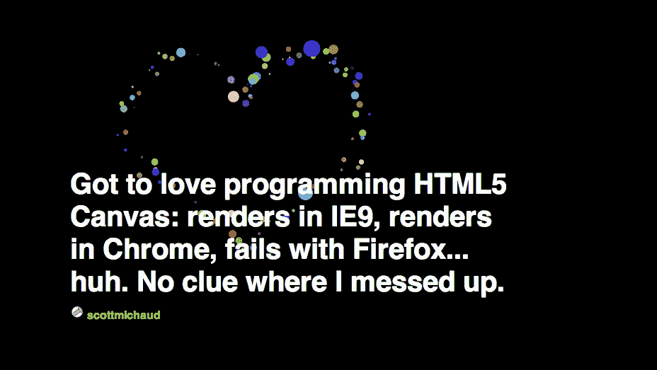

图 9.9。这个 mashup 引入了 HTML5 相关的 tweets，其中一些非常合适。

从实用到…嗯，漂亮。这个 HTML5 Canvas 实验使用 Processing.js 进行粒子渲染，使用`<audio>`元素播放音乐(但它不是音频可视化工具)。自己看:[`9elements.com/ io/projects/html 5/canvas/`](http://9elements.com/io/projects/html5/canvas/)。这些粒子实际上是 100 条与 HTML5 相关的推文，它们的内容在文档中呈现为普通的 HTML。(看这里写的:[`9elements.com/ io/？p = 153`](http://9elements.com/io/?p=153)。)

### 纸张. js

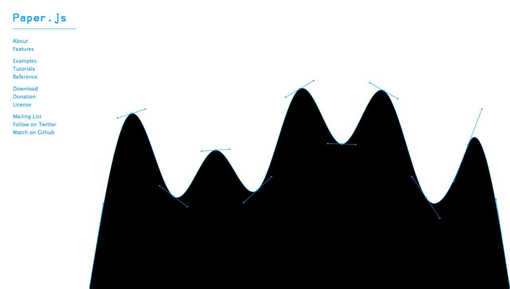

图 9.10。Paper.js 在动态中看起来很棒——一定要看看网站上的例子。

Processing.js 并不是唯一的游戏。paper . js([`paperjs.org`](http://paperjs.org/))自诩为“矢量图形脚本的瑞士军刀”，并展示了基于位图的画布元素如何用于高级矢量图形脚本，以及“矢量图形的文档对象模型”和键盘鼠标交互。更多请看他们的例子:【http://paperjs.org/例子】/[。](http://paperjs.org/examples/)

(Smashing Magazine 还发布了 Processing.js、Paper.js 和基于 SVG 的 raphal:[`coding.smashingmagazine.com/ 2012/02/22/we B- drawing-throw down-paper-processing-Raphael/`](http://coding.smashingmagazine.com/2012/02/22/web-drawing-throwdown-paper-processing-raphael/)。)

## 比赛

各种各样的(大多是复古的)游戏都是用 Canvas 构建的。我们将在这里看一看少数几个，然后看看下面一些令人惊叹的基于 WebGL 的游戏。

### 生物实验室灾难

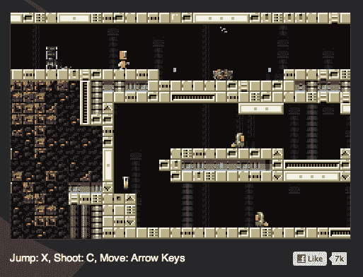

图 9.11。生物实验室灾难是一个有趣的小平台。

Dominic Szablewski 的 biolab Disaster([`playbiolab.com`](http://playbiolab.com))是使用`<canvas>`作为视觉效果的复古游戏的一个很好的例子。这是一个有趣的小平台游戏，在这里你可以奔跑、跳跃和射击。

### 帆布骑士

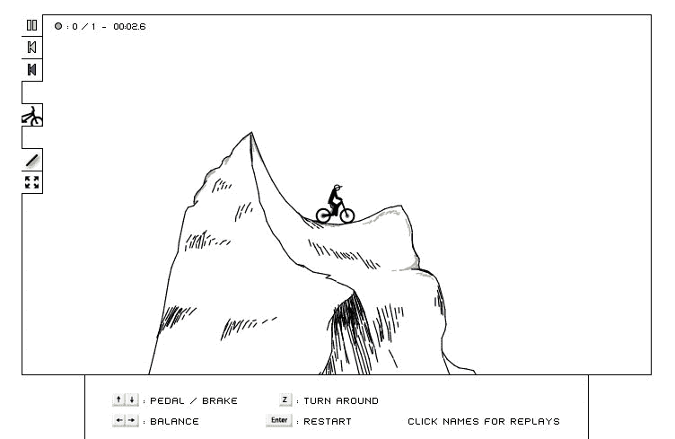

图 9.12。帆布骑士**上瘾**。

帆布骑士([`canvasrider.com/`](http://canvasrider.com/))是另一个有趣(也很难)的例子！)可以用画布搭建的浏览器游戏。(警告:极易上瘾。)

### 割断绳子

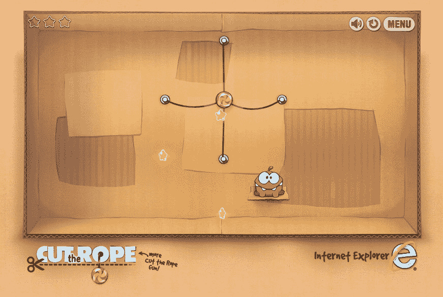

图 9.13。《割断绳子》将基于画布的图形提升到了一个新的高度。

从小游戏实验到巨大的国际成功。格外受欢迎的手机游戏《砍断绳子》从最初的 iOS 代码移植到 HTML5，并于 2012 年初发布。该项目由微软赞助，旨在展示 IE9 的 HTML5 功能，包括其硬件加速的 Canvas 实现。你现在就可以在你的浏览器中播放:[`www.cuttherope.ie/`](http://www.cuttherope.ie/)。

该项目展示了游戏 web 标准的潜力:使用 Canvas 等工具进行开发，然后在现代浏览器中轻松实现您的游戏，并将其捆绑为原生 iOS、Android、Windows Phone 和/或 Metro 应用程序——基本上，只要 HTML5 得到良好支持。在这一章的后面，我们将更仔细地看看游戏和画布。

## 想象操纵

### 画笔

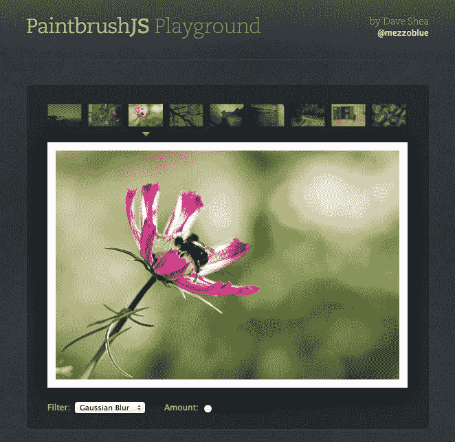

图 9.14。画笔可以完成一些令人印象深刻的类似 Photoshop 的效果。

使用 Canvas，我们可以进行一些令人印象深刻的图像操作，正如戴夫·谢伊的 PaintbrushJS 库巧妙地展示的那样([`mezzoblue.github.com/·paint brush js/demo/`](http://mezzoblue.github.com/PaintbrushJS/demo/))。PaintbrushJS 允许我们应用高斯模糊，添加噪声，渐变为灰度(或棕褐色)等等。这都是在客户端用 Canvas 和 JavaScript 完成的。

### Mozilla 图像编辑器

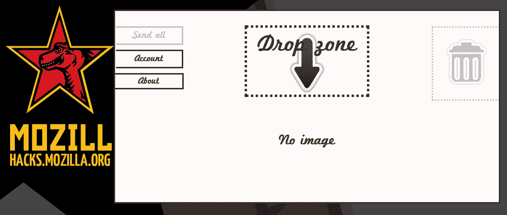

图 9.15。Mozilla 的图像编辑器和上传器结合了许多 HTML5 技术。

Mozilla 将一系列 HTML5 功能整合在一起，创建了一个 HTML5 图像编辑器和上传器([`hacks.mozilla.org/ 2010/02/an-html 5-offline-image-editor-and-uploader-application/`](http://hacks.mozilla.org/2010/02/an-html5-offline-image-editor-and-uploader-application/))。画布用于图像处理。我期待着这种功能能够融入到我们的内容管理系统中。

## 画布驱动的 Web 应用程序

### 墙！墙

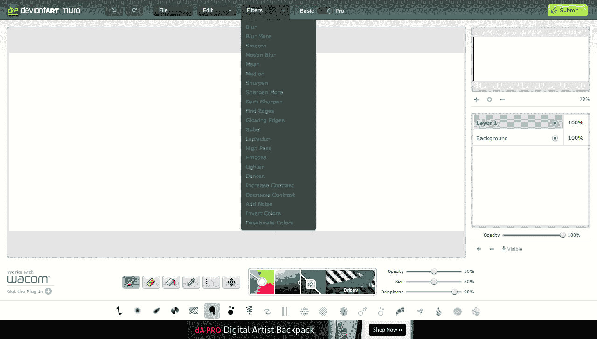

图 9.16。Muro 是一个强大的绘图程序，就在你的浏览器中。

一些真正的、真正的网络应用程序使用 Canvas，它显示了浏览器中现在可能发生的事情。它们大多与绘画或绘图相关(毕竟这是画布)，没有什么比 deviantART 的 Muro 更好地说明了这一点——一个免费的 HTML5 驱动的绘图/绘画应用程序。试试这里:[`muro.deviantart.com/`](http://muro.deviantart.com/)或阅读更多这里:[`news.deviantart.com/文章/ 125373/`](http://news.deviantart.com/article/125373/) 。

### 画板

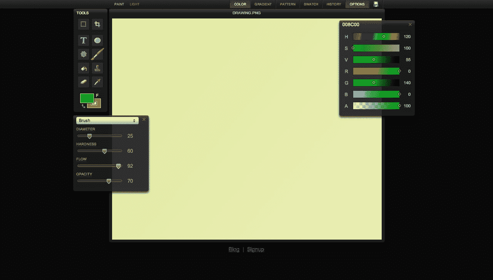

图 9.17。Sketchpad 展示了画布驱动的绘画程序的可能性。

画板是另一个很棒的 HTML5 绘画应用，你可以在这里玩:[`mugtug.com/画板/`](http://mugtug.com/sketchpad/) 。

### 无尽的壁画

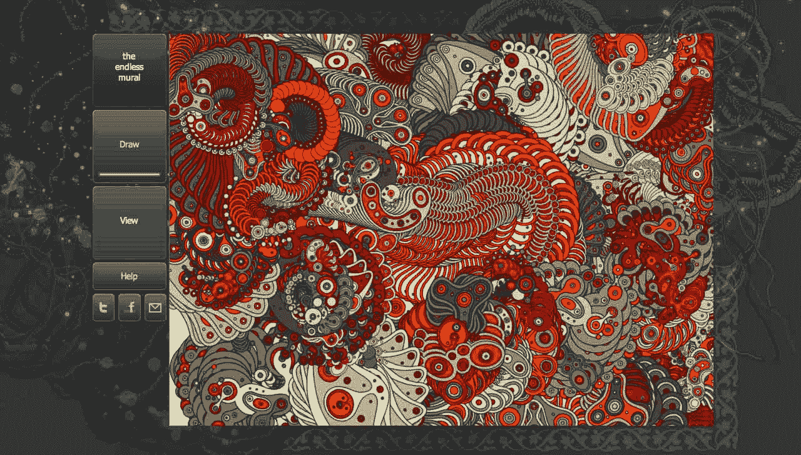

图 9.18。无尽的壁画网站让你创作上述艺术品的变体。

无尽的壁画([`www.endlessmural.com`](http://www.endlessmural.com)/)是“一个互动的、合作的艺术网站”，由 Canvas 提供支持，并由微软赞助他们的 IE9 发布。该项目是自动机工作室和约书亚·戴维斯工作室(约书亚·戴维斯是早期的 Flash 和数字艺术先驱)的作品。代码已经以 Okapi 的形式发布，这是一个“在 HTML5 中构建数字生成艺术的开源框架”，可以在这里获得:【http://okapi.visitmix.com/】??。

### 卢奇德哈特

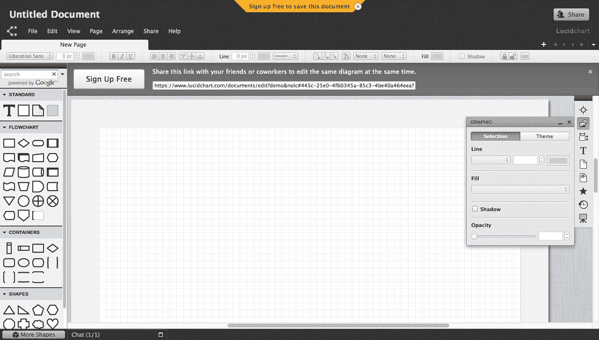

图 9.19。LucidChart 让你只需点击几下鼠标就能进入主题，所以试试吧。

虽然不全是艺术绘画。一些成熟的制图(付费)网络应用也使用 Canvas，比如 LucidChart，你可以在这里测试一下:[`www.lucidchart.com/`](http://www.lucidchart.com)。

## 绘图界面元素

### Flash 风格的界面效果

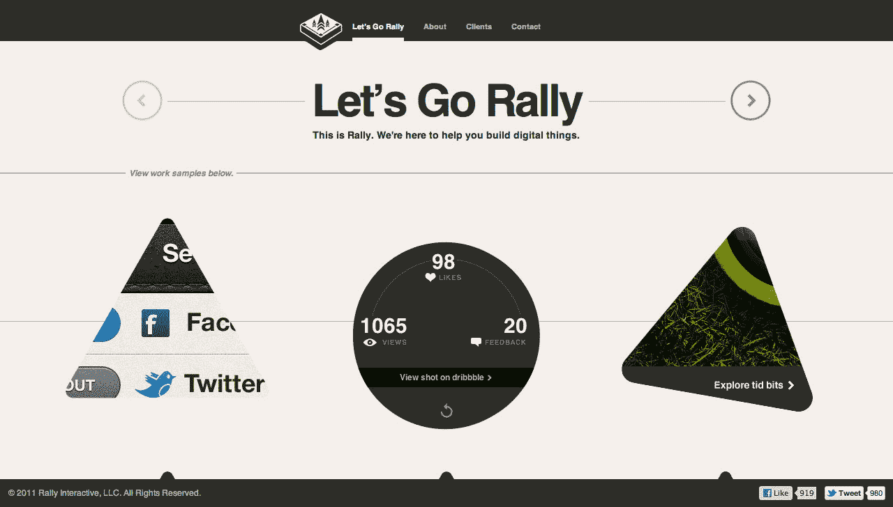

图 9.20。“拉力赛互动”展示了多块画布巧妙运用可以产生令人印象深刻的效果。

Rally Interactive 制作了一个非常令人印象深刻的三角形到圆形的动画效果来展示他们的工作，截图和统计数据来自 Dribbble。我最初以为它是一堆花哨的 CSS3(这本身就很酷)，但实际上它们使用的是 Canvas。查看它的运行:[`beta . rallyinteractive.com/`](http://beta.rallyinteractive.com/)(并查看源代码以了解他们是如何做到的)。

### 背景动画

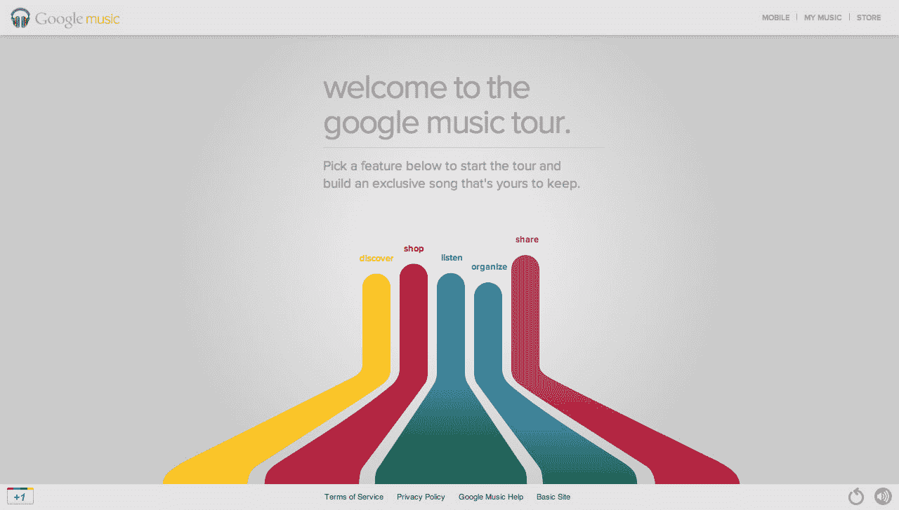

图 9.21。谷歌音乐网站上由画布绘制的背景元素会在你浏览网站时带你踏上一段旅程。

Google Music 的旅游页面使用画布来渲染背景动画，当你从一个部分移动到另一个部分时，背景动画上有粗粗的彩色线条在涂鸦。看它在行动:[`music.google.com/约/游/`](http://music.google.com/about/tour/) 。

### 液体画布的界面背景

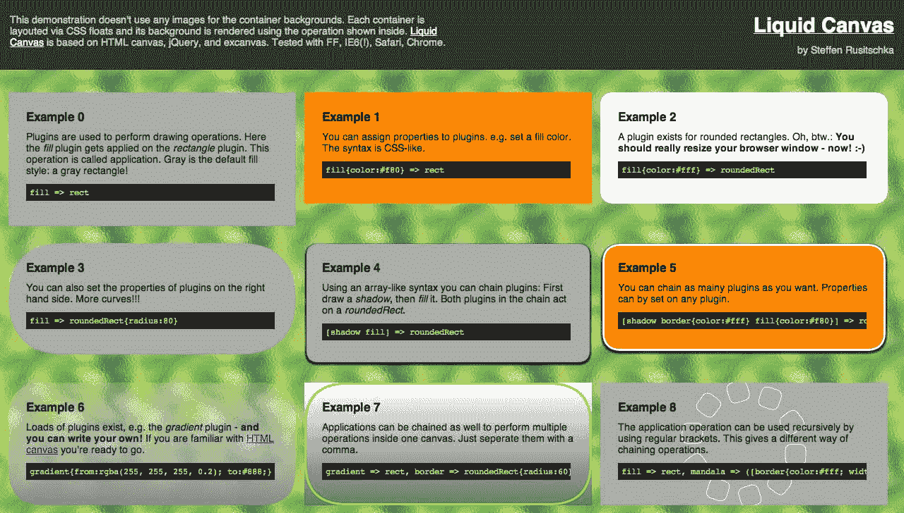

图 9.22。这些例子可能并不漂亮，但液体画布展示了一些有趣的可能性。

给我们网页设计师一个建议:用画布来绘制界面元素的*背景*怎么样？我们可以将`<canvas>`元素放置在标记中我们喜欢的任何位置，甚至可以适当地将它们层叠(使用 position 和 z-index ),然后用少量的 JavaScript 渲染所有的图形——不需要图像。

这种方法可以大大加快开发速度。不再需要从 Photoshop 中导出挑剔的图像来为客户调整配色方案。只需更改一些 JavaScript 变量，我们就完成了。有了 ExplorerCanvas for IE，我们甚至可能拥有比当前 CSS3 更好的浏览器兼容性。另外，硬件加速只是让 Canvas 在手机和桌面上运行得更快。

最好的(也许是唯一的)例子是 2008 年的 Liquid Canvas JavaScript 库。(你可以在这里读到:[`www.ruzee.com/内容/液体画布`](http://www.ruzee.com/content/liquid-canvas)，在这里看到它的行动:【http://www.ruzee.com/档案/液体画布/demo.html。)演示并不是最漂亮的，但可能性肯定是耐人寻味的。例如，使用液体画布，您可以使用画布在 div 后面绘制带有阴影、圆角、渐变和斯托克斯的背景。(这里有一个教程:【http://www.caffeinedi.com/】2009/11/02/using-jquery-and-liquid canvas-to-add-drop-shadows-borders-rounded-corners-and-other-effects-to-your-website-even-in-ie6-and-ie7/。)

如果再多一点对设计的热爱，这可能是 A/B 测试布局的某些美学处理的好方法，全部只使用 JavaScript 同样，不需要在 CSS 中导出和维护图像。当然，这种方法总会有局限性，而表示显然应该是 CSS 的长期目标。(实际上，大多数人会坚持使用 CSS3。)但是 Liquid Canvas 无疑给了我们一种非常新颖的绘制界面元素的方法。

在一些(非 IE)情况下，我们也不一定需要使用液体画布。从 2008 年开始就可以在 WebKit 中使用 Canvas 元素作为 CSS 背景了(！)如这里所述:[`www.webkit.org/博客/ 176/ css-canvas-drawing/`](http://www.webkit.org/blog/176/css-canvas-drawing/) 。火狐 4 在 2011 年增加了类似的支持(【http://hacks.mozilla.org/】2010/08/mozelement/)，其他浏览器也有变通办法(针对静态画布’)，如这里的回答所述:[`stackoverflow.com/问题/3397334/use-Canvas-as-a-CSS-background`](http://stackoverflow.com/questions/3397334/use-canvas-as-a-css-background)。随着硬件加速的到来和使用 Canvas 作为 CSS 背景的能力，我们有了一些快速的、以编程方式生成的界面元素的有趣选项。

考虑一下响应式网页设计的可能性——我们可以根据设备的分辨率以编程方式重绘 CSS 背景(至少在 iOS 中)。无需下载桌面大小的图像并缩小；或者为不同的设备维护不同的艺术作品集；就让一个剧本来为我们做这些繁重的工作吧。(如果您创建了这样的脚本，请告诉我！)

虽然我们有一些想法，但我很想看到像 Photoshop 风格的 CSS3 效果图层面板这样的东西(这本身就很酷——见:[`layerstyles.org/·builder.html`](http://layerstyles.org/builder.html))为画布而建。它可以生成液体画布风格的 JavaScript，然后您可以将它放入您的页面，并在几乎所有浏览器上呈现效果。见鬼，如果 Photoshop 本身能导出到 Canvas 就太酷了。

Canvas 可能不是 Flash 的替代品，但这些例子表明它确实打开了一些有趣的大门。

## IE6-8 的有时好有时坏的画布仿真

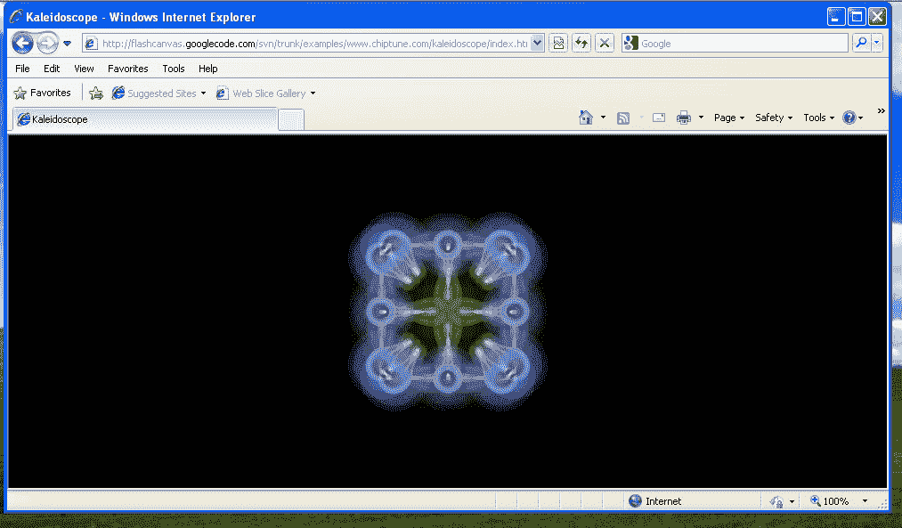

图 9.23。这个万花筒 FlashCanvas 示例演示了令人印象深刻的画布效果甚至在 IE7 中也是可能的；他们只是太慢了。

虽然 IE6-8 不支持 Canvas，但并没有失去一切。几个仿真选项可以给这些浏览器至少*一些*支持使用 IE 的本地、传统矢量标记语言(VML)、微软的 Silverlight 插件或 Flash。

每种方法都有其优点和缺点。VML 很慢，会将元素加载到 DOM 中。(Canvas 元素被重新创建为 vector 元素，所以加载的越多，速度越慢。)但是动画流畅，画布整体上还是停留在 DOM 里。

Flash 和 Silverlight 都更快。但是(在撰写本文时)只有大约 40%的人安装了 Silverlight，而且 Flash 和 Silverlight 都不能在 DOM 中操作。

(这里有一个更详细的比较:[`uupaa-js-spinoff.googlecode.com/ SVN/trunk/uuCanvas.js/ README.htm`](http://uupaa-js-spinoff.googlecode.com/svn/trunk/uuCanvas.js/README.htm)，虽然它主要是日语，所以你需要让谷歌翻译做它的事情。)

再加上交互性问题、对 Canvas API 特性的混合支持，以及处理器密集型应用程序的性能问题，你就有了一个大杂烩。您仍然可以渲染一些令人印象深刻的动画效果(尽管很慢)，或者渲染静态图像并在 DOM 中提供它们(这对于图表等非常有用)。但是，如果性能达不到要求，或者某个关键特性得不到支持，这可能就是“差之毫厘，失之千里”的情况。

这是做模拟的工具。查看他们在 IE 6、7 或 8 中的演示，感受一下他们的表现(例如，在 IE 中尝试这些:[`code.google.com/ p/flash canvas/wiki/Examples`](http://code.google.com/p/flashcanvas/wiki/Examples))。在某些情况下(如静态画布渲染)，您可能永远不知道它正在被模拟，而在其他情况下，您可能会得到可以接受但并不完美的模拟。请记住，画布仿真可能是一个非常模糊的领域——它很少是一张免费的完美 IE6-8 支持卡。

画布仿真实用程序:

*   ExplorerCanvas(又名 ExCanvas)是最著名的。它使用 VML，还有一个不受支持的 Silverlight 选项。请前往:[`excanvas.sourceforge.net/`](http://excanvas.sourceforge.net/)查看。
*   FlashCanvas 是一个正在积极开发中的基于 Flash 的 Canvas 实现(见[`code.google.com/ p/Flash Canvas/`](http://code.google.com/p/flashcanvas/)和[`flashcanvas.net/`](http://flashcanvas.net/))。)也有 Pro 版本。
*   fxCanvas 是另一个基于 Flash 的 IE Canvas 实现(尽管不太成熟)，也在积极开发中:[`code.google.com/ p/fxcan vas/`](http://code.google.com/p/fxcanvas/)
*   最后(也是最有趣的)是日本的 uuCanvas，它声称提供 VML、Silverlight 或 Flash 渲染。在这里阅读:[`uupaa-js-spinoff.googlecode.com/ SVN/trunk/uuCanvas.js/README.htm`](http://uupaa-js-spinoff.googlecode.com/svn/trunk/uuCanvas.js/README.htm)。(还是那句话，谷歌翻译会有帮助。)

## Web 标准的杂乱世界，或者说，我们是如何以 Canvas 告终的？

让我们接触一下画布的历史，因为它说明了这些功能是如何随意发展的。(HTML5 的大部分内容也是如此，它在某种程度上只是一个已经存在多年的技术大杂烩。)

> “HTML5”只是一个流行词，代表了 7 年来的好东西。
> —戴夫·巴尔默，[`www.slideshare.net/·巴尔默/摇滚之星-图片-与-html 5-媒体-英国`](http://www.slideshare.net/dbalmer/rockstar-graphics-with-html5-media-uk)

你使用 OSX 的仪表板功能吗？早在 2004 年，画布就起源于此。苹果希望 Dashboard 小部件易于编写，所以他们基于 HTML、CSS 和 JavaScript(如果你愿意，也可以是本机代码)的良好 ol' web 堆栈，并使用 WebKit 来呈现它们。(WebKit 是 Safari 和谷歌 Chrome 背后的渲染引擎。)

但苹果认为用于呈现仪表盘小部件的 web 堆栈有局限性，所以他们给 WebKit 添加了一些功能，主要是 Canvas。Safari 使用 WebKit，所以 Safari 现在支持 Canvas。瞧，画布在网络上诞生了。

这在传统的新网络技术中引起了相当大的关注。

供应商在没有任何标准流程的情况下将浏览器特有的特性添加到 HTML 中，这正是 web 标准运动试图让*远离*的地方。如果微软和 Mozilla 在 Canvas 之类的东西上做出不兼容的尝试，我们将会陷入一片混乱。

因此，伊恩·希克森对苹果的 Canvas 实现进行了逆向工程，并将其放入 WHATWG 网络应用 1.0 规范中。Canvas 在 2005 年的 Firefox 1.5、2006 年的 Opera 9 以及 2011 年的 IE9 中获得了支持。正如我们在第一章中看到的，WHATWG Web Apps 1.0 规范变成了 HTML5，Canvas 现在是 HTML5 的官方部分。向希克森致敬，感谢他把它带入了规范。

(更多关于画布的历史，请参见[`peter.sh/ 2010/06/thank-you-Microsoft-html 5-Canvas-is-a-go/`](http://peter.sh/2010/06/thank-you-microsoft-html5-canvas-is-a-go/)。)

## 画布元素和可访问性

就可访问性而言，Canvas 可能有点像噩梦。对于屏幕阅读器来说没有什么可读的——只有一个黑洞和设计者放在`<canvas>`标签之间的任何文本(如果有的话)。

供应商正在努力解决这个问题。例如，IE9 向辅助技术公开了`<canvas>`标签之间的回退内容。这里的想法是，当浏览器*支持*canvas，但视力受损的用户看不到它时，他们仍然可以通过他们的屏幕阅读器以替代文本的形式获得一些有用的东西。(嗯，理论上是这样。目前，他们会得到很多错误的“你的浏览器不支持画布”的消息，因为这就是迄今为止回退内容的使用方式。)要了解更多信息，请参见易访问性大师 Steve Faulkner 对此功能的讨论:[`www.paciellogroup.com/博客/2010/09/html 5-canvas-accessibility-in-internet-explorer-9/`](http://www.paciellogroup.com/blog/2010/09/html5-canvas-accessibility-in-internet-explorer-9/)。

至于 Canvas 元素本身的可访问性，这是一个已经讨论了*年*的棘手问题，至今仍未解决。这里有一个过去几年讨论的总结:【http://www.paciellogroup.com/博客/2011/12/html 5-canvas-accessibility-discussions-2009-2011/但是我们已经到此为止了。

让我们不要用`<canvas>`重复过去几十年的可访问性错误。理论上，我们可以渲染漂亮的文本，或者整个网页，或者网络应用程序(已经完成了！)，JavaScript 在一个`<canvas>`区域。但是这是一个可怕的想法，并且和把我们的设计作为一个巨大的图像一样有用(从可访问性的角度来看)。

(你可以在画布上做一些疯狂的事情，正如本教程所示:[`www.html5rocks.com/教程/画布/ texteffects/`](http://www.html5rocks.com/tutorials/canvas/texteffects/) 。因此，我们仍然可以使用这种技术进行文本替换。)

## 画布的当前状态

技术(网络或其他)并不存在于真空中。他们的成功往往取决于他们周围有一个有利的环境。人们对画布当然有很大的热情，但是它周围的环境(??)怎么样呢？

### 原始开发环境

值得记住的是，Canvas 周围的环境仍然相当原始，因此几乎没有开发工具。(Flash 之所以成功，不仅仅是因为 Flash 播放器无处不在，还因为开发人员可以使用成熟的工具。)

情况正在发生变化。HTML5 游戏引擎(例如用于 Biolab 灾难的[`impactjs.com/`](http://impactjs.com/))通常对 Canvas 有一些支持，但它们非常面向小众和开发者；这不是我们一般网页设计所需要的。

在设计师的工具方面，有一个来自微软麦克·斯旺逊的 Adobe Illustrator to Canvas 插件([`visitmix.com/实验室/ ai2canvas/`](http://visitmix.com/labs/ai2canvas/) )。正如我们前面所看到的，Adobe 自己也在致力于 Flash 到 Canvas 的导出。(他们也一直在试验更通用的“HTML5”导出，但他们相当宽松地使用术语“HTML5”。当我们在第十一章讨论 SVG 时，我们会更多地关注 Adobe 的立场。)

### 表演

Canvas 令人兴奋的一点是，你可以在任何东西上查看它，从 Flash 不是一个选项)到桌面。在简单、静态的情况下，如图形和图表，这是一个现实。但是对于任何处理器密集型的东西(比如动画和游戏)，最新的移动设备除了最简单的任务之外，还没有强大到足以做任何事情。

不过这种情况正在改变，特别是随着移动设备变得更快，Canvas 获得了硬件加速(正如微软承诺并为 IE9 mobile 演示的:[`www.gsmarena.com/ internet _ explorer _ 9 _ on _ wp7 _ aces _ html 5 _ drawing _ test-news-2524 . PHP`](http://www.gsmarena.com/internet_explorer_9_on_wp7_aces_html5_drawing_test-news-2524.php))。苹果的 iOS5 也极大地提高了画布的性能，正如格兰特·斯金纳在 2011 年 10 月所记录的那样([`plus.google.com/ 111971493588974288901/posts/ARX 5k 8 lmn Bt`](https://plus.google.com/111971493588974288901/posts/ARX5K8LmNbt)——我已经把 iPad 2 的结果一个挨着一个移动到了下面):

> 简单比较 HTML5 canvas 在移动设备上的性能，以恒定的每秒 20 帧(即通过 drawImage 从 sprite 工作表图像获得 80x80 帧):
> 
> RIM Playbook: 24
> Desire Z(安卓):60
> Galaxy Tab 10.1(安卓):200
> IP ad2 w/IOs 4:40
> IP ad2 w/IOs 5:1750

Sencha 还报告了大幅提升的画布 iOS5 速度:[`www.sencha.com/博客/苹果 IOs-5-html 5-开发者记分卡/`](http://www.sencha.com/blog/apple-ios-5-html5-developer-scorecard/) 。(顺便说一下，Sencha 的 HTML5 博客帖子在保持功能支持方面非常出色。)

硬件加速带来了巨大的变化。但目前，任何画布密集型的东西都可能很快在你并不先进的手机或平板电脑上变成一场相对的狂欢(正如上面的 iOS4 和 Android 设备结果所示)。

### 有限的 IE 兼容性

正如我们所见，IE6-8 可以不同程度和不同方式支持 Canvas(VML、Flash、Silverlight)。如果你开始使用画布，这可能是一个天赐良机。但与 Flash 相比，它可能是一个令人头痛的问题，并限制 Canvas 的吸收，直到 IE9 成为设计和开发的新基线。(请记住，IE8 是 Windows XP 用户的底线，所以我们需要等到 Windows XP 最终消失后才能假设原生 Canvas 支持。)

与移动设备一样，虽然简单或静态的 Canvas 实现对于仿真来说可能是完全可以接受的，但复杂的动画和游戏可能是不可能的。当 Flash 风格的交互性是必要的时候，这就产生了一种奇怪的情况——我们可以通过基于 Flash 的体验来支持 IE8 和更低版本，但不能在 Metro IE10 或移动设备上工作，或者为 Metro IE10 和其他不能在 IE8 和更低版本上工作的现代浏览器创建一些东西。一些糟糕的设计人员和开发人员可能会两者兼而有之，具有讽刺意味的是，他们可能会为传统的桌面浏览器创建更高级的 Flash 体验，而为现代浏览器创建更简单的基于画布的版本。为 IE8 的迅速消亡和新网络标准的快速发展、采用和成熟干杯。

## 又是玻璃的比喻

这是 HTML5 的另一个玻璃杯半满，玻璃杯半空的情况。人们正在用 2004 年的 OSX 仪表板功能做着令人惊讶的事情——从漂亮的设计功能(如工具提示)和互动实验到游戏和成熟的网络应用。Canvas 的设计并没有考虑到这些事情；事实证明，在这种情况下，它非常有用。这是玻璃半满透视。但是，如果您正在等待一个成熟的、一次编写、可在桌面上任何地方运行的环境，如 Flash，它可能看起来像是半空的玻璃杯。我们还要等很长时间。

## HTML5 游戏:画布还是不是？

在讨论 HTML5 和游戏时，Canvas 经常被提到，所以让我们简单看看 HTML5 游戏的状态。你能利用现有的网络技能，用 HTML 和 JavaScript 编写能在任何现代浏览器上运行的游戏吗？当然，如果你习惯用 JavaScript 开发的话。这个游戏会有什么好处吗？嗯，那要看情况...

近年来最大的趋势之一是休闲游戏，无论是在浏览器还是在 iPhone 等移动设备上。脸书的社交游戏创造了数十亿美元的公司。(FarmVille 和 CityVille 的开发商 Zynga 的估值高达 100 亿美元:[`www.develop-online.net/新闻/37066/New-speculation-values-Zynga-at-100 亿美元`](http://www.develop-online.net/news/37066/New-speculation-values-Zynga-at-10-billion))。随着 Rovio 及其《愤怒的小鸟》系列的崛起，休闲手机游戏也大受欢迎。

因此，从务实的商业角度和理想主义的“开放平台”角度来看，一个用于创建休闲社交游戏的开放的跨设备平台非常有吸引力，HTML5 非常符合这一要求。举例来说，脸书无疑正在其开发者社区中大力推动这项工作。

关键是要理解我们在这里谈论的是什么类型的“游戏”。从图形上看，这些通常是简单的 2D 游戏，类似于 90 年代早期的游戏。从这个意义上来说，这很像“回到未来”——我们在非常现代的移动社交网络世界中，使用最新的网络技术来创建 20 年前的风格游戏。

### 这是帆布吗？

尽管 HTML5 大肆宣传，但出于性能原因，其中一些 HTML 游戏和游戏引擎已经明确避免了 Canvas 等功能，而是依赖 DOM 脚本和 CSS3(在 iOS 设备上部分硬件加速)来完成工作。以下是一组开发人员从一个快速的技术演示中发现的东西，该演示采用了 HTML 游戏引擎方法(【http://sebleedelisle.com/】2011/04/HTML 5 JavaScript-platform-game-optimized-for-ipad/):

> 那么在 iOS 上获得性能的答案是什么呢？忘记 HTML5 canvas 吧，这个游戏中所有移动的对象都是 HTML div 元素，我们只是通过用 JavaScript 控制 CSS 属性来移动它们。

当讨论“HTML5”时，我们需要仔细看看人们实际使用的技术和技巧。你认为是画布的东西很可能不是。随着性能的提高(硬件加速成为常态)，Canvas 可能会在基于网络的游戏中得到更广泛的应用，但值得记住的是，“HTML5”这个术语是如何被随意使用的。

不要误会我的意思:演示和端口已经向我们展示了 HTML5 游戏现在在桌面上的可能性，以及在不太遥远的将来在移动浏览器上的可能性。请记住，浏览器中的休闲游戏现象与最新技术关系不大，而与社交网络等大创意关系更大，传统网络堆栈可以用非常有趣的方式利用社交网络。也就是说，由于 WebGL，硬件加速的 3D 游戏也通过 Canvas 进入浏览器，我们很快就会看到这一点。

### 画布游戏开发入门

尽管如此，如果你想亲自动手使用 Canvas 进行游戏，可以看看这个教程和概述(忽略文章中的宣传):[`www.html5rocks.com/教程/案例研究/onslaught.html`](http://www.html5rocks.com/tutorials/casestudies/onslaught.html)或者这个绝对初学者教程:[`www.lostdecadegames.com/ how-to-make-a-simple-html 5-Canvas-game/`](http://www.lostdecadegames.com/how-to-make-a-simple-html5-canvas-game/)。别忘了我们之前看过的游戏例子，包括《割断绳子》(【http://www.cuttherope.ie/】)这可能是迄今为止最相关的纯 HTML5 端口。

对于“HTML5”游戏可用的所有不同技术的详细介绍(广义上)，以及它们的交付和货币化选项，请查看 2012 年 1 月的这篇优秀文章:“HTML5 游戏开发的现实和从中赚钱”([`www.photonstorm.com/档案馆/2759/The-Reality-of-html 5-Game-Development-and-making-money-from-it`](http://www.photonstorm.com/archives/2759/the-reality-of-html5-game-development-and-making-money-from-it))。

### HTML 游戏:超越 HTML5

也有很多开发人员对超越 HTML5 的 web 平台感兴趣，包括像操纵杆 API、环绕声支持和 CSS 扩展之类的东西。请参阅 W3C 的详细报道:“关于 HTML.next for Games 研讨会的报告”([`www.w3.org/ 2011/09/Games/`](http://www.w3.org/2011/09/games/))。我们将在第十二章谈到后 HTML5 网络平台。

## 画布:我有什么好处？

### 网页设计师的画布

画布对你有多重要取决于你在哪里工作和你做的项目。如果你在一家大预算机构工作，脸书组件对于大规模的全国或全球营销活动是强制性的，你可能会发现新的游戏功能非常有趣。

如果你是一名自由职业者，在预算紧张的情况下做客户工作，我们看到的现成图表工具可能不那么吸引人，但仍然非常有用。面向 IE6-8 的 Canvas emulation 作为一个跨设备解决方案(相对于基于 Flash 的工具)可能会非常方便，它涵盖了 IE6+ *和* iOS 设备。

用于内容管理系统的基于画布的图像编辑工具也可能开始涌现，如果你喜欢修补，有巨大的实验空间。您可能想尝试用 Canvas 呈现界面元素(正如 Liquid Canvas 和 Tipped libraries 演示的那样)，或者看看像 Rally Interactive 这样的工作室演示的那样，您可以将 Canvas 推进多远。

### 学生和业余爱好者的画布

一个免费、开放、相对简单的平台，比如 HTML、JavaScript 和 CSS，可以为那些想尝试简单游戏设计的孩子创造一个肥沃的环境。随着教程和开发库遍地开花，他们有足够的信息开始制作简单(也不那么简单)的游戏。在学校里看到这种情况会很棒，而且不需要太多资源——只需要一台不太像样的个人电脑(或者 35 美元的树莓派:[`www.raspberrypi.org/`](http://www.raspberrypi.org/))和一个现代风格的浏览器。

### Flash 设计师的画布

Canvas，以及其他非 HTML5 但很酷的特性，如 jQuery、CSS3 和 SVG，可能会吸引更多的 Flash 设计师去探索 HTML 和 web 标准。Flash 设计者拥有 Flash 成熟的 IDE、先进的特性和广泛的支持。(我相信当缓慢的 HTML5 横幅广告也开始出现时，他们会笑的。)只要记住微软的举动，Flash 的写作就在墙上。

在任何情况下，HTML 中的*交付*越多(即使动画是在 Flash 中创建的)，就越好。我们需要 Flash 设计师的创造力来尽可能地推动 HTML5 和新 web 技术的界限。希望 Adobe 能做更多来实现他们的出口到画布的承诺和其他“HTML5”创作工具。

### 试试看

我们有很大的空间以微妙(或不那么微妙)的方式将`<canvas>`元素编织到我们的网页中。但是 Canvas 是否会成为一个主要的网页设计工具，或者仅仅是我们这个时代的 Java 小程序，取决于我们自己。让我们试一试，看看我们能想出什么。

## 2D Canvas' 3D Future: WebGL

我把最好的留到了最后——与 Canvas 相关的最激动人心的发展之一是 WebGL(基于 Web 的图形库)。尽管 Canvas 表面上源于 2D，但新的 WebGL 标准为 Canvas 提供了一个由 OpenGL 支持的硬件加速的 3D 环境——如果浏览器(和底层硬件)支持的话。这为您的浏览器开启了现代 3D 游戏之门。

(WebGL 规范不是由 W3C 或 WHATWG 开发的，而是由非盈利技术联盟 Khronos Group 开发的，该联盟从 Mozilla 发展而来。所以它本身不是 HTML5，但它仍然很酷。)

WebGL 工作组包括苹果、谷歌、Mozilla 和 Opera。(详见维基百科条目:[`en.wikipedia.org/维基/ WebGL`](http://en.wikipedia.org/wiki/WebGL) 。)注意到名单上少了谁吗？是的，微软。当其他主要的浏览器供应商正在推进实际的或实验性的支持时，安全问题让微软*非常*胆怯。例如，2011 年 6 月，微软的安全研究博客发布了一篇名为“WebGL 被认为是有害的”的文章，文章称:

> 我们相信 WebGL 将很可能成为一个难以修复的漏洞的持续来源。从目前的形式来看，WebGL 不是微软从安全角度认可的技术。

翻译:不要对 IE 中的 WebGL 抱太大希望。

这也不仅仅是微软对竞争技术过于谨慎或怀有敌意。在([`twitter.com/ #)发表博文后不久，约翰·卡马克(id Software 创始人，备受尊敬的游戏开发者)发了一条微博/ID _ AA _ Carmack/status/81732190949486592`](http://twitter.com/#!/ID_AA_Carmack/status/81732190949486592)):

> 我同意微软的评估，WebGL 是一个严重的安全风险。gfx 驱动程序文化不是安全文化。

担心安全问题的不仅仅是微软。出于类似的原因，苹果尚未在 iOS 设备的浏览器中启用 WebGL(如果黑客新闻的这些评论是准确的话:[`news.ycombinator.com/ item？id = 3252777`](https://news.ycombinator.com/item?id=3252777))。然而，苹果正在 IOS 5 中为 iAds 启用 WebGL，因此基于 WebGL 的营销可能迟早会成为现实(无论是好是坏)。

## 网络上的 3D:Web GL 替代方案

WebGL 也不是镇上唯一的游戏。

Flash 11 于 2011 年 10 月推出，最近以其“Stage 3D”技术(以前称为“Molehill”)为浏览器带来了硬件加速的 3D。你可以在这里看到演示:[`www.adobe.com/发展网/flash player/stage3d.html`](http://www.adobe.com/devnet/flashplayer/stage3d.html)。Epic 已经将他们的虚幻引擎 3 移植到 Flash 11，所以游戏潜力肯定是存在的:【http://www.anandtech.com/秀/4933/Flash-11-supports-虚幻引擎-3[。](http://www.anandtech.com/show/4933/flash-11-supports-unreal-engine-3)

微软 2011 年 12 月发布的 Silverlight 5 也引入了硬件加速 3D，但鉴于微软对 Metro IE 10 的无插件计划，Silverlight 在浏览器中似乎不太可能有未来，可能会成为 Metro 应用的开发环境。

有趣的是，Unity Technologies 开发了流行的跨平台(非常适合移动设备)3D 引擎 Unity，该公司一直在分发自己的浏览器插件，他们声称该插件的下载量已达 6000 万次。他们还推出了导出到 Flash 的选项，这样用户就不需要下载 Unity 浏览器插件了。

因此，无论如何，我们将在未来几年内看到更多的 3D 内容，特别是游戏内容，这些内容可能仍然足以吸引使用 Metro 界面的 Windows 8 用户切换到桌面模式来运行 Flash。我们正处于 2D 基于浏览器的游戏爆炸时期(CityVille 在 2011 年每月活跃玩家达到 1 亿)，基于浏览器的 3D 游戏热潮即将到来。

WebGL 也有老派前辈。在网络上显示 3D 并不新鲜——例如 VRML(“虚拟现实建模语言”)可以追溯到 1994 年(见:[`en.wikipedia.org/维基/ VRML`](http://en.wikipedia.org/wiki/VRML) )。但是，随着硬件加速的 3D 现在几乎可以在任何平台(包括智能手机)上使用，3D 在网络游戏和其他领域(例如，3D 模型产品预览、医学模型、地图等)的潜力无限增大。

谁知道呢？也许我们最终会拥有我们一直渴望的 3D“虚拟”购物中心体验的技术...

## 给我看看演示！

说到 WebGL，眼见为实。所以，启动最新版本的 Firefox、Chrome 或 Opera，看看这些很酷的演示吧。记住:这一切都发生在`<canvas>`中——只是 DOM 中的另一个元素(我们可以用 CSS3 来推动它)。

### 愤怒的小鸟

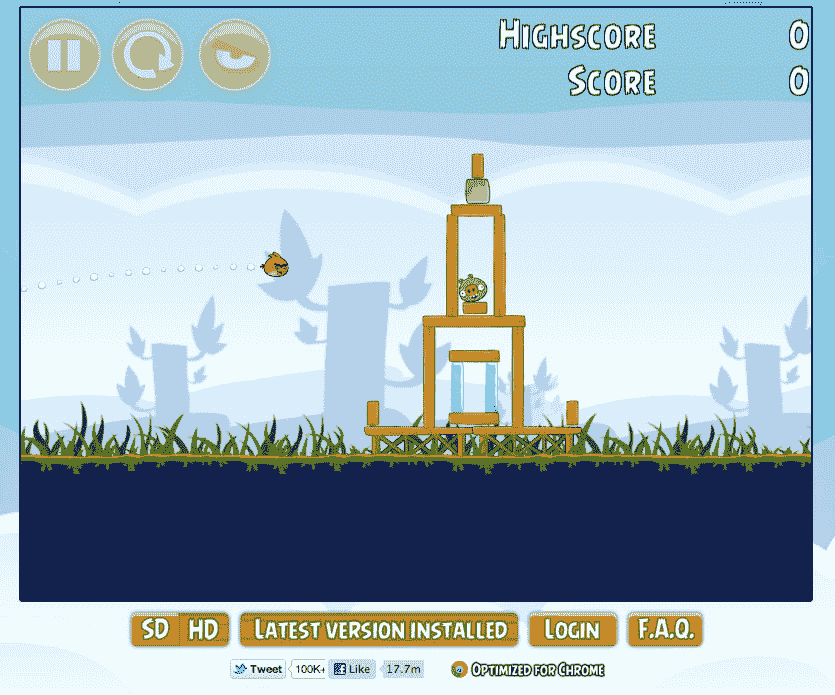

图 9.24。多亏了 WebGL,《愤怒的小鸟》风靡网络。

是的，浏览器中的愤怒的小鸟([`chrome.angrybirds.com`](http://chrome.angrybirds.com))。WebGL 还提供硬件加速的 2D 图形。(花点时间考虑一下 2D、WebGL 驱动的网站界面的含义，而不仅仅是游戏。)亲自尝试一下网上的《愤怒的小鸟》，网址:【http://chrome.angrybirds.com。有趣的是，当 WebGL 不可用时，这就退回到 DOM 动画(包括四处移动 2D 画布元素)，所以你可以比较性能以及像愤怒的小鸟这样的 2D 游戏从硬件加速中受益多少。(由于浏览器中游戏的音频状态不佳，你仍然需要 Flash 来播放声音。)

### 罗马“三个黑色的梦”互动音乐视频

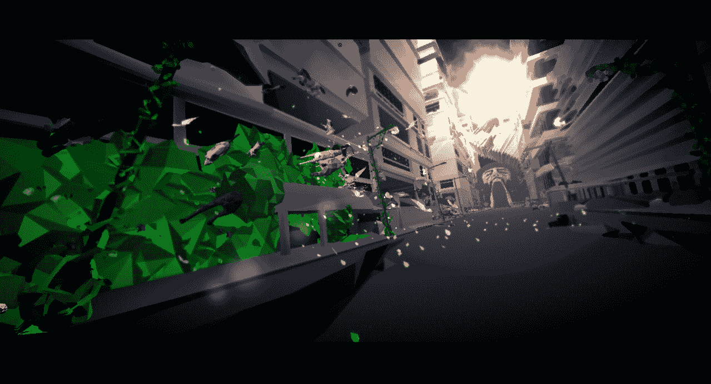

图 9.25。罗马的经历是绝对不容错过的。

这个为 Danger Mouse 的罗马项目制作的令人难以置信的音乐视频是一个很好的例子，展示了 WebGL 的交互性。在 Chrome 中查看它: [`www.ro.me`](http://www.ro.me) ，尽管它应该在最新的 Firefox 版本中也可以看到。这是一种令人惊叹的体验，甚至还有用户提交的沙漠中的 3D 模型。

你可以在这里观看这部电影背后团队的视频(尽管“电影”并没有公正地对待它)，以及体验的剪辑:[`www.youtube.com/手表？v=ReH7zzj5GPc`](http://www.youtube.com/watch?v=ReH7zzj5GPc) 。

看到未来设计师、艺术家和工程师用这种技术能做出什么将是令人兴奋的。(我只希望它不会变成太多的营销工具。想象一下，在一个主流新闻网站上阅读新闻，突然一个巨大的画布元素被覆盖，你被推入一个 3D“品牌体验”。)

### glfx.js 图像处理

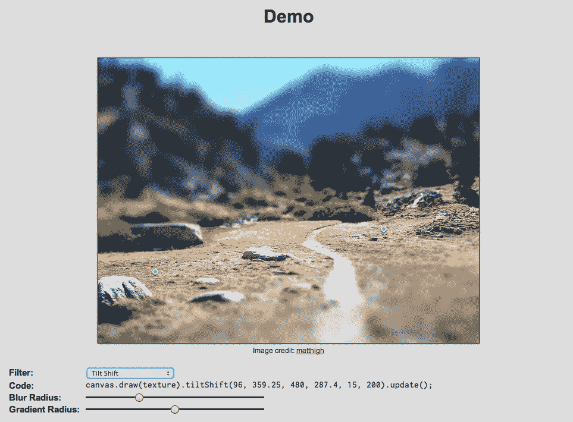

图 9.26。glfx.js 中的倾斜移动效果是许多 Photoshop 风格的效果之一。

早些时候，我们看到了 Canvas 如何在 2D 处理图像，但 WebGL 由于其硬件加速而释放出更大的能量:[`evanw.github.com/·glfx.js/`](http://evanw.github.com/glfx.js/)。WebGL 支持的 glfx.js 图像效果库允许我们应用硬件加速的、类似 Photoshop 的滤镜，如亮度/对比度、曲线、去噪、色调/饱和度、反锐化掩模、镜头模糊、倾斜偏移、三角形模糊、缩放模糊、彩色半色调、透视变换、漩涡等等。查看演示以了解它的运行情况:【http://evanw.github.com/·glfx.js/·演示/

### 地震二

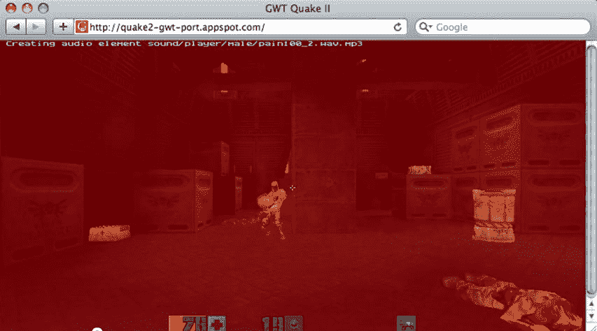

图 9.27。在浏览器中运行的雷神之锤 II 只使用了网络技术。

Quake II 也被移植到了 WebGL 上，使用“WebGL、Canvas API、HTML 5 `<audio>`元素、本地存储 API 和 WebSockets 来展示纯 web 应用在 Safari 和 Chrome 等现代浏览器中的可能性”。更多见:[`code.google.com/ p/quake 2-gwt-port/`](http://code.google.com/p/quake2-gwt-port/)。(你需要下载并编译代码来实际播放它，但这里有一个它在运行的视频:[`www.youtube.com/手表？v=fyfu4OwjUEI`](http://www.youtube.com/watch?v=fyfu4OwjUEI) 。WebGL 里还有一个雷神之锤 3 的试玩关卡在这里:[`media.tojicode.com/ q3bsp/`](http://media.tojicode.com/q3bsp/)。)

在一条推特的回复中说:

> 不确定 2010 年 JS 引擎速度的最佳代言是否是 1997 年的游戏端口...

乔尔·韦伯是港口的工程师之一，他写道([`blog.j15r.com/ 2010/04/quake-ii-in-html5-what-does-this-really.html`](http://blog.j15r.com/2010/04/quake-ii-in-html5-what-does-this-really.html)):

> 有什么意义？这段代码目前证明了在 WebGL 上构建一个“真正的”游戏是可行的，包括复杂的游戏逻辑、碰撞检测等等。它还出色地暴露了当前规范和实现中的弱点，我们可以并将使用这些信息来改进它们。[...]
> 
> 人们可以想象这样一个世界，游戏开发者可以像我们现在部署网页一样轻松地部署他们的游戏，用户也可以轻松地玩游戏。这是一个非常吸引人的想象世界。

发个链接。玩游戏。这就是 WebGL(和其他新兴的 3D 技术)将实现的。或者说，其实*就是*使能。

### GT 赛车:汽车学院

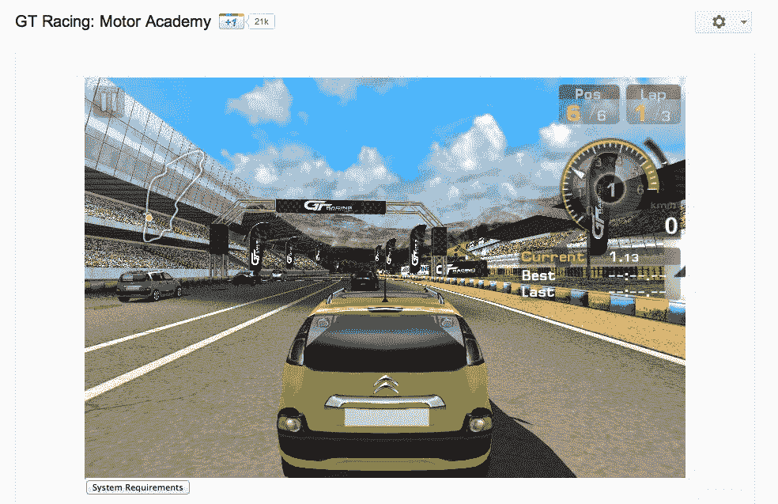

图 9.28。在 Google+上的浏览器中玩 GT 赛车直播。

2011 年 12 月，Gameloft 在 Google+([`plus.google.com/ u/0/games/777131296458`](https://plus.google.com/u/0/games/777131296458))上推出了他们的游戏 GT Racing: Motor Academy 的 WebGL 版本，该版本可以在 Chrome 和 Firefox 上运行。这不仅是对浏览器游戏技术未来的有趣观察，也是对社交网络分销的有趣观察。(Gameloft 的 Baudouin Corman 在这里与 Gamasutra 讨论了这些问题:[`www.gamasutra.com/ view/news/39273/Gameloft _ enchances _ html 5 _ With _ 3D _ Game _ GT _ racing . PHP`](http://www.gamasutra.com/view/news/39273/Gameloft_Embraces_HTML5_With_3D_Game_GT_Racing.php)。)

### 滑行赛车

图 9.29。这款类似游戏机的赛车可能代表了现代 3D 网络游戏的第一步。

GT 赛车也不是唯一一款基于 WebGL 的赛车游戏。Skid Racer 是一款基于 WebGL 的原创“卡丁车”,可以在 Chrome 网上商店([`chrome.google.com/网上商店/detail/bhoaojooagiaaiidlnfhkkafjpbbnnno`](https://chrome.google.com/webstore/detail/bhoaojooagiaaiidlnfhkkafjpbbnnno))买到。(讽刺的是，一个基于网络的，只有 Chrome 的游戏应该被注意到，但我们会给开发者一个好处，把它归结为发行问题。)

### 更多 WebGL 演示

以下是更多的 WebGL 演示和示例:

*   Mozilla 的**航海家之旅**演示([`videos-cdn.mozilla.net/服务器/ mozhacks/航海家之旅/`](http://videos-cdn.mozilla.net/serv/mozhacks/flight-of-the-navigator/) )是一个有趣的新网络技术混搭。它主要是一个带有 HTML5 音频的 WebGL fly through，但带有实时 Flickr 和 Twitter 集成。一些效果(广告牌上的交错、自动收报机显示、音频可视化)是用 Processing.js 和 2D 画布(我们之前看过)完成的，然后用来纹理化 3D WebGL 对象。太疯狂了。(点击这里了解更多:【http://vocamus.net/·戴夫/？p = 1233[。)](http://vocamus.net/dave/?p=1233)
*   Google MapsGL 是他们无处不在的地图服务的 WebGL 版本，其中 WebGL 用于增强体验。阅读更多相关内容，并在这里观看演示:【http://support.google.com/maps/·宾/answer . py？HL = en&answer = 1630790。
*   **CycleBlob** 是一款有趣的 3D 表面灯光循环游戏:【http://cycleblob.com/】??
*   **坦克世界**是一个很棒的小坦克射手:【http://www.playtankworld.com】??
*   Süperfad 的 **Mission Control** ，他们的“全球交通可视化工具”，是他们的谷歌分析交通的美丽的 3D 可视化。在这里看直播:【http://superfad.com/ mission control/在这里看:[`superfad.com/博客/帖子/ mission_control`](http://superfad.com/blog/post/mission_control) 。
*   更多的 WebGL 演示请看这些实验:[`www.chromeexperiments.com/ webgl`](http://www.chromeexperiments.com/webgl)或者这个传统画布以及 web GL 游戏的列表:[`www.netmagazine.com/特色/ top-20-html5-games`](http://www.netmagazine.com/features/top-20-html5-games) 。

## WebGL 仍处于早期阶段

WebGL 游戏和演示展示了不可思议的前景，但目前 WebGL 开发并不完全是吃喝玩乐。《黑客新闻》的一名开发人员评论了硬件不兼容、软件错误和不一致的问题，这些问题会使小团队的开发环境变得困难，他说([`news.ycombinator.com/ item？id = 3253016`](https://news.ycombinator.com/item?id=3253016)):

> 我们在不同的硬件和不同的浏览器上发现了如此多的不一致，以至于暂时不值得去做一个 WebGL 项目，尤其是对于一个小团队来说。我们写了一些运行时检查，但是我们仍然不能解释所有的错误，或者找到解决每一个错误的方法。

然而，正如上面的演示所示，令人惊奇的事情是可能的。如果你对 WebGL 的原始性能细节感兴趣，请查看这篇内容丰富的帖子:“HTML5 游戏制作工具 Construct 2 的开发者 Scirra 的 HTML5 2D 游戏性能分析”([`www.scirra.com/博客/58/html 5-2d-游戏性能分析`](http://www.scirra.com/blog/58/html5-2d-gaming-performance-analysis))，其中总结道:

> 硬件加速的 2D 画布很快，但 WebGL 更快。它属于原生引擎领域，坦白地说，考虑到 Javascript 的设计效率是如此之低，这是令人惊讶的，也证明了浏览器开发者在为 Javascript 编写 JIT 编译器方面所做的令人惊讶的工作。

希望微软和苹果很快找到一种方法在他们的桌面和移动平台上启用 WebGL，因为 WebGL 在浏览器中广泛传播的硬件加速 3D 的可能性确实非常令人兴奋。