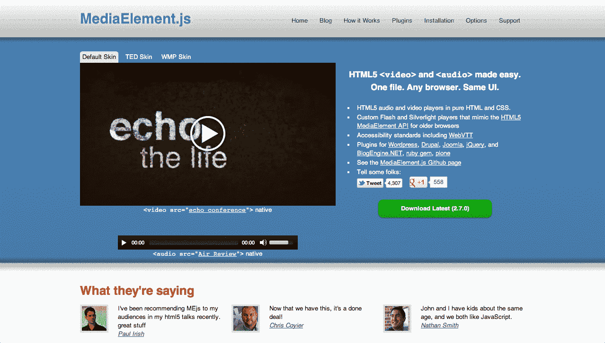
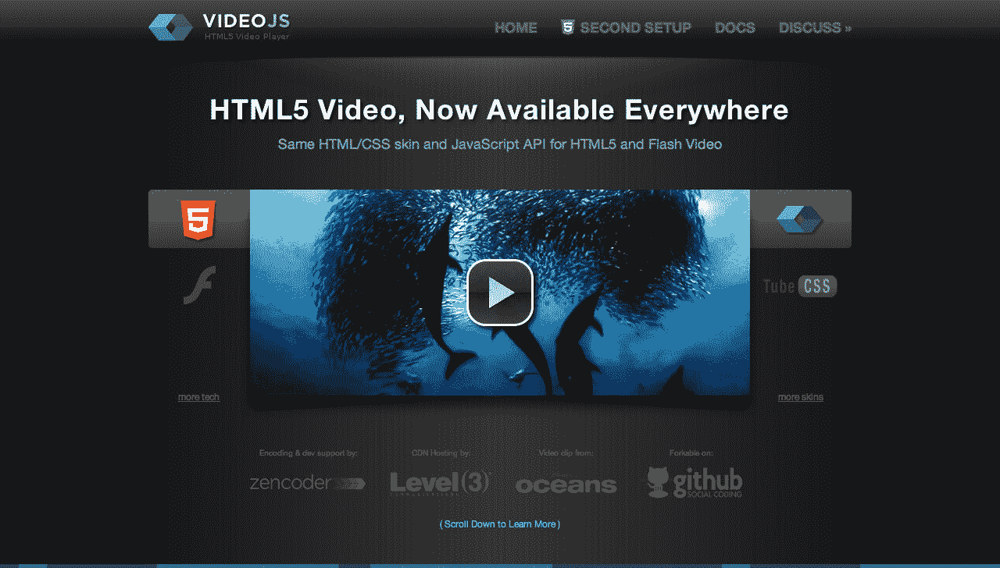
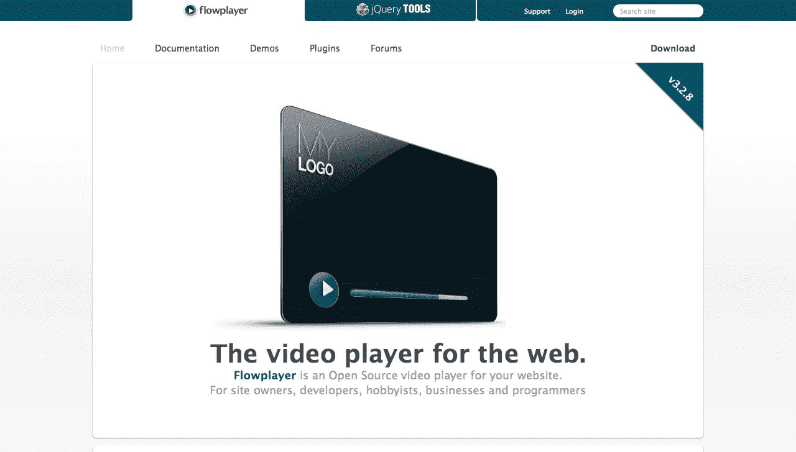

# 十、听不见`<audio>`，看不见`<video>`

`<audio>`和`<video>`都是 HTML 规范中受欢迎的新增内容。我们不使用专有工具(如 Flash)来显示图像，那么我们为什么需要它们来播放音频或视频呢？

不要误解我:我不是来抨击 Flash 的。没有它，我们就不会有 YouTube、Vimeo 和过去几年发生的视频革命。Flash 仍然提供高级视频功能(如直播、全屏播放和 DRM，尽管 DRM 很烦人)，这些功能要么没有开放标准的实现，要么只是非常初步的实现。

尽管如此，HTML5 `<video>`和`<audio>`几乎已经成为媒体交付的必备工具，原因只有一个:iOS。鉴于苹果决定不允许在其移动设备上使用 Flash，嵌入视频和音频以便 iPhone、iPad 和 iPod Touch 用户可以使用的唯一方法是使用这些新的 HTML5 元素。

但并不止于 iOS。正如我们在前一章中看到的，2011 年末，Adobe 宣布他们将完全放弃移动设备上的 Flash 插件，并将重点转移到原生应用和 HTML5 上。另外，微软 Windows 8 新的默认 Metro 界面中的 ie 浏览器不会支持任何插件。(关于 Flash 插件消亡的更多信息，请看上一章的讨论。)

我们正朝着后闪存的未来前进。不幸的是，我们的开放式技术还不能取代所有的闪存产品。Web standards 赢了，如果我们不小心的话，就会被抓个正着。这就让应用程序来填补空白，用特定于平台的软件把我们带回到 90 年代。

我们将很快回到我们的后闪光灯未来的问题。现在，让我们看看目前新的 HTML5 音频和视频元素。虽然这些元素的指定非常简单，但是规范之外的问题决定了它们的实现...*有趣，退一步说*。首先，我们来看一下基础。

## 原生<video>和

<audio>在行动</audio></video> 

那么我们如何使用这些新元素呢？理论上，这很简单。先说`<audio>`。

### 

<audio>元素</audio>

对于音频，我们可以使用:

`<audio controls autoplay loop muted preload="auto">
    <source src="myaudio.ogg" type="audio/ogg">
    <source src="myaudio.mp3" type="audio/mpeg">
    <!-- Fallback content, such as a Flash player, here -->
</audio>`

这将给出一个类似 Chrome 的例子(注意，浏览器会随意渲染`<audio>`元素，播放器大小可能会有相当大的差异):

图 10.1。默认 Chrome 音频播放器。

好吧，我们来过一遍。首先，如果你愿意，你*可以*在开始的`<audio>`标签中添加`src`属性，而不是使用`<source>`元素。但是由于编解码器支持令人难以置信的恼人问题(我们将很快深入研究)，我们经常需要指定两个源文件来实现最大的 HTML5 兼容性。

这就是`<source>`元素的用途。浏览器遍历`<source>`元素列表，直到找到它们支持的文件格式，或者(如果我们已经包含了)得到一个后备选项——可能是文件的链接，或者(更常见的)一个 Flash 媒体播放器。(有关实现快速回退的教程，请参阅下面的参考资料。)

`<audio>`和`<video>`都是以向后兼容的方式实现的，因为旧的浏览器(如 IE8)会完全忽略`<audio>`和`<source>`元素(IE8 只是将这些元素视为通用标签，如`<mymadeuptag>`)。这意味着我们包含的任何后备内容对旧的浏览器都是可见的，但被现代浏览器忽略了。

我们也可以使用脚本来给支持`<audio>`(或`<video>`)元素但*不支持*我们使用的编解码器的浏览器一个 Flash 后援。在这一章的最后，我们将看看为我们做了大量工作的媒体播放器。

### 

<audio>属性</audio>

回到`<audio>`元素。属性`controls`、`autoplay`、`loop`和`muted`是*布尔*属性——包含它们使它们成为`true`，不包含它们使它们成为`false`。(但鉴于`autoplay`和`loop`是魔鬼的工具，我们或许应该永远把它们排除在外。)属性使浏览器的播放器默认为静音(尽管对它的支持可能是不完整的)，属性告诉浏览器使用它的本地控件。(这些元素也可以通过 JavaScript API 来控制。)

还有一个`preload`属性是*不是*布尔值，而是可以是`none`、`metadata`(仅预加载文件的元数据)或`auto`，这通常意味着浏览器将预加载它。但这一设置只是一个提示——iOS 永远不会预加载数据，因为用户可能在昂贵的移动数据网络上。(浏览器对`preload`的支持相对较新。)

您可能还注意到了`<source>`元素上的`type`属性，例如:

`<source src="myaudio.mp3" type="audio/mpeg">`

这个属性告诉浏览器使用了什么样的容器格式，因此它可以判断出它是否支持该文件格式，而不必开始下载来检查。可悲的是，现代浏览器中的音频格式支持有点混乱，我们很快就会看到。

这只是对`<audio>`元素的简单描述。对于*实现*，我建议你使用 HTML5 友好的、基于 JavaScript 的媒体播放器。这将有助于解决实现问题，并避免你重新发明轮子，考虑到当前浏览器中不成熟的`<audio>`实现，这尤其有帮助。我们将在本章末尾讨论我们的媒体播放器选项。(但如果你想要一些简单的东西，你可以现在就去，试试 audio . js:【http://kolber.github.com/】audio js/。)

然而，对于音频文件*的准备*，你需要理解关于编解码器的问题，我们将在看完`<video>`元素后讨论这些问题。在这一章的后面，我们还会看看游戏的 HTML5 音频，并触及`<audio>`的缺陷和未来。

有一个操纵`<audio>`和`<video>`的 JavaScript API(允许你滚动自己的控件来播放、暂停、调节音量等。)，这在下面的参考资料和教程中有所介绍。

有关更多`<audio>`资源，请参见:

*   关于`<audio>`和`<video>` JavaScript API 的基础，参见:【https://developer.mozilla.org/】en/DOM/HTMLMediaElement。
*   谷歌的 HTML5 Rocks“实现 HTML5 音频标签的快速指南(回退到 Flash)”:[`www.html5rocks.com/教程/音频/快速/`](http://www.html5rocks.com/tutorials/audio/quick/) 。
*   戴夫。Opera 的“一个 HTML5

    <audio>电台播放器”:[`dev.opera.com/文章/查看/html 5-音频-电台-播放器/`](http://dev.opera.com/articles/view/html5-audio-radio-player/) 。</audio>

*   Neutron Creations 的“用 jQuery 构建定制的 HTML5 音频播放器”:[`neutroncreations.com/博客/Building-a-Custom-html 5-Audio-Player-with-jQuery/`](http://neutroncreations.com/blog/building-a-custom-html5-audio-player-with-jquery/)。
*   Safari 和 iOS 实现见 Safari 开发者库:[`developer.apple.com/库/Safari/# documentation/Audio Video/Conceptual/Using _ html 5 _ Audio _ Video/Introduction/Introduction.html`](http://developer.apple.com/library/safari/#documentation/AudioVideo/Conceptual/Using_HTML5_Audio_Video/Introduction/Introduction.html)。
*   SoundManager 2 目前是“单一 JavaScript API 下可靠的跨平台音频”的首选开源音频库:[`www.schillmania.com/项目/ soundmanager2/`](http://www.schillmania.com/projects/soundmanager2/) 。

将`<audio>`和`<video>`元素作为普通 HTML 提供的好处是，您可以用 CSS(包括高级的 CSS3)来设计它们的样式。检查出美丽的禅宗音频播放器(播放女孩说话没少)，看看有什么可能:【http://lab.simurai.com/】禅宗播放器/[。](http://lab.simurai.com/zen-player/)

图 10.2。Zen 音频播放器真的是一个美丽的东西——一定要看到它的行动。

理解`<audio>`的关键是编解码器的情况，所以请继续阅读，我们将在简单浏览`<video>`元素后深入研究。

### <video>元素</video>

对于视频，我们可以使用:

`<video controls autoplay loop muted preload="auto" poster="myvideobackground.jpg" height="250" width="300">
    <source src="myvideo.webm" type="video/webm">
    <source src="myvideo.mp4" type="video/mp4">
    <!-- Fallback content, such as a Flash player, or a link to the file here -->
</video>`

(如果你想知道*与`<video>`的实现到底有什么*，包括浏览器问题、设置 MIME 类型等等，请看 Kroc Camen 精彩透彻的“人人视频”文章:[`camendesign.com/代码/人人视频`](http://camendesign.com/code/video_for_everybody)。)

如您所见，这与`<audio>`示例的设置相似。事实上，`controls`、`autoplay`、`loop`、`muted`和`preload`属性的行为都是一样的。但是它们不像音频那样是魔鬼的工具。在这里，我们可以有一个自动播放，循环播放的视频广告是静音的，直到用户另有决定。

就像`<audio>`一样，我们必须通过指定多个视频文件来处理编解码器支持问题，以实现最大的 HTML5 兼容性。我们使用`<source>`标签给浏览器一个视频文件列表，浏览器要么使用他们支持的第一个视频文件，要么使用后备内容(比如 Flash 播放器)。`type`属性提示浏览器应该尝试播放哪个文件。我们将在查看编解码器的情况后讨论这一点。

元素有几个自己独特的属性。主要的一个是`poster`，它是静态图像，一直显示到视频的第一帧可用。在某些情况下，这可能只有一两秒钟，但在移动设备(如 iOS)上，海报会一直显示，直到用户开始播放。

(至少理论上是这样。IE9 对`poster`图片的处理很古怪，伊恩·德夫林发现:[`www . iandevlin . com/blog/2011/12/html 5/the-problem-with-the-poster-attribute`](http://www.iandevlin.com/blog/2011/12/html5/the-problem-with-the-poster-attribute)。iOS 3 中的一个 bug 阻止了使用`poster`和`<source>`元素时的视频播放。运行 iOS 3.x 的 iPad 会忽略除第一个`<source>`元素之外的所有元素。Android 2.x 的整个`<video>`实现似乎是一个巨大的错误。更多信息，请参见上面的人人视频文章。)

`height`和`width`属性也是特定于`<video>`元素的。但是同样，因为`<video>`元素只是 HTML 的另一部分，它可以用 CSS 进行样式化和操作，包括高级的 CSS3。您可以对视频本身进行变换和制作动画，添加阴影等等。这是`<video>`成为 DOM 中另一个元素的最酷的事情之一。你甚至可以使用`<canvas>`元素来操作你的视频源，正如这里所讨论的:[`html5doctor.com/视频-画布-魔术/`](http://html5doctor.com/video-canvas-magic/) 。

### 视频可访问性

媒体无障碍也在发展之中。规范中增加了一个`<track>`元素来提供字幕。或者，正如规范所说:“track 元素允许作者为媒体元素指定明确的外部定时文本轨道”([`dev.w3.org/ html 5/spec/Overview.html # The-track-element`](http://dev.w3.org/html5/spec/Overview.html#the-track-element))。`<track>`元素位于`<video></video>`标签之间，如下所示:

`<track kind="subtitles" src="moviecaptions.en.vtt" srclang="en" label="English">`

您可以在这里找到关于这些问题和建议解决方案的介绍和讨论:[`blog.gingertech.net/ 2011/03/29/web vtt-explained/`](http://blog.gingertech.net/2011/03/29/webvtt-explained/)和这里:[`www.iandevlin.com/博客/2011/05/html 5/web vtt-and-video-subtitle`](http://www.iandevlin.com/blog/2011/05/html5/webvtt-and-video-subtitles)。

目前只有 IE10 和 Chrome 18(在我写的时候是测试版)支持`<track>`。有关更多信息，请参见“HTML5 track 元素入门”([`www.html5rocks.com/·恩/教程/ track/基础/`](http://www.html5rocks.com/en/tutorials/track/basics/) )。

### API 和资源

新的 HTML5 JavaScript API for media 还处理视频回放，这让您可以滚动自己的控件。这在下面的参考资料和教程中有所涉及。

有关更多`<video>`资源，请参见:

*   “人人视频”值得一读和/或收藏:[`camendesign.com/代码/人人视频`](http://camendesign.com/code/video_for_everybody)
*   谷歌的 HTML5 Rocks HTML5 视频文章涵盖了基础知识和一些非常不错的例子，包括 SVG 和视频:[`www.html5rocks.com/恩/教程/视频/基础知识/`](http://www.html5rocks.com/en/tutorials/video/basics/) 。
*   马克·皮尔格林关于视频的 HTML5 章节有关于编解码器(以及编解码器和容器文件之间的区别)、编码、浏览器支持、服务器 MIME 类型等所有血淋淋的细节:[`diveintohtml5.info/·video.html`](http://diveintohtml5.info/video.html)。
*   戴夫。Opera 有一个关于 HTML5 视频的广泛指南，乐观地题为“你需要知道的关于 HTML5 视频和音频的一切”:[`dev.opera.com/文章/查看/你需要知道的关于 html5 视频和音频的一切/`](http://dev.opera.com/articles/view/everything-you-need-to-know-about-html5-video-and-audio/) 。
*   《Safari 开发者库 HTML5 音视频指南》有 Safari 和 iOS 相关实现的全部来龙去脉:[`developer.apple.com/库/Safari/# documentation/Audio Video/Conceptual/Using _ html 5 _ Audio _ Video/Introduction/Introduction.html`](http://developer.apple.com/library/safari/#documentation/AudioVideo/Conceptual/Using_HTML5_Audio_Video/Introduction/Introduction.html)。

`<video>`的救星是独立的 JavaScript 播放器，它让我们使用一个文件，HTML5(和一个给定的编解码器)在它支持的地方，Flash 在其他地方。

我们稍后将讨论媒体播放器。同时，抓一把头发，准备拉。

## 编解码器，你要杀了我

好了，HTML5 适用于现代浏览器，Flash 作为老浏览器的后备。明白了。

没那么快。这就是 HTML，与其说是“任何可能出错的东西都会出错”，不如说是“任何可能引起分歧的东西都会引起分歧”。这里的分歧在于音频和视频的编解码器。

如果你使用图像标签，所有的浏览器都可以显示图像，无论是 JPEG、GIF 还是 PNG——没有强制的格式。

HTML5 规范(不情愿地)对`<audio>`和`<video>`标签采取了类似的观点，没有为音频或视频指定特定的格式(即编解码器)。您指定想要使用的格式，这取决于浏览器是否支持它(或者不支持，我们将会看到)。

现在，如果浏览器供应商都同意一种格式(或几种格式)，我们将在所有现代浏览器中拥有通用的 HTML5 音频和视频。不幸的是，这并没有发生。下面是 HTML5 编辑伊恩·希克森对 2009 年年中情况的报道([`lists.whatwg.org/·皮珀梅尔/whatwg-whatwg.org/ 2009-6 月/020620.html`](http://lists.whatwg.org/pipermail/whatwg-whatwg.org/2009-June/020620.html)):

> 在公开和私下对 HTML5 中的<video>和
> 
> <audio>的编解码器的情况进行了大量的讨论后，我很不情愿地得出结论，没有一个合适的编解码器是所有供应商都愿意实现和发布的。</audio></video> 
> 
> 因此，我已经删除了 HTML5 规范中需要编解码器的两个小节，并保留了未定义的内容，就像过去对其他功能所做的一样，如和图像格式、<embed>和插件 API，或 Web 字体和字体格式。

## 专利问题

就编解码器达成一致的问题归结于专利。一些媒体格式—包括用于音频的 mp3(是的，不起眼的. MP3)，以及用于视频的流行的 H.264 格式(通常用于. mp4 和。mkv 文件)——拥有专利，使得公司支付许可费来使用他们产品中的解码器。

对于苹果、微软和 Adobe(使用 Flash)这样的大公司来说，这不是问题——他们支持 MP3 和 H.264。但出于意识形态和财务原因，Opera 和 Mozilla 不支持 MP3 音频，也不支持 H.264 视频。(2011 年初，谷歌威胁要在桌面上放弃 Chrome 对 H.264 的支持，但截至 2012 年初，这种情况还没有发生。见帖:[`blog.chromium.org/ 2011/01/html-video-codec-support-in-chrome.html`](http://blog.chromium.org/2011/01/html-video-codec-support-in-chrome.html)。)

是的，这是一场格式战。而且这个问题不太可能很快得到解决。

有哪些替代方案？在音频领域，Mozilla 和 Opera 支持无专利的 Ogg 格式(视频也是如此，但被认为是次等的)。2010 年中期，谷歌发布了理论上无专利的 WebM 视频格式(花了整整 1 亿美元购买)，以提供一种“我们就不能和睦相处吗？”每个人都可以使用的视频解决方案，从而解决了僵局。

所以每个人都可以换成那些，对吗？不完全是。对于真正“无专利”的东西，通常必须在法庭上得到证明。因此，微软和苹果采取了一种“更好的魔鬼你知道”的方法，并为他们使用的编解码器支付专利费，特别是视频和 H.264。他们认为这样做比选择所谓的“无专利”技术更好，这种技术可能并不那么无专利，可能会在未来使他们承担责任。事实上，已经有人提出了潜在的 WebM 专利侵权问题，所以这些是合理的担忧。(那是浓缩版，无论如何！)

## H.264 是在

即使每个人都可以用 WebM 看视频，苹果*或*谷歌(安卓系统)也不可能发布软件更新，让每个人都用 WebM 看视频(特别是在手机上)。

为什么不呢？

H.264 在移动设备(以及桌面和其他设备)中使用硬件加速，这是我们如何在低功耗设备上观看高质量视频而不破坏电池寿命的方法。

再加上其他问题，比如围绕 H.264 构建的行业工具链，情况就变得更加模糊了。你可以明白为什么即使苹果、微软和其他公司决定向这个方向发展，从 H.264 大规模转变也是困难的(至少在中短期内)。正如一位黑客新闻评论者所说(【http://news.ycombinator.com/】item？id = 2106285):

> 数字视频世界运行在 H.264 上，它有深厚、复杂、昂贵的内部工具链来支持它，传统的档案编码在其中，基本上整个业务都围绕它建立。视频制作世界比你想象的要大得多，也复杂得多。

对于所有的供应商来说，在可预见的将来，移动设备上的 H.264 是一个不争的事实。

## 谷歌威胁说只采用 Chrome WebM，但后来没有这样做

我们来看看谁支持什么。

如前所述，谷歌在 2011 年初宣布，他们将从 Chrome 中移除对 H.264 的支持，专注于 WebM(见公告:【http://blog.chromium.org/】2011/01/html-video-codec-support-in-chrome.html)，但截至 2012 年初撰写本文时，这还没有实现。谷歌旗下的 YouTube 正在将他们所有的视频转码为 WebM，这样他们就可以同时服务于 WebM 和 H.264。是的，他们(据称)正在复制他们的整个 YouTube 库。2011 年 4 月，他们宣布他们“已经对视频进行了代码转换，这些视频占据了网站 99%的浏览量或者所有视频的近 30%”(【http://youtube-global.blogspot.com/】2011/04/mmm-mmm-good-youtube-videos-now-served.html)。

(有趣的事实:他们还提到，截至 2011 年年中，每天有六个*年*的视频被上传到 YouTube*。)*

 *至于微软，他们分享苹果的立场，坚持使用 H.264(见:[`www.fastcompany.com/ 1723373/微软-站在苹果一边-在谷歌上-h264-视频`](http://www.fastcompany.com/1723373/microsoft-sides-with-apple-over-google-on-h264-video))。如果用户安装了编解码器，他们允许本地 WebM 播放*，但是没有发货支持。*

谷歌和微软随后发布了针锋相对的插件。谷歌为 IE9 发布了一个 WebM 插件([`tools.google.com/ dl page/webmmf`](http://tools.google.com/dlpage/webmmf))，尽管它是否被大量采用还有待观察。微软反过来发布了 Chrome 的 H.264 插件(见:[`blogs.msdn.com/ b/inter operability/archive/2011/02/01/greater-inter operability-for-Windows-customers-with-html 5-video . aspx`](http://blogs.msdn.com/b/interoperability/archive/2011/02/01/greater-interoperability-for-windows-customers-with-html5-video.aspx))和 Firefox(见:[`blogs.msdn.com/ b/inter operability/archive/2010/12/15/html 5-video-and-interop-Firefox-add-on-provides-h-264-support-on-Windows . aspx`](http://blogs.msdn.com/b/interoperability/archive/2010/12/15/html5-video-and-interop-firefox-add-on-provides-h-264-support-on-windows.aspx))

Opera 和 Mozilla 拒绝支持 H.264，分别在 Opera 10.6+和 Firefox 4+中加入了 WebM 支持。(Firefox 3.x 及更早的 Opera 版本只提供 Ogg Theora 支持。)Mozilla 对 H.264 的立场似乎正在转变，我们将在下面看到。

Adobe 已经表示，他们将在 Flash 的未来版本中支持 WebM，但尚不清楚何时会出现全面支持。(见本故事中的简短提及:[`news.cnet.com/ 8301-30685 _ 3-2006 13 15-264 . html`](http://news.cnet.com/8301-30685_3-20061315-264.html)。)Flash 11 于 2011 年末发布，不支持 WebM。

即使将来某个版本的 Flash 支持 WebM，它也没什么价值。苹果在 Safari 中不支持 WebM，iOS 上不支持 WebM 和 Flash 未来的 Android 设备不会支持 Flash(鉴于 Adobe 已经放弃了移动设备上的 Flash 插件),并且所有当前的 Android 设备都不支持 WebM 微软不会在他们的 Windows Phone 平台上(或实际上在 Metro 上)支持 Flash，这意味着 H.264 将是移动视频的必要条件(至少是)以支持传统和未来的设备。

关于浏览器和设备兼容性的进一步分析，请看这里的图表:[`mediaelementjs.com`](http://mediaelementjs.com/)。

## 编解码器:做什么？

唷！那我们该怎么办？

如果你想要最大限度的原生 HTML5 支持——包括 Firefox 和 Opera——你需要存储两份音频文件(MP3 和 Ogg Vorbis)，可能还有三份视频文件(H.264、WebM 和 Ogg Theora 用于 Firefox 3.x 的传统支持)。必须编码和存储这么多不同的版本是一个皇家的屁股痛，但你去那里。

或者，您可以:

*   将 MP3 用于音频，它原生适用于 Safari、IE9 和 Chrome(包括 iOS 和 Android)。
*   视频使用 H.264，在 iOS、Safari 和 IE9 中可以原生工作。
*   如果 Flash 可以在任何支持 Flash 的浏览器或设备上播放 MP3 和 H.264，那么可以为旧的和不支持编解码器的设备使用一个使用 Flash 播放器的媒体播放器(或自己编写脚本)。

鉴于我们需要 H.264 用于 iOS(以及一般的移动设备),这种情况——我敢打赌这将是最常见的——意味着 Firefox、Opera 和 Chrome(用于视频)最终将采用 Flash。没错——那些支持自由开放软件的人最终会得到专有的、封闭的 Flash。这比潮人的胡子还讽刺。

(或者，如前所述，您可以对您的视频进行双重编码，并在第二个`<source>`元素中提供一个单独的 WebM 文件，以便在现代浏览器中提供广泛的原生 HTML5 支持。)

## 现实咬人

然而现实可能有些不同。首先，谷歌还没有放弃对 H.264 的支持，而且(在撰写本文时)Mozilla 正在重新考虑他们反对支持这种编解码器的立场。

2012 年 3 月，Mozilla 公司的研究主管 Andreas Gal 在 Mozilla 邮件列表上发起了这场辩论，他建议 Mozilla([`groups.google.com/论坛/ #！msg/mozilla.dev.platform/-xte i5 ry thu/dk M9 aibknnij`](https://groups.google.com/forum/#!msg/mozilla.dev.platform/-xTei5rYThU/DkM9AIbkNNIJ)):

> 支持解码系统上现有解码器支持的任何视频/音频格式，包括 H.264 和 MP3。确实没有理由阻止我们的用户使用设备上已经存在的系统解码器，所以我们不会过滤任何格式。

这意味着 Mozilla 可以将 Firefox(特别是针对移动平台的)与对*操作系统的*授权解码器(如果有的话)的支持一起发布；避免数百万美元的许可费；并至少保持意识形态纯洁性的外表。这实际上不仅仅是 Firefox——Mozilla 正在开发他们自己的基于网络的移动*平台*,名为 Boot to Gecko(或 B2G，我们将在第十二章中介绍)，但是如果它不能像其他主要平台一样播放 H.264 视频(和 MP3 音频),它就不会有太大的机会。(注意，Gal 在 Mozilla 公司的职位并没有让他对 Firefox 或 Mozilla 项目的方向有任何特别的影响力，他只是作为一个贡献者。)

但是谷歌不是应该已经用 WebM 解决了这个问题吗？又是这个女孩([`groups.google.com/论坛/ #！msg/mozilla.dev.platform/-xte i5 ry thu/iz 767 iw v1 juj`](https://groups.google.com/forum/#!msg/mozilla.dev.platform/-xTei5rYThU/iZ767IwV1jUJ)):

> 谷歌承诺了很多事情，但他们没有坚持到底，我们的用户和我们的项目正在为此付出代价。H.264 不会消失。再坚持一会儿我们什么也买不到。

正如火狐开发者 Justin Dolske 在邮件列表讨论([`groups.google.com/论坛/ #！msg/mozilla.dev.platform/-xtei 5 ry thu/3d6e-Sgo _ ZQJ`](https://groups.google.com/forum/#!msg/mozilla.dev.platform/-xTei5rYThU/3d6e-Sgo_ZQJ)):

> 但我认为，如果 Mozilla 要在开放视频标准上做一个大转变(这是一个大转变)，那么应该就此进行一些严肃的讨论。当然不只是简单的几句话，说这是毫无希望和显而易见的。这让它听起来更像一个半心半意的通知，一个已经是最终决定。
> 
> 至少，需要对其进行足够的解释，以便社区能够理解这种变化。我们花了很多时间，写了很多博客，讨论 H.264 为什么对网络有害。让那些支持我们的人突然陷入困境感觉不是一件正确的事情。

H.264 势头强劲，而 Mozilla 面临着实用主义和意识形态之间的艰难抉择。尽管 H.264 是非免费的，但它是事实上的标准(很像 MP3 ),他们需要支持它，否则就会落后。(更多内容参见 Ars Technica 的报告:[`arstechnica.com/小工具/新闻/ 2012/ 03/理想主义-实用主义-Mozilla-辩论-支持-h264-视频-回放. ars`](http://arstechnica.com/gadgets/news/2012/03/idealism-vs-pragmatism-mozilla-debates-supporting-h264-video-playback.ars) 。随着 Ars 的发展，关注它们的更新。)

Mozilla 的首席技术官布伦丹·艾希(Brendan Eich)在《视频、移动和开放网络》([`hacks.mozilla.org/ 2012/03/Video-Mobile-and-the-Open-Web/`](http://hacks.mozilla.org/2012/03/video-mobile-and-the-open-web/))中支持了 Gal 的提议，他写道:

> 我可以确定的是:H.264 现在绝对需要在手机上竞争。我不认为我们可以在安卓或 B2G 的 Firefox 中拒绝 H.264 内容，并在向手机的转移中幸存下来。
> 
> 输掉一场战斗是一次痛苦的经历。我不会粉饰这药。但是，如果我们要在我们的移动计划中取得成功，我们必须吞下它。移动领域的失败很可能会让 Mozilla 走向衰落，变得无关紧要。所以我完全赞成安德里亚斯的提议。

如果这是 Mozilla 采取的路线，很难想象 Opera 会无限期地坚持下去。这实际上意味着，从长远来看，用 H.264(带有针对旧浏览器的 Flash 后备)和 MP3(同上)编码媒体就足够了。

## 视频类型...天哪

现在，您(希望)了解了编解码器情况的复杂性，以及浏览器对每种编解码器的支持方式的不同，让我们看看如何告诉浏览器我们正在使用哪些编解码器，以便他们可以就加载哪些视频做出明智的决定。

这就引出了我们还没有讨论的一个视频属性——`<source>`元素上的`type`属性，例如:

`<source src="myvideo.mp4" type="video/mp4">`

该属性告诉浏览器什么*容器*和*编解码器*用于在`src`属性中指定的视频。在上面的例子中，我们仅通过列出 MIME 类型(即媒体格式类型)来指定使用什么*容器*格式。上面的 MIME 类型告诉浏览器“这个文件是使用 mp4 容器格式的视频”。*像 mp4 这样的容器格式*有点像 zip 文件，因为它们只是一个用于*实际的*视频和音频文件的容器，这些文件使用特定的*编解码器*进行编码，并打包成最终的视频文件。(`type`属性也可以用在`<video>`元素本身上，而不仅仅是嵌套的`<source>`元素上，如果你只使用一个文件的话。同样的道理也适用于`<audio>`。)

我们放在 type 属性中的信息只是给浏览器的一个提示，但浏览器并不一定要播放视频*。**所需要的*就是编辑你的。htaccess 文件，以确保您的服务器以正确的 MIME 类型发送这些文件，正如这里的说明所描述的:【http://mediaelementjs.com/】，并在其他地方有所涉及(例如前面提到的“人人视频”文章)。

我们还可以指定使用的容器格式*和*编解码器，例如:

`<source src="myvideo.mp4" type='video/mp4; codecs="avc1.42E01E, mp4a.40.2"'>`

这里我们指定了容器格式，*和*源文件中视频和音频的编解码器。(视频编解码器是 H.264 的一种风格，还有 AAC 音频编解码器。注意，我们还必须在这里对`type`属性使用单引号，因为编解码器参数使用双引号。)

这一切有什么意义？嗯，指定`type`属性意味着浏览器不必开始下载每个列出的文件，只是为了检查它是否可以播放。它可以扫描标记，并可能开始预加载它支持的视频文件。然而，忽略它并不是世界末日。摘自长尾视频 2012 年的“HTML5 视频现状”([`www.longtailvideo.com/ html 5/`](http://www.longtailvideo.com/html5/)):

> 每个浏览器都支持<source>标签来加载多个源。我们的测试表明，包含 type 属性会阻止一些预加载，但会破坏与 Android 2.2 的兼容性。在“类型”属性中设置编解码器对任何浏览器都没有影响。

注意 Android 2.2 兼容性问题。关于编解码器的评论表明，从 LongTail 的测试来看，我们(总的来说)只需要指定*容器*，浏览器就会加载它。

### 用 JavaScript 查询支持的视频类型

我们还可以使用`<video>` JavaScript API 及其`canPlayType()`方法查询浏览器，以查看浏览器支持哪些格式。例如，对于我们上面指定的编解码器(“avc1.42E01E，mp4a.40.2”)，支持这些格式的浏览器(Safari 和 IE9+)将会以`probably`响应，这与我们在 HTML5 中获得的“是的，我们支持此文件”非常接近。如果我们只指定容器格式(' video/mp4 ')，Safari 和 IE9+(比如)用`maybe`响应，因为它们知道自己可以读取那个容器格式，但不知道里面是什么编解码器。不支持给定容器或编解码器格式的浏览器只会返回一个空字符串。

然而事情变得非常复杂。以下是我们必须处理的三个变量:

*   **浏览器回应:**由于编码媒体(尤其是视频)的复杂性，浏览器只能确定它们*不能*播放它们不理解的格式。在这些情况下，它们返回一个空字符串(当通过`canPlayType()`方法查询时)。除此之外，HTML5 规范规定，他们必须返回`maybe`或`probably`，这取决于浏览器是否有信心根据我们提供的信息播放某个文件。
*   **容器和编解码器:**有 mp4 等*容器*格式，有实际编解码器，更准确的说是实际编解码器的*口味*(如 avc1.42E01E)，可以查询。
*   **浏览器支持:**最后，正如我们所看到的，主流浏览器的编解码器支持是一个相当复杂的情况。

因此，我们有多种浏览器，支持多种容器/编解码器(针对音频和视频)，并给出三种响应之一。幸运的是，WHATWG 维护了一个浏览器响应表，因此我们可以看到对于给定的容器格式，或者容器和编解码器组合，我们*应该*从给定的浏览器:【http://wiki.whatwg.org/】wiki/Video _ type _ parameters # Browser _ Support 获得哪个响应。微软有一个小脚本演示了这是如何工作的:【http://msdn.microsoft.com/ de-de/library/hh 325437(v = vs . 85)。aspx 。

(还要注意的是，我们实际上得到的浏览器响应可能是错误的，正如 2010 年中期的这篇略显陈旧的帖子所暗示的那样:【http://rakaz.nl/】2010/06/problems-with-html5-video-codec-detection.html。)

## 音频和视频媒体播放器来拯救

真是一团糟。

幸运的是，人们已经编写了工具，可以将正确的视频(或音频)提供给正确的浏览器。这些媒体播放器在整个编解码器混乱和遗留支持问题中帮助您；提供丰富的定制选项；并且总体上使整个实现过程变得平滑。

这里有几个例子:

### 媒体元素(视频和音频，免费)

[`mediaelementjs.com`](http://mediaelementjs.com/)

一种流行的音频和视频播放器，允许您使用一个文件(例如，H.264 视频文件)并在所有使用 Flash(或 Silverlight)的设备上部署一致的 UI，以便在 H.264 本身不支持的地方播放。它附带了一个 jQuery 插件，以及 Drupal 和 Wordpress 的插件。

### VideoJS(视频，免费)

[`videojs.com`](http://videojs.com/)

VideoJS 是一个漂亮的 HTML5 视频播放器，它提供了一些熟悉的基于 CSS 的皮肤，以及类似的对 HTML5 视频的广泛支持。它为每个人使用来自视频的标记(我们之前链接过这个)，并添加了 JavaScript 以获得更广泛的兼容性和 CSS 皮肤选项。

### Flowplayer(视频、免费和商业)

http://flower player . org

带有 Flowplayer 品牌的免费开源播放器。还有一个不带品牌的商业产品(带支持选项)。

### 更多媒体播放器

还有各种各样的其他参与者，包括:

*   jp player(【http://www.jplayer.org】??)，一个免费的开源音频和视频播放器(带有方便的播放列表支持)
*   **打开标准媒体(OSM)播放器**([`www.mediafront.org/项目/ osmplayer`](http://www.mediafront.org/project/osmplayer) )，这是一个用 jQuery 编写的免费音频和视频播放器，有一个可视化播放列表
*   **JW 播放器**(【http://www.longtailvideo.com/】玩家/ )，另一个支持 HTML5 的选项
*   **SublimeVideo**(【http://sublimevideo.net/】)一款付费托管的 HTML5 播放器解决方案。
*   **Popcorn . js**(【http://popcornjs.org/】)是一个“JavaScript 事件框架”，是 Mozilla Popcorn 项目的一部分:[`mozillapopcorn.org/`](http://mozillapopcorn.org/)。如果您想要触发页面上其他内容的更新与视频同步，这将非常有用。

(当然，您可以随时使用 YouTube 或 Vimeo，让原生 iOS 播放自行处理！)

有了这些解决方案，就不需要推出您的定制解决方案。从货架上随便拿一个，尽情享受吧。

## HTML5 视频美中不足的还有:DRM、流媒体和全屏视频

我们已经有了基本的`<video>`和`<audio>`嵌入，但即使有了我们方便的、随时可用的媒体播放器和它们的 Flash 后备，仍然有一些 HTML5 视频缺乏的(或非常不成熟的)功能，而 Flash 支持这些功能。请记住，微软将*而不是*在 Windows 8 的 Metro 界面中支持 IE10 中的 Flash(如果用户想使用 Flash，它会将用户踢出“桌面”界面)，因此迟早会有相当大的压力来添加这些功能。说到 DRM，这可能不是一件好事。

### 数字版权管理

2012 年 2 月，来自谷歌、微软和网飞的代表向 W3C 的 html 工作组提交了加密媒体扩展 v0.1 提案草案([`dvcs.w3.org/ Hg/HTML-Media/raw-file/tip/Encrypted-Media/encrypted-media.html`](http://dvcs.w3.org/hg/html-media/raw-file/tip/encrypted-media/encrypted-media.html))。该提案的摘要称:

> 这个提议扩展了 HTMLMediaElement，使其能够回放受保护的内容。所提出的 API 支持从简单的明文密钥解密到高价值视频(给定适当的用户代理实现)的用例。许可证/密钥交换由应用程序控制，有助于开发支持一系列内容解密和保护技术的强大回放应用程序。HTML5 规范中没有添加“DRM”，只需要简单的明文密钥解密作为公共基线。

也就是说，这将通过扩展它们的 JavaScript API(`HTMLMediaElement`接口)为`<audio>`和`<video>`提供一种在 HTML5 之上进行 DRM 的机制。HTML5 的编辑伊恩·希克森回应道([`lists.w3.org/档案馆/Public/Public-html/2012 feb/0274.html`](http://lists.w3.org/Archives/Public/public-html/2012Feb/0274.html)):

> 我认为这个提议是不道德的，我们不应该追求它。

在这里，希克森也声明了“DRM 是邪恶的”，并进一步阐述了他断然拒绝该提议的理由:[`www.w3.org/ Bugs/Public/show _ bug . CGI？id = 10902 # c24`](https://www.w3.org/Bugs/Public/show_bug.cgi?id=10902#c24)。Mozilla 也表达了担忧，因为 DRM 和开源浏览器通常是相互排斥的(更多信息请参见这篇 Ars Technica 文章:【http://arstechnica.com/商业/新闻/ 2012/ 02/不道德-html-视频-复制-保护-建议-被标准批评-利益相关者. ars )。

我基本上同意希克森的观点。DRM 是邪恶的。还记得 PlaysForSure 吗？没有吗？没错。

视频 DRM 和音频 DRM 有一个重要的区别，那就是流媒体。我们有流媒体(和租赁)视频的文化，在某种程度上，当音乐 DRM 战争肆虐时，我们没有音频。当 DRM 应用于你购买的音乐时，它很糟糕，因为如果 DRM 平台死了(他们确实死了)，你的音乐收藏也会死。流媒体的时间特性缓解了这些担忧，但只是在一定程度上。(如果它可以在流媒体上实现，不难想象媒体巨头也会坚持对购买的内容进行 DRM。)

围绕“受保护”内容流的这些问题解释了为什么网飞有兴趣在使用网络标准时看到某种 DRM 可用。在可能的情况下(正如他们在这里讨论的那样:[`techblog.netflix.com/ 2010/12/why-we-choose-html5-for-user.html`](http://techblog.netflix.com/2010/12/why-we-choose-html5-for-user.html))，网飞热衷于使用 HTML5(广义的“网络平台”意义上)，但他们显然认为他们需要某种 DRM 系统来传输他们通过 HTML5 许可的内容。(他们还需要一个实际的流协议，我们接下来会看到。)谷歌和微软的一些人显然也觉得这是必要的。(请注意，希克森也为谷歌工作，所以这不是一个全公司的职位。)

微软处于一个特别有趣的位置，因为他们不会在 Metro 的 IE10 中支持 Flash，但显然会希望提供一些机制，以便他们的用户仍然可以在 Metro 的 IE10 中访问“受保护的”流媒体视频服务。当然，另一种选择是流媒体视频公司将其服务实现为 Silverlight 驱动的 Metro 应用，并为这些用户完全从网络上移除。

这可能是另一个后 Flash web 导致的不是开放标准乌托邦，而是特定平台应用的回归的例子。也就是说，考虑到实现 DRM 的成本，这可能是标准运动愿意承受的代价。

当我写这篇文章时，W3C 邮件列表上的争论正在激烈进行，这里有一个摘要:[`lists.w3.org/档案馆/Public/Public-html/2012 mar/0087.html`](http://lists.w3.org/Archives/Public/public-html/2012Mar/0087.html)。

但是这种争论可能没有实际意义。2012 年 3 月，W3C 的 Philippe Le Hegaret 写道([`lists.w3.org/档案馆/公共/公共-html/2012 mar/0097.html`](http://lists.w3.org/Archives/Public/public-html/2012Mar/0097.html)):

> [L]让我们明确一点:W3C 有许多参与者对寻找媒体内容保护的解决方案感兴趣。因此，我们确实对这个领域感兴趣，不管 HTML 工作组是否对开发一个解决方案感兴趣，也不管它是否在一个单独的小组中完成。无论我们选择什么，我们都将尽最大努力在生产者和消费者之间取得适当的平衡。

也就是说，无论有没有你，我们都将实现 DRM，因为我们的付费会员需要它。不祥的东西。

### 流动

我们已经谈到了流媒体的 DRM 方面，但是其他的技术挑战呢？在 2010 年末，网飞讨论了一些他们已经确定的关于流媒体和 HTML5 的问题，并一直忙于这些问题:[`techblog.netflix.com/ 2010/12/html5-and-video-streaming.html`](http://techblog.netflix.com/2010/12/html5-and-video-streaming.html)。在 2011 年末，Ars Technica 发表了一篇优秀的文章《HTML 视频在后 Flash 时代的考验和磨难》([`arstechnica.com/商业/新闻/2011/11/The-trials-and-trivities-of-HTML-video-in-The-post-Flash-era . Ars`](http://arstechnica.com/business/news/2011/11/the-trials-and-tribulations-of-html-video-in-the-post-flash-era.ars))详细阐述了其中的一些问题，包括流媒体。Ars 的文章还指出:

> 将浏览器中的视频交付从 Flash 转换到 HTML5 也将给内容创作者带来一些重大挑战。这些标准还没有完全成熟，仍然有许多功能不被支持或不能在各种浏览器中广泛使用。
> 
> 为了说明问题有多严重，你只需要看看 Mozilla 的 Firefox Live 推广网站，该网站宣传该组织对开放网络的承诺，并展示了诺克斯维尔动物园小熊猫幼崽的直播视频。视频是用 Flash 流传输的，而不是使用基于标准的开放网络技术。
> 
> 在该网站的一个常见问题中，Mozilla 表示，它根本找不到基于开放编解码器和开放标准的高容量直播解决方案。如果 Mozilla 不知道如何用开放标准流式传输它可爱的吉祥物，这意味着还有工作要做。

流媒体标准已经在工作中有一段时间了:HTTP 上的动态自适应流媒体(DASH)，它得到了微软的支持，但在支持实现之前还有一段路要走。DASH 也是编解码器不可知的——它不能解决我们之前讨论的编解码器僵局。(有关更多信息，请参见“什么是 MPEG DASH？”:[`www.streamingmedia.com/文章/ ReadArticle.aspx？ArticleID=79041`](http://www.streamingmedia.com/Articles/ReadArticle.aspx?ArticleID=79041) 。)

苹果目前有自己的流媒体协议，HTTP Live Streaming (HLS)，用于向其 iOS 设备提供内容。谷歌在 Android 3.0+中增加了支持，它允许加密数据，并与第三方 DRM 解决方案配合使用。(参见“什么是 HLS (HTTP 直播流)？”更多:[`www.streamingmedia.com/文章/社论/现状-.../What-is-HLS-% 28 http-Live-Streaming % 29-78221 . aspx`](http://www.streamingmedia.com/Articles/Editorial/What-Is-.../What-is-HLS-%28HTTP-Live-Streaming%29-78221.aspx)。)

DRM、编解码器僵局、对新技术标准的支持以及现有标准的竞争。在基于标准的流媒体成为现实之前，有许多问题需要解决。

### 全屏幕

最后，我们对 Flash 视频做的最常见的事情之一是全屏显示。这在 HTML5 中是不可能的。然而，有一个全屏 API W3C 规范([`dvcs.w3.org/ Hg/full screen/raw-file/tip/overview . html`](http://dvcs.w3.org/hg/fullscreen/raw-file/tip/Overview.html))在 Firefox 10+和最近的 WebKit 浏览器(Chrome 15+和 Safari 5.1+)中有实验支持。目前还不清楚 IE10 是否会支持该功能。有趣的是，全屏 API 可以让*任何*元素全屏显示，包括(例如)`<canvas>`元素，例如，它也可以用于全屏阅读模式。

有关全屏 API 的更多信息，请参见:

*   Mozilla Hacks 博客有一个教程(包括样式信息)和一个演示，您可以使用。教程:[`hacks.mozilla.org/ 2012/01/using-the-full screen-API-in-web-browsers/`](http://hacks.mozilla.org/2012/01/using-the-fullscreen-api-in-web-browsers/)及演示:[`robnyman.github.com/fullscreen/`](http://robnyman.github.com/fullscreen/)。
*   这里还有一个教程:[`tutorialzine.com/ 2012/02/enhance-your-website-full screen-API/`](http://tutorialzine.com/2012/02/enhance-your-website-fullscreen-api/)。
*   请留意[`caniuse.com/ # feat =全屏`](http://caniuse.com/#feat=fullscreen)的浏览器支持统计和更多资源。

## HTML5

<audio>准备好游戏了吗？</audio>

关于`<audio>`及其游戏潜力的最后一点说明。

Dominic Szablewski 发布了一个史诗(和亵渎！)关于 HTML5 音频的状态，与开发 HTML5 游戏的关系。它非常值得一读，具有娱乐价值，并给出了 HTML5 音频支持(im)成熟度的一些指标，特别是对于交互目的。Szablewski 说。

> 令人惊讶的是，在所有优秀的桌面浏览器中，谷歌的 Chrome 对 HTML5 音频的支持最差——这是除 IE 之外的所有浏览器。我不是音频工程师，但在浏览器供应商尝试之前，我对数字音频的印象是这是一个已经解决的问题。我很惊讶，经过这么多次迭代后，HTML5 音频仍然是坏的。
> 
> 移动浏览器(iOS 和 Android)上的音频支持充其量是可笑的。即使是最简单的任务，它也完全不能用。你可以绕着圈子问得很好，但还是很糟糕。

(详见文章:[`www.phoboslab.org/日志/2011/03/the-state-of-html 5-audio`](http://www.phoboslab.org/log/2011/03/the-state-of-html5-audio)。我喜欢卑鄙的史蒂夫帽。)

简短的回答？不，它还没准备好玩游戏。

事实上，鉴于伊恩·希克森对这个问题的看法，高级音频 API 是否会很快成为 HTML 规范还是有争议的。2011 年 6 月，他写道([`lists.w3.org/档案馆/公共/公共-音频/2011 prjun/0118.html`](http://lists.w3.org/Archives/Public/public-audio/2011AprJun/0118.html)):

> 我不相信音频 API 真的是 Web 平台上下一个最重要的工作。[...][M]也许在不久的将来，Web 平台最好的音频 API 根本就不是 API。

与此同时，Flash 仍然是游戏高级、跨浏览器音频支持的必要条件，正如 Pixel 实验室的团队在他们出色的 Canvas-powered 版本《割断绳子》中发现的那样

Robby Ingebretsen 描述了 Pixel 实验室团队如何努力让 HTML5 音频适用于所有浏览器，但是([`nerdplusart.com/为什么在 html5 版本中有闪光`](http://nerdplusart.com/why-is-there-flash-in-the-html5-version-of-cut-the-rope)):

> 我们面对的不仅仅是功能支持，还有浏览器的怪癖和漏洞。换句话说，即使浏览器支持 HTML5 音频，我们也不能保证它能可靠地处理游戏中复杂的声音需求。

微软赞助将游戏移植到 HTML5，以展示 IE9 的标准支持，幸运的是，对于 Ingebretsen 来说，他们在 IE9 中单独使用`<audio>`就可以获得音频，因为显然 IE9 的`<audio>`实现非常好。然而，在其他浏览器中，这些错误很难克服。因此，他们选择使用“非常强大”的 SoundManager 2 库，该库带有一个他们可以依赖的 Flash 后备。SoundManager 2 网站描述了该项目(【http://www.schillmania.com/】项目/ soundmanager2/ ):

> SoundManager 2 为您提供了一个强大的 API，支持新旧版本，在支持的地方使用 HTML5 音频，在需要的地方使用可选的基于 Flash 的后备。理想情况下，当使用 SoundManager 2 时，音频“正常工作”

Flash fallback 意味着用户在玩游戏时仍然可以获得很好的音频体验。它不仅仅是纯粹的 HTML5，而是为了一个伟大的端口向团队脱帽致敬，并尽一切努力获得 100%的 HTML5 支持(并在 IE9 中实现)。然而，他们的经历凸显了 HTML5 游戏的`<audio>`实现的弱点。

## 音频的未来

这并不是说浏览器中的`<audio>`静止不动，或者音频 API 必须是 HTML5 的一部分。

一些聪明的变通办法已经出现，例如 Remy Sharp 的 Audio sprites([`remysharp.com/ 2010/12/23/Audio-sprites/`](http://remysharp.com/2010/12/23/audio-sprites/))，谷歌复杂的网络音频 API 目前是 W3C 的提案，并在 Chrome 中发布。Firefox 4+有自己的音频数据 API，这两个 API 都用于新兴的 JavaScript 音频库(参见:【https://wiki.mozilla.org/】Audio _ Data _ API # JavaScript _ Audio _ Libraries)。然而，目前还没有 Safari、IE 或 Opera 对这些 API 的支持。

虽然看到这种创新的发生令人兴奋(尽管在 HTML5 规范之外)；为游戏等应用提供广泛、成熟、一致的音频支持还有很长的路要走。

## 包扎

对`<audio>`和`<video>`的原生支持是受欢迎的，尤其是对移动设备来说是必要的。但是要记住，技术还是有些不成熟(尤其是在 Android 上)。

编解码器问题不会很快得到解决，iOS 仍然需要 H.264 视频。所以我们需要小心行事。不要仅仅因为它符合规范就认为它会完美地工作。

我的建议？留意你最喜欢的媒体播放器支持什么，让它来做最困难的工作。*