# 十一、Flash 的挑战者

当我们在第九章看 Canvas 时，我们触及了挑战闪存技术的概念。但在过去十年中，Flash 最大的挑战者可能是可伸缩矢量图形(SVG ),这是一种用于 2D 图形和动画的 XML 格式，现在又卷土重来了。让我们简单地看一下 SVG 这种死而复生、不那么死的技术。

## SVG，SVG..

哦，SVG(可缩放矢量图形)。我们能说你什么？你是一个独立的 W3C 规范，从 1998 年就开始开发了。你不是 HTML5 规范的一部分，但是 HTML5 *将*让你与其他标记一起出现。你对矢量图形了如指掌，这让你成为了 Photoshop 中的插画师。你承诺了这么多，这么久——2002 年，人们写了 1000 多页关于你的书(SVG Unleashed，2002 年，Sams)。但是你从来没有进过大联盟。发生了什么事？

SVG 既是过去 web 标准的遗留物，也是一种最终几乎到来的技术。它是矢量图形的 XML 格式(可以把 SVG 看作图形，就像 HTML 是文本)，这意味着它看起来像一堆尖括号——标签和属性。还记得我们看 HTML 的历史，以及它是如何变成全 XML 的吗？SVG 是这个愿景的一部分——这个愿景没有实现。

下面是基本 SVG 的样子:

`<svg id="mysvgexample" height="200" width="300" >
    <rect id="myrectangle" width="200" height="100" fill="red" x="20" y="20" />
</svg>`

这使得:

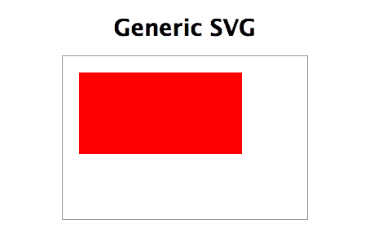

图 11.1。我们激动人心的 SVG 演示。

是的，一个红色的长方形。我给你一点时间恢复。

快速解释一下这里发生的事情:我们已经将`<svg>`元素设置为 200px 高和 300px 宽，它充当我们想要呈现的形状或线条的透明容器。(我用 CSS 给了它一个边框，这样你就可以看到它的边界了。)然后我们用`<rect />`元素创建一个矩形，给它一个`height`和`width`，以及一个从容器`<svg>`元素偏移的`x`和`y`。添加一个`fill`(我使用了关键字`red`，但是您也可以使用十六进制值)我们就完成了。

在 HTML5 中，你可以将这段代码直接放到你的 HTML 文档中，支持的浏览器(IE9+，FF4+，Safari 5.1+，Chrome 7+，Opera 11.6+，iOS 5+，Android 3+)会适当地呈现它。

## SVG:浏览器支持终于到来

SVG 再次变得有趣，因为浏览器支持终于到来了。目前，所有现代和不太现代的浏览器，包括 IE9(但不包括 IE6-8)，都支持使用`<embed>`或`<object>`元素嵌入 SVG。(Android 2.x 是唯一的坚持者。)不过，IE 的情况并不像听起来那么糟糕，我们接下来会看到。

浏览器也开始在标签中支持 SVG 图像，甚至作为 CSS 背景(特别是 IE9+，FF4+，以及所有最近发布的 Safari，iOS，Chrome 和 Opera)。

甚至有一些支持应用高级 SVG 功能，如过滤器(如高斯模糊)，剪辑和非 SVG 对象的变换。Firefox 对此的支持特别好；见[`people.mozilla.com/ ~ prou get/demos/mashup/video . XHTML`](http://people.mozilla.com/~prouget/demos/mashup/video.xhtml)在 FF4+进行粗略演示。除了 Firefox，对它的支持是不完整的。就类似 Photoshop 的滤镜而言，Chrome 和 Opera 提供了很好的支持，但 SVG 滤镜将只在 Safari 版本 6 中提供，目前没有 iOS 5 或 Android 4 支持。IE9 也不支持它们，但是 IE10 提供了硬件加速的 SVG 滤镜效果(参见:【http://blogs.msdn.com/】b/ie/archive/2011/10/14/SVG-filter-effects-in-IE10 . aspx)。

这就是在 SVG 支持的最前沿发生的事情(最新的支持统计见:[`caniuse.com/ # search = SVG`](http://caniuse.com/))。但是我们现在可以在任何浏览器中使用的真实世界的跨浏览器 SVG 呢？

## 是的，我们现在就可以使用真实世界的 SVG

Dmitry Baranovskiy 出色的 raphal JavaScript 库让我们可以用 SVG 做一些简单、酷、像 Flash 一样的事情。经过几年的积极开发，它提供了低至 IE6 的浏览器支持(感谢 IE 中的 VML 翻译)。你可以在这里查看:[`raphaeljs.com/`](http://raphaeljs.com/)。(请确保您还查看了姐妹图形库 graph al:【http://g.raphaeljs.com】??。)

我们一会儿将看看 raphal(和 SVG 本身)能做什么，但现在值得记住的是，由于 raphal，简单的 SVG(包括动画)可以与广泛的浏览器支持一起使用。

想象一下，如果突然之间，我们不得不支持各种分辨率大小和密度的设备，其中一些不支持 Flash。矢量图形——在任何分辨率下都清晰，并且可以缩放到任何尺寸——难道不会让生活变得更容易吗？保持这种想法...

## SVG 的许多方面

让我们看看 SVG 的不同面貌。有:

*   SVG，这个巨大的规范已经存在了十年(并且还在成长)。
*   先进的 SVG，因为它正在先进的浏览器中实现。
*   SVG，因为我们今天可以在现实世界中使用它与工具，如拉斐尔和 jQuery SVG([`keith-wood.name/ svg.html`](http://keith-wood.name/svg.html))。

SVG 现在可以(并且正在)用于各种具有可靠交叉支持的情况，包括 iOS 设备，所以它的时代可能终于到来了。而且来得正是时候，考虑到 Adobe 在移动浏览器中放弃 Flash，以及微软在 Windows 8 的默认 Metro 界面中拒绝允许 IE10 中的插件。(关于 Flash 之死的更多信息，请参见第九章中关于画布和 Flash 的讨论。)更不用说对界面元素的迫切需求了，这些元素可以从手机扩展到 iPad“retina”显示屏，再扩展到 27 英寸或 30 英寸的屏幕。

## 2000 年代的 SVG 不是很大的希望

SVG 已经走过了一段漫长的旅程。在其全部盛况中，它给人留下了极其深刻的印象，并且目前做的和当前的 CSS3 实现一样多(如果不是更多的话)。完整的 SVG 支持做一切事情，从动画，到我们前面提到的类似 Photoshop 的滤镜效果(参见 Chrome，Opera 或 Firefox 中的这个例子:[`svg-wow.org/滤镜效果/chicked . SVG`](http://svg-wow.org/filterEffects/chiseled.svg))，到自定义字体，遮罩，视频，当然还有绘制矢量形状。一切都在那里(至少在规范中——浏览器支持严重滞后)。所以在某种程度上，它很像 Flash。

基本的 SVG 就像十年前的 Flash，但是没有浏览器支持或者开发工具。事实上，在 Adobe 收购 Macromedia(开发 Flash 的公司)之前，Adobe 一直支持 SVG 作为一种开放的替代方案。在 2002 年，大约有 1.6 亿人在使用他们的 SVG 浏览器插件(自从停止使用以来，见[`www.xml.com/ pub/a/2002/07/03/adobesvg.html`](http://www.xml.com/pub/a/2002/07/03/adobesvg.html))。

为了让你感受一下 21 世纪初围绕 SVG 的大肆宣传，这里引用了 2002 年 Digital Web 上一篇题为“SVG:新的闪光”([`www.digital-web.com/文章/ svg_the_new_flash/`](http://www.digital-web.com/articles/svg_the_new_flash/) )的文章:

> SVG 应该很快就会普及，它的非专有性质将有助于加速这一进程。由于其庞大的客户群，Flash 将在相当长的一段时间内继续成为主导标准。然而，SVG 正在迅速崛起。通过浏览器制造商分发 SVG 插件将会迅速增加用户群，就像 Flash 一样。各种浏览器的未来版本将包含 SVG 查看器作为标准，有些已经这样做了。

但是 SVG 从未真正起飞。(可以说，它的“非专有性质”在过去十年里并不重要。)它无法触及 Flash 的安装基础，也从未有过像 Flash 这样对设计师友好的开发工具。当 Adobe 在 2005 年收购 Macromedia 时，就网络上的矢量图形而言，它是闪光或破产。

尽管如此，SVG 也从未真正消亡。随着浏览器支持的迅速改进，以及 Flash 的前景，SVG 可能会再次卷土重来。

## SVG 浏览器支持:安卓，什么鬼？哦，还有...

目前的一个症结是，Android 2.x 甚至不提供基本的 SVG 浏览器支持，尽管谷歌在其他地方推出了 SVG(见:http://googlecode.blogspot.com/ 2009/10/svg-at-google-and-in-internet-explorer.html[)。它已经在 Android 的浏览器背后的引擎 WebKit 中了，它只是“为了节省空间”而被有意冷落在了 Android 2.x 中(见这里的评论和讨论:](http://googlecode.blogspot.com/2009/10/svg-at-google-and-in-internet-explorer.html%5D)[`code.google.com/ p/Android/issues/detail？id=1376#c4`](http://code.google.com/p/android/issues/detail?id=1376#c4) )。去想想。(Android 3.0 中的浏览器，Android 的平板电脑版本，*是否支持基本的 SVG，在统一的 4.0 版本中，SVG 支持终于也适用于移动 Android 设备。)*

 *幸运的是，IE6-8 有几个库可以尝试将 SVG 翻译成它能理解的东西。

Raphaë是我们前面提到的用于 SVG 的 JavaScript 库，为了兼容性，它回到了 IE 的老版本 VML (Vector Markup Language)。(它类似于我们在第九章中看到的画布仿真，也有类似的限制，即 VML*慢*。)

还有 SVG Web([`code.google.com/ p/SVG Web/`](http://code.google.com/p/svgweb/))，它把 SVG 翻译成 Flash，供不支持 SVG 的老浏览器使用，包括 IE。(可悲的是，这仍然没有帮助我们解决 Android 2.x 的问题。参见:[`groups.google.com/集团/SVG-web/browse _ thread/thread/77fb 6970 f 5f 01 e 97`](http://groups.google.com/group/svg-web/browse_thread/thread/77fb6970f5f01e97)。)

还有 canvg([`code.google.com/ p/canvg/`](http://code.google.com/p/canvg/))，它在画布中渲染 SVG，并为 Android 提供一些 SVG 支持，作为 Android 4.0 普及之前的权宜之计。这里讨论一下这个方法:【http://www.kendoui.com/博客/团队博客/帖子/12-02-17/using _ SVG _ on _ Android _ 2 _ x _ and _ kendo _ ui _ dataviz . aspx。(Fabric.js 可能也有帮助:【http://fabricjs.com/】??。)

虽然这些工具使基本的 SVG 在几乎任何浏览器上都成为现实，但请记住这只是基本的 SVG，而不是已经成为 SVG 规范一部分的疯狂的类似 Photoshop 的滤镜。

## SVG 演示:它有什么好处？

矢量图形在很多情况下都很有用——地图、图表、插图、徽标、可视化、独立于分辨率的界面等等。Flash 的成功无疑证明了对动画矢量图形的需求。原本可以在 Flash 中交付的内容有可能在 SVG 中完成，因此可供 iOS 用户使用。

让我们看一些 SVG 演示，看看它有什么能力。我们先看几个一般的例子，然后看几个真实的拉斐尔例子。

### SVG 女孩

图 11.2。动画 SVG 女孩短是短暂的，但令人印象深刻。

SVG Girl 是一个“SVG 动画视频”，微软委托它展示 IE9 中的硬件加速 SVG 支持(尽管它可以在任何现代浏览器中工作)。这是一个用 SVG 制作的简短但非常复杂且令人印象深刻的动画片段。看到这里:[`jsdo.it/事件/ svggirl/`](http://jsdo.it/event/svggirl/)

这种复杂动画的 SVG 性能过去很差，但是硬件加速让世界变得不同。向 IE 团队的硬件加速 SVG 致敬。(你可以在这里了解更多:[`blogs.msdn.com/ b/ie/archive/2011/03/08/comparing-hardware-accelerated-SVG-cross-browsers-with-Santa-s-workshop . aspx`](http://blogs.msdn.com/b/ie/archive/2011/03/08/comparing-hardware-accelerated-svg-across-browsers-with-santa-s-workshop.aspx)。)

### SVG Edit

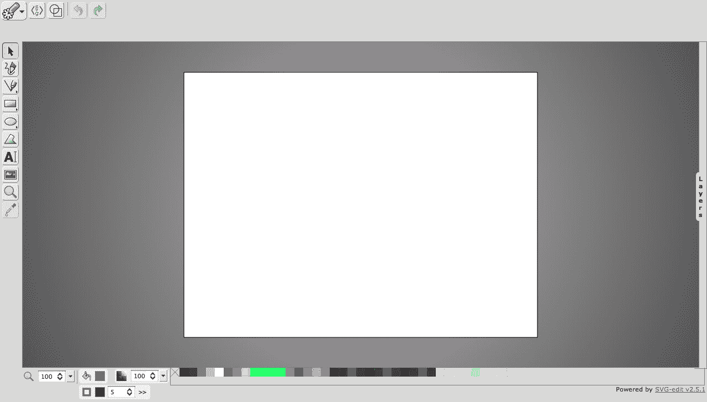

图 11.3。SVG Edit 是一个 SVG 驱动的绘图程序，它输出...SVG。

SVG Edit 展示了单独使用客户端 web 技术可以完成什么。这是一个基于 SVG 和 JavaScript 的应用程序，用于编辑 SVG。在这里下载:[`code.google.com/p/svg-edit/`](http://code.google.com/p/svg-edit/)或者在这里现场试用:[`svg-edit.googlecode.com/ SVN/branches/2 . 5 . 1/editor/svg-editor.html`](http://svg-edit.googlecode.com/svn/branches/2.5.1/editor/svg-editor.html)。

### 谷歌文档

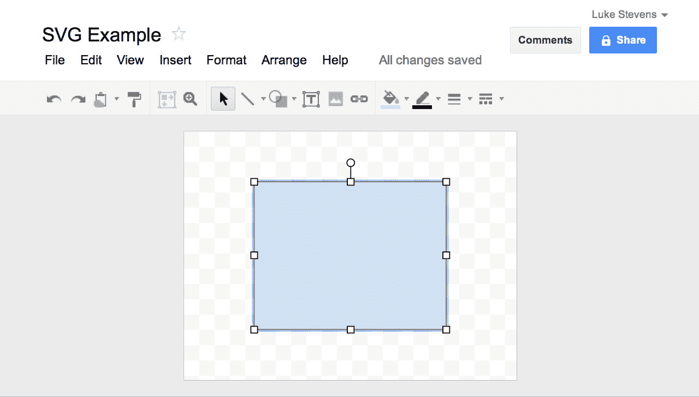

图 11.4。SVG 用于一些非常引人注目的场合，比如 Google Docs 绘图程序。

谷歌文档的绘图程序使用 SVG 和 VML 后备。(谷歌也在 2012 年初开始在谷歌分析中使用 SVG。)

### SVG 小游戏

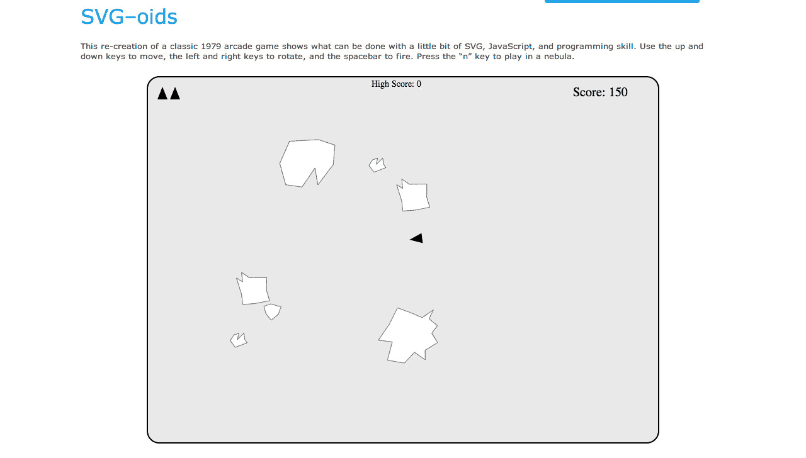

图 11.5。SVG-oid 可能很简单，但是它展示了 SVG 的交互可能性。

您可以用 JavaScript 在 SVG 中创建游戏，但是 SVG for games 并没有像 Canvas 那样流行起来。作为 IE9 技术演示的一部分，微软发布了几个非常简单的复古游戏示例:

*   SVG 中的小行星:[`ie.microsoft.com/ test drive/Graphics/SVG OIDs/default . XHTML`](http://ie.microsoft.com/testdrive/Graphics/SVGoids/Default.xhtml)
*   一个简单的直升机游戏:[`ie.microsoft.com/ test drive/Performance/Helicopter/default . XHTML`](http://ie.microsoft.com/testdrive/Performance/Helicopter/Default.xhtml)背景让我想起了雅达利 2600。

### D3.js

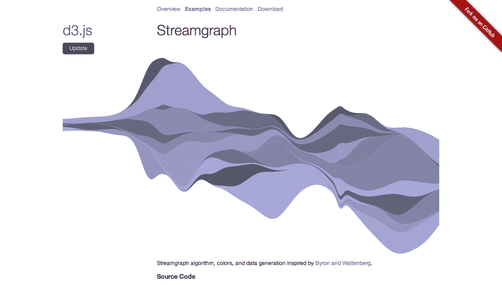

图 11.6。值得在线探索令人印象深刻的 D3.js 示例，比如这个“streamgraph”。

D3 . js([`mbostock.github.com/ D3/`](http://mbostock.github.com/d3/))是一个“基于数据操纵文档的小型免费 JavaScript 库”，它使用 SVG 来实现一些令人印象深刻的数据可视化。查看更多示例:【http://mbostock.github.com/】D3/ex/。另请参阅 D3 创建者迈克·博斯托克的 D3 研讨会的 150 多张带注释的幻灯片:【http://bost.ocks.org/·迈克/ d3/workshop/ 】。它以对 D3 和 SVG 的简单介绍开始，以一些令人印象深刻的例子结束。

### 带高图表的图表

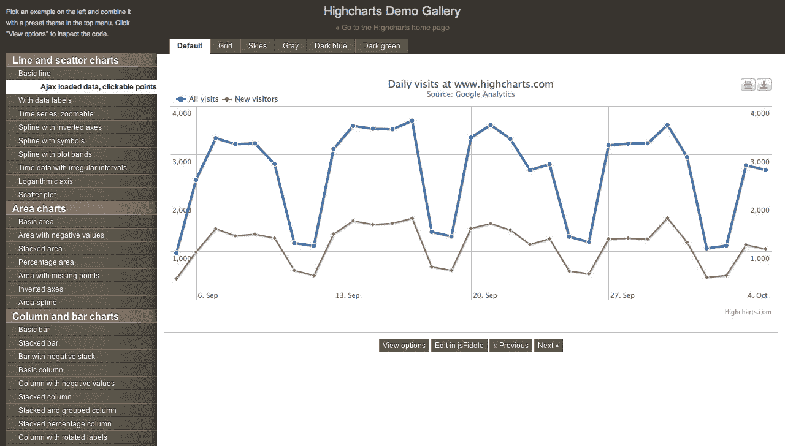

图 11.7。Highcharts 有很多粉丝，其灵活的、有据可查的 API 使其易于使用。

对于一个全功能的 SVG 图表库来说，很难超越 high charts([`www.highcharts.com/`](http://www.highcharts.com/))——一个 SVG(以及对传统 IE 支持的 VML)JavaScript 驱动的图表库。(这里他们解释了为什么使用 SVG:【http://www.highcharts.com/】组件/内容/文章/2-新闻/ 12-highcharts-goes-svg 。Highcharts 也得到了很多开发者的喜爱:【http://news.ycombinator.com/】item？id = 1847569。)

## Raphael.js 支持的演示

当前现实世界中使用 SVG 的大部分工作都是通过 Raphaë完成的，正如我们前面看到的，Raphaë提供了一种简单的、跨浏览器的方法来生成基本的 SVG。

### 十三 23

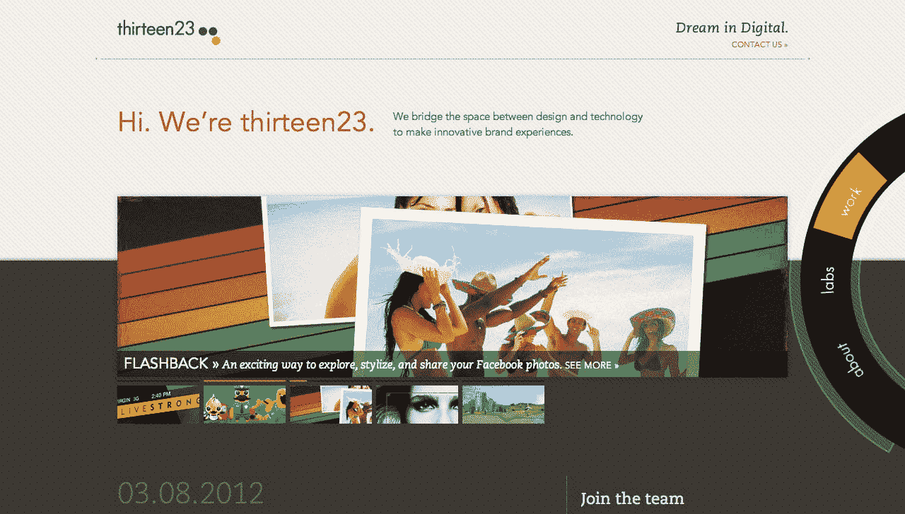

图 11.8。thirteen23 的动画圆形导航展示了少量的 SVG 可以做什么。

thirteen 23([`thirteen23.com`](http://thirteen23.com/))是得克萨斯州奥斯汀的一家设计咨询公司，它利用现代网络技术成功地设计了一个令人印象深刻的工作室网站。他们弯曲的、平滑的动画导航是使用拉斐尔字体构建的。点按四周以查看运行中的导航(并观察背景的变化)。还要注意，尽管 URL 发生了变化，但没有使用/#/模式，也没有进行完整的页面刷新。这就是 HTML5 历史 API 的作用，我们将在下一章谈到。

### 日产聆风

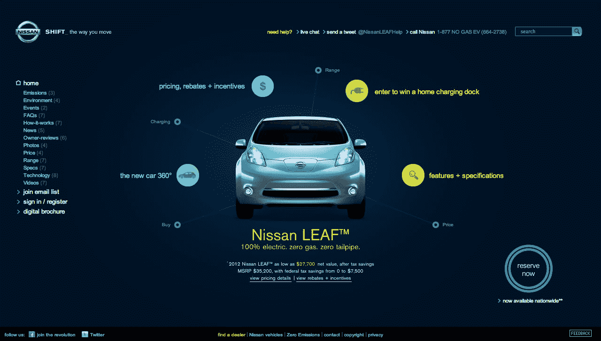

图 11.9。曾几何时，日产 Leaf 网站可能只是一个 Flash 事件，但它在这里都是本地网络技术。

日产 Leaf 网站([`www.nissanusa.com/ Leaf-电动汽车/`](http://www.nissanusa.com/leaf-electric-car/) )是一个很好的例子，展示了少量 SVG(使用 Raphaë)和许多现代 JavaScript 可以做什么。界面或风格可能不符合每个人的口味，但关键是技术和执行。我们现在可以做这种 Flash 风格的互动——不需要插件。

### Markup.io

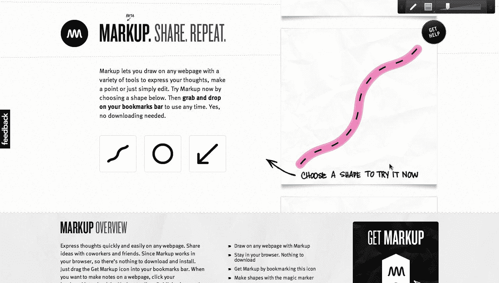

图 11.10。多亏了 Markup.io，用 SVG 在你的页面上乱涂乱画

markup . io([`markup.io/`](http://markup.io/))可以让你用一个简单的书签工具在任何网页上画矢量线(并添加注释)。您还可以发布和共享您的注释页面。绘图工具是由 Raphaë支持的 SVG。

### DrawAStickman.com

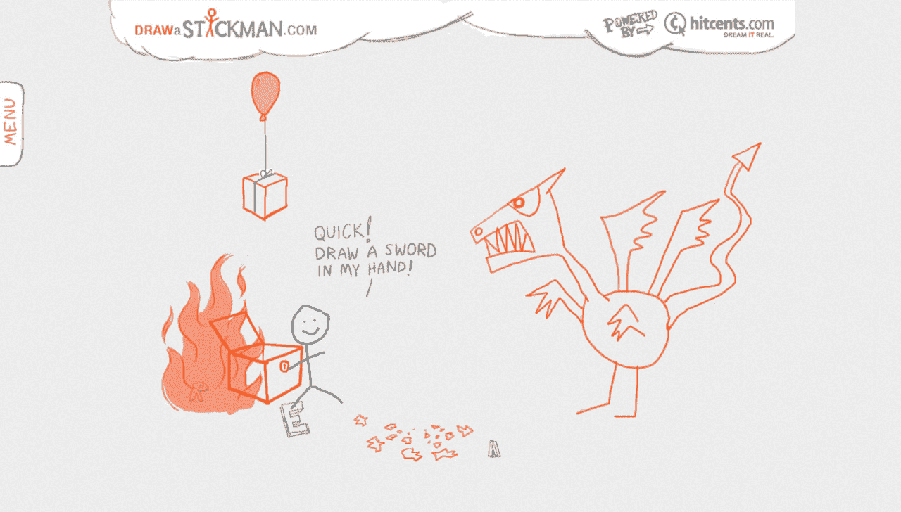

图 11.11。面对一条喷火的龙，我的坚持者仍然保持着镇定自若的心情。

Hitcents 的[`DrawAStickman.com`](http://DrawAStickman.com)机构宣传片，用创作者的话说，是一个“互动网站，游客在这里画一个棍子人，并参与他的动画冒险”，它“一夜之间成为病毒式的成功，吸引了来自全球各地的数百万游客，并赢得了众多奖项”([`www.hitcents.com/博客/帖子/making-drawastickmancom-part-1-birth-idea`](http://www.hitcents.com/blog/post/making-drawastickmancom-part-1-birth-idea))。这个绝妙的创意已经有超过 2000 万次的访问，并且使用拉斐尔作为图形。

### 选举结果

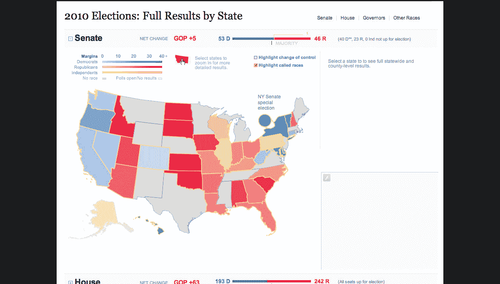

图 11.12。SVG 对于静态、交互式矢量图形(如地图)特别有用。

在他们的 2012 年美国选举地图中，华尔街日报使用了拉斐尔:[`newsapps.wsj.com/选举 2010/`](http://newsapps.wsj.com/elections2010/) 。

### 形象化

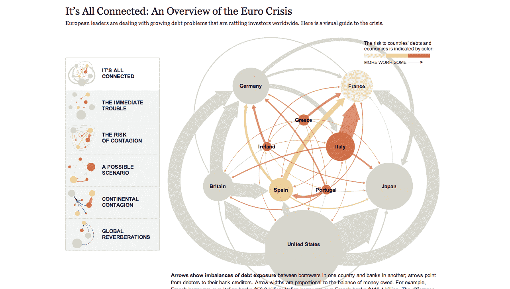

图 11.13。纽约时报的交互式可视化是 SVG(和 Raphaë)擅长的另一个很好的例子。

《纽约时报》使用 SVG 和 Raphaë制作了一幅关于 2011 年欧洲债务危机的精彩互动图。SVG 在这类可视化方面非常出色，让 NYT 和《华尔街日报》等大公司使用它是一种认可。

## 使用 SVG

鉴于尖端的浏览器现在支持在``标签中的 SVG 文件，甚至作为 CSS 背景，很快我们将开始使用 SVG 文件作为背景渐变，标签背景(见本演示:[`helephant.com/ 2009/08/12/SVG-images-as-CSS-backgrounds/`](http://helephant.com/2009/08/12/svg-images-as-css-backgrounds/))，以及其他图像元素，其中单个文件可以根据需要重用和缩放。将 SVG 的灵活性与 CSS3 的多种背景结合起来，可能会出现一些有趣的可能性。例如，SVG 非常适合为媒体播放器的`<video>`或`<audio>`元素设计控件。

这不仅仅是理论上的——设计者开始认真考虑 SVG，并提供教程来帮助我们跟上速度。例如，在《告别 CSS3 渐变》中，Alex Walker 着眼于对 CSS3 渐变的零散支持；建议我们考虑将 SVG 作为一种替代方案；并为此提供了一个方便的教程:[`designfestival.com/ a-告别 css3-gradients/`](http://designfestival.com/a-farewell-to-css3-gradients/) 。

### 响应式网页设计和 SVG

矢量图形在响应式网页设计中也很有帮助，我们希望在从手机到桌面的任何东西上显示清晰、轻量级的界面元素(尤其是在超高分辨率的 iOS 和 Android (3.0 以上)屏幕上)。这也不是理论上的。设计师们现在正在用这个弄脏他们的手。在 Smashing 杂志 2012 年 1 月的文章“SVG 的分辨率独立性”中，David Bushell 着眼于将 SVG 用于界面元素:[`coding.smashingmagazine.com/ 2012/01/16/Resolution-Independence-With-SVG/`](http://coding.smashingmagazine.com/2012/01/16/resolution-independence-with-svg/)。

然而，Vector UI 元素不是免费的响应午餐。虽然很容易认为它们可以毫不费力地放大和缩小(它们是向量！)，这不一定。大的艺术作品缩小到非常小的尺寸会变得模糊不清，而小的艺术作品放大后会看起来单调乏味，缺乏细节，正如这篇关于图标和 SVG 的长篇文章所展示的:[`www.pushing-pixels.org/ 2011/11/04/about-those-vector-icons.html`](http://www.pushing-pixels.org/2011/11/04/about-those-vector-icons.html)。

(当然，CSS3 对渐变、圆角、变换和动画的支持可能会像第三次从生命支持中出来一样，将众所周知的枕头放在 SVG 的脸上。事实上，SVG 滤镜效果正在被移植到 CSS，并且已经进入 WebKit，正如本文所解释的:[`updates.html5rocks.com/ 2011/12/CSS-Filter-Effects-Landing-in-WebKit`](http://updates.html5rocks.com/2011/12/CSS-Filter-Effects-Landing-in-WebKit)。另外，看看这些受 SVG 启发的 CSS 着色器的疯狂演示:【http://www.adobe.com/ devnet/html 5/articles/css-shaders.html[。)](http://www.adobe.com/devnet/html5/articles/css-shaders.html)

尽管事实上 SVG 已经存在了十多年，但是 web 设计社区并没有真正对它进行彻底的测试，看看有什么可能。因此，随着对所有 web 标准的重新关注，Flash 的衰落，响应式 web 设计的兴起，以及浏览器支持的合理基线，也许是时候再次进行实验了。

### SVG Gotch

不过，有两个关键问题。首先是性能:复杂的 SVG 很慢。浏览器制造商通常不太关注 SVG 的性能，因为它一直是 web 标准的红发继子。然而，事情开始发生变化。首先，硬件加速非常有帮助，正如微软用 IE9 和 IE10 所展示的那样。(是的，*微软*不仅迎头赶上，而且现在在网络标准实现的某些领域处于领先地位。你告诉我。)

另一个问题是工具。没有人愿意无所事事地手工编写 SVG 标记。但是，有一些绘图工具可用，例如:

*   **Inkscape** ，一个原生使用 SVG 的开源跨平台矢量绘图程序:【http://inkscape.org】??。
*   **Adobe Illustrator** 支持 SVG，你可以在这里阅读更多关于将文件保存为 SVG 的内容:【http://quintaldesigns.com/】articles/SVG-files-in-Adobe-Illustrator。(Adobe 还为 Illustrator CS5 提供了 HTML5 包，扩展了其 SVG 支持:【http://labs.adobe.com/科技/ illustrator_html5/ 】。它甚至允许你指定一些元素被栅格化为画布元素，如下所述:[`rwillustrator.blogspot.com.au/ 2010/09/web-designers-rejoice-adobe-releases.html`](http://rwillustrator.blogspot.com.au/2010/09/web-designers-rejoice-adobe-releases.html)。还有一个为 Adobe Creative Suite**的付费 SVG 工具包插件**:[`svg.scand.com`](http://svg.scand.com)。)
*   SVG-edit ，这是一个“快速的、基于网络的、Javascript 驱动的 SVG 编辑器”,它是免费和开源的，我们之前已经讨论过了。你可以在这里现场试用:【http://svg-edit.googlecode.com/】SVN/branches/2 . 5 . 1/editor/svg-editor.html，或者从[`code.google.com/ p/SVG-edit/`](http://code.google.com/p/svg-edit/)下载(也可以看浏览器插件的链接)。
*   还有其他各种各样的工具列在这里:[`en.wikipedia.org/ wiki/Scalable _ Vector _ Graphics # Software _ and _ support _ in _ applications`](http://en.wikipedia.org/wiki/Scalable_Vector_Graphics)。

也可以使用 Raphaë或 jQuery SVG 等 JavaScript 库，用 JavaScript 绘制 SVG。然而，大多数网络矢量绘图和动画都是在 Flash IDE 中完成的。如果 Flash 可以导出 SVG 会怎么样？

## Flash 为 SVG 注入了活力？

有趣的是，Adobe 最近发布了一个 Flash-to-HTML5 转换工具，该工具从 Flash FLA 文件中提取基本动画，并将其转换为 SVG、CSS3 和 JavaScript。这是一个名为 Wallaby 的实验性 FLA-to-HTML 工具，它严重依赖 SVG 和仅支持 WebKit 的 CSS3:[`labs.adobe.com/科技/ wallaby/`](http://labs.adobe.com/technologies/wallaby/) 。

当然，这并不是真正的 HTML5，但是我们会给他们一个时髦的说法——通过这个。下面是 Adobe 的约翰·纳克(【http://blogs.adobe.com/】jnack/2011/03/wallaby-flash-to-html 5-conversion-tool-now-available.html):

> Adobe 的工作是帮助你解决问题，而不是纠结于一种技术对另一种技术。
> 
> 数百万人在 Flash 中磨练了他们的 Web 动画技能，现在他们的客户希望内容可以在任何地方运行，包括在不支持 Flash 的设备上。因此，Adobe 发布了“Wallaby”，一个实验性的 Flash 到 HTML5 的转换工具。

Flash 导出到 SVG 可能是 Flash 推动新 web 标准采用的另一个例子。这是有道理的，这种情绪已经存在一段时间了(Jonathan Snook 在 2009 年表达了类似的希望:[`snook.ca/档案馆/观点/ adobe-html5-canvas`](http://snook.ca/archives/opinion/adobe-html5-canvas) )。正如约翰·纳克所说，Flash 是数百万人制作网络动画和矢量图形的地方。这是设计师让他们的(基本)Flash 动画在 iOS 上工作的一种方式，很快就会在 Metro IE10 和所有未来的 Android 4.x 设备上工作。

但是这假设从 Flash 到基本 SVG 的转换在相似性和性能方面都是可以接受的。目前这只是 Adobe 的实验性技术，所以我们不应该期望太高。但是，如果没有其他事情，当性能变得可以接受时，我们最终可能会看到针对 iOS 和 Android 设备的 SVG(或 Canvas)动画横幅广告。哦，太好了。

问题不在于 SVG 能否取代 Flash，而在于它能否开拓出自己的市场。Raphaë无疑帮助它开拓了这个市场，在接下来的几年里，我们将能够在 SVG 上做更多的事情。

在经历了 21 世纪初的“狼来了”之后，SVG 能在设计界引起足够的兴趣吗？具有讽刺意味的是，分散 web 社区对 SVG 注意力的可能不是 Flash，而是其他 web 标准。如今，围绕着 web 标准开发的活动如此之多，它已经开始了一场引人注目的战斗。SVG 是不是注定永远是伴娘，永远不是新娘？或者，那些多年前在 SVG 上写了大量书籍的人会为了一个迟来的第二版而重新开始他们的工作吗？时间会证明一切。

同时，拉斐尔很容易上手，为什么不试一试呢？看看 http://raphaeljs.com 的。*