# 二、使用 CSS、Flash 和 JavaScript 驯服野生 CMS

**丹·鲁宾**

`www.webgraph.com`

丹·鲁宾(Dan Rubin)整天将音乐、设计和字体设计融入南佛罗里达的阳光海滩。从声乐指导和表演到平面设计(几乎是字面意义上的)以及这两者之间的一切，丹尽可能地将他的才华尽可能地分散开来，同时仍然留出时间来喝一杯好茶和偶尔小睡一会儿。

他对所有创造性和艺术性事物的热情也不仅仅是自私的努力。你不需要逗留太久，就会发现他对无伴奏爵士乐和理发店和声(他对`roundersquartet.com`的设计只是这两个世界碰撞的一个例子)、界面设计、可用性、网络标准、排版和一般平面设计进行了教育。除了对 Blogger、CSS Zen Garden、Yahoo！小企业和微软的门户网站，Dan 是《层叠样式表:将内容与表示分离》一书的特约作者，也是《CSS Web 开发入门》一书的技术评论员，同时也是《CSS 技术入门》一书的合著者他在自己的博客`superfluousbanter.org`上写关于网络标准、设计和生活的文章，并在`livefromthe101.com`上发布播客。他的专业作品可以在他的公司网站`webgraph.com`上找到。

 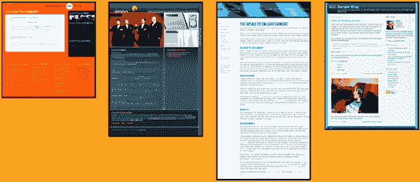

# 设置场景

你的客户要求你重新设计公司的网站，但有一个主要限制:你不能定制用于输出内容的标记，因为它是由一个内容管理系统生成的。“等等！”你会说，“CMS 不是应该把内容和输出格式分开吗？”不幸的是，似乎在大多数情况下，特别是对于企业级 CMS，不管是出于无知还是精心的计划，定义 CMS 用来呈现内容的标记的模板是设计者的禁区。"但是我怎么可能在如此陈旧的限制下设计出吸引人的东西呢？"虽然说服您的客户允许定制输出模板是最好的途径，但事实是有时这是不可能的，您只能使用您所给的。正是在这些艰难的时刻，网络标准，特别是 CSS，以及它们的得力助手 JavaScript 和 Flash，来拯救你了。

这是 Geffen/Universal Media 向我提出的挑战，当时该公司要求我重新设计疯狂流行乐队生命之屋乐队的宣传网站。我将向你展示我如何使用 CSS，一些聪明的设计，和一些很酷的工具和技术来击败 CMS 输出到提交。我还将向您展示如何在您自己的项目中使用这些相同的实际方法。

在我们开始我们的旅程之前，让我们比较一下原始网站和我的重新设计(见图 2-1 )。你可以在原著中看到一些“模板心态”的设计公式在起作用。

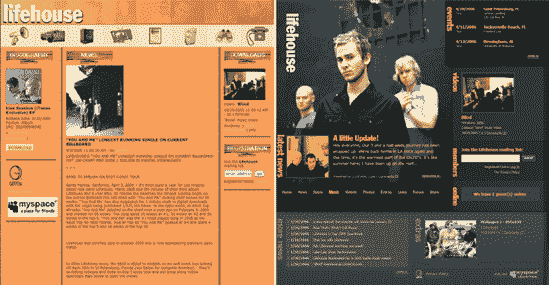

**图 2.1。左边是原始设计，包括所有三列中的模板内容块**

就市场部而言，一旦我们提出一个可以接受的设计，我们的工作就完成了。像素已经画在屏幕上了，就没别的事了吧？啊，但是我们知道的更多，不是吗？

当然，创建网站模板不仅仅是设计。不知何故，我们必须从概念到草图到视觉合成到标记到风格。然后，经过一些浏览器测试，我们完成了一个成品。这个过程本身通常就足够了。在这种情况下，我还需要考虑 CMS 规定的特定标记要求。我将马上回顾每一个步骤，但首先，对于门外汉来说，这是一个 CMS 速成班。如果您已经熟悉 CMS 的基本功能，请随意将这本书递给附近需要这方面教育的同事，并在他阅读接下来的几段并看着漂亮的图片时，自己喝一杯茶。

# CMS 速成班

一般来说，CMS 就像他们的名字所暗示的那样:帮助管理内容。更广义地说，它们允许内容制作者在数据库中存储和组织他们网站的内容。当访问者请求站点中的特定“页面”时，将从 CMS 中检索适当的内容并显示在用户的浏览器中。

通常，CMS 是一个安全的 web 应用程序，由站点管理员、内容创建者、编辑者或任何负责发布或编辑站点内容的人使用。它可以处理文本、标记、链接、图像、音频、视频几乎任何类型的可以存储在数据库中的内容。

通常，一个简单的 CMS 可能会与你的布局模板交互，如图 2-2 所示。

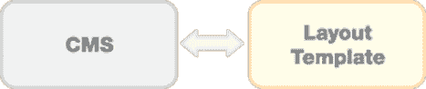

**图 2.2。大局中的一个基础 CMS。在本例中，一个模板定义了布局并从 CMS 中提取内容。**

一些更复杂的 CMS 在存储的内容和显示给用户的内容之间增加了额外的层，如图 2-3 所示。


**图 2.3。这个 CMS 添加了一个额外的模板层来定义与页面布局分开的内容块。**

本章讨论如何使用多层模板解决第二类系统产生的问题。这些层通常结合起来创建每个页面样式的基本框架。设计者通常可以访问布局模板。内容模板包含各种类型内容的大量标记，通常是设计者的禁区。更重要的是，由于对内容模板的访问受限或不灵活的输出要求，这些内容块通常包含不受您控制的标记。

# CMS 挑战

不需要太多的网页浏览就能在各种网站上找到内容的通用视觉格式。这种通用模式通常由这些网站背后的特定 CMS 的内容模板中的限制规定。你可以在受欢迎的博客 CMSs 管理的网站、运行昂贵的商业软件包的网站，甚至是定制的系统上看到这些共同的元素。

Geffen/Universal Media 用来管理其艺术家网站的定制 CMS 就是这种情况。为了简化内容格式的大规模更新，所有网站都使用相同的数据类别，如新闻、媒体、照片、事件等。在此 CMS 上运行的网站共享一组内容模板。虽然这使得对给定内容块的调整更容易实现，但这种方法导致许多网站具有相似的外观。这在很大程度上是由于设计者认为内容*需要*看起来一样，因为标记不能在一个站点一个站点的基础上定制。

对于我的生命之屋乐队网站重新设计项目，Geffen/Universal Media 没有提出任何具体目标，只是希望设计能比现有网站更好地反映乐队的形象和当前的宣传摄影。从设计的角度来看，这就像一张白纸，这基本上是我得到的指示，但有一个很大的限制:我制作的任何东西都必须与现有的 CMS 内容模板一起工作。

这不是我为该公司工作的第一个艺术家网站，所以我已经熟悉了 CMS 模板的集中结构所施加的大多数限制。这意味着我已经确切地知道设计必须适应什么类别和类型的内容，以及在我面前有什么限制。

像我早期的项目一样，这次重新设计有一个紧张的截止日期和预算，这以前导致了一个快速和肮脏的设计过程:采用一组基本的内容和布局模板一个带有页眉和页脚的标准两列布局，并在不超出预算的情况下，将它们的外观设计得尽可能不像模板。如果我没有变得如此讨厌这种方法对我的设计的限制作用，生命之屋乐队网站的重新设计也会是一样的。

因此，面对另一个无聊的设计项目，我提出了一个实验:让我看看在不改变预算或时间表的情况下，我能在多大程度上调整内容和布局，以打破基本的模板模式。收到客户的许可后，是时候进入正题，开始快速设计一些东西了。

# 一毛钱的设计

我的主要目标是制作一个不像默认 CMS 布局模板的布局。当然，由于它必须支持的内容类型与所有其他艺术家网站相同，新布局需要与默认布局有一些共同之处。我认为结合这些需求的最简单的方法是使用相同的元素，但是定位要稍微不同，这样，对于不经意的观察者来说，这个网站看起来就不会和其他的一样。这也为一个必须在几周内完成的项目提供了一个很好的起点。

## 视觉元素

我已经从唱片公司的市场部收到了乐队的宣传资料。结合所需的内容和导航，这些给了我以下的视觉元素到设计中:

*   该乐队的标志艺术品

*   来自乐队最新照片拍摄的高分辨率照片

*   当前专辑封面

*   十个类别的主要导航

*   各种内容块(事件、视频、新闻、邮件列表注册等)

我还决定在主页上突出显示新闻部分的一篇专题文章。因为这是 CMS 不支持的，这就产生了另一个挑战。因此，有了这张清单、一支铅笔、一张白纸和一张已经在我脑海中形成的图片，我开始快速勾画一些缩略图，直到我找到一个“感觉正确的”(见图 2-4 )。

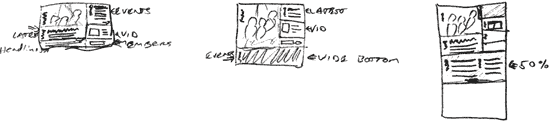

**图 2.4。埃涅！米涅！米涅！米奈！莫！**

### 注意

我强烈地感觉到设计过程必须是有机的。仅仅因为我们是为一个技术媒介而设计，并不意味着我们的过程也必须是冷酷的和经过计算的。我喜欢使用缩略图草图，因为这是一种很好的方式，可以在纸上表达我的想法，而不用担心太多的细节。我几乎每一个设计都是从花几分钟画出小布局开始的，这是我所知道的最好也是最快的方法，几乎可以立即比较多个布局创意。你可以在`www.sinelogic.com`的“预算设计”中找到更多这样的设计捷径。

下一步是花一些时间在 Photoshop 中把草图变成像素。配色方案借鉴了乐队最新专辑封面上的照片，加上一些灰色调。经过一段时间激烈的像素推进，我完成了图 2-5 所示的合成图。

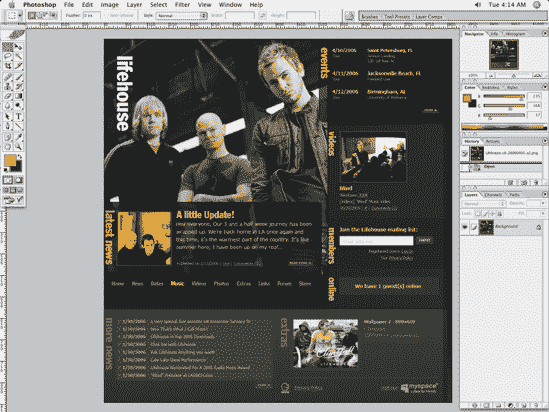

**图 2.5。最初的 Photoshop 合成**

在这个阶段，一些有趣的视觉元素融入了设计:

*   “预告”文章的透明背景(显示下面的照片)

*   挑逗性的标题与乐队的标志字体相同(富兰克林哥特式压缩)

*   页脚列出了最近的新闻标题(这看起来很容易复制，只是 CMS 不支持)

*   整个布局中的垂直文本标题(也以富兰克林哥特式压缩字体呈现)

到目前为止，您可能已经迫不及待地想要了解“技巧和诀窍”这一部分了，所以如果您对标记不感兴趣，请继续阅读。但是在开始样式化之前，我们真的需要打下 XHTML 的基础。

## 标记只是一个外壳

由于 CMS 控制着大部分内容块周围的标记，最简单的方法就是创建一个 shell 布局，用`<div>`来包含每个数据模块。该设计基本上是两列加一个页脚，徽标和导航位于左列。折腾了几个比特的样本内容，我得到了这个:

```html
<!DOCTYPE html PUBLIC "-//W3C//DTD XHTML 1.0 Strict//EN"
  "http://www.w3.org/TR/xhtml1/DTD/xhtml1-strict.dtd">

<html  xml:lang="en" lang="en">
<head>
  <meta http-equiv="Content-Type" content="text/html; charset=utf-8" />
  <meta http-equiv="Content-Language" content="en-us" />
  <title>Lifehouse [homepage]</title>
  <link rel="stylesheet" type="text/css" href="c/styles.css" media="all" />
</head>
<body class="homepage">
  <div id="wrapper">
    <div id="content">

      <h1 id="logo">
        <a href="/" title="link to the homepage">Lifehouse</a>
      </h1>

      <div id="content-primary">

        <div id="sidebar-tab"><!-- for presentation only --></div>

        <div id="teaser">
          <h2>latest news</h2>
          <a href="#">
            
          </a>
          <h3><a href="#">Article heading</a></h3>
          <p>Lorem ipsum dolor sit amet, consectetur adipisicing elit,
            sed do eiusmod tempor incididunt ut labore et dolore magna
            aliqua. Ut enim ad minim veniam, quis nostrud exercitation
            ullamco laboris nisi ut...</p>
          <p class="entry-footer">Published on 5/14/2006 |
            <a href="#">Link</a> |
            <a href="#">Comments (0)</a>
          </p>
          <a class="readmore" href="#">read more...</a>
        </div><!-- #teaser -->
      </div><!-- #content-primary -->

      <div id="nav">
        <ul>
          <li id="nav-home"><a href="#">Home</a></li>
          <li id="nav-news"><a href="#">News</a></li>
          <li id="nav-dates"><a href="#">Dates</a></li>
          <li id="nav-music"><a href="#">Music</a></li>
```

```html
<li id="nav-videos"><a href="#">Videos</a></li>
          <li id="nav-photos"><a href="#">Photos</a></li>
          <li id="nav-extras"><a href="#">Extras</a></li>
          <li id="nav-links"><a href="#">Links</a></li>
          <li id="nav-forum"><a href="#">Forum</a></li>
          <li id="nav-store"><a href="#">Store</a></li>
        </ul>
      </div><!-- #nav -->

    </div><!-- #content -->

    <div id="sidebar-wrapper">
      <div id="sidebar">

        <div class="module" id="mod-events">
          <h3>events</h3>
        </div><!-- .module -->

        <div class="module" id="mod-videos">
          <h3>videos</h3>
        </div><!-- .module -->

        <div class="module module-alt" id="mod-members">
          <h3>members</h3>
        </div><!-- .module -->

        <div class="module" id="mod-online">
          <h3>online</h3>
        </div><!-- .module -->

      </div><!-- #sidebar -->
    </div><!-- #sidebar-wrapper -->

    <div id="footer-wrapper">
      <div id="footer" class="clearfix">
        <div id="morenews">
          <h2>more news</h2>
          <ul>
            <li><a href="#"><strong>5/14/2006</strong> Article heading</a></li>
            <li><a href="#"><strong>5/14/2006</strong> Article heading</a></li>
            <li><a href="#"><strong>5/14/2006</strong> Article heading</a></li>
            <li><a href="#"><strong>5/14/2006</strong> Article heading</a></li>
            <li><a href="#"><strong>5/14/2006</strong> Article heading</a></li>
            <li><a href="#"><strong>5/14/2006</strong> Article heading</a></li>
            <li><a href="#"><strong>5/14/2006</strong> Article heading</a></li>
            <li><a href="#"><strong>5/14/2006</strong> Article heading</a></li>
          </ul>
          <a class="more" href="#">more...</a>
        </div>

        <div id="extras">
          <h2>extras</h2>
```

```html
<a href="#" class="thumbnail"></a>
          <h3>Lifehouse wallpaper - 800x600</h3>
          <p><a href="#"> Download</a></p>
          <p>5/14/2006 | <a href="#">Link</a> | <a href="#"> Comments (2)</a></p>
          <div id="external-links">
            <a id="logo-geffen" href="http://geffen.com/">Geffen</a>
            <a id="privacypolicy" href="#">Privacy Policy</a>

            <a id="myspace" href="#">visit our <span>myspace</span></a>
          </div>
        </div>
      </div><!-- #footer -->
    </div><!-- #footer-wrapper -->

  </div><!-- #wrapper -->

</body>
</html>
```

当在浏览器中查看时，它以原始的、无样式的形式呈现得相当好，如图 2-6 所示。

无样式页面中内容的顺序很重要，尽管不是这个站点的首要任务，因为目标受众在普通电脑上使用现代浏览器。然而，所有的内容至少在没有样式的情况下被适当地格式化了，所以网站在基本层面上是可访问的，这比最初的设计要好得多。

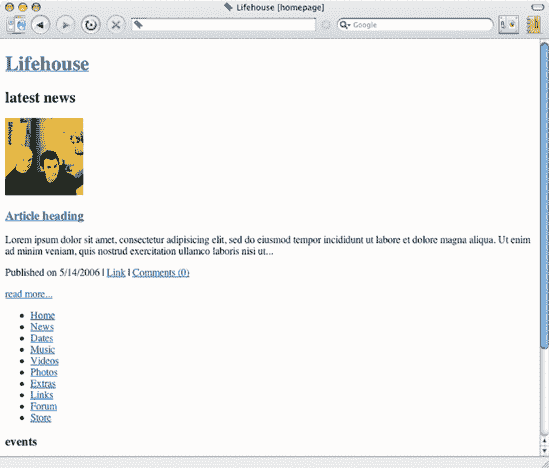

**图 2.6。裸体午餐...呃，内容**

### 注意

有没有发现自己在处理生成的标记时迷失在一片混乱中？如果您坚持使用一个会生成本章所讨论的那么多嵌套 div 的 CMS。通过用相应的开始标记的 ID 或类来注释每个 div 的结束标记，可以使您的标记更容易阅读(对于您和其他人)。看一看示例标记。看看与没有注释的标签相比，将有注释的 div 的结束标签配对起来有多容易？

注意侧边栏中的“模块”(方便地分配了类`.module`)是空的。这些只是容器，实际的 CMS 生成的内容将很快放入其中，所以现在，我们不去管它们。重要的是它们是存在的，由于它们唯一的 id，它们可以被单独定位，并且它们在文档流中的顺序是可以互换的。

虽然这些标记中的大部分应该是不言自明的，但是我将在下一节讨论少数的`.clearfix`类。稍后，在“分析和润色”部分，我将回顾我用来为主导航设置无序列表样式的技术(导航不是由 CMS 生成的)。

### 注意

我说过 CMS 内容模板不包括列表选项，那么页脚的`<ul>`是怎么回事？由于项目的时间限制。我能够说服当权者给内容模板添加一个列表选项。这给了我设计列表样式所需的适当挂钩，并为该样式使用更合适的标记。清理标记，然后施展你的 CSS 魔法，这比处理混乱要好得多。拥挤的加价。也就是说。该外观也可能是使用原始的非列表标记重新创建的。它只是需要更多的 CSS 技巧来完成类似的结果，这会不必要地使项目复杂化并延长时间表。

## 布局和风格

现在我们进入了重要的内容，所以你可能想让你的家人知道，除了在下一节给你端茶倒水之外，他们在相当长的一段时间内不会看到或听到你的消息。毕竟，你确实需要大脑补充能量。实际上，我们不会对布局本身进行深入的讨论，它并没有那么时髦，但是我们*会*回顾创建它所需的基本风格。

### 注意

我发现在一个规则块中组织 CSS 属性很有帮助，特别是在浏览器测试中检查/调整样式表时，或者在启动后必须进行调整时。以下是我更喜欢的顺序:

*   显示方法(显示:或浮动:)

*   背景设置

*   定位方法(位置:)

*   位置(x，y)

*   宽度/高度

*   边距/填充

*   颜色

*   文本设置(字体/行高/对齐)

*   边界

这是又一个简单的节省时间和烦恼的方法，应该会让你的生活变得轻松一点。任何给你的标记或样式增加一些结构和顺序的东西都会给你带来回报。

**定位元件**

虽然我们并不试图用整体布局来完成任何开创性的工作，但在我们进入实质之前，有必要回顾一下每个主要元素是如何定位的。首先，清除浮动:

```html
.clearfix:after
{content:".";
display:block;
height:0;
clear:both;
visibility:hidden;
}

.clearfix {display:inline-block;}
/* Hides from IE-mac \*/
.clearfix {display:block;}
/* End hide from IE-mac */"

body {
background:#111 url(../i/bg_body.gif) repeat-x;
margin:0;padding:0;
font-family:'lucida grande', tahoma, sans-serif;
font-size:small;
}

#wrapper {
width:800px;
}
```

`#content`被设置为`float:left`，使其包含它所包含的两个浮点(`#content-primary`和`#sidebar-wrapper`):

```html
#content {
float:left;
}
```

`#content-primary`也被设置为`position:relative`，允许`#sidebar-tab`和`#teaser`被绝对定位，但在其包含元素的范围内。请参阅道格·鲍曼的《制造绝对相对》(`http://stopdesign.com/articles/absolute/`)来很好地概述这一技术。

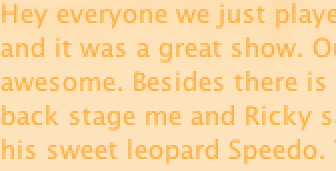

```html
#content-primary {
float:left;
background:url(../p/homepage_photo.jpg) no-repeat;
position:relative;
height:549px;
width:520px;
padding:0;
color:#fff;
}

h1#logo {
position:absolute;
```

```html
z-index:100;
left:29px;
top:39px;
margin:0;padding:0;
}
h1#logo a {
display:block;
background:url(../i/logo_lifehouse.gif) no-repeat;
width:38px;
height:175px;
text-indent:-5000px;
}

#sidebar-tab {
background:url(../i/bg_sidebartab_events.png) no-repeat;
position:absolute;
right:0;
top:0;
width:20px;
height:194px;
}

#teaser {
background:url(../i/bg_teaser.png) no-repeat;
position:absolute;
left:0;
bottom:0;
width:507px;
padding:20px 0 30px;
color:#EFB32F;
font-family:'lucida grande', verdana;
line-height:1.3;
}
```

`#nav`被清除，以确保其落在`#content-primary`之下。类似地，`.module`被清除以允许每个模块中的任何内容被浮动，因为每个后续的`.module`将清除任何这样的浮动。

```html
#nav {
background:url(../i/bg_nav.gif) repeat-x;
width:520px;
height:53px;
margin-top:0;
border-top:3px solid #111;
clear:both;
}

#sidebar-wrapper {
float:right;
background:#1C1C1C url(../i/bg_sidebar_wrapper.gif) no-repeat left bottom;
width:277px;
margin:0 0 3px;
padding:0 0 10px;
}
```

```html
#sidebar .module {
color:#A07029;
padding:15px 15px 15px 0;
border-top:1px solid #111;
clear:both;
}

#footer-wrapper {
background:#1B1B1B url(../i/bg_footer_wrapper.gif) repeat-x;
padding-right:10px;
clear:both;
border-top:1px solid #333;
}
#footer {
background:#262626 url(../i/bg_footer.gif) repeat-x;
padding:20px 0 20px;
}
```

这没有什么奇怪的。它是容器(或包装器)、一些列的浮动和一些绝对定位的混合物。因为这一章的目的不是教你 CSS 的基本原理，我在这里就不赘述了。如果你觉得自己在任何基础知识上落后了，我推荐阅读西蒙·科利森的*初学 CSS Web 开发*(出版社，ISBN: 1-59059-689-7)。

### 注意

我喜欢根据约定俗成的 type_id_label 来给图片命名，这样更容易记住每张图片的用途(比如`logo_footer_geffen.gif`)。此外，文件命名约定使第三方或您的客户更容易确定与您的设计和代码相关的“是什么和为什么”。虽然样式指南也可以完成这项任务，但项目的预算或时间表通常不允许创建样式指南，或者即使存在样式指南，也可能无法供将来进行更改的人使用。

**瞄准 CSS 选择器**

我之前展示的基本 shell 标记中包含的生成标记的一个大问题是，在决定使用哪种标记时，我没有发言权。在描述中包含嵌套段落的定义列表可能是最合适的，但我可能会被迫处理一些嵌套的包含到处都是`<span>`的`<div>`。您可以通过查看现场的源代码来了解这一点。啊。再喝一杯(浓茶)来帮助你克服这个心理印象。

谢天谢地，尽管这听起来很糟糕，但有一种相对简单的方法可以挖出来。CSS 选择器有许多形状和大小。许多设计师习惯于只做基础工作:

*   **ID** s:在 CSS 中作为`#footer`出现，在(X)HTML 中作为元素上的属性值出现，比如`<div id="footer">`，其中`div`是元素，`id`是属性，`footer`是值。

*   **类**:在 CSS 中作为`.readmore`出现，在(X)HTML 中作为元素上的属性值出现，比如`<p class="readmore">`，其中`p`是元素，`class`是属性，`readmore`是值。

*   **元素选择器**:目标任意(X)个 HTML 元素。例子有`ul`、`p`、`div`、`body`、`table`，甚至`html`。

然而，除了这些基本的选择器之外，我们还有更多的选择，这就是外壳标记发挥作用的地方。

通过查看 CMS 生成的标记，我们可以创建*后代*选择器，专门针对我们想要关注的内容，而不去管其他内容。后代选择器允许我们对嵌套在标记的特定层次结构中的元素进行样式化。例如，选择器`#sidebar #mod-media img.fullsize`的目标是包含在 ID 为`mod-media`的元素中的`fullsize`类的任何`img`，该元素也包含在 ID 为`sidebar`的元素中，如果你问我的话，这是非常具体的。

还记得侧边栏模块上的 id 吗？他们的目的现在将被阐明。例如，查看侧栏中的视频模块的标记和内容块，在本例中做了一些清理(但只是一点点)，由 CMS 生成:

```html
<h2><a href="/videos/default.aspx"><span>Videos</span></a></h2>
<div class="item summary stream">
  
  <h4>Blind</h4>
  <p class="url">Windows: <a href=
    "http://music.yahoo.com/video/24649242/?">300K</a><br /></p>
  <p><span class="subtype">[Videos] </span>"Blind" Music Video</p>
  <p class="byline"><span class="date">10/20/2005</span>
    <span class="permalink"> |
    <a href=" /videos/default.aspx?mid=2333">Permalink</a>
      </span><span class="comment-icon"> |
    </span>
    <a href="/forum/topic.aspx/cid/133/tid/70679">
      Comments (197)</a></p>
  <div class="clear"> </div>
</div>
```

不是你见过的最差的 ?? 价格，对吗？我喜欢的类太多了，注释图标可以用 CSS 显示，而不是使用内嵌图像(那`<br />`在那里做什么？).但同样，围绕这些内容的标记意味着在标签的 CMS 管理的每个艺术家网站上使用*，所以额外的挂钩在这种情况下是有意义的。有更好的方法来*提供*一些钩子，但是那是一个单独的讨论。*

这种标记完全不受我的控制，但我仍然需要对它进行样式化。并且很可能给生成的`<div>`和``标签上的类属性分配了通用的类名，我的钩子(类`item`、`summary`和`stream`)在整个站点的许多其他地方使用。这意味着我需要一些方法来定位这个部分中的类，以便处理视频模块的任何特定需求。因为 CMS 的内容模板生成的标记中没有提供这些挂钩，所以我在布局模板中创建它们，将它们包装在调用生成内容的代码中:

```html
<div class="module" id="mod-media">
  . . .
</div>
```

这个`<div>`包装了标记并提供了两个重要的工具:

*   `class="module"`将被分配给每个包装器，比如这个，它允许你在每个块之间共享一些基本的格式(边距、边框等等)。

*   `id="mod-media"`允许您单独定位此块，并指定适合显示此内容的特定样式。

所以，假设对于侧边栏中的大多数模块，我想将分配给`class="fullsize"`的任何``标记设置为在模块中向右浮动，在左侧和底部有 5 个像素的边距，没有边框。有了新的挂钩，通用样式现在应该是这样的:

```html
#sidebar .module img.fullsize {
float:right;
margin:0 0 5px 5px;
border:none;
}
```

这个选择器使用我分配给我的包装器的类`<div>`和`#sidebar`，所以如果我决定在布局中的任何地方使用`module`类，这个规则将不适用。

这样，我现在可以设置视频模块的样式，使图像向左浮动，而不是向右浮动，并相应地调整边距:

```html
#sidebar #mod-media img.fullsize {
float:left;
margin:0 5px 5px 0;
}
```

通过将选择器中的类(`.module`)替换为 ID ( `#mod-media`)，我指示浏览器首先应用通用样式，然后覆盖浮动和边距设置。

### 注意

id 比类具有更高的特异性。关于特异性如何计算的详细解释，请参见`http://molly.com/2005/10/06/css2-and-css21-specificityclarified/`;更轻松的概述，请参见`http://stuffandnonsense.co.uk/archives/css_specificity_wars.html`。

同样的方法可以让你摆脱 CMS 生成的标记为你挖的几乎所有的洞。虽然我们没有人真的想使用像`body#events #content .item .module .summary #membership p.permalink span {}`这样难看的选择器，但是如果你陷入困境，需要完成工作，将选择器与一两个包装器`<div>`组合并分层会让你的生活压力小很多。

## 排版

我是一个字体设计迷，字体通常在我的设计中占据显著位置。HTML 文本很难控制。即使使用 CSS，字体选择也仅限于安装在用户操作系统上的字体，而且排版控制实际上是不可能的。然而，我的设计使用了乐队选择的字体，富兰克林哥特式压缩。我不想妨碍网站的基本可访问性。我并不想在这方面追求完美，但同时，使用糟糕的标记将人们完全拒之门外也是不负责任的。但不知何故，我需要让那种类型显示出来。为固定标题输入 CSS 图像替换，为需要定期更改的文本输入 sIFR，例如由 CMS 生成的文章标题。

让我们从垂直的文本标题开始。它们是需要特殊处理的最明显的候选者，因为仅仅使用 HTML 文本是没有办法模仿它们的。

**制造竖排文字的假象**

应该垂直的标题都是静态的。由于它们不需要定期更新，我可以使用 Photoshop 中渲染的图像。竖排文字的效果不容易用其他方式复制。我可以用 Flash 做到这一点，但用这种方法更容易*，因为 sIFR 方法(接下来讨论)不支持旋转文本，Flash 项目可能更难定位。我可以使用 CSS `background-image`属性将每个图像分配给一个容器`<div>`，但是在 HTML 文件中没有实际的标题，如果标记是可访问的，即使是基本的，这也不是理想的情况。*

 *好消息是，让一个 HTML 标题(`<h1>`、`<h2>`等等)完全按照我想要的那样做也很容易，出于某种显而易见的原因，这种方法被称为*图像替换*。有多少种处理图像替换的方法，就有多少种带有奇怪 CSS 错误的 Internet Explorer 版本，但我更喜欢迈克·伦德尔设计的一种方法，称为 Phark 方法(以他的个人网站`http://phark.net`命名)。让我们以侧边栏标题(包装在模块`<div>`中)为例:

```html
<div class="module" id="mod-videos">
  <h3>videos</h3>
</div><!-- .module -->
```

### 注意

关于图像替换技术的更多内容，Dave Shea 为你收集了一个很好的对比来做书签和参考:`http://mezzoblue.com/tests/revised-image-replacement/`。

如果没有任何特定的样式，这个标题将会像您预期的那样显示。但是我们的想法是隐藏默认的文本输出，并用在图形编辑器中创建的文本图像替换它，下面的 CSS 规则就是我所需要的:

```html
#sidebar .module h3 {
background:url(i/header_module_events.gif) no-repeat;
width:18px;
height:58px;
margin:0;
text-indent:-5000px;
}
```

该规则处理以下内容:

*   设置背景图像并指示浏览器不要平铺图像。

*   定义尺寸(此处设置为等于背景图像的宽度和高度)。

*   扼杀利润。替换标题时，最好将页边距设为零，然后根据需要调整位置。

*   最后，巧妙的部分是:将文本在标题位置的左边缩进 5000 像素。这很重要，因为否则标题的文本仍然会显示在渲染的背景图像之上。

图 2-7, after the background image is applied (middle), and after setting text-indent:-5000px; (right)") 显示了应用 CSS 规则之前、期间和之后的标题。

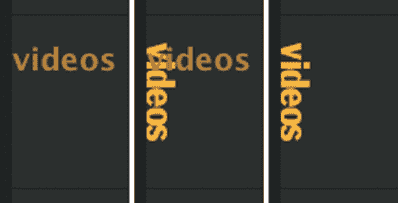

**图 2.7。默认状态下的标题(左)，应用背景图像后的标题(中)，以及设置文本缩进后的标题:-5000 px；(右)**

这样就解决了垂直文本的问题，乍一看，这似乎是两种替换情况中更具挑战性的一种。然而，现实情况是，第二种情况——对必须保持可编辑的文本使用特定的字体——实际上更具挑战性，您将在下面看到。

**sIFR 我的木材**

当您处理 CMS 生成的内容时，每个页面上的大部分内容都在不断变化。在这种特殊情况下，假设乐队成员愿意或能够为他们通过 CMS 发布到网站的每个新闻项目创建自定义的图形文本标题是不公平的。然而，作为一名设计师，我更希望主页上的主要文章标题采用与乐队标志相同的字体。幸运的是，在很大程度上由于一些天才程序员的非凡努力，sIFR 拯救了我。

sIFR 代表可伸缩的因曼闪存替换(*因曼*，就像肖恩·因曼，他构思了最初的 DOM 替换方法，启发了 sIFR)。用 Mike Davidson 的话来说，sIFR 是“一种在不牺牲可访问性、搜索引擎友好性或标记语义的情况下将丰富的版式插入网页的方法”，Mike Davidson 是 sIFR 的创始人之一，也是网页版式质量的全面倡导者唷。更简单地说，sIFR 是一种在现代可视化浏览器中使用特定字体来替换 HTML 文本的方法，结合了 Flash 和 JavaScript。它不妨碍可访问性，没有 Flash(或关闭了 JavaScript)的访问者将看到普通的 HTML 文本，应用了 CSS。哦，我有没有提到它是*免费的*？

要利用 sIFR 开发商的无私慷慨，您必须首先准备好以下物品:

*   Macromedia(现在是 Adobe) Flash 版本 6 或更新版本(完整版本，不是插件)

*   您想要使用 sIFR 渲染的字体

*   一些空闲时间

一旦你满足了这些要求，将 sIFR 融入任何项目的过程都相当简单:

1.  从`www.mikeindustries.com/sifr/`下载最新版本(撰写本文时为 2.0.2)。

2.  在`http://wiki.novemberborn.net/sifr/`阅读文档。

好的，所以*没有*那么简单，但是所有的步骤都在文档中有概述。如果你按照说明做，它会顺利地工作。尽管如此，我还是会给你一个简单的概述，以及一个例子。

选择字体后，第一步是导出 Flash ( `.swf`)文件。sIFR 的创建者友好地将 Flash 文档(`.fla`)与其余的文件放在一起，所以您只需在 Flash 中打开该文件，双击该文件中心的文本框，并指定字体。导出文件(在这个例子中，文件被命名为`franklingothiccondensed.swf`)。我们练习的 Flash 部分到此结束。

sIFR 下载还包括两个 CSS 样式表一个用于屏幕，一个用于打印和一个 JavaScript 文件(这就是神奇之处)。您可以将这些样式复制并粘贴到您自己的屏幕上，并打印样式表，正如 sIFR 文档中所建议的那样，或者在您的文档的`<head>`中链接到它们以及 JavaScript 文件:

```html
<link rel="stylesheet" type="text/css" href="sIFR/sIFR-screen.css" media="screen" />
<link rel="stylesheet" type="text/css" href="sIFR/sIFR-print.css" media="print" />
<script src="sIFR/sifr.js" type="text/javascript"></script>
```

现在你必须从你的 HTML 文件中调用 sIFR，并告诉脚本替换什么。您也可以将这些“替换语句”放在 JavaScript 文件本身中；有关详细信息，请参见 sIFR 文档。

```html
<script type="text/javascript">
if(typeof sIFR == "function"){
  sIFR.replaceElement(named({sSelector:"#teaser h3",
    sFlashSrc:"/sIFR/franklingothiccondensed.swf",sColor:"#EFB32F",
      sLinkColor:"#EFB32F", sFlashVars:"offsetLeft=0&offsetTop=0",
      sWmode:"transparent"}));
};
</script>
```

第一个参数定义了 CSS 选择器，因此脚本知道要替换哪个文本。下一个参数告诉脚本在哪里可以找到字体的 Flash 文件。接下来是文本的颜色(一个用于没有链接的标题，另一个用于有链接的标题，在本例中颜色相同)，替换文本的位置，以及使 Flash 文本背景透明的设置。注意，对于`sFlashSrc`参数，我为`.swf`文件使用了一个相对于根目录的 URL。您可能需要尝试使用根目录相对或绝对 URL 来使事情正常运行。对于这个项目，我在本地开发时使用了一个相对 URL，但是当它上传到服务器时就停止了工作，需要对 URL 进行调整。

在我们进入展示和讲述阶段之前，让我们先快速回顾一下我们在这次替换中使用的标记，这些标记来自现场:

```html
<h3><a href="/news/default.aspx/nid/8514" target="_self">
  Norfolk Virginia</a></h3>
```

这是 CMS 生成的实际代码行，它嵌套在`#teaser <div>.`中。如果你对周围的其他标记感兴趣，只需在实时网站的主页上查看源代码，但这并不影响 sIFR 的使用。

只剩下一个步骤，这就是被 sIFR 的创作者称为*调音*的过程。在这里，您可以使用`font-size`、`letter-spacing`、`line-height`和`height` CSS 属性指定“诱饵”样式，sIFR 脚本使用这些样式来确定最终呈现文本的大小和间距。这是可行的，但是你应该做好反复试验的准备，甚至可能偶尔咒骂你选择的文本编辑器，直到你替换的文本看起来大小和间距都合适。我们示例中调整后的 CSS 如下所示:

```html
.sIFR-hasFlash #teaser h3 {
visibility:hidden;
letter-spacing:0;
font-size:24px;
line-height:22px;
}
```

最后，我们有了最终结果，如图 2-8 所示。

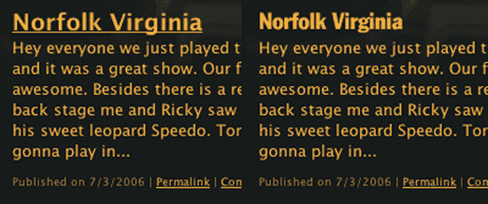

**图 2.8。左边是普通的 HTML 标题(也是没有 Flash 的用户会看到的)，右边是漂亮的 sIFRized 版本**

### 注意

图像替换和 sIFR 有他们的位置。它们为我们提供了改进设计排版的方法。而不牺牲可访问性。但是你必须谨慎使用它们。尤其是图像替换。在大型网站上，为每个标题创建一个自定义图像可能不太实际，尤其是当这些标题经常变化的时候。

## 吐槽擦亮

如果我不特别提及，还有一些额外的细节可能会被忽略。例如，布局左上角的徽标可以很容易地包含在主乐队照片中，从而减少制作页面所需的图像数量。然而，将徽标制作成一个单独的图像文件允许我将其设置为`<h1>`标签的背景，并使标签(以及徽标)链接到主页:

下面是 XHTML:

```html
<h1 id="logo">
  <a href="/" title="link to the homepage">Lifehouse</a>
</h1>
```

这是 CSS:

```html
h1#logo {
position:absolute;
z-index:100;
left:29px;
top:39px;
margin:0;padding:0;
}
h1#logo a {
display:block;
background:url(../i/logo_lifehouse.gif) no-repeat;
width:38px;
height:175px;
text-indent:-5000px;
}
```

瞧，我现在有了一个可点击的标志。

用火狐？您可能已经注意到，这种图像替换技术(前面提到的 Mike Rundle 的 Phark 方法)会导致单击时浏览器的虚线链接边框一直延伸到浏览器窗口的左边缘，这不是很吸引人。幸运的是，这可以通过将`a {outline:none;}`放到样式表中很容易地解决。图 2-9 and after (left) using {outline:none;} in the style sheet, when viewed in Firefox") 展示了前后效果。

另一项值得注意的是主导航(`<div id="nav">...</div>`)，它被标记为一个简单的无序列表。幸运的是，导航不是由 CMS 生成的，但可以手动标记，并包含在网站所有页面的服务器端，因为正如我前面提到的，CMS 输出模板不包含列表。导航条使用一种被称为导航矩阵(Navigation Matrix Reloaded，`http://superfluousbanter.org/archives/2004/05/navigation-matrix/`)的技术的简化变体来创建基于图像的导航和悬停效果。整个导航仅使用 CSS 中引用的一个图像(`nav_matrix.gif`)创建，如图 2-10 中的所示。

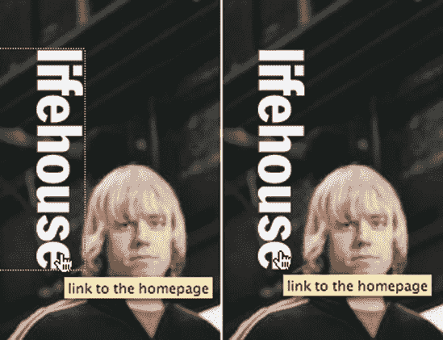

**图 2.9。在 Firefox** 中查看时，在样式表中使用`{outline:none;}`的前(右)和后(左)

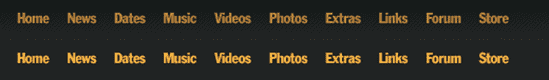

**图 2.10。采用导航矩阵重载技术的导航条**

# 设计的问题

在实现我所设想的设计时，我面临的一个更大的挑战是 Internet Explorer/Windows 和`#teaser <div>`的透明背景。我有两个选择:

*   通过导出一个带有透明区域和照片的图像来伪造所有浏览器的透明度。

*   使用透明的 PNG 作为背景图像，并使用 JavaScript 或 Internet Explorer 条件注释来“修复”Internet Explorer 版本 6 和更早版本的 PNG 透明度(Internet Explorer 7 包括对 PNG 透明度的本机支持；更透明的 PNG 善良见第五章。

我选择了第二个选项，让乐队成员更容易自己替换主页图像。更具体地说，我决定使用 Internet Explorer 条件注释来允许 Internet Explorer 使用其专有的 AlphaImageLoader 过滤器正确处理 PNG 几个好方法见`http://alistapart.com/articles/pngopacity/`。必要的代码放在文档的`<head>`中，如下所示:

```html
<!-- fixes IE 5.5/6 png transparency -->
  <!--[if gte IE 5.5]>
    <![if lt IE 7]>
      <style type="text/css">
        #sidebar-tab { filter:progid:DXImageTransform.Microsoft.
        AlphaImageLoader(src='i/bg_sidebartab_events.png');
        background-image:none; }
        #teaser {
        background-image:none;
        z-index:10; }
        #teaser-ie { filter:progid:DXImageTransform.Microsoft.
        AlphaImageLoader(src='i/bg_teaser.png',sizingMethod='crop');
        position:absolute;
        left:0;
        bottom:0;
        width:507px;
        height:230px;
        bottom:-1px;
        z-index:0; }
      </style>
    <![endif]>
<![endif]-->
```

我还使用这个块来调整每个受影响的`<div>`的 CSS，这样标记都在一个地方。理想情况下，这个“一个地方”应该是外部样式表。不幸的是，Internet Explorer 条件注释只能在 HTML 文档中工作，尽管您可以*将特定于 Internet Explorer 的样式*放在一个单独的样式表中，并在条件注释中链接它。在准备一张新照片时，唯一需要定制的，并且如果客户忘记也不会“破坏”设计的，是照片底部边缘的阴影。但是，如果您不想在 Internet Explorer 6 和更早版本中使用 JavaScript 或专有解决方法来支持 PNG 透明度，并且如果在您的生产环境中创建特殊图像不成问题，那么伪造透明度仍然是一个可行的选择。

## 这样的#挑逗

设计完`#teaser <div>`后，我意识到我只考虑了一个单行的`<h3>`标题(有或没有 sIFR)。由于`<div>`的高度和背景图像已经指定，如果使用更长的文章标题，这肯定会引起问题。所以我决定完全移除`#teaser`的指定高度，并增加`<div>`的底部填充。因为入口页脚和`read more`按钮是绝对定位的，所以不受这个变化的影响；只有`<h3>`标题和`<p>`会与填充互动。我调整了透明背景图片(`bg_teaser.png`)使其更高(300px 比较合理)，并重新保存了底部带有阴影的乐队照片。这张照片原本是放在`#teaser`的背景图片上，但是现在`<div>`的高度是可变的，这样就不行了。然而，我仍然可以在`bg_teaser.png`上保留左边的阴影。这给出了一个在`#teaser <div>`中使用多行标题的解决方案，如图图 2-11 所示。

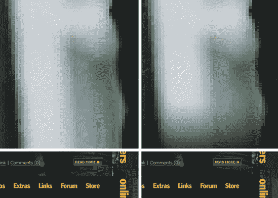

**图 2.11。这是一个微妙的区别，但主照片底部的阴影允许图像的底部融入下面导航栏的背景色，并与`#teaser <div>`的透明背景配合得很好。**

## 使用 Internet Explorer

在 Internet Explorer 6 中还可以看到一些奇怪的东西(不足为奇)，但这些几乎都通过使用 Star-HTML hack 得到了解决，这是 Holly hack 的一部分，以 Holly Bergevinand 命名，并重新声明了问题元素的规则。Star-HTML hack 利用了 Internet Explorer 版本 6 和更早版本的渲染引擎所识别的额外元素。这个*通用选择器* ( `*`)在`<html>`之外，由于它被任何非 Internet Explorer 浏览器忽略，所以可以用来向 Internet Explorer 发送特定的样式。

以主页上显示的乐队标志 CSS 为例:

```html
h1#logo {
position:absolute;
left:15px;
top:20px;
margin:0;padding:0;
}

body.homepage h1#logo {
z-index:100;
left:29px;
top:39px;
}
```

Internet Explorer 版本 6 对绝对定位和`z-index`不太友好，因此徽标被呈现为不可见的。它仍然在那里，但浏览器选择不在我们可以*看到*的地方显示它。因此，不要花费大量的时间来制定一个在所有浏览器上都能正常工作的解决方案——这是理想的情况，但是请记住，紧张的预算和时间表——改变`<h1>`在 Internet Explorer 中的显示方式才是正确的做法。Star-HTML hack 允许我们将不同的风格发送到 *only* Internet Explorer:

```html
* html body.homepage h1#logo {
position:relative;
margin-bottom:-170px;
}
```

所以我把定位从`position:absolute`改为`position:relative`，然后调整底部边距，直到 logo 定位到我想要的位置(本例中为 170 像素)。黑客之所以能成功，是因为它有更高的特异性(`* html body.homepage h1#logo`比`body.homepage h1#logo`更具体)，所以它不仅是唯一能理解这一规则的浏览器，还赋予了它比之前的规则更高的优先权。

还有一件事:因为允许这种攻击工作的缺陷在 Internet Explorer 7 中已经被修复，所以最好将这种攻击和任何其他针对 Internet Explorer 的攻击放在一个单独的样式表中，并在条件注释中链接它，这将在版本 7 中隐藏它，如下所示:

```html
<!--[if lte IE 6]>
  <link rel="stylesheet" href="css/iehacks.css" type="text/css" media="screen" />
<![endif]>
```

当时间至关重要时，hacks 可以保护您的理智和您的项目免受 Internet Explorer 6 和更早版本中糟糕的标准支持的影响。但是一旦新的版本出现，这种情况就不一定了。如果您使用 hacks，那么您必须做好准备，如果将来 hacks 中断，您可能不得不重新访问旧的项目。

### 注意

尽管 Internet Explorer 在渲染错误方面受到了很多负面的关注。事实是所有的浏览器都有 bug。我们只需要找到最好的方法来解决那些给我们带来最多问题的问题。

# 结论

如果你检查现场站点的源代码，你会注意到有多少不必要的标记仍然存在于他们的 CMS 结构中。优化输出是一项持续的工作，我将继续向标签的开发团队提出建议。最后，如果您因为某种原因必须使用不受您完全控制的 CMS，重要的是要记住，仍然有许多技巧和工具可供您使用，以帮助您避免陷入在生成的标记的寒冷和狭窄的范围内创建无聊设计的窠臼。作为一名设计师，挑战 CMS 是值得的，而不是为了满足技术要求而简化你的设计。当网站上线时，你一定会睡得更好*