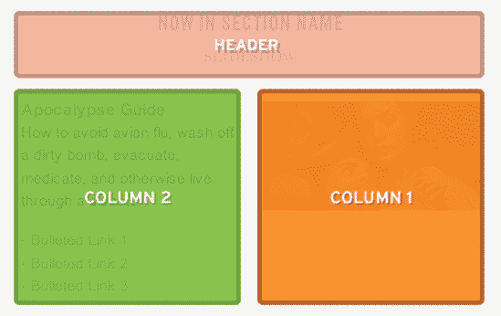
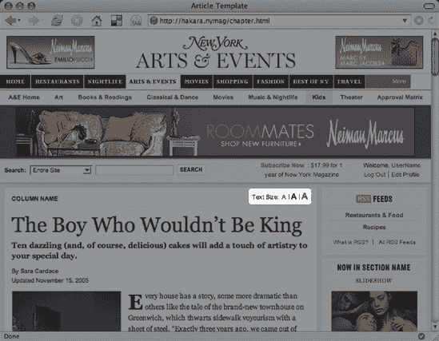

# 三、纽约杂志：天哪，多么优雅的`<body>`

**ethan marcotte**

`www.vertua.com`

**伊森·马科特**从事在线设计和开发已经近十年了，他仍然对有这么多东西需要学习感到惊讶和兴奋。他是 Vertua Studios ( `www.vertua.com`)的联合创始人和设计主管，这是一家熟悉标准的设计工作室，致力于构建优雅、可用的网站。

Ethan 已经成为基于标准的网页设计领域备受尊敬的声音。他是网页设计世界和西南偏南互动会议的重要发言人，他还经营着一个流行的(如果不经常更新的话)`sidesh0w.com`博客。他的客户包括《??》杂志、哈佛大学、华特·迪士尼公司和道富银行。

长大后，伊森想成为一名不可阻挡的机器人忍者(`www.unstoppablerobotninja.com`)。哔。


# 莫‘新城，莫’风格

老实说，重新设计《??》杂志网站对我来说是一种改变。我的小公司 Vertua ( `www.vertua.com`)通常标榜自己是一家提供全面服务的网店，或者至少是一家“一人军团”工作室所能提供的全面服务。然而，这个项目是一个受欢迎的改变，因为它本质上是一个“纯代码”的工作:该杂志与另一家工作室合作设计新网站，并正在寻找一个人来构建基于标准的模板。(我想在这里开一个“龙争虎斗”的玩笑，但我认为这很愚蠢。)

重新设计的模板列表令人印象深刻:该杂志在网站上有多年的遗留内容，都以不同的布局和模板呈现。此外，该杂志的内容管理系统(CMS)功能强大，但相当轻便——许多页面内容是由一组技术熟练但基本上无技术含量的内容制作者手工制作的。那么，基于标准的设计如何让杂志员工的生活更轻松呢？

在这一章中，我将讨论如何将多个`class`值赋给一个元素(在这种情况下，`body`可以真正简化你的代码，使你的级联样式表(CSS)更加模块化。通过编写 CSS 代码来检测您在`body`元素的`class`中写入的不同“切换”，您的样式表可以在页面上以截然不同的方式设计相同的标记。结果是所需的 HTML 模板数量大幅减少，并且能够对页面设计进行彻底的更改。

对于本章的大部分内容，我们将集中在通用文章模板上，如图 3-1 所示。

闲聊结束后，让我们一步一步地看一下如何将这些放在一起。


**图 3.1。成品文章模板**

# 开始使用

文章模板的交付要求它是一个灵活宽度的设计，在右边有一个固定宽度的侧边栏。图 3-2 向我们展示了页面需要如何伸缩。


**图 3.2。页面布局要求。左列灵活；右列是固定的。**

为了给 *New York* 杂志创建一个带有固定宽度侧边栏的流动宽度内容区域，我使用了 Ryan Brill 的负边距技术，这在`http://alistapart.com/articles/negativemargins`有详细介绍。在研究了这种方法之后，我们可以创建一个空的标记外壳，准备接收内容的设计:

```html
<!DOCTYPE html PUBLIC "-//W3C//DTD XHTML 1.0 Transitional//EN"
  "http://www.w3.org/TR/xhtml1/DTD/xhtml1-transitional.dtd">

<html >
<head>

<title>Article Template</title>

<meta http-equiv="Content-Type" content="text/html; charset=utf-8" />

<link type="text/css" rel="style sheet" href="/style/screen.css"
  media="screen, projection" />
<!--[if lt IE 7]>
<link type="text/css" rel="style sheet" href="/style/patches-ie.css"
  media="screen, projection" />
<![endif]-->

</head>

<body id="www-newyorkmag-com">

<div id="wrap">
  <div id="content">
    <div id="content-layout">
      <div id="content-primary-wrap">
        <div id="content-primary">

        </div><!-- /end #content-primary -->
      </div><!-- /end #content-primary-wrap -->

      <div id="content-secondary">

      </div><!-- /end #content-secondary -->
    </div><!-- /end #content-layout -->
  </div><!-- /end #content -->
</div><!-- /end #wrap -->

</body>
</html>
```

根据 Brill 文章中概述的方法，我们不仅需要两个内容区域的两个`div`(发明名称为`content-primary`和`content-secondary`)，还需要一个围绕`content-primary`的包装器`div`，姑且称之为`content-primary-wrap`。忠实的信徒们，请继续关注:稍后我们会在这个包装上看到更多内容。

## 构建 CSS

在内容区域上方，您可能会注意到文档的`head`中有两个`link`元素:一个用于`screen.css`，另一个用于`patches-ie.css`。在我们的`linked`样式表`screen.css`中，我放置了以下内容:

```html
import url("core.css");

/*\*//*/
import url("patches-mac.ie5.css");
/03/
```

在第一行中，`import`规则(`www.w3.org/TR/CSS21/cascade.html#at-import`)引用了另一个外部 CSS 文件`core.css`。这个样式表包含了我们的大部分 CSS 规则，没有任何特定于浏览器的样式表补丁。`core.css`所有浏览器都可以看到，包含我们纯粹的、无黑客的风格规则。

说到黑客，这正是第二条`import`语句所包含的内容。那一系列看起来奇怪的 CSS 注释实际上是 IE5/Mac 带通滤波器(`www.stopdesign.com/examples/ie5mac-bpf`)，它可以防止除了麦金塔上的 Internet Explorer 5 (IE5)之外的任何浏览器*看到其中的代码。所以现在，有了我们的半隐藏的`patches-mac.ie5.css`，我们可以在浏览器中放置任何样式规则来解决 CSS 错误。*

为什么要为这种 CSS 中的 CSS 方法费心呢？这种方法的好处之一是易于维护:如果我们需要停止支持 IE5/Mac，通过分离这些代码，我们可以更容易地删除这些 CSS“补丁”。我们不需要筛选一个样式表的几百行代码，相反，我们可以将这些修复隔离在一个单独的文件中。一旦我们真的需要停止对那个浏览器的支持，我们可以简单地删除我们的`screen.css`文件中的那个`import`语句，就和 IE5 说拜拜了。

回到我们的 HTML 模板，我们看到`patches-ie.css`被一些奇怪的注释包围着:

```html
<!--[if lt IE 7]>
  <link type="text/css" rel="style sheet" href="/style/2/ie-width.css"
    media="screen, projection" />
<![endif]-->
```

这些被称为**条件注释**，它们是一个仅用于 IE 的 HTML 扩展，允许我们在标记中构建编程逻辑。我们可以为 Windows 上的特定版本的 Internet Explorer 提供大量标记，在这个特殊的注释语法中指定版本号和其他条件。

### 注意

条件注释是专有的。HTML 的非标准扩展，因此。这些年来，它们一直是争议不小的话题。你可以在微软的网站(`http://msdn.microsoft.com/workshop/author/dhtml/overview/`ccoment _ ovw . ASP)以及众多的行业博客上找到更多关于条件评论的信息，比如 mezzoblue ( `www.mezzoblue.com/archives/2005/11/03/ie7_conditio`)。

在这里，我们使用那些条件注释来隐藏我们的第二个链接，它来自于比版本 7 ( `<!--[if lt IE 7]>`)更早的 IE *，然后链接到`patches-ie.css`中的另外两个样式表，就像这样:*

```html
import url("patches-win.iex.css");

media tty {
  i{content:"\";/*" "*/}} import 'patches-win.ie5.css'; /*";}
}/* */
```

与我们的 IE5/Mac 特定的 CSS 文件一样，这两个`import`规则引入了外部样式表，用于修补不同版本的 IE/Windows 中的错误:第一个规则适用于 Windows 上所有版本的 Internet Explorer，第二个规则仅适用于 IE5/Windows。更好的是，地球上所有其他非 IE 浏览器都不知道这些特定于浏览器的变通办法，因为这些条件注释被符合标准的浏览器视为*常规* HTML 注释。因此，到`patches-ie.css`的链接对大多数浏览器来说是不可见的，可以被 IE/Windows 轻松解析。

在这一点上，你可能想知道(阅读:“疯狂地对着天花板尖叫”)为什么你要这样麻烦地分叉你的 CSS。为什么要链接到两个单独的样式表，它们只存在于`import` *其他* CSS 文件中，其中一些除了不同浏览器特定的 CSS 错误的变通方法之外什么都没有？(参见图 3-3 。)

正如你可能意识到的，你有很多方法可以在你的其他 CSS 规则旁边插入浏览器特定的 CSS 补丁(见`http://cssdiscuss.incutio.com/?page=CssHack`中的一些例子)。虽然将所有 CSS 保存在一个文件中只会让您担心一个 CSS 文件，但跟踪和更新各个浏览器的修复程序很快就会变成一场噩梦。使用多样式表方法，您可以智能地将 CSS 补丁隔离到特定于浏览器的样式表中，这将使未来的更新变得轻而易举。当你停止支持一个浏览器时会发生什么？好吧，不用在超过 2000 行的样式表中搜索你写在主 CSS 文件中的每个 IE5/Mac hack，你可以简单地删除在一个`link` ed 样式表中对该浏览器 CSS 补丁的`import`引用。努夫说。

有了这个 hack 管理框架，我们现在可以开始做一些有趣的事情了:对文档的标记应用一些基本的样式。是的，我知道是时候了。


**图 3.3。我们的 CSS 架构**

### 注意

这里概述的方法受到了 Molly Holzschlag 的优秀文章“集成 Web 设计:长期 CSS 黑客管理的策略”(`www.informit.com/articles/article.asp?p=170511&rl=1`)的启发。这篇文章写于将近两年前，今天读起来和它第一次发表时一样好。阅读它，标记它，冲洗，重复。

## 添加图层样式

好了，关于浏览器 bug 和 CSS 补丁说够了。让我们给`core.css`添加一些基本的样式:

```html
body {
  background: #FFF;
  color: #000;
  font: 62.5%/1.5 Arial, Helvetica, Verdana, Geneva, sans-serif;
  margin: 0;
  padding: 0;
}

#wrap {
  margin: 0 auto;
  min-width: 770px;
  max-width: 980px;
}

#content {
  background-color: #EBEAE8;
  border-top: 1px solid #D6D5D3;
  padding: 7px 8px 9px;
}

#content-layout {
  background: #FFF;
}
```

通过这几行代码，我们彻底改变了稀疏的 XHTML 的外观。我们在`body`上建立一些基本的字体和颜色属性；给`#content`来点。。。嗯，灰色；通过在我们的“包装材质”`div`上放置自动镶边来突出我们的设计。在图 3-4 中，你可以看到我们已经走了多远:我们的两个即将建成的柱子被很好地框住了，尽管它们是直接叠在一起的。


**图 3.4。`div` s** 的默认堆叠顺序

此外，我们将`min-width`和`max-width`值应用于`#wrap`，确保我们的设计符合客户的目标。模板的宽度将扩大到 980 像素，然后缩小到 770 像素。看起来不错，不是吗？

嗯，差不多了。通常会有一个蓝色“E”形的小问题:Internet Explorer 及以下版本不支持`max-width`和`min-width`属性。对于 Windows 上的 IE，我们有很多解决方法。然而，对于《??》杂志来说，我选择了下面这段 CSS:

```html
#wrap {
  width:expression(document.body.clientWidth > 980 ? "980px" : 
    (document.body.clientWidth < 772 ? "770px": "auto"));
}
```

`expression()`是一个**动态属性**，是微软的专有发明(`http://msdn.microsoft.com/workshop/author/dhtml/reference/methods/setexpression.asp`)，只能在 Windows 上的 Internet Explorer 中工作。它混淆了样式表和脚本之间原本清晰的界限，正如你所看到的，我已经直接在`#wrap`规则中写了一小段 JavaScript。当由 Internet Explorer 加载时，这个 JavaScript 检测页面的宽度(使用`document.body.clientWidth`，另一个 IE 专用的代码)，如果窗口变得比我们的目标宽度大或小，就限制`#wrap div`的宽度。

在这一点上，观众中的标准化者可能会问，“但是 Ethan，你为什么要在一个符合标准的模板中使用非标准代码呢？你住在哪里，好让我朝你讨厌 W3C 的房子扔尖棍子？”

正是在这一点上，我们众多的 CSS“补丁”文件派上了用场。由于这只是针对 IE/Windows 的修复，我们可以安全地将无效代码放在我们的`patches-win.iex.css`文件中。藏在这个单独的文件中，我们的非标准代码对符合标准的浏览器和设备是隐藏的，是的，这包括受人喜爱的 W3C CSS 验证器。

## 负的边距和分栏等等！天啊。

有了一些标记和 CSS 基础，是时候完成我们的专栏了。瑞安·布里尔的负边际技术(`http://alistapart.com/articles/negativemargins`)是通过三个简单的步骤实现的:

1.  在固定宽度的侧边栏上设置宽度(这里是`content-secondary`)。

2.  向左浮动`content-primary-wrap`容器，将其宽度设置为 100%。

3.  在容器上设置一个负数`margin-right`，它的宽度应该等于第一步中工具条的宽度。

所需的 CSS 就像听起来一样简单。首先，我们需要浮动我们的两列，就像这样:

```html
#content-primary-wrap {
  float: left;
  width: 100%;
}

#content-primary {
  padding: 0 12px 0 13px;
}

#content-secondary {
  float: right;
}
```

在这一点上，快速预览我们的代码显示没有太多变化，除了我们丢失了部分灰色边框(图 3-5 )。

你可能会问，以蒂姆·伯纳斯·李的名义，这是怎么回事？或者你可能不是。我们真的不知道。


**图 3.5。布局没变，但是我们的边界在哪里？**

**清算时间**

尽管我们的两个内容`div`看起来*与之前的*没有太大的不同，但它们仍然是浮动元素，因此，它们将从它们的非浮动容器`content-layout div`中“逃离”。所以我们在文档顶部看到的边界实际上是`content-layout`的整个*边界:它包含的两个浮动的`div`已经从它们的父容器中流出，有效地完全折叠了我们可怜的容器。所以`content-layout`现在没有非浮动元素来给它一些高度，我们可爱的四边边框看起来只是一条粗灰线。这自然不行。但不要一开始就咬牙切齿、揪头发。谢天谢地，有一个解决方案。*

确保我们的集装箱。。。嗯，*包含*两列，我们用`http://positioniseverything.net/easyclearing.html`写的“简易清除法”。首先，我们将以下内容放在我们的`core.css`文件中:

```html
#content-layout:after {
  content: ".";
  display: block;
  height: 0;
  clear: both;
  visibility: hidden;
}
```

这里我们使用了`:after`伪元素(`www.w3.org/TR/CSS21/generate.html#x5`)在容器的末尾，在所有其他元素之后生成额外的内容(即一个句点)。这些额外的内容对用户来说是隐藏的，但是变成了一个块级的元素，它将`clear`标记中在它之前的所有其他浮动。不幸的是，这一规则在 IE 的任何当前版本中都不起作用。更重要的是，为了安抚 IE 的 Windows 版本，我们实际上需要*两个*解决方案:一个是最新版本的 7，在撰写本文时这是一个公共测试版(但应该会在书上架时正式发布)，另一个是对目前使用的早期版本的黑客攻击。

为了让 IE7 运行得更好，我们只需在我们的`:after`规则后插入以下内容:

```html
#content-layout {
  display: inline-block;
  display: block;
}
```

值得称赞的是，网页设计师和标准大师 Roger Johansson ( `www.456bereastreet.com`)是第一个发布这个解决方案的人。`display: inline-block;`触发 IE7 中的非标准`hasLayout`属性，强制容器自动包含其中的任何浮动元素。

### 注意

更多关于 hasLayout 的信息，请阅读 Ingo Chao 关于该主题的优秀文章:`www.satzansatz.de/cssd/onhavinglayout.html`。当然，这样做很可能会让你的眼睛斜视和/或头发脱落，所以如果你完全相信这一点，也许是最好的。

为了在旧版本的 IE/Windows 中触发`hasLayout`，让我们将以下规则添加到我们的`patches-win.iex.css`文件中:

```html
#content-layout {
  height: 1%;
}
```

最后，让我们打开我们的`patches-mac.ie5.css`文件，添加以下内容:

```html
#content-layout {
  display: inline-table;
}
```

正如法国设计师所言， *le voil* 图 3-6 向我们展示了我们的彩车再次被遏制，我们的边境线坚强、灰暗、骄傲地屹立着。


**图 3.6。随着一些清理的实现，我们的边界又回来了。**

我从没说过我擅长这个“隐喻”的东西。继续前进。

## 获得列-tastic(最终)

现在我们的容器已经回到正轨，我们需要做的就是给我们的`div`应用适当的边距:给`content-primary-wrap`一个负的右边距，给`content-primary`一个右边距。这些边距中使用的值应该等于或大于我们现在要设置的`content-secondary`的宽度。

对于 190 像素宽的窄右列，我们可以使用以下代码:

```html
/*
  Set the column offset on the content divs
*/
#content-primary-wrap {
  margin-right: 200px;
}

#content-primary {
  margin-right: 200px;
}

/*
  Set the right-hand column width
*/
#content-secondary {
  width: 190px;
}
```

至此，我们的列效果完成，如图图 3-7 所示。


**图 3.7。最后，我们的两列布局成型。**

正如你在图 3-8 中所看到的，这种灵活宽度的布局在较小的窗口宽度中令人钦佩地缩小了，这应该会让我们的客户非常非常高兴。


**图 3.8。我们灵活的宽度设计令人钦佩地缩小到更小的窗口宽度。万岁！**

简单，是吗？但是请记住，我们有两个右边的列宽需要考虑:一个是我们刚刚编码的窄列宽，另一个是 360 像素的宽栏。我们必须为这个新的侧边栏宽度构建一个单独的模板吗，或者我们可以重用到目前为止所做的工作吗？你不喜欢引导性问题吗？

## 我的班芙是不可阻挡的

在这里，我们终于可以利用`body`元素上的`class`属性了。如果我们知道我们有两个独立的侧边栏列宽，为什么不相应地分配一个`class`来“描述”文档呢？所以对于我们狭窄的广告栏宽度，我选定了

```html
<body id="www-newyorkmag-com" class="ad-column-180">
```

对于更宽的一个，我用

```html
<body id="www-newyorkmag-com" class="ad-column-300">
```

### 注意

严格地说，这些类名可能不是最理想的。一般来说，尽量避免使用表示元素向用户显示的方式的类或 id 值(例如红色链接、大标题，甚至 ad-column-300)。避免使用这些“表象”名称的主要原因是它们不是特别经得起未来的考验:当你重新设计你的网站时会发生什么，所有那些红色链接元素都需要变成绿色？ad-layout-1 或 ad-layout-2 可能更抽象，可能更好一些；然而，我们认为制作人员可能会更好地管理更具描述性的名称，剩下的就是历史了。或者类名。或者什么的。

实际上，这给了我们的模板一种切换，我们可以利用我们的 CSS。如果我们知道这两个模板中的一个将被应用于我们的`body`元素，我们可以相应地修改我们的样式规则:

```html
/*
  Set the column offset on the content DIVs
*/
body.ad-column-180 #content-primary-wrap {
  margin-right: 200px;
}

body.ad-column-180 #content-primary {
  margin-right: 200px;
}

body.ad-column-300 #content-primary-wrap {
  margin-right: 370px;
}

body.ad-column-300 #content-primary {
  margin-right: 370px;
}

/*
  Set the right-hand column width
*/
body.ad-column-180 #content-secondary {
  width: 190px;
}

body.ad-column-300 #content-secondary {
  width: 360px;
}
```

在这里，我们充实了我们最初的规则，并用适当的`body.ad-column-180`和`body.ad-column-300`选择器为两个单独的列宽做准备。

### 注意

正如你可能已经注意到的，ad-column-300 列实际上将是 360 像素宽。我从来都不擅长数学，但这个小小的命名差异是有原因的:更宽的栏将容纳 300 像素宽的广告横幅。因为非技术内容生产者最终将“拥有”这些模板，所以我选定了一个对他们有意义的类名。

此外，我们可以将不同的水平重复背景图形应用到内容布局中(参见图 3-9 和 3-10 )，以在右栏后面产生“灰色”背景的错觉。


**图 3.9。右侧窄栏的灰色背景图像**


**图 3.10。右侧宽栏的灰色区域**

我们需要做的就是用下面的 CSS 替换我们的`content-layout`规则:

```html
#content-layout {
  background-color: #FFF;
  background-position: 100% 0;
  background-repeat: repeat-y;
}

body.ad-column-180 #content-layout {
  background-image: url("bg-ad-column-180.gif");
}

body.ad-column-300 #content-layout {
  background-image: url("bg-ad-column-300.gif");
}
```

我们栏目的“背景”会自动调整，如图图 3-11 和图 3-12 所示。


**图 3.11。窄图形是用`body`元素上的`ad-column-180 class`应用的。**


**图 3.12。通过将`class`切换到`ad-column-300`，我们已经为更宽的列切换到更大的图像。**

你可能会问，这种方法有什么好处？依靠这种`class`驱动的切换，我们的其余标记可以在两种布局场景中重用:只需将模板的`body`中的`ad-column-180`改为`ad-column-300`，我们就可以立即改变标记的显示样式。图 3-13 和 3-14 显示了这在两个不同的实时、生产就绪的文章模板上的实际应用，两者之间唯一的变化是`body`元素的`class`属性中的几个字符。这两个页面上的其余标记是相同的。我不知道你怎么想，但我对这种事情很感兴趣。


**图 3.13。我们完成的文章模板，在`body`元素的`class`属性中有`ad-column-180`。**


**图 3.14。完全相同的模板代码，但是在`class`中有`ad-column-300`。很辣。**

# 智能模块

因此，我们的页面级布局由新的`class`驱动的开关控制，让我们试着对页面的细节进行同样的控制。早些时候，我提到除了`body`元素的`class`属性，页面的标记还包括右边一栏中的一小部分内容块，或**模块**。就像我们刚刚创建的两列一样，这些模块会自动调整大小，以适应侧边栏的宽度。

让我们快速看一个例子,“现在在。。."模块。在其窄格式中(图 3-15 ，内容堆叠在一个单列中；然而，当`content-secondary`栏为宽格式时，两个内容区域并排放置(图 3-16 )。(我想郑重声明，这张图不是我选的。)


**图 3.15。狭义版的“现在在……”模块。我想郑重声明，我们没有选这张照片。**

使用我们从构建两列布局中学到的知识，让我们在这里尝试相同级别的标记重用。如果我们能有一个 HTML 模板用于这两种不同的模块布局，那将是理想的。

为此，让我们快速回顾一下本模块中不同的内容领域。我们可以看到有两个不同的内容区域，顶部有一个标题(图 3-17 )。即使在两栏版本中也是如此(图 3-18 )，但是第一个内容区域出现在右栏，第二个内容区域出现在其左侧。


**图 3.16。“现在流行...”的宽、两栏版本模块**


**图 3.17。解剖我们的狭窄模块**



**图 3.18。两栏宽格式布局**

因此，有了对两种布局选项(单列和两列)中不同内容区域的基本理解，我们就可以构建一个基本的标记框架了。

```html
<div class="block module-in-section">
  <div class="head">
    <h5></h5>
    <h6></h6>
  </div>
  <div class="content">
    <div class="row columns-2">
      <div class="column col-1">
        
      </div>
      <div class="column col-2">
        <h5><a href="#">Apocalypse Guide</a></h5>
        <p>How to avoid avian flu, wash off a dirty bomb, evacuate,
          medicate, and otherwise live through a disaster.</p>
        <ul>
          <li><a href="#">Bulleted Link 1</a></li>
          <li><a href="#">Bulleted Link 2</a></li>
          <li><a href="#">Bulleted Link 3</a></li>
        </ul>
      </div>
    </div>
  </div>
</div><!-- /end div.module-in-section -->
```

这里有一些事项需要注意:

*   模块的`class`属性的`block`值是我在整个*纽约*杂志模板中放置的一段可重用的标记。它只是简单的一个简单的清算方法的挂钩，并被添加到那些规则中(`.block:after`等)。)以便它包含内部的任何浮动。

*   内容区域中的`row`类提供了类似的功能:如果它的任何一个子“列”`div`被浮动，它们不会逃脱它们的父“行”`div`。

*   模块的`class` ( `module-in-section`)中的另一个值充当这种类型模块的一种唯一标识符。我不能在这里使用一个真正的`id`属性，因为一个页面上可能会出现不止一个这种类型的模块，而且根据 HTML 规范，`id`在页面中必须是唯一的。

标记就绪后，我们可以继续对其进行样式化。鉴于该模块的宽版本和窄版本具有相同的美学品质(如排版、颜色和背景图像)，我在这里就不讨论它们了；相反，让我们专注于构建我们的两个内容栏。

在单列模式中，我们可以让标记的源顺序为我们工作。第一列将简单地堆叠在第二列之上，如图图 3-17 所示。然而，我们可以应用一点 CSS 来清理一些东西:

```html
.module-in-section .content {
  padding: 0 14px 13px;
}

body.ad-column-180 .module-in-section .col-1 {
  text-align: center;
  margin: 7px 0 10px;
}
```

第一个规则只是对我们的内容`div`应用一些填充，给我们的列一些喘息的空间。第二条规则将列内容(即`img`)居中，并添加一些顶部和底部边距。但是你可能已经注意到了，我们在第二个规则前面加上了同样的`body.ad-column-180`规则，我们用它来创建我们的窄边栏(在“我的班级-fu 是不可阻挡的”部分)。一个`class`，两个独立效果。轻量级代码是一件美好的事情，不是吗？

从这个逻辑出发，我们可以将`ad-column-300 class`应用到`body`元素来创建我们的两列效果。我们需要浮动每一列`div`，第一列浮动到右边，第二列浮动到左边，如图 3-19 所示。

```html
body.ad-column-300 .module-in-section .column {
  width: 157px;
}

body.ad-column-300 .module-in-section .col-1 {
  float: right;
}

body.ad-column-300 .module-in-section .col-2 {
  float: left;
}
```


**图 3.19。让我们的两列布局就位的代码**

所以我们有了它:我们的`body`属性中的一个单独的`class`值可以作为我们侧边栏中每个模块的一种交通警察。我们已经编写了一些期望(并利用)出现`ad-column-180`或`ad-column-300`的 CSS，让我们的标记完全保持原样。

# 附加类别，附加控制

此时，我们已经在`class`属性中使用了一个值。通过使用`ad-column-180`或`ad-column-300`，我们可以立即重新格式化右侧边栏及其内容。正如我们已经讨论过的，`class`属性可以接受多个值，但是我们可以使用`body`元素来控制页面表示的其他方面吗？我又开始问引导性问题了。

## 从小尺寸开始(980 像素)

当我参与纽约杂志网站的重新设计时，我被告知制作团队希望能够选择性地覆盖某些页面的灵活宽度设计，有效地将页面宽度固定在 980 像素。据推测，某些页面可能包含宽幅媒体(例如，大幅照片)，而客户希望确保页面布局的其余部分保持不变。

让我们再来看看我们的`#wrap`规则，它包含了我们的`min-width`和`max-width`参数:

```html
#wrap {
  margin: 0 auto;
  min-width: 770px;
  max-width: 980px;
}
```

因此，如果这是默认行为，让我们给我们的`body`元素添加一个新的`class`值来覆盖它的 say，“`fixed`”？

```html
<body id="www-newyorkmag-com" class="ad-column-180 fixed">
```

我们现在可以放入下面的 CSS，将我们的灵活设计变成静态设计:

```html
body.fixed #wrap {
  width: 980px;
}
```

现在我们有了。既然我们现在已经在我们的`wrap`块上设置了宽度，那么`min-width`和`max-width`属性就过时了。我们设计的容器`div`固定在要求的 980 像素，这满足了我们客户的要求。

### 注意

关于多个类名的一个警告:老版本的 IE5/Mac 有一个空格解析错误(`www.macedition.com/cb/ie5macbugs/substringbug.html`)，当遇到一个类名是另一个类的子串时，这个错误会导致它变得混乱。因此，尽量使你所应用的类类型的类别尽可能的独特，并在浏览器中进行彻底的测试。

## 搭售 JavaScript

我们可以用`body class`调用一些其他的视觉效果，但是让我们暂时离开设计。毕竟这个技术远不是一招小马。我们还可以将类附加到文档中，作为 JavaScript 驱动的行为的标志，为网站的设计增加另一层基于标准的吸引力。

例如，在一些文章页面上有一组链接(图 3-20 )用于动态增加(图 3-21 )或减少(图 3-22 )页面上文章文本的大小。何必呢？嗯，这实际上是一个相当方便的辅助功能。如果读者视力下降，他可能不知道如何改变浏览器的文本大小。在页面上放置几个链接会以一种直接且易于使用的方式展示类似的功能。



**图 3.20。出现在网站某些页面上的文本大小控件**


**图 3.21。文本大小可以增加。。。**


**图 3.22。。。。或者通过使用页面上的链接来减少。我看得出来，你被难倒了。**

受古老的基于 JavaScript 的样式表切换器(`www.alistapart.com/stories/alternate`)的启发， *New York* 杂志的文本大小调整代码执行许多不同的任务。当用户点击其中一个链接时，一个额外的类被添加到`body`元素中，当它出现时，将相应地改变文章模板中文本的大小。此外，存储在用户浏览器上的 cookie 会记住用户的选择，并在用户返回时自动应用适当的文本大小。这是一段相当复杂的 JavaScript，但这可能是因为我们并不是 JavaScript 程序员的塞缪尔·L·杰克逊。

需要注意的是，你在图 3-20 中看到的链接实际上并不存在于 HTML 中。页面加载后，JavaScript 将三个“A”链接注入到页面中，确保控件只对浏览器支持它们的用户可用。我们对`body`元素的`class`表现出近乎强迫性的痴迷，我们可以使用该属性来触发我们的功能，这将允许我们的内容制作者将一个简单的单词放入`class`来调用该功能，从而将链接放入页面。

一如既往，让我们从我们的元素开始吧我知道，令人震惊。但是这一次，让我们使用`text-sizer`作为我们的新类:

```html
<body id="www-newyorkmag-com" class="ad-column-180 fixed text-sizer">
```

在我们从文档的`head`中引用的`scripts.js`文件中有一个名为`buildTextSizer`的函数:

```html
<script type="text/javascript" src="/path/to/scripts.js"></script>
```

这个函数有相当多的代码，所以如果你不是 JavaScript 忍者也不用担心(毕竟，我*肯定*不是)。幸运的是，我们最关心的部分发生在顶部:

```html
function buildTextSizer() {
  if (document.getElementsByTagName && document.createElement 
    && document.getElementById) {
    var trigger = document.getElementsByTagName("body")[0];
if (findWord("text-sizer", trigger.className)) {
      if (document.getElementById("article-content")) {
        var container = document.getElementById("article-content");
      } else {
        var container = document.getElementById("content-primary");
      }

      if (container) {
        // Build elements
        var slugs = new Array("small", "medium", "large");
        var controlContainer = document.createElement("div");
        var topList = document.createElement("ul");
        var innerList = document.createElement("ul");
        var listItem = document.createElement("li");
        var span = document.createElement("span");
        var labelText = document.createTextNode("Text Size:")

        // Loop over the text size "slugs", and build a link for
        //each one
        for (var i = 0; i < slugs.length; i++) {
          var text = document.createTextNode("A");
          var anchor = document.createElement("a");
          var item = document.createElement("li");

          anchor.appendChild(text);
```

```html
anchor.setAttribute("href", "javascript:textIt('txt-" +
            slugs[i] + "');");
          anchor.setAttribute("title", "Make the story text " +
            slugs[i] + ".");
          item.appendChild(anchor);
          item.setAttribute("id", "txt-" + slugs[i]);
          innerList.appendChild(item);
        }

        // Assemble everything, and insert it into the
        //document
        span.className = "label";
        span.appendChild(labelText);
        listItem.appendChild(span);
        listItem.appendChild(innerList);
        topList.appendChild(listItem);
        controlContainer.setAttribute("id", "text-size");
        controlContainer.appendChild(topList);
        container.insertBefore(controlContainer, container.
          childNodes[0]);
      }
    }
  }
}

/*
  Find full word (needle) in a string (haystack)
*/
function findWord(needle, haystack) {
  return haystack.match(needle + "\\b");
}
```

从本质上讲，我们这里有两个独立的函数:一个用于构建文本大小控制(`buildTextSizer`，继续我的获奖名称)，另一个函数是第一个函数使用的`findWord`。在用粗体突出显示的代码部分中，`buildTextSizer`检查我们的`body`元素(`var trigger = document.getElementsByTagName("body")[0];`)，并搜索其`class`属性中是否存在`text-sizer`字符串(`findWord("text-sizer", trigger.className)`)。如果搜索结果匹配，那么函数的其余部分继续构建文本大小调整链接；如果没有找到匹配(即如果`text-sizer`没有出现在`body`元素的`class`属性中)，那么函数停止运行，链接永远看不到。

由于该函数被设置为在站点的每个页面上触发，内容制作者可以有选择地将`class`放在他们希望显示大小控制的页面上，而在其他页面上省略它。如果在`body`元素中找不到`text-sizer`，该功能将会自动失败，这为网站的作者提供了切换该功能的灵活性和方便性。这当然是件好事。

# 总结

这一章绝不是在*杂志网站上使用`body`元素的`class`属性的详尽列表；我很乐意给你提供这样一份清单，但我不认为我能强迫你耐着性子看完托尔斯泰长度的一章关于`body`元素的内容。相反，我希望这一章中的信息能激发一些想法，让你明白这种多类值技术如何能给你带来好处，以及它的智能应用如何能减少你的站点的模板数量，减少标记混乱，并给你足够的 JavaScript 和 CSS 的钩子。在*纽约*杂志网站上，我们使用了额外的`class` es 来动态替换特定区域的徽标，并自动突出显示当前的导航标签。这方面的其他应用完全取决于你。*

Web 标准是关于改进对设计的控制，而不是维护庞大的代码。拥抱你的`body`，你的网站将更容易维护、更新和改进。当然，你的用户会喜欢的。